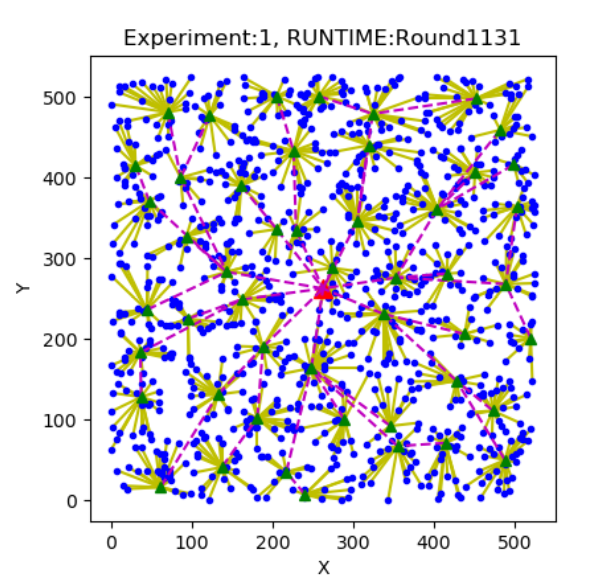
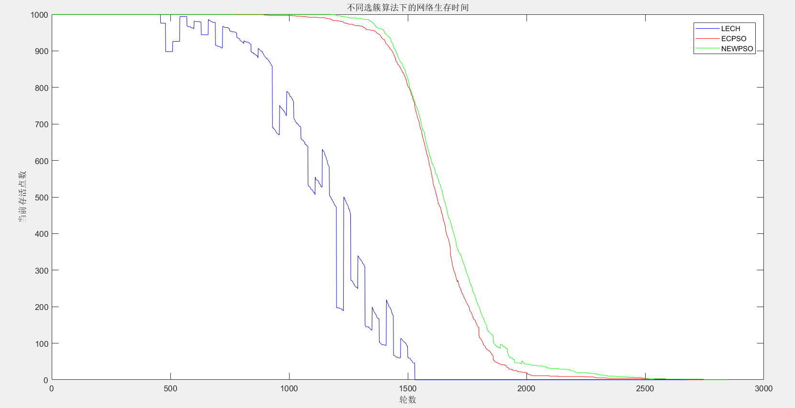
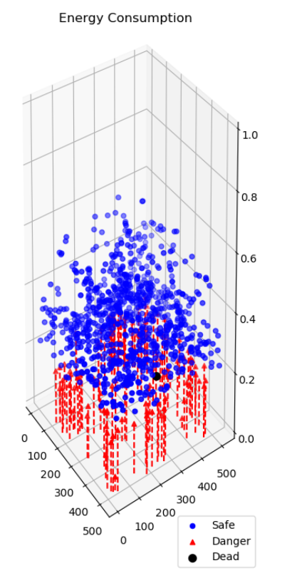

**Team members**: 

​		Minel Huang, Zobin Huang, Sijun Feng

The research could be divided into two parts: Research on Efficient Cluster-based Networking Protocol for WSN & Research on RISC-V-based Intelligent Sensing Terminal.

##  **Research on Efficient Cluster-based Networking Protocol for WSN**

Main references: 

1. A General Self-Organized Tree-Based Energy-Balance Routing Protocol for Wireless Sensor Network; 

2. A Survey on Successors of LEACH Protocol; 

3. Cluster head selection for energy efficient and delay-less routing in wireless sensor network

We first built an energy consumption model for wireless sensor network (WSN) and found that finding a optimal cluster heads is a NP-Hard problem. So we decided to use heuristic algorithm to solve this problem. Since the election of cluster heads is based on location, we introduced Particle Swarming Optimization (PSO) algorithm to WSN and increased Fit matrix dimensions to achieve network optimization. Finally we used Python to create simulation environment as follows:

Compared with LEACH and EC-PSO, our algorithm increased network lifetime by 110.4% and 23.4%.

When the nodes are about to die, the network energy distribution is shown in the figure below:

In addition, we introduced small grids to overcome the uneven distribution of nodes. The final result shows that our algorithm still get perfect performance.

Link:

​		The simulation codes based on Python: 

## **Research on RISC-V-based Intelligent Sensing Terminal**

We used STM32 and GD32 to implement the above networking protocols. The communication is based on 802.11g, and cluster head nodes would be AP mode. Finally we used 15 sensing nodes and 2 sink nodes to test the actual running effect of the protocol. The result was still perfect.

**Link**:

​		GD32 node project: https://github.com/NetH-Lab/Multi-mode-Intelligent-Sensing-Terminal-Autonomous-Collaboration-Technology/tree/main/LiteOS_Demos_WiFi

​		Sink node project: https://github.com/NetH-Lab/Multi-mode-Intelligent-Sensing-Terminal-Autonomous-Collaboration-Technology/tree/main/sink