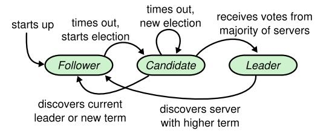

更新时间：2020-11-15

参考资料：

1. 《分布式一致性算法开发实践》. 赵辰. 北京大学出版社
2.  Ongaro D, Ousterhout J. In search of an understandable consensus algorithm[C]//2014 {USENIX} Annual Technical Conference ({USENIX}{ATC} 14). 2014: 305-319.
3.  [深入剖析区块链的共识算法 Raft & PBFT](https://www.cnblogs.com/davidwang456/articles/9001331.html)
4.  [一文搞懂Raft算法](https://www.cnblogs.com/xybaby/p/10124083.html)
5.  [Videos of Raft](http://thesecretlivesofdata.com/raft/)

## **学习笔记**

分布式一致性算法在哪里应用：replicated state machines

一致性的目的是，让所有的机器处于同一个状态。而机器是根据指令进行操作的，换句话说，如果我们能让机器按照同样的指令进行运作，它们就可以达到同样的状态。所以，一致性问题在本论文中被简化成各个计算机的指令集相同。在数据库中，指令的最小单元为Log，所以后文将以数据库为应用场景，叙述Raft算法。

### 一致性所应用的场景？

在开始Raft算法之前，我想先考虑一个问题，一致性算法到底应用在哪里？

首先，我们先从实际的应用场景出发。在很多数据中心中，重要数据需要实时进行备份，比如淘宝中的交易数据。所以在这一场景中，通常使用三个数据库进行描述：A为master，B和C为Backup。

对于一组request而言，为了保证每一条信息不会丢失，A, B, C数据库需要时刻保持强一致性，故一条request将在ABC都被写入后，再处理下一条request。显然，等待A, B, C都写入成功是需要时间开销的，对于淘宝、支付宝而言，时间开销过高是不能容忍的，所以引入一致性算法，在算法层面上降低备份的时间，我将带着这个问题去探讨Raft算法。

所以在Raft算法中，一致性问题被定位replicated log问题。在这里经过探讨我们发现，log一致并不能完全决定machine state，还需要A，B，C三台机器**存储的内容是一致**的。所以在目前看来，Raft算法仅仅能适用于备份问题，而不是一个通用的一致性算法。我也同样会带着这个问题来阅读论文。

### 一致性算法需要考虑什么

replicated log使各个机器状态一致，为主要问题。同时，算法还需要考虑“容错性”。对于一个分布式系统而言，“出错”是时刻可能发生的。由于使用了更多的机器来提高系统处理速度，整个系统中会出现错误的概率也随之提高。所以在一致性算法中，一定要考虑某个节点出错后的应对措施。在Raft中，作者考虑到了时延、网络分割、丢包、duplication（重复）和重排序问题。

### Raft Consensus Algorithm

Raft是一种leader-based算法，假设集群中存在一个leader，那么replicated log任务可以交给leader去做，这样大大简化了算法的理解难度。Raft可以被分为三类过程：normal operation，leader election和log replication。

### Raft basics

集群中包含三种状态的机器：*leader*, *follower*, *candidate*。在normal operation中，只有一个leader，其他的servers都是followers。followers都是被动的，即不会发布requests，仅会被动产生responds。在leader election中，candidates用于产生leader。Raft中使用term来表示时间长度，以leader election开始。

term的更新：每个节点都会维护本地的current，在通信过程中将捎带传输term。如果节点的term小于其他的，那么更新term至较大的值；如果candidate或leader发现它的term is out of date，它会立刻转变成follower state；如果节点收到一个stale term，则拒绝此次request

一个term包含一个election和一个normal operation，在一个term中节点可能发生如下的状态变化：

在本论文中，节点之间使用remote procedure calls (RPCs) 进行通信，RPCs分为RequestVote RPCs，由candidates发起用于投票，与AppendEntries，由leader发起用于复制log entries和提供heartbeat。

### Leader election

Raft使用heartbeat机制，heartbeat由leader发出。注意，heartbeat由RPCs承载，故当节点在一定时间内没有接受到heartbeat，也即在一定时间内没有收到有效的RPCs，则开启leader election。

election开始后，follower将自增其自身的term，并转换为candidate state。之后它votes for itself并issues RequestVote RPCs。之后可能会发生三种情况：

1. win the election: 节点得票数大于半数
2. another server establishes itself as leader
3. no winner

为了保证一次选举中只有一个leader，每个节点只能投1票。由于election是由节点自身发起的，故有可能出现多个节点先后发起election，其余节点的投票较为均匀，导致没有任何一个candidate的得票数大于半数，出现no winner，故引入randomized election timeouts。在election开始前，candidate将随机生成一个timeout，并只等待timeout这么长的时间

### Log replication

当leader收到client的request后，将把指令作为log中的新的entry，并发布AppendEntries RPCs。节点收到次RPC后，若复制成功则返回response，leader收到半数以上的response后将认为safely replicated，并开始运行此指令，返回给client result。若节点没有返回response，leader将继续向其发送RPC。

正常情况下log replication是不可能出错的，但假如leader在复制log时崩溃，使得followers没有完全复制log，则会导致follower之间的log时不一致的。在这时，新的leader将强迫其他的followers复制自己的log，保证系统依然保持一致性。那么，如何决定从哪里开始复制log呢？leader需要知道follower从哪一条entry开始，它们的logs不一致了。找到后，从该处复制log即可。

具体做法：AppendEntries RPCs中包含nextIndex字段，在选举leader后，leader首先和followers比对nextIndex，若不一致，则递减nextIndex，直至所有的followers和leader相同。而后移除冲突的entries

### Term的意义

term实际上是用来标识“谁才是老大”。我们首先要注意的是，term自增只出现于leader election阶段，所有节点开机时term都为0。所以，当term越大时，说明发出RPC的leader或candidate已经经历了很多次选举。正常的情况下，所有节点应该处于一个term，那么假若一个节点收到的RPC中的term，比其自身维护的term大说明什么呢？说明这两个节点有一段时间不处于同一个cluster中（可能是由于拥塞问题、时延问题、网络分割问题等）。那么假如我们规定term越大，其等级越高，节点无条件服从高term的RPC，系统将很快趋于稳定，达到容错的目的。

