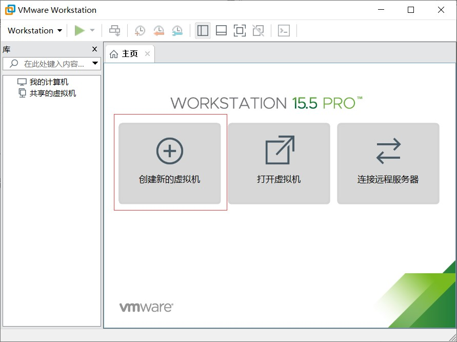
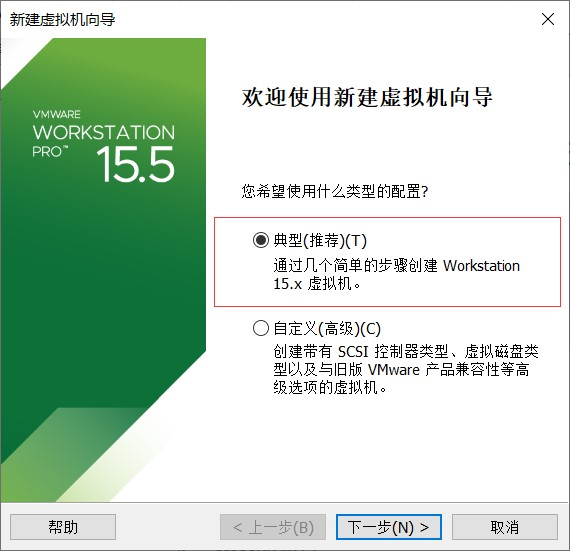
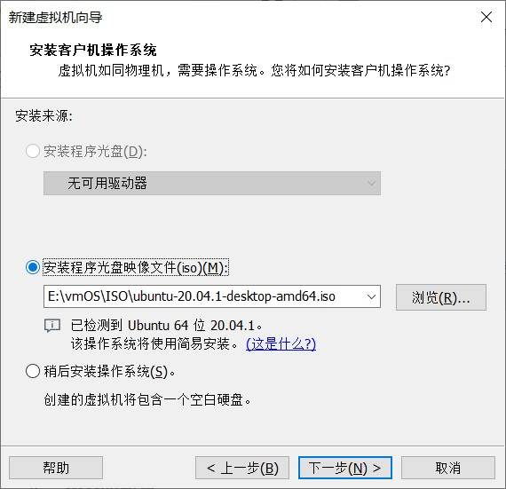
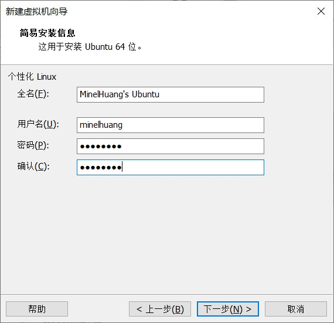
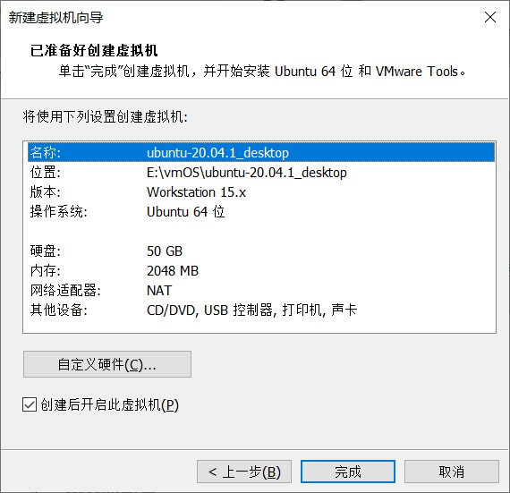
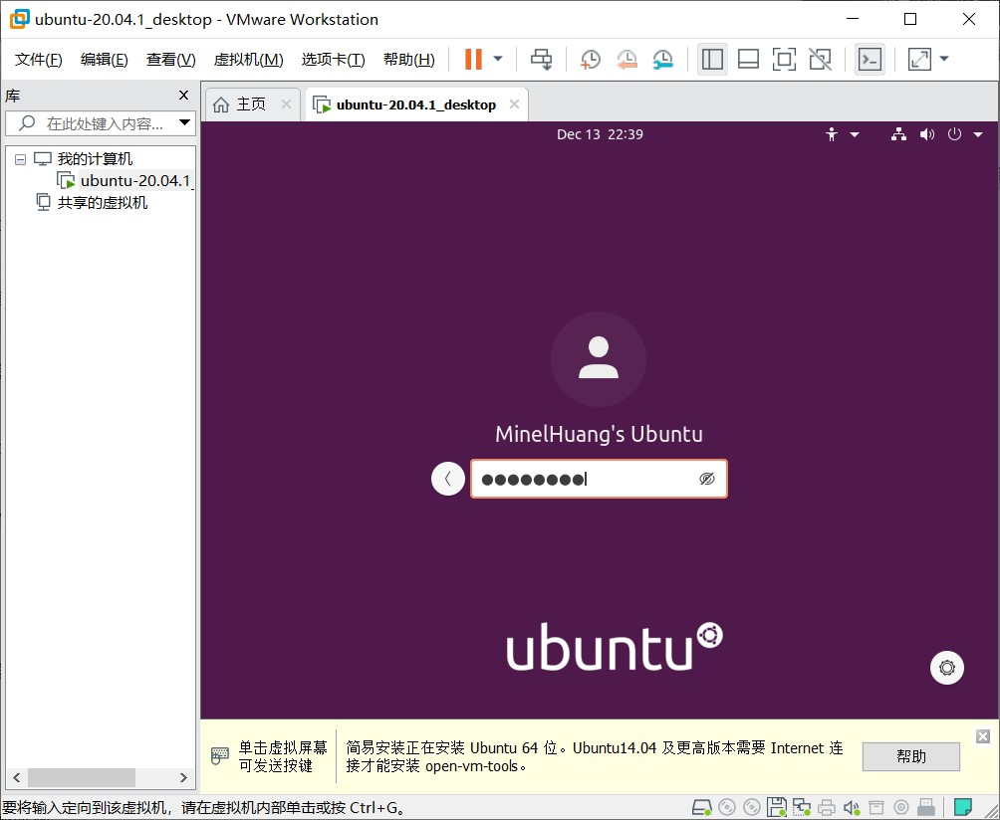
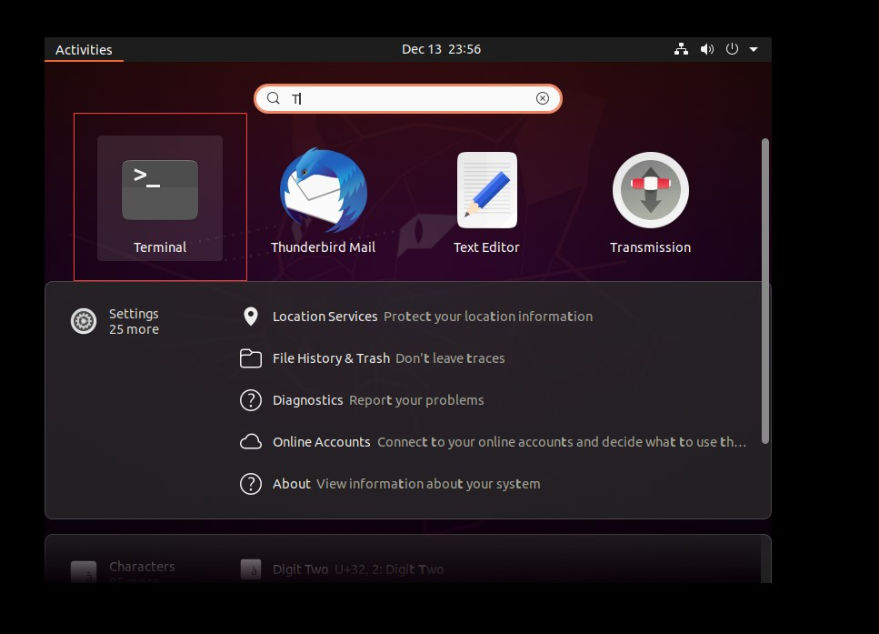
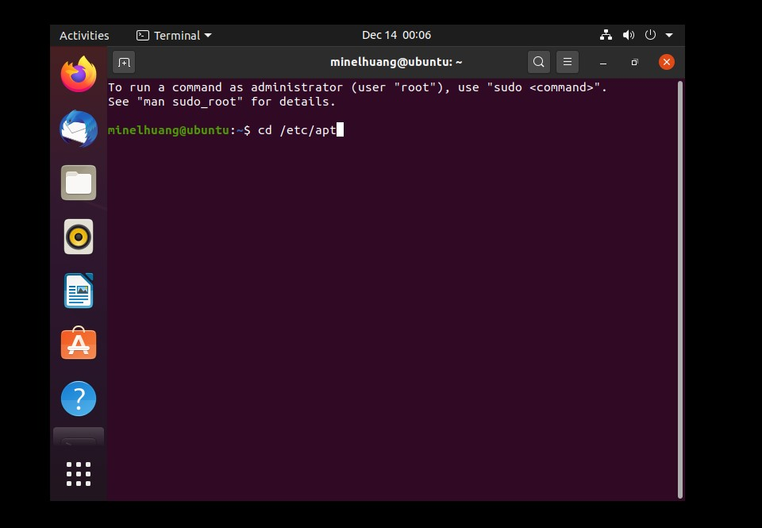

## 使用VMWare安装Ubuntu

### 1. 什么是VMWare

VMWare是一款虚拟机软件，可以使用户在Windows系统下运行其他操作系统的镜像。

好处：虚拟机中的操作系统与电脑本身系统完全分开，这样双方不会相互影响，避免把电脑搞瘫痪的状况发生。

 

### 2. Ubuntu镜像

镜像类似于安装包，ubuntu镜像可以从其官网https://ubuntu.com/中下载

 

### 3. 安装ubuntu桌面版

#### 3.1 文件管理

在硬盘中创立一个文件夹，集中存放所有的虚拟机

创建ISO文件以存放所有的镜像，随后按版本创建虚拟机本体存放如下：

#### 3.2 使用vmware安装ubuntu桌面版

##### 3.2.1 ubuntu桌面版

ubuntu分为桌面版和server版，其中最大的区别是桌面版具有可视化界面，而server是纯粹的命令行操作。

##### 3.2.2 安装步骤

注1：选择典型，博主并不懂自定义安装模式。

注2：选择欲安装的镜像文件

注3：该界面较为重要，此安装系统会帮助我们注册一个Linux用户名，类似于Windows下的用户名，故我们需要仔细记录下该界面中的用户名&密码

注4：选择刚刚文件夹中创建好的存放虚拟机的位置

注5：博主选择使用单个文件，拆分多个文件并不清楚其作用（未移植过虚拟机）

注6：完成创建

注7：安装完成

 

## Ubuntu的基本配置

### 1. 需要配置什么？

首先我们需要知道为什么要在Linux系统下开发而不是Windows系统下开发。首先想一想Windows难用在哪，开发任何东西，首先需要的是下载好开发软件，Windows下的下载需要在浏览器中寻找合适的安装包，并且下载而来的安装包不一定是正确的。Linux系统维护了一个安装包的集合，大家通过命令行下载对应的软件，不需要担心下载错误的问题。

 

那么我们的系统从哪里下载呢？这就是所谓的“源”。系统默认的源是不适用的，因为其数据库是在国外，所以第一件事即更换源，以提升我们的下载速度。

### 2. 更换源

这里推荐清华大学ubuntu源，地址为https://mirror.tuna.tsinghua.edu.cn/help/ubuntu/

更换源需要更改系统配置文件，文件位置在/etc/apt/sources.list

推荐大家使用命令行进行配置操作，而不是以windows的形式使用图形化界面操作

首先打开Terminal，此时我们的命令行在整个系统的根目录下，即所有的命令操作都是作用于该目录中

使用cd命令移动到目标路径

打开sources.list，注意打开要使用管理员模式

更改源，vi指令自行百度

更改结束后使用update命令更新源（sudo apt-get update）

### 3. 配置编译环境

博主主要使用linux写代码，故需要装编辑器与编译环境，编辑器博主使用vs code，编译环境的包含gcc, g++等

直接安装build-essential，打包安装编译环境

可以先装一个vim作为简单好用的编辑器

sudo apt-get install vim

其他的东西都可以用apt-get语句安装，非常方便

 

这样，ubuntu就安装成功了，可以写一个hello world看看能不能运行！

首先回到根目录 cd ~

创建一个.c文件 touch test.c

使用编辑器打开 vim test.c

编写hello world

使用gcc编译 gcc -o test test.c

运行test ./test

看看有无 hello world！