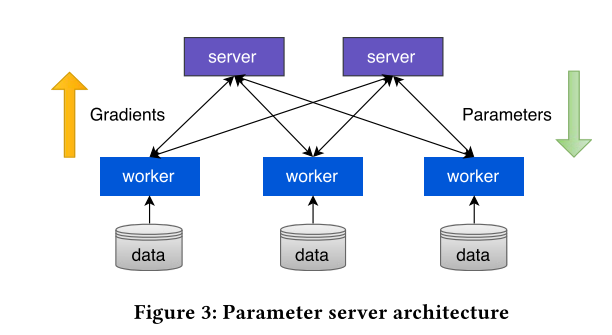
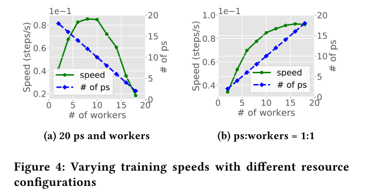
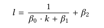
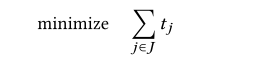
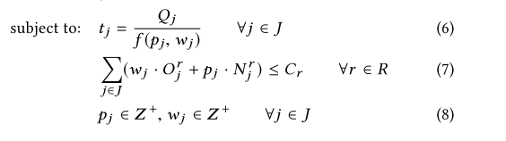
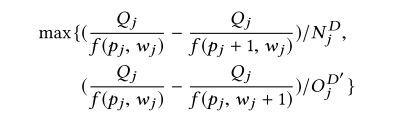

更新时间：2020-12-20

参考资料：
1. 论文：Optimus an efficient dynamic resource scheduler for deep learning clusters

## **DML模型训练流程**

在DML中，数据data首先被切分为equal-sized data chunks，每个chunks又被切分为equal-sized mini-batches。

在模型训练的过程中，DML训练算法的输入是mini-batch与上一次训练所输出的参数集，输出是计算参数集所需要的一些数值，比如gradients等；而后再计算新的参数，参数更新函数可能如下：

new_parameter = old_parameter − learning_rate × gradient

上述整个过程被称为一个training epoch

## **DML的收敛**

什么时候才算是模型训练结束？再每个epoch中，都会对本次的模型做一个评估，在一个简单的模型中，可以使用training loss（一般是代表着模型的准确程度，很难做定义）进行评估，当小于某个阈值时，认为DML收敛，并结束训练过程。

## **并行服务器架构**

自然的想法是，可以使用分布式的DML来使训练过程得到加速，其架构如下：

mini-batches存储于data中，workers使用独立的data进行gradient的计算并上传给parameters servers，在参数服务器中进行参数更新，并随后下发给workers。当然，运行在这种架构中的训练算法有同步与异步之分。

## **架构中的调度问题**

在如今的datacenter中，假使有一个DML任务，datacenter会静态的分配n个workers与m个servers给该任务，那么可以看到会有两类问题：

1. m和n的值如何计算

2. 静态是否可以使训练速度达到最佳

经实验，在m+n=20的条件下，m=8，n=12时速度最快；令m:n = 1:1时，随着m，n的增长，训练速度并不呈现线性增长，如下图：

其中，ps是指parameter server，图中训练速度似乎并不能无限的增长。

为什么？因为在训练过程中，*训练速度还会受available bandwidth等时变的因素影响*，这使得静态配置是不能使训练速度达到最优的，所以我们需要设计出一种动态的调度算法，以加速模型的训练。

此外，如今数据中心对训练模型的大小（可能由数据总量，模型复杂度等因素决定）是不关心的，server和worker是硬件资源的一种抽象，意味着它们可能在同一台计算机上。假若在一台计算机上安排了两个DML任务，并且其中一个十分“巨大”，那么会使另一个短任务花费大量的时间进行等待（FIFO等硬件资源），导致平均任务完成时间增加等问题。

## **对DL任务进行建模**

我们需要知道资源配置与DL训练时间之间的关系，即对这二者进行建模

### **首先，估计剩余的epochs**

训练剩余完成时间即训练任务收敛所需的training epochs

收敛受training loss控制，于是问题变成了对training loss进行评估，估计出还需多少次training epochs

第一个问题：training loss定义。

由于大部分DL任务使用SGD，那么training loss可以由下式拟合：

在每一个epoch结束后，我们记录下当前的l和轮次（step）k，并通过调整β修改拟合曲线，随着epoch进行的越多，曲线将越来越准确，以使我们估计剩余epoch愈发准确。

### **其次，估计一个epoch所需时间，即speed**

## **动态调度**

对于一个job而言，我们知道了它的剩余epoch数量Qj和当前速度f，那么剩余时间为Qj/f，优化的目标为所有的任务完成总时间最小，即：

那么我们每次只能调整每个任务的p和w，并且总资源是受限的，如下：

有点类似于背包问题，每一个物件类似于一个任务，物件大小为任务完成时间，我们需要在有限的资源中（背包空间）为每个任务分配一定的资源，使整个背包在任务数一定的情况下，总的完成时间T最小。

使用动态规划也许可以解决这个问题，然而，T是一个分式，不是线性的，也即无法用动态规划，所以这个问题可以使用heuristic的方式解决。

 对于每一次迭代，每一个任务j可以使用如下共识评判：

即对每个任务j尝试着加一个p或者加一个w，根据T来优化我们的分配。