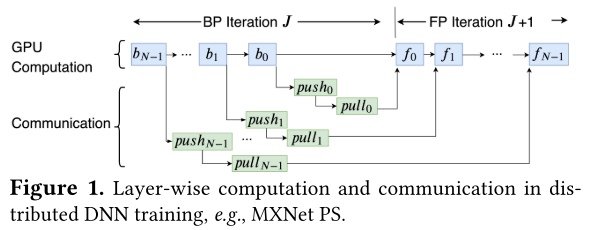

更新时间：2020-12-21

参考资料：
1. 论文 - A generic communication scheduler for distributed DNN training acceleration

## **问题**

DNN可以通过data parallelism加速，然而由于通信瓶颈的存在，加速并不是线性的。

解决办法之一：communication scheduling – change the transmission order of different DNN layers

## **Forward and backward propagation**

在DNN中，每一次迭代被称为一个epoch，在一个epoch中所用的数据被称为mini-batch。DNN是一个分层训练模型，在一次迭代中，mini-batch会依次travels through 每个layer；每通过一个layer就会产生一个loss，这个过程被称为forward propagation（FP）

FP之后，DNN模型会计算gradients（从last layer到first layer），这个过程叫做backward propagation（BP），这些gradients最后会用来计算下一次迭代所用的parameters。

## **data parallelism**

根据上述DNN过程，我们可以把每个epoch所需要做的计算放到不同的机器上做，即并行处理数据，这被称为distributed DNN training，大量的通信因此发生。

gradients上传至parameter sever被称为push，worker从parameter sever取回新的参数被称为pull

那么一个epoch中发生的事情可以由上图概述，一个N层模型，每一个层都需要push其gradient，并在pull回新的parameter以开始下一次FP，这便是worker和parameter server之间需要大量通信的原因。

观察每次迭代中变量之间的依赖关系，*f_i*依赖*f_i-1*和*pull_i*，*pull_i*依赖*push_i*和*b_i*

## **communication scheduling**

由于通信时延、parameter server计算时延等多种原因，worker接受到的pull不一定是按迭代顺序的，即*pull_i+1*可能比*pull_i*要早，故在FIFO中，*pull_i+1*会被先处理，于是，造成了不必要的等待。那么让*pull*按正确的顺序被处理，则是communication scheduling。

第二个问题，每一次pull或push中的gradients或parameters大小是不同的，这些数据被称为tensors，一个大的tensor会占据很长的处理时间，而错误的处理顺序会使这种等待的效果加剧，所以在scheduling strategy中还需要考虑tensor的大小

