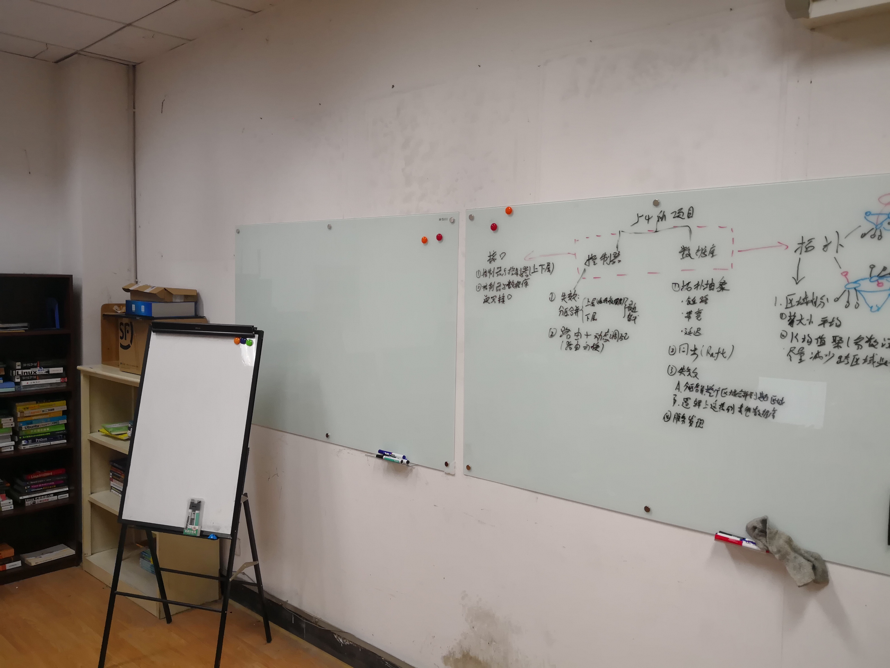

更新时间：2020/12/30

## KB109资源概述

KB109包含杂物区、工作台、入网区、工位、白板、图书区、服务器组和报废区，其主要功能如下：

- 杂物区：置放闲置书籍（待清理）、线缆和常用工具（螺丝刀、钳子等）
- 工作台：为焊接、电路测试区域，置放焊台、热风枪、示波器等
- 入网区：KB109为公网入网口，并且也是1楼、2楼、3楼部分实验室的入网口，置放路由器（已作端口转发）与交换机组
- 工位：置放个人物品，为平时工作学习区域
- 白板：包含两块玻璃板与一块立式白板
- 图书区：置放较为重要且常用的书籍，图书馆借阅书籍同样置放于此
- 服务器组：置放服务器与路由器
- 报废区：置放待报废的物件

## 资源详述与管理守则

#### **杂物区**

当前杂物区包含了大量的书籍，此为整理出来的无用书籍，置放一段时间后若无人领取则将其清除。线缆与工具置放于两个箱子中，未分类。暂时置放了嵌入式开发板等物品。

#### **工作台**

此区域的示波器为**贵重物品**，使用需填写登记表。此外，焊台在使用后需**断电**，焊接所剩余的杂物（如焊锡丝、排针、玻璃胶等）请即时清楚，使用完毕后物品摆放整齐。**禁止**将个人物件置放于此（如PCB板、电子元器件等）。

#### **入网区**

网口所连的第一个路由器已烧录端口转发功能，另一个灰黑色交换机用于接入其他教研室，若**改线请提前联系三楼负责人**，擅自改线将对其他教研室造成重大影响。KB109核心交换器位于中央工位，请于此处接线。

#### **工位**

置放个人物品。

#### **白板**

有两块玻璃板以及一个立式白板。玻璃板用于平时讨论，但记得每日擦除，每周对玻璃板进行清理，增加其使用寿命。立式白板用于登记重要信息。

#### **图书区**

置放一些常用书籍与图书馆借阅书籍，记得**及时归还**。

#### 服务器组

目前服务器只能在实验室内部使用，连接无线路由器（SSID: NetH-Lab）后使用ssh连接，密码请咨询管理员。

#### **报废区**

放置待报废物件，物件为学校资产，不可随意丢弃，需按报废规章制度处理。

