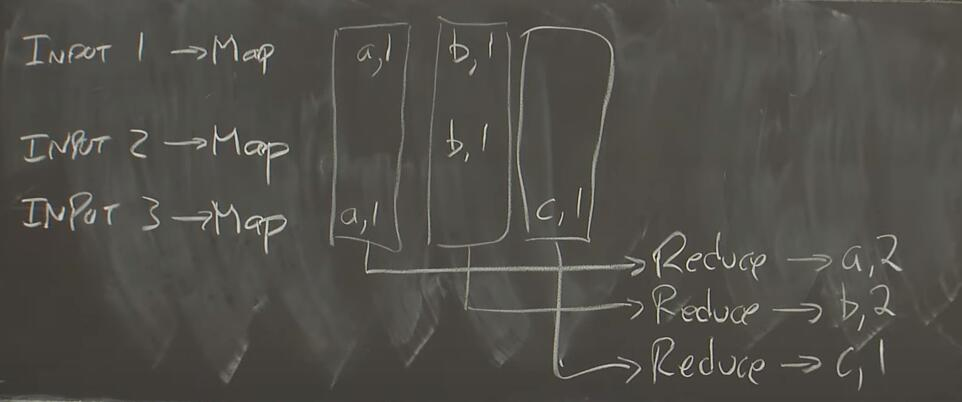

更新时间：2020/01/01

## 01 Introduction

参考资料：[MIT lecture](https://www.youtube.com/watch?v=cQP8WApzIQQ&t)

分布式系统：a set of cooperating computers communicated with each other over networked to get some coherent task done.

系统需要考虑的问题：parallelism, fault toleration, physical, security / isolated

为什么设计分布式系统很难：许多东西会execute concurrently，从而带来了复杂的interactions；unexpected failure patterns（partial failure）；performance 

paper中描述的东西：

- Infrastructure：包括storage，communication，compution 分布式系统设计的终极目标是，设计出一种抽象层（abstraction），让使用者感受不到这个系统是分布式的。
- Implication：RPC, threads等
- Performance：寻求scalability（2x computers意味着2x throughput）
- Fault-Tolerance：指在出现一定错误下，系统依然availability。这里的availability包括recoverability
- consistency（一致性）：包括强一致性和弱一致性

### MapReduce

为什么要设计MapReduce？Google需要处理海量的文件（由Web服务产生），为了降低延迟，需要使用一个分布式系统（几千台计算机）来处理。那么每个处理任务是使用不同的程序的，难道需要针对一个任务写一个独立的分布式应用程序吗？这太expensive。所以MapReduce出现了，搭建出一个分布式框架，使应用开发者不需要考虑如何将程序扩展到几千台计算机上，仅仅需要编写Map函数和Reduce函数，就可以完成大部分功能。

举个例子，假如Google需要统计所有文件中的词汇的个数，那么系统可以抽象成下图：

我们打算使用3台机器分别处理1，2，3号文件，那么首先文件会进入Map函数，将**一个文件中的数据处理成(k, v)组合**，(a, 1)代表词汇a出现了1次；而后，将所有的k=a的(k, v)输入进Reduce函数，b和c同理，在Reduce函数里做**多个(k, v)的运算，使之输出1个(k,v)**。最终，我们实现了统计词汇的功能。

在MapReduce中，Map负责将一个文件分解为多个(k, v)组合，Reduce负责将多个(k, v)合并成1个v，我们发现在编写Map函数或Reduce函数时，不会意识到这些函数是运行在分布式系统中的，也即，MapReduce实现了abstraction的目标。

我们会发现，MapReduce非常简单，这意味着它只能处理部分计算任务，但它是很有效的，因为大量的计算任务可以被分解成Map和Reduce，并具有大量的迭代次数，所以MapReduce到目前为止依然是使用最广泛的分布式计算系统。

下面我们要着重思考的是，MapReduce framework如何处理上一小节所提出的问题，比如Fault-tolerance等。

