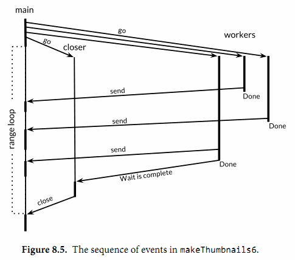

<head>
<style>
    img{margin-left: 20px; margin-right: 20px;}
    #table th{text-align:center;}
    #table td{text-align:center;}
    p{margin-left: 15px; margin-right: 15px;}
    .div_catalogue{padding: 10px 10px; font-size: 16px; background-color: #E0E0E0; word-spacing:0px;  border:1px solid black; border-radius: 10px;}
    .div_licence{font-size: 16px; word-spacing:0px; border:1px solid black;}
    .div_learning_post{font-size: 16px; word-spacing:0px;}
    .div_indicate_source{font-size: 18px; word-spacing:0px; background-color: #E0E0E0;}
    .div_learning_post_boder{padding: 10px 10px; font-size: 16px; word-spacing:0px;  border:1px solid black;}
</style>
<!--支持网页公式显示-->    
<script type="text/javascript" src="https://cdn.mathjax.org/mathjax/latest/MathJax.js?config=AM_HTMLorMML-full"></script>
</head>

<body>

<div align="center" class="div_indicate_source">
  <h4>⚠ 转载请注明出处：<font color="red"><i>协作者：ZobinHuang，更新日期：June.12 2021</i></font></h4>
  <div align="left">
  <font size="2px">
    <p>
    &nbsp;&nbsp;&nbsp;&nbsp;这篇文章内容的一些部分是转载自<a href="https://github.com/gopl-zh/gopl-zh.github.com">Go 语言圣经（中文版）</a>，并加上了本人在使用过程中的一些自己的理解和经验，最终整理成可读性更高的网页形式。在此向原作者和译者表示感谢，他们给社区提供了很棒的 Golang 入门参考。
    <br>&nbsp;&nbsp;&nbsp;&nbsp;原作者：Alan A. A. Donovan · Brian W. Kernighan;
    <br>&nbsp;&nbsp;&nbsp;&nbsp;  译者：柴树杉，Github @chai2010，Twitter @chaishushan；Xargin, https://github.com/cch123；CrazySssst；foreversmart, njutree@gmail.com
  </font>
  </div>
</div>

<div class="div_licence">
  <br>
  <div align="center">
      <a rel="license" href="http://creativecommons.org/licenses/by-nc-nd/4.0/"></a>
  </div>
  <p>
  &nbsp;&nbsp;&nbsp;&nbsp;本<span xmlns:dct="http://purl.org/dc/terms/" href="http://purl.org/dc/dcmitype/Text" rel="dct:type">作品</span>由 <span xmlns:cc="http://creativecommons.org/ns#" property="cc:attributionName"><b>ZobinHuang</b></span> 采用 <a rel="license" href="http://creativecommons.org/licenses/by-nc-nd/4.0/"><font color="red">知识共享署名-非商业性使用-禁止演绎 4.0 国际许可协议</font></a> 进行许可，在进行使用或分享前请查看权限要求。若发现侵权行为，会采取法律手段维护作者正当合法权益，谢谢配合。
  </p>
</div>

<!--表格-->
<!--
<table border="1" align="center">
  <caption>表格</caption>
  <tr>
    <th>A</th>
    <th>B</th>
    <th>C</th>
  </tr>
  <tr>
    <td>xxx</td>
    <td>xxx</td>
    <td>xxx</td>
  </tr>
</table>
-->

<!--图片-->
<!--
<div align="center">
  
</div>
-->

<!--正文-->
<!--
<p>
&nbsp;&nbsp;&nbsp;&nbsp;公式：<span>`\overline{A}\overline{B}`</span>
</p>
-->

<br>

<div class="div_catalogue">
  <div align="center">
    <h2> 目录 </h2>
    <p>
    <font size="2px">此文篇幅较长，故设置目录，有特定需要的内容直接跳转到相关章节查看即可。</font>
  </div>
  <div class="div_learning_post_boder">
    <p>
    &nbsp;&nbsp;&nbsp;&nbsp;Section 0. <a href="#0_preface"><font color="blue"><b>前言</b></font></a>：阐述了本章的内容；
    <p>
    &nbsp;&nbsp;&nbsp;&nbsp;Section 1. <a href="#1_goroutinues"><font color="blue"><b>Goroutines</b></font></a>：简单介绍了 Goroutinues 的用法；
    <p>
    &nbsp;&nbsp;&nbsp;&nbsp;Section 2. <a href="#2_concurrent_clock"><font color="blue"><b>示例: 并发的Clock服务</b></font></a>：实现一个简单的网络通信程序，使用 goroutinues 实现了一个支持多路接入的服务器；
    <p>
    &nbsp;&nbsp;&nbsp;&nbsp;Section 3. <a href="#3_echo"><font color="blue"><b>示例: 并发的 Echo 服务</b></font></a>：实现一个简单的网络通信程序 ，在客户端和服务端同时使用 goroutinues ，实现了一个支持多路接入的服务器和一个可以支持同时输入与输出的客户端；
    <p>
    &nbsp;&nbsp;&nbsp;&nbsp;Section 4. <a href="#4_channels"><font color="blue"><b>Channels</b></font></a>：介绍了 Channels 的基本概念；
    <br>&nbsp;&nbsp;&nbsp;&nbsp;&nbsp;&nbsp;&nbsp;&nbsp;4.1 <a href="#4_channels_1"><font color="blue">不带缓存的 Channels</font></a>：讨论了 Golang 中不带缓存的 Channel 的使用方法；
    <br>&nbsp;&nbsp;&nbsp;&nbsp;&nbsp;&nbsp;&nbsp;&nbsp;4.2 <a href="#4_channels_2"><font color="blue">串联的 Channels（Pipeline）</font></a>：讨论了 Golang 中级联多个 goroutinues，使用多个 Channels 的场景；
    <br>&nbsp;&nbsp;&nbsp;&nbsp;&nbsp;&nbsp;&nbsp;&nbsp;4.3 <a href="#4_channels_3"><font color="blue">单方向的 Channel</font></a>：讨论了 Golang 中单方向的 Channel 的使用方法；
    <br>&nbsp;&nbsp;&nbsp;&nbsp;&nbsp;&nbsp;&nbsp;&nbsp;4.4 <a href="#4_channels_4"><font color="blue">带缓存的 Channels</font></a>：讨论了 Golang 中带缓存的 Channels 的使用方法，并理解什么时候使用无缓存，什么时候使用有缓存的 Channel 是合适的；
    <p>
    &nbsp;&nbsp;&nbsp;&nbsp;Section 5. <a href="#5_concurrent_cycle"><font color="blue"><b>并发的循环</b></font></a>：展示了在循环中发起并发操作并且企图在 main goroutinue 中接收 worker goroutinues 结果的问题；
    <p>
    &nbsp;&nbsp;&nbsp;&nbsp;Section 6. <a href="#6_web_bug"><font color="blue"><b>示例: 并发的Web爬虫</b></font></a>：通过一个并发网页爬虫的例子，展示了较为复杂的 goroutinue 和 Channels 的用法；
    <p>
    &nbsp;&nbsp;&nbsp;&nbsp;Section 7. <a href="#7_select"><font color="blue"><b>基于select的多路复用</b></font></a>：
    <p>
    &nbsp;&nbsp;&nbsp;&nbsp;Section 7. <a href="#7_select"><font color="blue"><b>基于select的多路复用</b></font></a>：
    <p>
    &nbsp;&nbsp;&nbsp;&nbsp;Section 7. <a href="#7_select"><font color="blue"><b>基于select的多路复用</b></font></a>：
    <p>
    &nbsp;&nbsp;&nbsp;&nbsp;Section 7. <a href="#7_select"><font color="blue"><b>基于select的多路复用</b></font></a>：
  </div>
</div>

<!--标题-->
<h2><a name="0_preface">0. 前言</a></h2>
<div class="div_learning_post_boder">
  <h3><a name="1_xxx_1"></a></h3>
  <p>
  &nbsp;&nbsp;&nbsp;&nbsp;并发程序指同时进行多个任务的程序，随着硬件的发展，并发程序变得越来越重要。Web 服务器会一次处理成千上万的请求。平板电脑和手机 app 在渲染用户画面同时还会后台执行各种计算任务和网络请求。即使是传统的批处理问题——读取数据、计算、写输出，现在也会用并发来隐藏掉 I/O 的操作延迟以充分利用现代计算机设备的多个核心。计算机的性能每年都在以非线性的速度增长。
  
  <p>
  &nbsp;&nbsp;&nbsp;&nbsp;Go 语言中的并发程序可以用两种手段来实现。本章讲解 goroutine 和 channel，其支持“顺序通信进程”（communicating sequential processes）或被简称为 CSP。CSP 是一种现代的并发编程模型，在这种编程模型中值会在不同的运行实例（goroutine）中传递，尽管大多数情况下仍然是被限制在单一实例中。第 9 章覆盖更为传统的并发模型：多线程共享内存，如果你在其它的主流语言中写过并发程序的话可能会更熟悉一些。第 9 章也会深入介绍一些并发程序带来的风险和陷阱。

  <p>
  &nbsp;&nbsp;&nbsp;&nbsp;尽管 Go 对并发的支持是众多强力特性之一，但跟踪调试并发程序还是很困难，在线性程序中形成的直觉往往还会使我们误入歧途。如果这是读者第一次接触并发，推荐稍微多花一些时间来思考这两个章节中的样例。
</div>

<h2><a name="1_goroutinues">1. Goroutines</a></h2>
<div class="div_learning_post_boder">
  <p>
  &nbsp;&nbsp;&nbsp;&nbsp;在 Go 语言中，每一个并发的执行单元叫作一个 goroutine。设想这里的一个程序有两个函数，一个函数做计算，另一个输出结果，假设两个函数没有相互之间的调用关系。一个线性的程序会先调用其中的一个函数，然后再调用另一个。如果程序中包含多个 goroutine，对两个函数的调用则可能发生在同一时刻。马上就会看到这样的一个程序。
  
  <p>
  &nbsp;&nbsp;&nbsp;&nbsp;如果你使用过操作系统或者其它语言提供的线程，那么你可以简单地把 goroutine 类比作一个线程，这样你就可以写出一些正确的程序了。goroutine 和线程的本质区别会在第 8 章中讲。

  <p>
  &nbsp;&nbsp;&nbsp;&nbsp;当一个程序启动时，其主函数即在一个单独的 goroutine 中运行，我们叫它 main goroutine。新的 goroutine 会用 go 语句来创建。在语法上，go 语句是一个普通的函数或方法调用前加上关键字 go。go 语句会使其语句中的函数在一个新创建的 goroutine 中运行。而 go 语句本身会迅速地完成。

  ```golang
  f()    // call f(); wait for it to return
  go f() // create a new goroutine that calls f(); don't wait
  ```

  <p>
  &nbsp;&nbsp;&nbsp;&nbsp;下面的例子，main goroutine 将计算菲波那契数列的第 45 个元素值。由于计算函数使用低效的递归，所以会运行相当长时间，在此期间我们想让用户看到一个可见的标识来表明程序依然在正常运行，所以来做一个动画的小图标：
  
  ```golang
  func main() {
    go spinner(100 * time.Millisecond)
    const n = 45
    fibN := fib(n) // slow
    fmt.Printf("\rFibonacci(%d) = %d\n", n, fibN)
  }

  func spinner(delay time.Duration) {
    for {
      for _, r := range `-\|/` {
        fmt.Printf("\r%c", r)
        time.Sleep(delay)
      }
    }
  }

  func fib(x int) int {
    if x < 2 {
      return x
    }
    return fib(x-1) + fib(x-2)
  }
  ```

  <p>
  &nbsp;&nbsp;&nbsp;&nbsp;动画显示了几秒之后，fib(45) 的调用成功地返回，并且打印结果：

  ```bash
  Fibonacci(45) = 1134903170
  ```

  <p>
  &nbsp;&nbsp;&nbsp;&nbsp;然后主函数返回。<font color="red">主函数返回时，所有的 goroutine 都会被直接打断，程序退出。</font>除了从主函数退出或者直接终止程序之外，没有其它的编程方法能够让一个 goroutine 来打断另一个的执行，但是之后可以看到一种方式来实现这个目的，通过 goroutine 之间的通信来让一个 goroutine 请求其它的 goroutine，并让被请求的 goroutine 自行结束执行。

  <p>
  &nbsp;&nbsp;&nbsp;&nbsp;留意一下这里的两个独立的单元是如何进行组合的，spinning 和菲波那契的计算。分别在独立的函数中，但两个函数会同时执行。
</div>

<h2><a name="2_concurent_clock">2. 示例: 并发的Clock服务</a></h2>
<div class="div_learning_post_boder">
  <p>
  &nbsp;&nbsp;&nbsp;&nbsp;网络编程是并发大显身手的一个领域，由于服务器是最典型的需要同时处理很多连接的程序，这些连接一般来自于彼此独立的客户端。在本小节中，我们会讲解 go 语言的 net 包，这个包提供编写一个网络客户端或者服务器程序的基本组件，无论两者间通信是使用 TCP、UDP 或者 Unix domain sockets。
  
  <p>
  &nbsp;&nbsp;&nbsp;&nbsp;我们的第一个例子是一个顺序执行的时钟服务器，它会每隔一秒钟将当前时间写到客户端：

  ```golang
  package main

  import (
    "io"
    "log"
    "net"
    "time"
  )

  func main() {
    listener, err := net.Listen("tcp", "localhost:8000")
    if err != nil {
      log.Fatal(err)
    }

    for {
      conn, err := listener.Accept()
      if err != nil {
        log.Print(err) // e.g., connection aborted
        continue
      }
      handleConn(conn) // handle one connection at a time
    }
  }

  func handleConn(c net.Conn) {
    defer c.Close()
    for {
      _, err := io.WriteString(c, time.Now().Format("15:04:05\n"))
      if err != nil {
        return // e.g., client disconnected
      }
      time.Sleep(1 * time.Second)
    }
  }
  ```

  <p>
  &nbsp;&nbsp;&nbsp;&nbsp;Listen 函数创建了一个 net.Listener 的对象，这个对象会监听一个网络端口上到来的连接，在这个例子里我们用的是 TCP 的 localhost:8000 端口。listener 对象的 Accept 方法会直接阻塞，直到一个新的连接被创建，然后会返回一个 net.Conn 对象来表示这个连接。

  <p>
  &nbsp;&nbsp;&nbsp;&nbsp;handleConn 函数会处理一个完整的客户端连接。在一个 for 死循环中，用 time.Now() 获取当前时刻，然后写到客户端。由于 net.Conn 实现了 io.Writer 接口，我们可以直接向其写入内容。这个死循环会一直执行，直到写入失败。最可能的原因是客户端主动断开连接。这种情况下 handleConn 函数会用 defer 调用关闭服务器侧的连接，然后返回到主函数，继续等待下一个连接请求。

  <p>
  &nbsp;&nbsp;&nbsp;&nbsp;time.Time.Format 方法提供了一种格式化日期和时间信息的方式。它的参数是一个格式化模板，标识如何来格式化时间，而这个格式化模板限定为<b> Mon Jan 2 03:04:05PM 2006 UTC-0700</b>。有 8 个部分（周几、月份、一个月的第几天……）。可以以任意的形式来组合前面这个模板；出现在模板中的部分会作为参考来对时间格式进行输出。在上面的例子中我们只用到了小时、分钟和秒。time 包里定义了很多标准时间格式，比如 time.RFC1123。在进行格式化的逆向操作 time.Parse 时，也会用到同样的策略。（译注：这是 go 语言和其它语言相比比较奇葩的一个地方。你需要记住格式化字符串是1月2日下午3点4分5秒零六年UTC-0700，而不像其它语言那样 Y-m-d H:i:s 一样，当然了这里可以用1234567的方式来记忆，倒是也不麻烦。）

  <p>
  &nbsp;&nbsp;&nbsp;&nbsp;为了连接例子里的服务器，我们需要一个客户端程序，比如 netcat 这个工具（ nc 命令），这个工具可以用来执行网络连接操作。

  ```bash
  $ go build gopl.io/ch8/clock1
  $ ./clock1 &
  $ nc localhost 8000
  13:58:54
  13:58:55
  13:58:56
  13:58:57
  ^C
  ```

  <p>
  &nbsp;&nbsp;&nbsp;&nbsp;客户端将服务器发来的时间显示了出来，我们用 Control+C 来中断客户端的执行，在 Unix 系统上，你会看到 ^C 这样的响应。如果你的系统没有装 nc 这个工具，你可以用 telnet 来实现同样的效果，或者也可以用我们下面的这个用 go 写的简单的 telnet 程序，用 net.Dial 就可以简单地创建一个 TCP 连接：

  ```golang
  // Netcat1 is a read-only TCP client.
  package main

  import (
    "io"
    "log"
    "net"
    "os"
  )

  func main() {
    conn, err := net.Dial("tcp", "localhost:8000")
    if err != nil {
      log.Fatal(err)
    }
    defer conn.Close()
    mustCopy(os.Stdout, conn)
  }

  func mustCopy(dst io.Writer, src io.Reader) {
    if _, err := io.Copy(dst, src); err != nil {
      log.Fatal(err)
    }
  }
  ```

  <p>
  &nbsp;&nbsp;&nbsp;&nbsp;这个程序会从连接中读取数据，并将读到的内容写到标准输出中，直到遇到 end of file 的条件或者发生错误。mustCopy 这个函数我们在本节的几个例子中都会用到。让我们同时运行两个客户端来进行一个测试，这里可以开两个终端窗口，下面左边的是其中的一个的输出，右边的是另一个的输出：

  ```bash
  $ go build gopl.io/ch8/netcat1
  $ ./netcat1
  13:58:54                              $ ./netcat1
  13:58:55
  13:58:56
  ^C
                                        13:58:57
                                        13:58:58
                                        13:58:59
                                        ^C
  $ killall clock1
  ```

  <p>
  &nbsp;&nbsp;&nbsp;&nbsp;killall 命令是一个 Unix 命令行工具，可以用给定的进程名来杀掉所有名字匹配的进程。

  <p>
  &nbsp;&nbsp;&nbsp;&nbsp;第二个客户端必须等待第一个客户端完成工作，这样服务端才能继续向后执行；因为我们这里的服务器程序同一时间只能处理一个客户端连接。我们这里对服务端程序做一点小改动，使其支持并发：在 handleConn 函数调用的地方增加 go 关键字，让每一次 handleConn 的调用都进入一个独立的 goroutine。

  ```golang
  for {
    conn, err := listener.Accept()
    if err != nil {
      log.Print(err) // e.g., connection aborted
      continue
    }
    go handleConn(conn) // handle connections concurrently
  }

  func handleConn(c net.Conn) {
    defer c.Close()
    for {
      _, err := io.WriteString(c, time.Now().Format("15:04:05\n"))
      if err != nil {
        return // e.g., client disconnected
      }
      time.Sleep(1 * time.Second)
    }
  }
  ```

  <p>
  &nbsp;&nbsp;&nbsp;&nbsp;现在多个客户端可以同时接收到时间了：

  ```bash
  $ go build gopl.io/ch8/clock2
  $ ./clock2 &
  $ go build gopl.io/ch8/netcat1
  $ ./netcat1
  14:02:54                               $ ./netcat1
  14:02:55                               14:02:55
  14:02:56                               14:02:56
  14:02:57                               ^C
  14:02:58
  14:02:59                               $ ./netcat1
  14:03:00                               14:03:00
  14:03:01                               14:03:01
  ^C                                     14:03:02
                                        ^C
  $ killall clock2
  ```
</div>

<h2><a name="3_echo">3. 示例: 并发的Echo服务</a></h2>
<div class="div_learning_post_boder">
  <p>
  &nbsp;&nbsp;&nbsp;&nbsp;clock 服务器每一个连接都会起一个 goroutine。在本节中我们会创建一个 echo 服务器，这个服务在每个连接中会有多个 goroutine。大多数 echo 服务仅仅会返回他们读取到的内容，就像下面这个简单的 handleConn 函数所做的一样：
  
  ```golang
  func handleConn(c net.Conn) {
    io.Copy(c, c) // NOTE: ignoring errors
    c.Close()
  }
  ```

  <p>
  &nbsp;&nbsp;&nbsp;&nbsp;一个更有意思的 echo 服务应该模拟一个实际的 echo 的“回响”，并且一开始要用大写 HELLO 来表示“声音很大”，之后经过一小段延迟返回一个有所缓和的 Hello，然后一个全小写字母的 hello 表示声音渐渐变小直至消失，像下面这个版本的 handleConn (译注：笑看作者脑洞大开)：

  ```golang
  func echo(c net.Conn, shout string, delay time.Duration) {
    fmt.Fprintln(c, "\t", strings.ToUpper(shout))
    time.Sleep(delay)
    fmt.Fprintln(c, "\t", shout)
    time.Sleep(delay)
    fmt.Fprintln(c, "\t", strings.ToLower(shout))
  }

  func handleConn(c net.Conn) {
    input := bufio.NewScanner(c)
    for input.Scan() {
      echo(c, input.Text(), 1*time.Second)
    }
    // NOTE: ignoring potential errors from input.Err()
    c.Close()
  }
  ```

  <p>
  &nbsp;&nbsp;&nbsp;&nbsp;我们需要升级我们的客户端程序，这样它就可以发送终端的输入到服务器，并把服务端的返回输出到终端上，这使我们有了使用并发的另一个好机会：

  ```golang
  func main() {
    conn, err := net.Dial("tcp", "localhost:8000")
    if err != nil {
      log.Fatal(err)
    }
    defer conn.Close()
    go mustCopy(os.Stdout, conn)
    mustCopy(conn, os.Stdin)
  }

  func mustCopy(dst io.Writer, src io.Reader) {
    if _, err := io.Copy(dst, src); err != nil {
      log.Fatal(err)
    }
  }
  ```

  <p>
  &nbsp;&nbsp;&nbsp;&nbsp;当 main goroutine 从标准输入流中读取内容并将其发送给服务器时，另一个 goroutine 会读取并打印服务端的响应。当 main goroutine 碰到输入终止时，例如，用户在终端中按了 Control-D(^D)，在 windows 上是 Control-Z，这时程序就会被终止，尽管其它 goroutine 中还有进行中的任务。（在第 4 节中引入了 channels 后我们会明白如何让程序等待两边都结束。）

  <p>
  &nbsp;&nbsp;&nbsp;&nbsp;下面这个会话中，客户端的输入是左对齐的，服务端的响应会用缩进来区别显示。 客户端会向服务器“喊三次话”：

  ```bash
  # 服务端程序
  $ go build gopl.io/ch8/reverb1
  $ ./reverb1 &

  # 客户端程序
  $ go build gopl.io/ch8/netcat2
  $ ./netcat2
  Hello?
      HELLO?
      Hello?
      hello?
  Is there anybody there?
      IS THERE ANYBODY THERE?
  Yooo-hooo!
      Is there anybody there?
      is there anybody there?
      YOOO-HOOO!
      Yooo-hooo!
      yooo-hooo!
  ^D
  $ killall reverb1
  ```

  <p>
  &nbsp;&nbsp;&nbsp;&nbsp;注意客户端的第三次 shout 在前一个 shout 处理完成之前一直没有被处理，这貌似看起来不是特别“现实”。真实世界里的回响应该是会由三次 shout 的回声组合而成的。为了模拟真实世界的回响，我们需要更多的 goroutine 来做这件事情。这样我们就再一次地需要 go 这个关键词了，这次我们用它来调用 echo：

  ```golang
  func echo(c net.Conn, shout string, delay time.Duration) {
    fmt.Fprintln(c, "\t", strings.ToUpper(shout))
    time.Sleep(delay)
    fmt.Fprintln(c, "\t", shout)
    time.Sleep(delay)
    fmt.Fprintln(c, "\t", strings.ToLower(shout))
  }

  func handleConn(c net.Conn) {
    input := bufio.NewScanner(c)
    for input.Scan() {
      go echo(c, input.Text(), 1*time.Second)
    }
    // NOTE: ignoring potential errors from input.Err()
    c.Close()
  }
  ```
</div>

<h2><a name="x_xxx">x. xxx</a></h2>
<div class="div_learning_post_boder">
  <h3><a name="1_xxx_1"></a></h3>
  <p>
  &nbsp;&nbsp;&nbsp;&nbsp;go 后跟的函数的参数会在 go 语句自身执行时被求值；因此 input.Text() 会在 main goroutine 中被求值。 现在回响是并发并且会按时间来覆盖掉其它响应了：

  ```bash
  # 服务端程序
  $ go build gopl.io/ch8/reverb2
  $ ./reverb2 &

  # 客户端程序
  $ ./netcat2
  Is there anybody there?
      IS THERE ANYBODY THERE?
  Yooo-hooo!
      Is there anybody there?
      YOOO-HOOO!
      is there anybody there?
      Yooo-hooo!
      yooo-hooo!
  ^D
  $ killall reverb2
  ```
  
  <p>
  &nbsp;&nbsp;&nbsp;&nbsp;让服务使用并发不只是处理多个客户端的请求，甚至在处理单个连接时也可能会用到，就像我们上面的两个 go 关键词的用法。然而在我们使用 go 关键词的同时，需要慎重地考虑 net.Conn 中的方法在并发地调用时是否安全，事实上对于大多数类型来说也确实不安全。我们会在下一章中详细地探讨并发安全性。
</div>

<h2><a name="4_channels">4. Channels</a></h2>
<div class="div_learning_post_boder">
  <p>
  &nbsp;&nbsp;&nbsp;&nbsp;如果说 goroutine 是 Go 语言程序的并发体的话，那么 channels 则是它们之间的通信机制。一个 channel 是一个通信机制，它可以让一个 goroutine 通过它给另一个 goroutine 发送值信息。<b>每个 channel 都有一个特殊的类型，也就是 channels 可发送数据的类型。</b>一个可以发送 int 类型数据的 channel 一般写为 chan int。

  <p>
  &nbsp;&nbsp;&nbsp;&nbsp;使用内置的 make 函数，我们可以创建一个 channel：

  ```golang
  ch := make(chan int) // ch has type 'chan int'
  ```

  <p>
  &nbsp;&nbsp;&nbsp;&nbsp;<font color="red">和 map 类似，channel 也对应一个 make 创建的底层数据结构的引用。当我们复制一个 channel 或用于函数参数传递时，我们只是拷贝了一个 channel 引用，因此调用者和被调用者将引用同一个 channel 对象。</font>和其它的引用类型一样，channel 的零值也是 nil。

  <p>
  &nbsp;&nbsp;&nbsp;&nbsp;两个相同类型的channel可以使用 == 运算符比较。如果两个 channel 引用的是相同的对象，那么比较的结果为真。一个 channel 也可以和 nil 进行比较。

  <p>
  &nbsp;&nbsp;&nbsp;&nbsp;一个 channel 有<b>发送</b>和<b>接受</b>两个主要操作，都是通信行为。一个发送语句将一个值从一个 goroutine 通过 channel 发送到另一个执行接收操作的 goroutine。发送和接收两个操作都使用 <- 运算符。在发送语句中，<- 运算符分割 channel 和要发送的值。在接收语句中，<- 运算符写在 channel 对象之前。一个不使用接收结果的接收操作也是合法的。

  ```golang
  ch <- x  // a send statement
  x = <-ch // a receive expression in an assignment statement
  <-ch     // a receive statement; result is discarded
  ```

  <p>
  &nbsp;&nbsp;&nbsp;&nbsp;Channel 还支持 <font color="red">close</font> 操作，用于关闭 channel，<font color="red">随后对基于该 channel 的任何发送操作都将导致 panic 异常。对一个已经被 close 过的 channel 进行接收操作依然可以接受到之前已经成功发送的数据</font>，如果 channel 中已经没有数据的话将产生一个零值的数据。

  <p>
  &nbsp;&nbsp;&nbsp;&nbsp;使用内置的 close 函数就可以关闭一个 channel：

  ```golang
  close(ch)
  ```

  <p>
  &nbsp;&nbsp;&nbsp;&nbsp;以最简单方式调用 make 函数创建的是一个<b>无缓存的 channel</b>，但是我们也可以指定第二个整型参数，对应 channel 的容量。如果 channel 的容量大于零，那么该 channel 就是<b>带缓存的 channel</b>。

  ```golang
  ch = make(chan int)    // unbuffered channel
  ch = make(chan int, 0) // unbuffered channel
  ch = make(chan int, 3) // buffered channel with capacity 3
  ```

  <p>
  &nbsp;&nbsp;&nbsp;&nbsp;我们将先讨论无缓存的 channel，然后在 4.4 小节讨论带缓存的 channel。
  
  <h3><a name="4_channels_1">4.1 不带缓存的Channels</a></h3>
  <p>
  &nbsp;&nbsp;&nbsp;&nbsp;<font color="red">一个基于无缓存 Channels 的发送操作将导致发送者 goroutine 阻塞，直到另一个 goroutine 在相同的 Channels 上执行接收操作</font>，当发送的值通过 Channels 成功传输之后，两个 goroutine 可以继续执行后面的语句。反之，<font color="red">如果接收操作先发生，那么接收者goroutine也将阻塞，直到有另一个goroutine在相同的Channels上执行发送操作。</font>

  <p>
  &nbsp;&nbsp;&nbsp;&nbsp;基于无缓存 Channels 的发送和接收操作将导致两个 goroutine 做一次同步操作。因为这个原因，无缓存 Channels有时候也被称为<b>同步 Channels</b>。<font color="red">当通过一个无缓存 Channels 发送数据时，接收者收到数据发生在再次唤醒唤醒发送者 goroutine 之前</font>（译注：<b>happens before</b>，这是 Go 语言并发内存模型的一个关键术语！）。

  <p>
  &nbsp;&nbsp;&nbsp;&nbsp;在讨论并发编程时，当我们说 <b>x 事件在 y 事件之前发生（happens before）</b>，我们并不是说 x 事件在时间上比 y 时间更早，我们要表达的意思是要保证在此之前的事件都已经完成了，例如在此之前的更新某些变量的操作已经完成，你可以放心依赖这些已完成的事件了。

  <p>
  &nbsp;&nbsp;&nbsp;&nbsp;当我们说<b>x 事件既不是在 y 事件之前发生也不是在 y 事件之后发生，我们就说 x 事件和 y 事件是并发的</b>。这并不是意味着 x 事件和 y 事件就一定是同时发生的，我们只是不能确定这两个事件发生的先后顺序。在下一章中我们将看到，当两个 goroutine 并发访问了相同的变量时，我们有必要保证某些事件的执行顺序，以避免出现某些并发问题。

  <p>
  &nbsp;&nbsp;&nbsp;&nbsp;在上面第 3 章的客户端程序中，它在主 goroutine 中（译注：就是执行main函数的goroutine）将标准输入复制到 server，因此当客户端程序关闭标准输入时，后台 goroutine 可能依然在工作。我们需要让主 goroutine 等待后台 goroutine 完成工作后再退出，我们可以使用一个 channel 来同步两个 goroutine：

  ```golang
  func main() {
    conn, err := net.Dial("tcp", "localhost:8000")
    if err != nil {
      log.Fatal(err)
    }
    done := make(chan struct{})

    go func() {
      io.Copy(os.Stdout, conn) // NOTE: ignoring errors
      log.Println("done")
      done <- struct{}{} // signal the main goroutine
    }()

    mustCopy(conn, os.Stdin)
    conn.Close()
    <-done // wait for background goroutine to finish
  }
  ```

  <p>
  &nbsp;&nbsp;&nbsp;&nbsp;当用户关闭了标准输入，主 goroutine 中的 mustCopy 函数调用将返回，然后调用 conn.Close() 关闭读和写方向的网络连接。关闭网络连接中的写方向的连接将导致 server 程序收到一个文件（end-of-file）结束的信号。关闭网络连接中读方向的连接将导致后台 goroutine 的 io.Copy 函数调用返回一个 “read from closed connection” （“从关闭的连接读”）类似的错误，因此我们临时移除了错误日志语句。需要注意的是 go 语句调用了一个函数字面量，这是 Go 语言中启动 goroutine 常用的形式。）

  <p>
  &nbsp;&nbsp;&nbsp;&nbsp;在后台 goroutine 返回之前，它先打印一个日志信息，然后向 done 对应的 channel 发送一个值。主 goroutine 在退出前先等待从 done 对应的 channel 接收一个值。因此，总是可以在程序退出前正确输出 “done” 消息。

  <p>
  &nbsp;&nbsp;&nbsp;&nbsp;基于 channels 发送消息有两个重要方面。首先每个消息都有一个值，但是有时候通讯的事实和发生的时刻也同样重要。当我们更希望强调通讯发生的时刻时，我们将它称为<b>消息事件</b>。有些消息事件并不携带额外的信息，它仅仅是用作两个 goroutine 之间的同步，这时候我们可以用 struct{} 空结构体作为 channels 元素的类型，虽然也可以使用 bool 或 int 类型实现同样的功能， done <- 1 语句也比 done <- struct{}{} 更短。

  <h3><a name="4_channels_2">4.2 串联的 Channels（Pipeline）</a></h3>
  <p>
  &nbsp;&nbsp;&nbsp;&nbsp;Channels 也可以用于将多个 goroutine 连接在一起，一个 Channel 的输出作为下一个 Channel 的输入。这种串联的 Channels 就是所谓的<b>管道（pipeline）</b>。下面的程序用两个 channels 将三个 goroutine 串联起来，如下图所示。

  <div align="center">
    
  </div>

  <p>
  &nbsp;&nbsp;&nbsp;&nbsp;第一个 goroutine 是一个计数器，用于生成 0、1、2、…… 形式的整数序列，然后通过 channel 将该整数序列发送给第二个 goroutine；第二个 goroutine 是一个求平方的程序，对收到的每个整数求平方，然后将平方后的结果通过第二个 channel 发送给第三个 goroutine；第三个 goroutine 是一个打印程序，打印收到的每个整数。为了保持例子清晰，我们有意选择了非常简单的函数，当然三个 goroutine 的计算很简单，在现实中确实没有必要为如此简单的运算构建三个 goroutine。

  ```golang
  func main() {
    naturals := make(chan int)
    squares := make(chan int)

    // Counter
    go func() {
      for x := 0; ; x++ {
        naturals <- x
      }
    }()

    // Squarer
    go func() {
      for {
        x := <-naturals
        squares <- x * x
      }
    }()

    // Printer (in main goroutine)
    for {
      fmt.Println(<-squares)
    }
  }
  ```

  <p>
  &nbsp;&nbsp;&nbsp;&nbsp;如您所料，上面的程序将生成 0、1、4、9、…… 形式的无穷数列。像这样的串联 Channels 的管道（Pipelines）可以用在需要长时间运行的服务中，每个长时间运行的 goroutine 可能会包含一个死循环，在不同 goroutine 的死循环内部使用串联的Channels 来通信。但是，如果我们希望通过 Channels 只发送有限的数列该如何处理呢？

  <p>
  &nbsp;&nbsp;&nbsp;&nbsp;如果发送者知道，没有更多的值需要发送到 channel 的话，那么让接收者也能及时知道没有多余的值可接收将是有用的，因为接收者可以停止不必要的接收等待。这可以通过内置的 close 函数来关闭 channel 实现：

  ```golang
  close(naturals)
  ```

  <p>
  &nbsp;&nbsp;&nbsp;&nbsp;当一个 channel 被关闭后，再向该 channel 发送数据将导致 panic 异常。<font color="red">当一个被关闭的 channel 中已经发送的数据都被成功接收后，后续的接收操作将不再阻塞，它们会立即返回一个零值。</font>关闭上面例子中的 naturals 变量对应的 channel 并不能终止循环，它依然会收到一个永无休止的零值序列，然后将它们发送给打印者 goroutine。

  <p>
  &nbsp;&nbsp;&nbsp;&nbsp;没有办法直接测试一个 channel 是否被关闭，但是<font color="red">接收操作有一个变体形式：它多接收一个结果，多接收的第二个结果是一个布尔值 ok，ture 表示成功从 channels 接收到值，false 表示 channels 已经被关闭并且里面没有值可接收。</font>使用这个特性，我们可以修改 squarer 函数中的循环代码，当 naturals 对应的 channel 被关闭并没有值可接收时跳出循环，并且也关闭 squares 对应的 channel。

  ```golang
  // Squarer
  go func() {
    for {
      x, ok := <-naturals
      if !ok {
        break // channel was closed and drained
      }
      squares <- x * x
    }
    close(squares)
  }()
  ```

  <p>
  &nbsp;&nbsp;&nbsp;&nbsp;因为上面的语法是笨拙的，而上面我们说的这种处理模式很常见，因此 <font color="red">Go 语言的 range 循环可直接在 channels 上面迭代。</font>使用 range 循环是上面处理模式的简洁语法，它依次从 channel 接收数据，当 channel 被关闭并且没有值可接收时跳出循环。

  <p>
  &nbsp;&nbsp;&nbsp;&nbsp;在下面的改进中，我们的计数器 goroutine 只生成 100 个含数字的序列，然后关闭 naturals 对应的 channel，这将导致计算平方数的 squarer 对应的 goroutine 可以正常终止循环并关闭 squares 对应的 channel。（在一个更复杂的程序中，可以通过 defer 语句关闭对应的 channel。）最后，主 goroutine 也可以正常终止循环并退出程序。

  ```golang
  func main() {
    naturals := make(chan int)
    squares := make(chan int)

    // Counter
    go func() {
      for x := 0; x < 100; x++ {
        naturals <- x
      }
      close(naturals)
    }()

    // Squarer
    go func() {
      for x := range naturals {
        squares <- x * x
      }
      close(squares)
    }()

    // Printer (in main goroutine)
    for x := range squares {
      fmt.Println(x)
    }
  }
  ```

  <p>
  &nbsp;&nbsp;&nbsp;&nbsp;其实你并不需要关闭每一个 channel。只有当需要告诉接收者 goroutine，所有的数据已经全部发送时才需要关闭 channel。<font color="red">不管一个 channel 是否被关闭，当它没有被引用时将会被 Go 语言的垃圾自动回收器回收。</font>（不要将关闭一个打开文件的操作和关闭一个 channel 操作混淆。对于每个打开的文件，都需要在不使用的时候调用对应的 Close 方法来关闭文件。）

  <p>
  &nbsp;&nbsp;&nbsp;&nbsp;试图重复关闭一个 channel 将导致 panic 异常，试图关闭一个 nil 值的 channel 也将导致 panic 异常。关闭一个 channels 还会触发一个<b>广播机制</b>，我们将在第 9 节讨论。

  <h3><a name="4_channels_3">4.3 单方向的 Channel</a></h3>
  <p>
  &nbsp;&nbsp;&nbsp;&nbsp;随着程序的增长，人们习惯于将大的函数拆分为小的函数。我们前面的例子中使用了三个 goroutine，然后用两个 channels 来连接它们，它们都是 main 函数的局部变量。将三个 goroutine 拆分为以下三个函数是自然的想法：
  
  ```golang
  func counter(out chan int)
  func squarer(out, in chan int)
  func printer(in chan int)
  ```

  <p>
  &nbsp;&nbsp;&nbsp;&nbsp;其中计算平方的 squarer 函数在两个串联 Channels 的中间，因此拥有两个 channel 类型的参数，一个用于输入一个用于输出。两个 channel 都拥有相同的类型，但是它们的使用方式相反：一个只用于接收，另一个只用于发送。参数的名字 in 和 out 已经明确表示了这个意图，但是并无法保证 squarer 函数向一个 in 参数对应的 channel 只会发送数据或者从一个 out 参数对应的 channel 只会接收数据。

  <p>
  &nbsp;&nbsp;&nbsp;&nbsp;这种场景是典型的。当一个 channel 作为一个函数参数时，它一般总是被专门用于只发送或者只接收。

  <p>
  &nbsp;&nbsp;&nbsp;&nbsp;为了表明这种意图并防止被滥用，Go 语言的类型系统提供了<b>单方向的 channel 类型</b>，分别用于只发送或只接收的 channel。<font color="red">类型 chan<- int 表示一个只发送 int 的 channel</font>，只能发送不能接收。相反，<font color="red">类型 <-chan int 表示一个只接收 int 的 channel</font>，只能接收不能发送。（箭头 <- 和关键字 chan 的相对位置表明了 channel 的方向。）这种限制将在编译期检测。

  <p>
  &nbsp;&nbsp;&nbsp;&nbsp;因为关闭操作只用于断言不再向 channel 发送新的数据，所以只有在发送者所在的 goroutine 才会调用 close 函数，<font color="red">因此对一个只接收的 channel 调用 close 将是一个编译错误。</font>

  <p>
  &nbsp;&nbsp;&nbsp;&nbsp;这是改进的版本，这一次参数使用了单方向 channel 类型：

  ```golang
  func counter(out chan<- int) {
	for x := 0; x < 100; x++ {
      out <- x
    }
    close(out)
  }

  func squarer(out chan<- int, in <-chan int) {
    for v := range in {
      out <- v * v
    }
    close(out)
  }

  func printer(in <-chan int) {
    for v := range in {
      fmt.Println(v)
    }
  }

  func main() {
    naturals := make(chan int)
    squares := make(chan int)
    go counter(naturals)
    go squarer(squares, naturals)
    printer(squares)
  }
  ```

  <p>
  &nbsp;&nbsp;&nbsp;&nbsp;调用 counter（naturals）时，naturals 的类型将隐式地从 chan int 转换成 chan<- int。调用 printer(squares) 也会导致相似的隐式转换，这一次是转换为 <-chan int 类型只接收型的 channel。<font color="red">任何双向 channel 向单向 channel 变量的赋值操作都将导致该隐式转换。</font>这里并没有反向转换的语法：也就是不能将一个类似 chan<- int 类型的单向型的 channel 转换为 chan int 类型的双向型的 channel。

  <h3><a name="4_channels_4">4.4 带缓存的 Channels</a></h3>
  <p>
  &nbsp;&nbsp;&nbsp;&nbsp;带缓存的 Channel 内部持有一个元素队列。队列的最大容量是在调用 make 函数创建 channel 时通过第二个参数指定的。下面的语句创建了一个可以持有三个字符串元素的带缓存 Channel。下图是 ch 变量对应的 channel 的图形表示形式。

  ```golang
  ch = make(chan string, 3)
  ```

  <div align="center">
    
  </div>

  <p>
  &nbsp;&nbsp;&nbsp;&nbsp;向缓存 Channel 的发送操作就是向内部缓存队列的尾部插入元素，接收操作则是从队列的头部删除元素。<font color="red">如果内部缓存队列是满的，那么发送操作将阻塞直到因另一个 goroutine 执行接收操作而释放了新的队列空间。</font>相反，<font color="red">如果channel是空的，接收操作将阻塞直到有另一个goroutine执行发送操作而向队列插入元素。</font>

  <p>
  &nbsp;&nbsp;&nbsp;&nbsp;我们可以在无阻塞的情况下连续向新创建的 channel 发送三个值：
  
  ```golang
  ch <- "A"
  ch <- "B"
  ch <- "C"
  ```

  <p>
  &nbsp;&nbsp;&nbsp;&nbsp;此刻，channel 的内部缓存队列将是满的 (下图)，如果有第四个发送操作将发生阻塞。

  <div align="center">
    
  </div>

  <p>
  &nbsp;&nbsp;&nbsp;&nbsp;如果我们接收一个值，

  ```golang
  fmt.Println(<-ch) // "A"
  ```

  <p>
  &nbsp;&nbsp;&nbsp;&nbsp;那么 channel 的缓存队列将不是满的也不是空的 (下图)，因此对该 channel 执行的发送或接收操作都不会发生阻塞。通过这种方式，channel 的缓存队列解耦了接收和发送的 goroutine。

  <div align="center">
    
  </div>

  <p>
  &nbsp;&nbsp;&nbsp;&nbsp;在某些特殊情况下，程序可能需要知道 channel 内部缓存的<b>容量</b> (不是长度)，可以用内置的 cap 函数获取：

  ```golang
  fmt.Println(cap(ch)) // "3"
  ```

  <p>
  &nbsp;&nbsp;&nbsp;&nbsp;同样，对于内置的 len 函数，如果传入的是 channel，那么将返回 channel 内部缓存队列中有效元素的个数，即<b>长度</b>。因为在并发程序中该信息会随着接收操作而失效，但是它对某些故障诊断和性能优化会有帮助。

  ```golang
  fmt.Println(len(ch)) // "2"
  ```

  <p>
  &nbsp;&nbsp;&nbsp;&nbsp;在继续执行两次接收操作后 channel 内部的缓存队列将又成为空的，如果有第四个接收操作将发生阻塞：

  ```golang
  fmt.Println(<-ch) // "B"
  fmt.Println(<-ch) // "C"
  ```

  <p>
  &nbsp;&nbsp;&nbsp;&nbsp;在这个例子中，发送和接收操作都发生在同一个 goroutine 中，但是在真实的程序中它们一般由不同的 goroutine 执行。Go 语言新手有时候会将一个带缓存的 channel 当作同一个 goroutine 中的队列使用，虽然语法看似简单，但实际上这是一个错误。Channel 和 goroutine 的调度器机制是紧密相连的，如果没有其他 goroutine 从 channel 接收，发送者——或许是整个程序——将会面临永远阻塞的风险。如果你只是需要一个简单的队列，使用 slice 就可以了。

  <p>
  &nbsp;&nbsp;&nbsp;&nbsp;下面的例子展示了一个使用了带缓存 channel 的应用。它并发地向三个镜像站点发出请求，三个镜像站点分散在不同的地理位置。它们分别将收到的响应发送到带缓存 channel，最后接收者只接收第一个收到的响应，也就是最快的那个响应。因此 mirroredQuery 函数可能在另外两个响应慢的镜像站点响应之前就返回了结果。（顺便说一下，多个 goroutines 并发地向同一个 channel 发送数据，或从同一个 channel 接收数据都是常见的用法。）

  ```golang
  func mirroredQuery() string {
    responses := make(chan string, 3)
    go func() { responses <- request("asia.gopl.io") }()
    go func() { responses <- request("europe.gopl.io") }()
    go func() { responses <- request("americas.gopl.io") }()
    return <-responses // responses 中有数据就立刻返回 (return the quickest response)
  }

  func request(hostname string) (response string) { /* ... */ }
  ```

  <p>
  &nbsp;&nbsp;&nbsp;&nbsp;如果我们使用了无缓存的 channel，那么两个慢的 goroutines 将会因为没有人接收而被永远卡住。这种情况，称为 <b>goroutines 泄漏</b>，这将是一个 BUG。和垃圾变量不同，泄漏的 goroutines 并不会被自动回收，因此确保每个不再需要的 goroutine 能正常退出是重要的。

  <p>
  &nbsp;&nbsp;&nbsp;&nbsp;关于无缓存或带缓存 channels 之间的选择，或者是带缓存 channels 的容量大小的选择，都可能影响程序的正确性。无缓存 channel 更强地保证了每个发送操作与相应的同步接收操作。但是对于带缓存 channel，这些操作是解耦的。同样，即使我们知道将要发送到一个 channel 的信息的数量上限，创建一个对应容量大小的带缓存 channel 也是不现实的，因为这要求在执行任何接收操作之前缓存所有已经发送的值。如果未能分配足够的缓存将导致程序死锁。
  
  <p>
  &nbsp;&nbsp;&nbsp;&nbsp;Channel 的缓存也可能影响程序的性能。想象一家蛋糕店有三个厨师，一个烘焙，一个上糖衣，还有一个将每个蛋糕传递到它下一个厨师的生产线。在狭小的厨房空间环境，每个厨师在完成蛋糕后必须等待下一个厨师已经准备好接受它；这类似于在一个无缓存的 channel 上进行沟通。

  <p>
  &nbsp;&nbsp;&nbsp;&nbsp;如果在每个厨师之间有一个放置一个蛋糕的额外空间，那么每个厨师就可以将一个完成的蛋糕临时放在那里而马上进入下一个蛋糕的制作中；这类似于将 channel 的缓存队列的容量设置为 1。只要每个厨师的平均工作效率相近，那么其中大部分的传输工作将是迅速的，个体之间细小的效率差异将在交接过程中弥补。如果厨师之间有更大的额外空间——也是就更大容量的缓存队列——将可以在不停止生产线的前提下消除更大的效率波动，例如一个厨师可以短暂地休息，然后再加快赶上进度而不影响其他人。

  <p>
  &nbsp;&nbsp;&nbsp;&nbsp;另一方面，如果生产线的前期阶段一直快于后续阶段，那么它们之间的缓存在大部分时间都将是满的。相反，如果后续阶段比前期阶段更快，那么它们之间的缓存在大部分时间都将是空的。<font color="red">对于这类场景，额外的缓存并没有带来任何好处。</font>

  <p>
  &nbsp;&nbsp;&nbsp;&nbsp;生产线的隐喻对于理解 channels 和 goroutines 的工作机制是很有帮助的。例如，如果第二阶段是需要精心制作的复杂操作，一个厨师可能无法跟上第一个厨师的进度，或者是无法满足第三阶段厨师的需求。要解决这个问题，我们可以再雇佣另一个厨师来帮助完成第二阶段的工作，他执行相同的任务但是独立工作。这类似于基于相同的 channels 创建另一个独立的 goroutine。
</div>

<h2><a name="5_concurrent_cycle">5. 并发的循环</a></h2>
<div class="div_learning_post_boder">
  <p>
  &nbsp;&nbsp;&nbsp;&nbsp;本节中，我们会探索一些用来在并行时循环迭代的常见并发模型。我们会探究从全尺寸图片生成一些缩略图的问题。下面的 ImageFile 函数来帮我们拉伸图片。我们不会说明这个函数的实现，我们只需要使用它。

  ```golang
  package thumbnail

  // ImageFile reads an image from infile and writes
  // a thumbnail-size version of it in the same directory.
  // It returns the generated file name, e.g., "foo.thumb.jpg".
  func ImageFile(infile string) (string, error)
  ```

  <p>
  &nbsp;&nbsp;&nbsp;&nbsp;下面的程序会循环迭代一些图片文件名，并为每一张图片生成一个缩略图：

  ```golang
  // makeThumbnails makes thumbnails of the specified files.
  func makeThumbnails(filenames []string) {
    for _, f := range filenames {
      if _, err := thumbnail.ImageFile(f); err != nil {
        log.Println(err)
      }
    }
  }
  ```
  
  <p>
  &nbsp;&nbsp;&nbsp;&nbsp;显然我们处理文件的顺序无关紧要，因为每一个图片的拉伸操作和其它图片的处理操作都是彼此独立的。像这种子问题都是完全彼此独立的问题被叫做<b>易并行问题（译注：embarrassingly parallel，直译的话更像是尴尬并行）</b>。易并行问题是最容易被实现成并行的一类问题（废话），并且最能够享受到并发带来的好处，能够随着并行的规模线性地扩展。

  <p>
  &nbsp;&nbsp;&nbsp;&nbsp;下面让我们并行地执行这些操作，从而将文件 IO 的延迟隐藏掉，并用上多核 cpu 的计算能力来拉伸图像。我们的第一个并发程序只是使用了一个 go 关键字。这里我们先忽略掉错误，之后再进行处理。

  ```golang
  // NOTE: incorrect!
  func makeThumbnails2(filenames []string) {
    for _, f := range filenames {
      go thumbnail.ImageFile(f) // NOTE: ignoring errors
    }
  }
  ```

  <p>
  &nbsp;&nbsp;&nbsp;&nbsp;这个版本运行的实在有点太快，实际上，由于它比最早的版本使用的时间要短得多，即使当文件名的 slice 中只包含有一个元素。这就有点奇怪了，如果程序没有并发执行的话，那为什么一个并发的版本还是要快呢？<font color="red">答案其实是 makeThumbnails 在它还没有完成工作之前就已经返回了。它启动了所有的 goroutine，每一个文件名对应一个，但没有等待它们一直到执行完毕。</font>

  <p>
  &nbsp;&nbsp;&nbsp;&nbsp;没有什么直接的办法能够等待 goroutine 完成，但是我们可以改变 goroutine 里的代码让其能够将完成情况报告给外部的 goroutine 知晓，使用的方式是向一个共享的 channel 中发送事件。因为我们已经确切地知道有 len(filenames) 个内部 goroutine，所以外部的 goroutine 只需要在返回之前对这些事件计数。

  ```golang
  // makeThumbnails3 makes thumbnails of the specified files in parallel.
  func makeThumbnails3(filenames []string) {
    ch := make(chan struct{})
    for _, f := range filenames {
      go func(f string) {
        thumbnail.ImageFile(f) // NOTE: ignoring errors
        ch <- struct{}{}
      }(f)
    }
    // Wait for goroutines to complete.
    for range filenames {
      <-ch
    }
  }
  ```

  <p>
  &nbsp;&nbsp;&nbsp;&nbsp;<font color="red">注意我们将f的值作为一个显式的变量传给了函数，而不是在循环的闭包中声明：</font>

  ```golang
  for _, f := range filenames {
    go func() {
      thumbnail.ImageFile(f) // NOTE: incorrect!
      // ...
    }()
  }
  ```

  <p>
  &nbsp;&nbsp;&nbsp;&nbsp;回忆一下之前在第 4 章中，我们曾经说过的匿名函数中的<b>循环变量快照问题</b>。<font color="red"><b>【IMPORTANT】</b></font> 上面这个单独的变量 f 是被所有的匿名函数值所共享，且会被连续的循环迭代所更新的。当新的 goroutine 开始执行字面函数时，for 循环可能已经更新了 f 并且开始了另一轮的迭代或者（更有可能的）已经结束了整个循环，所以当这些 goroutine 开始读取 f 的值时，它们所看到的值已经是 slice 的最后一个元素了。显式地添加这个参数，我们能够确保使用的 f 是当 go 语句执行时的“当前”那个 f。

  <p>
  &nbsp;&nbsp;&nbsp;&nbsp;如果我们想要从每一个 worker goroutine 往主 goroutine 中返回值时该怎么办呢？当我们调用 thumbnail.ImageFile 创建文件失败的时候，它会返回一个错误。下一个版本的 makeThumbnails 会返回其在做拉伸操作时接收到的第一个错误：

  ```golang
  // makeThumbnails4 makes thumbnails for the specified files in parallel.
  // It returns an error if any step failed.
  func makeThumbnails4(filenames []string) error {
    errors := make(chan error)

    for _, f := range filenames {
      go func(f string) {
        _, err := thumbnail.ImageFile(f)
        errors <- err
      }(f)
    }

    for range filenames {
      if err := <-errors; err != nil {
        return err // NOTE: incorrect: goroutine leak!
      }
    }

    return nil
  }
  ```

  <p>
  &nbsp;&nbsp;&nbsp;&nbsp;这个程序有一个微妙的bug。当它遇到第一个非 nil 的 error 时会直接将 error 返回到调用方，使得没有一个 goroutine 去排空 errors channel。这样剩下的 worker goroutine 在向这个 channel 中发送值时，都会永远地阻塞下去，并且永远都不会退出。这种情况叫做 goroutine泄露，可能会导致整个程序卡住或者跑出 out of memory 的错误。

  <p>
  &nbsp;&nbsp;&nbsp;&nbsp;最简单的解决办法就是用一个具有合适大小的 buffered channel，这样这些 worker goroutine 向 channel 中发送错误时就不会被阻塞。（一个可选的解决办法是创建一个另外的 goroutine，当 main goroutine 返回第一个错误的同时去排空 channel。）

  <p>
  &nbsp;&nbsp;&nbsp;&nbsp;下一个版本的 makeThumbnails 使用了一个 buffered channel 来返回生成的图片文件的名字，附带生成时的错误。

  ```golang
  // makeThumbnails5 makes thumbnails for the specified files in parallel.
  // It returns the generated file names in an arbitrary order,
  // or an error if any step failed.
  func makeThumbnails5(filenames []string) (thumbfiles []string, err error) {
    type item struct {
      thumbfile string
      err       error
    }

    ch := make(chan item, len(filenames))
    for _, f := range filenames {
      go func(f string) {
        var it item
        it.thumbfile, it.err = thumbnail.ImageFile(f)
        ch <- it
      }(f)
    }

    for range filenames {
      it := <-ch
      if it.err != nil {
        return nil, it.err
      }
      thumbfiles = append(thumbfiles, it.thumbfile)
    }

    return thumbfiles, nil
  }
  ```

  <p>
  &nbsp;&nbsp;&nbsp;&nbsp;下面，我们最后一个版本的 makeThumbnails 返回了新文件们的大小总计数（bytes）。和前面的版本都不一样的一点是我们在这个版本里没有把文件名放在 slice 里，而是通过一个 string 的 channel 传过来，所以我们无法对循环的次数进行预测。

  <p>
  &nbsp;&nbsp;&nbsp;&nbsp;为了知道最后一个 goroutine 什么时候结束（最后一个结束并不一定是最后一个开始），我们需要一个递增的计数器，在每一个 goroutine 启动时加一，在 goroutine 退出时减一。<font color="red">这需要一种特殊的计数器，这个计数器需要在多个 goroutine 操作时做到安全并且提供在其减为零之前一直等待的一种方法。</font>这种计数类型被称为 <b>sync.WaitGroup</b>，下面的代码就用到了这种方法：

  ```golang
  // makeThumbnails6 makes thumbnails for each file received from the channel.
  // It returns the number of bytes occupied by the files it creates.
  func makeThumbnails6(filenames <-chan string) int64 {
    sizes := make(chan int64)
    var wg sync.WaitGroup // number of working goroutines
    for f := range filenames {
      wg.Add(1)
      // worker
      go func(f string) {
        defer wg.Done()
        thumb, err := thumbnail.ImageFile(f)
        if err != nil {
          log.Println(err)
          return
        }
        info, _ := os.Stat(thumb) // OK to ignore error
        sizes <- info.Size()
      }(f)
    }

    // closer
    go func() {
      wg.Wait()
      close(sizes)
    }()

    var total int64
    for size := range sizes {
      total += size
    }
    return total
  }
  ```

  <p>
  &nbsp;&nbsp;&nbsp;&nbsp;注意 Add 和 Done 方法的不对称。Add 是为计数器加一，必须在 worker goroutine 开始之前调用，而不是在 goroutine中；否则的话我们没办法确定 Add 是在 "closer"  goroutine 调用 Wait 之前被调用。并且 Add 还有一个参数，但 Done 却没有任何参数；其实它和 Add(-1) 是等价的。我们使用 defer 来确保计数器即使是在出错的情况下依然能够正确地被减掉。上面的程序代码结构是当我们使用并发循环，但又不知道迭代次数时很通常而且很地道的写法。

  <p>
  &nbsp;&nbsp;&nbsp;&nbsp;sizes channel 携带了每一个文件的大小到 main goroutine，在 main goroutine 中使用了 range loop 来计算总和。观察一下我们是怎样创建一个 closer goroutine，并让其在所有 worker goroutine 们结束之后再关闭 sizes channel 的。两步操作：wait 和 close，必须是基于 sizes 的循环的并发。考虑一下另一种方案：如果等待操作被放在了 main goroutine 中，在循环之前，这样的话就永远都不会结束了，因为 wg.Wait() 将会阻塞 main goroutine，那么 sizes 将永远不会被清空。而如果在循环之后，那么又变成了不可达的部分，因为没有任何东西去关闭这个 channel，这个循环就永远都不会终止。

  <p>
  &nbsp;&nbsp;&nbsp;&nbsp;下图表明了 makethumbnails6 函数中事件的序列。纵列表示 goroutine。窄线段代表 sleep，粗线段代表活动。斜线箭头代表用来同步两个 goroutine 的事件。时间向下流动。注意 main goroutine 是如何大部分的时间被唤醒执行其 range 循环，等待 worker 发送值或者 closer 来关闭 channel 的。

  <div align="center">
    
  </div>
</div>

<h2><a name="6_web_bug">6. 示例: 并发的Web爬虫</a></h2>
<div class="div_learning_post_boder">
  <p>
  &nbsp;&nbsp;&nbsp;&nbsp;在第 4 章，我们做了一个简单的 web 爬虫，用 bfs(广度优先)算法来抓取整个网站。在本节中，我们会让这个爬虫并行化，这样每一个彼此独立的抓取命令可以并行进行 IO，最大化利用网络资源。crawl 函数和我们在第 4 章看到的中的是一样的。

  ```golang
  func crawl(url string) []string {
    fmt.Println(url)
    list, err := links.Extract(url)
    if err != nil {
      log.Print(err)
    }
    return list
  }
  ```

  <p>
  &nbsp;&nbsp;&nbsp;&nbsp;主函数和第 4 章中的 breadthFirst (广度优先)类似。像之前一样，一个 worklist 是一个记录了需要处理的元素的队列，每一个元素都是一个需要抓取的 URL 列表，不过这一次我们用 channel 代替 slice 来做这个队列。每一个对 crawl 的调用都会在他们自己的 goroutine 中进行并且会把他们抓到的链接发送回 worklist。
  
  ```golang
  func main() {
    worklist := make(chan []string)

    // Start with the command-line arguments.
    go func() { worklist <- os.Args[1:] }()
    
    // Crawl the web concurrently.
    seen := make(map[string]bool)
    for list := range worklist {
      for _, link := range list {
        if !seen[link] {
          seen[link] = true
          go func(link string) {
            worklist <- crawl(link)
          }(link)
        }
      }
    }
  }
  ```

  <p>
  &nbsp;&nbsp;&nbsp;&nbsp;注意这里的 crawl 所在的 goroutine 会将 link 作为一个显式的参数传入，来避免“循环变量快照”的问题。<font color="red">另外注意这里将命令行参数传入 worklist 也是在一个另外的 goroutine 中进行的，这是为了避免 channel 两端的 main goroutine 与 crawler goroutine 都尝试向对方发送内容，却没有一端接收内容时发生死锁。</font>当然，这里我们也可以用 buffered channel 来解决问题，这里不再赘述。

  <p>
  &nbsp;&nbsp;&nbsp;&nbsp;现在爬虫可以高并发地运行起来，并且可以产生一大坨的 URL 了，不过还是会有俩问题。一个问题是在运行一段时间后可能会出现在 log 的错误信息里的：

  ```bash
  $ go build gopl.io/ch8/crawl1
  $ ./crawl1 http://gopl.io/
  http://gopl.io/
  https://golang.org/help/
  https://golang.org/doc/
  https://golang.org/blog/
  ...
  2015/07/15 18:22:12 Get ...: dial tcp: lookup blog.golang.org: no such host
  2015/07/15 18:22:12 Get ...: dial tcp 23.21.222.120:443: socket: too many open files
  ...
  ```

  <p>
  &nbsp;&nbsp;&nbsp;&nbsp;最初的错误信息是一个让人莫名的 DNS 查找失败，即使这个域名是完全可靠的。而随后的错误信息揭示了原因：这个程序一次性创建了太多网络连接，超过了每一个进程的打开文件数限制，既而导致了在调用 net.Dial 像 DNS 查找失败这样的问题。

  <p>
  &nbsp;&nbsp;&nbsp;&nbsp;这个程序实在是太并行了。无穷无尽地并行化并不是什么好事情，因为不管怎么说，你的系统总是会有一些个限制因素，比如 CPU 核心数会限制你的计算负载，比如你的硬盘转轴和磁头数限制了你的本地磁盘 IO 操作频率，比如你的网络带宽限制了你的下载速度上限，或者是你的一个 web 服务的服务容量上限等等。为了解决这个问题，我们可以限制并发程序所使用的资源来使之适应自己的运行环境。对于我们的例子来说，最简单的方法就是限制对 links.Extract 在同一时间最多不会有超过 n 次调用，这里的 n 一般小于文件描述符的上限值，比如 20。这和一个夜店里限制客人数目是一个道理，只有当有客人离开时，才会允许新的客人进入店内。

  <p>
  &nbsp;&nbsp;&nbsp;&nbsp;我们可以用一个<b>有容量限制的 buffered channel </b>来控制并发，这类似于操作系统里的计数信号量概念。从概念上讲，channel 里的 n 个空槽代表 n 个可以处理内容的 token（通行证），从 channel 里接收一个值会释放其中的一个 token，并且生成一个新的空槽位。这样保证了在没有接收介入时最多有 n 个发送操作。（这里可能我们拿 channel 里填充的槽来做 token 更直观一些，不过还是这样吧。）由于 channel 里的元素类型并不重要，我们用一个零值的 struct{} 来作为其元素。
  
  <p>
  &nbsp;&nbsp;&nbsp;&nbsp;让我们重写 crawl 函数，将对 links.Extract 的调用操作用获取、释放 token 的操作包裹起来，来确保同一时间对其只有 20 个调用。信号量数量和其能操作的 IO 资源数量应保持接近。

  ```golang
  // tokens is a counting semaphore used to
  // enforce a limit of 20 concurrent requests.
  var tokens = make(chan struct{}, 20)

  func crawl(url string) []string {
    fmt.Println(url)
    tokens <- struct{}{} // acquire a token
    list, err := links.Extract(url)
    <-tokens // release the token
    if err != nil {
      log.Print(err)
    }
    return list
  }
  ```

  <p>
  &nbsp;&nbsp;&nbsp;&nbsp;第二个问题是这个程序永远都不会终止，即使它已经爬到了所有初始链接衍生出的链接。（当然，除非你慎重地选择了合适的初始化 URL，你应该还没有意识到这个问题。）为了使这个程序能够终止，我们需要在 worklist 为空或者没有 crawl 的 goroutine 在运行时退出主循环。

  ```golang
  func main() {
    worklist := make(chan []string)
    var n int // number of pending sends to worklist

    // Start with the command-line arguments.
    n++
    go func() { worklist <- os.Args[1:] }()

    // Crawl the web concurrently.
    seen := make(map[string]bool)

    for ; n > 0; n-- {
      list := <-worklist
      for _, link := range list {
        if !seen[link] {
          seen[link] = true
          n++
          go func(link string) {
            worklist <- crawl(link)
          }(link)
        }
      }
    }
  }
  ```

  <p>
  &nbsp;&nbsp;&nbsp;&nbsp;这个版本中，计数器 n 对 worklist 的发送操作数量进行了限制。每一次我们发现有元素需要被发送到 worklist时，我们都会对 n 进行 ++ 操作，在向 worklist 中发送初始的命令行参数之前，我们也进行过一次 ++ 操作。这里的操作 ++ 是在每启动一个 crawler 的 goroutine之前。主循环会在 n 减为 0 时终止，这时候说明没活可干了。

  <p>
  &nbsp;&nbsp;&nbsp;&nbsp;现在这个并发爬虫会比第 4 章中的深度优先搜索版快上 20 倍，而且不会出什么错，并且在其完成任务时也会正确地终止。

  <p>
  &nbsp;&nbsp;&nbsp;&nbsp;下面的程序是避免过度并发的另一种思路。这个版本使用了原来的 crawl 函数，但没有使用计数信号量，取而代之用了 20 个常驻的 crawler goroutine，这样来保证最多 20 个 HTTP 请求在并发。

  ```golang
  func main() {
    worklist := make(chan []string)  // lists of URLs, may have duplicates
    unseenLinks := make(chan string) // de-duplicated URLs

    // Add command-line arguments to worklist.
    go func() { worklist <- os.Args[1:] }()

    // Create 20 crawler goroutines to fetch each unseen link.
    for i := 0; i < 20; i++ {
      go func() {
        for link := range unseenLinks {
          foundLinks := crawl(link)
          go func() { worklist <- foundLinks }()
        }
      }()
    }

    // The main goroutine de-duplicates worklist items
    // and sends the unseen ones to the crawlers.
    seen := make(map[string]bool)
    for list := range worklist {
      for _, link := range list {
        if !seen[link] {
          seen[link] = true
          unseenLinks <- link
        }
      }
    }
  }
  ```

  <p>
  &nbsp;&nbsp;&nbsp;&nbsp;所有的爬虫 goroutine 现在都是被同一个 channel - unseenLinks 喂饱的了。主 goroutine 负责拆分它从 worklist 里拿到的元素，然后把没有抓过的经由 unseenLinks channel 发送给一个爬虫的 goroutine。
  
  <p>
  &nbsp;&nbsp;&nbsp;&nbsp;seen 这个 map 被限定在 main goroutine 中；也就是说这个 map 只能在 main goroutine 中进行访问。类似于其它的信息隐藏方式，这样的约束可以让我们从一定程度上保证程序的正确性。例如，内部变量不能够在函数外部被访问到；变量（§2.3.4）在没有发生变量逃逸（译注：局部变量被全局变量引用地址导致变量被分配在堆上）的情况下是无法在函数外部访问的；一个对象的封装字段无法被该对象的方法以外的方法访问到。在所有的情况下，信息隐藏都可以帮助我们约束我们的程序，使其不发生意料之外的情况。

  <p>
  &nbsp;&nbsp;&nbsp;&nbsp;crawl 函数爬到的链接在一个专有的 goroutine 中被发送到 worklist 中来避免死锁。为了节省篇幅，这个例子的终止问题我们先不进行详细阐述了。
</div>

<h2><a name="7_select">7. 基于select的多路复用</a></h2>
<div class="div_learning_post_boder">
  <p>
  &nbsp;&nbsp;&nbsp;&nbsp;下面的程序会进行火箭发射的倒计时。time.Tick 函数返回一个 channel，程序会周期性地像一个节拍器一样向这个 channel 发送事件。每一个事件的值是一个时间戳，不过更有意思的是其传送方式。
  
  <p>
  &nbsp;&nbsp;&nbsp;&nbsp;

  <p>
  &nbsp;&nbsp;&nbsp;&nbsp;

  <p>
  &nbsp;&nbsp;&nbsp;&nbsp;

  <p>
  &nbsp;&nbsp;&nbsp;&nbsp;

  <p>
  &nbsp;&nbsp;&nbsp;&nbsp;
</div>

<h2><a name="x_xxx">x. xxx</a></h2>
<div class="div_learning_post_boder">
  <h3><a name="1_xxx_1"></a></h3>
  <p>
  &nbsp;&nbsp;&nbsp;&nbsp;
  
  <p>
  &nbsp;&nbsp;&nbsp;&nbsp;

  <p>
  &nbsp;&nbsp;&nbsp;&nbsp;

  <p>
  &nbsp;&nbsp;&nbsp;&nbsp;

  <p>
  &nbsp;&nbsp;&nbsp;&nbsp;

  <p>
  &nbsp;&nbsp;&nbsp;&nbsp;
</div>

<h2><a name="x_xxx">x. xxx</a></h2>
<div class="div_learning_post_boder">
  <h3><a name="1_xxx_1"></a></h3>
  <p>
  &nbsp;&nbsp;&nbsp;&nbsp;
  
  <p>
  &nbsp;&nbsp;&nbsp;&nbsp;

  <p>
  &nbsp;&nbsp;&nbsp;&nbsp;

  <p>
  &nbsp;&nbsp;&nbsp;&nbsp;

  <p>
  &nbsp;&nbsp;&nbsp;&nbsp;

  <p>
  &nbsp;&nbsp;&nbsp;&nbsp;
</div>
<!--ref-->

<h2>附录：参考源</h2>
<div class="div_learning_post">
<p>

1. github.com, <a href="https://github.com/gopl-zh/gopl-zh.github.com/tree/master/ch8">Go语言圣经(中文版) Chapter 8</a>
</p>
</div>

</body>