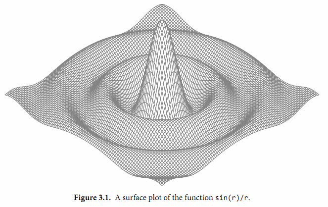

<head>
<style>
    img{margin-left: 20px; margin-right: 20px;}
    #table th{text-align:center;}
    #table td{text-align:center;}
    p{margin-left: 15px; margin-right: 15px;}
    .div_licence{font-size: 16px; word-spacing:0px; border:1px solid black;}
    .div_catalogue{padding: 10px 10px; font-size: 16px; background-color: #E0E0E0; word-spacing:0px;  border:1px solid black; border-radius: 10px;}
    .div_learning_post{font-size: 16px; word-spacing:0px;}
    .div_indicate_source{font-size: 18px; word-spacing:0px; background-color: #E0E0E0;}
    .div_learning_post_boder{padding: 10px 10px; font-size: 16px; word-spacing:0px;  border:1px solid black;}
</style>
<!--支持网页公式显示-->    
<script type="text/javascript" src="https://cdn.mathjax.org/mathjax/latest/MathJax.js?config=AM_HTMLorMML-full"></script>
</head>

<body>

<div align="center" class="div_indicate_source">
  <h4>⚠ 转载请注明出处：<font color="red"><i>协作者：ZobinHuang，更新日期：June.5 2021</i></font></h4>
  <div align="left">
  <font size="2px">
    <p>
    &nbsp;&nbsp;&nbsp;&nbsp;这篇文章内容的一些部分是转载自<a href="https://github.com/gopl-zh/gopl-zh.github.com">Go 语言圣经（中文版）</a>，并加上了本人在使用过程中的一些自己的理解和经验，最终整理成可读性更高的网页形式。在此向原作者和译者表示感谢，他们给社区提供了很棒的 Golang 入门参考。
    <br>&nbsp;&nbsp;&nbsp;&nbsp;原作者：Alan A. A. Donovan · Brian W. Kernighan;
    <br>&nbsp;&nbsp;&nbsp;&nbsp;  译者：柴树杉，Github @chai2010，Twitter @chaishushan；Xargin, https://github.com/cch123；CrazySssst；foreversmart, njutree@gmail.com
  </font>
  </div>
</div>

<div class="div_licence">
  <br>
  <div align="center">
      <a rel="license" href="http://creativecommons.org/licenses/by-nc-nd/4.0/"></a>
  </div>
  <p>
  &nbsp;&nbsp;&nbsp;&nbsp;本<span xmlns:dct="http://purl.org/dc/terms/" href="http://purl.org/dc/dcmitype/Text" rel="dct:type">作品</span>由 <span xmlns:cc="http://creativecommons.org/ns#" property="cc:attributionName"><b>ZobinHuang</b></span> 采用 <a rel="license" href="http://creativecommons.org/licenses/by-nc-nd/4.0/"><font color="red">知识共享署名-非商业性使用-禁止演绎 4.0 国际许可协议</font></a> 进行许可，在进行使用或分享前请查看权限要求。若发现侵权行为，会采取法律手段维护作者正当合法权益，谢谢配合。
  </p>
</div>

<!--表格-->
<!--
<table border="1" align="center">
  <caption>表格</caption>
  <tr>
    <th>A</th>
    <th>B</th>
    <th>C</th>
  </tr>
  <tr>
    <td>xxx</td>
    <td>xxx</td>
    <td>xxx</td>
  </tr>
</table>
-->

<!--图片-->
<!--
<div align="center">
  
</div>
-->

<!--正文-->
<!--
<p>
&nbsp;&nbsp;&nbsp;&nbsp;公式：<span>`\overline{A}\overline{B}`</span>
</p>
-->

<br>

<div class="div_catalogue">
  <div align="center">
    <h2> 目录 </h2>
    <p>
    <font size="2px">此文篇幅较长，故设置目录，有特定需要的内容直接跳转到相关章节查看即可。</font>
  </div>
  <div class="div_learning_post_boder">
    <p>
    &nbsp;&nbsp;&nbsp;&nbsp;Section 1. <a href="#1_integer"><font color="blue"><b>整型</b></font></a>：介绍整型类型变量，基本运算符，以及基本的操作方法；
    <p>
    &nbsp;&nbsp;&nbsp;&nbsp;Section 2. <a href="#2_float"><font color="blue"><b>浮点型</b></font></a>：介绍浮点数类型变量，浮点数精度，并且给出了一些稍微复杂浮点数的应用的例子；
    <p>
    &nbsp;&nbsp;&nbsp;&nbsp;Section 3. <a href="#3_complex"><font color="blue"><b>复数</b></font></a>：介绍复数类型变量；
    <p>
    &nbsp;&nbsp;&nbsp;&nbsp;Section 4. <a href="#4_bool"><font color="blue"><b>布尔型</b></font></a>：介绍布尔类型变量；
    <p>
    &nbsp;&nbsp;&nbsp;&nbsp;Section 5. <a href="#5_string"><font color="blue"><b>字符串</b></font></a>：介绍
    <br>&nbsp;&nbsp;&nbsp;&nbsp;&nbsp;&nbsp;&nbsp;&nbsp;5.1 <a href="#5_string_1"><font color="blue">字符串面值</font></a>：介绍字符串的面值形式 (如何书写字符串)；
    <br>&nbsp;&nbsp;&nbsp;&nbsp;&nbsp;&nbsp;&nbsp;&nbsp;5.2 <a href="#5_string_2"><font color="blue">Unicode</font></a>：介绍 Unicode 编码 (UTF-32)；
    <br>&nbsp;&nbsp;&nbsp;&nbsp;&nbsp;&nbsp;&nbsp;&nbsp;5.3 <a href="#5_string_3"><font color="blue">UTF-8</font></a>：介绍 Golang 使用的 UTF-8 的字符串编码形式；
    <br>&nbsp;&nbsp;&nbsp;&nbsp;&nbsp;&nbsp;&nbsp;&nbsp;5.4 <a href="#5_string_4"><font color="blue">字符串和 Byte 切片</font></a>：介绍异于字符串的可被修改的 byte 切片的使用；
    <br>&nbsp;&nbsp;&nbsp;&nbsp;&nbsp;&nbsp;&nbsp;&nbsp;5.5 <a href="#5_string_5"><font color="blue">字符串和数字的转换</font></a>：介绍 Golang 如何在字符串和数字值之前实现转换；
    <p>
    &nbsp;&nbsp;&nbsp;&nbsp;Section 6. <a href="#6_const"><font color="blue"><b>常量</b></font></a>：介绍常量的声明、使用方法，介绍有类型常量和无类型常量在声明和使用上的区别。
    <p>
    &nbsp;&nbsp;&nbsp;&nbsp;Appendix. <a href="#7_appendix"><font color="blue"><b>附录</b></font></a>
    <br>&nbsp;&nbsp;&nbsp;&nbsp;&nbsp;&nbsp;&nbsp;&nbsp;(1) <a href="#7_appendix_1"><font color="blue">Golang 转义字符</font></a>
    
  
  </div>
</div>

<br>

<div class="div_learning_post">
  <p>
  &nbsp;&nbsp;&nbsp;&nbsp;虽然从底层而言，所有的数据都是由比特组成，但计算机一般操作的是固定大小的数，如整数、浮点数、比特数组、内存地址等。进一步将这些数组织在一起，就可表达更多的对象，例如数据包、像素点、诗歌，甚至其他任何对象。Go 语言提供了丰富的数据组织形式，这依赖于 Go 语言内置的数据类型。这些内置的数据类型，兼顾了硬件的特性和表达复杂数据结构的便捷性。
  <p>
  &nbsp;&nbsp;&nbsp;&nbsp;Go语言将数据类型分为四类：<b>基础类型、复合类型、引用类型和接口类型</b>。本章介绍基础类型，包括：数字、字符串和布尔型。复合数据类型——数组和结构体——是通过组合简单类型，来表达更加复杂的数据结构。引用类型包括指针、切片、字典、函数、通道，虽然数据种类很多，但它们都是对程序中一个变量或状态的间接引用。这意味着对任一引用类型数据的修改都会影响所有该引用的拷贝。我们将在第 6 章介绍接口类型。
</div>

<h2><a name="1_integer">1. 整型</a></h2>
<div class="div_learning_post_boder">
  <p>
  &nbsp;&nbsp;&nbsp;&nbsp;Go 语言的数值类型包括几种不同大小的整数、浮点数和复数。每种数值类型都决定了对应的大小范围和是否支持正负符号。让我们先从整数类型开始介绍。
  
  <p>
  &nbsp;&nbsp;&nbsp;&nbsp;Go 语言同时提供了有符号和无符号类型的整数运算。这里有 int8、int16、int32 和 int64 四种截然不同大小的有符号整数类型，分别对应 8、16、32、64-bit大小的有符号整数，与此对应的是 uint8、uint16、uint32和uint64 四种无符号整数类型。
  
  <p>
  &nbsp;&nbsp;&nbsp;&nbsp;这里还有两种一般<b>对应特定 CPU 平台机器字大小的有符号和无符号整数</b> int 和 uint；其中 int 是应用最广泛的数值类型。这两种类型都有同样的大小，32 或 64-bit，但是我们不能对此做任何的假设；因为不同的编译器即使在相同的硬件平台上可能产生不同的大小。
  
  <p>
  &nbsp;&nbsp;&nbsp;&nbsp;Unicode 字符 rune 类型是和 int32 等价的类型，通常用于表示一个 Unicode 码点。这两个名称可以互换使用。同样<b> byte 也是 uint8 类型的等价类型</b>，byte 类型一般用于强调数值是一个原始的数据而不是一个小的整数。
  
  <p>
  &nbsp;&nbsp;&nbsp;&nbsp;最后，还有一种无符号的整数类型 uintptr，没有指定具体的 bit 大小但是足以容纳指针。uintptr 类型只有在底层编程时才需要，特别是 Go 语言和 C 语言函数库或操作系统接口相交互的地方。
  
  <p>
  &nbsp;&nbsp;&nbsp;&nbsp;不管它们的具体大小，int、uint 和 uintptr 是不同类型的兄弟类型。其中 int 和 int32 也是不同的类型，即使 int 的大小也是 32-bit，在需要将 int 当作 int32 类型的地方需要一个显式的类型转换操作，反之亦然。
  
  <p>
  &nbsp;&nbsp;&nbsp;&nbsp;其中<b>有符号整数采用 2 的补码形式表示</b>，也就是最高bit位用来表示符号位，一个 n-bit 的有符号数的值域是从 <span>`-2^(n-1)`</span> 到 <span>`2^(n-1)-1`</span>。无符号整数的所有 bit 位都用于表示非负数，值域是 0 到 <span>`2^n-1`</span>。例如，int8 类型整数的值域是从 -128 到 127，而 uint8 类型整数的值域是从 0 到 255。
  
  <p>
  &nbsp;&nbsp;&nbsp;&nbsp;下面是 Go 语言中关于算术运算、逻辑运算和比较运算的二元运算符，它们按照优先级递减的顺序排列：

  ```golang
  *      /      %      <<       >>     &       &^
  +      -      |      ^
  ==     !=     <      <=       >      >=
  &&
  ||
  ```
  <p>
  &nbsp;&nbsp;&nbsp;&nbsp;二元运算符有五种优先级。在同一个优先级，使用左优先结合规则，但是使用括号可以明确优先顺序，使用括号也可以用于提升优先级，例如mask & (1 << 28)。
  
  <p>
  &nbsp;&nbsp;&nbsp;&nbsp;对于上表中前两行的运算符，例如 + 运算符还有一个与赋值相结合的对应运算符 +=，可以用于简化赋值语句。
  
  <p>
  &nbsp;&nbsp;&nbsp;&nbsp;算术运算符 +、-、* 和 / 可以适用于整数、浮点数和复数，但是<b>取模运算符 % 仅用于整数间的运算</b>。对于不同编程语言，% 取模运算的行为可能并不相同。<b>在 Go 语言中，% 取模运算符的符号和被取模数的符号总是一致的</b>，因此 -5%3 和 -5%-3 结果都是 -2。<b>除法运算符 / 的行为则依赖于操作数是否全为整数</b>，比如 5.0/4.0 的结果是 1.25，但是 5/4 的结果是 1，因为整数除法会向着 0 方向截断余数。
  
  <p>
  &nbsp;&nbsp;&nbsp;&nbsp;一个算术运算的结果，不管是有符号或者是无符号的，如果需要更多的 bit 位才能正确表示的话，就说明计算结果是溢出了。超出的高位的bit位部分将被丢弃。如果原始的数值是有符号类型，而且最左边的 bit 位是1的话，那么最终结果可能是负的，例如 int8 的例子：

  ```golang
  var u uint8 = 255
  fmt.Println(u, u+1, u*u) // "255 0 1"

  var i int8 = 127
  fmt.Println(i, i+1, i*i) // "127 -128 1"
  ```
  <p>
  &nbsp;&nbsp;&nbsp;&nbsp;两个相同的整数类型可以使用下面的二元比较运算符进行比较；比较表达式的结果是布尔类型。`

  ```golang
  ==    等于
  !=    不等于
  <     小于
  <=    小于等于
  >     大于
  >=    大于等于
  ```
  <p>
  &nbsp;&nbsp;&nbsp;&nbsp;事实上，布尔型、数字类型和字符串等基本类型都是可以在同种类型以内进行比较的，也就是说两个相同类型的值可以用 == 和 != 进行比较。此外，整数、浮点数和字符串可以根据比较结果排序。许多其它类型的值可能是不可比较的，因此也就可能是不可排序的。对于我们遇到的每种类型，我们需要保证规则的一致性。
  <p>
  &nbsp;&nbsp;&nbsp;&nbsp;下面我们切换话题，首先来看一元的加法和减法运算符：

  ```golang
  +      一元加法（无效果）
  -      负数
  ```

  <p>
  &nbsp;&nbsp;&nbsp;&nbsp;对于整数，+x 是 0+x 的简写，-x 则是 0-x 的简写；对于浮点数和复数，+x 就是 x，-x 则是 x 的负数。
  <p>
  &nbsp;&nbsp;&nbsp;&nbsp;Go 语言还提供了以下的 bit 位操作运算符，前面 4 个操作运算符并不区分是有符号还是无符号数：

  ```golang
  &      位运算 AND
  |      位运算 OR
  ^      位运算 XOR
  &^     位清空（AND NOT）
  <<     左移
  >>     右移
  ```

  <p>
  &nbsp;&nbsp;&nbsp;&nbsp;位操作运算符 ^ 作为二元运算符时是按位异或（XOR），当用作一元运算符时表示按位取反，也就是说，它返回一个每个bit位都取反的数。位操作运算符 &^ 用于按位置零（AND NOT）：如果对应 y 中 bit 位为1的话，表达式 z = x &^ y 结果 z 的对应的 bit 位为 0，否则 z 对应的 bit 位等于 x 相应的 bit 位的值。
  
  <p>
  &nbsp;&nbsp;&nbsp;&nbsp;下面的代码演示了如何使用位操作解释 uint8 类型值的 8 个独立的 bit 位。它使用了 Printf 函数的 %b 参数打印二进制格式的数字；其中 %08b 中 08 表示打印至少 8 个字符宽度，不足的前缀部分用0填充。

  ```golang
  var x uint8 = 1<<1 | 1<<5
  var y uint8 = 1<<1 | 1<<2

  fmt.Printf("%08b\n", x) // "00100010", the set {1, 5}
  fmt.Printf("%08b\n", y) // "00000110", the set {1, 2}

  fmt.Printf("%08b\n", x&y)  // "00000010", the intersection {1}
  fmt.Printf("%08b\n", x|y)  // "00100110", the union {1, 2, 5}
  fmt.Printf("%08b\n", x^y)  // "00100100", the symmetric difference {2, 5}
  fmt.Printf("%08b\n", x&^y) // "00100000", the difference {5}

  for i := uint(0); i < 8; i++ {
    if x&(1<<i) != 0 { // membership test
      fmt.Println(i) // "1", "5"
    }
  }

  fmt.Printf("%08b\n", x<<1) // "01000100", the set {2, 6}
  fmt.Printf("%08b\n", x>>1) // "00010001", the set {0, 4}
  ```

  <p>
  &nbsp;&nbsp;&nbsp;&nbsp;在 x<<n 和 x>>n 移位运算中，<b>决定了移位操作的 bit 数部分必须是无符号数</b>；被操作的 x 可以是有符号数或无符号数。算术上，一个 x<<n 左移运算等价于乘以 <span>`2^n`</span>，一个 x>>n 右移运算等价于除以 <span>`2^n`</span>。
  
  <p>
  &nbsp;&nbsp;&nbsp;&nbsp;左移运算用零填充右边空缺的 bit 位，无符号数的右移运算也是用0填充左边空缺的 bit 位，但是有符号数的右移运算会用符号位的值填充左边空缺的 bit 位。因为这个原因，最好用无符号运算，这样你可以将整数完全当作一个 bit 位模式处理。
  
  <p>
  &nbsp;&nbsp;&nbsp;&nbsp;尽管 Go 语言提供了无符号数的运算，但即使数值本身不可能出现负数，我们还是倾向于使用有符号的 int 类型，就像数组的长度那样，虽然使用 uint 无符号类型似乎是一个更合理的选择。事实上，内置的 len 函数返回一个有符号的 int，我们可以像下面例子那样处理逆序循环。

  ```golang
  medals := []string{"gold", "silver", "bronze"}
  for i := len(medals) - 1; i >= 0; i-- {
    fmt.Println(medals[i]) // "bronze", "silver", "gold"
  }
  ```
  <p>
  &nbsp;&nbsp;&nbsp;&nbsp;另一个选择对于上面的例子来说将是灾难性的。如果len函数返回一个无符号数，那么i也将是无符号的 uint 类型，然后条件 i >= 0 则永远为真。在三次迭代之后，也就是 i == 0 时，i-- 语句将不会产生 -1，而是变成一个 uint 类型的最大值（可能是 <span>`2^64-1`</span>），然后 medals[i] 表达式运行时将发生 panic 异常，也就是试图访问一个 slice 范围以外的元素。
  
  <p>
  &nbsp;&nbsp;&nbsp;&nbsp;出于这个原因，<b>无符号数往往只有在位运算或其它特殊的运算场景才会使用</b>，就像 bit 集合、分析二进制文件格式或者是哈希和加密操作等。它们通常并不用于仅仅是表达非负数量的场合。
  
  <p>
  &nbsp;&nbsp;&nbsp;&nbsp;一般来说，算术和逻辑运算的二元操作中必须是相同的类型，因此我们通常需要类型转换。当我们想将一个值从一种类型转化为另一种类型时，我们需要一个显式的转换。虽然这偶尔会导致需要很长的表达式，但是它消除了所有和类型相关的问题，而且也使得程序容易理解。
  在很多场景，会遇到类似下面代码的常见的错误：

  ```golang
  var apples int32 = 1
  var oranges int16 = 2
  var compote int = apples + oranges // compile error
  ```

  <p>
  &nbsp;&nbsp;&nbsp;&nbsp;当尝试编译这三个语句时，将产生一个错误信息：
  
  ```bash
  invalid operation: apples + oranges (mismatched types int32 and int16)
  ```
  <p>
  &nbsp;&nbsp;&nbsp;&nbsp;这种类型不匹配的问题可以有几种不同的方法修复，最常见方法是将它们都显式转型为一个常见类型：

  ```golang
  var compote = int(apples) + int(oranges)
  ```
  
  <p>
  &nbsp;&nbsp;&nbsp;&nbsp;如之前的文章所述，对于每种类型 T，如果转换允许的话，类型转换操作 T(x) 将 x 转换为 T 类型。许多整数之间的相互转换并不会改变数值；它们只是告诉编译器如何解释这个值。但是对于将一个大尺寸的整数类型转为一个小尺寸的整数类型，或者是将一个浮点数转为整数，可能会改变数值或丢失精度：

  ```golang
  f := 3.141 // a float64
  i := int(f)
  fmt.Println(f, i) // "3.141 3"
  f = 1.99
  fmt.Println(int(f)) // "1"
  ```

  <p>
  &nbsp;&nbsp;&nbsp;&nbsp;浮点数到整数的转换将丢失任何小数部分，然后向数轴零方向截断。你应该避免对可能会超出目标类型表示范围的数值做类型转换，因为截断的行为可能依赖于具体的实现：

  ```golang
  f := 1e100  // a float64
  i := int(f) // 结果依赖于具体实现
  ```

  <p>
  &nbsp;&nbsp;&nbsp;&nbsp;<b>任何大小的整数字面值都可以用以 0 开始的八进制格式书写，例如 0666</b>；或用以 0x 或 0X 开头的十六进制格式书写，例如 0xdeadbeef。十六进制数字可以用大写或小写字母。如今八进制数据通常用于 POSIX 操作系统上的文件访问权限标志，十六进制数字则更强调数字值的 bit 位模式。
  
  <p>
  &nbsp;&nbsp;&nbsp;&nbsp;当使用fmt包打印一个数值时，我们可以用%d、%o或%x参数控制输出的进制格式，就像下面的例子：

  ```golang
  o := 0666
  fmt.Printf("%d %[1]o %#[1]o\n", o) // "438 666 0666"
  x := int64(0xdeadbeef)
  fmt.Printf("%d %[1]x %#[1]x %#[1]X\n", x) // 3735928559 deadbeef 0xdeadbeef 0XDEADBEEF
  ```

  <p>
  &nbsp;&nbsp;&nbsp;&nbsp;请注意 fmt 的两个使用技巧。通常 Printf 格式化字符串包含多个 % 参数时将会包含对应相同数量的额外操作数，但是<b> % 之后的 [1] 副词告诉 Printf 函数再次使用第一个操作数</b>。第二，<b>% 后的 # 副词告诉 Printf 在用 %o、%x 或 %X 输出时生成 0、0x 或 0X 前缀</b>。
  
  <p>
  &nbsp;&nbsp;&nbsp;&nbsp;字符面值通过一对单引号直接包含对应字符。最简单的例子是 ASCII 中类似 'a' 写法的字符面值，但是我们也可以通过转义的数值来表示任意的 Unicode 码点对应的字符，马上将会看到这样的例子。
  
  <p>
  &nbsp;&nbsp;&nbsp;&nbsp;字符使用 %c 参数打印，或者是用 %q 参数打印带单引号的字符：

  ```golang
  ascii := 'a'
  unicode := '国'
  newline := '\n'
  fmt.Printf("%d %[1]c %[1]q\n", ascii)   // "97 a 'a'"
  fmt.Printf("%d %[1]c %[1]q\n", unicode) // "22269 国 '国'"
  fmt.Printf("%d %[1]q\n", newline)       // "10 '\n'"
  ```
</div>

<h2><a name="2_float">2. 浮点数</a></h2>
<div class="div_learning_post_boder">
  <p>
  &nbsp;&nbsp;&nbsp;&nbsp;Go语言提供了两种精度的浮点数，float32 和 float64。它们的算术规范由 IEEE754 浮点数国际标准定义，该浮点数规范被所有现代的CPU支持。
  
  <p>
  &nbsp;&nbsp;&nbsp;&nbsp;这些浮点数类型的取值范围可以从很微小到很巨大。浮点数的范围极限值可以在 math 包找到。常量 math.MaxFloat32 表示 float32 能表示的最大数值，大约是 3.4e38；对应的 math.MaxFloat64 常量大约是 1.8e308。它们分别能表示的最小值近似为 1.4e-45 和 4.9e-324。
  
  <p>
  &nbsp;&nbsp;&nbsp;&nbsp;一个 float32 类型的浮点数可以提供大约 6 个十进制数的精度，而 float64 则可以提供约 15 个十进制数的精度；<b>通常应该优先使用 float64 类型</b>，因为 float32 类型的累计计算误差很容易扩散，并且 float32 能精确表示的正整数并不是很大（译注：<font color="red">因为 float32 的有效 bit 位只有 23 个，其它的 bit 位用于指数和符号；当整数大于 23-bit 能表达的范围时，float32 的表示将出现误差）</font>：

  ```golang
  var f float32 = 16777216 // 1 << 24
  fmt.Println(f == f+1)    // "true"!
  ```
  <p>
  &nbsp;&nbsp;&nbsp;&nbsp;浮点数的字面值可以直接写小数部分，像这样：

  ```golang
  const e = 2.71828 // (approximately)
  ```
  <p>
  &nbsp;&nbsp;&nbsp;&nbsp;小数点前面或后面的数字都可能被省略（例如 .707 或 1.）。很小或很大的数最好用科学计数法书写，通过e或E来指定指数部分：

  ```golang
  const Avogadro = 6.02214129e23  // 阿伏伽德罗常数
  const Planck   = 6.62606957e-34 // 普朗克常数
  ```
  <p>
  &nbsp;&nbsp;&nbsp;&nbsp;用 Printf 函数的 %g 参数打印浮点数，将采用更紧凑的表示形式打印，并提供足够的精度，但是对应表格的数据，使用 %e（带指数）或 %f 的形式打印可能更合适。所有的这三个打印形式都可以指定打印的宽度和控制打印精度。
  
  ```golang
  for x := 0; x < 8; x++ {
    fmt.Printf("x = %d e^x = %8.3f\n", x, math.Exp(float64(x)))
  }
  ```
  <p>
  &nbsp;&nbsp;&nbsp;&nbsp;上面代码打印e的幂，打印精度是小数点后三个小数精度和8个字符宽度：
  
  ```bash
  x = 0       e^x =    1.000
  x = 1       e^x =    2.718
  x = 2       e^x =    7.389
  x = 3       e^x =   20.086
  x = 4       e^x =   54.598
  x = 5       e^x =  148.413
  x = 6       e^x =  403.429
  x = 7       e^x = 1096.633
  ```
  <p>
  &nbsp;&nbsp;&nbsp;&nbsp;math 包中除了提供大量常用的数学函数外，还提供了 IEEE754 浮点数标准中定义的特殊值的创建和测试：正无穷大和负无穷大，分别用于表示太大溢出的数字和除零的结果；还有 NaN 非数，一般用于表示无效的除法操作结果 0/0 或 Sqrt(-1)。

  ```golang
  var z float64
  fmt.Println(z, -z, 1/z, -1/z, z/z) // "0 -0 +Inf -Inf NaN"
  ```
  <p>
  &nbsp;&nbsp;&nbsp;&nbsp;函数 math.IsNaN 用于测试一个数是否是非数 NaN，math.NaN 则返回非数对应的值。虽然可以用 math.NaN 来表示一个非法的结果，<b>但是测试一个结果是否是非数NaN则是充满风险的，因为 NaN 和任何数都是不相等的（译注：在浮点数中，NaN、正无穷大和负无穷大都不是唯一的，每个都有非常多种的bit模式表示）</b>：

  ```golang
  nan := math.NaN()
  fmt.Println(nan == nan, nan < nan, nan > nan) // "false false false"
  ```
  <p>
  &nbsp;&nbsp;&nbsp;&nbsp;如果一个函数返回的浮点数结果可能失败，最好的做法是用单独的标志报告失败，像这样：

  ```golang
  func compute() (value float64, ok bool) {
    // ...
    if failed {
      return 0, false
    }
    return result, true
  }
  ```
  <p>
  &nbsp;&nbsp;&nbsp;&nbsp;接下来的程序演示了通过浮点计算生成的图形。它是带有两个参数的 z = f(x, y) 函数的三维形式，使用了可缩放矢量图形（SVG）格式输出，
  SVG 是一个用于矢量线绘制的 XML 标准。下图显示了 <span>`sin(r)/r`</span> 函数的输出图形，其中 r 是 <span>`sqrt(x^2+y^2)`</span>。

  <div align="center">
    
  </div>

  <p>
  &nbsp;&nbsp;&nbsp;&nbsp;相关绘制代码如下所示：
  
  ```golang
  // Surface computes an SVG rendering of a 3-D surface function.
  package main

  import (
    "fmt"
    "math"
  )

  const (
    width, height = 600, 320            // canvas size in pixels
    cells         = 100                 // number of grid cells
    xyrange       = 30.0                // axis ranges (-xyrange..+xyrange)
    xyscale       = width / 2 / xyrange // pixels per x or y unit
    zscale        = height * 0.4        // pixels per z unit
    angle         = math.Pi / 6         // angle of x, y axes (=30°)
  )

  var sin30, cos30 = math.Sin(angle), math.Cos(angle) // sin(30°), cos(30°)

  func main() {
    fmt.Printf("<svg xmlns='http://www.w3.org/2000/svg' "+
      "style='stroke: grey; fill: white; stroke-width: 0.7' "+
      "width='%d' height='%d'>", width, height)
    for i := 0; i < cells; i++ {
      for j := 0; j < cells; j++ {
        ax, ay := corner(i+1, j)
        bx, by := corner(i, j)
        cx, cy := corner(i, j+1)
        dx, dy := corner(i+1, j+1)
        fmt.Printf("<polygon points='%g,%g %g,%g %g,%g %g,%g'/>\n",
          ax, ay, bx, by, cx, cy, dx, dy)
      }
    }
    fmt.Println("</svg>")
  }

  func corner(i, j int) (float64, float64) {
    // Find point (x,y) at corner of cell (i,j).
    x := xyrange * (float64(i)/cells - 0.5)
    y := xyrange * (float64(j)/cells - 0.5)

    // Compute surface height z.
    z := f(x, y)

    // Project (x,y,z) isometrically onto 2-D SVG canvas (sx,sy).
    sx := width/2 + (x-y)*cos30*xyscale
    sy := height/2 + (x+y)*sin30*xyscale - z*zscale
    return sx, sy
  }

  func f(x, y float64) float64 {
    r := math.Hypot(x, y) // distance from (0,0)
    return math.Sin(r) / r
  }
  ```
  <p>
  &nbsp;&nbsp;&nbsp;&nbsp;要注意的是corner函数返回了两个结果，分别对应每个网格顶点的坐标参数。
 
  <p>
  &nbsp;&nbsp;&nbsp;&nbsp;要解释这个程序是如何工作的需要一些基本的几何学知识，但是我们可以跳过几何学原理，因为程序的重点是演示浮点数运算。程序的本质是三个不同的坐标系中映射关系，如下图所示。第一个是100x100的二维网格，对应整数坐标(i,j)，从远处的(0,0)位置开始。我们从远处向前面绘制，因此远处先绘制的多边形有可能被前面后绘制的多边形覆盖。
  
  <p>
  &nbsp;&nbsp;&nbsp;&nbsp;第二个坐标系是一个三维的网格浮点坐标(x,y,z)，其中x和y是i和j的线性函数，通过平移转换为网格单元的中心，然后用xyrange系数缩放。高度z是函数f(x,y)的值。
  
  <p>
  &nbsp;&nbsp;&nbsp;&nbsp;第三个坐标系是一个二维的画布，起点(0,0)在左上角。画布中点的坐标用(sx,sy)表示。我们使用等角投影将三维点(x,y,z)投影到二维的画布中。

  <div align="center">
    
  </div>

  <p>
  &nbsp;&nbsp;&nbsp;&nbsp;画布中从远处到右边的点对应较大的 x 值和较大的 y 值。并且画布中 x 和 y 值越大，则对应的 z 值越小。x 和 y 的垂直和水平缩放系数来自 30 度角的正弦和余弦值。z 的缩放系数 0.4，是一个任意选择的参数。
  
  <p>
  &nbsp;&nbsp;&nbsp;&nbsp;对于二维网格中的每一个网格单元，main 函数计算单元的四个顶点在画布中对应多边形 ABCD 的顶点，其中 B 对应 (i,j) 顶点位置，A、C 和 D 是其它相邻的顶点 (观察上面的图中的第一个图)，然后输出 SVG 的绘制指令。
</div>


<h2><a name="3_complex">3. 复数</a></h2>
<div class="div_learning_post_boder">
  <p>
  &nbsp;&nbsp;&nbsp;&nbsp;Go语言提供了两种精度的复数类型：complex64 和 complex128，分别对应 float32 和 float64 两种浮点数精度。内置的 complex 函数用于构建复数，内建的 real 和 imag 函数分别返回复数的实部和虚部：

  ```golang
  var x complex128 = complex(1, 2) // 1+2i
  var y complex128 = complex(3, 4) // 3+4i
  fmt.Println(x*y)                 // "(-5+10i)"
  fmt.Println(real(x*y))           // "-5"
  fmt.Println(imag(x*y))           // "10"
  ```
  <p>
  &nbsp;&nbsp;&nbsp;&nbsp;如果一个浮点数面值或一个十进制整数面值后面跟着一个 i，例如 3.141592i 或 2i ，它将构成一个复数的虚部，复数的实部是0：

  ```golang
  fmt.Println(1i * 1i) // "(-1+0i)", i^2 = -1
  ```
  <p>
  &nbsp;&nbsp;&nbsp;&nbsp;在常量算术规则下，一个复数常量可以加到另一个普通数值常量（整数或浮点数、实部或虚部），我们可以用自然的方式书写复数，就像 1+2i 或与之等价的写法 2i+1 。上面 x 和 y 的声明语句还可以简化：

  ```golang
  x := 1 + 2i
  y := 3 + 4i
  ```
  <p>
  &nbsp;&nbsp;&nbsp;&nbsp;复数也可以用 == 和 != 进行相等比较。只有两个复数的实部和虚部都相等的时候它们才是相等的（译注：浮点数的相等比较是危险的，需要特别小心处理精度问题）。
  
  <p>
  &nbsp;&nbsp;&nbsp;&nbsp;math/cmplx 包提供了复数处理的许多函数，例如求复数的平方根函数和求幂函数。
  
  ```golang
  fmt.Println(cmplx.Sqrt(-1)) // "(0+1i)"
  ```
  <p>
  &nbsp;&nbsp;&nbsp;&nbsp;下面的程序使用 complex128 复数算法来生成一个 Mandelbrot 图像。

  ```golang
  // Mandelbrot emits a PNG image of the Mandelbrot fractal.
  package main

  import (
    "image"
    "image/color"
    "image/png"
    "math/cmplx"
    "os"
  )


  func main() {
    const (
      xmin, ymin, xmax, ymax = -2, -2, +2, +2
      width, height          = 1024, 1024
    )

    img := image.NewRGBA(image.Rect(0, 0, width, height))
    for py := 0; py < height; py++ {
      y := float64(py)/height*(ymax-ymin) + ymin
      for px := 0; px < width; px++ {
        x := float64(px)/width*(xmax-xmin) + xmin
        z := complex(x, y)
        // Image point (px, py) represents complex value z.
        img.Set(px, py, mandelbrot(z))
      }
    }
    png.Encode(os.Stdout, img) // NOTE: ignoring errors
  }

  func mandelbrot(z complex128) color.Color {
    const iterations = 200
    const contrast = 15

    var v complex128
    for n := uint8(0); n < iterations; n++ {
      v = v*v + z
      if cmplx.Abs(v) > 2 {
        return color.Gray{255 - contrast*n}
      }
    }
    return color.Black
  }
  ```
  <p>
  &nbsp;&nbsp;&nbsp;&nbsp;用于遍历 1024x1024 图像每个点的两个嵌套的循环对应 -2 到 +2 区间的复数平面。程序反复测试每个点对应复数值平方值加一个增量值对应的点是否超出半径为 2 的圆。如果超过了，通过根据预设置的逃逸迭代次数对应的灰度颜色来代替。如果不是，那么该点属于 Mandelbrot 集合，使用黑色颜色标记。最终程序将生成的PNG格式分形图像输出到标准输出，如下图所示。

  <div align="center">
    
  </div>

</div>

<h2><a name="4_bool">4. 布尔型</a></h2>
<div class="div_learning_post_boder">
  <p>
  &nbsp;&nbsp;&nbsp;&nbsp;一个布尔类型的值只有两种：true 和 false。if 和 for 语句的条件部分都是布尔类型的值，并且 == 和 < 等比较操作也会产生布尔型的值。一元操作符 ! 对应逻辑非操作，因此 !true 的值为 false，更啰嗦的说法是 (!true==false)==true，虽然表达方式不一样，不过我们一般会采用简洁的布尔表达式，就像用 x 来表示 x==true。
  
  <p>
  &nbsp;&nbsp;&nbsp;&nbsp;布尔值可以和 &&（AND）和 ||（OR）操作符结合，并且有短路行为：<b>如果运算符左边值已经可以确定整个布尔表达式的值，那么运算符右边的值将不再被求值</b>，因此下面的表达式总是安全的：

  ```golang
  s != "" && s[0] == 'x'
  ```
  <p>
  &nbsp;&nbsp;&nbsp;&nbsp;其中s[0]操作如果应用于空字符串将会导致panic异常。
  
  <p>
  &nbsp;&nbsp;&nbsp;&nbsp;因为 <b>&& 的优先级比 || 高</b>（助记：&& 对应逻辑乘法，|| 对应逻辑加法，乘法比加法优先级要高），下面形式的布尔表达式是不需要加小括弧的：

  ```golang
  if 'a' <= c && c <= 'z' ||
    'A' <= c && c <= 'Z' ||
    '0' <= c && c <= '9' {
    // ...ASCII letter or digit...
  }
  ```
  <p>
  &nbsp;&nbsp;&nbsp;&nbsp;布尔值并不会隐式转换为数字值 0 或 1，反之亦然。必须使用一个显式的if语句辅助转换：

  ```golang
  i := 0
    if b {
      i = 1
    }
  ```
  <p>
  &nbsp;&nbsp;&nbsp;&nbsp;如果需要经常做类似的转换，包装成一个函数会更方便：

  ```golang
  // btoi returns 1 if b is true and 0 if false.
  func btoi(b bool) int {
    if b {
      return 1
    }
    return 0
  }
  ```
  <p>
  &nbsp;&nbsp;&nbsp;&nbsp;数字到布尔型的逆转换则非常简单，不过为了保持对称，我们也可以包装一个函数：
  
  ```golang
  // itob reports whether i is non-zero.
  func itob(i int) bool { return i != 0 }
  ```
  </p>
</div>

<h2><a name="5_string">5. 字符串</a></h2>
<div class="div_learning_post_boder">
  <p>
  &nbsp;&nbsp;&nbsp;&nbsp;一个字符串是一个不可改变的字节序列。字符串可以包含任意的数据，包括 byte 值0，但是通常是用来包含人类可读的文本。<b><font color="red">文本字符串通常被解释为采用 UTF-8 编码的 Unicode 码点（rune）序列</font></b>，我们稍后会详细讨论这个问题。
  
  <p>
  &nbsp;&nbsp;&nbsp;&nbsp;内置的 <b>len 函数</b>可以返回一个字符串中的 <b>字节数目</b>（不是rune字符数目），索引操作 s[i] 返回第 i 个字节的字节值，i 必须满足 0 ≤ i < len(s) 条件约束。

  ```golang
  s := "hello, world"
  fmt.Println(len(s))     // "12"
  fmt.Println(s[0], s[7]) // "104 119" ('h' and 'w')
  ```
  <p>
  &nbsp;&nbsp;&nbsp;&nbsp;如果试图访问超出字符串索引范围的字节将会导致 panic 异常：

  ```golang
  c := s[len(s)] // panic: index out of range
  ```
  <p>
  &nbsp;&nbsp;&nbsp;&nbsp;<b>第 i 个字节并不一定是字符串的第 i 个字符</b>，因为对于非 ASCII 字符的 UTF8 编码会要两个或多个字节。我们先简单说下字符的工作方式。
  
  <p>
  &nbsp;&nbsp;&nbsp;&nbsp;<font color="red">子字符串操作 s[i:j] 基于原始的 s 字符串的第 i 个字节开始到第 j 个字节（并不包含 j 本身）生成一个新字符串</font>。生成的新字符串将包含 j-i 个字节。

  ```golang
  fmt.Println(s[0:5]) // "hello"
  ```
  <p>
  &nbsp;&nbsp;&nbsp;&nbsp;同样，如果索引超出字符串范围或者 j 小于 i 的话将导致 panic 异常。
  
  <p>
  &nbsp;&nbsp;&nbsp;&nbsp;不管 i 还是 j 都可能被忽略，若 i 被忽略则将采用0作为开始位置，若 j 被忽略则将采用 len(s) 作为结束的位置。

  ```golang
  fmt.Println(s[:5]) // "hello"
  fmt.Println(s[7:]) // "world"
  fmt.Println(s[:])  // "hello, world"
  ```
  <p>
  &nbsp;&nbsp;&nbsp;&nbsp;其中+操作符将两个字符串连接构造一个新字符串：

  ```golang
  fmt.Println("goodbye" + s[5:]) // "goodbye, world"
  ```
  <p>
  &nbsp;&nbsp;&nbsp;&nbsp;字符串可以用 == 和 < 进行比较；比较通过<b>逐个字节比较</b>完成的，因此比较的结果是字符串自然编码的顺序。

  <p>
  &nbsp;&nbsp;&nbsp;&nbsp;<b>字符串的值是不可变的</b>：一个字符串包含的字节序列永远不会被改变，当然我们也可以给一个字符串变量分配一个新字符串值。可以像下面这样将一个字符串追加到另一个字符串：

  ```golang
  s := "left foot"
  t := s
  s += ", right foot"
  ```
  <p>
  &nbsp;&nbsp;&nbsp;&nbsp;这并不会导致原始的字符串值被改变，但是变量 s 将因为 += 语句持有一个新的字符串值，但是 t 依然是包含原先的字符串值。

  ```golang
  fmt.Println(s) // "left foot, right foot"
  fmt.Println(t) // "left foot"
  ``` 
  <p>
  &nbsp;&nbsp;&nbsp;&nbsp;因为字符串是不可修改的，因此尝试修改字符串内部数据的操作也是被禁止的：

  ```golang
  s[0] = 'L' // compile error: cannot assign to s[0]
  ```
  <p>
  &nbsp;&nbsp;&nbsp;&nbsp;<b>不变性意味着如果两个字符串共享相同的底层数据的话也是安全的，这使得复制任何长度的字符串代价是低廉的</b>。同样，一个字符串s和对应的子字符串切片s[7:]的操作也可以安全地共享相同的内存，因此字符串切片操作代价也是低廉的。在这两种情况下都没有必要分配新的内存。 下图演示了一个字符串和两个子串共享相同的底层数据。
  <div align="center">
    
  </div>

  <h3><a name="5_string_1">5.1 字符串面值</a></h3>
  <p>
  &nbsp;&nbsp;&nbsp;&nbsp;字符串值也可以用字符串面值方式编写，只要将一系列字节序列包含在双引号内即可：

  ```golang
  "Hello, 世界"
  ```
  <p>
  &nbsp;&nbsp;&nbsp;&nbsp;因为 Go 语言源文件总是用 UTF8 编码，并且 Go 语言的文本字符串也以 UTF8 编码的方式处理，因此我们可以将 Unicode 码点也写到字符串面值中。
  
  <p>
  &nbsp;&nbsp;&nbsp;&nbsp;在一个双引号包含的字符串面值中，可以用以反斜杠 \ 开头的转义序列插入任意的数据。下面的换行、回车和制表符等是常见的 ASCII 控制代码的转义方式：

  ```
  \a      响铃
  \b      退格
  \f      换页
  \n      换行
  \r      回车
  \t      制表符
  \v      垂直制表符
  \'      单引号（只用在 '\'' 形式的rune符号面值中）
  \"      双引号（只用在 "..." 形式的字符串面值中）
  \\      反斜杠
  ```
  
  <p>
  &nbsp;&nbsp;&nbsp;&nbsp;可以通过十六进制或八进制转义在字符串面值中包含任意的字节。一个十六进制的转义形式是\xhh，其中两个h表示十六进制数字（大写或小写都可以）。一个八进制转义形式是\ooo，包含三个八进制的o数字（0到7），但是不能超过\377（译注：对应一个字节的范围，十进制为255）。每一个单一的字节表达一个特定的值。稍后我们将看到如何将一个Unicode码点写到字符串面值中。
  
  <p>
  &nbsp;&nbsp;&nbsp;&nbsp;一个<b>原生的字符串面值</b>形式是 <span>`\``</span>...<span>`\``</span>，使用反引号代替双引号。<b>在原生的字符串面值中，没有转义操作；全部的内容都是字面的意思，包含退格和换行，因此一个程序中的原生字符串面值可能跨越多行</b>（译注：在原生字符串面值内部是无法直接写 <span>`\``</span> 字符的，可以用八进制或十六进制转义或 + "<span>`\``</span>" 连接字符串常量完成）。唯一的特殊处理是会删除回车以保证在所有平台上的值都是一样的，包括那些把回车也放入文本文件的系统（译注：Windows系统会把回车和换行一起放入文本文件中）。
  
  <p>
  &nbsp;&nbsp;&nbsp;&nbsp;<font color="red">原生字符串面值用于编写正则表达式会很方便，因为正则表达式往往会包含很多反斜杠。原生字符串面值同时被广泛应用于HTML模板、JSON面值、命令行提示信息以及那些需要扩展到多行的场景</font>。
  
  ```golang
  const GoUsage = `Go is a tool for managing Go source code.

  Usage:
    go command [arguments]
  ...`
  ```

  <h3><a name="5_string_2">5.2 Unicode</a></h3>
  <p>
  &nbsp;&nbsp;&nbsp;&nbsp;在很久以前，世界还是比较简单的，起码计算机世界就只有一个 ASCII 字符集：美国信息交换标准代码。ASCII，更准确地说是美国的 ASCII，使用 7-bit 来表示 128 个字符：包含英文字母的大小写、数字、各种标点符号和设备控制符。对于早期的计算机程序来说，这些就足够了，但是这也导致了世界上很多其他地区的用户无法直接使用自己的符号系统。随着互联网的发展，混合多种语言的数据变得很常见（译注：比如本身的英文原文或中文翻译都包含了ASCII、中文、日文等多种语言字符）。如何有效处理这些包含了各种语言的丰富多样的文本数据呢？
  
  <p>
  &nbsp;&nbsp;&nbsp;&nbsp;答案就是使用 Unicode（ http://unicode.org ），它收集了这个世界上所有的符号系统，包括重音符号和其它变音符号，制表符和回车符，还有很多神秘的符号，每个符号都分配一个唯一的 <b>Unicode 码点</b>，<font color="red">Unicode 码点对应 Go 语言中的 rune 整数类型（译注：rune 是 int32 等价类型，即其底层存储对应 4 个字节）</font>。
  
  <p>
  &nbsp;&nbsp;&nbsp;&nbsp;在第八版本的 Unicode 标准里收集了超过120,000个字符，涵盖超过 100 多种语言。这些在计算机程序和数据中是如何体现的呢？<b>通用的表示一个 Unicode 码点的数据类型是 int32，也就是 Go 语言中 rune 对应的类型</b>；rune 的本意 "符文" 正是这个意思，一个 rune 就代表了一个符号 (i.e. 'a', 'A', '好', 'に', etc)。
  
  <div align="center">
    
  </div>
  <p>
  &nbsp;&nbsp;&nbsp;&nbsp;考虑一种简单的<b><font color="red">字符串的编码方案</font></b>，我们可以将一个 rune 序列表示为一个 int32 序列，这种编码方式叫 UTF-32 或 UCS-4，<b>每个 Unicode 码点都使用同样大小的 32bit 来表示</b>，如上所示。这种方式比较简单统一，但是它会<b>浪费很多存储空间</b>。因此，<font color="red">Go 并没有采用这两种方案来编码字符串</font>。下面让我们来看 Go 采用的另一种更好的字符串编码方法。

  <h3><a name="5_string_3">5.3 UTF-8</a></h3>
  <p>
  &nbsp;&nbsp;&nbsp;&nbsp;<b>UTF-8 是一个将 Unicode 码点编码为字节序列的变长编码</b>。UTF-8 编码是由 Go 语言之父 Ken Thompson 和 Rob Pike 共同发明的，现在已经是 Unicode 的标准。在一个字符串中，UTF-8 编码使用 1 到 4 个字节来表示每个 Unicode 码点，ASCII 部分字符只使用 1 个字节，常用字符部分使用 2 或 3 个字节表示。<font color="red">每个符号编码后第一个字节的高端 bit 位用于表示编码总共有多少个字节</font>。如果第一个字节的高端 bit 为0，则表示对应 7bit 的 ASCII 字符，ASCII 字符每个字符依然是一个字节，和传统的 ASCII 编码兼容。如果第一个字节的高端 bit 是 110，则说明需要 2 个字节；后续的每个高端 bit 都以 10 开头。更大的 Unicode 码点也是采用类似的策略处理。

  ```bash
  0xxxxxxx                             0-127          (标准ASCII)
  110xxxxx 10xxxxxx                    128-2047       (值为 128-2047 的字符)
  1110xxxx 10xxxxxx 10xxxxxx           2048-65535     (值为 2048-65535 的字符)
  11110xxx 10xxxxxx 10xxxxxx 10xxxxxx  65536-0x10ffff (值为 65536-0x10ffff 的字符)
  ```

  <div align="center">
    
  </div>
  <p>
  &nbsp;&nbsp;&nbsp;&nbsp;如上所示，是 UTF-8 的编码例子。<font color="red">UTF-8 这种变长的编码导致我们无法直接通过对字符串进行索引来访问字符串的第 n 个字符</font>，但是 UTF-8 编码获得了很多额外的优点。首先 UTF8 编码比较紧凑，完全兼容 ASCII 码，并且可以自动同步：它可以通过向前回朔最多 3 个字节就能确定当前字符编码的开始字节的位置。它也是一个前缀编码，所以当从左向右解码时不会有任何歧义也并不需要向前查看（译注：像 GBK 之类的编码，如果不知道起点位置则可能会出现歧义）。没有任何字符的编码是其它字符编码的子串，或是其它编码序列的字串，因此搜索一个字符时只要搜索它的字节编码序列即可，不用担心前后的上下文会对搜索结果产生干扰。同时 UTF-8 编码的顺序和 Unicode 码点的顺序一致，因此可以直接排序 UTF-8 编码序列。同时因为没有嵌入的 NUL(0) 字节，可以很好地兼容那些使用 NUL 作为字符串结尾的编程语言。
  
  <p>
  &nbsp;&nbsp;&nbsp;&nbsp;有些读者可能会有些疑惑，比较对于 “世界” 这个字符串的UTF-8 编码方案，以及直接采用 16bits 的编码方案 (即用 16bits 来编码所有字符)，16bits 的编码方案最多占用了 4 个字节，UTF-8 却占用了 6 个字节，UTF-8 明显占用空间更多。事实确实是这样的，对于汉字来说，16bits 的编码方案确实更优。但是在日常的数据处理中，数据大多数还是在标准 ASCII 中出现的字符，在这样的场景下，UTF-8 能够更好地节省存储空间。

  <p>
  &nbsp;&nbsp;&nbsp;&nbsp;基于上述理由，<b>Go 语言的源文件采用 UTF-8 编码</b>，并且在 Go 语言的字符串存储中，每个 Unicode 码点和内存中 byte 序列的变换实现使用的也是 UTF-8。除此之外，Go 语言处理 UTF-8 编码的文本也很出色。unicode 包提供了诸多处理 rune 字符相关功能的函数（比如区分字母和数字，或者是字母的大写和小写转换等），unicode/utf8 包则提供了用于 rune 字符序列的 UTF-8 编码和解码的功能。
  
  <p>
  &nbsp;&nbsp;&nbsp;&nbsp;另外，注意到有很多 Unicode 字符很难直接从键盘输入，并且还有很多字符有着相似的结构（译注：中文和日文就有很多相似但不同的字），有一些甚至是不可见的字符。Go 语言字符串面值中的 Unicode 转义字符让我们可以通过 Unicode 码点输入特殊的字符。有两种形式：<b>\uhhhh 对应 16bit 的码点值 (UTF-16)</b>，<b>\Uhhhhhhhh 对应 32bit (UTF-32)的码点值</b>，其中h是一个十六进制数字。一般很少需要使用 32-bit 的形式。每一个对应码点的 UTF-8 编码。例如：下面的字母串面值都表示相同的值：

  ```golang
  // 直接汉字
  "世界"  

  // 生撸 UTF-8 编码
  // 世：11100100(0xe4) 10111000(0xb8) 10010110(0x96)
  // 界：11100111(0xe7) 10010101(0x95) 10001100(0x8c)
  "\xe4\xb8\x96\xe7\x95\x8c"
  
  // 使用 \uhhhh 构建 UTF-16 编码的字符
  // 世：10011100(0x4e) 00010110(0x16)
  // 界：11101010(0x75) 01001100(0x4c)
  "\u4e16\u754c"
  
  // 使用 \Uhhhhhhhh 构建 UTF-32 编码的字符
  // 世：00000000(0x00) 00000000(0x00) 10011100(0x4e) 00010110(0x16)
  // 界：00000000(0x00) 00000000(0x00) 11101010(0x75) 01001100(0x4c)
  "\U00004e16\U0000754c"
  ```
  <p>
  &nbsp;&nbsp;&nbsp;&nbsp;上面三个转义序列都为第一个字符串提供替代写法，但是它们的值都是相同的。在字符串的真正底层 byte 序列存储中，都会被自动转换为 UTF-8 编码方式。

  <p>
  &nbsp;&nbsp;&nbsp;&nbsp;Unicode转义也可以使用在 rune 字符中。下面三个字符是等价的：   
  
  ```golang
  '世' '\u4e16' '\U00004e16'
  ```

  <p>
  &nbsp;&nbsp;&nbsp;&nbsp;对于小于 256 的码点值可以写在一个十六进制转义字节中，例如 \x41 对应字符 'A'，但是对于更大的码点则必须使用 \u 或 \U 转义形式。因此，\xe4\xb8\x96 并不是一个合法的 rune 字符，虽然这三个字节对应一个有效的 UTF-8 编码的码点，说白了就是不能用生撸 UTF-8 的方式来构建 rune，只能够采用上述的：(1) 直接输入字符, (2) 十六进制(小于 256时) (3)UTF-16/32 的方法来构建。

  <p>
  &nbsp;&nbsp;&nbsp;&nbsp;得益于 UTF-8 编码优良的设计，诸多字符串操作都不需要解码操作。我们可以不用解码直接测试一个字符串是否是另一个字符串的前缀：

  ```golang
  func HasPrefix(s, prefix string) bool {
    return len(s) >= len(prefix) && s[:len(prefix)] == prefix
  }
  ```

  <p>
  &nbsp;&nbsp;&nbsp;&nbsp;或者是后缀测试：
  
  ```golang
  func HasSuffix(s, suffix string) bool {
    return len(s) >= len(suffix) && s[len(s)-len(suffix):] == suffix
  }
  ```

  <p>
  &nbsp;&nbsp;&nbsp;&nbsp;或者是包含子串测试：

  ```golang
  func Contains(s, substr string) bool {
    for i := 0; i < len(s); i++ {
      if HasPrefix(s[i:], substr) {
        return true
      }
    }
    return false
  }
  ```

  <p>
  &nbsp;&nbsp;&nbsp;&nbsp;对于 UTF-8 编码后文本的处理和原始的字节处理逻辑是一样的，这点十分舒服，但是对应很多其它编码则并不是这样的，这也是 UTF-8 的优势之一。（补充：上面的函数 HasPrefix, HasSuffix 和 Contains 都来自 strings 字符串处理包，真实的代码包含了一个用哈希技术优化的 Contains 实现。）

  <p>
  &nbsp;&nbsp;&nbsp;&nbsp;另一方面，如果我们真的关心每个 Unicode 字符，我们可以使用其它处理方式。考虑字符串 "Hello 世界"，它混合了中西两种字符。字符串包含13个字节，以UTF-8 形式编码，但是只对应 9 个 Unicode 字符：

  ```golang
  import "unicode/utf8"

  s := "Hello, 世界"
  fmt.Println(len(s))                    // "13"
  fmt.Println(utf8.RuneCountInString(s)) // "9"
  ```

  <p>
  &nbsp;&nbsp;&nbsp;&nbsp;为了处理这些真实的字符，我们需要一个 UTF-8 解码器。unicode/utf8 包提供了该功能，我们可以这样使用：

  ```golang
  for i := 0; i < len(s); {
    r, size := utf8.DecodeRuneInString(s[i:])
    fmt.Printf("%d\t%c\n", i, r)
    i += size
  }
  ```

  <p>
  &nbsp;&nbsp;&nbsp;&nbsp;每一次调用 DecodeRuneInString 函数都返回一个 r 和长度，r 对应字符本身，长度对应 r 采用 UTF-8 编码后的编码字节数目。长度可以用于更新第 i 个字符在字符串中的字节索引位置。但是这种编码方式是笨拙的，我们需要更简洁的语法。幸运的是，<b>Go语言的 range 循环在处理字符串的时候，会自动隐式解码 UTF-8 字符串</b>。下面的循环运行如下列代码和图所示。<b>需要注意的是对于非 ASCII，索引更新的步长将超过 1 个字节</b>。

  ```golang
  for i, r := range "Hello, 世界" {
    fmt.Printf("%d\t%q\t%d\n", i, r, r)
  }
  ```

  <div align="center">
    
  </div>

  <p>
  &nbsp;&nbsp;&nbsp;&nbsp;我们可以使用一个简单的循环来统计字符串中字符的数目，像这样：

  ```golang
  n := 0
  for _, _ = range s {
    n++
  }
  ```

  <p>
  &nbsp;&nbsp;&nbsp;&nbsp;像其它形式的循环那样，我们也可以忽略不需要的变量：

  ```golang
  n := 0
  for range s {
    n++
  }
  ```

  <p>
  &nbsp;&nbsp;&nbsp;&nbsp;或者我们可以直接调用 utf8.RuneCountInString(s) 函数。

  <p>
  &nbsp;&nbsp;&nbsp;&nbsp;现在我们讨论一下如果我们拿到的字符串只是一个没有使用 UTF-8 编码的普通的二进制数据，或者是含有错误编码的 UTF-8 数据，而我们将它送进与 UTF-8 相关的函数，将会发生什么呢？每一个 UTF-8 字符解码，不管是显式地调用 utf8.DecodeRuneInString 解码或是在 range 循环中隐式地解码，如果遇到一个错误的 UTF-8 编码输入，将生成一个特别的 Unicode 字符\uFFFD，在印刷中这个符号通常是一个黑色六角或钻石形状，里面包含一个白色的问号 "?"。当程序遇到这样的一个字符，通常是一个危险信号，说明输入并不是一个完美没有错误的 UTF-8 字符串。

  <p>
  &nbsp;&nbsp;&nbsp;&nbsp;综上，这一路过来我们发现，UTF-8 字符串作为交换格式是非常方便的，但是其实在程序内部采用 rune 序列可能更方便，因为 rune 大小一致，支持数组索引和方便切割。在 Go 中，将 []rune 类型转换应用到 UTF-8 编码的字符串，将返回字符串编码的 Unicode 码点序列：(下面第一个 Printf 中的% x参数用于在每个十六进制数字前插入一个空格。)

  ```golang
  // "program" in Japanese katakana
  s := "プログラム"
  fmt.Printf("% x\n", s) // UTF-8: "e3 83 97 e3 83 ad e3 82 b0 e3 83 a9 e3 83 a0"
  r := []rune(s)
  fmt.Printf("%x\n", r)  // UTF-32: "[30d7 30ed 30b0 30e9 30e0]"
  ```

  <p>
  &nbsp;&nbsp;&nbsp;&nbsp;如果是将一个 []rune 类型的 Unicode 字符 slice 或数组转为 string，则对它们进行 UTF-8 编码：

  ```golang
  fmt.Println(string(r)) // "プログラム"
  ```

  <p>
  &nbsp;&nbsp;&nbsp;&nbsp;<font color="red">将一个整数转型为字符串意思是生成只包含对应 Unicode 码点字符的 UTF-8 字符串：</font>

  ```golang
  fmt.Println(string(65))     // "A", not "65"
  fmt.Println(string(0x4eac)) // "京"
  ```

  <p>
  &nbsp;&nbsp;&nbsp;&nbsp;如果对应码点的字符是无效的，则用 \uFFFD 无效字符作为替换：
  
  ```golang
  fmt.Println(string(1234567)) // "?"
  ```

  <h3><a name="5_string_4">5.4 字符串和Byte切片</a></h3>
  <p>
  &nbsp;&nbsp;&nbsp;&nbsp;标准库中有四个包对 <b>字符串处理</b> 尤为重要：bytes、strings、strconv 和 unicode 包。<b>strings 包</b>提供了许多如字符串的查询、替换、比较、截断、拆分和合并等功能。<b>bytes</b> 包也提供了很多类似功能的函数，但是针对和字符串有着相同结构的 []byte 类型。因为字符串是只读的，因此逐步构建字符串会导致很多分配和复制。在这种情况下，使用 bytes.Buffer 类型将会更有效，稍后我们将展示。<b>strconv</b> 包提供了布尔型、整型数、浮点数和对应字符串的相互转换，还提供了双引号转义相关的转换。<b>unicode</b> 包提供了 IsDigit、IsLetter、IsUpper 和 IsLower 等类似功能，它们用于给字符分类，这些函数都有一个单一的 rune 类型的参数，然后返回一个布尔值。而像 ToUpper 和 ToLower 之类的转换函数将用于 rune 字符的大小写转换。所有的这些函数都是遵循 Unicode 标准定义的字母、数字等分类规范。strings 包也有类似的函数，它们是 ToUpper 和 ToLower，将原始字符串的每个字符都做相应的转换，然后返回新的字符串。

  <p>
  &nbsp;&nbsp;&nbsp;&nbsp;下面例子的 basename 函数灵感源于 Unix shell 的同名工具。在我们实现的版本中，basename(s) 将看起来像是系统路径的前缀删除，同时将看似文件类型的后缀名部分删除：

  ```golang
  fmt.Println(basename("a/b/c.go")) // "c"
  fmt.Println(basename("c.d.go"))   // "c.d"
  fmt.Println(basename("abc"))      // "abc"
  ```

  <p>
  &nbsp;&nbsp;&nbsp;&nbsp;第一个版本并没有使用任何库，全部手工硬编码实现：

  ```golang
  // basename removes directory components and a .suffix.
  // e.g., a => a, a.go => a, a/b/c.go => c, a/b.c.go => b.c
  func basename(s string) string {
    // Discard last '/' and everything before.
    for i := len(s) - 1; i >= 0; i-- {
      if s[i] == '/' {
        s = s[i+1:]
        break
      }
    }
    // Preserve everything before last '.'.
    for i := len(s) - 1; i >= 0; i-- {
      if s[i] == '.' {
        s = s[:i]
        break
      }
    }
    return s
  }
  ```

  <p>
  &nbsp;&nbsp;&nbsp;&nbsp;下面的简化版本使用了 strings.LastIndex 库函数：

  ```golang
  func basename(s string) string {
    slash := strings.LastIndex(s, "/") // -1 if "/" not found
    s = s[slash+1:]
    if dot := strings.LastIndex(s, "."); dot >= 0 {
      s = s[:dot]
    }
    return s
  }
  ```

  <p>
  &nbsp;&nbsp;&nbsp;&nbsp;path 和 path/filepath 包提供了关于文件路径名更一般的函数操作。使用斜杠分隔路径可以在任何操作系统上工作。斜杠本身不应该用于文件名，但是在其他一些领域可能会用于文件名，例如 URL 路径组件。相比之下，path/filepath 包则使用操作系统本身的路径规则，例如 POSIX 系统使用 /foo/bar，而 Microsoft Windows 使用 c:\foo\bar 等。

  <p>
  &nbsp;&nbsp;&nbsp;&nbsp;让我们继续另一个字符串的例子。函数的功能是将一个表示整数值的字符串，每隔三个字符插入一个逗号分隔符，例如“12345”处理后成为“12,345”。这个版本只适用于整数类型。

  ```golang
  func comma(s string) string {
    n := len(s)
    if n <= 3 {
      return s
    }
    return comma(s[:n-3]) + "," + s[n-3:]
  }
  ```

  <p>
  &nbsp;&nbsp;&nbsp;&nbsp;输入 comma 函数的参数是一个字符串。如果输入字符串的长度小于或等于 3 的话，则不需要插入逗号分隔符。否则，comma 函数将在最后三个字符前的位置将字符串切割为两个子串并插入逗号分隔符，然后通过递归调用自身来得出前面的子串。

  <p>
  &nbsp;&nbsp;&nbsp;&nbsp;<font color="red">一个字符串是包含只读字节的数组，一旦创建，是不可变的。相比之下，一个字节 slice 的元素则可以自由地修改。</font>字符串和字节slice之间可以相互转换：

  ```golang
  s := "abc"
  b := []byte(s)
  s2 := string(b)
  ```

  <p>
  &nbsp;&nbsp;&nbsp;&nbsp;从概念上讲，一个 []byte(s) 转换是分配了一个新的字节数组用于保存字符串数据的拷贝，然后引用这个底层的字节数组。编译器的优化可以避免在一些场景下分配和复制字符串数据，但总的来说需要确保在变量 b 被修改的情况下，原始的 s 字符串也不会改变。将一个字节 slice 转换到字符串的 string(b) 操作则是构造一个字符串拷贝，以确保s2字符串是只读的。

  <p>
  &nbsp;&nbsp;&nbsp;&nbsp;为了避免转换中不必要的内存分配，bytes 包和 strings 包同时提供了许多实用函数。下面是 strings 包中的六个函数：
  
  ```golang
  func Contains(s, substr string) bool
  func Count(s, sep string) int
  func Fields(s string) []string
  func HasPrefix(s, prefix string) bool
  func Index(s, sep string) int
  func Join(a []string, sep string) 
  ```

  <p>
  &nbsp;&nbsp;&nbsp;&nbsp;bytes 包中也对应的六个函数：

  ```golang
  func Contains(b, subslice []byte) bool
  func Count(s, sep []byte) int
  func Fields(s []byte) [][]byte
  func HasPrefix(s, prefix []byte) bool
  func Index(s, sep []byte) int
  func Join(s [][]byte, sep []byte) []byte
  ```

  <p>
  &nbsp;&nbsp;&nbsp;&nbsp;它们之间唯一的区别是字符串类型参数被替换成了字节 slice 类型的参数。

  <p>
  &nbsp;&nbsp;&nbsp;&nbsp;<b>bytes 包还提供了 Buffer 类型用于字节 slice 的缓存</b>。[n int]byte 只能创建一个大小固定的空间用于存储 byte，而一个 Buffer 开始是空的，但是随着 string、byte 或 []byte 等类型数据的写入可以动态增长，一个 bytes.Buffer 变量并不需要初始化，因为零值也是有效的：

  ```golang
  // intsToString is like fmt.Sprint(values) but adds commas.
  func intsToString(values []int) string {
    var buf bytes.Buffer
    buf.WriteByte('[')
    for i, v := range values {
      if i > 0 {
        buf.WriteString(", ")
      }
      fmt.Fprintf(&buf, "%d", v)
    }
    buf.WriteByte(']')
    return buf.String()
  }

  func main() {
    fmt.Println(intsToString([]int{1, 2, 3})) // "[1, 2, 3]"
  }
  ```

  <p>
  &nbsp;&nbsp;&nbsp;&nbsp;当向 bytes.Buffer 添加任意字符的 UTF-8 编码时，最好使用 bytes.Buffer 的 WriteRune 方法，但是 WriteByte 方法对于写入类似 '['和']' 等 ASCII 字符则会更加有效。

  <p>
  &nbsp;&nbsp;&nbsp;&nbsp;bytes.Buffer 类型有着很多实用的功能，我们在第六章讨论接口时将会涉及到，我们将看看如何将它用作一个 I/O 的输入和输出对象，例如当做 Fprintf 的 io.Writer 输出对象，或者当作 io.Reader 类型的输入源对象。

  <h3><a name="5_string_5">5.5 字符串和数字的转换</a></h3>
  <p>
  &nbsp;&nbsp;&nbsp;&nbsp;除了字符串、字符、字节之间的转换，字符串和数值之间的转换也比较常见。由 strconv 包提供这类转换功能。

  <p>
  &nbsp;&nbsp;&nbsp;&nbsp;将一个整数转为字符串，一种方法是用 fmt.Sprintf 返回一个格式化的字符串；另一个方法是用 strconv.Itoa(number int)：

  ```golang
  x := 123
  y := fmt.Sprintf("%d", x)
  fmt.Println(y, strconv.Itoa(x)) // "123 123"
  ```

  <p>
  &nbsp;&nbsp;&nbsp;&nbsp;FormatInt 和 FormatUint 函数可以用不同的进制来格式化数字：

  ```golang
  fmt.Println(strconv.FormatInt(int64(x), 2)) // "1111011"
  ```

  <p>
  &nbsp;&nbsp;&nbsp;&nbsp;fmt.Sprintf 函数的 %b、%d、%o 和 %x 等参数提供功能往往比 strconv 包的 Format 函数方便很多，特别是在需要包含有附加额外信息的时候：

  ```golang
  s := fmt.Sprintf("x=%b", x) // "x=1111011"
  ```

  <p>
  &nbsp;&nbsp;&nbsp;&nbsp;如果要将一个字符串解析为整数，可以使用 strconv 包的 Atoi 或 ParseInt 函数，还有用于解析无符号整数的 ParseUint 函数：

  ```golang
  x, err := strconv.Atoi("123")             // x is an int
  y, err := strconv.ParseInt("123", 10, 64) // base 10, up to 64 bits
  ```

  <p>
  &nbsp;&nbsp;&nbsp;&nbsp;ParseInt 函数的第三个参数是用于指定整型数的大小；例如 16 表示 int16，0 则表示 int。在任何情况下，返回的结果 y 总是 int64 类型，你可以通过强制类型转换将它转为更小的整数类型。

  <p>
  &nbsp;&nbsp;&nbsp;&nbsp;有时候也会使用 fmt.Scanf 来解析输入的字符串和数字，特别是当字符串和数字混合在一行的时候，它可以灵活处理不完整或不规则的输入。
</div>


<h2><a name="6_const">6. 常量</a></h2>
<div class="div_learning_post_boder">
  <p>
  &nbsp;&nbsp;&nbsp;&nbsp;<b>常量表达式的值在编译期计算，而不是在运行期。</b>每种常量的潜在类型都是基础类型：boolean、string 或 数字。一个常量的声明语句定义了常量的名字，和变量的声明语法类似，常量的值不可修改，这样可以防止在运行期被意外或恶意的修改。例如，常量比变量更适合用于表达像 π 之类的数学常数，因为它们的值不会发生变化：

  ```golang
  const pi = 3.14159 // approximately; math.Pi is a better approximation
  ```
  
  <p>
  &nbsp;&nbsp;&nbsp;&nbsp;和变量声明一样，可以批量声明多个常量，这比较适合声明一组相关的常量：

  ```golang
  const (
    e  = 2.71828182845904523536028747135266249775724709369995957496696763
	  pi = 3.14159265358979323846264338327950288419716939937510582097494459
  )
  ```

  <p>
  &nbsp;&nbsp;&nbsp;&nbsp;所有常量的运算都可以在编译期完成，这样可以减少运行时的工作，也方便其他编译优化。当操作数是常量时，一些运行时的错误也可以在编译时被发现，例如整数除零、字符串索引越界、任何导致无效浮点数的操作等。

  <p>
  &nbsp;&nbsp;&nbsp;&nbsp;常量间的所有算术运算、逻辑运算和比较运算的结果也是常量，对常量的类型转换操作或以下函数调用都是返回常量结果：len、cap、real、imag、complex 和 unsafe.Sizeof。

  <p>
  &nbsp;&nbsp;&nbsp;&nbsp;因为它们的值是在编译期就确定的，因此常量可以是构成类型的一部分，例如用于指定数组类型的长度：

  ```golang
  const IPv4Len = 4

  // parseIPv4 parses an IPv4 address (d.d.d.d).
  func parseIPv4(s string) IP {
    var p [IPv4Len]byte
    // ...
  }
  ```

  <p>
  &nbsp;&nbsp;&nbsp;&nbsp;<font color="red">一个常量的声明也可以包含一个类型和一个值，但是如果没有显式指明类型，那么将从右边的表达式推断类型。</font>在下面的代码中，time.Duration 是一个命名类型，底层类型是 int64，time.Minute 是 time.Duration 类型的常量。下面声明的两个常量都是 time.Duration 类型，可以通过 %T 参数打印类型信息：

  ```golang
  const noDelay time.Duration = 0
  const timeout = 5 * time.Minute
  fmt.Printf("%T %[1]v\n", noDelay)     // "time.Duration 0"
  fmt.Printf("%T %[1]v\n", timeout)     // "time.Duration 5m0s"
  fmt.Printf("%T %[1]v\n", time.Minute) // "time.Duration 1m0s"
  ```

  <p>
  &nbsp;&nbsp;&nbsp;&nbsp;如果是批量声明的常量，除了第一个外其它的常量右边的初始化表达式都可以省略，<font color="red">如果省略初始化表达式则表示使用前面常量的初始化表达式写法，对应的常量类型也一样的。</font>例如：

  ```golang
  const (
    a = 1
    b
    c = 2
    d
  )

  fmt.Println(a, b, c, d) // "1 1 2 2"
  ```

  <p>
  &nbsp;&nbsp;&nbsp;&nbsp;如果只是简单地复制右边的常量表达式，其实并没有太实用的价值。但是它可以带来其它的特性，那就是 <b>iota 常量生成器语法</b>。

  <h3>6.1 iota 常量生成器</h3>
  <p>
  &nbsp;&nbsp;&nbsp;&nbsp;常量声明可以使用 iota 常量生成器初始化，它用于生成一组以相似规则初始化的常量，但是不用每行都写一遍初始化表达式。<font color="red">在一个 const 声明语句中，在第一个声明的常量所在的行，iota 将会被置为0，然后在每一个有常量声明的行加一。</font>如下面的例子，Sunday 将对应 0，Monday 为 1，如此等等。

  ```golang
  type Weekday int

  const (
    Sunday Weekday = iota
    Monday
    Tuesday
    Wednesday
    Thursday
    Friday
    Saturday
  )
  ```

  <p>
  &nbsp;&nbsp;&nbsp;&nbsp;我们也可以在复杂的常量表达式中使用 iota，下面是来自 net 包的例子，用于给一个无符号整数的最低 5bit 的每个 bit 指定一个名字：

  ```golang
  type Flags uint

  const (
    FlagUp Flags = 1 << iota // is up
    FlagBroadcast            // supports broadcast access capability
    FlagLoopback             // is a loopback interface
    FlagPointToPoint         // belongs to a point-to-point link
    FlagMulticast            // supports multicast access capability
  )
  ```
  
  <p>
  &nbsp;&nbsp;&nbsp;&nbsp;随着 iota 的递增，每个常量对应表达式 1 << iota，是连续的 2 的幂，分别对应一个 bit 位置。使用这些常量可以用于测试、设置或清除对应的 bit 位的值：
  
  ```golang
  func IsUp(v Flags) bool     { return v&FlagUp == FlagUp }
  func TurnDown(v *Flags)     { *v &^= FlagUp }
  func SetBroadcast(v *Flags) { *v |= FlagBroadcast }
  func IsCast(v Flags) bool   { return v&(FlagBroadcast|FlagMulticast) != 0 }

  func main() {
    var v Flags = FlagMulticast | FlagUp
    fmt.Printf("%b %t\n", v, IsUp(v)) // "10001 true"
    TurnDown(&v)
    fmt.Printf("%b %t\n", v, IsUp(v)) // "10000 false"
    SetBroadcast(&v)
    fmt.Printf("%b %t\n", v, IsUp(v))   // "10010 false"
    fmt.Printf("%b %t\n", v, IsCast(v)) // "10010 true"
  }
  ```

  <p>
  &nbsp;&nbsp;&nbsp;&nbsp;下面是一个更复杂的例子，每个常量都是 1024 的幂：

  ```golang
  const (
    _ = 1 << (10 * iota)
    KiB // 1024
    MiB // 1048576
    GiB // 1073741824
    TiB // 1099511627776             (exceeds 1 << 32)
    PiB // 1125899906842624
    EiB // 1152921504606846976
    ZiB // 1180591620717411303424    (exceeds 1 << 64)
    YiB // 1208925819614629174706176
  )
  ```
  
  <p>
  &nbsp;&nbsp;&nbsp;&nbsp;不过 iota 常量生成规则也有其局限性。例如，它并不能用于产生 1000 的幂（KB、MB等），因为 Go 语言并没有计算幂的运算符。
  
  <h3>6.2 无类型常量</h3>

  <p>
  &nbsp;&nbsp;&nbsp;&nbsp;Go 语言的常量有个不同寻常之处。虽然一个常量可以有任意一个确定的基础类型，例如 int 或 float64，或者是类似 time.Duration 这样命名的基础类型，但是许多常量并没有一个明确的基础类型。<b>编译器为这些没有明确基础类型的数字常量提供比基础类型更高精度的算术运算；你可以认为至少有 256bit 的运算精度。</b>这里有六种未明确类型的常量类型，分别是<font color="red">无类型的布尔型、无类型的整数、无类型的字符、无类型的浮点数、无类型的复数、无类型的字符串。</font>
  
  <p>
  &nbsp;&nbsp;&nbsp;&nbsp;通过延迟明确常量的具体类型，无类型的常量不仅可以提供更高的运算精度，而且<b>可以直接用于更多的表达式而不需要显式的类型转换。</b>例如，上面一个例子中的 ZiB 和 YiB 的值已经超出任何 Go 语言中整数类型能表达的范围，但是它们依然是合法的常量，而且像下面的常量表达式依然有效（译注：YiB/ZiB是在编译期计算出来的，并且结果常量是1024，是Go语言 int 变量能有效表示的）：

  ```golang
  fmt.Println(YiB/ZiB) // "1024"
  ```
  
  <p>
  &nbsp;&nbsp;&nbsp;&nbsp;另一个例子，math.Pi 无类型的浮点数常量，可以直接用于任意需要浮点数或复数的地方：

  ```golang
  // const math.Pi  = 3.14159265358979323846264338327950288419716939937510582097494459
  var x float32 = math.Pi
  var y float64 = math.Pi
  var z complex128 = math.Pi
  ```

  <p>
  &nbsp;&nbsp;&nbsp;&nbsp;如果 math.Pi 被确定为特定类型 (math.Pi 本身没有确定类型)，比如 float64，那么结果精度可能会不一样，同时对于需要 float32 或 complex128 类型值的地方则会强制需要一个明确的类型转换：

  ```golang
  const Pi64 float64 = math.Pi

  var x float32 = float32(Pi64)
  var y float64 = Pi64
  var z complex128 = complex128(Pi64)
  ```

  <p>
  &nbsp;&nbsp;&nbsp;&nbsp;对于常量面值，不同的写法可能会对应不同的类型。例如 0、0.0、0i和 \u0000 虽然有着相同的常量值，但是它们分别对应无类型的整数、无类型的浮点数、无类型的复数和无类型的字符等不同的常量类型。同样，true 和 false 也是无类型的布尔类型，字符串面值常量是无类型的字符串类型。

  <p>
  &nbsp;&nbsp;&nbsp;&nbsp;前面说过除法运算符 / 会根据操作数的类型生成对应类型的结果。因此，不同写法的常量除法表达式可能对应不同的结果：

  ```golang
  // 前提概要：在具有相同的计算优先级的情况下，表达式是从左向右计算的
  var f float64 = 212
  fmt.Println((f - 32) * 5 / 9)     // "100"; (f - 32) * 5 is a float64
  fmt.Println(5 / 9 * (f - 32))     // "0";   5/9 is an untyped integer (无类型的整数), 0
  fmt.Println(5.0 / 9.0 * (f - 32)) // "100"; 5.0/9.0 is an untyped float (无类型的浮点数)
  ```

  <p>
  &nbsp;&nbsp;&nbsp;&nbsp;只有常量可以是无类型的。当一个无类型的常量被赋值给一个变量的时候，就像下面的第一行语句，或者出现在有明确类型的变量声明的右边，如下面的其余三行语句，无类型的常量将会被隐式转换为对应的类型，如果转换合法的话。

  ```golang
  var f float64 = 3 + 0i // untyped complex -> float64
  f = 2                  // untyped integer -> float64
  f = 1e123              // untyped floating-point -> float64
  f = 'a'                // untyped rune -> float64
  ```

  <p>
  &nbsp;&nbsp;&nbsp;&nbsp;上面的语句相当于:

  ```golang
  var f float64 = float64(3 + 0i)
  f = float64(2)
  f = float64(1e123)
  f = float64('a')
  ```

  <p>
  &nbsp;&nbsp;&nbsp;&nbsp;无论是隐式或显式转换，将一种类型转换为另一种类型都要求目标可以表示原始值。对于浮点数和复数，可能会有舍入处理：

  ```golang
  const (
    deadbeef = 0xdeadbeef // untyped int with value 3735928559
    a = uint32(deadbeef)  // uint32 with value 3735928559
    b = float32(deadbeef) // float32 with value 3735928576 (rounded up)
    c = float64(deadbeef) // float64 with value 3735928559 (exact)
    d = int32(deadbeef)   // compile error: constant overflows int32
    e = float64(1e309)    // compile error: constant overflows float64
    f = uint(-1)          // compile error: constant underflows uint
  )
  ```

  <p>
  &nbsp;&nbsp;&nbsp;&nbsp;对于一个没有显式类型的变量声明（包括简短变量声明），常量的形式将隐式决定变量的默认类型，就像下面的例子：

  ```golang
  i := 0      // untyped integer;        implicit int(0)
  r := '\000' // untyped rune;           implicit rune('\000')
  f := 0.0    // untyped floating-point; implicit float64(0.0)
  c := 0i     // untyped complex;        implicit complex128(0i)
  ```

  <p>
  &nbsp;&nbsp;&nbsp;&nbsp;注意有一点不同：无类型整数常量转换为 int，它的内存大小是不确定的，但是无类型浮点数和复数常量则转换为内存大小明确的 float64 和 complex128。 如果不知道浮点数类型的内存大小是很难写出正确的数值算法的，因此 Go 语言不存在整型类似的不确定内存大小的浮点数和复数类型。

  <p>
  &nbsp;&nbsp;&nbsp;&nbsp;如果要给变量一个不同的类型，我们必须显式地将无类型的常量转化为所需的类型，或给声明的变量指定明确的类型，像下面例子这样：

  ```golang
  var i = int8(0)
  var i int8 = 0
  ```

  <p>
  &nbsp;&nbsp;&nbsp;&nbsp;当尝试将这些无类型的常量转为一个接口值时（见第 6 章），这些默认类型将显得尤为重要，因为要靠它们明确接口对应的动态类型。

  ```golang
  // fmt.Printf(format string, a ...interface{}) (n int, err error)
  fmt.Printf("%T\n", 0)      // "int"
  fmt.Printf("%T\n", 0.0)    // "float64"
  fmt.Printf("%T\n", 0i)     // "complex128"
  fmt.Printf("%T\n", '\000') // "int32" (rune)
  ```

  <p>
  &nbsp;&nbsp;&nbsp;&nbsp;现在我们已经讲述了 Go 语言中全部的基础数据类型。下一步将演示如何用基础数据类型组合成数组或结构体等复杂数据类型，然后构建用于解决实际编程问题的数据结构，这将是第 3 章的讨论主题。
</div>

<h2><a name="7_appendix">附录</a></h2>
<div class="div_learning_post_boder">
  <h3><a name="7_appendix_1">(1) Golang 转义字符</a></h3>
  <table border="1" align="center">
    <tr>
      <th>转义字符</th>
      <th>含义</th>
    </tr>
    <tr>
      <td>%d</td>
      <td>十进制整数</td>
    </tr>
    <tr>
      <td>%x, %o, %b</td>
      <td>十六进制，八进制，二进制整数</td>
    </tr>
    <tr>
      <td>%f, %g, %e</td>
      <td>浮点数： 3.141593 3.141592653589793 3.141593e+00</td>
    </tr>
    <tr>
      <td>%t</td>
      <td>布尔：true 或 false</td>
    </tr>
    <tr>
      <td>%c</td>
      <td>字符(rune) (Unicode码点)</td>
    </tr>
    <tr>
      <td>%s</td>
      <td>字符串</td>
    </tr>
    <tr>
      <td>%q</td>
      <td>带双引号的字符串 "abc" 或带单引号的字符 'c'</td>
    </tr>
    <tr>
      <td>%v</td>
      <td>变量的自然形式 (natural format)</td>
    </tr>
    <tr>
      <td>%T</td>
      <td>变量的类型</td>
    </tr>
    <tr>
      <td>%%</td>
      <td>字面上的百分号标志 (无操作数)</td>
    </tr>
  </table>
</div>

<!--ref-->
<h2>附录：参考源</h2>
<div class="div_learning_post">
<p>

1. github.com, <a href="https://github.com/gopl-zh/gopl-zh.github.com/tree/master/ch3">Go语言圣经(中文版) Chapter 3</a>
</p>
</div>

</body>

</body>