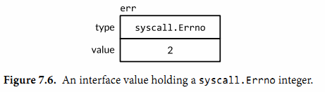
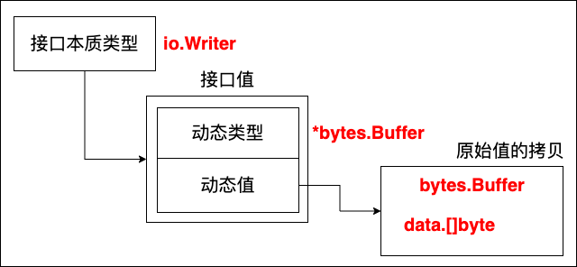

<head>
<style>
    img{margin-left: 20px; margin-right: 20px;}
    #table th{text-align:center;}
    #table td{text-align:center;}
    p{margin-left: 15px; margin-right: 15px;}
    .div_catalogue{padding: 10px 10px; font-size: 16px; background-color: #E0E0E0; word-spacing:0px;  border:1px solid black; border-radius: 10px;}
    .div_licence{font-size: 16px; word-spacing:0px; border:1px solid black;}
    .div_learning_post{font-size: 16px; word-spacing:0px;}
    .div_indicate_source{font-size: 18px; word-spacing:0px; background-color: #E0E0E0;}
    .div_learning_post_boder{padding: 10px 10px; font-size: 16px; word-spacing:0px;  border:1px solid black;}
</style>
<!--支持网页公式显示-->    
<script type="text/javascript" src="https://cdn.mathjax.org/mathjax/latest/MathJax.js?config=AM_HTMLorMML-full"></script>
</head>

<body>

<div align="center" class="div_indicate_source">
  <h4>⚠ 转载请注明出处：<font color="red"><i>协作者：ZobinHuang，更新日期：June.7 2021</i></font></h4>
  <div align="left">
  <font size="2px">
    <p>
    &nbsp;&nbsp;&nbsp;&nbsp;这篇文章内容的一些部分是转载自<a href="https://github.com/gopl-zh/gopl-zh.github.com">Go 语言圣经（中文版）</a>，并加上了本人在使用过程中的一些自己的理解和经验，最终整理成可读性更高的网页形式。在此向原作者和译者表示感谢，他们给社区提供了很棒的 Golang 入门参考。
    <br>&nbsp;&nbsp;&nbsp;&nbsp;原作者：Alan A. A. Donovan · Brian W. Kernighan;
    <br>&nbsp;&nbsp;&nbsp;&nbsp;  译者：柴树杉，Github @chai2010，Twitter @chaishushan；Xargin, https://github.com/cch123；CrazySssst；foreversmart, njutree@gmail.com
  </font>
  </div>
</div>

<div class="div_licence">
  <br>
  <div align="center">
      <a rel="license" href="http://creativecommons.org/licenses/by-nc-nd/4.0/"></a>
  </div>
  <p>
  &nbsp;&nbsp;&nbsp;&nbsp;本<span xmlns:dct="http://purl.org/dc/terms/" href="http://purl.org/dc/dcmitype/Text" rel="dct:type">作品</span>由 <span xmlns:cc="http://creativecommons.org/ns#" property="cc:attributionName"><b>ZobinHuang</b></span> 采用 <a rel="license" href="http://creativecommons.org/licenses/by-nc-nd/4.0/"><font color="red">知识共享署名-非商业性使用-禁止演绎 4.0 国际许可协议</font></a> 进行许可，在进行使用或分享前请查看权限要求。若发现侵权行为，会采取法律手段维护作者正当合法权益，谢谢配合。
  </p>
</div>

<!--表格-->
<!--
<table border="1" align="center">
  <caption>表格</caption>
  <tr>
    <th>A</th>
    <th>B</th>
    <th>C</th>
  </tr>
  <tr>
    <td>xxx</td>
    <td>xxx</td>
    <td>xxx</td>
  </tr>
</table>
-->

<!--图片-->
<!--
<div align="center">
  
</div>
-->

<!--正文-->
<!--
<p>
&nbsp;&nbsp;&nbsp;&nbsp;公式：<span>`\overline{A}\overline{B}`</span>
</p>
-->

<br>

<div class="div_catalogue">
  <div align="center">
    <h2> 目录 </h2>
    <p>
    <font size="2px">此文篇幅较长，故设置目录，有特定需要的内容直接跳转到相关章节查看即可。</font>
  </div>
  <div class="div_learning_post_boder">
    <p>
    &nbsp;&nbsp;&nbsp;&nbsp;Section 0. <a href="#0_preface"><font color="blue"><b>前言</b></font></a>：阐述了本章的内容；
    <p>
    &nbsp;&nbsp;&nbsp;&nbsp;Section 1. <a href="#1_convention"><font color="blue"><b>接口约定</b></font></a>：讨论了 Golang 中关于接口的概念和基本用法；
    <p>
    &nbsp;&nbsp;&nbsp;&nbsp;Section 2. <a href="#2_type"><font color="blue"><b>接口类型</b></font></a>：讨论了 Golang 中定义接口类型的语法；
    <p>
    &nbsp;&nbsp;&nbsp;&nbsp;Section 3. <a href="#3_condition"><font color="blue"><b>实现接口的条件</b></font></a>：讨论了在 Golang 中如何实现一个接口；
    <p>
    &nbsp;&nbsp;&nbsp;&nbsp;Section 4. <a href="#4_flag_Value"><font color="blue"><b>flag.Value 接口</b></font></a>：以 flag.Value 接口为例子，展示了接口的基本使用方法；
    <p>
    &nbsp;&nbsp;&nbsp;&nbsp;Section 5. <a href="#5_value"><font color="blue"><b>接口值</b></font></a>：阐述了 Golang 中接口值的底层原理；
    <br>&nbsp;&nbsp;&nbsp;&nbsp;&nbsp;&nbsp;&nbsp;&nbsp;5.1 <a href="#5_value_1"><font color="blue">警告：一个包含 nil 指针的接口不是 nil 接口</font></a>：“接口动态值是 nil”和“接口动态类型值和动态值是 nil”是不同的！
    <p>
    &nbsp;&nbsp;&nbsp;&nbsp;Section 6. <a href="#6_sort_interface"><font color="blue"><b>sort.Interface 接口</b></font></a>：以 sort.Interface 接口为例，展现了 Golang 接口不依赖于特定类型的特性；
    <p>
    &nbsp;&nbsp;&nbsp;&nbsp;Section 7. <a href="#7_http_handler"><font color="blue"><b>http.handler 接口</b></font></a>：使用 http.handler 接口展现了 Golang 在 Web 后端的基本处理逻辑；
    <p>
    &nbsp;&nbsp;&nbsp;&nbsp;Section 8. <a href="#8_error"><font color="blue"><b>error 接口</b></font></a>：展示了 error 接口的特性；
    <p>
    &nbsp;&nbsp;&nbsp;&nbsp;Section 9. <a href="#9_expression_evaluation"><font color="blue"><b>示例: 表达式求值</b></font></a>：通过基于接口来解析表达式的例子来理解接口；
    <p>
    &nbsp;&nbsp;&nbsp;&nbsp;Section 10. <a href="#10_assertion"><font color="blue"><b>类型断言</b></font></a>：讨论了 Golang 中的类型断言机制：对接口类型进行“具体类型”或“接口类型”的断言；
    <p>
    &nbsp;&nbsp;&nbsp;&nbsp;Section 11. <a href="#11_assertion_for_error"><font color="blue"><b>基于类型断言区别错误类型</b></font></a>：基于接口，通过封装错误类型来实现更具鲁棒性的错误判断；
    <p>
    &nbsp;&nbsp;&nbsp;&nbsp;Section 12. <a href="#12_query_behavior"><font color="blue"><b>通过类型断言询问行为</b></font></a>：展现了如何在使用类型断言判断接口类型后决定代码执行逻辑；
    <p>
    &nbsp;&nbsp;&nbsp;&nbsp;Section 13. <a href="#13_branch"><font color="blue"><b>类型分支</b></font></a>：介绍了 Golang 中 switch-type 的用法；
    <p>
    &nbsp;&nbsp;&nbsp;&nbsp;Section 14. <a href="#14_xml"><font color="blue"><b>示例: 基于标记的 XML 解码</b></font></a>：基于 Section 13 中讨论的 switch-type，完成了一个 XML 解码器的例子；
    <p>
    &nbsp;&nbsp;&nbsp;&nbsp;Section 15. <a href="#15_advice"><font color="blue"><b>一些建议</b></font></a>：给出在 Golang 中使用接口的一些建议
  </div>
</div>

<h2><a name="0_preface">0. 前言</a></h2>
<div class="div_learning_post_boder">
  <p>
  &nbsp;&nbsp;&nbsp;&nbsp;接口类型是对其它类型行为的抽象和概括；因为接口类型不会和特定的实现细节绑定在一起，通过这种抽象的方式我们可以让我们的函数更加灵活和更具有适应能力。
  
  <p>
  &nbsp;&nbsp;&nbsp;&nbsp;很多面向对象的语言都有相似的接口概念，但 Go 语言中接口类型的独特之处在于它是满足<b>隐式实现</b>的。也就是说，我们没有必要对于给定的具体类型定义所有满足的接口类型；简单地拥有一些必需的方法就足够了。这种设计可以让你创建一个新的接口类型满足已经存在的具体类型却不会去改变这些类型的定义；当我们使用的类型来自于不受我们控制的包时这种设计尤其有用。

  <p>
  &nbsp;&nbsp;&nbsp;&nbsp;在本章，我们会开始看到接口类型和值的一些基本技巧。顺着这种方式我们将学习几个来自标准库的重要接口。很多 Go 程序中都尽可能多的去使用标准库中的接口。最后，我们会在本文第 10 节看到类型断言的知识，在本文第 13 节我们会看到类型开关的使用，并且学到他们是怎样让不同的类型的概括成为可能。
</div>

<h2><a name="1_convention">1. 接口约定</a></h2>
<div class="div_learning_post_boder">
  <p>
  &nbsp;&nbsp;&nbsp;&nbsp;目前为止，我们看到的类型都是具体的类型。一个具体的类型可以准确的描述它所代表的值，并且展示出对类型本身的一些操作方式：就像数字类型的算术操作，切片类型的取下标、添加元素和范围获取操作。具体的类型还可以通过它的内置方法提供额外的行为操作。总的来说，当你拿到一个具体的类型时你就知道它的本身是什么和你可以用它来做什么。
  
  <p>
  &nbsp;&nbsp;&nbsp;&nbsp;在 Go 语言中还存在着另外一种类型：接口类型。接口类型是一种抽象的类型。它不会暴露出它所代表的对象的内部值的结构和这个对象支持的基础操作的集合；它们只会表现出它们自己的方法。也就是说当你有看到一个接口类型的值时，你不知道它是什么，唯一知道的就是可以通过它的方法来做什么。

  <p>
  &nbsp;&nbsp;&nbsp;&nbsp;在本书中，我们一直使用两个相似的函数来进行字符串的格式化：fmt.Printf，它会把结果写到标准输出，和 fmt.Sprintf，它会把结果以字符串的形式返回。得益于使用接口，我们不必可悲的因为返回结果在使用方式上的一些浅显不同就必需把格式化这个最困难的过程复制一份。实际上，这两个函数都使用了另一个函数 fmt.Fprintf 来进行封装。fmt.Fprintf 这个函数对它的计算结果会被怎么使用是完全不知道的。

  ```golang
  package fmt

  func Fprintf(w io.Writer, format string, args ...interface{}) (int, error)
  func Printf(format string, args ...interface{}) (int, error) {
    return Fprintf(os.Stdout, format, args...)
  }

  func Sprintf(format string, args ...interface{}) string {
    var buf bytes.Buffer
    Fprintf(&buf, format, args...)
    return buf.String()
  }
  ```

  <p>
  &nbsp;&nbsp;&nbsp;&nbsp;<font color>Fprintf 的前缀 F 表示文件（File）也表明格式化输出结果应该被写入第一个参数提供的文件中</font>。在Printf函数中的第一个参数os.Stdout是*os.File类型；在Sprintf函数中的第一个参数&buf是一个指向可以写入字节的内存缓冲区，然而它并不是一个文件类型尽管它在某种意义上和文件类型相似。

  <p>
  &nbsp;&nbsp;&nbsp;&nbsp;Fprintf 函数中的第一个参数不是一个文件类型，它是 io.Writer 类型，这是一个接口类型定义如下：

  ```golang
  package io

  // Writer is the interface that wraps the basic Write method.
  type Writer interface {
    // Write writes len(p) bytes from p to the underlying data stream.
    // It returns the number of bytes written from p (0 <= n <= len(p))
    // and any error encountered that caused the write to stop early.
    // Write must return a non-nil error if it returns n < len(p).
    // Write must not modify the slice data, even temporarily.
    //
    // Implementations must not retain p.
    Write(p []byte) (n int, err error)
  }
  ```

  <p>
  &nbsp;&nbsp;&nbsp;&nbsp;io.Writer 类型定义了函数 Fprintf 和这个函数调用者之间的约定。一方面这个约定需要调用者提供具体类型的值就像 *os.File 和 *bytes.Buffer，这些类型都有一个特定签名和行为的 Write 的函数。另一方面这个约定保证了 Fprintf 接受任何满足 io.Writer 接口的值都可以工作。Fprintf 函数可能没有假定写入的是一个文件或是一段内存，而是写入一个可以调用 Write 函数的值。

  <p>
  &nbsp;&nbsp;&nbsp;&nbsp;因为 fmt.Fprintf 函数没有对具体操作的值做任何假设，而是仅仅通过 io.Writer 接口的约定来保证行为，所以第一个参数可以安全地传入一个只需要满足 io.Writer 接口的任意具体类型的值。一个类型可以自由地被另一个满足相同接口的类型替换，被称作可替换性（LSP里氏替换）。这是一个面向对象的特征。

  <p>
  &nbsp;&nbsp;&nbsp;&nbsp;让我们通过一个新的类型来进行校验，下面 *ByteCounter 类型里的 Write 方法，仅仅在丢弃写向它的字节前统计它们的长度。（在这个+=赋值语句中，让 len(p) 的类型和 *c 的类型匹配的转换是必须的。）

  ```golang
  type ByteCounter int

  func (c *ByteCounter) Write(p []byte) (int, error) {
    *c += ByteCounter(len(p)) // convert int to ByteCounter
    return len(p), nil
  }
  ```

  <p>
  &nbsp;&nbsp;&nbsp;&nbsp;因为 *ByteCounter 满足 io.Writer 的约定，我们可以把它传入 Fprintf 函数中；Fprintf 函数执行字符串格式化的过程不会去关注 ByteCounter 正确的累加结果的长度。

  ```golang
  var c ByteCounter
  c.Write([]byte("hello"))
  fmt.Println(c) // "5", = len("hello")
  c = 0          // reset the counter
  var name = "Dolly"
  fmt.Fprintf(&c, "hello, %s", name)
  fmt.Println(c) // "12", = len("hello, Dolly")
  ```

  <p>
  &nbsp;&nbsp;&nbsp;&nbsp;除了 io.Writer 这个接口类型，还有另一个对 fmt 包很重要的接口类型。Fprintf 和 Fprintln 函数向类型提供了一种控制它们值输出的途径。在第 1 章，我们为 Celsius 类型提供了一个 String 方法以便于可以打印成这样 "100°C" ，在第 5 章中我们给 *IntSet 添加一个 String 方法，这样集合可以用传统的符号来进行表示就像 "{1 2 3}"。<font color="red">给一个类型定义 String 方法，可以让它满足最广泛使用之一的接口类型 fmt.Stringer：</font>

  ```golang
  package fmt

  // The String method is used to print values passed
  // as an operand to any format that accepts a string
  // or to an unformatted printer such as Print.
  type Stringer interface {
    String() string
  }
  ```

  <p>
  &nbsp;&nbsp;&nbsp;&nbsp;我们会在第 10 小节解释 fmt 包怎么发现哪些值是满足这个接口类型的。
</div>


<h2><a name="2_type">2. 接口类型</a></h2>
<div class="div_learning_post_boder">
  <p>
  &nbsp;&nbsp;&nbsp;&nbsp;<font color="red">接口类型具体描述了一系列方法的集合，一个实现了这些方法的具体类型是这个接口类型的实例。</font>
  
  <p>
  &nbsp;&nbsp;&nbsp;&nbsp;<b>io.Writer 类型</b>是用得最广泛的接口之一，因为它提供了所有类型的写入 bytes 的抽象，包括文件类型，内存缓冲区，网络链接，HTTP 客户端，压缩工具，哈希等等。io 包中定义了很多其它有用的接口类型。<b>Reader</b> 可以代表任意可以读取 bytes 的类型，<b>Closer</b> 可以是任意可以关闭的值，例如一个文件或是网络链接。（到现在你可能注意到了很多 Go 语言中单方法接口的命名习惯）

  ```golang
  package io
  type Reader interface {
    Read(p []byte) (n int, err error)
  }
  type Closer interface {
    Close() error
  }
  ```

  <p>
  &nbsp;&nbsp;&nbsp;&nbsp;再往下看，我们发现有些新的接口类型通过组合已有的接口来定义。下面是两个例子：

  ```golang
  type ReadWriter interface {
    Reader
    Writer
  }
  type ReadWriteCloser interface {
    Reader
    Writer
    Closer
  }
  ```

  <p>
  &nbsp;&nbsp;&nbsp;&nbsp;上面用到的语法和结构内嵌相似，我们可以用这种方式以一个简写命名一个接口，而不用声明它所有的方法。这种方式称为<b>接口内嵌</b>。尽管略失简洁，我们可以像下面这样，不使用内嵌来声明 io.ReadWriter 接口。

  ```golang
  type ReadWriter interface {
    Read(p []byte) (n int, err error)
    Write(p []byte) (n int, err error)
  }
  ```

  <p>
  &nbsp;&nbsp;&nbsp;&nbsp;或者甚至使用一种混合的风格：

  ```golang
  type ReadWriter interface {
    Read(p []byte) (n int, err error)
    Writer
  }
  ```

  <p>
  &nbsp;&nbsp;&nbsp;&nbsp;上面 3 种定义方式都是一样的效果。方法顺序的变化也没有影响，唯一重要的就是这个集合里面的方法。
</div>

<h2><a name="3_condition">3. 实现接口的条件</a></h2>
<div class="div_learning_post_boder">
  <p>
  &nbsp;&nbsp;&nbsp;&nbsp;一个类型如果拥有一个接口需要的所有方法，那么这个类型就实现了这个接口。例如，*os.File 类型实现了 io.Reader，Writer，Closer，和 ReadWriter 接口。*bytes.Buffer 实现了Reader，Writer，和 ReadWriter 这些接口，但是它没有实现 Closer 接口因为它不具有 Close 方法。Go 的程序员经常会简要的把一个具体的类型描述成一个特定的接口类型。举个例子，*bytes.Buffer 是io.Writer；*os.Files 是io.ReadWriter。
  
  <p>
  &nbsp;&nbsp;&nbsp;&nbsp;接口指定的规则非常简单：表达一个类型属于某个接口只要这个类型实现这个接口。所以：

  ```golang
  var w io.Writer
  w = os.Stdout           // OK: *os.File has Write method
  w = new(bytes.Buffer)   // OK: *bytes.Buffer has Write method
  w = time.Second         // compile error: time.Duration lacks Write method

  var rwc io.ReadWriteCloser
  rwc = os.Stdout         // OK: *os.File has Read, Write, Close methods
  rwc = new(bytes.Buffer) // compile error: *bytes.Buffer lacks Close method
  ```

  <p>
  &nbsp;&nbsp;&nbsp;&nbsp;这个规则甚至适用于等式右边本身也是一个接口类型

  ```golang
  w = rwc                 // OK: io.ReadWriteCloser has Write method
  rwc = w                 // compile error: io.Writer lacks Close method
  ```

  <p>
  &nbsp;&nbsp;&nbsp;&nbsp;因为 ReadWriter 和 ReadWriteCloser 包含有 Writer 的方法，所以任何实现了 ReadWriter 和 ReadWriteCloser 的类型必定也实现了 Writer 接口

  <p>
  &nbsp;&nbsp;&nbsp;&nbsp;在进一步学习前，必须先解释一个类型持有一个方法的表示当中的细节。回想在第 5 章中，对于每一个命名过的具体类型 T；它的一些方法的接收者是类型 T 本身然而另一些则是一个 *T 的指针。还记得在 T 类型的参数上调用一个 *T 的方法是合法的，只要这个参数是一个变量；编译器隐式的获取了它的地址。但这仅仅是一个语法糖：T 类型的值不拥有所有 *T 指针的方法，这样它就可能只实现了更少的接口。

  <p>
  &nbsp;&nbsp;&nbsp;&nbsp;举个例子可能会更清晰一点。在第 5 章中，IntSet 类型的 String 方法的接收者是一个指针类型，所以我们不能在一个不能寻址的 IntSet 值上调用这个方法：

  ```golang
  type IntSet struct { /* ... */ }
  func (*IntSet) String() string
  var _ = IntSet{}.String() // compile error: String requires *IntSet receiver (临时变量无法取地址)
  ```

  <p>
  &nbsp;&nbsp;&nbsp;&nbsp;但是我们可以在一个 IntSet 变量上调用这个方法：

  ```golang
  var s IntSet
  var _ = s.String() // OK: s is a variable and &s has a String method
  ```

  <p>
  &nbsp;&nbsp;&nbsp;&nbsp;然而，由于只有 *IntSet 类型有String方法，所以也只有 *IntSet 类型实现了 fmt.Stringer 接口：

  ```golang
  var _ fmt.Stringer = &s // OK
  var _ fmt.Stringer = s  // compile error: IntSet lacks String method
  ```

  <p>
  &nbsp;&nbsp;&nbsp;&nbsp;在第 11 章我们将会看到一个打印出任意值的所有方法的程序，然后可以使用 godoc -analysis=type tool (第 9 章) 展示每个类型的方法和具体类型和接口之间的关系

  <p>
  &nbsp;&nbsp;&nbsp;&nbsp;就像信封封装和隐藏起信件来一样，接口类型封装和隐藏具体类型和它的值。即使具体类型有其它的方法，也<b>只有接口类型暴露出来的方法会被调用到</b>，具体例子如下：

  ```golang
  os.Stdout.Write([]byte("hello")) // OK: *os.File has Write method
  os.Stdout.Close()                // OK: *os.File has Close method

  var w io.Writer
  w = os.Stdout
  w.Write([]byte("hello")) // OK: io.Writer has Write method
  w.Close()                // compile error: io.Writer lacks Close method
  ```

  <p>
  &nbsp;&nbsp;&nbsp;&nbsp;一个有更多方法的接口类型，比如 io.ReadWriter，和少一些方法的接口类型例如 io.Reader，进行对比：更多方法的接口类型会告诉我们更多关于它的值持有的信息，并且对实现它的类型要求更加严格。那么关于 <b>interface{} 类型</b>，它没有任何方法，请讲出哪些具体的类型实现了它？

  <p>
  &nbsp;&nbsp;&nbsp;&nbsp;这看上去好像没有用，但实际上 interface{} 被称为<b>空接口类型</b>是不可或缺的。因为空接口类型对实现它的类型没有要求，所以我们可以将任意一个值赋给空接口类型。

  ```golang
  var any interface{}
  any = true
  any = 12.34
  any = "hello"
  any = map[string]int{"one": 1}
  any = new(bytes.Buffer)
  ```

  <p>
  &nbsp;&nbsp;&nbsp;&nbsp;尽管不是很明显，从本书最早的例子中我们就已经在使用空接口类型。它允许像 fmt.Println 或者第 4 章中的 errorf 函数接受任何类型的参数。

  <p>
  &nbsp;&nbsp;&nbsp;&nbsp;对于创建的一个 interface{} 值持有一个 boolean，float，string，map，pointer，或者任意其它的类型，我们当然不能直接对它持有的值做操作，因为 interface{} 没有任何方法。我们会在第 10 小节中学到一种用类型断言来获取 interface{} 中值的方法。

  <p>
  &nbsp;&nbsp;&nbsp;&nbsp;因为接口与实现只依赖于判断前后者类型的方法集，所以没有必要定义一个具体类型和它实现的接口之间的关系。也就是说，有意地在文档里说明或者程序上断言这种关系偶尔是有用的，但程序上不强制这么做。下面的定义在编译期<b>断言</b>一个 *bytes.Buffer 的值实现了 io.Writer 接口类型:

  ```golang
  // *bytes.Buffer must satisfy io.Writer
  var w io.Writer = new(bytes.Buffer)
  ```

  <p>
  &nbsp;&nbsp;&nbsp;&nbsp;因为任意 *bytes.Buffer 的值，甚至包括 nil 通过 (*bytes.Buffer)(nil) 进行显示的转换都实现了这个接口，所以我们不必分配一个新的变量。并且因为我们绝不会引用变量 w，我们可以使用空标识符来进行代替。总的看，这些变化可以让我们得到一个更朴素的版本：

  ```golang
  // 这段代码是用来在编译时期断言使用，在运行时没有任何意义
  // *bytes.Buffer must satisfy io.Writer
  var _ io.Writer = (*bytes.Buffer)(nil)
  ```

  <p>
  &nbsp;&nbsp;&nbsp;&nbsp;非空的接口类型比如 io.Writer 经常被指针类型实现，尤其当一个或多个接口方法像 Write 方法那样隐式的给接收者带来变化的时候。一个结构体的指针是非常常见的承载方法的类型。

  <p>
  &nbsp;&nbsp;&nbsp;&nbsp;但是并不意味着只有指针类型满足接口类型，甚至连一些有设置方法的接口类型也可能会被 Go 语言中其它的引用类型 (e.g. slice, map, 函数, 方法, 指针, 详见第 5 章) 实现。我们已经看过 slice 类型的方法（geometry.Path，第 5 章）和 map 类型的方法（url.Values，第 5 章），后面还会看到函数类型的方法的例子（http.HandlerFunc，第 7 小节）。甚至基本的类型也可能会实现一些接口；就如我们将在第 4 小节中看到的 time.Duration 类型实现了 fmt.Stringer 接口。

  <p>
  &nbsp;&nbsp;&nbsp;&nbsp;一个具体的类型可能实现了很多不相关的接口。考虑在一个组织出售数字文化产品比如音乐，电影和书籍的程序中可能定义了下列的具体类型：

  ```golang
  Album
  Book
  Movie
  Magazine
  Podcast
  TVEpisode
  Track
  ```

  <p>
  &nbsp;&nbsp;&nbsp;&nbsp;我们可以把每个抽象的特点用接口来表示。一些特性对于所有的这些文化产品都是共通的，例如标题，创作日期和作者列表。

  ```golang
  type Artifact interface {
    Title() string
    Creators() []string
    Created() time.Time
  }
  ```

  <p>
  &nbsp;&nbsp;&nbsp;&nbsp;其它的一些特性只对特定类型的文化产品才有。和文字排版特性相关的只有 books 和 magazines，还有只有 movies 和 TV 剧集和屏幕分辨率相关。

  ```golang
  type Text interface {
    Pages() int
    Words() int
    PageSize() int
  }

  type Audio interface {
    Stream() (io.ReadCloser, error)
    RunningTime() time.Duration
    Format() string // e.g., "MP3", "WAV"
  }

  type Video interface {
    Stream() (io.ReadCloser, error)
    RunningTime() time.Duration
    Format() string // e.g., "MP4", "WMV"
    Resolution() (x, y int)
  }
  ```

  <p>
  &nbsp;&nbsp;&nbsp;&nbsp;这些接口不止是一种有用的方式来分组相关的具体类型和表示他们之间的共同特点。我们后面可能会发现其它的分组。举例，如果我们发现我们需要以同样的方式处理 Audio 和 Video，我们可以定义一个 Streamer 接口来代表它们之间相同的部分而不必对已经存在的类型做改变。

  ```golang
  type Streamer interface {
    Stream() (io.ReadCloser, error)
    RunningTime() time.Duration
    Format() string
  }
  ```

  <p>
  &nbsp;&nbsp;&nbsp;&nbsp;每一个具体类型的组基于它们相同的行为可以表示成一个接口类型。不像基于类的语言，他们一个类实现的接口集合需要进行显式的定义，在 Go 语言中我们可以在需要的时候定义一个新的抽象或者特定特点的组，而不需要修改具体类型的定义。当具体的类型来自不同的作者时这种方式会特别有用。当然也确实没有必要在具体的类型中指出这些共性。
</div>

<h2><a name="4_flag_Value">4. flag.Value接口</a></h2>
<div class="div_learning_post_boder">
  <p>
  &nbsp;&nbsp;&nbsp;&nbsp;
  
  <p>
  &nbsp;&nbsp;&nbsp;&nbsp;在本章，我们会学到另一个标准的接口类型 flag.Value 是怎么帮助命令行标记定义新的符号的。思考下面这个会休眠特定时间的程序：

  ```golang
  var period = flag.Duration("period", 1*time.Second, "sleep period")

  func main() {
    flag.Parse()
    fmt.Printf("Sleeping for %v...", *period)
    time.Sleep(*period)
    fmt.Println()
  }
  ```

  <p>
  &nbsp;&nbsp;&nbsp;&nbsp;在它休眠前它会打印出休眠的时间周期。fmt 包调用 time.Duration 的 String 方法打印这个时间周期是以用户友好的注解方式，而不是一个纳秒数字：

  ```bash
  $ go build gopl.io/ch7/sleep
  $ ./sleep
  Sleeping for 1s...
  ```

  <p>
  &nbsp;&nbsp;&nbsp;&nbsp;默认情况下，休眠周期是一秒，但是可以通过 -period 这个命令行标记来控制。flag.Duration 函数创建一个 time.Duration 类型的标记变量并且允许用户通过多种用户友好的方式来设置这个变量的大小，这种方式还包括和 String 方法相同的符号排版形式。这种对称设计使得用户交互良好。

  ```bash
  $ ./sleep -period 50ms
  Sleeping for 50ms...
  $ ./sleep -period 2m30s
  Sleeping for 2m30s...
  $ ./sleep -period 1.5h
  Sleeping for 1h30m0s...
  $ ./sleep -period "1 day"
  invalid value "1 day" for flag -period: time: invalid duration 1 day
  ```

  <p>
  &nbsp;&nbsp;&nbsp;&nbsp;因为时间周期标记值非常的有用，所以这个特性被构建到了 flag 包中。但是我们为我们自己的数据类型定义新的标记符号也是简单容易的。我们只需要定义一个实现 flag.Value 接口的类型，如下：
  
  ```golang
  package flag

  // Value is the interface to the value stored in a flag.
  type Value interface {
    String() string
    Set(string) error
  }
  ```

  <p>
  &nbsp;&nbsp;&nbsp;&nbsp;String 方法格式化标记的值用在命令行帮助消息中，这样每一个 flag.Value 也是一个 fmt.Stringer。Set 方法解析它的字符串参数并且更新标记变量的值。实际上，Set 方法和 String 是两个相反的操作，所以最好的办法就是对他们使用相同的注解方式。

  <p>
  &nbsp;&nbsp;&nbsp;&nbsp;让我们定义一个允许通过摄氏度或者华氏温度变换的形式指定温度的 celsiusFlag 类型。注意 celsiusFlag 内嵌了一个 Celsius 类型（第 1 章），因此不用实现本身就已经有 String 方法了。为了实现 flag.Value，我们只需要定义 Set 方法：

  ```golang
  // *celsiusFlag satisfies the flag.Value interface.
  type celsiusFlag struct{ Celsius }

  func (f *celsiusFlag) Set(s string) error {
    var unit string
    var value float64
    fmt.Sscanf(s, "%f%s", &value, &unit) // no error check needed
    switch unit {
    case "C", "°C":
      f.Celsius = Celsius(value)
      return nil
    case "F", "°F":
      f.Celsius = FToC(Fahrenheit(value))
      return nil
    }
    return fmt.Errorf("invalid temperature %q", s)
  }
  ```

  <p>
  &nbsp;&nbsp;&nbsp;&nbsp;调用 fmt.Sscanf 函数从输入 s 中解析一个浮点数（value）和一个字符串（unit）。虽然通常必须检查 Sscanf 的错误返回，但是在这个例子中我们不需要因为如果有错误发生，就没有switch case会匹配到。

  <p>
  &nbsp;&nbsp;&nbsp;&nbsp;下面的 CelsiusFlag 函数将所有逻辑都封装在一起。它返回一个内嵌在 celsiusFlag 变量 f 中的 Celsius 指针给调用者。Celsius 字段是一个会通过 Set 方法在标记处理的过程中更新的变量。调用 Var 方法将标记加入应用的命令行标记集合中，有异常复杂命令行接口的全局变量 flag.CommandLine.Programs 可能有几个这个类型的变量。调用 Var 方法将一个 *celsiusFlag 参数赋值给一个 flag.Value 参数，导致编译器去检查 *celsiusFlag 是否有必须的方法。

  ```golang
  // CelsiusFlag defines a Celsius flag with the specified name,
  // default value, and usage, and returns the address of the flag variable.
  // The flag argument must have a quantity and a unit, e.g., "100C".
  func CelsiusFlag(name string, value Celsius, usage string) *Celsius {
    f := celsiusFlag{value}
    flag.CommandLine.Var(&f, name, usage)
    return &f.Celsius
  }
  ```

  <p>
  &nbsp;&nbsp;&nbsp;&nbsp;现在我们可以开始在我们的程序中使用新的标记：
  
  ```golang
  var temp = tempconv.CelsiusFlag("temp", 20.0, "the temperature")

  func main() {
    flag.Parse()
    fmt.Println(*temp)
  }
  ```

  <p>
  &nbsp;&nbsp;&nbsp;&nbsp;下面是典型的场景：

  ```golang
  $ go build gopl.io/ch7/tempflag
  $ ./tempflag
  20°C
  $ ./tempflag -temp -18C
  -18°C
  $ ./tempflag -temp 212°F
  100°C
  $ ./tempflag -temp 273.15K
  invalid value "273.15K" for flag -temp: invalid temperature "273.15K"
  Usage of ./tempflag:
    -temp value
          the temperature (default 20°C)
  $ ./tempflag -help
  Usage of ./tempflag:
    -temp value
          the temperature (default 20°C)
  ```
</div>

<h2><a name="5_value">5. 接口值</a></h2>
<div class="div_learning_post_boder">
  <p>
  &nbsp;&nbsp;&nbsp;&nbsp;概念上讲一个接口的值，接口值，由两个部分组成，一个<b>具体的类型</b>和那个<b>类型的值</b>。它们被称为<b>接口的动态类型</b>和<b>动态值</b>。<font color="red">对于像 Go 语言这种静态类型的语言，类型是编译期的概念；因此一个类型不是一个值。在我们的概念模型中，一些提供每个类型信息的值被称为类型描述符，比如类型的名称和方法。</font>在一个接口值中，类型部分代表与之相关类型的描述符。
  
  <p>
  &nbsp;&nbsp;&nbsp;&nbsp;下面 4 个语句中，变量 w 得到了 3 个不同的值。（开始和最后的值是相同的）

  ```golang
  var w io.Writer
  w = os.Stdout
  w = new(bytes.Buffer)
  w = nil
  ```

  <p>
  &nbsp;&nbsp;&nbsp;&nbsp;让我们进一步观察在每一个语句后的 w 变量的值和动态行为。第一个语句定义了变量 w:

  ```golang
  var w io.Writer
  ```

  <p>
  &nbsp;&nbsp;&nbsp;&nbsp;在 Go 语言中，变量总是被一个定义明确的值初始化，即使接口类型也不例外。对于一个接口的零值就是它的类型和值的部分都是 nil，如下图所示。

  <div align="center">
    
  </div>

  <p>
  &nbsp;&nbsp;&nbsp;&nbsp;<b>一个接口值基于它的动态类型被描述为空或非空</b>，所以这是一个空的接口值。你可以通过使用 w==nil 或者 w!=nil 来判断接口值是否为空。调用一个空接口值上的任意方法都会产生 panic:

  ```golang
  w.Write([]byte("hello")) // panic: nil pointer dereference (w 接口值为空)
  ```

  <p>
  &nbsp;&nbsp;&nbsp;&nbsp;第二个语句将一个 *os.File 类型的值赋给变量 w:

  ```golang
  w = os.Stdout
  ```

  <p>
  &nbsp;&nbsp;&nbsp;&nbsp;这个赋值过程调用了一个具体类型到接口类型的隐式转换，这和显式的使用 io.Writer(os.Stdout) 是等价的。这类转换不管是显式的还是隐式的，都会刻画出操作到的类型和值。这个接口值的动态类型被设为 *os.File 指针的类型描述符，它的动态值持有 os.Stdout 的拷贝；这是一个代表处理标准输出的 os.File 类型变量的指针，如下图所示。

  <div align="center">
    
  </div>

  <p>
  &nbsp;&nbsp;&nbsp;&nbsp;调用一个包含 *os.File 类型指针的接口值的 Write 方法，使得 (*os.File).Write 方法被调用。这个调用输出 “hello”。

  ```golang
  w.Write([]byte("hello")) // "hello"
  ```

  <p>
  &nbsp;&nbsp;&nbsp;&nbsp;通常在编译期，我们不知道接口值的动态类型是什么，所以一个接口上的调用必须使用动态分配。因为不是直接进行调用，所以编译器必须把代码生成在类型描述符的方法 Write 上，然后间接调用那个地址。这个调用的接收者是一个接口动态值的拷贝，os.Stdout。效果和下面这个直接调用一样：

  ```golang
  os.Stdout.Write([]byte("hello")) // "hello"
  ```

  <p>
  &nbsp;&nbsp;&nbsp;&nbsp;第三个语句给接口值赋了一个 *bytes.Buffer 类型的值

  ```golang
  w = new(bytes.Buffer)
  ```

  <p>
  &nbsp;&nbsp;&nbsp;&nbsp;现在动态类型是 *bytes.Buffer 并且动态值是一个指向新分配的缓冲区的指针，如下图所示。

  <div align="center">
    
  </div>

  <p>
  &nbsp;&nbsp;&nbsp;&nbsp;Write 方法的调用也使用了和之前一样的机制：

  ```golang
  w.Write([]byte("hello")) // writes "hello" to the bytes.Buffers
  ```

  <p>
  &nbsp;&nbsp;&nbsp;&nbsp;这次类型描述符是 *bytes.Buffer，所以调用了 (*bytes.Buffer).Write 方法，并且接收者是该缓冲区的地址。这个调用把字符串 “hello” 添加到缓冲区中。

  <p>
  &nbsp;&nbsp;&nbsp;&nbsp;最后，第四个语句将nil赋给了接口值：

  ```golang
  w = nil
  ```
  
  <p>
  &nbsp;&nbsp;&nbsp;&nbsp;这个重置将它所有的部分都设为 nil 值，把变量w恢复到和它之前定义时相同的状态，如上面第一张图所示。

  <p>
  &nbsp;&nbsp;&nbsp;&nbsp;一个接口值可以持有任意大的动态值。例如，表示时间实例的 time.Time 类型，这个类型有几个对外不公开的字段。我们从它上面创建一个接口值：

  ```golang
  var x interface{} = time.Now()
  ```

  <p>
  &nbsp;&nbsp;&nbsp;&nbsp;结果可能和下图相似。从概念上讲，不论接口值多大，动态值总是可以容下它。（这只是一个概念上的模型；具体的实现可能会非常不同）
  <div align="center">
    
  </div>

  <p>
  &nbsp;&nbsp;&nbsp;&nbsp;接口值可以使用 == 和 !＝ 来进行比较。两个接口值相等仅当它们都是 nil 值，或者它们的动态类型相同并且动态值也根据这个动态类型的 == 操作相等。因为接口值是可比较的，所以它们可以用在 map 的键或者作为 switch 语句的操作数。

  <p>
  &nbsp;&nbsp;&nbsp;&nbsp;然而，如果两个接口值的动态类型相同，但是这个动态类型是不可比较的（比如切片），将它们进行比较就会失败并且 panic:

  ```golang
  var x interface{} = []int{1, 2, 3}
  fmt.Println(x == x) // panic: comparing uncomparable type []int
  ```

  <p>
  &nbsp;&nbsp;&nbsp;&nbsp;考虑到这点，接口类型是非常与众不同的。其它类型要么是安全的可比较类型（如基本类型和指针）要么是完全不可比较的类型（如切片，映射类型，和函数），但是在比较接口值或者包含了接口值的聚合类型时，我们必须要意识到潜在的 panic。同样的风险也存在于使用接口作为 map 的键或者 switch 的操作数。只能比较你非常确定它们的动态值是可比较类型的接口值。
  
  <p>
  &nbsp;&nbsp;&nbsp;&nbsp;当我们处理错误或者调试的过程中，得知接口值的动态类型是非常有帮助的。所以我们使用 fmt 包的 %T 动作:
  
  ```golang
  var w io.Writer
  fmt.Printf("%T\n", w) // "<nil>"
  w = os.Stdout
  fmt.Printf("%T\n", w) // "*os.File"
  w = new(bytes.Buffer)
  fmt.Printf("%T\n", w) // "*bytes.Buffer"
  ```

  <p>
  &nbsp;&nbsp;&nbsp;&nbsp;在 fmt 包内部，使用反射来获取接口动态类型的名称。我们会在第 11 章中学到反射相关的知识。

  <h3><a name="5_value_1"></a>5.1 警告：一个包含nil指针的接口不是nil接口</h3>
  <p>
  &nbsp;&nbsp;&nbsp;&nbsp;<font color="red">一个不包含任何值的 nil 接口值和一个刚好包含 nil 指针的接口值是不同的。</font>这个细微区别产生了一个容易绊倒每个 Go 程序员的陷阱。

  <p>
  &nbsp;&nbsp;&nbsp;&nbsp;思考下面的程序。当 debug 变量设置为 true 时，main 函数会将 f 函数的输出收集到一个 bytes.Buffer 类型中。

  ```golang
  const debug = true

  func main() {
    var buf *bytes.Buffer
    if debug {
      buf = new(bytes.Buffer) // enable collection of output
    }
    f(buf) // NOTE: subtly incorrect!
    if debug {
      // ...use buf...
    }
  }

  // If out is non-nil, output will be written to it.
  func f(out io.Writer) {
    // ...do something...
    if out != nil {
      out.Write([]byte("done!\n"))
    }
  }
  ```

  <p>
  &nbsp;&nbsp;&nbsp;&nbsp;我们可能会预计当把变量 debug 设置为 false 时可以禁止对输出的收集，但是实际上在 out.Write 方法调用时程序发生了 panic：

  ```golang
  if out != nil {
    out.Write([]byte("done!\n")) // panic: nil pointer dereference
  }
  ```

  <p>
  &nbsp;&nbsp;&nbsp;&nbsp;<font color="red">当 main 函数调用函数 f 时，它给 f 函数的 out 参数赋了一个 *bytes.Buffer 的空指针</font>，所以 out 的动态值是 nil。然而，它的动态类型是 *bytes.Buffer，意思就是 out 变量是一个包含空指针值的非空接口，如下图所示，所以防御性检查 out!=nil 的结果依然是true。

  <div align="center">
    
  </div>

  <p>
  &nbsp;&nbsp;&nbsp;&nbsp;动态分配机制依然决定 (*bytes.Buffer).Write 的方法会被调用，但是这次的接收者的值是 nil。对于一些如 *os.File 的类型，nil 是一个有效的接收者（详见第 5 章），但是 *bytes.Buffer 类型不在这些种类中。这个方法会被调用，但是当它尝试去获取缓冲区时会发生 panic。

  <p>
  &nbsp;&nbsp;&nbsp;&nbsp;问题在于尽管一个 nil 的 *bytes.Buffer 指针有实现这个接口的方法，它也不满足这个接口具体的行为上的要求。特别是这个调用违反了 (*bytes.Buffer).Write 方法的接收者非空的隐含先觉条件，所以将 nil 指针赋给这个接口是错误的。解决方案就是将 main 函数中的变量 buf 的类型改为 io.Writer，因此可以避免一开始就将一个不完整的值赋值给这个接口：

  ```golang
  var buf io.Writer
  if debug {
    buf = new(bytes.Buffer) // enable collection of output
  }
  f(buf) // OK
  ```

  <p>
  &nbsp;&nbsp;&nbsp;&nbsp;现在我们已经把接口值的技巧都讲完了，让我们来看更多的一些在 Go 标准库中的重要接口类型。在下面的三章中，我们会看到接口类型是怎样用在排序，web 服务，错误处理中的。
</div>

<h2><a name="6_sort_interface">6. sort.Interface 接口</a></h2>
<div class="div_learning_post_boder"> 
  <p>
  &nbsp;&nbsp;&nbsp;&nbsp;排序操作和字符串格式化一样是很多程序经常使用的操作。尽管一个最短的快排程序只要 15 行就可以搞定，但是一个健壮的实现需要更多的代码，并且我们不希望每次我们需要的时候都重写或者拷贝这些代码。
  
  <p>
  &nbsp;&nbsp;&nbsp;&nbsp;幸运的是，sort 包内置的提供了根据一些排序函数来对任何序列排序的功能。它的设计非常独到。在很多语言中，排序算法都是和序列数据类型关联，同时排序函数和具体类型元素关联。相比之下，Go 语言的 sort.Sort 函数不会对具体的序列和它的元素做任何假设。相反，它使用了一个接口类型 sort.Interface 来指定通用的排序算法和可能被排序到的序列类型之间的约定。这个接口的实现由序列的具体表示和它希望排序的元素决定，序列的表示经常是一个切片。

  <p>
  &nbsp;&nbsp;&nbsp;&nbsp;一个内置的排序算法需要知道三个东西：序列的长度，表示两个元素比较的结果，一种交换两个元素的方式；这就是 sort.Interface 的三个方法：

  ```golang
  package sort

  type Interface interface {
    Len() int
    Less(i, j int) bool // i, j are indices of sequence elements
    Swap(i, j int)
  }
  ```

  <p>
  &nbsp;&nbsp;&nbsp;&nbsp;为了对序列进行排序，我们需要定义一个实现了这三个方法的类型，然后对这个类型的一个实例应用 sort.Sort 函数。思考对一个字符串切片进行排序，这可能是最简单的例子了。下面是这个新的类型 StringSlice 和它的 Len，Less 和 Swap 方法

  ```golang
  type StringSlice []string
  func (p StringSlice) Len() int           { return len(p) }
  func (p StringSlice) Less(i, j int) bool { return p[i] < p[j] }
  func (p StringSlice) Swap(i, j int)      { p[i], p[j] = p[j], p[i] }
  ```

  <p>
  &nbsp;&nbsp;&nbsp;&nbsp;现在我们可以通过像下面这样将一个切片转换为一个 StringSlice 类型来进行排序：

  ```golang
  sort.Sort(StringSlice(names))
  ```

  <p>
  &nbsp;&nbsp;&nbsp;&nbsp;这个转换得到一个相同长度，容量，和基于 names 数组的切片值，并且这个切片值的类型有三个排序需要的方法。

  <p>
  &nbsp;&nbsp;&nbsp;&nbsp;对字符串切片的排序是很常用的需要，所以 sort 包提供了 StringSlice 类型，也提供了 Strings 函数能让上面这些调用简化成 sort.Strings(names)。

  <p>
  &nbsp;&nbsp;&nbsp;&nbsp;这里用到的技术很容易适用到其它排序序列中，例如我们可以忽略大小写或者含有的特殊字符。（本书使用 Go 程序对索引词和页码进行排序也用到了这个技术，对罗马数字做了额外逻辑处理）对于更复杂的排序，我们使用相同的方法，但是会用更复杂的数据结构和更复杂地实现 sort.Interface 的方法。

  <p>
  &nbsp;&nbsp;&nbsp;&nbsp;我们会运行上面的例子来对一个表格中的音乐播放列表进行排序。每个 track 都是单独的一行，每一列都是这个 track 的属性像艺术家，标题，和运行时间。想象一个图形用户界面来呈现这个表格，并且点击一个属性的顶部会使这个列表按照这个属性进行排序；再一次点击相同属性的顶部会进行逆向排序。让我们看下每个点击会发生什么响应。

  <p>
  &nbsp;&nbsp;&nbsp;&nbsp;下面的变量 tracks 包含了一个播放列表。（One of the authors apologizes for the other author’s musical tastes.）每个元素都不是 Track 本身而是指向它的指针。<font color="red">尽管我们在下面的代码中直接存储 Tracks 也可以工作，sort 函数会交换很多对元素，所以如果每个元素都是指针而不是 Track 类型会更快，指针是一个机器字码长度而 Track 类型可能是八个或更多。</font>

  ```golang
  type Track struct {
    Title  string
    Artist string
    Album  string
    Year   int
    Length time.Duration
  }

  var tracks = []*Track{
    {"Go", "Delilah", "From the Roots Up", 2012, length("3m38s")},
    {"Go", "Moby", "Moby", 1992, length("3m37s")},
    {"Go Ahead", "Alicia Keys", "As I Am", 2007, length("4m36s")},
    {"Ready 2 Go", "Martin Solveig", "Smash", 2011, length("4m24s")},
  }

  func length(s string) time.Duration {
    d, err := time.ParseDuration(s)
    if err != nil {
      panic(s)
    }
    return d
  }
  ```

  <p>
  &nbsp;&nbsp;&nbsp;&nbsp;printTracks 函数将播放列表打印成一个表格。一个图形化的展示可能会更好点，但是这个小程序使用 text/tabwriter 包来生成一个列整齐对齐和隔开的表格，像下面展示的这样。注意到 *tabwriter.Writer 是满足 io.Writer 接口的。它会收集每一片写向它的数据；它的 Flush 方法会格式化整个表格并且将它写向 os.Stdout（标准输出）。

  ```golang
  func printTracks(tracks []*Track) {
    const format = "%v\t%v\t%v\t%v\t%v\t\n"
    tw := new(tabwriter.Writer).Init(os.Stdout, 0, 8, 2, ' ', 0)
    fmt.Fprintf(tw, format, "Title", "Artist", "Album", "Year", "Length")
    fmt.Fprintf(tw, format, "-----", "------", "-----", "----", "------")
    for _, t := range tracks {
      fmt.Fprintf(tw, format, t.Title, t.Artist, t.Album, t.Year, t.Length)
    }
    tw.Flush() // calculate column widths and print table
  }
  ```

  <p>
  &nbsp;&nbsp;&nbsp;&nbsp;为了能按照 Artist 字段对播放列表进行排序，我们会像对 StringSlice 那样定义一个新的带有必须的 Len，Less 和 Swap 方法的切片类型。

  ```golang
  type byArtist []*Track
  func (x byArtist) Len() int           { return len(x) }
  func (x byArtist) Less(i, j int) bool { return x[i].Artist < x[j].Artist }
  func (x byArtist) Swap(i, j int)      { x[i], x[j] = x[j], x[i] }
  ```

  <p>
  &nbsp;&nbsp;&nbsp;&nbsp;为了调用通用的排序程序，我们必须先将 tracks 转换为新的 byArtist 类型，它定义了具体的排序：

  ```golang
  sort.Sort(byArtist(tracks))
  ```

  <p>
  &nbsp;&nbsp;&nbsp;&nbsp;在按照 artist 对这个切片进行排序后，printTrack 的输出如下

  ```bash
  Title       Artist          Album               Year Length
  -----       ------          -----               ---- ------
  Go Ahead    Alicia Keys     As I Am             2007 4m36s
  Go          Delilah         From the Roots Up   2012 3m38s
  Ready 2 Go  Martin Solveig  Smash               2011 4m24s
  Go          Moby            Moby                1992 3m37s
  ```

  <p>
  &nbsp;&nbsp;&nbsp;&nbsp;如果用户第二次请求“按照 artist 排序”，我们会对 tracks 进行逆向排序。然而我们不需要定义一个有颠倒 Less 方法的新类型 byReverseArtist，因为 sort 包中提供了 Reverse 函数将排序顺序转换成逆序。

  ```golang
  sort.Sort(sort.Reverse(byArtist(tracks)))
  ```

  <p>
  &nbsp;&nbsp;&nbsp;&nbsp;在按照 artist 对这个切片进行逆向排序后，printTrack 的输出如下

  ```bash
  Title       Artist          Album               Year Length
  -----       ------          -----               ---- ------
  Go          Moby            Moby                1992 3m37s
  Ready 2 Go  Martin Solveig  Smash               2011 4m24s
  Go          Delilah         From the Roots Up   2012 3m38s
  Go Ahead    Alicia Keys     As I Am             2007 4m36s
  ```

  <p>
  &nbsp;&nbsp;&nbsp;&nbsp;sort.Reverse 函数值得进行更近一步的学习，因为它使用了第 5 章中的结构体嵌套，这是一个重要的思路。sort 包定义了一个不公开的 struct 类型 reverse，它嵌入了一个 sort.Interface。reverse 的 Less 方法调用了内嵌的 sort.Interface 值的 Less 方法，但是通过交换索引的方式使排序结果变成逆序。

  ```golang
  package sort

  type reverse struct{ Interface } // that is, sort.Interface

  func (r reverse) Less(i, j int) bool { return r.Interface.Less(j, i) }

  func Reverse(data Interface) Interface { return reverse{data} }
  ```

  <p>
  &nbsp;&nbsp;&nbsp;&nbsp;reverse 的另外两个方法 Len 和 Swap 隐式地由原有内嵌的 sort.Interface 提供。因为 reverse 是一个不公开的类型，所以导出函数 Reverse 返回一个包含原有 sort.Interface 值的 reverse 类型实例。<font color="red">(类型不导出，但该类型的实例可导出)</font>

  <p>
  &nbsp;&nbsp;&nbsp;&nbsp;为了可以按照不同的列进行排序，我们必须定义一个新的类型例如 byYear：

  ```golang
  type byYear []*Track
  func (x byYear) Len() int           { return len(x) }
  func (x byYear) Less(i, j int) bool { return x[i].Year < x[j].Year }
  func (x byYear) Swap(i, j int)      { x[i], x[j] = x[j], x[i] }
  ```
  
  <p>
  &nbsp;&nbsp;&nbsp;&nbsp;在使用 sort.Sort(byYear(tracks)) 按照年对 tracks 进行排序后，printTrack 展示了一个按时间先后顺序的列表：

  ```bash
  Title       Artist          Album               Year Length
  -----       ------          -----               ---- ------
  Go          Moby            Moby                1992 3m37s
  Go Ahead    Alicia Keys     As I Am             2007 4m36s
  Ready 2 Go  Martin Solveig  Smash               2011 4m24s
  Go          Delilah         From the Roots Up   2012 3m38s
  ```

  <p>
  &nbsp;&nbsp;&nbsp;&nbsp;对于我们需要的每个切片元素类型和每个排序函数，我们需要定义一个新的 sort.Interface 实现。如你所见，Len 和 Swap 方法对于所有的切片类型都有相同的定义。下个例子，具体的类型 customSort 会将一个切片和函数结合，使我们只需要写比较函数就可以定义一个新的排序。顺便说下，实现了 sort.Interface 的具体类型不一定是切片类型，customSort 是一个结构体类型。

  ```golang
  type customSort struct {
	  t    []*Track
    less func(x, y *Track) bool
  }

  func (x customSort) Len() int           { return len(x.t) }
  func (x customSort) Less(i, j int) bool { return x.less(x.t[i], x.t[j]) }
  func (x customSort) Swap(i, j int)	{ x.t[i], x.t[j] = x.t[j], x.t[i] }
  ```

  <p>
  &nbsp;&nbsp;&nbsp;&nbsp;让我们定义一个多层的排序函数，它主要的排序键是标题，第二个键是年，第三个键是运行时间 Length。下面是该排序的调用，其中这个排序使用了匿名排序函数：

  ```golang
  sort.Sort(customSort{tracks, func(x, y *Track) bool {
    if x.Title != y.Title {
      return x.Title < y.Title
    }
    if x.Year != y.Year {
      return x.Year < y.Year
    }
    if x.Length != y.Length {
      return x.Length < y.Length
    }
    return false
  }})
  ```

  <p>
  &nbsp;&nbsp;&nbsp;&nbsp;这下面是排序的结果。注意到两个标题是 “Go” 的 track 按照标题排序是相同的顺序，但是在按照 year 排序上更久的那个 track 优先。

  ```golang
  Title       Artist          Album               Year Length
  -----       ------          -----               ---- ------
  Go          Moby            Moby                1992 3m37s
  Go          Delilah         From the Roots Up   2012 3m38s
  Go Ahead    Alicia Keys     As I Am             2007 4m36s
  Ready 2 Go  Martin Solveig  Smash               2011 4m24s
  ```

  <p>
  &nbsp;&nbsp;&nbsp;&nbsp;尽管对长度为 n 的序列排序需要 <span>`O(n\logn)`</span> 次比较操作，检查一个序列是否已经有序至少需要 n-1 次比较。sort 包中的 IsSorted 函数帮我们做这样的检查。像 sort.Sort 一样，它也使用 sort.Interface 对这个序列和它的排序函数进行抽象，但是它从不会调用 Swap 方法：这段代码示范了 IntsAreSorted 和 Ints 函数在 IntSlice 类型上的使用：

  ```golang
  values := []int{3, 1, 4, 1}
  fmt.Println(sort.IntsAreSorted(values)) // "false"
  sort.Ints(values)
  fmt.Println(values)                     // "[1 1 3 4]"
  fmt.Println(sort.IntsAreSorted(values)) // "true"
  sort.Sort(sort.Reverse(sort.IntSlice(values)))
  fmt.Println(values)                     // "[4 3 1 1]"
  fmt.Println(sort.IntsAreSorted(values)) // "false"
  ```

  <p>
  &nbsp;&nbsp;&nbsp;&nbsp;为了使用方便，sort 包为 []int、[]string 和 []float64 的正常排序提供了特定版本的函数和类型。对于其他类型，例如 []int64 或者 []uint，尽管路径也很简单，还是依赖我们自己实现。
</div>

<h2><a name="7_http_handler">7. http.Handler 接口</a></h2>
<div class="div_learning_post_boder"> 
  <p>
  &nbsp;&nbsp;&nbsp;&nbsp;在这个小节中，我们会对那些基于 http.Handler 接口的服务器 API 做更进一步的学习：

  ```golang
  package http

  type Handler interface {
    ServeHTTP(w ResponseWriter, r *Request)
  }

  func ListenAndServe(address string, h Handler) error
  ```

  <p>
  &nbsp;&nbsp;&nbsp;&nbsp;ListenAndServe 函数需要一个例如 “localhost:8000” 的服务器地址，和一个所有请求都可以分派的 Handler 接口实例。它会一直运行，直到这个服务因为一个错误而失败（或者启动失败），它的返回值一定是一个非空的错误。

  <p>
  &nbsp;&nbsp;&nbsp;&nbsp;想象一个电子商务网站，为了销售，将数据库中物品的价格映射成美元。下面这个程序可能是能想到的最简单的实现了。它将库存清单模型化为一个命名为 database 的 map 类型，我们给这个类型一个 ServeHttp 方法，这样它可以满足 http.Handler 接口。这个 handler 会遍历整个 map 并输出物品信息。

  ```golang
  type dollars float32

  func (d dollars) String() string { return fmt.Sprintf("$%.2f", d) }

  type database map[string]dollars

  func (db database) ServeHTTP(w http.ResponseWriter, req *http.Request) {
    for item, price := range db {
      fmt.Fprintf(w, "%s: %s\n", item, price)
    }
  }

  func main() {
    db := database{"shoes": 50, "socks": 5}
    log.Fatal(http.ListenAndServe("localhost:8000", db))
  }
  ```

  <p>
  &nbsp;&nbsp;&nbsp;&nbsp;如果我们启动这个服务，

  ```bash
  $ go build gopl.io/ch7/http1
  $ ./http1 &
  ```

  <p>
  &nbsp;&nbsp;&nbsp;&nbsp;然后我们使用浏览器访问 “localhost:8000”，得到以下输出：

  ```bash
  shoes: $50.00
  socks: $5.00
  ```

  <p>
  &nbsp;&nbsp;&nbsp;&nbsp;目前为止，这个服务器不考虑 URL，只能为每个请求列出它全部的库存清单。更真实的服务器会定义多个不同的 URL，每一个都会触发一个不同的行为。让我们使用 /list 来调用已经存在的这个行为并且增加另一个 /price 调用表明单个货品的价格，像这样 /price?item=socks 来指定一个请求参数。

  ```golang
  func (db database) ServeHTTP(w http.ResponseWriter, req *http.Request) {
    switch req.URL.Path {
    case "/list":
      for item, price := range db {
        fmt.Fprintf(w, "%s: %s\n", item, price)
      }
    case "/price":
      item := req.URL.Query().Get("item")
      price, ok := db[item]
      if !ok {
        w.WriteHeader(http.StatusNotFound) // 404
        fmt.Fprintf(w, "no such item: %q\n", item)
        return
      }
      fmt.Fprintf(w, "%s\n", price)
    default:
      w.WriteHeader(http.StatusNotFound) // 404
      fmt.Fprintf(w, "no such page: %s\n", req.URL)
    }
  }
  ```

  <p>
  &nbsp;&nbsp;&nbsp;&nbsp;现在 handler 基于 URL 的路径部分（req.URL.Path）来决定执行什么逻辑。如果这个 handler 不能识别这个路径，它会通过调用 w.WriteHeader(http.StatusNotFound) 返回客户端一个 HTTP 错误；这个检查应该在向w写入任何值前完成。（顺便提一下，http.ResponseWriter 是另一个接口，它在 io.Writer 上增加了发送 HTTP 相应头的方法。）等效地，我们可以使用实用的 http.Error 函数：

  ```golang
  msg := fmt.Sprintf("no such page: %s\n", req.URL)
  http.Error(w, msg, http.StatusNotFound) // 404
  ```

  <p>
  &nbsp;&nbsp;&nbsp;&nbsp;/price 的 case 会调用 URL 的 Query 方法来将 HTTP 请求参数解析为一个 map，或者更准确地说解析为一个 net/url 包中 url.Values 类型的多重映射。然后找到第一个 item 参数并查找它的价格，如果这个货品没有找到会返回一个错误。

  <p>
  &nbsp;&nbsp;&nbsp;&nbsp;这里是一个和新服务器会话的例子：

  ```bash
  $ ./http2 &
  # ./fetch http://localhost:8000/list
  shoes: $50.00
  socks: $5.00
  # ./fetch http://localhost:8000/price?item=socks
  $ 5.00
  # ./fetch http://localhost:8000/price?item=shoes
  $ 50.00
  # ./fetch http://localhost:8000/price?item=hat
  no such item: "hat"
  # ./fetch http://localhost:8000/help
  no such page: /help
  ```

  <p>
  &nbsp;&nbsp;&nbsp;&nbsp;显然我们可以继续向 ServeHTTP 方法中添加 case，但在一个实际的应用中，将每个 case 中的逻辑定义到一个分开的方法或函数中会很实用。此外，相近的 URL 可能需要相似的逻辑，例如几个图片文件可能有形如 /images/*.png 的 URL。因为这些原因，net/http 包提供了一个请求多路器 ServeMux 来简化 URL 和 handlers 的联系。<font color="red">一个 ServeMux 将一批 http.Handler 聚集到一个单一的 http.Handler 中。</font>再一次，我们可以看到满足同一接口的不同类型是可替换的：web 服务器将请求指派给任意的 http.Handler 而不需要考虑它后面的具体类型。

  <p>
  &nbsp;&nbsp;&nbsp;&nbsp;对于更复杂的应用，一些 ServeMux 可以通过组合来处理更加错综复杂的路由需求。Go 语言目前没有一个权威的 web 框架，就像 Ruby 语言有 Rails 和 python 有 Django。这并不是说这样的框架不存在，而是 Go 语言标准库中的构建模块就已经非常灵活以至于这些框架都是不必要的。此外，尽管在一个项目早期使用框架是非常方便的，但是它们带来额外的复杂度会使长期的维护更加困难。

  <p>
  &nbsp;&nbsp;&nbsp;&nbsp;在下面的程序中，我们创建一个 ServeMux 并且使用它将 URL 和相应处理 /list 和 /price 操作的 handler 联系起来，这些操作逻辑都已经被分到不同的方法中。然后我们在调用 ListenAndServe 函数中使用 ServeMux 为主要的 handler。

  ```golang
  func main() {
    db := database{"shoes": 50, "socks": 5}
    mux := http.NewServeMux()
    mux.Handle("/list", http.HandlerFunc(db.list))
    mux.Handle("/price", http.HandlerFunc(db.price))
    log.Fatal(http.ListenAndServe("localhost:8000", mux))
  }

  type database map[string]dollars

  func (db database) list(w http.ResponseWriter, req *http.Request) {
    for item, price := range db {
      fmt.Fprintf(w, "%s: %s\n", item, price)
    }
  }

  func (db database) price(w http.ResponseWriter, req *http.Request) {
    item := req.URL.Query().Get("item")
    price, ok := db[item]
    if !ok {
      w.WriteHeader(http.StatusNotFound) // 404
      fmt.Fprintf(w, "no such item: %q\n", item)
      return
    }
    fmt.Fprintf(w, "%s\n", price)
  }
  ```

  <p>
  &nbsp;&nbsp;&nbsp;&nbsp;让我们关注这两个注册到 handlers 上的调用。第一个 db.list 是一个方法值（第 5 章），它是下面这个类型的值。

  ```golang
  func(w http.ResponseWriter, req *http.Request)
  ```

  <p>
  &nbsp;&nbsp;&nbsp;&nbsp;也就是说 db.list 的调用会援引一个接收者是 db 的 database.list 方法。所以 db.list 是一个实现了 handler 类似行为的函数，但是因为它没有方法（理解：该方法没有它自己的方法），所以它不满足 http.Handler 接口并且不能直接作为 mux.Handle 的第二个参数。

  <p>
  &nbsp;&nbsp;&nbsp;&nbsp;语句 http.HandlerFunc(db.list) 是一个转换而非一个函数调用，因为 http.HandlerFunc 是一个类型。它有如下的定义：

  ```golang
  package http

  type HandlerFunc func(w ResponseWriter, r *Request)

  func (f HandlerFunc) ServeHTTP(w ResponseWriter, r *Request) {
    f(w, r)
  }
  ```

  <p>
  &nbsp;&nbsp;&nbsp;&nbsp;HandlerFunc 显示了在 Go 语言接口机制中一些不同寻常的特点。这是一个实现了接口 http.Handler 的方法的函数类型。ServeHTTP 方法的行为是调用了它的函数本身。因此<font color="red">HandlerFunc 是一个让函数值满足一个接口的适配器，这里函数和这个接口仅有的方法有相同的函数签名。</font>实际上，这个技巧让一个单一的类型例如 database 以多种方式满足 http.Handler 接口：一种通过它的 list 方法，一种通过它的 price 方法等等。

  <p>
  &nbsp;&nbsp;&nbsp;&nbsp;因为 handler 通过这种方式注册非常普遍，ServeMux 有一个方便的 HandleFunc 方法，它帮我们简化 handler 注册代码成这样：

  ```golang
  mux.HandleFunc("/list", db.list)
  mux.HandleFunc("/price", db.price)
  ```

  <p>
  &nbsp;&nbsp;&nbsp;&nbsp;从上面的代码很容易看出应该怎么构建一个程序：由两个不同的 web 服务器监听不同的端口，并且定义不同的 URL 将它们指派到不同的 handler。我们只要构建另外一个 ServeMux 并且再调用一次 ListenAndServe（可能并行的）。但是在大多数程序中，一个 web 服务器就足够了。此外，<font color="red">在一个应用程序的多个文件中定义 HTTP handler 也是非常典型的</font>，如果它们必须全部都显式地注册到这个应用的 ServeMux 实例上会比较麻烦。

  <p>
  &nbsp;&nbsp;&nbsp;&nbsp;所以为了方便，net/http 包提供了一个<b>全局的 ServeMux 实例 DefaultServerMux</b> 和<b>包级别的 http.Handle 和 http.HandleFunc 函数</b>。现在，为了使用 DefaultServeMux 作为服务器的主 handler，我们不需要将它传给 ListenAndServe 函数，nil 值就可以工作。

  ```golang
  func main() {
    db := database{"shoes": 50, "socks": 5}
    http.HandleFunc("/list", db.list)
    http.HandleFunc("/price", db.price)
    log.Fatal(http.ListenAndServe("localhost:8000", nil))
  }
  ```

  <p>
  &nbsp;&nbsp;&nbsp;&nbsp;最后，一个重要的提示：web 服务器在一个新的协程中调用每一个 handler，所以当 handler 获取其它协程或者这个 handler 本身的其它请求也可以访问到变量时，一定要使用预防措施，比如锁机制。我们后面的两章中将讲到并发相关的知识。
</div>


<h2><a name="8_error_interface">8. error 接口</a></h2>
<div class="div_learning_post_boder"> 
  <p>
  &nbsp;&nbsp;&nbsp;&nbsp;从本书的开始，我们就已经创建和使用过神秘的预定义 error 类型，而且没有解释它究竟是什么。实际上它就是 interface 类型，这个类型有一个返回错误信息的单一方法：

  ```golang
  type error interface {
    Error() string
  }
  ```

  <p>
  &nbsp;&nbsp;&nbsp;&nbsp;创建一个 error 最简单的方法就是调用 errors.New 函数，它会根据传入的错误信息返回一个新的 error。整个 errors 包仅只有4行：

  ```golang
  package errors

  func New(text string) error { return &errorString{text} }

  type errorString struct { text string }

  func (e *errorString) Error() string { return e.text }
  ```

  <p>
  &nbsp;&nbsp;&nbsp;&nbsp;承载 errorString 的类型是一个结构体而非一个字符串，这是为了保护它表示的错误避免粗心（或有意）的更新。并且因为是指针类型 *errorString 满足 error 接口而非 errorString 类型，所以每个 New 函数的调用都分配了一个独特的和其他错误不相同的实例。我们也不想要重要的 error 例如 io.EOF 和一个刚好有相同错误消息的 error 比较后相等。

  ```golang
  fmt.Println(errors.New("EOF") == errors.New("EOF")) // "false"
  ```

  <p>
  &nbsp;&nbsp;&nbsp;&nbsp;调用errors.New函数是非常稀少的，因为有一个方便的封装函数 fmt.Errorf，它还会处理字符串格式化。我们曾多次在第 4 章中用到它。

  ```golang
  package fmt

  import "errors"

  func Errorf(format string, args ...interface{}) error {
    return errors.New(Sprintf(format, args...))
  }
  ```

  <p>
  &nbsp;&nbsp;&nbsp;&nbsp;虽然 *errorString 可能是最简单的错误类型，但远非只有它一个。例如，<font color="red">syscall 包提供了 Go 语言底层系统调用 API。</font>在多个平台上，它定义一个实现 error 接口的数字类型 Errno，并且在 Unix 平台上，Errno 的 Error 方法会从一个字符串表中查找错误消息，如下面展示的这样：

  ```golang
  package syscall

  type Errno uintptr // operating system error code

  var errors = [...]string{
    1:   "operation not permitted",   // EPERM
    2:   "no such file or directory", // ENOENT
    3:   "no such process",           // ESRCH
    // ...
  }

  func (e Errno) Error() string {
    if 0 <= int(e) && int(e) < len(errors) {
      return errors[e]
    }
    return fmt.Sprintf("errno %d", e)
  }
  ```

  <p>
  &nbsp;&nbsp;&nbsp;&nbsp;下面的语句创建了一个持有 Errno 值为 2 的接口值，表示 POSIX ENOENT 状况：

  ```golang
  var err error = syscall.Errno(2)
  fmt.Println(err.Error()) // "no such file or directory"
  fmt.Println(err)         // "no such file or directory"
  ```

  <p>
  &nbsp;&nbsp;&nbsp;&nbsp;err 的值图形化的呈现在下图中。

  <div align="center">
    
  </div>
  
  <p>
  &nbsp;&nbsp;&nbsp;&nbsp;上面看到的 Errno 是一个系统调用错误的高效表示方式，它通过一个有限的集合进行描述，并且它满足标准的错误接口。我们会在第 11 小节了解到其它满足这个接口的类型。
</div>

<h2><a name="9_expression_evaluation">9. 示例: 表达式求值</a></h2>
<div class="div_learning_post_boder"> 
  <p>
  &nbsp;&nbsp;&nbsp;&nbsp;在本节中，我们会构建一个简单算术表达式的求值器。我们将<b>使用一个接口 Expr 来表示 Go 语言中任意的表达式</b>。现在这个接口不需要有方法，但是我们后面会为它增加一些。

  ```golang
  // An Expr is an arithmetic expression.
  type Expr interface{}
  ```

  <p>
  &nbsp;&nbsp;&nbsp;&nbsp;我们的表达式语言包括：
  <br>&nbsp;&nbsp;&nbsp;&nbsp;&nbsp;&nbsp;&nbsp;&nbsp;(1) 浮点数符号，即小数点；
  <br>&nbsp;&nbsp;&nbsp;&nbsp;&nbsp;&nbsp;&nbsp;&nbsp;(2) 二元操作符，即 +，-，* 和 /；
  <br>&nbsp;&nbsp;&nbsp;&nbsp;&nbsp;&nbsp;&nbsp;&nbsp;(3) 一元操作符，即 -x 和 +x；
  <br>&nbsp;&nbsp;&nbsp;&nbsp;&nbsp;&nbsp;&nbsp;&nbsp;(4) 调用 pow(x,y)，sin(x)，和sqrt(x)的函数；
  <br>&nbsp;&nbsp;&nbsp;&nbsp;&nbsp;&nbsp;&nbsp;&nbsp;(5) 例如 x 和 pi 的变量；
  <br>&nbsp;&nbsp;&nbsp;&nbsp;&nbsp;&nbsp;&nbsp;&nbsp;(6) 当然也有括号和标准的优先级运算符。

  <p>
  &nbsp;&nbsp;&nbsp;&nbsp;所有的值都是 float64 类型。这下面是一些表达式的例子：

  ```golang
  sqrt(A / pi)
  pow(x, 3) + pow(y, 3)
  (F - 32) * 5 / 9
  ```

  <p>
  &nbsp;&nbsp;&nbsp;&nbsp;下面的五个具体类型表示了具体的表达式类型。Var 类型表示对一个变量的引用（我们很快会知道为什么它可以被输出）；literal类型表示一个浮点型常量；unary 和 binary 类型分别表示有一个或两个运算对象的运算符表达式，这些操作数可以是任意的 Expr 类型；call 类型表示对一个函数的调用，我们限制它的 fn 字段只能是 pow，sin 或者 sqrt。

  ```golang
  // A Var identifies a variable, e.g., x.
  type Var string

  // A literal is a numeric constant, e.g., 3.141.
  type literal float64

  // A unary represents a unary operator expression, e.g., -x.
  type unary struct {
    op rune // one of '+', '-'
    x  Expr
  }

  // A binary represents a binary operator expression, e.g., x+y.
  type binary struct {
    op   rune // one of '+', '-', '*', '/'
    x, y Expr
  }

  // A call represents a function call expression, e.g., sin(x).
  type call struct {
    fn   string // one of "pow", "sin", "sqrt"
    args []Expr
  }
  ```

  <p>
  &nbsp;&nbsp;&nbsp;&nbsp;为了计算一个包含变量的表达式，我们需要一个 environment 变量将变量的名字映射成对应的值：

  ```golang
  type Env map[Var]float64
  ```

  <p>
  &nbsp;&nbsp;&nbsp;&nbsp;我们也需要每个表达式去定义一个 Eval 方法，这个方法会根据给定的 environment 变量返回表达式的值。因为每个表达式都必须提供这个方法，我们将它加入到 Expr 接口中。这个包只会对外公开 Expr，Env，和 Var 类型。调用方不需要获取其它的表达式类型就可以使用这个求值器。

  ```golang
  type Expr interface {
    // Eval returns the value of this Expr in the environment env.
    Eval(env Env) float64
  }
  ```

  <p>
  &nbsp;&nbsp;&nbsp;&nbsp;下面给大家展示一个具体的 Eval 方法。Var 类型的这个方法对一个 environment 变量进行查找，如果这个变量没有在 environment 中定义过这个方法会返回一个零值，literal 类型的这个方法简单的返回它真实的值。

  ```golang
  func (v Var) Eval(env Env) float64 {
    return env[v]
  }

  func (l literal) Eval(_ Env) float64 {
    return float64(l)
  }
  ```

  <p>
  &nbsp;&nbsp;&nbsp;&nbsp;unary 和 binary 的 Eval 方法会递归的计算它的运算对象，然后将运算符 op 作用到它们上。我们不将被零或无穷数除作为一个错误，因为它们都会产生一个固定的结果——无限。最后，call 的这个方法会计算对于 pow，sin，或者 sqrt 函数的参数值，然后调用对应在 math 包中的函数。

  ```golang
  func (u unary) Eval(env Env) float64 {
    switch u.op {
    case '+':
      return +u.x.Eval(env)
    case '-':
      return -u.x.Eval(env)
    }
    panic(fmt.Sprintf("unsupported unary operator: %q", u.op))
  }

  func (b binary) Eval(env Env) float64 {
    switch b.op {
    case '+':
      return b.x.Eval(env) + b.y.Eval(env)
    case '-':
      return b.x.Eval(env) - b.y.Eval(env)
    case '*':
      return b.x.Eval(env) * b.y.Eval(env)
    case '/':
      return b.x.Eval(env) / b.y.Eval(env)
    }
    panic(fmt.Sprintf("unsupported binary operator: %q", b.op))
  }

  func (c call) Eval(env Env) float64 {
    switch c.fn {
    case "pow":
      return math.Pow(c.args[0].Eval(env), c.args[1].Eval(env))
    case "sin":
      return math.Sin(c.args[0].Eval(env))
    case "sqrt":
      return math.Sqrt(c.args[0].Eval(env))
    }
    panic(fmt.Sprintf("unsupported function call: %s", c.fn))
  }
  ```

  <p>
  &nbsp;&nbsp;&nbsp;&nbsp;一些方法会失败。例如，一个 call 表达式可能有未知的函数或者错误的参数个数。用一个无效的运算符如 ! 或者 < 去构建一个 unary 或者 binary 表达式也是可能会发生的（尽管下面提到的 Parse 函数不会这样做）。这些错误会让 Eval 方法 panic。其它的错误，像计算一个没有在 environment 变量中出现过的 Var，只会让 Eval 方法返回一个错误的结果。所有的这些错误都可以通过在计算前检查 Expr 来发现。这是我们接下来要讲的 Check 方法的工作，但是让我们先测试 Eval 方法。

  <p>
  &nbsp;&nbsp;&nbsp;&nbsp;下面的 TestEval 函数是对 evaluator 的一个测试。它使用了我们会在第 10 章讲解的 testing 包，但是现在知道调用 t.Errof 会报告一个错误就足够了。这个函数循环遍历一个表格中的输入，这个表格中定义了三个表达式和针对每个表达式不同的环境变量。第一个表达式根据给定圆的面积 A 计算它的半径，第二个表达式通过两个变量 x 和 y 计算两个立方体的体积之和，第三个表达式将华氏温度 F 转换成摄氏度。

  ```golang
  func TestEval(t *testing.T) {
    tests := []struct {
      expr string
      env  Env
      want string
    }{
      {"sqrt(A / pi)", Env{"A": 87616, "pi": math.Pi}, "167"},
      {"pow(x, 3) + pow(y, 3)", Env{"x": 12, "y": 1}, "1729"},
      {"pow(x, 3) + pow(y, 3)", Env{"x": 9, "y": 10}, "1729"},
      {"5 / 9 * (F - 32)", Env{"F": -40}, "-40"},
      {"5 / 9 * (F - 32)", Env{"F": 32}, "0"},
      {"5 / 9 * (F - 32)", Env{"F": 212}, "100"},
    }
    var prevExpr string
    for _, test := range tests {
      // Print expr only when it changes.
      if test.expr != prevExpr {
        fmt.Printf("\n%s\n", test.expr)
        prevExpr = test.expr
      }
      expr, err := Parse(test.expr)
      if err != nil {
        t.Error(err) // parse error
        continue
      }
      got := fmt.Sprintf("%.6g", expr.Eval(test.env))
      fmt.Printf("\t%v => %s\n", test.env, got)
      if got != test.want {
        t.Errorf("%s.Eval() in %v = %q, want %q\n",
        test.expr, test.env, got, test.want)
      }
    }
  }
  ```

  <p>
  &nbsp;&nbsp;&nbsp;&nbsp;对于表格中的每一条记录，这个测试会解析它的表达式然后在环境变量中计算它，输出结果。这里我们没有空间来展示 Parse 函数，但是如果你使用 go get 下载这个包你就可以看到这个函数。

  <p>
  &nbsp;&nbsp;&nbsp;&nbsp;go test(第 10 章) 命令会运行一个包的测试用例：

  ```bash
  # gopl.io/ch7/eval 是上面代码的地址
  $ go test -v gopl.io/ch7/eval
  ```

  <p>
  &nbsp;&nbsp;&nbsp;&nbsp;这个 -v 标识可以让我们看到测试用例打印的输出；正常情况下像这样一个成功的测试用例会阻止打印结果的输出。这里是测试用例里 fmt.Printf 语句的输出：

  ```bash
  sqrt(A / pi)
      map[A:87616 pi:3.141592653589793] => 167

  pow(x, 3) + pow(y, 3)
      map[x:12 y:1] => 1729
      map[x:9 y:10] => 1729

  5 / 9 * (F - 32)
      map[F:-40] => -40
      map[F:32] => 0
      map[F:212] => 100
  ```

  <p>
  &nbsp;&nbsp;&nbsp;&nbsp;幸运的是目前为止所有的输入都是适合的格式，但是我们的运气不可能一直都有。甚至在解释型语言中，为了静态错误检查语法是非常常见的，<font color="red">静态错误就是不用运行程序就可以检测出来的错误。</font>通过将静态检查和动态的部分分开，我们可以快速的检查错误并且对于多次检查只执行一次而不是每次表达式计算的时候都进行检查。

  <p>
  &nbsp;&nbsp;&nbsp;&nbsp;让我们往 Expr 接口中增加另一个方法。Check 方法对一个表达式语义树检查出静态错误。我们马上会说明它的 vars 参数。

  ```golang
  type Expr interface {
    Eval(env Env) float64
    // Check reports errors in this Expr and adds its Vars to the set.
    Check(vars map[Var]bool) error
  }
  ```

  <p>
  &nbsp;&nbsp;&nbsp;&nbsp;具体的 Check 方法展示在下面。literal 和 Var 类型的计算不可能失败，所以这些类型的 Check 方法会返回一个 nil 值。对于 unary 和 binary 的 Check 方法会首先检查操作符是否有效，然后递归的检查运算单元。相似地对于 call 的这个方法首先检查调用的函数是否已知并且有没有正确个数的参数，然后递归的检查每一个参数。

  ```golang
  func (v Var) Check(vars map[Var]bool) error {
    vars[v] = true
    return nil
  }

  func (literal) Check(vars map[Var]bool) error {
    return nil
  }

  func (u unary) Check(vars map[Var]bool) error {
    if !strings.ContainsRune("+-", u.op) {
      return fmt.Errorf("unexpected unary op %q", u.op)
    }
    return u.x.Check(vars)
  }

  func (b binary) Check(vars map[Var]bool) error {
    if !strings.ContainsRune("+-*/", b.op) {
      return fmt.Errorf("unexpected binary op %q", b.op)
    }
    if err := b.x.Check(vars); err != nil {
      return err
    }
    return b.y.Check(vars)
  }

  func (c call) Check(vars map[Var]bool) error {
    arity, ok := numParams[c.fn]
    if !ok {
      return fmt.Errorf("unknown function %q", c.fn)
    }
    if len(c.args) != arity {
      return fmt.Errorf("call to %s has %d args, want %d",
        c.fn, len(c.args), arity)
    }
    for _, arg := range c.args {
      if err := arg.Check(vars); err != nil {
        return err
      }
    }
    return nil
  }

  var numParams = map[string]int{"pow": 2, "sin": 1, "sqrt": 1}
  ```

  <p>
  &nbsp;&nbsp;&nbsp;&nbsp;我们在两个组中有选择地列出有问题的输入和它们得出的错误。Parse 函数（这里没有出现）会报出一个语法错误和 Check 函数会报出语义错误。

  ```bash
  x % 2               unexpected '%'
  math.Pi             unexpected '.'
  !true               unexpected '!'
  "hello"             unexpected '"'

  log(10)             unknown function "log"
  sqrt(1, 2)          call to sqrt has 2 args, want 1
  ```

  <p>
  &nbsp;&nbsp;&nbsp;&nbsp;Check 方法的参数是一个 Var 类型的集合，这个集合聚集从表达式中找到的变量名。为了保证成功的计算，这些变量中的每一个都必须出现在环境变量中。从逻辑上讲，这个集合就是调用 Check 方法返回的结果，但是因为这个方法是递归调用的，所以对于 Check 方法，填充结果到一个作为参数传入的集合中会更加的方便。调用方在初始调用时必须提供一个空的集合。
</div>


<h2><a name="10_assertion">10. 类型断言</a></h2>
<div class="div_learning_post_boder"> 
  <p>
  &nbsp;&nbsp;&nbsp;&nbsp;<b>类型断言是一个使用在接口值上的操作。</b>语法上它看起来像 <b>x.(T)</b> 被称为断言类型，这里 x 表示一个接口的类型和 T 表示一个类型。<font color="red">一个类型断言检查它操作对象的动态类型是否和断言的类型匹配。</font>

  <p>
  &nbsp;&nbsp;&nbsp;&nbsp;这里有两种可能。第一种，如果断言的类型 T 是一个具体类型，则类型断言检查 x 的动态类型是否和 T 相同。如果这个检查成功了，类型断言的返回结果是 x 的动态值，当然它的类型是 T。换句话说，具体类型的类型断言会它的操作对象中获得具体的值。如果检查失败，接下来这个操作会抛出 panic。例如：

  ```golang
  var w io.Writer
  w = os.Stdout
  f := w.(*os.File)      // success: f == os.Stdout
  c := w.(*bytes.Buffer) // panic: interface holds *os.File, not *bytes.Buffer
  ```

  <p>
  &nbsp;&nbsp;&nbsp;&nbsp;第二种，如果相反地断言的类型 T 是一个接口类型，则类型断言检查 x 的动态类型是否满足 T。如果这个检查成功了，则返回结果是一个<b>有相同动态类型和值部分的接口值，<font color="red">但是其结果为类型 T，而不是 x 的类型。</font></b>换句话说，对一个接口类型的类型断言改变了类型的表述方式，改变了可以获取的方法集合（通常更大），但是它保留了接口值内部的动态类型和值的部分。如果你觉得很绕，看看下面的例子来理解。

  <div align="center">
    
  </div>

  ```golang
  func main(){
    var writer io.Writer	// writer 本质类型：io.Writer；writer 动态类型：nil
    buffer := bytes.Buffer{}
    buffer.Write([]byte("Hello World!"))
    writer = &buffer		// writer 本质类型：io.Writer；writer 动态类型：bytes.Buffer
    fmt.Printf("Type of writer: %T\n", writer) // output: Type of writer: *bytes.Buffer
    if newWriter, ok := writer.(io.ReadWriter); ok {
      // newWriter 本质类型：io.ReadWriter；newWriter 动态类型：bytes.Buffer
      fmt.Printf("Type of newWriter: %T\n", newWriter) // output: Type of newWriter: *bytes.Buffer
    }
  }
  ```

  <p>
  &nbsp;&nbsp;&nbsp;&nbsp;<b><font color="red">【IMPORTANT】</font></b>首先我们先区分一下接口几个易混淆的概念。如上图和上面的代码所示，接口首先有一个本质类型，即这个接口是一个什么接口，在上面的例子中，接口变量 writer 的本质类型就是一个 io.Writer 接口类型。其次，接口又存在着一个动态类型，即这个接口值的第一个部分，记录这这个接口变量实际承载着的是一个什么类型的变量，在上面的例子中，当我们完成 "writer = &buffer" 赋值操作后，writer 的动态类型就为 bytes.Buffer。然后，来到我们此部分要讲清楚的内容，当我们对一个接口进行接口类型的断言时 (即在 x.(T) 中，x 和 T 都是接口)，比如上面我们做的 "newWriter, ok := writer.(io.ReadWriter)"，我们断言 writer 变量是否为 io.ReadWriter 类型接口，<font color="red">注意到实际上这里我们断言的是 writer 变量的动态类型，</font>因此由于 bytes.Buffer 结构体实现了 io.ReadWriter 所要求的方法，所以这个断言是成功的，并且<font color="red">该断言的返回值是<b>一个本质类型为 io.ReadWriter 的，动态类型为  bytes.Buffer 的，动态值为writer 动态值的拷贝的接口变量</b>，即上面的 newWriter</font>。(现在应该清楚多了吧)。另外，值得补充的是<font color="red">当我们调用 "%T" 参数去尝试打印一个接口变量的类型是，我们得到的是其动态类型而非本质类型。</font>若想获取一个接口变量的本质类型，我们在第 11 章讲解反射机制时会进行介绍。
  
  <p>
  &nbsp;&nbsp;&nbsp;&nbsp;下面代码列举了另一个例子，我们都知道，os.Stdout 是一个 *os.File 结构体类型的变量，*os.File 实现了 Read() 和 Write() 方法。因此当我们令 io.Writer 接口类型变量 w = os.Stdout 时，实际上 w 只拥有了 Write() 方法，但是它的动态类型是 *os.File。在下面的第一个类型断言后，w 和 rw 都持有 os.Stdout，因此它们都有一个动态类型 *os.File，但是变量 w 是一个 io.Writer 类型，只对外公开了 *os.File 的 Write 方法，而 rw 变量是一个 io.ReadWriter 类型，因此除了公开 *os.File 的 Write 方法以外，还公开了 *os.File 的 Read 方法。

  ```golang
  var w io.Writer
  // os.Stdout is a global valuable of type *os.File,
  // which has both Read and Write method
  w = os.Stdout 
  rw := w.(io.ReadWriter) // success: *os.File has both Read and Write
  w = new(ByteCounter)
  rw = w.(io.ReadWriter) // panic: *ByteCounter has no Read method
  ```

  <p>
  &nbsp;&nbsp;&nbsp;&nbsp;如果断言操作的对象是一个 nil 接口值，那么不论被断言的类型是什么这个类型断言都会失败。我们几乎不需要对一个更少限制性的接口类型（更少的方法集合）做断言，因为它表现的就像是赋值操作一样，除了对于nil接口值的情况。

  ```golang
  w = rw             // io.ReadWriter is assignable to io.Writer
  w = rw.(io.Writer) // fails only if rw == nil
  ```
  
  <p>
  &nbsp;&nbsp;&nbsp;&nbsp;经常地，对一个接口值的动态类型我们是不确定的，并且我们更愿意去检验它是否是一些特定的类型。<font color="red">如果类型断言出现在一个预期有两个结果的赋值操作中</font>，例如如下的定义，<font color="red">这个操作不会在失败的时候发生 panic</font>，但是替代地返回一个额外的第二个结果，这个结果是一个标识成功与否的布尔值：

  ```golang
  var w io.Writer = os.Stdout
  f, ok := w.(*os.File)      // success:  ok, f == os.Stdout
  b, ok := w.(*bytes.Buffer) // failure: !ok, b == nil
  ```

  <p>
  &nbsp;&nbsp;&nbsp;&nbsp;第二个结果通常赋值给一个命名为 ok 的变量。如果这个操作失败了，那么 ok 就是 false 值，<b>第一个结果等于被断言类型的零值</b>，在这个例子中就是一个 nil 的 *bytes.Buffer 类型。

  <p>
  &nbsp;&nbsp;&nbsp;&nbsp;这个 ok 结果经常立即用于决定程序下面做什么。if 语句的扩展格式让这个变的很简洁：

  ```golang
  if f, ok := w.(*os.File); ok {
    // ...use f...
  }
  ```

  <p>
  &nbsp;&nbsp;&nbsp;&nbsp;当类型断言的操作对象是一个变量，你有时会看见原来的变量名重用而不是声明一个新的本地变量名，这个重用的变量原来的值会被覆盖<b><font color="red">（理解：其实是声明了一个同名的新的本地变量，外层原来的 w 不会被改变）</font></b>，如下面这样：

  ```golang
  if w, ok := w.(*os.File); ok {
    // ...use w...
  }
  ```
</div>


<h2><a name="11_assertion_for_error">11. 基于类型断言区别错误类型</a></h2>
<div class="div_learning_post_boder"> 
  <p>
  &nbsp;&nbsp;&nbsp;&nbsp;思考在 os 包中文件操作返回的错误集合。I/O 可以因为任何的原因导致失败，但是有三种常见的错误必须进行不同的处理：文件已经存在（对于创建操作），找不到文件（对于读取操作），和权限拒绝。os 包中提供了三个帮助函数来对给定的错误值表示的失败进行分类：

  ```golang
  package os

  func IsExist(err error) bool
  func IsNotExist(err error) bool
  func IsPermission(err error) bool
  ```

  <p>
  &nbsp;&nbsp;&nbsp;&nbsp;对这些判断的一个缺乏经验的实现可能会去检查错误消息是否包含了特定的子字符串，

  ```golang
  func IsNotExist(err error) bool {
    // NOTE: not robust!
    return strings.Contains(err.Error(), "file does not exist")
  }
  ```

  <p>
  &nbsp;&nbsp;&nbsp;&nbsp;但是处理 I/O 错误的逻辑可能一个和另一个平台非常的不同，所以这种方案并不健壮，并且对相同的失败可能会报出各种不同的错误消息。在测试的过程中，通过检查错误消息的子字符串来保证特定的函数以期望的方式失败是非常有用的，但对于线上的代码是不够的。

  <p>
  &nbsp;&nbsp;&nbsp;&nbsp;一个更可靠的方式是使用一个专门的类型来描述结构化的错误。os 包中定义了一个 PathError 类型来描述在文件路径操作中涉及到的失败，像 Open 或者 Delete 操作；并且定义了一个叫 LinkError 的变体来描述涉及到两个文件路径的操作，像 Symlink 和 Rename。这下面是 os.PathError：

  ```golang
  package os

  // PathError records an error and the operation and file path that caused it.
  type PathError struct {
    Op   string
    Path string
    Err  error
  }

  func (e *PathError) Error() string {
    return e.Op + " " + e.Path + ": " + e.Err.Error()
  }
  ```

  <p>
  &nbsp;&nbsp;&nbsp;&nbsp;大多数调用方都不知道 PathError 并且通过调用错误本身的 Error 方法来统一处理所有的错误。尽管 PathError 的 Error 方法简单地把这些字段连接起来生成错误消息，PathError 的结构保护了内部的错误组件。调用方需要使用类型断言来检测错误的具体类型以便将一种失败和另一种区分开，具体的类型可以比字符串提供更多的细节。

  ```golang
  _, err := os.Open("/no/such/file")
  fmt.Println(err) // "open /no/such/file: No such file or directory"
  fmt.Printf("%#v\n", err)
  // Output:
  // &os.PathError{Op:"open", Path:"/no/such/file", Err:0x2}
  ```

  <p>
  &nbsp;&nbsp;&nbsp;&nbsp;下面展示这三个帮助函数是怎么工作的，我们看 IsNotExist，它会报出是否一个错误和 syscall.ENOENT (第 8 小节) 或者和有名的错误 os.ErrNotExist 相等），或者这个错误是否是一个 *PathError，若是那么它内部的错误是 syscall.ENOENT 和 os.ErrNotExist 其中之一，IsNotExist 能帮助我们进行判断。

  ```golang
  import (
    "errors"
    "syscall"
  )

  var ErrNotExist = errors.New("file does not exist")

  // IsNotExist returns a boolean indicating whether the error is known to
  // report that a file or directory does not exist. It is satisfied by
  // ErrNotExist as well as some syscall errors.
  func IsNotExist(err error) bool {
    if pe, ok := err.(*PathError); ok {
      err = pe.Err
    }
    return err == syscall.ENOENT || err == ErrNotExist
  }
  ```

  <p>
  &nbsp;&nbsp;&nbsp;&nbsp;下面这里是它的实际使用：

  ```golang
  _, err := os.Open("/no/such/file")
  fmt.Println(os.IsNotExist(err)) // "true"
  ```
</div>


<h2><a name="12_query_behavior">12. 通过类型断言询问行为</a></h2>
<div class="div_learning_post_boder"> 
  <p>
  &nbsp;&nbsp;&nbsp;&nbsp;下面这段逻辑和 net/http 包中 web 服务器负责写入 HTTP 头字段（例如："Content-type:text/html"）的部分相似。io.Writer 接口类型的变量 w 代表 HTTP 响应；写入它的字节最终被发送到某个人的 web 浏览器上。

  ```golang
  func writeHeader(w io.Writer, contentType string) error {
    if _, err := w.Write([]byte("Content-Type: ")); err != nil {
      return err
    }
    if _, err := w.Write([]byte(contentType)); err != nil {
      return err
    }
    // ...
  }
  ```
  
  <p>
  &nbsp;&nbsp;&nbsp;&nbsp;因为 Write 方法需要传入一个 byte 切片而我们希望写入的值是一个字符串，所以我们需要使用 []byte(...) 进行转换。这个转换分配内存并且做一个拷贝，但是这个拷贝在转换后几乎立马就被丢弃掉。让我们假装这是一个 web 服务器的核心部分并且我们的性能分析表示这个内存分配使服务器的速度变慢。这里我们可以避免掉内存分配么？

  <p>
  &nbsp;&nbsp;&nbsp;&nbsp;这个 io.Writer 接口告诉我们关于 w 持有的具体类型的唯一东西：就是可以向它写入字节切片。如果我们回顾 net/http 包中的内幕，我们知道在这个程序中的 w 变量持有的动态类型也有一个允许字符串高效写入的 WriteString 方法；这个方法会避免去分配一个临时的拷贝。（这可能像在黑夜中射击一样，但是许多满足 io.Writer 接口的重要类型同时也有 WriteString 方法，包括 *bytes.Buffer，*os.File 和 *bufio.Writer。）

  <p>
  &nbsp;&nbsp;&nbsp;&nbsp;我们不能对任意 io.Writer 类型的变量 w，假设它也拥有 WriteString 方法。但是我们可以<font color="red">定义一个只有这个方法的新接口并且使用类型断言来检测是否 w 的动态类型满足这个新接口。</font>

  ```golang
  // writeString writes s to w.
  // If w has a WriteString method, it is invoked instead of w.Write.
  func writeString(w io.Writer, s string) (n int, err error) {
    type stringWriter interface {
      WriteString(string) (n int, err error)
    }
    if sw, ok := w.(stringWriter); ok {
      return sw.WriteString(s) // avoid a copy
    }
    return w.Write([]byte(s)) // allocate temporary copy
  }

  func writeHeader(w io.Writer, contentType string) error {
    if _, err := writeString(w, "Content-Type: "); err != nil {
      return err
    }
    if _, err := writeString(w, contentType); err != nil {
      return err
    }
    // ...
  }
  ```

  <p>
  &nbsp;&nbsp;&nbsp;&nbsp;为了避免重复定义，我们将这个检查过程移入到一个实用工具函数 writeString 中，但是它太有用了以致于标准库将它作为 io.WriteString 函数提供。这是向一个 io.Writer 接口写入字符串的推荐方法。

  <p>
  &nbsp;&nbsp;&nbsp;&nbsp;这个例子的神奇之处在于，我们代码中并没有定义了 WriteString 方法的标准接口。一个具体类型只会通过 WriteString 方法决定这个具体类型是否满足 stringWriter 接口。并且上面的技术依赖于一个假设，这个假设就是：如果一个类型满足下面的这个接口，那么 WriteString(s) 方法就必须和 Write([]byte(s)) 有相同的效果：

  ```golang
  interface {
    io.Writer
    WriteString(s string) (n int, err error)
  }
  ```

  <p>
  &nbsp;&nbsp;&nbsp;&nbsp;尽管 io.WriteString 实施了这个假设，但是调用它的函数极少可能会去实施类似的假设。定义一个特定类型的方法隐式地获取了对特定行为的协约。对于 Go 语言的新手，特别是那些来自有强类型语言使用背景的新手，可能会发现它缺乏显式的意图令人感到混乱，但是在实战的过程中这几乎不是一个问题。除了空接口 interface{}，接口类型很少巧合地被实现。

  <p>
  &nbsp;&nbsp;&nbsp;&nbsp;上面的 writeString 函数使用一个类型断言来获知一个普遍接口类型的值是否满足一个更加具体的接口类型。如果满足，它会使用这个更具体接口的行为。这个技术可以被很好的使用，不论这个被询问的接口是一个标准如 io.ReadWriter，或者用户定义的如 stringWriter 接口。

  <p>
  &nbsp;&nbsp;&nbsp;&nbsp;这也是 fmt.Fprintf 函数怎从它接受的参数中区分出满足 error 或者 fmt.Stringer 接口的值。在 fmt.Fprintf 内部，有一个将单个操作对象转换成一个字符串的步骤，像下面这样：

  ```golang
  package fmt

  func formatOneValue(x interface{}) string {
    if err, ok := x.(error); ok {
      return err.Error()
    }
    if str, ok := x.(Stringer); ok {
      return str.String()
    }
    // ...all other types...
  }
  ```

  <p>
  &nbsp;&nbsp;&nbsp;&nbsp;如果 x 满足这两个接口类型中的一个，则具体满足的接口决定对值的格式化方式。如果都不满足，默认的 case 或多或少会统一地使用反射来处理所有的其它类型；我们可以在第 11 章知道具体是怎么实现的。

  <p>
  &nbsp;&nbsp;&nbsp;&nbsp;另外，上面这段代码假设任何有 String 方法的类型都满足 fmt.Stringer 中约定的行为：这个行为会返回一个适合打印的字符串。
</div>


<h2><a name="13_branch">13. 类型分支</a></h2>
<div class="div_learning_post_boder"> 
  <p>
  &nbsp;&nbsp;&nbsp;&nbsp;接口被以两种不同的方式使用。在第一个方式中，以 io.Reader，io.Writer，fmt.Stringer，sort.Interface，http.Handler 和 error 为典型，一个接口的方法表达了实现这个接口的具体类型间的相似性，但是隐藏了代码的细节和这些具体类型本身的操作。重点在于方法上，而不是具体的类型上。

  <p>
  &nbsp;&nbsp;&nbsp;&nbsp;第二个方式是利用一个接口值可以持有各种具体类型值的能力，将这个接口认为是这些类型的联合。类型断言用来动态地区别这些类型，使得对每一种情况都不一样。在这个方式中，重点在于具体的类型满足这个接口，而不在于接口的方法（如果它确实有一些的话），并且没有任何的信息隐藏。我们将以这种方式使用的接口描述为 discriminated unions（可辨识联合）。

  <p>
  &nbsp;&nbsp;&nbsp;&nbsp;如果你熟悉面向对象编程，你可能会将这两种方式当作是 subtype polymorphism（子类型多态）和 ad hoc polymorphism（非参数多态），但是你不需要去记住这些术语。对于本章剩下的部分，我们将会呈现一些第二种方式的例子。

  <p>
  &nbsp;&nbsp;&nbsp;&nbsp;和其它那些语言一样，Go 语言查询一个 SQL 数据库的 API 会清晰地将查询中固定的部分和变化的部分分开。一个调用的例子可能看起来像这样：

  ```golang
  import "database/sql"

  func listTracks(db sql.DB, artist string, minYear, maxYear int) {
    result, err := db.Exec(
      "SELECT * FROM tracks WHERE artist = ? AND ? <= year AND year <= ?",
      artist, minYear, maxYear)
    // ...
  }
  ```

  <p>
  &nbsp;&nbsp;&nbsp;&nbsp;Exec 方法使用 SQL 字面量替换在查询字符串中的每个 '?' ，SQL 字面量表示相应参数的值，它有可能是一个布尔值，一个数字，一个字符串，或者 nil 空值。用这种方式构造查询可以帮助避免 SQL 注入攻击；这种攻击就是对手可以通过利用输入内容中不正确的引号来控制查询语句。在 Exec 函数内部，我们可能会找到像下面这样的一个函数，它会将每一个参数值转换成它的 SQL 字面量符号。

  ```golang
  func sqlQuote(x interface{}) string {
    if x == nil {
      return "NULL"
    } else if _, ok := x.(int); ok {
      return fmt.Sprintf("%d", x)
    } else if _, ok := x.(uint); ok {
      return fmt.Sprintf("%d", x)
    } else if b, ok := x.(bool); ok {
      if b {
        return "TRUE"
      }
      return "FALSE"
    } else if s, ok := x.(string); ok {
      return sqlQuoteString(s) // (not shown)
    } else {
      panic(fmt.Sprintf("unexpected type %T: %v", x, x))
    }
  }
  ```

  <p>
  &nbsp;&nbsp;&nbsp;&nbsp;switch 语句可以简化 if-else 链，如果这个 if-else 链对一连串值做相等测试。一个相似的 <b>type switch（类型分支）</b>可以简化类型断言的 if-else 链。

  <p>
  &nbsp;&nbsp;&nbsp;&nbsp;在最简单的形式中，一个类型分支像普通的 switch 语句一样，它的运算对象是 x.(type) —— 它使用了关键词字面量 type ——并且每个 case 有一到多个类型。一个类型分支基于这个接口值的动态类型使一个多路分支有效。这个 nil 的 case 和 if x == nil 匹配，并且这个 default 的 case 和如果其它 case 都不匹配的情况匹配。一个对 sqlQuote 的类型分支可能会有这些 case：

  ```golang
  switch x.(type) {
    case nil:       // ...
    case int, uint: // ...
    case bool:      // ...
    case string:    // ...
    default:        // ...
  }
  ```
  
  <p>
  &nbsp;&nbsp;&nbsp;&nbsp;和普通 switch 语句一样，<b>每一个 case 会被顺序的进行考虑</b>，并且当一个匹配找到时，这个 case 中的内容会被执行。当一个或多个 case 类型是接口时，case 的顺序就会变得很重要，因为可能会有两个 case 同时匹配的情况。default case相对其它case的位置是无所谓的。它不会允许落空发生。

  <p>
  &nbsp;&nbsp;&nbsp;&nbsp;注意到在原来的函数中，对于 bool 和 string 情况的逻辑需要通过类型断言访问提取的值。因为这个做法很典型，因此类型分支语句有一个扩展的形式，它可以将提取的值绑定到一个在每个 case 范围内都有效的新变量。

  ```golang
  switch x := x.(type) { /* ... */ }
  ```

  <p>
  &nbsp;&nbsp;&nbsp;&nbsp;这里我们已经将新的变量也命名为x；和类型断言一样，重用变量名是很常见的。和一个switch语句相似地，<font color="red">一个类型分支隐式的创建了一个词法块，因此新变量 x 的定义不会和外面块中的 x 变量冲突。每一个 case 也会隐式的创建一个单独的词法块。</font>

  <p>
  &nbsp;&nbsp;&nbsp;&nbsp;使用类型分支的扩展形式来重写 sqlQuote 函数会让这个函数更加的清晰：

  ```golang
  func sqlQuote(x interface{}) string {
    switch x := x.(type) {
    case nil:
      return "NULL"
    case int, uint:
      return fmt.Sprintf("%d", x) // x has type interface{} here.
    case bool:
      if x {
        return "TRUE"
      }
      return "FALSE"
    case string:
      return sqlQuoteString(x) // (not shown)
    default:
      panic(fmt.Sprintf("unexpected type %T: %v", x, x))
    }
  }
  ```

  <p>
  &nbsp;&nbsp;&nbsp;&nbsp;在这个版本的函数中，<b>在每个单一类型的 case 内部，变量 x 和这个 case 的类型相同。</b>例如，变量 x 在 bool 的 case 中是 bool 类型和 string 的 case 中是 string 类型。在所有其它的情况中，变量 x 是 switch 运算对象的类型（接口），在这个例子中运算对象是一个 interface{}。当多个 case 需要相同的操作时，比如 int 和 uint 的情况，类型分支可以很容易的合并这些情况。

  <p>
  &nbsp;&nbsp;&nbsp;&nbsp;尽管 sqlQuote 接受一个任意类型的参数，但是这个函数只会在它的参数匹配类型分支中的一个 case 时运行到结束；其它情况的它会 panic 出 “unexpected type” 消息。虽然 x 的类型是 interface{}，但是我们把它认为是一个 int，uint，bool，string，和 nil 值的 discriminated union（可识别联合）。
</div>

<h2><a name="14_xml">14. 示例: 基于标记的XML解码</a></h2>
<div class="div_learning_post_boder"> 
  <p>
  &nbsp;&nbsp;&nbsp;&nbsp;第 3 章中我们展示了如何使用 encoding/json 包中的 Marshal 和 Unmarshal 函数来将 JSON 文档转换成 Go 语言的数据结构。encoding/xml 包提供了一个相似的 API。当我们想构造一个文档树的表示时使用 encoding/xml 包会很方便，但是对于很多程序并不是必须的。encoding/xml 包也提供了一个更底层的基于标记的 API 用于 XML 解码。在基于标记的样式中，解析器会根据输入产生一个标记流，其中包括四个主要的标记类型－StartElement，EndElement，CharData，和 Comment —— 每一个都是 encoding/xml 包中的具体类型。每一个对 (*xml.Decoder).Token 的调用都返回一个标记。

  <p>
  &nbsp;&nbsp;&nbsp;&nbsp;这里显示的是和这个 API 相关的部分：

  ```golang
  package xml

  type Name struct {
    Local string // e.g., "Title" or "id"
  }

  type Attr struct { // e.g., name="value"
    Name  Name
    Value string
  }

  // A Token includes StartElement, EndElement, CharData,
  // and Comment, plus a few esoteric types (not shown).
  type Token interface{}
  type StartElement struct { // e.g., <name>
      Name Name
      Attr []Attr
  }
  type EndElement struct { Name Name } // e.g., </name>
  type CharData []byte                 // e.g., <p>CharData</p>
  type Comment []byte                  // e.g., <!-- Comment -->

  type Decoder struct{ /* ... */ }
  func NewDecoder(io.Reader) *Decoder
  func (*Decoder) Token() (Token, error) // returns next Token in sequence
  ```

  <p>
  &nbsp;&nbsp;&nbsp;&nbsp;这个没有方法的Token接口也是一个可识别联合的例子。传统的接口如io.Reader的目的是隐藏满足它的具体类型的细节，这样就可以创造出新的实现：在这个实现中每个具体类型都被统一地对待。相反，满足可识别联合的具体类型的集合被设计为确定和暴露，而不是隐藏。可识别联合的类型几乎没有方法，操作它们的函数使用一个类型分支的case集合来进行表述，这个case集合中每一个case都有不同的逻辑。

  <p>
  &nbsp;&nbsp;&nbsp;&nbsp;下面的 xmlselect 程序获取和打印在一个 XML 文档树中确定的元素下找到的文本。使用上面的 API，它可以在输入上一次完成它的工作而从来不要实例化这个文档树。

  ```golang
  // Xmlselect prints the text of selected elements of an XML document.
  package main

  import (
    "encoding/xml"
    "fmt"
    "io"
    "os"
    "strings"
  )

  func main() {
    dec := xml.NewDecoder(os.Stdin)
    var stack []string // stack of element names
    for {
      tok, err := dec.Token()
      if err == io.EOF {
        break
      } else if err != nil {
        fmt.Fprintf(os.Stderr, "xmlselect: %v\n", err)
        os.Exit(1)
      }
      switch tok := tok.(type) {
      case xml.StartElement:
        stack = append(stack, tok.Name.Local) // push
      case xml.EndElement:
        stack = stack[:len(stack)-1] // pop
      case xml.CharData:
        if containsAll(stack, os.Args[1:]) {
          fmt.Printf("%s: %s\n", strings.Join(stack, " "), tok)
        }
      }
    }
  }

  // containsAll reports whether x contains the elements of y, in order.
  func containsAll(x, y []string) bool {
    for len(y) <= len(x) {
      if len(y) == 0 {
        return true
      }
      if x[0] == y[0] {
        y = y[1:]
      }
      x = x[1:]
    }
    return false
  }
  ```

  <p>
  &nbsp;&nbsp;&nbsp;&nbsp;main 函数中的循环每遇到一个 StartElement 时，它把这个元素的名称压到一个栈里，并且每次遇到 EndElement 时，它将名称从这个栈中推出。这个 API 保证了 StartElement 和 EndElement 的序列可以被完全的匹配，甚至在一个糟糕的文档格式中。注释会被忽略。当 xmlselect 遇到一个 CharData 时，只有当栈中有序地包含所有通过命令行参数传入的元素名称时，它才会输出相应的文本。
  
  <p>
  &nbsp;&nbsp;&nbsp;&nbsp;下面的命令打印出任意出现在两层 div 元素下的 h2 元素的文本。它的输入是 XML 的说明文档，并且它自己就是 XML 文档格式的。

  ```bash
  $ go build gopl.io/ch1/fetch
  $ ./fetch http://www.w3.org/TR/2006/REC-xml11-20060816 |
      ./xmlselect div div h2
  html body div div h2: 1 Introduction
  html body div div h2: 2 Documents
  html body div div h2: 3 Logical Structures
  html body div div h2: 4 Physical Structures
  html body div div h2: 5 Conformance
  html body div div h2: 6 Notation
  html body div div h2: A References
  html body div div h2: B Definitions for Character Normalization
  ...
  ```


</div>

<h2><a name="15_advice">15. 一些建议</a></h2>
<div class="div_learning_post_boder"> 
  <p>
  &nbsp;&nbsp;&nbsp;&nbsp;当设计一个新的包时，新手 Go 程序员总是先创建一套接口，然后再定义一些满足它们的具体类型。这种方式的结果就是有很多的接口，它们中的每一个仅只有一个实现。不要再这么做了。这种接口是不必要的抽象：它们也有一个运行时损耗。你可以使用导出机制（第五章）来限制一个类型的方法或一个结构体的字段是否在包外可见。接口是只有当有两个或两个以上的具体类型必须以相同的方式进行处理时才需要的。

  <p>
  &nbsp;&nbsp;&nbsp;&nbsp;当一个接口只被一个单一的具体类型实现时有一个例外，就是由于它的依赖，这个具体类型不能和这个接口存在在一个相同的包中。这种情况下，一个接口是解耦这两个包的一个好方式。

  <p>
  &nbsp;&nbsp;&nbsp;&nbsp;因为在 Go 语言中只有当两个或更多的类型实现一个接口时才使用接口，它们必定会从任意特定的实现细节中抽象出来。结果就是有更少和更简单方法的更小的接口（和 io.Writer 或 fmt.Stringer 一样只有一个）。当新的类型出现时，小的接口更容易满足。对于接口设计的一个好的标准就是 ask only for what you need（只考虑你需要的东西）

  <p>
  &nbsp;&nbsp;&nbsp;&nbsp;我们完成了对方法和接口的学习过程。Go 语言对面向对象风格的编程支持良好，但这并不意味着你只能使用这一风格。不是任何事物都需要被当做一个对象，独立的函数有它们自己的用处，未封装的数据类型也是这样。观察一下，在本教程前 4 章的例子中像 input.Scan 这样的方法被调用不超过二十次，与之相反的是普遍调用的函数如 fmt.Printf。
</div>

<!--ref-->

<h2>附录：参考源</h2>
<div class="div_learning_post">
<p>

1. github.com, <a href="https://github.com/gopl-zh/gopl-zh.github.com/tree/master/ch7">Go语言圣经(中文版) Chapter 7</a>
</p>
</div>

</body>