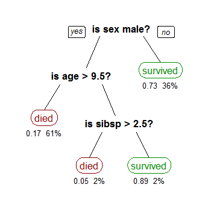

<head>

<!--支持网页公式显示-->    

</head>

<body>

  <h4>⚠ 转载请注明出处：<i>协作者：MinelHuang，更新日期：Dec.14 2021</i></h4>
  

  
  
  

   
  

      
  

  

  &nbsp;&nbsp;&nbsp;&nbsp;本作品由 <b>MinelHuang</b> 采用 <a rel="license" href="http://creativecommons.org/licenses/by-nc-nd/4.0/">知识共享署名-非商业性使用-禁止演绎 4.0 国际许可协议</a> 进行许可，在进行使用或分享前请查看权限要求。若发现侵权行为，会采取法律手段维护作者正当合法权益，谢谢配合。
  

 

  

    <h2> 目录 </h2>
    

    您可以通过目录直接阅读您感兴趣的部分，各章节间并无太大联系。
  

  

    

    &nbsp;&nbsp;&nbsp;&nbsp;Section 0. <a href="#0_preface"><b>机器学习引言</b></a>：机器学习入门相关内容
    

    &nbsp;&nbsp;&nbsp;&nbsp;Section 1. <a href="#section1"><b>逻辑回归算法</b></a>：Logistic Regression
    

    &nbsp;&nbsp;&nbsp;&nbsp;Section 2. <a href="#section2"><b>基于树的算法</b></a>：Tree-based Machine Learning Algorithm
    

    &nbsp;&nbsp;&nbsp;&nbsp;Section 3. <a href="#section3"><b>DNN</b></a>：深度神经网络相关
    

    &nbsp;&nbsp;&nbsp;&nbsp;Section 4. <a href="#section4"><b>联邦学习引言</b></a>：联邦学习入门相关内容
    

    &nbsp;&nbsp;&nbsp;&nbsp;Section 5. <a href="#section5"><b>纵向联邦逻辑回归</b></a>：Heterologous Logistic Regression
    

    &nbsp;&nbsp;&nbsp;&nbsp;Section 6. <a href="#section6"><b>Secureboost</b></a>：纵向联邦树模型
  

 

<h2><a name="0_preface">0. 机器学习引言</a></h2>

    

    &nbsp;&nbsp;&nbsp;&nbsp;该部分您可以参考博客<a href="https://www.cnblogs.com/subconscious/p/4107357.html">博客: 从机器学习谈起</a>，原作者：计算机的潜意识。

<h2><a name="section1">1. 逻辑回归算法</a></h2>

    

    &nbsp;&nbsp;&nbsp;&nbsp;参考文章：<a href="https://zhuanlan.zhihu.com/p/74874291">【机器学习】逻辑回归（非常详细）</a>   
    &nbsp;&nbsp;&nbsp;&nbsp;逻辑回归（Logistic Regression, 后文简称LR）是一种经典的算法，广泛应用于统计学与机器学习领域，因其简单、可并行化、可解释性强而深受工业界喜爱。下面简要对逻辑回归学习做些许介绍，具体可参考上述链接。 
     
     
    

    &nbsp;&nbsp;&nbsp;&nbsp;关于逻辑回归的Python实现您可以参考此blog: <a href="https://neth-lab.netlify.app/publication/21-4-18-logistic-regression/">Logistic Regression in Practice</a>

<h2><a name="section2">2. </a>基于树的算法</h2>

    

    &nbsp;&nbsp;&nbsp;&nbsp;回顾下之前的线性模型，在线性模型中，我们对每个特征附上权重，与输入相乘相加后的到一个新的值，我们使用这个值来对输入进行划分。而在树模型中，我们需要对特征一个一个处理。决策树与逻辑回归的分类区别也如此，逻辑回归是将所有特征变化为概率，大于某一阈值的划分一类；决策树是对每个特征做一个划分。

<h3>2.1 决策树算法</h3>
    &nbsp;&nbsp;&nbsp;&nbsp;参考资料：
    <ul>
    <li><a href="https://towardsdatascience.com/decision-trees-in-machine-learning-641b9c4e8052">Decision Trees in Machine Learning</a>
    <li><a href="https://zhuanlan.zhihu.com/p/139523931">决策树算法--CART分类树算法</a>
    <li><a href="https://zhuanlan.zhihu.com/p/139519852">决策树算法--CART回归树算法</a>
    <li><a href="https://wizardforcel.gitbooks.io/dm-algo-top10/content/cart.html">数据挖掘十大经典算法--CART: 分类与回归树</a>
    </ul>
<h4>2.1.1 从一个例子出发</h4>
    

    &nbsp;&nbsp;&nbsp;&nbsp;假设我们想得到一个模型，用于预测在一场事故中，什么样的乘客可以生还。数据使用3个特征来表示：性别、年龄和配偶+孩子的数量。 
    &nbsp;&nbsp;&nbsp;&nbsp;我们最终得到如下的一个树结构： 
     
    &nbsp;&nbsp;&nbsp;&nbsp;其中，黑色粗体为节点，代表一种情况，最上方的节点为根节点；每个节点将树分为不同的分支（branches），当节点不再可分时，即在branch的末尾，为叶子，图中以红色和绿色表示。 
    

    &nbsp;&nbsp;&nbsp;&nbsp;从这么一个决策树来看，乘客是否能生还是非常清晰可见的，并且特征间的关系也清晰可见。那么如何从数据得出这么一个模型呢？一种方法为Classification Tree，其目标为将乘客分类成survived和died两种；另一种为Regression Tree，表示方法与CT相同，只是RT是用来预测连续值得，比如房价。
    

    &nbsp;&nbsp;&nbsp;&nbsp;构建决策树，我们需要知道每个节点该使用哪个特征，需要知道节点splitting时的条件，需要知道何时结束（得到叶子节点）。在算法中通常树是在随机生长的，故我们还需要知道如何修整它。

<h4>2.1.2 Recursive Binary Splitting</h4>
    

    &nbsp;&nbsp;&nbsp;&nbsp;最开始我们仅含一个根节点，并且所有的feature还没有分割开。我们有3个features，所以我们有3种可能使用的splits。一个最简单的方式为，计算每种方式的cost函数，选择最小的情况最为分割方式。在本例中我们选择sex作为根节点，随后的分割方法同样可以以这种方式进行。这种方法也被称为贪心算法。所以我们发现，在树模型中，最为关键的是如何评估每种splitting的开销（cost），我们将cost的评估方法统称为cost function。

<h3>2.2 CART</h3>
    

    &nbsp;&nbsp;&nbsp;&nbsp;参考资料：<a href="https://wires.onlinelibrary.wiley.com/doi/full/10.1002/widm.8">Classification and regression trees. Wei-Yin Loh. 2011</a>
    

    &nbsp;&nbsp;&nbsp;&nbsp;本节将介绍一个经典的决策树算法，CART算法。CART全称为: Classification and regression trees，即分类回归树。首先，在上文中我们简单概述了树模型的一般流程，那么现在我们用数学上的定义来更加准确的定义所谓树模型。 
    

    &nbsp;&nbsp;&nbsp;&nbsp;对于一次观测，随机变量`Y=\{1, 2, 3, ..., k\}`表示此次观测的结果（标签），使用`p`维随机变量`X=\{X_1, X_2, ..., X_p\}`表示观测对象（`p`个特征），我们需要找到一个模型`f`，使得`Y = f(X)`。树模型的思想是，我们可以找一种分类方式对`X`进行分割（partition），将其从一个`p`维随机变量分割成`k`个集合`A_1, A_2, ..., A_k`，根据分割结果，若`X \in A_j`，则代表`Y = j`。我们可以使用树结构来代表这一过程，该树则被称为分类树（classification tree）。
     
    

    &nbsp;&nbsp;&nbsp;&nbsp;如Figure 1右，一个2维随机变量`X`被分割成两组（根据`X_2`分割）`X|X_2 \leq 0.7, X|X_2 > 0.7`，再根据`X_1`，我们最终将`X`归类到`A_1, A_2, A_3`三类。例如，当`X=(1, 0)`时，根据分割结果，`X \in A_3`，即绿色叶节点，故`Y=3`。注意，这里的分割并不指的是降维，而是根据某一个或者几个纬度`X_i`来对`X`进行分组，我们的目的是可以将`X`分至`k`个组，进而得到对`Y`的预测结果。 
    

    &nbsp;&nbsp;&nbsp;&nbsp;下面我们来介绍CART算法，该算法用来指导如何对一个节点进行split。首先我们从上面对树模型的定义可以发现，split的作用是，将预测结果Y相同的X分成同一组，也就是说，split后的X之间应该更相似，或者说更纯（pure）。CART使用基尼系数Gini来表示数据集D的纯度，其公式为： 
    &nbsp;&nbsp;&nbsp;&nbsp;`Gini(D) = \sum_{i=1}^{k} p(y_i)*(1-p(y_i))` 
    &nbsp;&nbsp;&nbsp;&nbsp;其中`p(y_i)`代表在`D`这一分组中，`y_i`这一标签出现的概率，`k`代表总的标签种类个数。 
    

    &nbsp;&nbsp;&nbsp;&nbsp;故在一次split中，尝试根据某一个特征`x_i`进行划分，而后分别计算划分后的两组D的Gini指数。通过计算划分前和划分后的Gini增益，选择让Gini指数下降最大的一种split方式。 
    

    &nbsp;&nbsp;&nbsp;&nbsp;最终，我们可以通过以上这种贪心的方法逐渐的减小Gini指数，也即划分出来的组越纯。在划分完后，还需使用剪枝的方法防止过拟合，在本文中将不再介绍。

<h2><a name="section3">3. </a>DNN</h2>

    

    &nbsp;&nbsp;&nbsp;&nbsp;关于DNN基础，您可以参考<a href="https://zhuanlan.zhihu.com/p/29815081">https://zhuanlan.zhihu.com/p/29815081</a>此文章，在本节笔者将以此文章为基础，介绍如何进行分布式的DNN训练。 
    

    &nbsp;&nbsp;&nbsp;&nbsp;DNN中一次迭代的步骤可以如下表示： 
    

    -------------------------------- 
    # 前向传播 
    for l = 2 to L: 
    &nbsp;&nbsp;&nbsp;&nbsp;# l: 第l层; W^l,b^l: 第l层的权重和偏转, `\sigma`: 激活函数  
    &nbsp;&nbsp;&nbsp;&nbsp;计算`a^l = \sigma(W^l a^{l-1} + b^l)` 
    计算输出层的`\delta^L` 
    # 反向传播 
    for l = L to 2: 
    &nbsp;&nbsp;&nbsp;&nbsp;# `z^l`: 第l层激活函数的输入 
    &nbsp;&nbsp;&nbsp;&nbsp;计算`\delta^l = (W^{l+1})^T \delta^{l+1} \odot \sigma'(z^l)` 
    # 更新W和b 
    for l = 2 to b: 
    &nbsp;&nbsp;&nbsp;&nbsp;`W^l = W^l - \alpha \sum_{i=1}^m {\delta^l (a^{l-1})^T}` 
    &nbsp;&nbsp;&nbsp;&nbsp;`b^l = b^l - \alpha \sum_{i=1}^m \delta^l` 
    -------------------------------- 
    

    &nbsp;&nbsp;&nbsp;&nbsp;从上述步骤可以看到，当第k此迭代时，`a^{l,k}, z^{l,k}`的计算需要第k-1次迭代时的`W^{l,k-1}`，也即需要`\delta^{l,k-1}`来更新W；同时层与层之间的计算也具有联系，即计算l层需要l-1层的结果。故可以说DNN的训练过程是复杂的，针对复杂计算的并行化可以考虑分布式的执行function，如下图： 
     
    &nbsp;&nbsp;&nbsp;&nbsp;如若使用PS架构，可以构建上述Task Dependencies，使workers可以分布式的执行前向传播和反向传播过程，中间变量由parameter servers维护。如此，每个worker预先拷贝好其需要的数据集，再依照Task Dependencies执行即可。

    

<h2><a name="section4">4. </a>联邦学习引言</h2>

    

    &nbsp;&nbsp;&nbsp;&nbsp;关于此节内容，您可以参考此blog：<a href="https://neth-lab.netlify.app/publication/21-3-2-overview-of-federated-learning/">Overview of Federated Learning</a>

<h2><a name="section5">5. </a>纵向联邦逻辑回归</h2>

    

    &nbsp;&nbsp;&nbsp;&nbsp;关于heterogeneous federated logistic regression，在<a href="https://neth-lab.netlify.app/publication/21-4-13-heterologous-logistic-regression/">Heterologous Logistic Regression</a>中笔者对其进行了系统解读。以下内容则是对该博客的补充。 
    

     
     
    &nbsp;&nbsp;&nbsp;&nbsp;那么一次Hetero-LR过程可以概括为： 
     
    &nbsp;&nbsp;&nbsp;&nbsp;其中，[[·]]代表使用同态加密方法加密数据。
     
     

<h2><a name="section6">6. </a>Secureboost</h2>

    

    &nbsp;&nbsp;&nbsp;&nbsp;参考资料：<a href="https://ieeexplore.ieee.org/abstract/document/9440789">SecureBoost: A Lossless Federated Learning Framework</a>. 2021. IEEE Intelligent Systems
    <h3>Problem Statement</h3>
    

    &nbsp;&nbsp;&nbsp;&nbsp;设`\{X^k \in \mathbb{R}^{n_k \times d_k} \}_{k=1}^m`，`X_k`代表数据集，其分布在`m`个parties中。对于一个party，数据集`X^1`有`d_1`个features，其feature set使用`\mathcal{F}^1 = \{f_1, \dot , f_{d_1}\}`表示。对于任意两个parties `p, q`，`\mathcal{F}^p \cap \mathcal{F}^q = \o`。仅有一个party持有标签`Y`。 
    

    &nbsp;&nbsp;&nbsp;&nbsp;首先，简单提一下XGBoost过程，如下： 
     
    

    &nbsp;&nbsp;&nbsp;&nbsp;`l`为损失函数，这里我们可以简单的使用平方损失函数`l(y_i, \hat{y_i} = (y_i - \hat{y_i})^2)`，`\Omega`代表正则项。对XGBoost更深的理解请参考另一博文<a href="https://www.cnblogs.com/mantch/p/11164221.html">终于有人说清楚了--XGBoost算法</a>
    

    &nbsp;&nbsp;&nbsp;&nbsp;在第`t`次迭代时，最小化(3)式来进行split。在得到最优的树后，计算每个叶子结点的权重。我们发现，上述两步计算都依赖于`g_i, h_i`，并且根据这两个参数，还可以得出class label。例如，`g_i = \hat{y_i}^{t-1} - y_i`。 
    

    &nbsp;&nbsp;&nbsp;&nbsp;于是我们可以得出：(a) 未持有标签的参与方可以根据本地数据和`g_i, h_i`计算出本地最佳split。 (b) `g_i, h_i`应该被认为是敏感数据，也即不同party间应该交互的是加密后的`g_i,h_i`。在一次split中，和XGBoost一样，需要对于每一个可能的feature分割点进行穷举，并对每次分割使用(3)式打分，使(3)式最低的可以认为是最佳分割点。我们发现，(3)式的计算是需要知道`\sum g_i, \sum h_i`的，于是现在问题变为，当各个party持有不同feature，并只有active party持有label时该如何计算`\sum g_i, \sum h_i`。 
    

    &nbsp;&nbsp;&nbsp;&nbsp;首先，论文中使用了approximation scheme用于减少参与方交互`g_i, h_i`的次数，其各参与方计算梯度的过程如下： 
     
    

    &nbsp;&nbsp;&nbsp;&nbsp;每个passive party使用local data计算完`G, H`矩阵后将其发送给active party，注意这里两个矩阵中的值都已经经历过同态加密，故不会有信息泄露。在active party中经历如下过程：
     
    

    &nbsp;&nbsp;&nbsp;&nbsp;该过程即active party计算自身的gradient，而后将其加入进`G, H`矩阵中，再使用矩阵中的值计算最终的score。通过score，active party得到了最佳的feature分割点`k_{opt}`和最佳阈值`v_{opt}`。当然还有一个问题，我们发现对于passive party而言，是需要输入由active party计算好的`g_i, h_i`的，那么active party当然也得先有`\hat{y_i}`，所以最后一块拼图为，如何得到`\hat{y_i}`？ 
     
    

    &nbsp;&nbsp;&nbsp;&nbsp;对于一条record `x_1`，我们需要得到其预测值`\hat{y_1}`。于是从root node开始一步一步的进行判断，root node中需要根据passive party 1中的feature Bill Payment进行判决，故active party通知party 1；party 1发现`x_1`被划分到node 1，故与party 3进行交互，让party 3进行下一步。最终我们得到`x_1`的预测值为`w_2`，并传递给所有参与方。于是，active party可以计算出`g_i, h_i`并传递给各个passive party，再进行上述的`G, H`和score计算过程。

