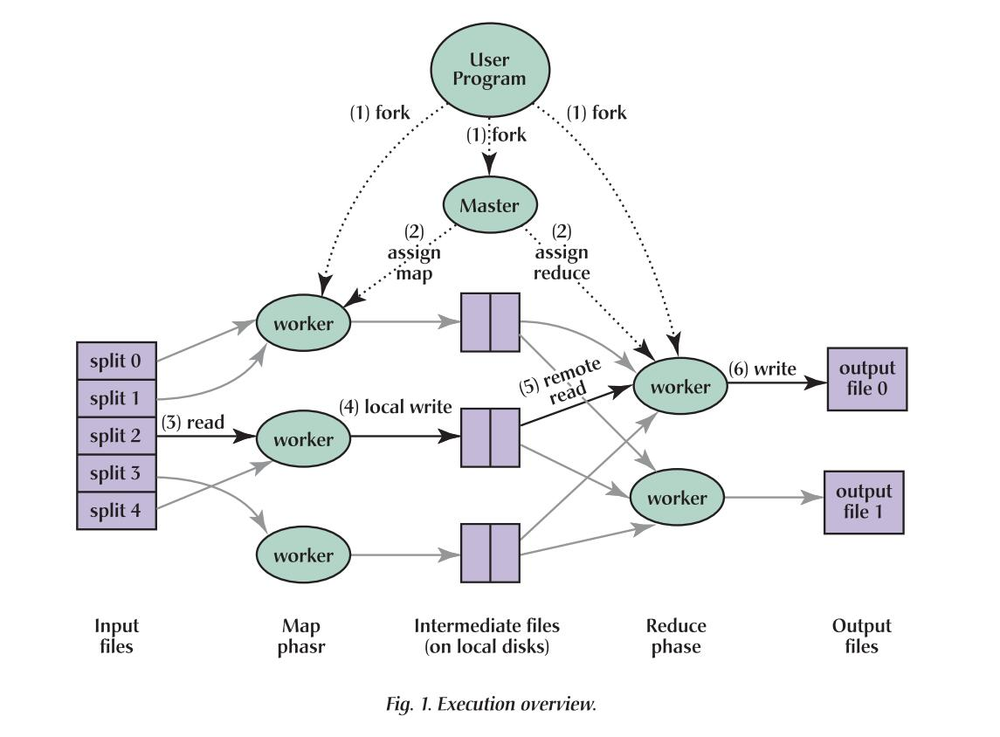

更新时间：2020/01/04

参考资料：
1. [Paper: MapReduce](https://web.a.ebscohost.com/ehost/pdfviewer/pdfviewer?vid=1&sid=9013be7a-0da3-4746-a036-a83a903ca665%40sdc-v-sessmgr01)

## 01 Introduction

为什么要设计MapReduce：在大数据处理过程中，实际上是有很多简单的运算的，比如说统计字符，排序等等，在单机系统上，处理它们的程序很简单。然而，由于数据量十分庞大，原本单机上的排序等程序需要在一个分布式系统上运行，这使得programmer不得不去编写大量的复杂程序以达到容错的目的，一个简单的排序问题变得十分复杂。这种简单但输入又十分庞大的问题，被称为straightforward，或者说是批处理问题。于是，大量的程序员要为一个批处理问题编写大量的程序，这显然是太消耗成本的。所以MapReduce出现了，它将分布式系统变成一个abstraction层，程序员是在该层次之上进行编程的，于是，MapReduce将分布式系统程序需要考虑的fault tolerance等问题隐藏起来，程序员也仅仅需要编写简单的程序了。

总结：MapReduce的目的是将分布式系统编程abstraction layer，令使用该系统的人感受不到其在使用一个分布式系统。

MapReduce是如何做的：对外开放Map和Reduce函数，使用该分布式系统的人只需要编写这两个函数即可，不需要考虑冲突与容错问题。

## 02 Programming Model

待处理的数据一般为结构化数据，即可以使用key/value (k-v pair) 表示。故MapReduce认为计算任务的输入是a set of k-v pairs，输出是a set of k-v pairs，将整个过程可以拆分为Map和Reduce，如下：

Map：输入为1个k-v pair，并输出a set of intermediate k-v pairs。之后MapReduce library groups会将所有的intermediate values和要给intermediate key I组成k-v pairs，传递给Reduce。

Reduce：输入为intermediate key I和a set of intermediate values，之后merges values together to form a possibly smaller set of values。

例子如下：

假如Google需要统计所有文件中的词汇的个数，那么系统可以抽象成下图：

我们打算使用3台机器分别处理1，2，3号文件，那么首先文件会进入Map函数，将**一个文件中的数据（一个k-v pair）处理成一组k-v pairs**，(a, 1)代表词汇a出现了1次，（b, 1）代表词汇b出现了1次；而后，将所有的k=a的(k, v)输入进Reduce函数，b和c同理，在Reduce函数里做**多个(k, v)的运算，使之输出1个(k,v)**。最终，我们实现了统计词汇的功能。

显然，使用MapReduce的程序员在编写上述程序时，不需要考虑分布式系统，也即分布式系统成为了abstraction layer

## 03 Implementation

如上图，用户需要编写Map和Reduce函数，将程序交付给Master节点。Master拥有全部的信息，它会将输入文件分解成16-64MB的小文件，交付给不同的worker处理。worker可能运行Map任务或者Reduce任务，由Master进行分配。在Map worker处理完后，会将结果写在自身的存储磁盘中，而后Reduce worker通过RPC访问，从而进行Reduce函数处理。全部操作结束后，master会wakes up user program。

### 3.1 Master Data Structure

master节点维护以下几种数据结构：

- map / reduce task state: *idle*, *in-progress*, or *completed* 
- worker标识（仅标识non-idle tasks）

map task结束后，中间值要传递给reduce task，这一过程是需要通过master节点调度的。故master节点会存储每个map task所运行的位置和产生的R intermediate file的大小。在map task结束后，worker会将这些值update至master节点，而后信息将被传递给运行 in-progress reduce tasks的workers。

### 3.2 Fault Tolerance

#### 3.2.1 Handing Worker Failures

如何判定worker出现故障？答：master节点周期性ping各个worker节点，若没有收到答复，则代表该worker故障。

针对idle worker节点，故障后仅代表不可用即可；对于in-progress节点，很明显其运行结果是不可信的，故在master节点中将其全部标记为idle，等待重分配任务；对于completed节点，map task的运行结果是保存在worker本地磁盘中，结果不可信，故此map task需要重新运行，reduce task的运行结果已经保存至GFS（Global File System）中，结果是可信的，故不需要重新运行。

