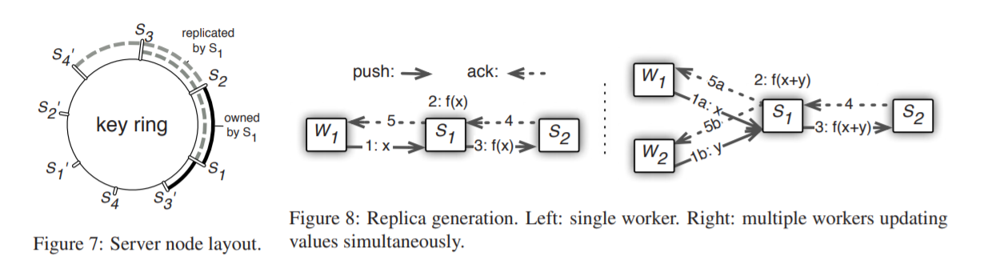

<head>

<!--支持网页公式显示-->    

</head>

<body>

  <h4>⚠ 转载请注明出处：<i>Maintainer: MinelHuang，更新日期：Oct.04 2021</i></h4>
  

  
  
  

   
  

      
  

  

  &nbsp;&nbsp;&nbsp;&nbsp;本作品由 <b>MinelHuang</b> 采用 <a rel="license" href="http://creativecommons.org/licenses/by-nc-nd/4.0/">知识共享署名-非商业性使用-禁止演绎 4.0 国际许可协议</a> 进行许可，在进行使用或分享前请查看权限要求。若发现侵权行为，会采取法律手段维护作者正当合法权益，谢谢配合。
  

 

  

  &nbsp;&nbsp;&nbsp;&nbsp;参考资料：Mu Li.<a href="https://www.usenix.org/conference/osdi14/technical-sessions/presentation/li_mu">Scaling distributed machine learning with the parameter server</a>.OSDI.2014 
  

    <h2> 目录 </h2>
    

  

  

    

    &nbsp;&nbsp;&nbsp;&nbsp;Section 1. <a href="#section1"><b>场景和Problems</b></a>：介绍Spark等batch-processing system的局限性，引出parameter sever system
    

    &nbsp;&nbsp;&nbsp;&nbsp;Section 2. <a href="#section2"><b>Architecture</b></a>：设计Parameter Server整体架构，解决stateful function，异步执行tasks以及schedule问题
    

    &nbsp;&nbsp;&nbsp;&nbsp;Section 3. <a href="#section3"><b>Implementation</b></a>：设计容错方法以及在系统中的一些细节优化。
    

    &nbsp;&nbsp;&nbsp;&nbsp;Section 4. <a href="#section3"><b>总结</b></a>：总结Parameter Server系统的Insight。
  

<h2><a name="section1">1. 场景和Problems</a></h2>

  

  &nbsp;&nbsp;&nbsp;&nbsp;在<a href="https://neth-lab.netlify.app/publication/21-3-19-summary-of-apache-spark/">Spark</a>中，我们发现batch-processing system针对计算任务的reuse和stateless特征，设计了一套高效的分布式批处理系统，适用于一些简单的迭代式机器学习。在此章节中，笔者着重想讲明白，为什么新的场景下batch-processing system会出现新的挑战，计算特性发生了何种变化，以及如何优化。在此章节笔者同样希望验证对Spark insights的总结是否到位，并会时刻将parameter server架构和Spark架构对比论述。
  
  <h3>Large scale ML场景特征及Problem</h3>
  

  &nbsp;&nbsp;&nbsp;&nbsp;何为large-scale？现实的training data can range between 1TB - 1PB，这导致在创建一些复杂模型时，其parameters规模可能达到10^9 - 10^12数量级。在使用Spark实现ML时，并没有将Parameters作为一个数据进行处理，即使用RDD封装，而是仅作为function的参数传递（表现为在Driver中存储并传递）。而当parameters规模变大后，一次迭代的数据流图变更为： 
   
  

  &nbsp;&nbsp;&nbsp;&nbsp;可以看到，在第k次迭代时，calculate_grad和update_weight过程都需要k-1次迭代时的P矩阵，这意味着这两个function变为stateful function，故如若像Spark中置于stateless worker上执行，必定要引入一次shuffle过程，来将Parameter拷贝至每一台参与的workers中。Spark的优化方法显然在此场景中有所欠缺，即两个function执行前都需要shuffle，然而一个朴素的思想是，如果加入一组stateful workers来执行update_weight function，P显然在一次迭代中仅需传递一次。 
  

  &nbsp;&nbsp;&nbsp;&nbsp;在此，我们可以对Spark加深一步总结，当使用stateless worker执行stateful function时，需要增加shuffle过程，强制的将stateful转变成stateless function。同时，我们可以发现在更新P时，必须等待所有的sub-computation完成后才能更新，即同步更新，或称为强一致性的计算。故我们需要一种新的架构和scheduler来减小二者对系统的影响。当然，Spark在stateless+批处理（reuse）的场景下依旧是非常高效的，故该如何设计一个系统，保留Spark的高效部分，并又能处理stateful function呢？ 

  

  &nbsp;&nbsp;&nbsp;&nbsp;原论文中将上述challenge总结，如下： 
  &nbsp;&nbsp;&nbsp;&nbsp;1. Accessing the parameters requires an enormous amount of network bandwidth. 
  &nbsp;&nbsp;&nbsp;&nbsp;2. cost of synchronization and machine latency is high. 
  &nbsp;&nbsp;&nbsp;&nbsp;3. At scale, fault tolerance is critical. 

  

  &nbsp;&nbsp;&nbsp;&nbsp;原论文中将其贡献总结如下： 
  &nbsp;&nbsp;&nbsp;&nbsp;1. <b>Efficient communication</b>: 提出异步通信模型（通信不会阻塞计算），这个优化降低了network traffic and overhead 
  &nbsp;&nbsp;&nbsp;&nbsp;2. <b>Flexible consistency models</b>: 降低模型训练对一致性的需求，从而降低synchronization cost and latency 
  &nbsp;&nbsp;&nbsp;&nbsp;3. <b>Elastic Scalability</b>: 新节点的加入不需要重启系统 
  &nbsp;&nbsp;&nbsp;&nbsp;4. <b>Fault Tolerance and Durability</b>  
  &nbsp;&nbsp;&nbsp;&nbsp;5. <b>Ease of Use</b> 

  

  &nbsp;&nbsp;&nbsp;&nbsp;总结：通过分析large-scale machine learning计算过程，我们发现传统的计算gradient过程和update weights过程因为parameters过大，导致其变成了stateful function（state为parameters），故朴素的思想为将worker分为stateless workers（仅进行运算）以及stateful workers（维护和更新parameters）。在这样的分组下，如何设计整套系统，以解决上述challenges。

<h2><a name="section2">2. Architecture</a></h2>

  

  &nbsp;&nbsp;&nbsp;&nbsp;本章将先叙述PS的架构与设计细节，而后将总结其Insights。根据上一节的内容，笔者将在此章着重考虑几个问题： 
  &nbsp;&nbsp;&nbsp;&nbsp;1. 将workers分为两组后，如何reduce PS和workers之间的communication? 
  &nbsp;&nbsp;&nbsp;&nbsp;2. 如何schedule异构的Tasks?

  <h3>Data and Communication</h3>
  

  &nbsp;&nbsp;&nbsp;&nbsp;建立一个系统，首先要考虑数据在该系统中是如何表示的，即data structure。在ML中，大部分计算都是线性代数计算，其输入一般是vector、tensor等。故在PS系统中，数据使用(key, value) Vectors表示。
  

  &nbsp;&nbsp;&nbsp;&nbsp;PS定义了两种通信方式：Push and Pull。其减少communication的insights是，在更新整个data矩阵时（如parameters），不需要传递整个矩阵，二是仅需要把需要更新的行进行传递。故push and pull提供了Range接口，用于传递指定Key Range的数据。

  <h3>System Architecture and Asynchronous Scheduling</h3>
  

  &nbsp;&nbsp;&nbsp;&nbsp;PS架构如下图 
   
  

  &nbsp;&nbsp;&nbsp;&nbsp;所有的node被分为worker group和server group。一个server node维护一部分shared parameters，为了reliability and scaling，server之间可能会发生数据的拷贝。所有servers的metadata在server manager上维护。 
  &nbsp;&nbsp;&nbsp;&nbsp;每个worker节点仅与server nodes通信，在每个worker group中都包含一个task scheduler节点，负责分配任务以及监控worker状态。training data存于workers中，每个worker存储其训练所需的data。 
  
  

  &nbsp;&nbsp;&nbsp;&nbsp;在该架构下，我们可以很轻松的实现异步Tasks的实现。通俗来说，各个worker在完成其任务后，仅需要传递给parameter server即可，故对于worker，仅需要考虑：本地Task完成后是立即执行，还是等待其他任务完成后再执行？两种执行方式的区别如下图： 
   
  &nbsp;&nbsp;&nbsp;&nbsp;执行方式的判据为Task之间的依赖关系，若两次迭代的Task是independent，则立即开始下一次迭代的Task；反之该worker将等待此次迭代所有worker完成后（即parameter server下发新的weights后）开始执行新一轮的gradients计算。根据此Insight，我们需要一张Task dependency图来描述该过程。 

  

  &nbsp;&nbsp;&nbsp;&nbsp;最后，如何schedule呢？仔细观察上述异步执行Task过程，iter 11中gradient计算是使用iter 10的weights执行的，这显然会slows down the convergence progress（如LR算法）。但不同的算法对这种问题的敏感度不同，故我们需要寻找system efficiency和algorithmconvergence rate之间的平衡点。故该问题将不会在系统层面优化，而是像algorithm designers提供flexibility in defining consistency models，包括：a. Sequential b. Eventual c. Bounded delay，如下图：
   

  

  &nbsp;&nbsp;&nbsp;&nbsp;<b>总结：</b> 
  &nbsp;&nbsp;&nbsp;&nbsp;在第一章中，为了使stateful function和stateless function都能高效的执行，PS系统将nodes划分为workers group以及parameter servers，并且为了能够异步的进行gradient的计算，设计了多个worker group，并提供consistency model供algorithm designers设计其Task dependencies。在这样一种架构下，相较于spark，groups之间显然增加了communication开销（spark的insight是尽可能地让function在持有data的worker上进行，减少data copy的开销），故PS给出了(key, value) Vectors和Push and Pull方法来传输部分data，因此减小了communication开销。

<h2><a name="section3">3. Implementation</a></h2>

  &nbsp;&nbsp;&nbsp;&nbsp;在第二章系统框架的基础上，本节来设计PS系统的核心，parameter server group，需要解决的问题是如何存储parameters，如何fault-tolerance。 

  

  &nbsp;&nbsp;&nbsp;&nbsp;server manager和task scheduler分别负责server和worker的容错管理，如此容错和scaling分为三个子问题。第一为节点fault，或某个节点退出，或某个节点重连后，task该如何重分配；第二为如何判断一个communication message是新的；第三为如何replication。 

  

  &nbsp;&nbsp;&nbsp;&nbsp;针对第一个问题，worker方较为简单，task scheduler重新assign task to workers即可。而server方由于式stateful的，是需要维护parameters的并且是task的发起者，故我们需要设计一套replication和分割parameters的方法。 
   
  &nbsp;&nbsp;&nbsp;&nbsp;server manager负责维护一个关于parameters的key ring，每个server负责ring上的一个子弧，根据count direction进行replication，即s2上的parameter在s1上备份。Figure 8给出了worker上传更新信息后的备份过程。于是，server manager如何分配任务，以及replication问题同时被解决了。 

  

  &nbsp;&nbsp;&nbsp;&nbsp;最后关于如何判断message是否为最新的，PS采用clock的方式进行区分。每个Vector都包含一个clock，代表其在第几轮被更新，类似于GFS中的方法。唯一一个改动为，由于worker是根据一个range下的parameters作更新，故可以在传输时，传递key range信息，并令在该range下的vector都具有相同的clock时间即可，如此一来便压缩了communication messages的大小。

<h2><a name="section4">4. 总结</a></h2>

  

  &nbsp;&nbsp;&nbsp;&nbsp;Parameter Server系统重点解决了stateful function问题（Spark等批处理系统处理该问题很低效），其核心方法在于设计了parameter server group作为stateful workers，来维护全局的state信息（parameters）。同时，设计worker groups继续进行stateless的计算gradient过程。关于Spark的其他问题，如强一致性的计算造成的waiting，实际上是由于出现了异步更新parameters的算法导致的，故需求一种异步通信方法来支持这类算法。 
  

  &nbsp;&nbsp;&nbsp;&nbsp;故PS系统主要解决两类问题，其一为stateful function执行问题，与异步执行tasks问题。其insights可以总结为parameter server group与根据task dependency设计flexible consistency。其余如data structure、fault tolerance、vector clock与key ring等笔者认为是细节上的优化。

</body>