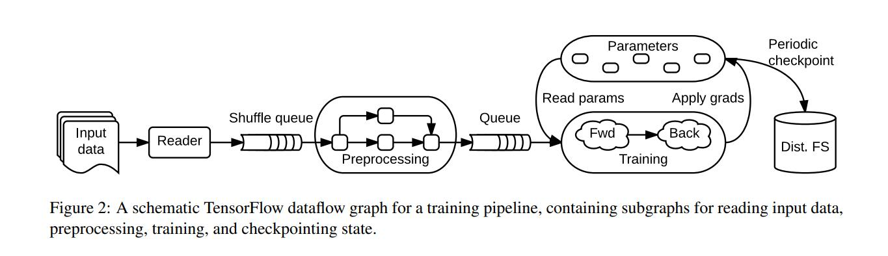

<head>

<!--支持网页公式显示-->    

</head>

<body>

  <h4>⚠ 转载请注明出处：<i>Maintainer: MinelHuang，更新日期：Oct.04 2021</i></h4>
  

  
  
  

   
  

      
  

  

  &nbsp;&nbsp;&nbsp;&nbsp;本作品由 <b>MinelHuang</b> 采用 <a rel="license" href="http://creativecommons.org/licenses/by-nc-nd/4.0/">知识共享署名-非商业性使用-禁止演绎 4.0 国际许可协议</a> 进行许可，在进行使用或分享前请查看权限要求。若发现侵权行为，会采取法律手段维护作者正当合法权益，谢谢配合。
  

 

  

  &nbsp;&nbsp;&nbsp;&nbsp;参考资料：Martin Abadi.<a href="https://www.usenix.org/conference/osdi16/technical-sessions/presentation/abadi">TensorFlow: A System for Large-Scale Machine Learning</a>.OSDI.2016 
  &nbsp;&nbsp;&nbsp;&nbsp;Last Update: 10/10/2021
  

    <h2> 目录 </h2>
    

  

  

    

    &nbsp;&nbsp;&nbsp;&nbsp;Section 1. <a href="#section1"><b>场景和Problems</b></a>：介绍DNN场景以及为何PS/Batch-System不适用
    

    &nbsp;&nbsp;&nbsp;&nbsp;Section 2. <a href="#section3"><b>Architecture</b></a>：介绍TensorFlow架构以及任务执行流程

  

<h2><a name="section1">1. 场景和Problems</a></h2>

  

  &nbsp;&nbsp;&nbsp;&nbsp;场景：Neural Network Training，其中以image classification and language modeling为代表性应用。 
  &nbsp;&nbsp;&nbsp;&nbsp;在叙述Problems之前，您可以先参考<a href="https://neth-lab.netlify.app/publication/21-09-01-machine-learning-and-federated-learning/">Machine Learning & Federated Learning</a>来了解DNN的训练原理。 

  <h3>DNN训练特性以及related work</h3>
  

  &nbsp;&nbsp;&nbsp;&nbsp;DNN的训练过程包含前向传播和反向传播两个过程，其function特性是包含大量的state信息。例如更新第l层的W时，需要第l+1层的W和第l层的z；在计算l层的z时，需要l-1层的a。故function涉及两类依赖关系，一次迭代中，前向传播和反向传播包含层与层的依赖，并且包含对W的依赖；更新W又依赖前向传播的结果，与l+1层W的更新结果。故每个sub-computation几乎都要依赖一组state，例如W，z。在DNN训练这种复杂的场景下，我们再来审视batch-processing system(Spark)和parameter server system(DistBelief)，会出现哪些问题？ 
  

  &nbsp;&nbsp;&nbsp;&nbsp;首先，Spark调度在data reuse和stateless function时是最高效的，DNN中大量的state信息导致Spark必须多次shuffle，来保证其sub-computation是stateless的（因为其系统中都是stateless worker），从而提高效率。然而我们发现，DNN的训练过程中每个function都需要state信息，故需要对整个Task的state信息做处理，这也是TensorFlow的设计重点。 
  &nbsp;&nbsp;&nbsp;&nbsp;但在计算gradient过程中，有大量的串行操作，如果参考PS的Insight，使用stateful worker (parameter server)去维护并处理，那么余下的stateless function使用Spark计算显然是十分高效的。 

  

  &nbsp;&nbsp;&nbsp;&nbsp;Parameter Server的问题是不够灵活。PS架构通过将function分为stateful和stateless，使stateless高并行、分布式的处理，然而stateful function的计算是fix的，例如需要预先分配好每个parameter server需要处理的parameters，而后接受gradients信息，再进行更新处理。我们发现这种架构很适合如SGD算法，但当算法做出改变，或出现新的update rule后，PS的implement需要作较大的更改。换句话说，其并未充分描述stateful function如何schedule，这导致其架构不够灵活。例如DNN中W和b的更新过程是一层一层迭代的，那么如何设计Task Dependency使该过程能用PS架构完成，也是一个较为困难的事。

  <h3>对TensorFlow系统的要求</h3>
  &nbsp;&nbsp;&nbsp;&nbsp;Tensorflow需要包含Spark和PS的insights，并且解决PS架构不够灵活的问题，故TensorFlow的设计原则可以总结如下： 
  

  &nbsp;&nbsp;&nbsp;&nbsp;1. <b>Dataflow graphs of primitive operators</b>: 使用Dataflow graph来描述整个Task，其中node代表一个primitive operator(例如矩阵乘)，这样使得users更容易使用上层接口来组装其DNN网络，并且根据PS的insight，node还可以作为mutable state，使用operation来更新。这样一来，一个复杂的Task可以很轻松的使用Dataflow graph来描述。 
  &nbsp;&nbsp;&nbsp;&nbsp;2. <b>Deferred execution(延期执行)</b>: 参考Spark的insight，dataflow graph并不是立即执行的，而是要先经过一系列的optimization来使得operations执行的更高效。 
  &nbsp;&nbsp;&nbsp;&nbsp;3. <b>Common abstraction for heterogeneous accelerators</b>: TensorFlow的执行过程应能适应CPU，GPU，TPU环境。 

  

  &nbsp;&nbsp;&nbsp;&nbsp;接下来我们将对TensorFlow架构做具体的介绍分析，并与Spark和ParameterServer进行对比，在最后一章中，笔者试图总结TensorFlow的Insight。

<h2><a name="section2">2. Architecture</a></h2>

  <h3>Dataflow Graph</h3>
  

  &nbsp;&nbsp;&nbsp;&nbsp;首先我们需要解决的是，如何描述一个ML任务。在Spark中，我们使用RDD dependencies；在PS中，我们使用Task Dependencies来描述一个ML任务，但在Spark中忽略了stateful function（重点在数据partition和stateless function的联系），在PS中忽略了多个stateful function之间的联系。所以我们需要一种更加灵活的dataflow graph，来描述整个DNN任务。 
  

  &nbsp;&nbsp;&nbsp;&nbsp;首先，ML任务由许多子任务组成，包括读取input data，preprocessing，training和checkpointing state等，如下图： 
   
  &nbsp;&nbsp;&nbsp;&nbsp;我们将这样一组串行流程称为ML Task的Training Pipeline，而其中的每个子任务称为subgraph。根据该Pipeline，我们衍生出两个问题： 
  &nbsp;&nbsp;&nbsp;&nbsp;1.subgraph如何执行 
  &nbsp;&nbsp;&nbsp;&nbsp;2. 如何分布式 
  &nbsp;&nbsp;&nbsp;&nbsp;在此笔者将按照论文中的顺序介绍TensorFlow是如何完成这两种任务的。

  <h4>Graph elements</h4>
  

  &nbsp;&nbsp;&nbsp;&nbsp;Dataflow Graph包含点（vertex）和边（edge），其中vertex表示单位本地计算（a unit of local computation），称为operations；边代表vertex的输入或输出，称为tensors。 

  

  &nbsp;&nbsp;&nbsp;&nbsp;<b>Tensors</b>指的是一个n维数组，并且每个Tensor还携带一个基础类型值（如 int 32，string）。在high-level上，tensor代表着ML中的一个基础computation的输入或结果；在low-level上，tensor是dense的，这是为了能让所有的accelerators都可以understand tensor。 
  

  &nbsp;&nbsp;&nbsp;&nbsp;<b>Operations</b>指的是一个computation function，同样携带type信息（例如Const，MatMul），并且会携带compile-time属性，用来决定对输入输出的type和数量的要求。 
  &nbsp;&nbsp;&nbsp;&nbsp;对于stateful function，其特性在于需要state才能完成计算，故operation可以包含mutable state，用于在其执行过程中读取，将这类operation称为<b>Variables Operation</b>。Variable没有input，其可以生成一个reference handle。可以使用Read operation（input为reference handle，r）将其转化为dense tensor，也可以使用其他的operation如AssignedAdd来更改Variable。 
  &nbsp;&nbsp;&nbsp;&nbsp;第二类stateful operations为<b>queue</b>，例如FIFOQueue，其owns an internal queue of tensors，并且允许concurrent access。TensorFlow认为queue信息也是一种state。 

  

  &nbsp;&nbsp;&nbsp;&nbsp;我们发现，使用Tensors和Operations便可以将任意一个ML任务绘制成一个Dataflow Graph，如figure 2所示。

  <h4>Distributed execution</h4>
  

  &nbsp;&nbsp;&nbsp;&nbsp;当拥有了dataflow后，我们需要为每一个operation指定一个计算device，该部分称为placement，但实际上tensorflow将这一部分作为open question，即需要user手动assign device to operation。但在论文指出，即使没有这部分的内容，tensorflow认为将放置指令（placement directives）和模型定义的其他方面分开也是值得的。在map device to operation中，需要确保state和stateful operation是处在同一个device上的。 

  

  &nbsp;&nbsp;&nbsp;&nbsp;那么如何将dataflow分布式化的执行呢？首先分为两个部分，第一为subgraph的concurrent执行：client可以使用API将整个Graph分解成多个subgraph，而后选择零个或多个edges来feed input tensors into the dataflow，and one or more edges to fetch output tensors from the dataflow。每一个subgraph由一组operations组成，将其称为step。 
  &nbsp;&nbsp;&nbsp;&nbsp;以figure 2为例，一个典型的training application由多个subgraphs组成，subgraph之间使用shared variables and queues来进行交互。由于shared variables and queues在dataflow graph中为stateful operation，也即可以看作是独立出整个graph的操作，那么每个subgraph可以同时去进行。例如Preprocessing过程和Training过程可以同时的进行。此为high-level的分布式化。 
  &nbsp;&nbsp;&nbsp;&nbsp;其二是对于每个subgraph而言，operations已经被分配到了各个worker上。针对operation的分布式是很简单的，比如矩阵点乘操作，我们可以使用多台worker来执行。当每个operation都是分布式的执行时，我们便可以说，整张图都被分布式化了。这就是将operation作为graph顶点时的灵活性。

  <h4>总结</h4>
  

  &nbsp;&nbsp;&nbsp;&nbsp;首先重新审视下DNN训练带来的问题：1. 大量的state信息 2. stateful function之间有依赖关系。PS架构解决了stateful function的问题，也即设计出一组stateful worker来对其进行处理。Tensorflow延续了这个思路，它将stateful function定义的具体，即：stateful function的执行位置需要有state信息，那么根据这一思想，很容易想到设计一个dataflow graph，其中vertex作为operation，而不是Spark中的data partitions（RDD）。 
  &nbsp;&nbsp;&nbsp;&nbsp;当然我们也发现，tensorflow注重function的联系，把Graph中的vertex作为function处理的好处是，一个ML任务可以轻松的在集群上执行，但是如何placement是一个较大的问题。所以笔者认为，TensorFlow的优势在于将任意一个复杂的ML任务分布式化，但其性能并不一定是优越的。

