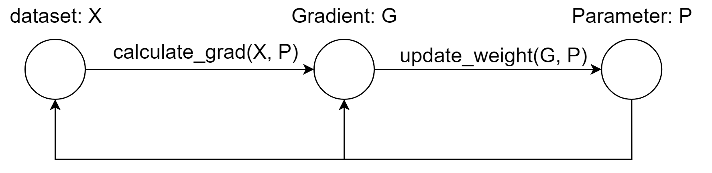

<head>

<!--支持网页公式显示-->    

</head>

<body>

  <h4>⚠ 转载请注明出处：<i>Maintainer: MinelHuang，更新日期：Aug.04 2021</i></h4>
  

  
  
  

   
  

      
  

  

  &nbsp;&nbsp;&nbsp;&nbsp;本作品由 <b>MinelHuang</b> 采用 <a rel="license" href="http://creativecommons.org/licenses/by-nc-nd/4.0/">知识共享署名-非商业性使用-禁止演绎 4.0 国际许可协议</a> 进行许可，在进行使用或分享前请查看权限要求。若发现侵权行为，会采取法律手段维护作者正当合法权益，谢谢配合。
  

 

  

    <h2> 目录 </h2>
    

  

  

    

    &nbsp;&nbsp;&nbsp;&nbsp;Section 1. <a href="#section1"><b>Parameter Server</b></a>：介绍Spark等batch-processing system的局限性，引出parameter sever system
    

    &nbsp;&nbsp;&nbsp;&nbsp;Section 1. <a href="#section1"><b>场景和问题</b></a>：介绍TensorFlow系统的目标场景，过去的计算系统在新场景下出现的问题，以及主要优化目标。
  

<h2><a name="section1">1. Parameter Server</a></h2>

  

  &nbsp;&nbsp;&nbsp;&nbsp;参考资料：Mu Li.<a href="https://www.usenix.org/conference/osdi14/technical-sessions/presentation/li_mu">Scaling distributed machine learning with the parameter server</a>.OSDI.2014 
  

  &nbsp;&nbsp;&nbsp;&nbsp;在<a href="https://neth-lab.netlify.app/publication/21-3-19-summary-of-apache-spark/">Spark</a>中，我们发现batch-processing system针对计算任务的reuse和stateless特征，设计了一套高效的分布式批处理系统，适用于一些简单的迭代式机器学习。在此章节中，笔者着重想讲明白，为什么新的场景下batch-processing system会出现新的挑战，计算特性发生了何种变化，以及如何优化。在此章节笔者同样希望验证对Spark insights的总结是否到位，并会时刻将parameter server架构和Spark架构对比论述。
  
  <h3>Large scale ML场景特征及Problem</h3>
  

  &nbsp;&nbsp;&nbsp;&nbsp;何为large-scale？现实的training data can range between 1TB - 1PB，这导致在创建一些复杂模型时，其parameters规模可能达到10^9 - 10^12数量级。在使用Spark实现ML时，并没有将Parameters作为一个数据进行处理，即使用RDD封装，而是仅作为function的参数传递（表现为在Driver中存储并传递）。而当parameters规模变大后，一次迭代的数据流图变更为： 
   
  

  &nbsp;&nbsp;&nbsp;&nbsp;可以看到，在第k次迭代时，calculate_grad和update_weight过程都需要k-1次迭代时的P矩阵，这意味着这两个function变为stateful function，故如若像Spark中置于stateless worker上执行，必定要引入一次shuffle过程，来将Parameter拷贝至每一台参与的workers中。Spark的优化方法显然在此场景中有所欠缺，即两个function执行前都需要shuffle，然而一个朴素的思想是，如果加入一组stateful workers来执行update_weight function，P显然在一次迭代中仅需传递一次。 
  

  &nbsp;&nbsp;&nbsp;&nbsp;在此，我们可以对Spark加深一步总结，当使用stateless worker执行stateful function时，需要增加shuffle过程，强制的将stateful转变成stateless function。同时，我们可以发现在更新P时，必须等待所有的sub-computation完成后才能更新，即同步更新，或称为强一致性的计算。故我们需要一种新的架构和scheduler来减小二者对系统的影响。当然，Spark在stateless+批处理（reuse）的场景下依旧是非常高效的，故该如何设计一个系统，保留Spark的高效部分，并又能处理stateful function呢？ 

  

  &nbsp;&nbsp;&nbsp;&nbsp;原论文中将上述challenge总结，如下： 
  &nbsp;&nbsp;&nbsp;&nbsp;1. Accessing the parameters requires an enormous amount of network bandwidth. 
  &nbsp;&nbsp;&nbsp;&nbsp;2. cost of synchronization and machine latency is high. 
  &nbsp;&nbsp;&nbsp;&nbsp;3. At scale, fault tolerance is critical. 

  

  &nbsp;&nbsp;&nbsp;&nbsp;原论文中将其贡献总结如下： 
  &nbsp;&nbsp;&nbsp;&nbsp;1. Efficient communication: 提出异步计算模型

<h2><a name="section1">1. 场景和问题</a></h2>

  

  &nbsp;&nbsp;&nbsp;&nbsp;场景：<b>large scale</b> machine learning and <b>heterogeneous</b> environments。其中，large-scale指的是数据集庞大，以及training过程中需要动态更新的parameters庞大；heterogeneous environments指的是TensorFlow集群中含有多种计算资源，包括CPU，GPU，TPU等。 
  

  &nbsp;&nbsp;&nbsp;&nbsp;那么在这样一种场景下，传统的计算系统会遇到什么瓶颈呢？

</body>