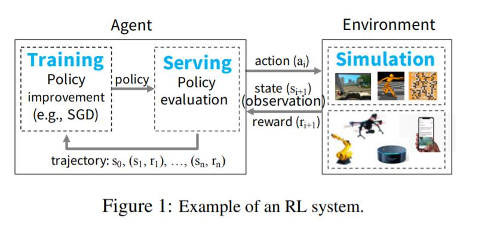
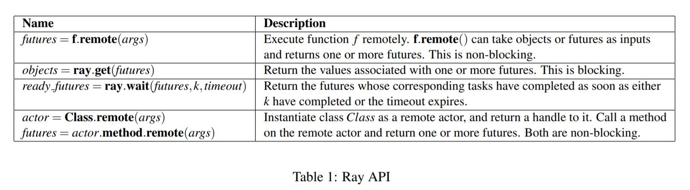
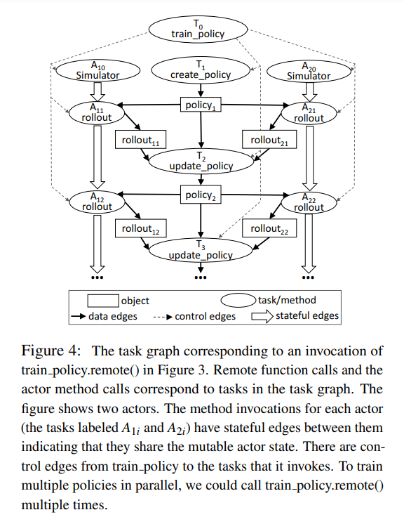
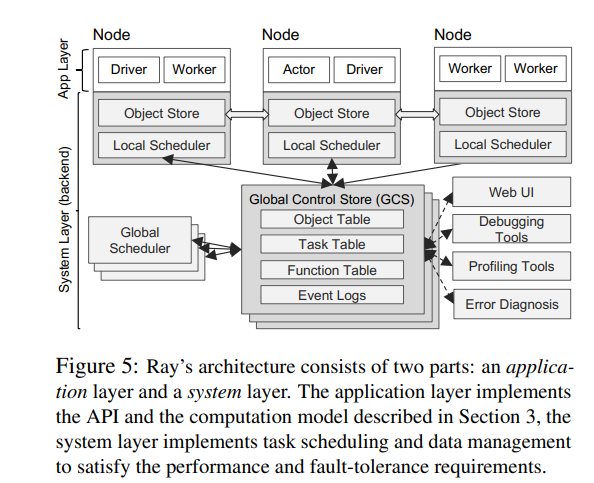
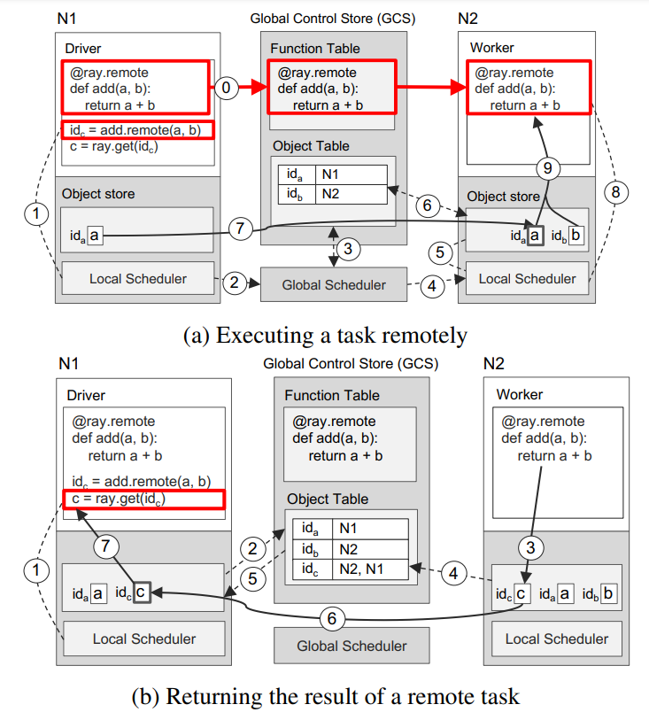

<head>

<!--支持网页公式显示-->    

</head>

<body>

  <h4>⚠ 转载请注明出处：<i>Maintainer: MinelHuang，更新日期：Oct.24 2021</i></h4>
  

  
  
  

   
  

      
  

  

  &nbsp;&nbsp;&nbsp;&nbsp;本作品由 <b>MinelHuang</b> 采用 <a rel="license" href="http://creativecommons.org/licenses/by-nc-nd/4.0/">知识共享署名-非商业性使用-禁止演绎 4.0 国际许可协议</a> 进行许可，在进行使用或分享前请查看权限要求。若发现侵权行为，会采取法律手段维护作者正当合法权益，谢谢配合。
  

 

  

  &nbsp;&nbsp;&nbsp;&nbsp;参考资料： 
  &nbsp;&nbsp;&nbsp;&nbsp;1. <a href="https://dl.acm.org/doi/abs/10.1145/3102980.3102998">Real-time machine learning: The missing pieces</a>. 2017. HotOS (workshop) 
  &nbsp;&nbsp;&nbsp;&nbsp;2. <a href="https://www.usenix.org/conference/osdi18/presentation/moritz">Ray: A distributed framework for emerging {AI} applications</a>.2018.OSDI
  

    <h2> 目录 </h2>
    

  

  

    

    &nbsp;&nbsp;&nbsp;&nbsp;Section 1. <a href="#section1"><b>前言</b></a>：介绍Ray的应用场景和Problems。
    

    &nbsp;&nbsp;&nbsp;&nbsp;Section 2. <a href="#section2"><b>Programming and Computation Model</b></a>：介绍Ray是如何解释，翻译用户的program的，并介绍Ray提供了哪些用户接口，用户如何使用这些接口完成RL任务的编写。
    

    &nbsp;&nbsp;&nbsp;&nbsp;Section 3. <a href="#section3"><b>Architecture</b></a>：介绍Ray的系统架构，重点在于描述Ray如何将它的task graph分配给各个workers，又是如何动态执行的。
    

    &nbsp;&nbsp;&nbsp;&nbsp;Section 4. <a href="#section4"><b>Instance</b></a>：用一个例子来介绍Ray的执行过程，将所有内容融合。
    

    &nbsp;&nbsp;&nbsp;&nbsp;Section 5. <a href="#section5"><b>Summary</b></a>：总结Ray的重要性，解决的问题，insight等。
  

<h2><a name="section1">1. 前言</a></h2>

  

  &nbsp;&nbsp;&nbsp;&nbsp;本章从Ray的workshop开始，解读Ray系统的应用场景以及为什么重要（Problems）。
  

  &nbsp;&nbsp;&nbsp;&nbsp;Ray的应用场景为强化学习（Reinforcement Learning, RL），这类场景下的重要特点是，需要实时的（Real-time）采集环境中的信息，并进行计算。举一个例子，RL常常用于游戏AI或者机器人AI中。以flappy bird为例，AI需要实时的根据即将飞跃的水管高度（环境）来设计出一系列actions，以获得更高的分数（目标）。于是RL算法的特点可以总结为：需要不断地引入新的环境数据，来对更新policy，使AI根据此policy得出的actions可以获得更高的分数（objective）。 

   

  

  &nbsp;&nbsp;&nbsp;&nbsp;我们把采集数据的过程称为simulation，更新policy的过程拆分为training（如根据环境数据计算梯度）和serving（对policy进行evaluation），依旧以flappy bird为例，各个sub-computation的作用如下： 
  &nbsp;&nbsp;&nbsp;&nbsp;1. <b>simulation</b>：获取水管的高度、bird距离水管的距离、bird高度等；负责对actions进行打分，比如输入点两下屏幕，simulation给出反馈rewards=1，即当前得分为1（第二个水管没法过去），这一过程称为policy evaluation。 
  &nbsp;&nbsp;&nbsp;&nbsp;2. <b>serving</b>：根据环境data(current state of environment)和先前的policy，得到一系列actions（例如等待0.1s后再点击一下屏幕），将actions发送至simulation，获得rewards。 
  &nbsp;&nbsp;&nbsp;&nbsp;3. <b>training</b>: 根据环境信息（states）和rewards训练policy，通常使用随机梯度下降(SGD)方法。  
   

  

  &nbsp;&nbsp;&nbsp;&nbsp;由此，我们可以总结出RL对系统的几点要求： 

  

  &nbsp;&nbsp;&nbsp;&nbsp;<b>系统性能需求</b>： 
  &nbsp;&nbsp;&nbsp;&nbsp;1. <b>Low latency</b>：AI需要快速的得到一个policy以获取接下来一段时间的action，故需求低延迟（应用是real-time，reactive核interactive的）。 
  &nbsp;&nbsp;&nbsp;&nbsp;2. <b>High throughput</b>：simulation产生的环境state信息非常庞大（training或inference需要），故底层ML系统的throughput性能要高。 
  &nbsp;&nbsp;&nbsp;&nbsp;3. <b>Support heterogeneity in resource usage</b>：例如使用GPUs执行training，使用CPUs执行simulations 
  

  &nbsp;&nbsp;&nbsp;&nbsp;<b>模型执行需求</b>： 
  &nbsp;&nbsp;&nbsp;&nbsp;1. <b>Dynamic execution</b>：许多RL原语都需要动态执行，这是因为系统并不能知道simulation任务的完成顺序，以及某个computation的结果会决定未来的computation，故希望在execution过程中，还可以动态的添加新的任务。该特性为RL tasks的核心特性，也是Ray系统设计的核心。 
  &nbsp;&nbsp;&nbsp;&nbsp;2. <b>Heterogeneous tasks</b>：在RL任务中，用户调用的Deep learning原语和RL simulation都会产生execution time和resource requirements不同的（widely different）tasks，故系统需要支持tasks和resources的异构型。该点可以理解为，假设一个机器人，simulation获得的数据有视频和前方环境的距离，那么policy的训练过程可以采用不同的算法（视频使用DNN，距离使用LR），即异构任务。第二类异构任务为stateless和stateful，其中stateless指的是可以在任何worker上运行的任务，stateful指的是需要在特定的worker上运行，以适应parameter server架构或提高GPU使用效率（让GPU进行重复计算） 
  &nbsp;&nbsp;&nbsp;&nbsp;3. <b>Arbitrary dataflow dependencies</b>：与上述两点类似，deep learning primitives和RL simulations会生成随机的并且often fine-grained task dependencies。 
  

  &nbsp;&nbsp;&nbsp;&nbsp;<b>实际应用需求</b>： 
  &nbsp;&nbsp;&nbsp;&nbsp;1. Transparent fault tolerance 
  &nbsp;&nbsp;&nbsp;&nbsp;2. Debuggability and Profiling 

  

  &nbsp;&nbsp;&nbsp;&nbsp;于此，我们提取出几点Ray需要重点优化的部分，包括如何动态的创建新任务，如何快速schedule新任务，以及如何兼容现有distributed computing system和异构的计算资源。分布式计算系统包含两大任务，其一为如何描述用户（系统的使用者）的Program，或者说需要向用户提供哪些编程接口来满足任务需求；其二为如何将Program分布式的执行，或者说如何将Task分配给各个worker。在下一章节中，我们先讲述第一个大问题，并同时思考该如何设计才能满足Ray的三点重要的系统需求。

<h2><a name="section2">2. Programming and Computation Model</a></h2>

  

  &nbsp;&nbsp;&nbsp;&nbsp;本章将解决，如何提供一些编程API，来同时满足用户的编程需求和系统动态执行任务的需求。我们使用Programming model来向用户提供接口口，使用Computation model来实现动态任务执行。

  <h3>Programming Model</h3>
  

  &nbsp;&nbsp;&nbsp;&nbsp;<b>Task</b>：Task代表在一个stateless worker上的一个remote function的execution，当一个remote function被调用，即创建了一个Task，并立刻返回a <b>future</b>。Future代表Task的结果，但并不意味着需要Task真正被执行。用户可以立即将future作为另一个remote function的输入，而不需要等待Task执行结束。Task用于执行stateless和side-effect free的function，即function的输出仅由inputs决定 - 从而简化fault-tolerance中re-execution过程。 

  

  &nbsp;&nbsp;&nbsp;&nbsp;<b>Actor</b>：actor代表stateful function，和Task相同的是actor可以被远程调用执行，并立即返回future。但与Task不同的是，Actor只能在stateful worker上运行。 

  

  &nbsp;&nbsp;&nbsp;&nbsp;可以看到Ray编程模型中，function的输入输出大多是future，故还需要提供对future的操作，如下图： 
   

  

  &nbsp;&nbsp;&nbsp;&nbsp;由此我们发现，Ray通过提供Task，Actor和Future API，使用户可以完成任意的RL任务，这是因为任何RL都可描述为stateless function和stateful function的组合，而future使得用户不需要关注底层分布式系统的运行状态即可完成编程。于是下面的问题为，如何构建Task，Actor之间的依赖关系，又如何将其分配到各个workers上（placement）？Future具体又在何时被真正的执行呢？

  <h3>Computation Model</h3>
  

  &nbsp;&nbsp;&nbsp;&nbsp;Ray使用一个动态的task graph来描述用户程序，当remote functions和actor methods的输入available时便开始自动执行。本节重点描述Ray如何通过Actor、Task来构建computation graph。 

  <b>Dynamic task graph</b> 
   
  

  &nbsp;&nbsp;&nbsp;&nbsp;Ray中的动态task graph如上图所示，其中包含两类node：data object和remote function；和两类边：data edges和control edges。于是，用户的程序可以使用task graph来描述，其中使用data edges描述function的输入输出，使用control edges描述function之间的调用关系（computation dependencies）。 
  

  &nbsp;&nbsp;&nbsp;&nbsp;当引入actor后，actor method同样也是function，故不需要在task graph中加入新的节点；然而actor method还需要state信息作为输入，而state是仅存在stateful worker上的，对于这样一种特性，Ray中使用state edges来描述state间的依赖关系。如此，若一个actor method调用了另一个actor method，则在这两个actor间加入一条state edge，代表两个actor method共用一部分state信息。终于，我们在一副task graph中同时描述了stateless function和stateful function，这意味着该task graph能解释任意的User program。

<h2><a name="section3">3. Architecture</a></h2>

  

  &nbsp;&nbsp;&nbsp;&nbsp;首先，我们先简单分析一下上一节的task graph包含了哪些内容。第一是node，graph中包含了两类节点，分别是data node和remote function，故在系统中需要想办法承载这两类node，需要关注两类node可否置于同一个worker上。当node的执行位置固定后，显然function的输入可以根据edge来进行数据拷贝，然而对于actor而言是比较头疼的，因为state信息被多个nodes共用，所以如何在多个node中share states是一个问题。最后一点，该task graph是被动态创建并执行的，那么如何快速的schedule新的node和edge同样是一个问题。 
  &nbsp;&nbsp;&nbsp;&nbsp;在本章中，笔者将带着这三个问题来介绍Ray的architecture。

  <h3>Application layer</h3>
  

  &nbsp;&nbsp;&nbsp;&nbsp;Ray中引入三个逻辑节点来向cluster描述task graph，分别是Driver，Worker和Actor。显然，Driver是真正编译程序的地方；worker是处理stateless function的地方；actor是处理stateful function的地方。每一个实际的machine（或者是VMs或者是container）都是这三种逻辑节点中的一种，Driver仅有一个。于是，一个task graph便可以分布式的在一个集群中执行。 
  

  &nbsp;&nbsp;&nbsp;&nbsp;至此，一个集群便可以承载所有的task graph。当然，集群管理者首先需要配置好每个machine的角色。于是问题只剩下了如何将function分配给各个机器，该问题由Ray中的System layer解决。 
  &nbsp;&nbsp;&nbsp;&nbsp;Ray architecture如下图所示： 
   

  <h3>System layer</h3>
  

  &nbsp;&nbsp;&nbsp;&nbsp;首先，我们要先解决function会被动态创建的问题。在执行过程中，remote function node会动态的创建新的node。那么我们可以认为，remote function node还需要维护它创建的function的一些meta信息，例如输入输出数据的位置和程序的执行状态，这意味着该function不是stateless的了。举一个例子，如果f1创建了f2，那么f1还需要维护f2的运行状态和meta数据，这样的话执行f1的worker或actor便维护了一部分state，并且当错误发生时很难恢复f2。，所以，我们希望所以function在被执行的时候都是stateless的，这意味着每个计算节点仅需要执行完当前function后便可以结束，这大大简化了系统的设计。 

  

  &nbsp;&nbsp;&nbsp;&nbsp;所以，Ray引入了Global Control Store (GCS)来存储、维护function间的依赖关系。于是，上述f1创建f2的过程可以被描述为，f1执行，向GCS报告创建了f2，f1执行完毕，schedule再为f2分配新的执行节点（根据GCS上存储的f2 meta信息）。GCS的设计使得每个function都是stateless的，这里的stateless指的是执行节点仅需要获取输入，然后执行，执行结束后便可以释放掉所有的资源并等待下一次的schedule即可。 

  

  &nbsp;&nbsp;&nbsp;&nbsp;当所有的function都是stateless的了，我们仅需要关注如何快速的schedule所有的function即可。在架构图中我们可以看到两类scheduler，分别是local scheduler和global scheduler。在这里的matric是如何低延迟的schedule，故不能像Spark那样仅使用一个centralized scheduler

  <h4>Scheduler</h4>
  &nbsp;&nbsp;&nbsp;&nbsp;Scheduler的任务是，将新创建的node（一个remote function或data或actor method）分配至一个计算节点上运行。为了能快速schedule，Ray采用two-level hierarchical scheduler - local scheduler和global scheduler。Node创建的新任务会首先发送至local scheduler，如果本地计算资源并没有溢出，则直接运行新的task；反之则发送给global scheduler。global scheduler会以每个工作节点的负载和任务限制（例如function的输入）来进行决策，并要求工作节点反馈一个lowest estimated waiting time。该时间代表着平均任务执行时间+估计等待时间。Global scheduler会选择最小的一个节点，运行新的task。 
   

<h2><a name="section4">4. Instance</a></h2>

  

  &nbsp;&nbsp;&nbsp;&nbsp;本章我们使用Ray来完成简单的a+b功能。 
   

<h2><a name="section5">5. Summary</a></h2>

  

  &nbsp;&nbsp;&nbsp;&nbsp;最后，笔者来谈谈自己对Ray的理解。 
  

  &nbsp;&nbsp;&nbsp;&nbsp;首先，Ray在解决什么样的问题？Ray重点扣在了动态task graph上，由于RL任务具有动态创建任务的特性，所以Ray希望可以允许用户随时创建任务。那么，其他系统不支持动态任务创建吗？在阅读related work后，我们发现主流的ML system分为两种，其一为Dataflow systems，泛指使用BSP execution model的系统，如MapReduce、Spark。该类系统对计算的限制过大，并且还有强同步性的要求。最重要的是，并不支持动态task graph，如果用户希望在traning过程中创建simulation任务，需要等待上一次dataflow全部执行完毕。第二类为TensorFlow、MXNet一类的专用于机器学习的系统，这类系统很好的支持了由静态DAG图组成的training workloads，但是并不能很好的支持training、simulation、serving相互嵌套的架构；在动态执行方面，TensorFlow Fold支持动态task graph，但在DAG开始执行后不支持修改。 

  

  &nbsp;&nbsp;&nbsp;&nbsp;所以，Ray需要设计一套可以动态执行的系统，即function可以在runtime中创建新的function，并执行。该问题可以分成两部分，第一步是动态task graph，用户可以在任意function中创建新的function，系统将其解释成task graph；第二部分是task graph的执行，新创建的task该如何schedule。因为是在runtime中，而非Spark或TensorFlow那样在execution前进行调度，所以Ray还需要low-latency的schedule方法。那么动态task graph系统有何难点呢？其一是创建的任务具有较大的异构性，体现在完成时间异构（simulation几分钟到几小时）和所需执行单元异构（CPU或GPU）。系统必须能够支持这种异构性，这样便增加了系统框架的复杂程度，例如工作节点具有多种属性，工作负载更多样（DNN，CNN，SGD等），如何提取其中的同构性以设计系统是很困难的。难点其二是如何让task graph动态起来，用户侧是如何设计的，系统又如何解释？笔者尝试在此复现Ray的设计思路。 

  <h3>动态task graph</h3>
  

  &nbsp;&nbsp;&nbsp;&nbsp;首先，ML任务的共性提取方面有很多的工作。ML可以分成stateless computation，指的是可以在任意工作节点上运行的计算；stateful computation，指的是需要state才可以完成的运算。我们需要保证的是stateless computation可以高效的运行，stateful computation可以共用一组state信息。所以Ray将工作节点分成两组，Worker承载任意计算，Actor承载stateful计算，故Actor本身要维护state信息。那么在task graph中的node应该分成两类：在Worker上运行的stateless computation，称为Task；在Acotor上运行的stateful computation，称为Actor method，这样的思想和parameter server架构很相似。 

  

  &nbsp;&nbsp;&nbsp;&nbsp;第二步，如何让task graph动态起来，这也是Ray的insight。Ray使用Actor编程，actor是一种运用于并行计算的编程模型，在这里简单对actor进行介绍，参考资料<a href="https://cloud.tencent.com/developer/news/698662">https://cloud.tencent.com/developer/news/698662</a>。在并发编程中，一个重要的问题是多个进程之间的数据冲突问题。每个actor在同一时间最多处理一个消息，可以给其他actor发送消息，在actor中维护了一组状态信息，这使得各个actor之间是物理隔离的。所以，actor模型直接避免了数据冲突，程序使用的数据都分布于每个actor中，如果需要另一个actor中的state，则两个actor直接通信即可，所以不需要锁。在分布式系统中如何处理state信息实际上也存在数据冲突问题，运用actor模型来实现parameter update过程便十分简单了。另一个点是，actor可以动态的创建新的task或者actor，这使得stateful computation被允许动态创建。在task graph中，我们可以使用一种叫做control edges的边来描述function之间的创建关系，使用data edge描述输入输出关系。于是，当一个函数被创建后，我们可以通过data edge获取其输出，function执行完毕后可以通过control edge回退到上一个函数，所以，该图便称为了动态task graph。 

  <h3>动态task graph执行</h3>

  

  &nbsp;&nbsp;&nbsp;&nbsp;执行过程在分布式系统framework考虑的层次主要是schedule过程，即如何将上述的task graph分配到整个集群中。Ray是一个task-based系统，即考虑的是将function，无论是stateless还是stateful，分配给不同的node（这里使用node命名实际的Worker或Actor），那么整个program便分布式化了。这样做的好处是，可以适应任意的program，并且task和task间的同步需求降低；而不足之处显然忽略了数据传输的开销，在一些场景中可能有较大的损耗。 

  

  &nbsp;&nbsp;&nbsp;&nbsp;task-based系统的执行过程都较为简单，因为node已经被分为了worker和actor两组，那么对于stateless function而言，直接选择一个资源充足的worker执行即可；对于stateful function而言，选择state所处的actor执行即可。Ray中的insight主要是对于新创建的计算任务，以及如何快速的schedule。Ray将scheduler分成本地的和全局的，task可以又任意节点创建，而actor只能由actor创建，这样schedule的方法便很简单了。新的task产生后，先由本地scheduler决策，当本地资源充足时直接部署于本地；不充足时上传到global scheduler，由全局调度器选择node运行。当schedule完成后，function通过RPC的方式运行，Ray中的GCS会根据function的meta数据，将其所需的输入data拷贝至目标机器，当function收到了所有的输入，便开始运行。 

  

  &nbsp;&nbsp;&nbsp;&nbsp;以上，便是笔者对Ray的阅读笔记以及总结。 
  

  &nbsp;&nbsp;&nbsp;&nbsp;END

