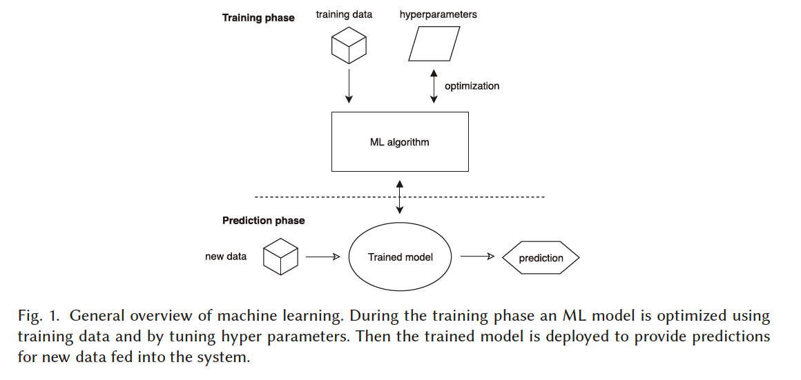

<head>

<!--支持网页公式显示-->    

</head>

<body>

  <h4>⚠ 转载请注明出处：<i>Maintainer: MinelHuang，更新日期：Dec.21 2021</i></h4>
  

  
  
  

   
  

      
  

  

  &nbsp;&nbsp;&nbsp;&nbsp;本作品由 <b>MinelHuang</b> 采用 <a rel="license" href="http://creativecommons.org/licenses/by-nc-nd/4.0/">知识共享署名-非商业性使用-禁止演绎 4.0 国际许可协议</a> 进行许可，在进行使用或分享前请查看权限要求。若发现侵权行为，会采取法律手段维护作者正当合法权益，谢谢配合。
  

 

  

  

    <h2> 目录 </h2>
    

  

  

    

    &nbsp;&nbsp;&nbsp;&nbsp;Section 1. <a href="#section1"><b>前言</b></a>：介绍近年federtaed learning system的场景、问题、挑战。
    

    &nbsp;&nbsp;&nbsp;&nbsp;Section 2. <a href="#section2"><b>GAIA</b></a>：与distributed infrastructure层面上内存管理，其应用场景为interactive graph computing。
    

    &nbsp;&nbsp;&nbsp;&nbsp;Section 3. <a href="#section3"><b>Scaling FL System</b></a>：种为横向联邦学习设计的大规模FL架构。
    

    &nbsp;&nbsp;&nbsp;&nbsp;Section 4. <a href="#section4"><b>ParSync</b></a>：一种分布式的资源分配框架，使用partitioned synchronization方法降低了由contention on high-quality resources和staleness of local states带来的scheduling latency。
    

    &nbsp;&nbsp;&nbsp;&nbsp;Section 5. <a href="#section5"><b>Hoplite</b></a>：传统的collective communication方法是synchronous，无法适应asynchronous类的新应用，故此文提出一种distributed scheduling scheme for data transfer和fine-grained pipeline scheme，优化Ray系统的性能。
  

<h2><a name="section1">1. 前言</a></h2>

  

  &nbsp;&nbsp;&nbsp;&nbsp;本章将从综述的角度，介绍适用于Fedrated Learning的在分布式Framework方面的系统框架、分类与挑战。
  <h2>1 Survey on Distributed Machine Learning</h2>
  

  &nbsp;&nbsp;&nbsp;&nbsp;参考资料：<a href="https://dl.acm.org/doi/abs/10.1145/3377454">A Survey on Distributed Machine Learning</a>. 2020. ACM Computing Surveys 
  

  &nbsp;&nbsp;&nbsp;&nbsp;由于FL同属于ML中的一种，故笔者先对ML系统问题进行survey。 
  

  &nbsp;&nbsp;&nbsp;&nbsp;首先第一个问题，<b>为什么要分布式？</b>Machine Learning的发展体现在training data的指数增长，和model所需的parameters量级的增长（通常指NN模型），二者共同导致了单台计算机无法承载如此庞大的ML训练任务，所以人们提出分布式机器学习。和集中式机器学习相比，Distributed ML要解决的首要问题是：<b>高性能的并行方式</b>。在本节中，我们会讨论state-of-art的分布式ML场景、问题、挑战以及解决方法。 

  <h3>1.1 Introduction</h3>
  

  &nbsp;&nbsp;&nbsp;&nbsp;分布式机器学习通常有两个原因，其一是model designer希望使用分布式来提高并行度或I/O带宽总量，例如对TB级的输入数据的训练；其二是数据本身是inherently distributed（大型企业的数据存放在不同的地理位置上）或在single computer上无法存放庞大的数据（分布式存储）。在分布式后，通常一个分布式系统要解决三类问题：<b>parallel computation, data distribution and resilience to failures</b>。 
  

  &nbsp;&nbsp;&nbsp;&nbsp;本节的章节安排为，Section 2讨论ML中的系统challenges和High Performance Computing中的ideas是如何应用在ML System上的（用于加速和scaling）；Section 3讨论ML architecture，覆盖algorithms层面到network communication层面（entire stack）；Section 4讨论widely used systems and
  libraries和其underlying designs；Section 5讨论分布式机器学习的main challenges。 

  <h3>1.2 Machine Learning - A High-performance Computing Challenge?</h3>
  

  &nbsp;&nbsp;&nbsp;&nbsp;ML的数据操作可以看作对vector, matrices or tensors的操作，属于线性代数问题。在过去几十年中，HPC community（如BLAS or MPI）对此进行了大量研究，同时HPC community也认为machine learning是一个emerging high-value workload并开始将HPC methodology应用于此，包括使用HPC系统/设备训练模型。 
  

  &nbsp;&nbsp;&nbsp;&nbsp;和其他的large-scale computational challenges相同，加速workloads包含两大类基本方法：其一为向单个机器增加更多的资源（scaling-up），其二为向system中增加更多的节点（scaling-out），我们来分别对其进行challenges的讨论。 

  <h4>1.2.1 Scaling up</h4>
  

  &nbsp;&nbsp;&nbsp;&nbsp;最常见的方法是使用GPUs对单机进行性能提升，例如Nvidia Titan V和Nvidia Tesla V100。和CPU相比，GPU具有更多的cores（V100包含5120 cores），故可以支持并行度更高的运算，这一点非常适合需要数据并行和模型并行的ML算法。 
  

  &nbsp;&nbsp;&nbsp;&nbsp;第二种为Application Specific Integrated Circuits（ASICs），通常是根据特定的function而设计的电路。例如在ML中，常用的算子为矩阵乘法，故可以将矩阵乘function做成硬件电路以进行加速。Google设计的Tensor Processing Unit（TPU）即是一种ASICs，其集成了对Tensor的各类运算例如矩阵乘法以完成加速。 
  

  &nbsp;&nbsp;&nbsp;&nbsp;第三种硬件设计引入了Neuro-Functional Unit（NFU），实现复数的数据input，加法，激活函数等运算，代表性的加速器为DianNao，用于大规模神经网络with a small area footprint。
  

  &nbsp;&nbsp;&nbsp;&nbsp;其余的硬件设备还address一些性能问题，例如针对accessing the weights of neurons from DRAM，Hinton et al. 使用deep compressiong技术put the weights into SRAM并加速了sparse matrix-vector乘法；使用MIMD架构的special CPU加速了浮点数运算等。

  <h4>Scaling out</h4>
  

  &nbsp;&nbsp;&nbsp;&nbsp;Scaling out的原因有三种，其一是设备较为便宜；其二是抗风险能力强；其三是增加了整体的I/O带宽。训练ML models是一个highly data-intensive task，所以对数据的消化会成为严重的性能瓶颈，所以通过分布式来将数据的读写、处理分散到一个集群中可以显著提高性能。但是并不是所有的模型都可以并行化、分布式化的，取决于具体的ML算法。

  <h3>1.3 Reference Achitecture for Distributed Machine Learning</h3>
  

  &nbsp;&nbsp;&nbsp;&nbsp;本章为全文重点，会对近年来的工作加以分类和规划。在此，笔者主要关注在framework层面上的优化。 
  

  &nbsp;&nbsp;&nbsp;&nbsp;Machine Learning的主要任务如下图： 
   
  

  &nbsp;&nbsp;&nbsp;&nbsp;其主要包含training和predicting两部分。Training phase指的是使用庞大的training data更新machine learning model，最终的输出为Trained Model；Prediction phase是使用trained model来对新数据进行预测。我们进行分布式化其实是对这两个phase进行分布式。 
  

  &nbsp;&nbsp;&nbsp;&nbsp;常用的分布式方法分为两种：data parallelizing和model parallelizing。数据并行指的是所有workers可以使用相同的算法，但数据输入不同来进行计算，例如在LR算法中我们可以将数据分成各个partition，对每个partition进行gradients的计算。所以我们发现，数据并行的前提一般是ML算法假定了independent and identical distribution (i.i.d.，独立同分布)，这样我们才可以对每个partition产生的gradients进行聚合。第二种为模型并行，指的是每个worker对部分模型进行计算，例如在树模型中，spliting过程可以使用多个worker进行并行。然而模型并行方法并不能应用于所有ML算法，这是因为model parameters通常不能split up，一种解决办法是通过例如ensembling技术对output trained models进行聚合。 
  

  &nbsp;&nbsp;&nbsp;&nbsp;一个distributed system可以分成三层（机器学习算法，并行化，拓扑结构），其中算法和并行方法对应上一段所讲，拓扑结构则是根据并行方法使用special architectural pattern去描述task，例如使用数据并行实现DNN我们可以用parameter server拓扑来描述。在拓扑层我们需要优化的是高效并行实现、计算/通信效率和容错的功能。当然，该三层也并不是相互独立的。在后文中我们将一次对每一层的内容和工作进行分类和归纳。

  <h4>1.3.1 Machine Learning Algorithms</h4>
  

  &nbsp;&nbsp;&nbsp;&nbsp;该章节非本博客的主要内容，故简述。 
  

  &nbsp;&nbsp;&nbsp;&nbsp;ML algorithms一般分为三个步骤：<b>Feedback, Purpose, Method</b>。Overview的讲，ML algorithms在每次迭代将Feedback作为Method的输入来优化模型，逐渐逼近Purpose。 
  

  &nbsp;&nbsp;&nbsp;&nbsp;Feedback指的是提高模型质量所需的输入。在监督学习中，feedback常是指predict的值和真实值之间的差异情况，可以使用偏移（bias error）和方差（variance）来表示，一个例子为loss function。无监督学习中feedback可以是在一个group中样本的相似程度，这种similarity metric可以用来优化group method。 
  

  &nbsp;&nbsp;&nbsp;&nbsp;Purpose是ML algorithms的目标，其中可能是Classification、Clustering、Dimensionality reduction等。以Classification为例，其具体是希望使用一个模型将输入的数据样本打上标签（分类），这种预测标签越接近真实标签则代表分类器的准确性越高。 
  

  &nbsp;&nbsp;&nbsp;&nbsp;Method即如何逐步的优化模型以达到Purpose。一个广泛应用的方法是Stochastic Gradient Descent（SGD）算法，其目的是，逐步的降低loss即代表越逼近Purpose。所以我们可以计算模型参数对loss的导数，即gradients，根据梯度的方向来优化parameters，使得loss越来越小。

  <h4>1.3.2 并行化与拓扑结构</h4>
  

  &nbsp;&nbsp;&nbsp;&nbsp;回顾上文，分布式ML系统的任务是为ML算法提供高效的并行化实现方式。对于并行方法，包含数据并行和模型并行。在此节，假若已经给定了ML算法和并行方式，我们该如何高效的实现呢？所以在这里，parallelism and topology的任务是如何设计工作节点的拓扑结构，来达到高效的并行化。 
  

  &nbsp;&nbsp;&nbsp;&nbsp;首先我们不妨来思考，什么是低效的并行化。假设我们要对SGD过程做数据并行处理，我们在execution前有两个拓扑：数据分布拓扑和任务拓扑。输入数据要经过data partition过程分布式的存储在各个worker上，形成数据拓扑（节点称为datanode）；每个worker会被安排其需要执行的task以及输入输出数据依赖关系，形成任务拓扑（节点称为tasknode）。低效的并行化指的是，数据的拷贝损耗很大（例如一个tasknode的输入来自所有的datanode），则会带来high communication cost；或者是某个tasknode执行了大量的运算，形成high communication cost；或者是大量的tasknode在等待输入，形成high sychronization cost。可见distributed system所需要解决的两个关键问题：data distribution和parallelsim之间是相互依赖的。
  

  &nbsp;&nbsp;&nbsp;&nbsp;于是，我们提出了几个通用的拓扑模型。举其中一个例子，Bulk Synchronous Parallel (BSP)模型是最简单的分布式模型。其data distribution方式为数据均匀的分布在每个worker上，而后对每个computation和communication阶段做同步。通俗来讲就是将程序的运行分为了computation和communication，所有worker通过communication交换中间结果（根据任务拓扑，每个任务得到input），而后所有worker再进行computation。其优势是强一致性，劣势是computation快的workers需要等待慢的workers。但是假若每个worker的运行时间相同，例如data parallel SGD，BSP模型依旧是十分高效的。 

  <h4>1.3.3 小结</h4>
  

  &nbsp;&nbsp;&nbsp;&nbsp;在此章节，我们叙述了distributed ML system的应用（ML algorithm），并行化方法和拓扑结构对并行化性能的影响。后文的工作将专注于，如何设计算法来更好的使用systems resources和如何设计更好的拓扑和执行方案来支持特定的ML algorithms。

<h2><a name="section2">2. GAIA</a></h2>

  

  &nbsp;&nbsp;&nbsp;&nbsp;参考资料：<a href="https://www.usenix.org/conference/nsdi21/presentation/qian-zhengping">GAIA: A System for Interactive Analysis on Distributed Graphs Using a High-Level Language</a>. NSDI 2021  

  <h3>场景和Problems</h3>
  

  &nbsp;&nbsp;&nbsp;&nbsp;Gaia的应用场景为，在大型集群中对graph data进行迭代式分析。首先简单介绍一下什么是Graph data。 
   
  

  &nbsp;&nbsp;&nbsp;&nbsp;Figure 1便是一个典型的graph data，其描述的是一个罪犯的现金流，例如在t1时，罪犯购买了一个网络商品，t2时银行将钱打给了3号商户。而后在t3时商户将这笔钱又打给了中间人账户，通过一系列中间人，最后再将这笔钱打回罪犯手中（t4）。Graph data analyze便是通过这样一个图数据，分析出是否有洗钱的嫌疑。通常，graph data由点和边组成，点代表着一个实体，边代表实体间的关系，在social networks，commerce transaction，online payments等领域存有大量的graph data。一份图数据可能包含billions of vertices，hundreds of billions to trillions of edges，所以一般需要在一个large cluster上进行处理。Gaia的应用场景是，对于这样一种大规模的图数据，用户会对其进行interactive query analyze，例如提交一个查询query以寻找某个顶点是否存在。故如何低时延的反馈是用户对cluster的需求。Gaia的场景可以概括为：scaling graph data，big cluster，interactive queries and low latency 
  

  &nbsp;&nbsp;&nbsp;&nbsp;那么先前的Graph data engines存在哪些问题呢？其一是Programming Model单一，例如Naiad，仅能scaling一些特定的图算法。作为一个distributed framework而言，其program接口没办法满足那些没有distributed computing知识的人。其二是memory management问题，过去的系统主要是基于bulk synchronous parallel (BSP)系统，即计算是迭代式的，每次迭代的运算是相同的。但是BSP系统并不适合interactive graph queries，因为interactive queries过程中通常需要维护大量的app states，这种states可能会随迭代指数倍增长，从而导致memory crisis；在interactive queries场景下，会出现多个queries共享有限内存的情况，当其为了提高效率能cache一部分input graph时，很有可能出现memory crash。

  <h3>内容概述</h3>
  

  &nbsp;&nbsp;&nbsp;&nbsp;此文章中提出Gremlin，其提供了high-level的编程框架。用户提交Gremlin queries，GAIA系统将使用Scope Abstraction描述一个query中的data dependencies，这允许使用dataflow来描述Gremlin traversal，最终达到高效的parallel execution。为了防止memory crash，GAIA在runtime中优化了parallel graph traversal。GAIA的系统框架如下图所示： 
   

<h2><a name="section3">3. Scaling FL System</a></h2>

  

  &nbsp;&nbsp;&nbsp;&nbsp;参考资料：<a href="https://arxiv.org/abs/1902.01046">Towards Federated Learning at Scale: System Design</a>. MLSys 2019  
  

  &nbsp;&nbsp;&nbsp;&nbsp;此文章提出了一种应用于大规模横向联邦学习的框架，基于TensorFlow开发，同时也是现阶段横向联邦学习的主要应用系统。本章将简单描述此框架。 

  <h2>Protocol</h2>
   
  

  &nbsp;&nbsp;&nbsp;&nbsp;上图是该系统的成员和流程描述图。在此系统中，参与方被称为devices，所有的参与方在本地通过本地数据计算updates，而后上传给centric server。Centric server使用updates更新全局模型，再下发给各个devices，一次迭代结束。 
  

  &nbsp;&nbsp;&nbsp;&nbsp;这里首先介绍下该系统中的术语，在Devices上运行的任务称为FL Tasks，在一次迭代中的所有参与devices的规模称为FL population。Server每次迭代会选择此次迭代的FL population，并下发FL plan（一个TensorFlow Graph，用于指导device如何完成FL Tasks）。一次迭代称为round，一旦round被建立，server会给每个参与方发送当前的global model parameters，和FL checkpoint。在同步了术语之后，本章将描述一个round中会有哪些具体的阶段（Phases）。

  <h3>Phases</h3>
  &nbsp;&nbsp;&nbsp;&nbsp;<b>Selection</b>: 对应途中黄色部分。Devices向server汇报自身的存在，而后server根据certain goals like the optimal number of participating devices选择合适的参与方。 
  &nbsp;&nbsp;&nbsp;&nbsp;<b>Configuration</b>: 根据aggregation mechanism，配置devices，而后发送FL checkpoint和global model。 
  &nbsp;&nbsp;&nbsp;&nbsp;<b>Reporting</b>: Server等待devices上传updates。当收到了updates，server使用Federated Averaging方法聚合所有的updates，并更新global model。<be>

  

  &nbsp;&nbsp;&nbsp;&nbsp;在上述过程中包含两个问题，一是如何设置每一次的FL populations，而是在report阶段如何设置recieve time window。在该框架中，提供了Pace Steering阶段，用于Server在round开始前，通过某种算法设置这两个变量以达到某种goal。

  <h2>Device</h2>
  

  &nbsp;&nbsp;&nbsp;&nbsp;本章将描述Device的计算框架。 
   
  Device中的软件架构如上图。Device需要维护一个example store，例如SQLite database，用于存储本地用于训练或evaluation的数据。在Phase章节中描述的FL训练过程的实现是FL Runtime。

  <h2>Server</h2>
  &nbsp;&nbsp;&nbsp;&nbsp;本章描述Server的框架。在横向联邦学习场景中，Server接受到的updates的规模可能是KB到几十MB级别的，每次参与训练的devices数量在几十到hundreds of millions，所以在一次训练时，Server接受到的信息是高度可变的。为了应对这种可变性，通常使用Actor-based系统。Actor可以对接受到的message作出反应，允许创建新的actor和task，下面来介绍Server是如何使用actor承载updates并完成training的。 
  

   
  

  &nbsp;&nbsp;&nbsp;&nbsp;<b>Coordinator</b>是framework中的top-level actor，每一个coordinator与一个FL population相对应。而后Coordinator将该population告知selector，开始一次round。 
  

  &nbsp;&nbsp;&nbsp;&nbsp;<b>Selectors</b>负责接收device connections，它们周期性的接受来自Coordinator的FL population信息，而后在本地决策选择哪些devices用于此轮训练并接受updates。当收到updates后，Selector会将updates传递给Aggregators。 
  

  &nbsp;&nbsp;&nbsp;&nbsp;<b>Master Aggregators</b>负责管理每个FL task，在runtime中，其动态决定Aggregator的数量。

<h2><a name="section4">4. ParSync</a></h2>

  

  &nbsp;&nbsp;&nbsp;&nbsp;参考资料：<a href="https://www.usenix.org/conference/atc21/presentation/feng-yihui">Scaling Large Production Clusters with Partitioned Synchronization</a>. 2021. ATC 

  <h2>场景和Problems</h2>
  

  &nbsp;&nbsp;&nbsp;&nbsp;该论文的场景为对大型集群上运行的billions of tasks进行资源分配，scheduler需要对诸如scheduling efficiency, scheduling quality, resource utilization, fairness and priority等做复杂的取舍。这样以来，scheduler会产生很大的延迟，那么对于大部分short-jobs而言是不能容忍的。故需要降低scheduler的latency。 

  

  &nbsp;&nbsp;&nbsp;&nbsp;传统的集中式资源分配架构如YARN很难应对大规模集群，故在此考虑使用分布式资源分配架构。在distributed scheduler中，例如Omega，最大的问题是如何维护cluster state。在Omega中使用master维护cluster state，其余的local scheduler周期性地拷贝cluster state from master，于是在local scheduler中，会存在stale state问题。第二个问题是，多个scheduler会产生scheduling confilcts，这时需要使用master进行裁决。两个问题都会导致high scheduling latency。 

  

  &nbsp;&nbsp;&nbsp;&nbsp;故在此文中，将集群划分为N个部分，每个部分的local scheduler对自身部分持有fresh states，对其他部分持有possible stale states。文章证明了这样的架构明显减少了resource contention，不同的parts之间通过<b>partitioned synchronization (ParSync)</b>实现state交换。

<h2><a name="section5">5. Hoplite</a></h2>

  

  &nbsp;&nbsp;&nbsp;&nbsp;参考资料：<a href="https://dl.acm.org/doi/abs/10.1145/3452296.3472897">Hoplite: efficient and fault-tolerant collective communication for task-based distributed systems</a>. 2021. SIGCOMM 

  <h2>场景和Problems</h2>
  

  &nbsp;&nbsp;&nbsp;&nbsp;该论文的应用场景为，task-based runtime distributed framework。与传统的task-based framework或data-based framework不同的是，runtime framework会在runtime中创建新的任务，并schedule某个worker去运行该任务。那么对于communication这一层而言，如何在runtime中运行collective collective communication如all-reduce是一个问题。 
  

  &nbsp;&nbsp;&nbsp;&nbsp;传统的collective communication如OpenMPI, MPICH, Horovod, Gloo, NCCl等都需要在runtime之前先得知communication pattern，即app需要指出参与的workers会在runtime中如何通信。但在runtime framework中，对于新的任务我们是没法提前得知其会被部署在哪个worker上，也就无法得知该如何collective communication。 
  

  &nbsp;&nbsp;&nbsp;&nbsp;所以，Hoplite允许参与者动态的运行collective communication，其计算data transfer schedule于任务或对象产生/到来时，并使用fine-grained pipelining运行low-latency data transfer scheduling。

