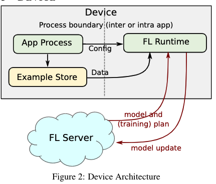

<head>

<!--支持网页公式显示-->    

</head>

<body>

  <h4>⚠ 转载请注明出处：<i>Maintainer: MinelHuang，更新日期：Aug.04 2021</i></h4>
  

  
  
  

   
  

      
  

  

  &nbsp;&nbsp;&nbsp;&nbsp;本作品由 <b>MinelHuang</b> 采用 <a rel="license" href="http://creativecommons.org/licenses/by-nc-nd/4.0/">知识共享署名-非商业性使用-禁止演绎 4.0 国际许可协议</a> 进行许可，在进行使用或分享前请查看权限要求。若发现侵权行为，会采取法律手段维护作者正当合法权益，谢谢配合。
  

 

  

  

    <h2> 目录 </h2>
    

  

  

    

    &nbsp;&nbsp;&nbsp;&nbsp;Section 1. <a href="#section1"><b>前言</b></a>：介绍近年federtaed learning system的场景分类。
    

    &nbsp;&nbsp;&nbsp;&nbsp;Section 2. <a href="#section2"><b>GAIA</b></a>：与distributed infrastructure层面上内存管理，其应用场景为interactive graph computing。
    

    &nbsp;&nbsp;&nbsp;&nbsp;Section 3. <a href="#section3"><b>Scaling FL System</b></a>：一种为横向联邦学习设计的大规模FL架构。
  

<h2><a name="section1">1. 前言</a></h2>

  

  &nbsp;&nbsp;&nbsp;&nbsp;本章将从综述的角度，介绍适用于Fedrated Learning的在分布式Framework方面的系统框架、分类与挑战。

<h2><a name="section2">2. GAIA</a></h2>

  

  &nbsp;&nbsp;&nbsp;&nbsp;参考资料：<a href="https://www.usenix.org/conference/nsdi21/presentation/qian-zhengping">GAIA: A System for Interactive Analysis on Distributed Graphs Using a High-Level Language</a>. NSDI 2021  

  <h3>场景和Problems</h3>
  

  &nbsp;&nbsp;&nbsp;&nbsp;Gaia的应用场景为，在大型集群中对graph data进行迭代式分析。首先简单介绍一下什么是Graph data。 
   
  

  &nbsp;&nbsp;&nbsp;&nbsp;Figure 1便是一个典型的graph data，其描述的是一个罪犯的现金流，例如在t1时，罪犯购买了一个网络商品，t2时银行将钱打给了3号商户。而后在t3时商户将这笔钱又打给了中间人账户，通过一系列中间人，最后再将这笔钱打回罪犯手中（t4）。Graph data analyze便是通过这样一个图数据，分析出是否有洗钱的嫌疑。通常，graph data由点和边组成，点代表着一个实体，边代表实体间的关系，在social networks，commerce transaction，online payments等领域存有大量的graph data。一份图数据可能包含billions of vertices，hundreds of billions to trillions of edges，所以一般需要在一个large cluster上进行处理。Gaia的应用场景是，对于这样一种大规模的图数据，用户会对其进行interactive query analyze，例如提交一个查询query以寻找某个顶点是否存在。故如何低时延的反馈是用户对cluster的需求。Gaia的场景可以概括为：scaling graph data，big cluster，interactive queries and low latency 
  

  &nbsp;&nbsp;&nbsp;&nbsp;那么先前的Graph data engines存在哪些问题呢？其一是Programming Model单一，例如Naiad，仅能scaling一些特定的图算法。作为一个distributed framework而言，其program接口没办法满足那些没有distributed computing知识的人。其二是memory management问题，过去的系统主要是基于bulk synchronous parallel (BSP)系统，即计算是迭代式的，每次迭代的运算是相同的。但是BSP系统并不适合interactive graph queries，因为interactive queries过程中通常需要维护大量的app states，这种states可能会随迭代指数倍增长，从而导致memory crisis；在interactive queries场景下，会出现多个queries共享有限内存的情况，当其为了提高效率能cache一部分input graph时，很有可能出现memory crash。

  <h3>内容概述</h3>
  

  &nbsp;&nbsp;&nbsp;&nbsp;此文章中提出Gremlin，其提供了high-level的编程框架。用户提交Gremlin queries，GAIA系统将使用Scope Abstraction描述一个query中的data dependencies，这允许使用dataflow来描述Gremlin traversal，最终达到高效的parallel execution。为了防止memory crash，GAIA在runtime中优化了parallel graph traversal。GAIA的系统框架如下图所示： 
   

