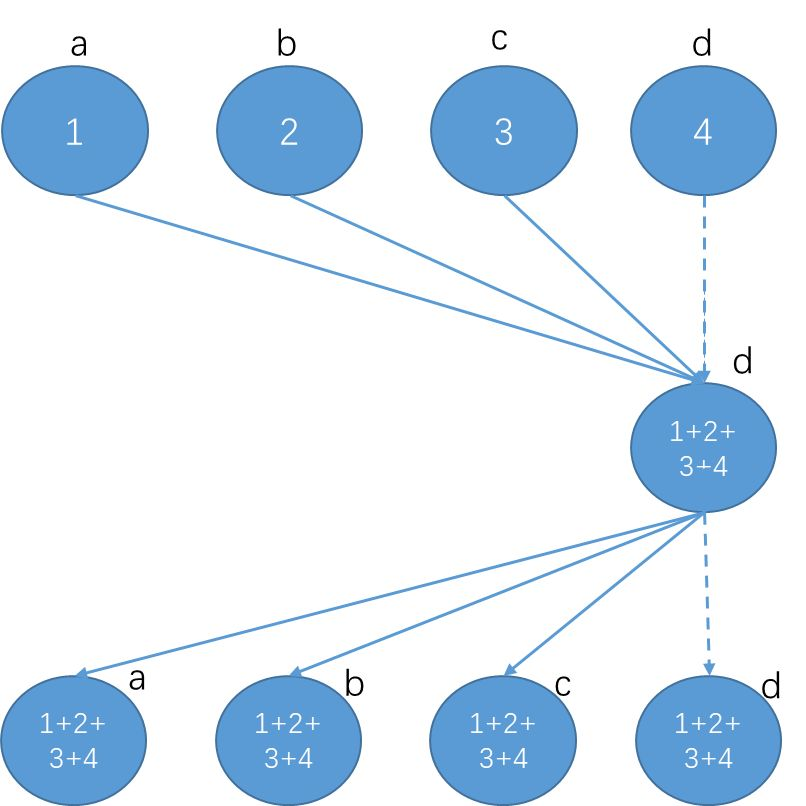
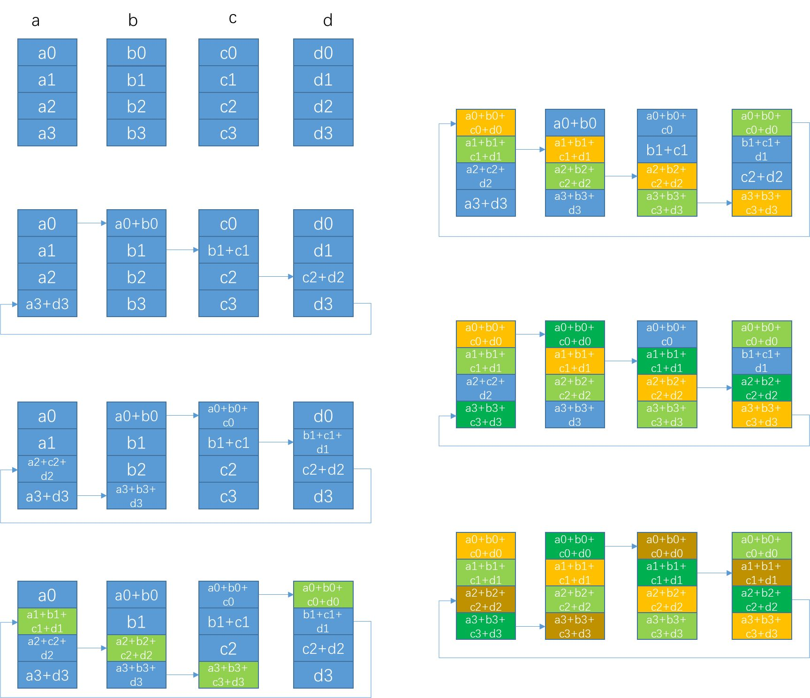
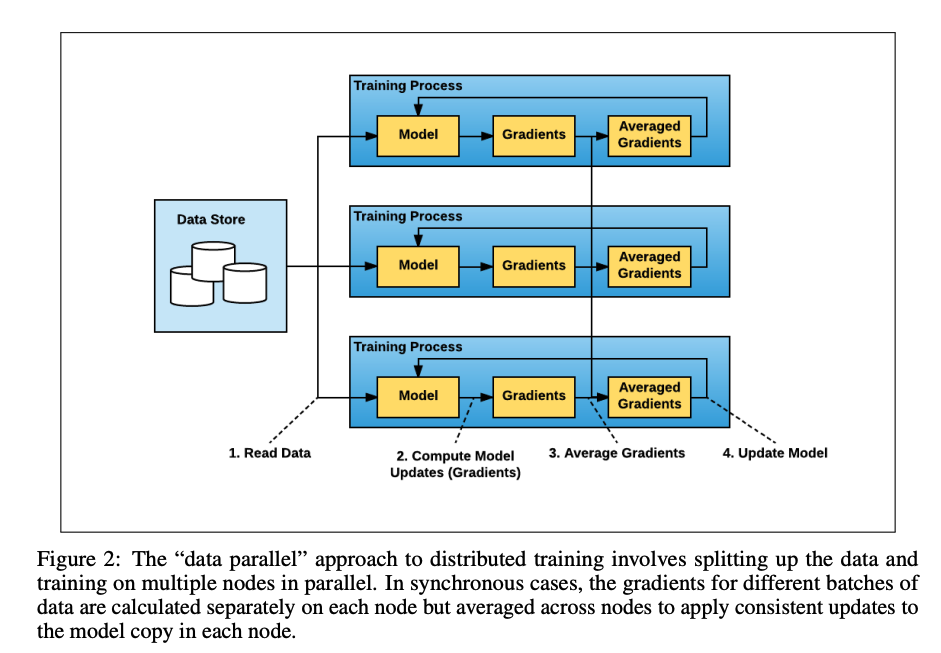
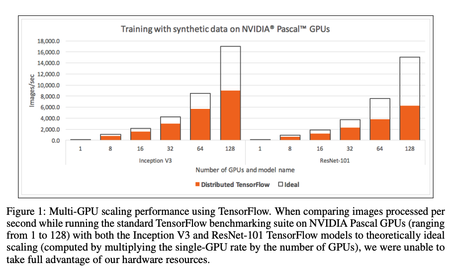
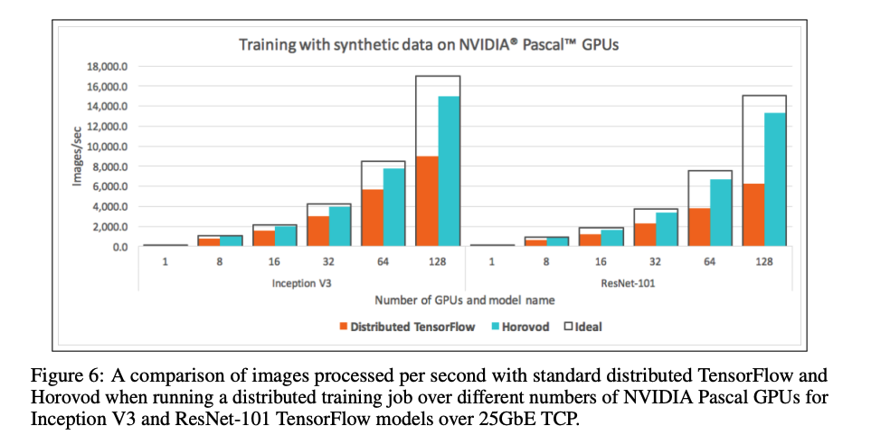

<head>

<!--支持网页公式显示-->    

</head>

<body>

  <h4>⚠ 转载请注明出处：<i>Maintainer: MinelHuang，更新日期：Dec.16 2021</i></h4>
  

  
  
  

   
  

      
  

  

  &nbsp;&nbsp;&nbsp;&nbsp;本作品由 <b>MinelHuang</b> 采用 <a rel="license" href="http://creativecommons.org/licenses/by-nc-nd/4.0/">知识共享署名-非商业性使用-禁止演绎 4.0 国际许可协议</a> 进行许可，在进行使用或分享前请查看权限要求。若发现侵权行为，会采取法律手段维护作者正当合法权益，谢谢配合。
  

 

  

    <h2> 目录 </h2>
    

  

  

    

    &nbsp;&nbsp;&nbsp;&nbsp;Section 1. <a href="#section1"><b>前言</b></a>：介绍Hoplite的应用场景和Problems。
    

    &nbsp;&nbsp;&nbsp;&nbsp;Section 2. <a href="#section2"><b>AllReduce</b></a>：介绍什么是allreduce技术。
    

    &nbsp;&nbsp;&nbsp;&nbsp;Section 3. <a href="#section3"><b>Horovod</b></a>：AllReduce in Deep Learning。
    

    &nbsp;&nbsp;&nbsp;&nbsp;Section 4. <a href="#section4"><b>Hoplite</b></a>：Hoplite正文介绍。
  

<h2><a name="section1">1. 前言</a></h2>

  

  &nbsp;&nbsp;&nbsp;&nbsp;参考资料：<a href="https://dl.acm.org/doi/abs/10.1145/3452296.3472897">Hoplite: efficient and fault-tolerant collective communication for task-based distributed systems</a>. 2021. SIGCOMM 

  <h2>场景和Problems</h2>
  

  &nbsp;&nbsp;&nbsp;&nbsp;该论文的应用场景为，task-based runtime distributed framework。与传统的task-based framework或data-based framework不同的是，runtime framework会在runtime中创建新的任务，并schedule某个worker去运行该任务。那么对于communication这一层而言，如何在runtime中运行collective collective communication如all-reduce是一个问题。 
  

  &nbsp;&nbsp;&nbsp;&nbsp;传统的collective communication如OpenMPI, MPICH, Horovod, Gloo, NCCl等都需要在runtime之前先得知communication pattern，即app需要指出参与的workers会在runtime中如何通信。但在runtime framework中，对于新的任务我们是没法提前得知其会被部署在哪个worker上，也就无法得知该如何collective communication。 
  

  &nbsp;&nbsp;&nbsp;&nbsp;所以，Hoplite允许参与者动态的运行collective communication，其计算data transfer schedule于任务或对象产生/到来时，并使用fine-grained pipelining运行low-latency data transfer scheduling。 
  

  &nbsp;&nbsp;&nbsp;&nbsp;本博客将从AllReduce开始，逐步介绍为何需要在machine learning中使用该算法，allreduce被应用在哪个组件中。最后本文将介绍Hoplite对原有工作的优化。

<h2><a name="section2">2. AllReduce</a></h2>

  <h4>AllReduce概述</h4>
  

  &nbsp;&nbsp;&nbsp;&nbsp;参考资料：<a href="https://zhuanlan.zhihu.com/p/79030485">腾讯机智团队分享--AllReduce算法的前世今生</a>
  

  &nbsp;&nbsp;&nbsp;&nbsp;在分布式机器学习中，通常数据是分布在各个worker上的，即每个worker持有一部分的data partition。通常在一次迭代中，每个worker通过local computing得到gradients信息，而后需要使用所有的gradients来更新模型weights。 
  

  &nbsp;&nbsp;&nbsp;&nbsp;那么由哪台worker收集所有的gradients而更新weights呢，一种思想如下图： 
   
  

  &nbsp;&nbsp;&nbsp;&nbsp;我们可以通过Reduce + Broadcast的方法来实现，也即parameter server架构。我们现在尝试使用数学来定义上述过程的时间开销。设`a`代表两个通信节点之间的latency，`S`代表每个worker上的数据量，`B`代表带宽，`C`代表处理一个byte数据所耗费的时间，`N`代表worker总数。 
  

  &nbsp;&nbsp;&nbsp;&nbsp;故在parameter server架构下，所需的总时间为`2*(\alpha +S/B) + N*S*C` 
  

  &nbsp;&nbsp;&nbsp;&nbsp;在PS架构中我们发现，PS节点的带宽成为瓶颈，并且仅使用了PS节点的算力，我们希望通过一种手段能同时优化communication & computation，即让节点间的通信开销负载均衡，并在这一过程中能动用更多的算力。AllReduce实现了这一目标，下面我们以Ring AllReduce为例来阐述其如何实现的。 
   
  

  &nbsp;&nbsp;&nbsp;&nbsp;AllReduce算法分为两步，第一步为让每一个worker都得到1/N的数据块，称为scatter-reduce，每一步通信耗时`\alpha + S/(NB)`，计算耗时`(S/N)*C`，共`N-1`步。该步对应上图左侧部分。 
  

  &nbsp;&nbsp;&nbsp;&nbsp;第二步是使所有的worker上每一个`1/N`块都完整，称为allgather，每一步的通信耗时`\alpha + S/(NB)`，没有计算开销。该步对应上图右侧部分。 
  

  &nbsp;&nbsp;&nbsp;&nbsp;那么，整体的耗时可以表示为，`2*(N-1)*[\alpha + S/(NB)] + (N-1)*[(S/N) * C]`。对比于Parameter Server模型，每一步一个worker仅会发送一次、接受一次`S/N`大小的数据块，于是我们可以说单步通信开销减少，并且负载均衡；在计算部分由于所有worker都参与了计算，故计算时间开销降低了`N`倍；甚至该方法节省了每台worker上的内存开销。后面笔者会描述，在Machine Learning领域，allreduce的用途和研究点。

  <h4>AllReduce in Machine Learning</h4>
  

  &nbsp;&nbsp;&nbsp;&nbsp;参考资料：<a href = "https://andrew.gibiansky.com/blog/machine-learning/baidu-allreduce/">Bringing HPC Techniques to Deep Learning</a>
  

  &nbsp;&nbsp;&nbsp;&nbsp;假设我们使用data parallel stochastic gradient descent，其过程是，数据分布在各个worker上，每个worker计算出gradients后，与其他workers交换，最后使用所有的gradients更新本地模型。在这一情景中，数据是distributed，而每个worker持有全部的模型信息。首先明确的是，我们使用很庞大的模型，即parameters的数量庞大。这样导致每个worker产生的gradients数量也很庞大，由此导致较长的communication costs。我们尝试着，能否使用ring allreduce方式，同时达到distributed computation、降低单步communication cost和节省GPU空间三个目的。 
  

  &nbsp;&nbsp;&nbsp;&nbsp;在DNN反向传播中，每一层的weight更新都需要对该层的梯度信息进行求和，显然在分布式SGD中梯度信息是分布在各个worker上的。在这里我们可以使用allreduce来降低该部分的时间开销。

<h2><a name="section3">3. Horovod</a></h2>

  

  &nbsp;&nbsp;&nbsp;&nbsp;参考资料：<a href="https://arxiv.org/pdf/1802.05799.pdf">Horovod: fast and easy distributed deep learning in
  TensorFlow</a>. 2018. arXiv
  <h4>场景和Problem</h4>
  

  &nbsp;&nbsp;&nbsp;&nbsp;Horovod的应用场景为deep learning，目前deep learning的模型规模和数据集规模增长日益庞大，故单块GPU的训练时间过长。用户开始考虑使用分布式GPU来承载庞大的数据，其一般使用方式如下：
   
  

  &nbsp;&nbsp;&nbsp;&nbsp;数据分布式的存放在不同的工作节点中，即data parallel方式，分布式的过程称为data partition。worker在本地计算gradients，再通过相互交换数据完成aggregate gradients过程，最后更新模型。 
  

  &nbsp;&nbsp;&nbsp;&nbsp;在Tensorflow distributed中，测试发现分布式计算的性能较差，测试效果如下图：
   
  

  &nbsp;&nbsp;&nbsp;&nbsp;可以看到，随着GPU规模变大，其实际性能小于使用data-parallelism的方法进行分布式的ideal性能。这是因为几乎有一半的时间开销为通信开销。一部分的开销在上节有提到，为Parameter Server架构带来的通信和计算瓶颈；第二部分为tensorflow server交互带来的开销。回想下tensorflow分布式架构，其server需要根据用户代码形成dataflow，而后place任务至不同的worker节点，开始execution。这一过程涉及code reconsturction，用于重新构建在workers上运行的实际代码，也会带来一定的时间损耗。 
  <h4>Solution</h4>
  

  &nbsp;&nbsp;&nbsp;&nbsp;Horovod采用Baidu提出的ring allreduce算法来降低multi-GPU中的gradient aggregated通信开销。梯度聚合在tensorflow server上（或dataflow中）被表示为tensor fusion。展开来说是，gradient aggregated函数的输入为gradients，在dataflow中gradients是由多个tensor组成的，故在有tensor fusion的过程中不再像以前一样将所有所需的tensors流入一个worker，而是让tensors所在workers group运行ring allreduce算法。这样一来，allreduce便结合进tensorflow中了。在采用allreduce后，对distributed tensorflow达到了约65%的提升，如下图：
   

<h2><a name="section4">3. Hoplite</a></h2>

  

  &nbsp;&nbsp;&nbsp;&nbsp;参考资料：<a href="https://dl.acm.org/doi/pdf/10.1145/3452296.3472897">Hoplite: Efficient and Fault-Tolerant Collective Communication for Task-Based Distributed Systems</a>. 2021. SIGCOMM  
  <h4>为什么要使用AllReduce</h4>
  

  &nbsp;&nbsp;&nbsp;&nbsp;首先，我们依旧需要分析一下在动态tasks场景下为何需要allreduce，或者说allreduce解决的是哪一部分的瓶颈。Hoplite是对Ray系统的一个优化组件，故我们同样在actor-based + 强化学习的场景中讨论。 
  

  &nbsp;&nbsp;&nbsp;&nbsp;动态task-based系统常用于开发包含异步、动态计算、动态通信组件的分布式应用，其中动态指无法在runtime前预测并schedule的functions。一个典型的动态task模型为：a caller动态的创建了task A和task B，task A立刻返回一个future object作为task B的输入，在task A运行结束后，task B立刻开始执行。Task-based system负责的是，为task A和task B分配workers以执行，并传递task A的运行结果至task B；第二点是负责fault tolerance，即若task A或B出现崩溃，则立刻创建新的任务来保证程序正常完成。 
  

  &nbsp;&nbsp;&nbsp;&nbsp;显然，task A和task B之间存在data transfer和data computation。在强化学习场景中，task A和B之间的关系可以类比成training和simulator间的关系。Training动态创建了simulators，根据当前policy产生actions，并将其输入至simulators；simulators得到rewards之后再返回给training。Training任务最后再根据rewards计算loss和gradient，完成一次迭代的模型更新。 
  

  &nbsp;&nbsp;&nbsp;&nbsp;在这里，与上一节deep learning中相同，gradients数据量庞大（分布在各worker上）并需要进行聚合操作，当然我们希望能否使用allreduce的方式降低此部的开销。然而由于training function是被动态创建的，我们并不清楚参与此次allreduce的workers/tasks/data partitions是哪些，也即并不能在runtime前得知communication pattern。这导致allreduce无法运行，即我们没法构建类似ring allreduce那样的通信环。除非，我们可以在runtime中完成构建communication pattern这件事。一种可行的方法是将所有的参与方同步，经同步后当然可以构建出communication pattern，但是这样一来部分progress显然会陷入idle状态，对于一些异步应用如distributed RL的性能影响是致命的。 
  

  &nbsp;&nbsp;&nbsp;&nbsp;第二个问题在于，如果在allreduce过程中发生错误怎么办，显然在某一步，例如allgather中，一个node出现failure会使得所有参与allreduce的节点都得不到完整信息，一个高效的fault tolerance方式也是必须的。 

  <h4>Hoplite Contributions</h4>
  

  &nbsp;&nbsp;&nbsp;&nbsp;我们需要完成的是，在runtime中异步的完成efficient and fault-tolerant collective communication layer。在这里，输入的data partitions是动态的，所以该layer可以拆分为对每一个arrive object进行data transfer schedule，并设计一个pipeline使得即使只有一部分的participants are ready，依旧可以开始collective communication。 
  

  &nbsp;&nbsp;&nbsp;&nbsp;其二是在错误发生后，Hoplite可以动态的调整data transfer schedule以降低failed task对整体结果的影响。该fault-tolerance方法允许live tasks make progress，也允许failed task rejoins。
  

