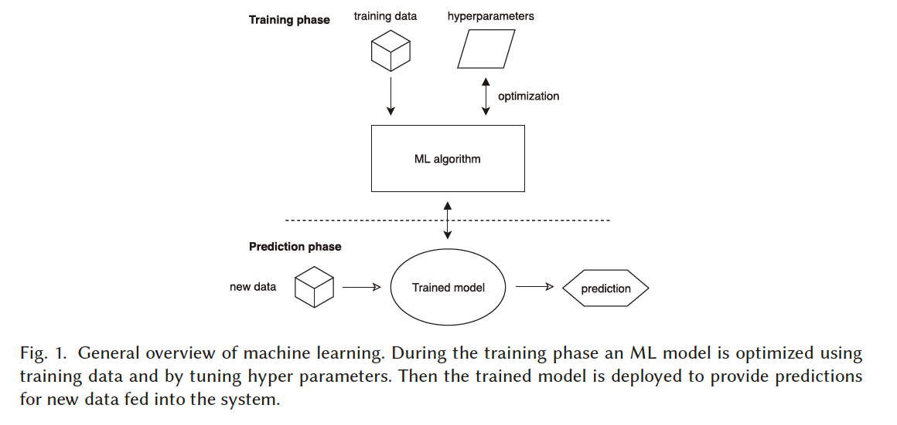
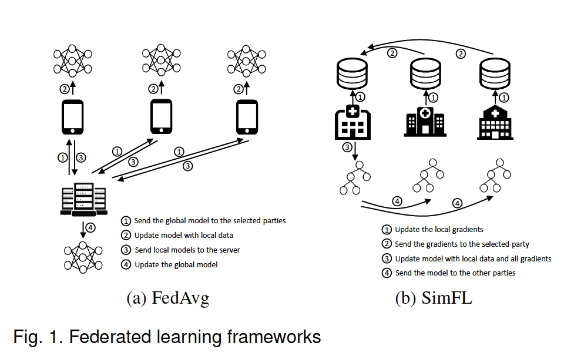
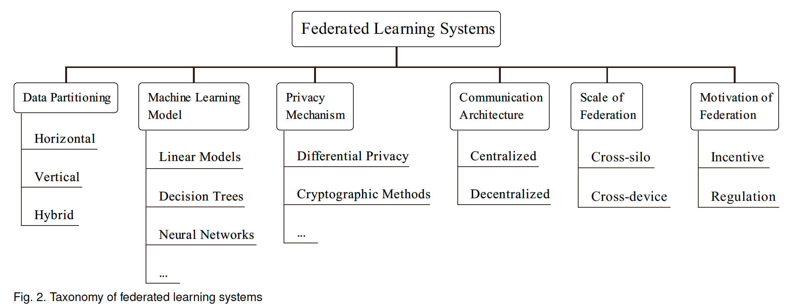

<head>

<!--支持网页公式显示-->    

</head>

<body>

  <h4>⚠ 转载请注明出处：<i>Maintainer: MinelHuang, 更新日期: Jan.02 2022</i></h4>
  

  
  
  

   
  

      
  

  

  &nbsp;&nbsp;&nbsp;&nbsp;本作品由 <b>MinelHuang</b> 采用 <a rel="license" href="http://creativecommons.org/licenses/by-nc-nd/4.0/">知识共享署名-非商业性使用-禁止演绎 4.0 国际许可协议</a> 进行许可，在进行使用或分享前请查看权限要求。若发现侵权行为，会采取法律手段维护作者正当合法权益，谢谢配合。
  

 

  

  

    <h2> 目录 </h2>
    

  

  

    

    &nbsp;&nbsp;&nbsp;&nbsp;Section 1. <a href="#section1"><b>前言</b></a>：介绍本文的章节安排。
    

    &nbsp;&nbsp;&nbsp;&nbsp;Section 2. <a href="#section2"><b>Survey</b></a>：介绍今年来分布式ML & FL领域关于system design的survey文章。
    

    &nbsp;&nbsp;&nbsp;&nbsp;Section 3. <a href="section3"><b>Summary</b></a>：总结分布式ML & FL的通用分层以及设计目标、设计方法。
  

<h2><a name="section1">1. 前言</a></h2>

  

  &nbsp;&nbsp;&nbsp;&nbsp;本博客的目的在于，对现有文献进行分类归纳，明确在系统设计方面学者们是在哪一个层次进行思考的。该分类将指导笔者对近三年（2019-2021）在分布式ML以及FL方向上的系统设计文章阅读、总结以及idea思考。 
  

  &nbsp;&nbsp;&nbsp;&nbsp;本文的章节安排如下：第二章将对state-of-art的文献survey进行阅读，在第三章将对其总结归纳。 
  

  &nbsp;&nbsp;&nbsp;&nbsp;笔者将依照本文，对文献进行分类，文献list将同步更新于github: <a href="https://github.com/Huangxy-Minel/System-Design-for-Federated-Learning">System Design for Federated Learning</a>

<h2><a name="section2">2. Survey</a></h2>

<h3>2.1 Survey on Distributed Machine Learning</h3>
  

  &nbsp;&nbsp;&nbsp;&nbsp;参考资料：<a href="https://dl.acm.org/doi/abs/10.1145/3377454">A Survey on Distributed Machine Learning</a>
  

  &nbsp;&nbsp;&nbsp;&nbsp;该survey针对的是分布式ML中的系统设计，笔者将通过此survey总结ML System的分层、优化目标以及优化方法分类。 
  

  &nbsp;&nbsp;&nbsp;&nbsp;首先第一个问题，<b>为什么要分布式？</b>Machine Learning的发展体现在training data的指数增长，和model所需的parameters量级的增长（通常指NN模型），二者共同导致了单台计算机无法承载如此庞大的ML训练任务，所以人们提出分布式机器学习。和集中式机器学习相比，Distributed ML要解决的首要问题是：<b>高性能的并行方式</b>。在本节中，我们会讨论state-of-art的分布式ML场景、问题、挑战以及解决方法。 

  <h3>2.1.1 Introduction</h3>
  

  &nbsp;&nbsp;&nbsp;&nbsp;分布式机器学习通常有两个原因，其一是model designer希望使用分布式来提高并行度或I/O带宽总量，例如对TB级的输入数据的训练；其二是数据本身是inherently distributed（大型企业的数据存放在不同的地理位置上）或在single computer上无法存放庞大的数据（分布式存储）。在分布式后，通常一个分布式系统要解决三类问题：<b>parallel computation, data distribution and resilience to failures</b>。 
  

  &nbsp;&nbsp;&nbsp;&nbsp;本节的章节安排为，Section 2讨论ML中的系统challenges和High Performance Computing中的ideas是如何应用在ML System上的（用于加速和scaling）；Section 3讨论ML architecture，覆盖algorithms层面到network communication层面（entire stack）；Section 4讨论widely used systems and
  libraries和其underlying designs；Section 5讨论分布式机器学习的main challenges。 

  <h3>2.1.2 Machine Learning - A High-performance Computing Challenge?</h3>
  

  &nbsp;&nbsp;&nbsp;&nbsp;ML的数据操作可以看作对vector, matrices or tensors的操作，属于线性代数问题。在过去几十年中，HPC community（如BLAS or MPI）对此进行了大量研究，同时HPC community也认为machine learning是一个emerging high-value workload并开始将HPC methodology应用于此，包括使用HPC系统/设备训练模型。 
  

  &nbsp;&nbsp;&nbsp;&nbsp;和其他的large-scale computational challenges相同，加速workloads包含两大类基本方法：其一为向单个机器增加更多的资源（scaling-up），其二为向system中增加更多的节点（scaling-out），我们来分别对其进行challenges的讨论。 

  <h4>2.1.2.1 Scaling up</h4>
  

  &nbsp;&nbsp;&nbsp;&nbsp;最常见的方法是使用GPUs对单机进行性能提升，例如Nvidia Titan V和Nvidia Tesla V100。和CPU相比，GPU具有更多的cores（V100包含5120 cores），故可以支持并行度更高的运算，这一点非常适合需要数据并行和模型并行的ML算法。 
  

  &nbsp;&nbsp;&nbsp;&nbsp;第二种为Application Specific Integrated Circuits（ASICs），通常是根据特定的function而设计的电路。例如在ML中，常用的算子为矩阵乘法，故可以将矩阵乘function做成硬件电路以进行加速。Google设计的Tensor Processing Unit（TPU）即是一种ASICs，其集成了对Tensor的各类运算例如矩阵乘法以完成加速。 
  

  &nbsp;&nbsp;&nbsp;&nbsp;第三种硬件设计引入了Neuro-Functional Unit（NFU），实现复数的数据input，加法，激活函数等运算，代表性的加速器为DianNao，用于大规模神经网络with a small area footprint。
  

  &nbsp;&nbsp;&nbsp;&nbsp;其余的硬件设备还address一些性能问题，例如针对accessing the weights of neurons from DRAM，Hinton et al. 使用deep compressiong技术put the weights into SRAM并加速了sparse matrix-vector乘法；使用MIMD架构的special CPU加速了浮点数运算等。

  <h4>2.1.2.2 Scaling out</h4>
  

  &nbsp;&nbsp;&nbsp;&nbsp;Scaling out的原因有三种，其一是设备较为便宜；其二是抗风险能力强；其三是增加了整体的I/O带宽。训练ML models是一个highly data-intensive task，所以对数据的消化会成为严重的性能瓶颈，所以通过分布式来将数据的读写、处理分散到一个集群中可以显著提高性能。但是并不是所有的模型都可以并行化、分布式化的，取决于具体的ML算法。

  <h3>2.1.3 Reference Achitecture for Distributed Machine Learning</h3>
  

  &nbsp;&nbsp;&nbsp;&nbsp;上文我们介绍了ML system的主要目标：并行化、数据分发以及容错，但这样的分类显然是太过概述化了。故在此节我们将详细的剖析ML通用architecture，将从ML system的用户侧、框架侧以及底层通信侧介绍每一层的功能，典型应用以及他们是如何实现上述三个目标的。 
  

  &nbsp;&nbsp;&nbsp;&nbsp;Machine Learning的主要任务如下图： 
   
  

  &nbsp;&nbsp;&nbsp;&nbsp;其主要包含training和predicting两部分。Training phase指的是使用庞大的training data更新machine learning model，最终的输出为Trained Model；Prediction phase是使用trained model来对新数据进行预测。我们进行分布式化其实是对这两个phase进行分布式。 
  

  &nbsp;&nbsp;&nbsp;&nbsp;常用的分布式方法分为两种：data parallelizing和model parallelizing。数据并行指的是所有workers可以使用相同的算法，但数据输入不同来进行计算，例如在LR算法中我们可以将数据分成各个partition，对每个partition进行gradients的计算。所以我们发现，数据并行的前提一般是ML算法假定了independent and identical distribution (i.i.d.，独立同分布)，这样我们才可以对每个partition产生的gradients进行聚合。第二种为模型并行，指的是每个worker对部分模型进行计算，例如在树模型中，spliting过程可以使用多个worker进行并行。然而模型并行方法并不能应用于所有ML算法，这是因为model parameters通常不能split up，一种解决办法是通过例如ensembling技术对output trained models进行聚合。 
  

  &nbsp;&nbsp;&nbsp;&nbsp;我们发现，对于ML system的用户来说，其需要设计一种高性能的并行机器学习算法，并行方式可以大致分为data parallelizing和model parallelizing两类；对于ML system的设计者来说，则要给出实现方式和编程接口，也即framework设计；最后即底层通信方式和接口设计。在后文，笔者尽可能的分别介绍这三层具体是做什么的，又是如何实现高性能并行化的。

  <h4>2.1.3.1 Machine Learning Algorithms</h4>
  

  &nbsp;&nbsp;&nbsp;&nbsp;该章节非本博客的主要内容，故简述。 
  

  &nbsp;&nbsp;&nbsp;&nbsp;ML algorithms一般分为三个步骤：<b>Feedback, Purpose, Method</b>。Overview的讲，ML algorithms在每次迭代将Feedback作为Method的输入来优化模型，逐渐逼近Purpose。 
  

  &nbsp;&nbsp;&nbsp;&nbsp;Feedback指的是提高模型质量所需的输入。在监督学习中，feedback常是指predict的值和真实值之间的差异情况，可以使用偏移（bias error）和方差（variance）来表示，一个例子为loss function。无监督学习中feedback可以是在一个group中样本的相似程度，这种similarity metric可以用来优化group method。 
  

  &nbsp;&nbsp;&nbsp;&nbsp;Purpose是ML algorithms的目标，其中可能是Classification、Clustering、Dimensionality reduction等。以Classification为例，其具体是希望使用一个模型将输入的数据样本打上标签（分类），这种预测标签越接近真实标签则代表分类器的准确性越高。 
  

  &nbsp;&nbsp;&nbsp;&nbsp;Method即如何逐步的优化模型以达到Purpose。一个广泛应用的方法是Stochastic Gradient Descent（SGD）算法，其目的是，逐步的降低loss即代表越逼近Purpose。所以我们可以计算模型参数对loss的导数，即gradients，根据梯度的方向来优化parameters，使得loss越来越小。

  <h4>2.1.3.2 拓扑结构</h4>
  

  &nbsp;&nbsp;&nbsp;&nbsp;Framework中的最小颗粒度是worker。在Machine learning algorithm中，算法设计者提供了分布式运行其算法的具体方式，例如data parallelizing训练DNN。那么Framework就像一个中间件，要给出具体到worker上的并行化方案。这里可以将framework设计分为并行化和拓扑结构两个方面，并不是分为两层，而是说需要在这两个方面进行思考。一种通用的思考方式为，给定了并行化方法，该如何设计worker的拓扑结构，使得某些metric得以优化。
  

  &nbsp;&nbsp;&nbsp;&nbsp;回顾上文，分布式系统的三个主要任务是并行化、数据分布和容错。故在设计拓扑结构时同样需要考虑这三点。下面笔者给出对拓扑结构的理解和例子。 
  

  &nbsp;&nbsp;&nbsp;&nbsp;首先我们不妨来思考，什么是低效的并行化。假设我们要对SGD过程做数据并行处理，我们在execution前有两个拓扑：数据分布拓扑和任务拓扑。输入数据要经过data partition过程分布式的存储在各个worker上，形成数据拓扑（节点称为datanode）；每个worker会被安排其需要执行的task以及输入输出数据依赖关系，形成任务拓扑（节点称为tasknode）。低效的并行化指的是，数据的拷贝损耗很大（例如一个tasknode的输入来自所有的datanode），则会带来high communication cost；或者是某个tasknode执行了大量的运算，形成high communication cost；或者是大量的tasknode在等待输入，形成high sychronization cost。可见distributed system所需要解决的两个关键问题：data distribution和parallelsim之间是相互依赖的。
  

  &nbsp;&nbsp;&nbsp;&nbsp;于是，我们提出了几个通用的拓扑模型。举其中一个例子，Bulk Synchronous Parallel (BSP)模型是最简单的分布式模型。其data distribution方式为数据均匀的分布在每个worker上，而后对每个computation和communication阶段做同步。通俗来讲就是将程序的运行分为了computation和communication，所有worker通过communication交换中间结果（根据任务拓扑，每个任务得到input），而后所有worker再进行computation。其优势是强一致性，劣势是computation快的workers需要等待慢的workers。但是假若每个worker的运行时间相同，例如data parallel SGD，BSP模型依旧是十分高效的。 
  

  &nbsp;&nbsp;&nbsp;&nbsp;其余的拓扑结构还包括：Trees、Rings、Parameter Server、Peer-to-Peer等。

  <h4>2.1.3.3 Communication</h4>
  

  &nbsp;&nbsp;&nbsp;&nbsp;最后我们要提到System的底层 - 通信优化。这里并不是指的实际的通信技术（如RPC等），而是指并行化、数据分布方式会直接影响到训练模型的通信总量，故存在优化空间。 
  

  &nbsp;&nbsp;&nbsp;&nbsp;在分布式机器学习中，computation time和communication cost通常是一对tradeoff。并行化的分布式学习可以减少computation time，但同时也会使communication costs逐渐成为系统瓶颈。当然，当模型并不是很大时，并不会出现此类情况。 
  

  &nbsp;&nbsp;&nbsp;&nbsp;常见的并行方式有：Bulk Synchronous Parallel (BSP)、Stale Synchronous Parallel (SSP)、Approximate Synchronous Parallel (ASP)、Barrierless Asynchronous Parallel / Total Asynchronous Parallel (BAP/TAP)。在此笔者不过多介绍几类模型的定义和区别，可以参考论文3.5章节。

  <h4>2.1.3.5 Summary</h4>
  

  &nbsp;&nbsp;&nbsp;&nbsp;在此章，我们主要明确了分布式ML系统的主要组成部分包含哪些：包括ML算法（即系统用户）、系统Framework（负责为提供编程接口和使用拓扑结构设计来实现并行化）以及底层通信组件。这里需要说明，三者并不是毫无关联的：算法设计者可以设计对通信量友好的并行训练方法；框架可以针对模型精确度调整其拓扑结构和并行execution。所以笔者想强调的是，这种分层仅是帮助笔者个人对论文进行分类，以及提供不同角度的思考方式而已。

  <h3>2.2 Survey on Federated Learning</h3>
  

  &nbsp;&nbsp;&nbsp;&nbsp;参考文献：<a href="https://ieeexplore.ieee.org/abstract/document/9599369">A Survey on Federated Learning Systems: Vision, Hype and Reality for Data Privacy and Protection</a>. 2021. TKDE
  

  &nbsp;&nbsp;&nbsp;&nbsp;上一章节从分布式机器学习的角度给出了文献的大分类，那么在此章，笔者将进一步把场景缩小至联邦学习，总结分析FL场景下的显著、特有问题和优化方法。同样的，笔者阅读此survey的目标依旧是指导对FL文献的分类。 

  <h4>2.2.1 Overview of Federated Learning Systems</h4>
  

  &nbsp;&nbsp;&nbsp;&nbsp;关于FL算法分类，请参考<a href="https://neth-lab.netlify.app/publication/21-3-2-overview-of-federated-learning/">Overview of Federated Learning</a> 
  
  <h4>2.2.1 System Components</h4>
  

  &nbsp;&nbsp;&nbsp;&nbsp;<b>Parties</b>: Parties代表参与FL的数据持有方，对于party的我们需要考虑三点性质。第一为hardware capacity，指的是计算能力和存储能力，通常在cross-device场景中各party的能力是受限的；第二为scale and stability，cross-silo下的party显然要比cross-device下的party更稳定，换句话说，在cross-device下不能假定所有的parties都在每一轮参加FL训练；最后是data distribution，数据在parties之间的分布通常是non-IID的。 
  

  &nbsp;&nbsp;&nbsp;&nbsp;<b>Manager</b>: 指一个powerful central server，其指导训练全局模型，管理party见的通信。对于server而言，stability和reliability是最为重要的。
  

  &nbsp;&nbsp;&nbsp;&nbsp;<b>Communication-Computation Framework</b>: 与2.1章所叙述的framework相同，也是FLSys中的核心组件。Baseline的FL framework为FedAvg（centralized framework）和SimFL（decentralized framework），如下图： 
   

  <h4>2.2.2 Taxonomy</h4>
  

  &nbsp;&nbsp;&nbsp;&nbsp;可以根据六个性质对FLSys进行分类，如下。
   

  <h4>2.2.3 Summary of Existing Studies</h4>
  

  &nbsp;&nbsp;&nbsp;&nbsp;在此笔者总结对Communication Efficiency的优化。通常使用的方法来源于HPC。 
  

  &nbsp;&nbsp;&nbsp;&nbsp;第一类方法是减小通信量，通过structured updates and sketched updateds和使用lossy compression的方式进行压缩。除去通信量，communication architecture同样可以提高training efficiency。由于此survey是根据优化目标对文献进行逐一叙述，故笔者将在github中进行总结。

<h2><a name="section3">3. Summary</a></h2>

  

  &nbsp;&nbsp;&nbsp;&nbsp;在此章中笔者将谈谈自己对分布式机器学习和联邦学习中，系统设计方面的理解，也用于总结在读文献时看到的新角度和新方法，故会长期更新。
  <h3>3.1 分布式机器学习总结</h3>
  

  &nbsp;&nbsp;&nbsp;&nbsp;首先，自上而下的叙述一遍系统。MLSys的用户的目标是train or predict one model using machine learning algorithms，在2.1.3.1中我们描述了当前state-of-art的机器学习算法。以training过程为例，为了能够分布式学习，首先要确定如何并行化。这里需要根据算法特性，采用数据并行/模型并行的方法进行并行化。在确定好并行化方法后，系统设计者需要设计一套拓扑结构，使集群内的worker可以承担起training任务。当然，在这里包含了许多问题，例如如何描述training任务和数据分布（taskflow & dataflow），如何分配子任务至各个worker（scheduling），如何描述workers之间的关系（typology），如何管理内存（memory），如何容错（fault-tolerance）等等。所有的一切共同构成了分布式机器学习Framework，例如TensorFlow做的便是这样一套系统。最后便是通信部分，在系统层次调用的是通信接口，例如RPC、DCTCP、HTTP等，系统层次并不是在设计高效通信协议，而是要确定如何通信。例如，将object A从worker 1传递至worker 2，且object A是中间结果，甚至可能是分布式存储的，那么什么时候传，传递的顺序，各个对象的传递优先级等等都会影响通信效率。 
  

  &nbsp;&nbsp;&nbsp;&nbsp;在这里，笔者将记录文献中的优化方法，具体分类为：从算法设计的视角，从framework的视角和从通信的视角，每个视角下都包含多种问题，例如从算法设计的视角减少通信量，所以仅是以视角来总结优化方法。在github论文list中的分类是根据优化目标，故二者分类法并不冲突。 

  <h4>从算法设计的视角</h4>
  

  &nbsp;&nbsp;&nbsp;&nbsp;

  <h4>从系统框架的视角</h4>
  

  &nbsp;&nbsp;&nbsp;&nbsp;

  <h4>从通信的视角</h4>
  

  &nbsp;&nbsp;&nbsp;&nbsp;

  <h3>联邦学习系统总结</h3>
  

  &nbsp;&nbsp;&nbsp;&nbsp;联邦学习系统同属于分布式机器学习系统，故前一章的总结同样适用。在FL中，特殊的地方在于特殊的数据分布和密态计算，也是系统瓶颈所在。故优化背景通常也是此二者。本节同上节一样，以视角的方式总结FL studies，并在Paper List中根据优化目标对studies进行分类。 

  <h4>从算法设计的视角</h4>
  

  &nbsp;&nbsp;&nbsp;&nbsp;

  <h4>从系统框架的视角</h4>
  

  &nbsp;&nbsp;&nbsp;&nbsp;

  <h4>从通信的视角</h4>
  

  &nbsp;&nbsp;&nbsp;&nbsp;

  <h3>总结</h3>
  

  &nbsp;&nbsp;&nbsp;&nbsp;笔者认为阅读System paper in distributed machine learning需要考虑的几点关键问题是：第一，<b>是在哪一个角度进行的优化</b>；第二，<b>优化目标是什么</b>；第三，<b>使用的何种方法</b>。文献中通常会提及分布式系统解决的三个问题：<b>数据分布</b>、<b>并行化方式</b>、<b>容错方式</b>。在此之后，笔者将通过文献摘要和introduction定位其场景、视角和优化目标，并总结于此文档和github；对笔者科研有益的文献将精读，总结其方法论以及如何设计分布式系统以完成三大目标，并会于其他博客记录。最终笔者希望可以构建<b>Survey（此文档） - Paper List（Github page） - Summary（文献笔记）</b>为一体的博客簇。 
  

  &nbsp;&nbsp;&nbsp;&nbsp;END

