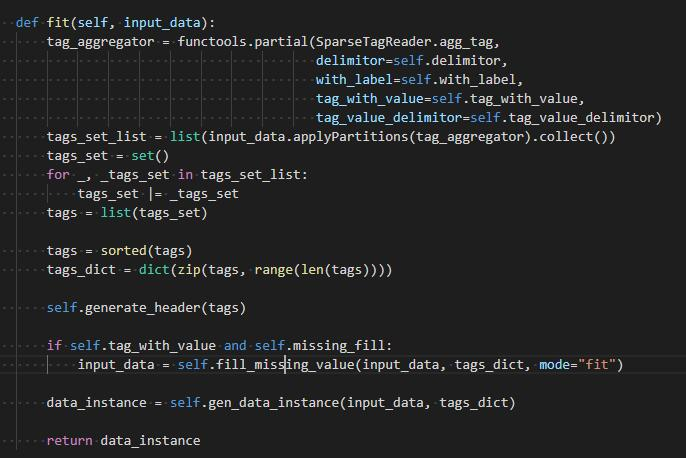

更新时间：2021-03-22

参考资料：

- [FATE documents](https://fate.readthedocs.io/en/latest/index.html)
- [FATE Github](https://github.com/FederatedAI/FATE)

# 1 FATE文件框架

## 1.1 根目录框架

以单机部署为例：


概述如下，加粗为重要文件：

- **bin**：主要为init_env.sh，用于配置路径
- **conf**：系统配置文件，系统的初始化是由.yaml文件配置的，这里预放置一些配置文件供用户修改
- data：未知
- **examples**：提供的例程
- fateboard：可视化界面
- jdk：java本体
- jobs：用户通过client接口提交的jobs
- logs：jobs的处理日志
- miniconda3-fate：miniconda本体
- model_local_cache：未知
- **python**：系统代码本体
- system-package：一些包
- **venv**：用户配置的python虚拟环境

## 1.2 python目录下框架


概况为下：

- fate_arch：未知
- fate_client：为用户提供的操作接口，包括数据上传，开始训练模型等命令
- fate_flow：fate系统的任务提交系统，即用户通过fate_client上交一个任务（job）后，fate系统是以什么样的流程处理它的。
- fate_test：为用户提供的调试接口口
- federatedml：联邦学习算法库

由此我们可以很清晰的发现，fate的系统大致可以概括为，用户通过fate_client系统（很多api）将job提交至fate_server，server接受到job后通过fate_flow进行任务调度，最终调用federatedml完成联邦学习任务。

# 2 FATE_FLOW

本章通过研究FATE主体部分，以得出系统运行和系统框架细节

参考资料：[FATE Offical Documents](https://fate.readthedocs.io/en/latest/_build_temp/python/fate_flow/README.html)

## 2.1 Introduction

FATE-Flow是一个job scheduling系统，完成FL任务的管理任务，包括data input，training job scheduling，indicator tracking，model center和其他功能


## 2.2 Architecture


## 2.3 通过./examples追溯FATE-Flow

参考资料：

- [example使用方法](https://github.com/FederatedAI/FATE/tree/master/examples/dsl/v1)
- [FATE-Flow使用方法](https://github.com/FederatedAI/FATE/blob/master/python/fate_client/flow_client/README_zh.rst)

example选择./examples/dsl/v1/hetero_logistic_regression

刚刚上面有说过，用户是通过fate-client命令接口将任务提交给fate server的，在这里，dsl即是一种fate-client，pipeline是另一种fate-client，都是为用户提供的简易提交任务接口而已。那么在运行dsl前，很显然我们需要告诉fate-client谁是fate server（可能是本机，也可能是集群里的另一台计算机）。

那么下面则是使用dsl，分步骤运行该example，注意所有路径的根目录味./examples/dsl/v1

注：该部分仅是用于一份例程追溯FATE系统架构，而非FATE例程使用教学。这里笔者想搞清楚的问题是，fate-client和fate-server都是以何种方式运行的，fate-server中各组件的运行代码在何处，为后面阅读系统源码做铺垫。

### 2.3.1 运行例程

#### 2.3.1.0 Step 0：初始化fate flow

该步骤只需做一次，我们是通过client将job提交至fate server，那么若是fate server在本机，我们需要初始化fate server中运行的fate flow，系统配置文件位于：./conf/service_conf.yaml

通过：

```
flow init -c ./conf/service_conf.yaml
```

初始化fate-flow，默认配置文件为standalone模式，即将本机配置为server

#### 2.3.1.1 Step 1：Define upload data config file

该步骤的目的是，将待处理数据传递至server，dsl通过上传./upload_data.json实现该功能


该文件的各条目意义为：

| file:                   | file path                                                    |
| ----------------------- | ------------------------------------------------------------ |
| head:                   | Specify whether your data file include a header or not       |
| partition:              | Specify how many partitions used to store the data           |
| table_name & namespace: | Indicators for stored data table.                            |
| work_mode:              | Indicate if using standalone version or cluster version. 0 represent for standalone version and 1 stand for cluster version. |

#### 2.3.1.2 Step2: Define your modeling task structure

该步骤主要是定义modeling task中包含哪些组件（视算法而定），比如data_io, feature_engineering, algorithm_model, evaluation等等。在dsl中，用户通过提交dsl conf文件来简易定义上述structure，examples中每个算法，官方都提供了相应的.json文件供用户参考。一个dsl conf文件例子路径为：./hetero_logistic_regression/test_hetero_lr_train_job_dsl.json

#### Field Specification

| component_name: | key of a component. This name should end with a "_num" such as "_0", "_1" etc. And the number should start with 0. This is used to distinguish multiple same kind of components that may exist. |
| --------------- | ------------------------------------------------------------ |
| module:         | ***Specify which component use. This field should be one of the algorithm modules FATE supported.***<br />The supported algorithms can be referred to [here](https://github.com/FederatedAI/FATE/blob/master/examples/python/federatedml/README.rst)<br /><br />input: 两类input - data和model<br />output:两类output - data和model |
| need_deploy:    | true or false. This field is used to specify whether the component need to deploy for online inference or not. This field just use for online-inference dsl deduction. |

#### 2.3.1.3 Step3: Define Submit Runtime Configuration for Each Specific Component.

样例路径./hetero_logistic_regression/test_hetero_lr_train_job_dsl.json

该步骤用于配置每个party的组件参数：

1. initiator：指明initiator的身份（guest还是host），以及party id
2. job_parameters：runtime配置
3. role：为所有roles指明对应的party ids
4. role_parameters：指明好每个party所相应的parameters
5. algorithm_parameters：所有parties在此都相同

#### 2.3.1.4 Step4: Start Modeling Task

将上述三步使用flow命令上传至服务器

例如：

```sh
python ${your_install_path}/python/fate_flow/fate_flow_client.py -f upload -c upload_data.json

python ${your_install_path}/python/fate_flow/fate_flow_client.py -f submit_job -d hetero_logistic_regression/test_hetero_lr_train_job_dsl.json -c hetero_logistic_regression/test_hetero_lr_train_job_conf.json
```

#### 2.3.1.5 Step5: Check out Results

#### 2.3.1.6 Step6: Check out Logs

#### 2.3.1.7 运行./examples/dsl/v1/hetero_logistic_regression

step 1：上传guest、host数据

```
flow data upload -c ./examples/dsl/v1/upload_data_guest.json 
flow data upload -c ./examples/dsl/v1/upload_data_host.json 
```

step 2：上传model structure conf和runtime conf

```
flow job submit -c ./examples/dsl/v1/hetero_logistic_regression/test_hetero_lr_train_job_conf.json -d ./examples/dsl/v1/hetero_logistic_regression/test_hetero_lr_train_job_dsl.json
```

开始运行

### 2.3.2 溯源flow

很明显，上述操作我们都是作为client操作的，最终可以溯源的仅为flow命令。大致也明白是通过flow命令，将配置文件上传至server，但是这具体细节是什么？

故我们可以查看flow命令的源代码，首先明确，我们的指令实在venv环境下运行的，并且flow-client是通过pip安装的，故指令位于venv/bin中：


继续寻找flow.cli


很明显，我们找到了flow所有命令的源代码

上传任务所用的是flow job，故我们可以继续溯源：


显然，submit之后实际上运行了一个叫做acess_server的函数，显然这个函数是用于连接fate server的，接着寻找该函数，发现是


继续寻找。。。


终于找到了，原来是通过https向fate server传递的文件，所以fate server一定是一直运行在一个进程中，我们不知是什么时候开启了fate server，但是我们可以预判，这一开启操作并不是在venv中完成的，因为fate flow本体位于standalone文件中，故在standalone中寻找开启server的命令。

查看以前的log，发现在部署standalone时我们有运行几个文件来初始化以及测试fate


查看该文件


终于，我们找到了fate server的入口：fate_flow_server.py

### 2.3.3 fate server解读

fate_flow_server.py为fate-flow的启动函数，其中初始化Runtime，PrivilegeAuth，ServiceUtils，ResourceManager，Detector，DAGScheduler，ThreadPoolExecutor等模块

在程序开始，可以看到

```python
manager = Flask(__name__)
```

显然，fate-server是基于Flask建立http服务器的，该文件所有程序如下：

```python
'''
Initialize the manager
'''

manager = Flask(__name__)


@manager.errorhandler(500)
def internal_server_error(e):
    stat_logger.exception(e)
    return get_json_result(retcode=100, retmsg=str(e))


if __name__ == '__main__':
    manager.url_map.strict_slashes = False
    app = DispatcherMiddleware(
        manager,
        {
            '/{}/data'.format(API_VERSION): data_access_app_manager,
            '/{}/model'.format(API_VERSION): model_app_manager,
            '/{}/job'.format(API_VERSION): job_app_manager,
            '/{}/table'.format(API_VERSION): table_app_manager,
            '/{}/tracking'.format(API_VERSION): tracking_app_manager,
            '/{}/pipeline'.format(API_VERSION): pipeline_app_manager,
            '/{}/permission'.format(API_VERSION): permission_app_manager,
            '/{}/version'.format(API_VERSION): version_app_manager,
            '/{}/party'.format(API_VERSION): party_app_manager,
            '/{}/initiator'.format(API_VERSION): initiator_app_manager,
            '/{}/tracker'.format(API_VERSION): tracker_app_manager,
            '/{}/forward'.format(API_VERSION): proxy_app_manager
        }
    )
    # init
    # signal.signal(signal.SIGTERM, job_utils.cleaning)
    signal.signal(signal.SIGCHLD, job_utils.wait_child_process)
    # init db
    init_flow_db()
    init_arch_db()
    # init runtime config
    import argparse
    parser = argparse.ArgumentParser()
    parser.add_argument('--standalone_node', default=False, help="if standalone node mode or not ", action='store_true')
    args = parser.parse_args()
    RuntimeConfig.init_env()
    RuntimeConfig.set_process_role(ProcessRole.DRIVER)
    PrivilegeAuth.init()
    ServiceUtils.register()
    ResourceManager.initialize()
    Detector(interval=5 * 1000).start()
    DAGScheduler(interval=2 * 1000).start()
    thread_pool_executor = ThreadPoolExecutor(max_workers=GRPC_SERVER_MAX_WORKERS)
    stat_logger.info(f"start grpc server thread pool by {thread_pool_executor._max_workers} max workers")
    server = grpc.server(thread_pool=thread_pool_executor,
                         options=[(cygrpc.ChannelArgKey.max_send_message_length, -1),
                                  (cygrpc.ChannelArgKey.max_receive_message_length, -1)])

    proxy_pb2_grpc.add_DataTransferServiceServicer_to_server(UnaryService(), server)
    server.add_insecure_port("{}:{}".format(IP, GRPC_PORT))
    server.start()
    stat_logger.info("FATE Flow grpc server start successfully")
    # start http server
    try:
        stat_logger.info("FATE Flow http server start...")
        run_simple(hostname=IP, port=HTTP_PORT, application=app, threaded=True)
    except OSError as e:
        traceback.print_exc()
        os.kill(os.getpid(), signal.SIGKILL)
    except Exception as e:
        traceback.print_exc()
        os.kill(os.getpid(), signal.SIGKILL)

    try:
        while True:
            time.sleep(_ONE_DAY_IN_SECONDS)
    except KeyboardInterrupt:
        server.stop(0)
        sys.exit(0)
```

在这里说下笔者的理解：

在FATE中，实际上有两个主体系统，分别是分布式系统eggroll，负责将节点集群起来（类似于Hadoop，Spark）；另一个是Flask，负责管理http server。FATE实际上是开设了一个https server，运行在eggroll上，这样集群中的机器通过特定的端口访问时，eggroll会将这些包扔向https server，集群的问题解决了。而后FATE需要将自己的系统编写成一个个apps，而后交付给Flask进行管理。

由下向上叙述一遍FATE系统：

首先机器通过spark/hadoop行程集群，而后通过eggroll捕捉特定的端口中的包，fate创建者利用eggroll，将fate所需的包扔向一个https server，之后在https server上跑自己的apps，所有的apps通过Flask管理。

由上向下叙述一遍FATE系统：

一个client，他想在集群上跑一个联邦学习，训练一个模型。那么通过fate client，向fate server（一个https server）提交submit job请求。https server中有一个专门处理request（http请求，由fate client发出）的app，收到这个job请求后，运行另一个app，叫做job_app，将client发送的job请求插入到一个queue里。该server上的另一个app，叫做tracking_app，检测这个queue，然后调用每个job需要的executor，开始运行job，还有一些app负责scheduler任务，调整这个queue。最终executor完成任务后，再将结果返回给client。总结后如下图：


那么在工作集群中，FATE又是怎么运行的呢？


现在有两家公司，A（左边）和B（右边），每家公司都有一个工作集群，每个集群有n台计算机。

那么每台计算机需要安装一个fate-cluster，再指定一台计算机作为fate-server，由于eggroll支持分布式的FL，所以当fate-server开始时运行一个FL训练时，所有的机器会同时工作，进行并行加速。

假设A和B要共同完成一项FL工作，则A和B的fate-server通过rollsite（http访问）完成通信以及数据交互。

# 3 FATE Server内部架构

说完了fate系统的大体架构，我们只剩下最后一个模糊的地方，即通过flask创建的fate-server中，各个apps是如何联系起来的，本章节用于解决该问题。

fate-server基于flask框架制作，flask通过监视http请求中的url，根据url将该request分类，通过.route传送至不同函数中，例如：

```python
@manager.route('/submit', methods=['POST'])
def submit_job():
```

即将url中带有/submit的request传送至submit_job()这个函数中

故其入口在于flask中的app，在fate源码中存放在./python/fate_flow/apps

## 3.1 job_app.py

在使用flow job submit上传一个FL任务，追溯fate_flow_client.py，可以发现最后通过requests.post访问url+submit，携带的数据为我们使flow job submit上传的json数据

故需要寻找fate-server在接受到一个/submit的post请求时，处理该请求的函数

根据flask框架我们可以判断，在apps中应包含一个.route('/submit')，最终在job_app.py发现该函数，源码为：

```python
@manager.route('/submit', methods=['POST'])
def submit_job():
    work_mode = JobRuntimeConfigAdapter(request.json.get('job_runtime_conf', {})).get_job_work_mode()
    detect_utils.check_config({'work_mode': work_mode}, required_arguments=[('work_mode', (WorkMode.CLUSTER, WorkMode.STANDALONE))])
    submit_result = DAGScheduler.submit(request.json)
    return get_json_result(retcode=0, retmsg='success',
                           job_id=submit_result.get("job_id"),
                           data=submit_result)

```

可以看到，json数据最终被submit到DAGScheduler中

## 3.2 ./python/scheduler/dag_scheduler.py

由第二节的分析，DAG是负责调整job的处理顺序函数

dag_scheduler.submit，输入为json文件，通过Job类将json文件中的job信息承载下来

之后使用FederatedScheduler.create_job(job=job)函数创建FLscheduler，若创建成功，则将结果返回至job_app.py

## 3.3 ./python/operation/task_executor.py

该函数为执行器

job信息应已经存储于数据库中，该函数提取数据库中的job信息，将job中的function list提取出来，转变为BaseModel类。随后BaseModel按function list依次执行federatedML中的算法函数。
在FATE中，所有的底层模型都包含.run函数，执行器通过调用该函数实现模型功能。

## 3.4 hetero_lr代码解读
以hetero_lr_cv为例子
### 3.4.1 hetero_lr算法流程
参考资料：[https://zhuanlan.zhihu.com/p/94105330](https://zhuanlan.zhihu.com/p/94105330)
guest和host的数据持有情况：

heteroLR训练过程：

其中，B为guest方，A为Host方
步骤解读：
0. 目的：guest想计算关于客户的一个模型，持有label数据，但自身并没有客户的x1, x2, x3数据，故向host请求联邦学习
1. guest请求数据
2. host为了保证自身数据不被泄露，将x1, x2, x3加密为\[[X1]], \[[X2]], \[[X3]]，并采用Paillier半同态加密，使得guest可以依靠密态计算得到模型
3. guest计算\[[beta]]，返还给host；计算\[[guest方梯度]]，传送给Arbiter
4. host根据\[[beta]]计算\[[host方梯度]]，并传送给Arbiter
5. Arbiter拼接解密，将解密后的梯度发方给guest和host

这样，guest和host都在没有泄密数据的情况下，拿到了模型的梯度

### 3.4.2 FATE中的hetero_lr运行流程
对应上一节所讲，第一步为guest请求数据，host发送加密数据，查询guest executer日志：

再进一步查看reader日志：

可以发现此过程为，将guest方的数据从eggroll上拷贝进内存中，最终传递进来的为eggroll_table标识符，这样所有的程序只需要根据该标识符获取到data_table。
下一步运行的程序为DataIO，该步骤的目的是，将guest数据转换为密态形式。
根据源码我们发现，DataIO父类为ModelBase，同样是根据传递进来的函数字典运行对应函数，故再去日志中追溯dataio过程中所运行的函数。运行函数如下：
- ModelBase.extract_data: 获取eggroll data_table
- ModelBase.set_flowid
- DataIO.fit


可以看到，该函数实际上做了两步。第一步是拷贝data_inst所指向的data_table，第二步是对该data_table进行数据转换，最终返回data_instance
递归到fit函数：

可以看到这一步是在提取数据中的tags，添加headers并将缺失值补全
再递归到gen_data_instance，是在生成补全值得mapValue。
这样，最终读取到得数据完全被补全，这是对后一步得正式LR运算友好的。

到这一步，依然只是guest方对自身的数据处理，host方同guest方一样，将数据拷贝到内存中并进行预处理。接下来我们继续看下一个模块，intersection

第一步依旧是观察ModelBase中的函数执行步骤
- ModelBase.extract_data: 获取eggroll data_table
- ModelBase.set_flowid
- IntersectModelBase.fit

我们直接看IntersectModelBase.fit中的.run函数：
```python
def run(self, data_instances):
    LOGGER.info("Start rsa intersection")

    public_keys = self.transfer_variable.rsa_pubkey.get(-1)
    # LOGGER.info("Get RSA public_key:{} from Host".format(public_keys))
    self.e = [int(public_key["e"]) for public_key in public_keys]
    self.n = [int(public_key["n"]) for public_key in public_keys]

    cache_version_match_info = self.get_cache_version_match_info()

    # table (r^e % n * hash(sid), sid, r)
    guest_id_process_list = [ data_instances.map(
            lambda k, v: self.guest_id_process(k, random_bit=self.random_bit, rsa_e=self.e[i], rsa_n=self.n[i])) for i in range(len(self.e)) ]

    # table(r^e % n *hash(sid), 1)
    for i, guest_id in enumerate(guest_id_process_list):
        mask_guest_id = guest_id.mapValues(lambda v: 1)
        self.transfer_variable.intersect_guest_ids.remote(mask_guest_id,
                                                            role=consts.HOST,
                                                            idx=i)
        LOGGER.info("Remote guest_id to Host {}".format(i))

    host_ids_process_list = self.get_host_id_process(cache_version_match_info)
    LOGGER.info("Get host_ids_process")

    # Recv process guest ids
    # table(r^e % n *hash(sid), guest_id_process)
    recv_guest_ids_process = self.transfer_variable.intersect_guest_ids_process.get(idx=-1)
    LOGGER.info("Get guest_ids_process from Host")

    # table(r^e % n *hash(sid), sid, hash(guest_ids_process/r))
    guest_ids_process_final = [v.join(recv_guest_ids_process[i], lambda g, r: (g[0], RsaIntersectionGuest.hash(gmpy2.divm(int(r), int(g[1]), self.n[i]))))
                                for i, v in enumerate(guest_id_process_list)]

    # table(hash(guest_ids_process/r), sid))
    sid_guest_ids_process_final = [
        g.map(lambda k, v: (v[1], v[0]))
        for i, g in enumerate(guest_ids_process_final)]

    # intersect table(hash(guest_ids_process/r), sid)
    encrypt_intersect_ids = [v.join(host_ids_process_list[i], lambda sid, h: sid) for i, v in
                                enumerate(sid_guest_ids_process_final)]

    if len(self.host_party_id_list) > 1:
        raw_intersect_ids = [e.map(lambda k, v: (v, 1)) for e in encrypt_intersect_ids]
        intersect_ids = self.get_common_intersection(raw_intersect_ids)

        # send intersect id
        if self.sync_intersect_ids:
            for i, host_party_id in enumerate(self.host_party_id_list):
                remote_intersect_id = self.map_raw_id_to_encrypt_id(intersect_ids, encrypt_intersect_ids[i])
                self.transfer_variable.intersect_ids.remote(remote_intersect_id,
                                                            role=consts.HOST,
                                                            idx=i)
                LOGGER.info("Remote intersect ids to Host {}!".format(host_party_id))
        else:
            LOGGER.info("Not send intersect ids to Host!")
    else:
        intersect_ids = encrypt_intersect_ids[0]
        if self.sync_intersect_ids:
            remote_intersect_id = intersect_ids.mapValues(lambda v: 1)
            self.transfer_variable.intersect_ids.remote(remote_intersect_id,
                                                        role=consts.HOST,
                                                        idx=0)

        intersect_ids = intersect_ids.map(lambda k, v: (v, 1))

    LOGGER.info("Finish intersect_ids computing")

    if not self.only_output_key:
        intersect_ids = self._get_value_from_data(intersect_ids, data_instances)

    return intersect_ids
```
这里是rsa加密过程，这里我们看到guest方和host方使用.remote函数和.get函数进行数据交换，交换了数据中的用户id编号，这样可以获得重叠数据，为后一步的训练做准备。当然，互换id的过程是使用rsa加密的，双方为不泄露数据，而后的intersect过程是密态运算，结束后返回intersect ID号。
我们知道，数据实际上都是存在eggroll里的，那么对数据求完交际后，有没有对eggroll中的数据做处理呢？
在函数get_common_intersection，有一条.join函数，在这里，data_instances被修改，意味着eggroll上的data_table已经被修改。

这样，guest方和host方的所有数据准备已经完成， 双方目前仅进行了一次密态交互，即交换用户id，后面可以正式进行HeteroLR过程了。


同样，先在ModelBase中查看function list，如下：
- BaseLinearModel.cross_validation
直接转到.run函数定义
```python
def run(model, data_instances, host_do_evaluate=False):
    if not model.need_run:
        return data_instances
    kflod_obj = KFold()
    cv_param = _get_cv_param(model)
    kflod_obj.run(cv_param, data_instances, model, host_do_evaluate)
    LOGGER.info("Finish KFold run")
    return data_instances
```
了解到cross validation是一种针对数据集较小的算法，进行多次训练，每次训练的测试集是整个数据集中的一小部分，循环进行以防止过拟合，我们直接看kflod_obj.run函数
在其中：
```python
model.fit(train_data, test_data)
...
train_pred_res = model.predict(train_data)
```
显然，model为heteroLR，这里运行了.fit的函数和.predict函数，要注意的是，这里的输入train data依旧是guest方intersect后的数据，并且数据格式为密态。guest已经完全获取了host方的密态数据，所以可以直接开始训练。
在model.fit中，通过密态的梯度下降算法计算loss并update本地模型
在model.predict中，获取host的probability，最终生成predict_probability，并更新数据的mapValues

至此，笔者对FATE架构已经有了较为充分的了解，后面将分模块进行有针对性的源码阅读与修改。