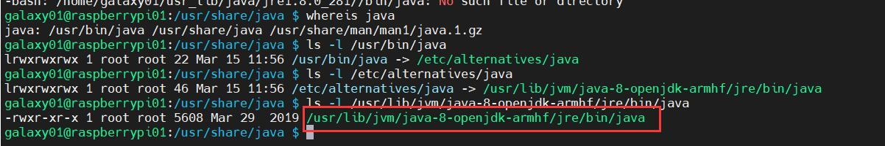
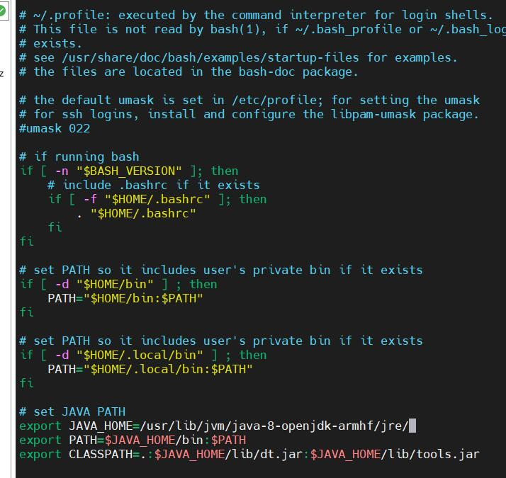
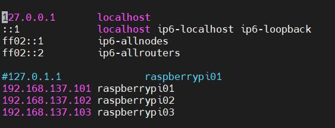
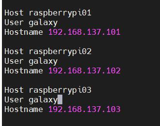
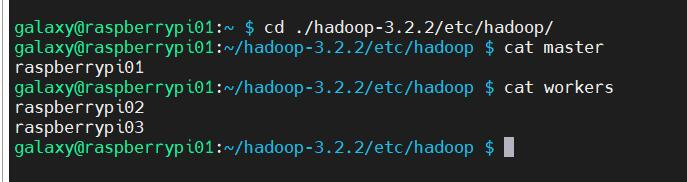
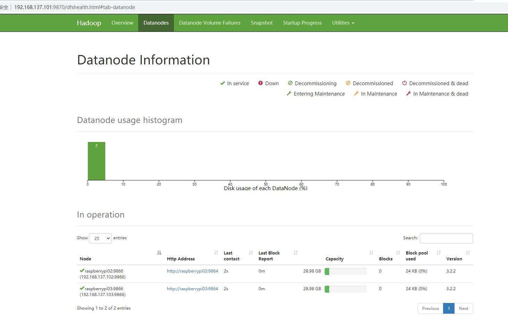

更新时间：2021-03-29

# 0 Raspberry Pi环境概述

型号：树莓派4B 32G

操作系统：Raspbian

IP配置：192.168.137.101; 192.168.137.102; 192.1668.137.103

账户@hostname：galaxy@raspberry01; galaxy@raspberry02; galaxy@raspberry03

# 1 JAVA 8安装

使用sudo apt-get install openjdk-8-jdk在root下安装java 8

使用ls -l寻找java安装地址



在~/.profile下配置java路径，这样java路径将仅用于当前用户，有助于各用户的环境隔离



输入指令：source ~/.profile使配置生效

输入指令：java -version查看java是否正常被安装

# 2 安装Hadoop 3.2.2

参考资料：

1. [Hadoop官方文档](https://hadoop.apache.org/docs/stable/)
2. [Build Raspberry Pi Hadoop/Spark Cluster from scratch](https://medium.com/analytics-vidhya/build-raspberry-pi-hadoop-spark-cluster-from-scratch-c2fa056138e0)

## 2.1 Single Node

### 2.1.1 Hadoop 3.2.2安装

下载Hadoop3.2.2版本并解压

检查ssh和pdsh是否安装

```bash
sudo apt-get install ssh
sudo apt-get install pdsh
```

随后检查pdsh是否默认为ssh，即检查/etc/pdsh下的rcmd_default中是否为ssh，若没有该文件，则创建，并输入ssh，一定要在结尾回车换行。

配置hadoop所需的java路径，配置文件位于etc/hadoop/hadoop-env.sh

```
export JAVA_HOME=/usr/lib/jvm/java-8-openjdk-armhf/jre/
```

配置hadoop环境变量

```bash
nano ~/.profile
# set HADOOP_PATH
export HADOOP_HOME=/home/galaxy/hadoop-3.2.2/
export PATH=$PATH:$HADOOP_HOME/bin:$HADOOP_HOME/sbin
# set JAVA_LIB_PATH
export HADOOP_COMMON_LIB_NATIVE_DIR=$HADOOP_HOME/lib/native
export JAVA_LIBRAY_PATH=$HADOOP_HOME/lib/native
```

source ~/.profile使文件生效

这里是将java运行所需lib指定为HADOOP中自带的，但是HADOOP中的java运行环境为64位，所以如果树莓派的操作系统为32位（笔者就是32系统），是解析不了64位的java lib的，系统会自动切换会本机下载的java库，运行hadoop程序时会报warning即是此原因。但并不影响程序的运行。

### 2.1.2 配置ssh

由于hadoop之间是使用ssh连接，故需要将ssh配置成无密码的，注意此时的用户位galaxy0x，一定要配置hadoop运行用户下的.ssh文件

首先要配置hostname与ip的映射关系，注意此时树莓派应先配置为静态ip和不同主机名

打开/etc/hosts，配置如下



即把主机名（hostname）与ip进行绑定

检查/etc/hostname是否已经修改为raspberrypi0x，x为1/2/3

如果您和我一样，是首次使用树莓派，那么用户根目录~/下是没有.ssh文件的，此时只需要输入

```bash
ssh localhost
```

使用ssh连接本机，系统会自动创建.ssh文件

随后编辑~/.ssh/config如下



这样我们就成功将各主机的名字告诉ssh模块，输入

```bash
ssh raspberrypi01
```

如果命令可以被解析，说明配置成功，但此时ssh还是需要密码的，故我们需要继续配置无密码ssh。无密码ssh的原理为，手动配置好ssh连接所需的密钥对，输入指令：

```bash
ssh-keygen -t ed25519
```

这会在~/.ssh/下生成一个id_ed25519文件和id_ed25519.pub文件，这即私钥与公钥。注意，在这里的密钥对需要对其他设备保密（除了集群内其他树莓派），如果泄露给其他计算机，那么自身树莓派将可被其入侵。随后，将pub密钥拷贝到其他的树莓派中，当然，本身也要拷贝一份（为了无密码ssh本机）。

对于raspberry02 raspberry03，输入：

```bash
cat ~/.ssh/id_ed25519.pub | ssh galaxy03@192.168.137.103 'cat >> .ssh/authorized_keys'
```

同理更改命令再来两轮

随后再把自身pubkey拷贝进authorized_keys

```bash
cat .ssh/id_ed25519.pub >> .ssh/authorized_keys
```

此后再尝试是否可以无密码ssh连接

### 2.1.3 配置几个有用的function（可选）

### 2.1.4 配置Hadoop

#### 2.1.4.1 初始化配置

Hadoop背后的数据库为HDFS，故我们需要先配置好HDFS存储文件的位置；并且如FATE系统一样，用户是通过http协议与整个系统进行交互，故还需要配置网站的初始化配置文件。包含4个配置文件，包括

- **core-site.xml, hdfs-site.xml, mapred-site.xml, and yarn-site.xml**

core-site.xml：

```xml
<configuration>
    <property>
        <name>fs.defaultFS</name>
        <value>hdfs://raspberrypi01:9000</value>
    </property>
</configuration>
```

hdfs-site.xml：

```xml
<configuration>
    <property>
        <name>dfs.datanode.data.dir</name>
        <value>/home/galaxy/hadoop-3.2.2/hadoop_tmp/hdfs/datanode</value>
    </property>
    <property>
        <name>dfs.namenode.name.dir</name>
        <value>/home/galaxy/hadoop-3.2.2/hadoop_tmp/hdfs/namenode</value>
    </property>
    <property>
        <name>dfs.replication</name>
        <value>1</value>
    </property>
</configuration>
```

这里我们指定hdfs的存储空间，并使备份使能，而后我们需要创建自己指明的路径

```bash
mkdir -p /home/galaxy/hadoop-3.2.2/hadoop_tmp/hdfs/datanode
mkdir -p /home/galaxy/hadoop-3.2.2/hadoop_tmp/hdfs/namenode
```

mapred-site.xml

```xml
<configuration>
    <property>
        <name>mapreduce.framework.name</name>
        <value>yarn</value>
    </property>
    <property>
        <name>mapreduce.application.classpath</name>
        <value>$HADOOP_MAPRED_HOME/share/hadoop/mapreduce/*:$HADOOP_MAPRED_HOME/share/hadoop/mapreduce/lib/*</value>
    </property>
</configuration>
```

yarn-site.xml

```xml
<configuration>
    <property>
        <name>yarn.nodemanager.aux-services</name>
        <value>mapreduce_shuffle</value>
    </property>
    <property>
        <name>yarn.nodemanager.env-whitelist</name>
        <value>JAVA_HOME,HADOOP_COMMON_HOME,HADOOP_HDFS_HOME,HADOOP_CONF_DIR,CLASSPATH_PREPEND_DISTCACHE,HADOOP_YARN_HOME,HADOOP_MAPRED_HOME</value>
    </property>
</configuration>
```

#### 2.1.4.2 hdfs初始化

cd到hadoop根目录，而后输入

```bash
bin/hdfs namenode -format
sbin/start-dfs.sh
```

查看是否有报错，启动完后输入jps，查看NameNode，DataNode，SecondaryNameNode是否已经存在于java进程中，若存在，则代表启动成功

而后您可以按官方文档中，尝试运行一个mapreduce任务

运行结束后，记得使用sbin/stop-dfs.sh关闭

#### 2.1.4.3 启动YARN

在完成2.2.2后，输入：

```bash
sbin/start-yarn.sh
```

同样使用jps命令，查看NodeManager和ResourceManager是否启动成功

测试结束后，输入sbin/stop-yarn.sh关闭

## 2.2 Cluster配置

### 2.2.1 xml文件配置

修改core-site.xml，全部改为raspberrypi01

修改mapreduce-site.xml如下：

```xml
<configuration>
  <property>
    <name>mapreduce.framework.name</name>
    <value>yarn</value>
  </property>
  <property>
    <name>yarn.app.mapreduce.am.resource.mb</name>
    <value>256</value>
  </property>
  <property>
    <name>mapreduce.map.memory.mb</name>
    <value>128</value>
  </property>
  <property>
    <name>mapreduce.reduce.memory.mb</name>
    <value>128</value>
  </property>
</configuration>
```

修改yarn-site.xml如下：

```xml
<configuration>
  <property>
    <name>yarn.acl.enable</name>
    <value>0</value>
  </property>
  <property>
    <name>yarn.resourcemanager.hostname</name>
    <value>raspberrypi01</value>
  </property>
  <property>
    <name>yarn.nodemanager.aux-services</name>
    <value>mapreduce_shuffle</value>
  </property>
  <property>
    <name>yarn.nodemanager.auxservices.mapreduce.shuffle.class</name>
    <value>org.apache.hadoop.mapred.ShuffleHandler</value>
  </property>
  <property>
    <name>yarn.nodemanager.resource.memory-mb</name>
    <value>900</value>
  </property>
  <property>
    <name>yarn.scheduler.maximum-allocation-mb</name>
    <value>900</value>
  </property>
  <property>
    <name>yarn.scheduler.minimum-allocation-mb</name>
    <value>64</value>
  </property>
  <property>
    <name>yarn.nodemanager.vmem-check-enabled</name>
    <value>false</value>
  </property>
</configuration>

```

### 2.2.2 初始化并启动hadoop

将所有节点的hadoop_tmp/hdfs/datanode和hadoop_tmp/hdfs/namenode下的文件删除

```bash
clustercmd rm -rf ./hadoop-3.2.2/hadoop_tmp/hdfs/datanode/*
clustercmd rm -rf ./hadoop-3.2.2/hadoop_tmp/hdfs/namenode/*
```

我们还需要告知raspberrypi01，谁是master节点，谁是worker节点，在***$HADOOP_HOME/etc/hadoop/\***上创建master文件，写入raspberrypi01，创建workers文件，写入raspberrypi02，raspberrypi03

使用cat命令输入结果如下即是正确的：



检查/etc/hosts，查看主机名和ip映射关系是否一致

为保证所有配置均已生效，将cluster所有节点reboot

重启后，在raspberrypi01上初始化hdfs如下

```bash
hdfs namenode -format -force
```

最后开启dfs和yarn

```bash
start-dfs.sh && start-yarn.sh
```

打开网址http://192.168.137.101:9870/是否正常开启了所有datanodes



结束。

# 3 后续使用报错+修复
# 3.1 YARN + MapReduce
1. 在mapred-site.xml添加环境变量
```xml
  <property>
    <name>yarn.app.mapreduce.am.env</name>
    <value>HADOOP_MAPRED_HOME=${HADOOP_HOME}</value>
  </property>
  <property>
    <name>mapreduce.map.env</name>
    <value>HADOOP_MAPRED_HOME=${HADOOP_HOME}</value>
  </property>
  <property>
    <name>mapreduce.reduce.env</name>
    <value>HADOOP_MAPRED_HOME=${HADOOP_HOME}</value>
  </property>
```
2. Error: Java heap space
在mapred-site.xml中添加
```xml
<property> 
  <name>mapred.child.java.opts</name> 
  <value>-Xmx1024m</value> 
</property> 
```
在etc/hadoop/hadoop-env.sh中
```shell
export HADOOP_HEAPSIZE_MAX=1024
```

3. xxx/output already exist
运行mapreduce之前，都要手动将mapreduce的输出文件目录删除