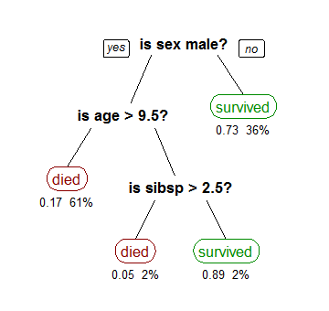

更新时间：2021-03-18

回顾下之前的线性模型，在线性模型中，我们对每个特征附上权重，与输入相乘相加后的到一个新的值，我们使用这个值来对输入进行划分。而在树模型中，我们需要对特征一个一个处理。决策树与逻辑回归的分类区别也如此，逻辑回归是将所有特征变化为概率，大于某一阈值的划分一类；决策树是对每个特征做一个划分。
# 1 决策树算法
参考资料：
1. [Decision Trees in Machine Learning](https://towardsdatascience.com/decision-trees-in-machine-learning-641b9c4e8052)
## 1.1 从一个例子出发
假设我们想得到一个模型，用于预测在一场事故中，什么样的乘客可以生还。数据使用3个特征来表示：性别、年龄和配偶+孩子的数量。
我们最终得到如下的一个树结构：

其中，黑色粗体为节点，代表一种情况，最上方的节点为根节点；每个节点将树分为不同的分支（branches），当节点不再可分时，即在branch的末尾，为叶子，图中以红色和绿色表示。

从这么一个决策树来看，乘客是否能生还是非常清晰可见的，并且特征间的关系也清晰可见。那么如何从数据得出这么一个模型呢？一种方法为Classification Tree，其目标为将乘客分类成survived和died两种；另一种为Regression Tree，表示方法与CT相同，只是RT是用来预测连续值得，比如房价。

构建决策树，我们需要知道每个节点该使用哪个特征，需要知道节点splitting时的条件，需要知道何时结束（得到叶子节点）。在算法中通常树是在随机生长的，故我们还需要知道如何修整它。

## 1.2 Recursive Binary Splitting
最开始我们仅含一个根节点，并且所有的feature还没有分割开。我们有3个features，所以我们有3种可能使用的splits。一个最简单的方式为，计算每种方式的cost函数，选择最小的情况最为分割方式。在本例种我们选择sex作为根节点，随后的分割方法同样可以以这种方式进行。这种方法也被称为贪心算法。

## 1.3 Cost of a split
本节我们要获取每次split决策种的评估函数 - cost function
