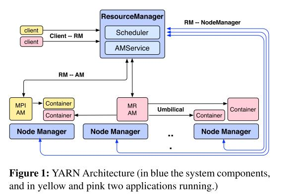

更新时间：2021/03/19

参考资料：论文 - Apache Hadoop YARN: Yet Another Resource Negotiator

# 1 Introduction

早期Hadoop的主要问题：

- 编程人员几乎只能使用MapReduce框架，这导致开发者对MapReduce进行滥用，比如仅使用Map函数以达到期望的功能
- Hadoop集中处理jobs' control flow，这导致在扩展规模时出现问题

为解决上述问题，设计了YARN系统，其主要特点如下：

- 将resource management功能与编程模型分离
- 支持多种编程框架
- 引入intra-application, execution flow和dynamic optimizations

# 2 History and rationale

本节描述为什么需要YARN

Requirement1：扩展性。Yahoo! 的工作集群包含800台设备，用于处理WebMap应用，而该应用的规模愈发庞大，这要求Yahoo! 使用更大的集群来处理这些数据。故YARN需要有高的可扩展性。

Requirement2：多租户（Multi-tenancy）。该工作集群不仅能够支持MapReduce业务，还应支持例如spam filtering. content optimization等其他业务

Requirement3：Serviceability。多租户的另一类要求，工作集群需要支持动态给不同租户分配一定数量的空闲机器，即要求运行在集群上的系统需要维护一个共享池（shared pool）。这一方面，Yahoo! 的HoD（Hadoop on Demand）系统实现的非常好。

Requirement4：Locality awareness。在HoD系统中，Torque在分配节点时是不考虑节点的位置的，然而运行map任务的节点，理想状态是和输入数据十分接近的。当未考虑节点位置便直接分配，是不利于MapReduce高效运行的。

Requirement5：High Cluster Utilization。HoD中，工作集群的大小并不会随着任务规模的变化而变化，这导致集群中可能出现大量的休眠机器。例如，假设HoD为一个用户预分配了10台机器，以运行一串任务，其中1项任务仅为1个reduce任务，故只需要1台机器，于是剩下9台机器休眠，最后使得利用率降低。静态分配机器是一种较为低效的资源分配模式，因此Yahoo! 开始逐渐使用shared clusters以解决上述问题。

Requirement6：可靠性。

Requirement7：安全。

Requirement8：支持多种Programming Model。MapReduce并不是所有任务的理想编程模型。比如机器学习任务，如果将对datasets的操作视为一次MapReduce，而后多次迭代以完成整个Machine Learning任务，那么整个的完成时间会大大增加；对于一些图算法也是如此，图问题最好使用BSP模型来解决，而不是用繁重的，all-to-all通信的大规模MapReduce任务。这种对MapReduce的不正当使用使得集群利用率大大降低，故YARN需要支持更多的编程模型。

Requirement9：Flexible Resource Model。MapReduce中包含Map阶段和Reduce阶段，对于每一个上交的任务，用户需要调整这两个阶段间的overlap。

Requirement10：向后兼容。

# 3 Architecture

## 3.1 Overview

Hadoop YARN架构由两种节点组成：RM（Resource manager）和NM（Node manager）。RM负责为相互竞争的应用提供资源，具有认证和仲裁功能，根据不用application的需求，RM为其安排优先级和硬件资源。当RM为某个应用分配资源后，它会向该应用发布一个lease（称为container），container是资源的逻辑表达（e.g. <2GB RAM, 1 CPU>），并与某个特定的节点绑定。与RM互动的实体为NM，通信方式为heartbeat，NM负责监视节点资源状态，报错以及管理container生命周期。

RM包含两个组件：scheduler和application manager，其中scheduler单纯的为各个引用分配资源（container），application manager负责接受Jobs的请求，以及监控application master。

一个完整的流程：所有的Jobs被提交给RM，而后进入admission control阶段，这一阶段将完成安全认证工作。接着RM将为Jobs分配资源，一旦scheduler有足够多的资源，Jobs的状态将转变为running。详细来说，RM中的scheduler将为每个应用分配container（实际还是与NM通信），而后container中开始运行此应用。

ApplicationMaster（简称AM）负责管理该应用的所有lifecycle，包括动态增加或减少资源消耗，流管理（e.g. 在maps函数输出后运行reducers），处理错误，本地优化等，运行在container中。

通常，AM需要利用多个节点上的资源（cpus, RAM, disks等）完成一份job。AM向RM发布resource requests，这包括对container的地理位置偏好和性质需求，RM根据requests和资源管理策略，尽可能安排负荷requests的资源至各个应用。当一个resource被分配给一个AM时，RM会生成一个lease，并提交给AM。当AM接受到container，应用开始运行。

现在我们重新理一遍Hadoop YARN的框架。在YARN中，有两类节点：master和workers，其中master另一个身份为resource manager，用于处理用户的job提交请求和为不同的jobs提供资源；workers另一个身份为node manager，用于和resource manager建立对等实体，建立通信。

用户编写的job实际上是一个app，包括具体要执行的任务，以及一个Application Manager。AM是这个job的管理者，它可以看作一个job的主程序，用于处理job内部的执行过程，管理job运行在哪个资源上，处理job运行中发生的错误等等。RM为不同的job分配资源，用container表示，AM利用自己被分配的container，可能是一个也可能是多个，containers可能都在一个worker节点上也可能在多个workers上。当然，Hadoop YARN提供了一些AM和job模板，比如MapReduce job，也更推荐用户使用这些模板；而用户也完全可以自己编写AM，这样Hadoop YARN便可以支持所有的分布式业务。

这就将一个cluster在逻辑上分成了不同的cluster，逻辑上的cluster由container组成，由AM管理。显然，不同的app在逻辑上分开了，每个app在其containers分布式的运行，各个app之间互不干扰。RM动态的调整各个逻辑cluster的规模，以提高整体的效率。
## 3.2 Resource Manager (RM)
从上文可以看到，RM节点要完成两类任务，一是处理用户的job请求，并为各个AM分配containers，二是与NM交互，维护NM状态。显然这是分为向外的（对用户）以及向内的（对AM），所以RM的接口如下：

- public interfaces：
    - 用户提交任务接口
    - 与AM交互的接口
- internal interface：
    - 监控NM状态，包括NM上的资源使用情况等
### 3.2.1 AM Interface
RM的目标：能够匹配正在运行的application的资源需求。
实现方式：不同的scheduler优化不同的全局指标（比如容量和公平性）
第一个问题：如何正确的获取application的资源需求，并且该过程应该是通信高效且compact的。需求准确性和高效紧凑实际上是相互矛盾的。
YARN的解决办法：只处理每个app的概述性资源分配，而不关心app的本地优化和内部flow优化。

AM通过ResourceRequests来向RM发布资源需求，包括：
1. containers的数量
2. 每个container的资源数（比如多少个RAM，多少个CPU）
3. 地理位置偏好
4. 优先级
### 3.2.2 RM responsibilities
RM通过NM的heartbeats获知哪些资源是空闲的，并将空闲资源分配给AM。当有新的NM加入cluster时，AM也会被通知，进而允许AM发出新的resource request。也允许RM收回某些container进行重分配。

最后需要明确RM到底负责什么，不负责什么。RM不负责协调app的执行也不负责fault-tolerance；同时，RM不负责提供app的状态和量（该部分由AM负责），或者提供特定任务的实现框架。
RM仅仅需要处理live resource scheduling和帮助YARN的核心组件。

## 3.3 Application Master (AM)
AM主要负责调控整个app，它可能是一堆process的集合，可能是work的逻辑描述，也可能是一个长期运行的service。笔者自己的理解是，AM就像app的主程序。
AM周期向RM通报自身还在存活，并更新它的requirement；与之相对，RM将回复container lease。基于收到的containers，AM可能会更新他的execution plan。所以AM的资源调度是late binding的，即它并不是根据自身需求来调整，而是根据收到的container来调整。这样的优化方式不一定是最优的，但更能适应不同的算法框架。

使用MapReduce作为一个例子。MapReduce AM希望对map tasks进行地理位置上的优化（让输入数据更靠近运行map task的主机）。Map任务的数据源存在于k个machines上，当AM收到一个container时，它选择运行数据源离container最近的map task，比如我们称为mi任务
。而后mi任务的数据输入变得不合时宜了（比如近的数据源处理完了，该处理远一些的数据源了），那么AM会向RM更新自身的需求，以降低其他k-1个hosts上的权重（笔者理解的是，mi是处理k号host的数据的，但是mi的效率突然变低，那么为了公平，AM想减少其他hosts上的权重，来提高mi的效率）。这种hosts之间的调整对于RM来说是不可见的，RM仅能看见AM提出的request。同理，如果mi宕机，AM也需要处理该错误，完成fault tolerance。

ps：感觉用人话来说，就是RM将cluster分成好多个逻辑cluster（逻辑cluster由很多containers组成），AM就是逻辑cluster的主宰。用户还是在写一个分布式程序，YARN就只是帮你分配运行的空间。但优势就是，RM可以完成粗颗粒度的资源优化（每个app用多少containers运行），AM由用户自己编写，实现细颗粒度的优化(比如针对多个map任务进行优化，针对数据流进行优化等等)。

## 3.4 Node Manager(NM)
NM负责运行各个containers，是真正的worker。所有的container都使用CLC(container launch context)来描述，比如环境变量，数据存储位置，payloads等等。NM可以根据CLC搭建container运行所需的环境，将container所需的数据拷贝到本地storage，最后将container放到这个环境下运行。