<head>

<!--支持网页公式显示-->    

</head>

<body>

  <h4>⚠ 转载请注明出处：<i>Maintainer: MinelHuang，更新日期：Aug.04 2021</i></h4>
  

  
  
  

   
  

      
  

  

  &nbsp;&nbsp;&nbsp;&nbsp;本作品由 <b>MinelHuang</b> 采用 <a rel="license" href="http://creativecommons.org/licenses/by-nc-nd/4.0/">知识共享署名-非商业性使用-禁止演绎 4.0 国际许可协议</a> 进行许可，在进行使用或分享前请查看权限要求。若发现侵权行为，会采取法律手段维护作者正当合法权益，谢谢配合。
  

 

  

    <h2> 目录 </h2>
    

  

  

    

    &nbsp;&nbsp;&nbsp;&nbsp;Section 1. <a href="#section1"><b>从Cloud Computing开始</b></a>：简单介绍大数据相关基本概念和研究目标
    

    &nbsp;&nbsp;&nbsp;&nbsp;Section 2. <a href="#section2"><b>Spark计算框架</b></a>：用户态介绍Spark框架
    

    &nbsp;&nbsp;&nbsp;&nbsp;Section 3. <a href="#section3"><b>Resilient Distributed Datasets (RDD)</b></a>：Spark核心RDDs介绍
    

    &nbsp;&nbsp;&nbsp;&nbsp;Section 4. <a href="#section4"><b>Spark SQL</b></a>：Spark扩展，Spark SQL介绍
    

    &nbsp;&nbsp;&nbsp;&nbsp;Section 5. <a href="#section5"><b>Apache Spark</b></a>：介绍Spark是如何处理海量异构任务的
    

    &nbsp;&nbsp;&nbsp;&nbsp;Section 6. <a href="#section5=6"><b>总结</b></a>：对Spark的Insights进行总结
  

<h2><a name="section1">1. 从Cloud Computing开始</a></h2>

  

  &nbsp;&nbsp;&nbsp;&nbsp;参考文献：A view of cloud computing. 作者：Armbrust Michael et al. 文献来源：Communications of the ACM. 年份：2010  
  &nbsp;&nbsp;&nbsp;&nbsp;此文章中需要弄懂两个核心问题：1. 云计算到底和传统计算有何区别？ 2. 云计算中有哪些挑战？ 
  <h3>1.1 云计算的定义</h3>
  

  &nbsp;&nbsp;&nbsp;&nbsp;Cloud: 指数据中心中的硬件+软件 
  &nbsp;&nbsp;&nbsp;&nbsp;Cloud Computing: SaaS和utility computing的集合，但不包括小型/中型的数据中心 
  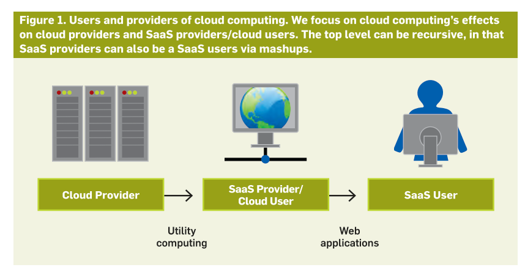 
  

  &nbsp;&nbsp;&nbsp;&nbsp;与传统的SaaS PaaS IaaS分层不同的是，该文章将Cloud分为Cloud Provider、SaaS Provider和SaaS User三类群体，其服务分为Utility computing，负责向SaaS Provider提供computing resources and infrastructure management，和Web applications 
  &nbsp;&nbsp;&nbsp;&nbsp;Cloud可以理解为高度扩展后的计算机集群，其必须是可以从高扩展中受益的，如下：
  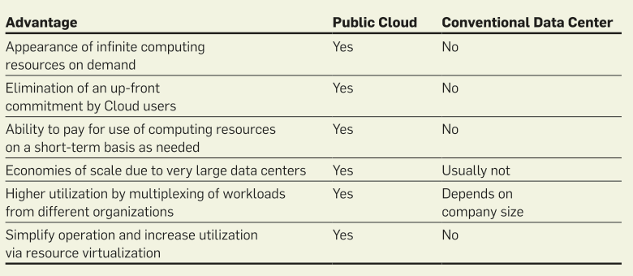 

  <h4>总结</h4>
  

  &nbsp;&nbsp;&nbsp;&nbsp;Cloud Computing的场景为: 
  &nbsp;&nbsp;&nbsp;&nbsp;1. 大型数据中心 
  &nbsp;&nbsp;&nbsp;&nbsp;2. 具备高扩展带来的advantage

  <h3>1.2 Cloud Computing中的挑战</h3>
  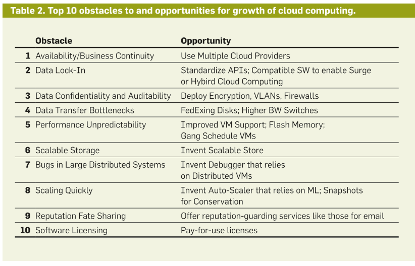 

<h2><a name="section2">2. Spark计算框架</a></h2>

  

  &nbsp;&nbsp;&nbsp;&nbsp;参考文献：Spark: Cluster Computing with Working Sets. 作者：Matei Zaharia et al. 文献来源：HotCloud. 年份：2010
  <h3>2.1 场景和Problem</h3>
  

  &nbsp;&nbsp;&nbsp;&nbsp;场景： 
  &nbsp;&nbsp;&nbsp;&nbsp;在多并行操作中，数据被重复调用（reuse a working set of data）。具体例如Machine Learning中的迭代操作，SQL中的交互式分析操作（Interactive analytics）。 
  

  &nbsp;&nbsp;&nbsp;&nbsp;Problem: 
  &nbsp;&nbsp;&nbsp;&nbsp;在Hadoop/MapReduce等系统中，对于数据的操作顺序为先向数据库读取，拷贝数据到本地，再进行运算。然而在重复运用数据的场景下显然查询一次，拷贝一次即可。如果第一次拷贝后一直存放在内存中，显然会占用大量的运行内存，故该问题可以转变为： 
  &nbsp;&nbsp;&nbsp;&nbsp;● 数据该使用何种格式存储于内存中，使得计算机可以重复对其进行运算 
  &nbsp;&nbsp;&nbsp;&nbsp;● 上述数据格式如何适配并行化运算 
  &nbsp;&nbsp;&nbsp;&nbsp;● 上述数据格式如何容错

  <h3>2.2 Solution</h3>
  

  &nbsp;&nbsp;&nbsp;&nbsp;在Spark中，开发者编写的程序称为driver program，一种对应用的high-level控制流并启动并行操作。对于并行变成，Spark提供了两类abstractions：RDD和parallel operations。此外Spark提供了两种受限的共享变量，这些变量可以在函数中使用。 
  

  &nbsp;&nbsp;&nbsp;&nbsp;核心：对数据的操作是lazy and ephemeral，即中间过程通过log记录，仅在最后一步一并执行。 

  <h4>2.2.1 Resilient Distributed Dataset (RDD)</h4>
  

  &nbsp;&nbsp;&nbsp;&nbsp;数据使用RDD格式存储在内存中，该数据结构的特性包含a. 易于并行操作 b. 有容错机制。弹性分布式数据集 (RDD) 是跨一组机器分区的对象的只读集合，如果分区丢失，可以重建这些对象。RDD中的元素并不存在于实际的物理存储中，它记录的是一组对RDD的计算操作。
  

  &nbsp;&nbsp;&nbsp;&nbsp;RDD可以由以下几种方式被创建： 
  &nbsp;&nbsp;&nbsp;&nbsp;● 由HDFS中的file 
  &nbsp;&nbsp;&nbsp;&nbsp;● 对一个Scala collection的parallelizing操作，例如将其分割成几部分并发送至复数个节点 
  &nbsp;&nbsp;&nbsp;&nbsp;● 对一个已存在的RDD的transforming操作，该操作被命名为flatMap，此操作会将RDD中的type A类型的数据，通过用户上传的function转换未type B类型。具体来说，map会将所有的元素pass through a function，filter会筛选出符合条件的元素。而后，将转换为新的RDD 
  &nbsp;&nbsp;&nbsp;&nbsp;● 通过改变现有 RDD 的持续性。默认情况下，RDD是懒且短暂的（lazy and ephemeral），故数据集的各个分区仅在并行化操作（如对一块file执行map function）时具现化，并在使用结束后被移除。故用户如果想在使用完RDD后且不想移除（为了后续的重复使用）可以使用以下两个操作： 
  &nbsp;&nbsp;&nbsp;&nbsp;&nbsp;&nbsp;&nbsp;&nbsp;○ cache：保持RDD的lazy性质，但示意其需要在memory中继续存在 
  &nbsp;&nbsp;&nbsp;&nbsp;&nbsp;&nbsp;&nbsp;&nbsp;○ save：对dataset进行运算并存储于文件系统如HDFS中。
  

  &nbsp;&nbsp;&nbsp;&nbsp;上述为RDD的用户态用法，其具体实现方法将在Section 3中给出。

  <h4>2.2.2 Parallel Operation</h4>
  

  &nbsp;&nbsp;&nbsp;&nbsp;可以在RDD中运行的并行操作包括： 
  &nbsp;&nbsp;&nbsp;&nbsp;● reduce：结合dataset中的元素，生成driver program的最终结果 
  &nbsp;&nbsp;&nbsp;&nbsp;● collect：将dataset中的所有元素发送至driver program 
  &nbsp;&nbsp;&nbsp;&nbsp;● foreach：将每个元素pass through a function

  <h4>2.2.3 Shared Variables</h4>
  

  &nbsp;&nbsp;&nbsp;&nbsp;Spark允许两类shared variables： 
  &nbsp;&nbsp;&nbsp;&nbsp;● Broadcast variables：每个work nodes都存储 
  &nbsp;&nbsp;&nbsp;&nbsp;● Accumulators：仅driver可读取，workers仅可以对其记录add操作，但实际没有读取

  <h3>2.3 Implementation</h3>
  

  &nbsp;&nbsp;&nbsp;&nbsp;设我们希望Spark完成一个text search任务，如下图： 
  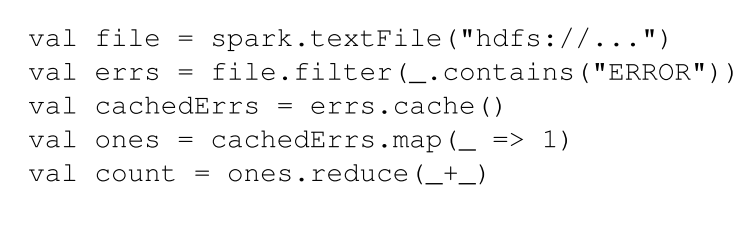 
  

  &nbsp;&nbsp;&nbsp;&nbsp;上图包含如下几步： 
  &nbsp;&nbsp;&nbsp;&nbsp;● 从HDFS中读取文件，生成RDD 
  &nbsp;&nbsp;&nbsp;&nbsp;● 对RDD进行一个filter操作，筛选包含”ERROR“的行    （lazy） 
  &nbsp;&nbsp;&nbsp;&nbsp;● 保存cacheErrs 
  &nbsp;&nbsp;&nbsp;&nbsp;● map each line to a 1    （lazy） 
  &nbsp;&nbsp;&nbsp;&nbsp;● 使用reduce将所有的1相加 
  &nbsp;&nbsp;&nbsp;&nbsp;lazy的步骤仅建立了RDD间的依赖关系（血统）和操作，每个RDD都存在一个指针指向其parent，如下图：
  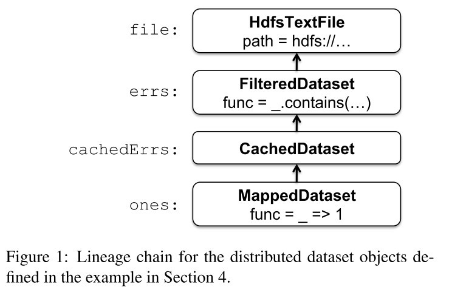
  

  &nbsp;&nbsp;&nbsp;&nbsp;当一个parallel operation被启用（reduce）后，Spark将创建一个task来处理每个数据的partition，并发送这些task到工作节点上，这种技术称为delay scheduling。

<h2><a name="section3">3. Resilient Distributed Datasets (RDD)</a></h2>

  

  &nbsp;&nbsp;&nbsp;&nbsp;参考文献：Resilient Distributed Datasets: A Fault-Tolerant Abstraction for In-Memory Cluster Computing. 作者：Matei Zaharia et al. 文献来源：NSDI. 年份：2012

  <h3>3.1 场景和Problem</h3>
  

  &nbsp;&nbsp;&nbsp;&nbsp;场景同Section 2.1：reuse intermediate results across multiple computations 
  &nbsp;&nbsp;&nbsp;&nbsp;Problem：Hadoop等中reuse操作是依赖分布式文件系统的，或者设计一个特殊的计算框架如Pregel。RDD希望解决的是fault tolerance efficiently的方法，并易于支持并行操作。
  
  <h3>3.2 Resilient Distributed Datasets (RDDs)</h3>
  

  &nbsp;&nbsp;&nbsp;&nbsp;RDD概述和用法请参考Section 2.2.1。 
  &nbsp;&nbsp;&nbsp;&nbsp;此文章中将RDD的用法做了扩展如下图：
  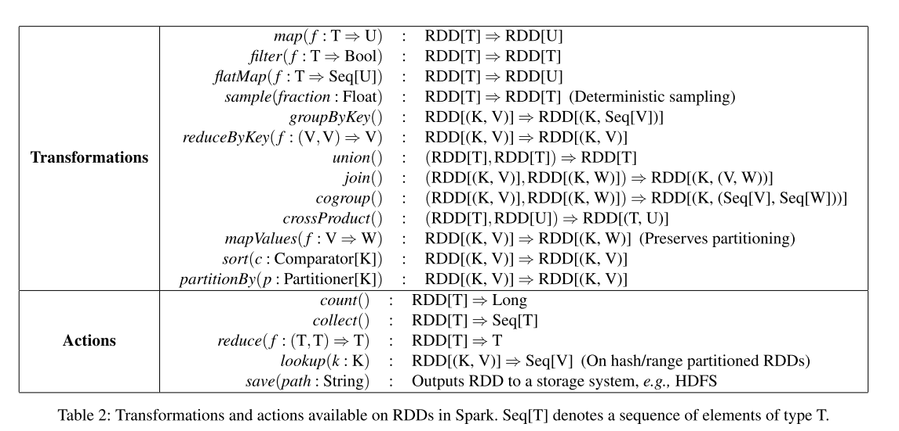 
  

  &nbsp;&nbsp;&nbsp;&nbsp;其中，Transformations是lazy的，Actions将真正的将结果输出至driver中。在Spark框架下，用户是对driver进行变成，driver和workers的关系如下图：
  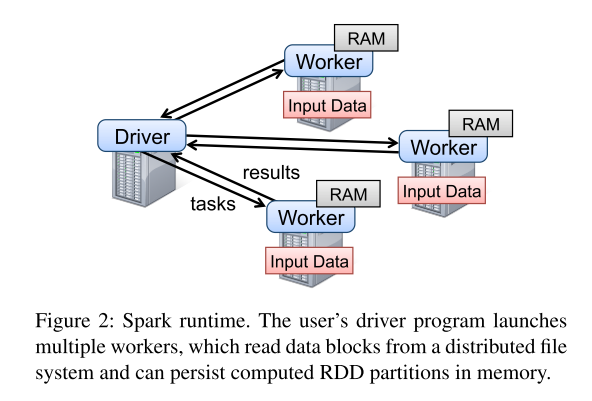 
  

  &nbsp;&nbsp;&nbsp;&nbsp;本节不对RDD的用法加以赘述，而是将重点放在RDD是如何实现的。

  <h3>3.3 Representing RDDs</h3>
  

  &nbsp;&nbsp;&nbsp;&nbsp;核心问题：该如何设计RDD，使得上述transformation operators可以被实现？
  

  &nbsp;&nbsp;&nbsp;&nbsp;RDDs采用graph-based表示形式，每个RDD都包含以下几点信息： 
  &nbsp;&nbsp;&nbsp;&nbsp;● dataset的原子级pieces，a set of partitions 
  &nbsp;&nbsp;&nbsp;&nbsp;● 每个partition与parent RDDs间的依赖关系 
  &nbsp;&nbsp;&nbsp;&nbsp;● 对parents RDDs计算所用的function 
  &nbsp;&nbsp;&nbsp;&nbsp;● metadata的partitioning方案 
  &nbsp;&nbsp;&nbsp;&nbsp;● 数据位置 
  &nbsp;&nbsp;&nbsp;&nbsp;之后将每个RDD抽象成一个点，依赖关系抽象成边，故所有RDDs可以使用Graph来表示，如下图： 
  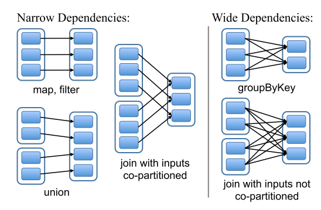 
  

  &nbsp;&nbsp;&nbsp;&nbsp;其中，定义了两类dependencies： 
  &nbsp;&nbsp;&nbsp;&nbsp;● narrow dependencies：parent RDD中的partitions和子RDD中的partitions是一一对应的 
  &nbsp;&nbsp;&nbsp;&nbsp;● wide dependencies：不是一一对应的 
  

  &nbsp;&nbsp;&nbsp;&nbsp;对于narrow dependencies，workers在计算时完全可以直接对本地数据进行运算，是易于并行化的；而计算wide dependencies时，可以看到一份partition的实际数据要被多次，不同的child partitions使用，这意味着需要引入一个shuffled阶段，来使所有的workers获取到数据。 
  &nbsp;&nbsp;&nbsp;&nbsp;对于fault tolerance来说，narrow dependencies是很好恢复的，当某个partition丢失，根据child partition便可以恢复；然而在wide dependencies中，某个节点崩溃后，致使一个partition丢失，其想要恢复必须所有与之关联的child partitions都存在才可以快速恢复。 

  <h3>3.4 Implementation</h4>
  

    &nbsp;&nbsp;&nbsp;&nbsp;在有了RDD的表现形式后，最后一块拼图便是lazy evaluation该如何真正的分配给workers执行，即： 
    &nbsp;&nbsp;&nbsp;&nbsp;● 如何将lazy evaluation拆分为并行的job，并分配给workers（scheduling问题）
    为了适配现有datacenter场景，Spark还引入了多种technologies，包括： 
    &nbsp;&nbsp;&nbsp;&nbsp;● 解释器设计（Interpreter Integration） 
    &nbsp;&nbsp;&nbsp;&nbsp;● 内存管理 
    &nbsp;&nbsp;&nbsp;&nbsp;● 支持Checkpointing 
    &nbsp;&nbsp;&nbsp;&nbsp;本文不对technologies做详细解释，您可以直接参考文献Section 5.2 to Section 5.4 
  
  <h4>3.4.1 Job Scheduling</h4>
  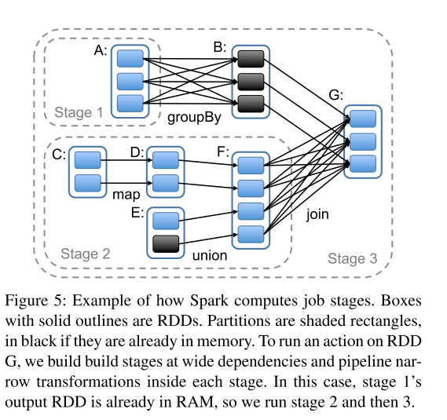 
  

  &nbsp;&nbsp;&nbsp;&nbsp;根据RDDs Graph，可以先将其转换为DAG，以wide dependencies为界，将各个RDD分为不同的stage。调度方法采用delay scheduling，即如果一个task所需的partition已经在某个节点的memory中可以被获取，则将该任务发送给此节点；否则，则根据RDD中的数据位置进行分配。

<h2><a name="section4">4. Spark SQL</a></h2>

  &nbsp;&nbsp;&nbsp;&nbsp;参考文献：Spark SQL: Relational Data Processing in Spark. 作者：Michael Armbrust. 文献来源：ACM SIGMOD. 年份：2015 
  &nbsp;&nbsp;&nbsp;&nbsp;Spark SQL是Apache Spark中的一个新模块，其集成了数据库中的关系处理和Spark API。

  <h3>4.1 背景和Problem</h3>
  

    &nbsp;&nbsp;&nbsp;&nbsp;大数据系统通常向用户提供数据的关系接口（relational interfaces），例如Pig, Hive, Dremel和Shark都采用了声明式问询（declarative query）接口。数据可以使用关系方式来表示（关系数据库），然而对于许多大数据应用，关系表示形式是不够的，其表现为： 
    &nbsp;&nbsp;&nbsp;&nbsp;● 用户期望对各种数据源进行ETL（Extract-Transform-Load） 
    &nbsp;&nbsp;&nbsp;&nbsp;● 用户希望对数据进行高级分析，如机器学习或图计算 
    二者都对relational system提出了挑战，这是因为现阶段relational queries和复杂的procedural algorithms依旧是分离的，例如需要先读取数据到本地，再进行运算。 
    

    &nbsp;&nbsp;&nbsp;&nbsp;故此文章着重解决，如何将model与SQL结合，形成Spark SQL，其包含以下两点贡献： 
    &nbsp;&nbsp;&nbsp;&nbsp;● 提供DataFrame API，使relational operations（插入、删除、修改等）可以运行在外部数据源和Spark内部分布式集合中。这种表达形式同样是lazy的。 
    &nbsp;&nbsp;&nbsp;&nbsp;● 引入外部优化器Catalyst，Catalyst 可以轻松为机器学习等领域添加数据源、优化规则和数据类型。

  <h4>总结</h4>
  

    &nbsp;&nbsp;&nbsp;&nbsp;思想：在上一节的基础上，除计算过程，再加入数据库操作过程 
    &nbsp;&nbsp;&nbsp;&nbsp;场景：在数据库中引入分布式复杂运算，如Machine Learning 
    

    &nbsp;&nbsp;&nbsp;&nbsp;Problem： 
    &nbsp;&nbsp;&nbsp;&nbsp;● 同时在Spark programs和外部数据源中支持关系运算 
    &nbsp;&nbsp;&nbsp;&nbsp;● 如何涉及DBMS（数据库管理系统） 
    &nbsp;&nbsp;&nbsp;&nbsp;● 如何支持新的数据源，例如半结构化数据和外部数据库 
    &nbsp;&nbsp;&nbsp;&nbsp;● 如何完成如ML，图计算等高级运算 

  <h3>4.2 用户接口（Programming Interface）</h3>
  

  &nbsp;&nbsp;&nbsp;&nbsp;Spark SQL与其他组件的关系如下： 
  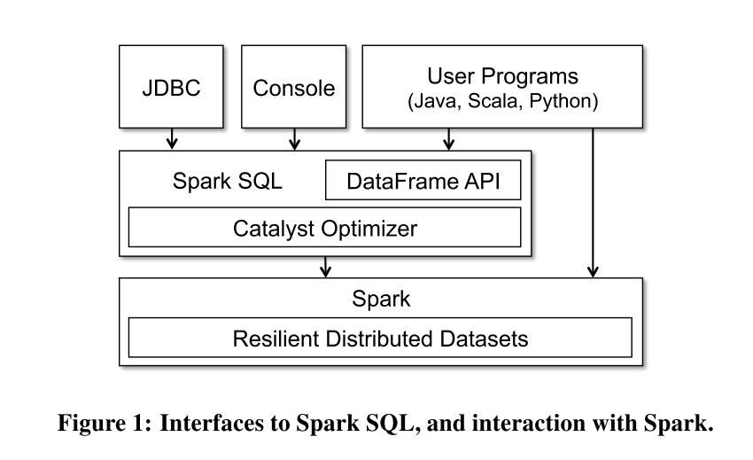 
  

  &nbsp;&nbsp;&nbsp;&nbsp;Spark SQL向外部暴露了SQL接口，用户可通过JDBC/ODBC等调用，同时提供了DataFrame API。

  <h4>4.2.1 DataFrame API</h4>
  

  &nbsp;&nbsp;&nbsp;&nbsp;DataFrame API是一种类似RDD的分布式集合，不过其中提供了大量关系操作。DataFrame可以由数据库中的table或RDD生成，注意，该数据帧是lazy的，每一个数据帧代表了对dataset的一个运算逻辑，只要不执行output operation，该运算逻辑不会被执行。 
  

  &nbsp;&nbsp;&nbsp;&nbsp;DataFrame支持所有常用的relational operators如select，filter，join和groupby，例如： 
  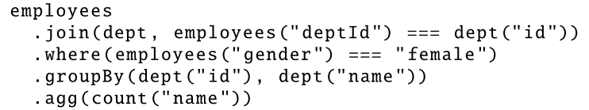 
  &nbsp;&nbsp;&nbsp;&nbsp;其中，employees为一个DataFrame，实际上DF是一个distributed collection rows with the same schema，意味着DF所指向的数据实际上是分布式的。故在对DF进行的交互式操作实际上是一种分布式操作，如where(employees("gender")==="female")，这是与传统的数据库不一致的。Spark SQL希望将类似的操作做成Lazy的，这样可以给scheduler更大的优化空间。故在DF中，仅记录对数据的操作，类似log，故在文章中指出，每个DataFrame代表了对dataset计算的一种logistic plan。在后文中，我们需要重点关注operateion是如何描述的以及如何schedule。

  <h3>4.3 Catalyst Optimizer</h3>
  

    &nbsp;&nbsp;&nbsp;&nbsp;catalyst optimizer包含两类组件：representing trees和applying rules，其处理过程包括： 
    &nbsp;&nbsp;&nbsp;&nbsp;● analysis 
    &nbsp;&nbsp;&nbsp;&nbsp;● logical optimization 
    &nbsp;&nbsp;&nbsp;&nbsp;● physical planning 
    &nbsp;&nbsp;&nbsp;&nbsp;● code generation 
  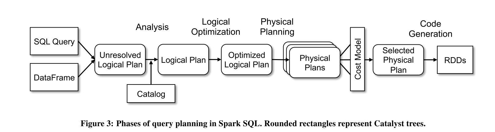 

<h2><a name="section5">5. Apache Spark</a></h2>

  

  &nbsp;&nbsp;&nbsp;&nbsp;参考文献：Apache spark: A unified engine for big data processing. 作者：Zaharia, Matei et al. 文献来源：Communication of the ACM. 年份：2016

  <h3>1 Introduction</h3>
  

    &nbsp;&nbsp;&nbsp;&nbsp;spark是什么？
  

    &nbsp;&nbsp;&nbsp;&nbsp;当今大数据应用中，MapReduce提供了batch processing的分布式编程框架，Dremel提供了交互式SQL queries编程框架，Pregel提供了graph algorithm编程框架等等。但是我们依然期望一个统一的编程框架和系统，用于承载分布式的大数据处理，这就是Spark的目标。 
    &nbsp;&nbsp;&nbsp;&nbsp;Spark提出Resilient Distributed Datasets，称为RDDs，作为programming model，用于承载不同的工作负载。
  

    &nbsp;&nbsp;&nbsp;&nbsp;谈Spark还需从MapReduce谈起，MapReduce为分布式并行操作提供了框架，并将整个并行过程抽象成了两个函数：map和reduce。但显然，这只能支持基于batch的数据处理，在处理类似SQL queries时是十分不变的。于是我们由此思考，能不能推出一种程序框架，提供更灵活的函数接口，以支持更多类型的并行大数据处理呢？ 
  

    &nbsp;&nbsp;&nbsp;&nbsp;Spark便是着重解决这一点，它推出了RDD模型，提供更加丰富的函数接口。编程者只需要使用函数接口即可完成大部分的分布式程序，而不需要考虑程序的分布式容错性、一致性等问题，这和MapReduce的初衷是一样的，使用Spark就可以将分布式系统对编程者隐藏。

  <h3>2 RDD是如何支持分布式计算的</h3>
  

    &nbsp;&nbsp;&nbsp;&nbsp;首先，RDD实际上是一种类MapReduce的操作，我们先来谈MapReduce。在这里给出一个观点，MapReduce是可以消化掉任意的分布式计算的。
  

    &nbsp;&nbsp;&nbsp;&nbsp;一个分布式计算包含两个部分，一是本地计算，二是将计算结果交付给其他节点，也即与其他节点exchange信息。MapReduce提供了Map操作，这即是本地计算；提供了Reduce操作，这允许了all to all的communication。所以实际上MapReduce是可以消化任意分布式计算的，只是有些情况实现效率很低。 
    &nbsp;&nbsp;&nbsp;&nbsp;所以我们可以对MapReduce进行改进，将其break down成timesteps，每个timestep中包含local computation和exchange messages，那么单一的map reduce过程转变为了连续的timestep，如下图：
    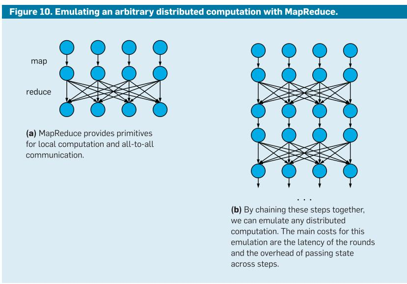 
  

    &nbsp;&nbsp;&nbsp;&nbsp;如果是按照如上所示，以timestep的方式实现spark，从而消化任意的分布式运算，我们必须要面对两个问题。第一点，MapReduce的sharing data过程是低效的，因为其交换信息的过程依靠背后的数据库（GFS或者HDFS），这种较慢的数据交互过程会拖垮spark。第二，MapReduce steps的延迟决定了我们仿真与实际网络的匹配程度，并且大多数Map-Reduce应用是基于分钟甚至hours级别延迟的batch环境。 
  

    &nbsp;&nbsp;&nbsp;&nbsp;RDDs和Spark定位到了这两个问题。针对data sharing，RDDs避免对中间数据进行复制；针对latency问题，Spark可以在100ms时延内完成一个类Map-Reduce任务。 

<h2><a name="section6">6. 总结</a></h2>

  

  &nbsp;&nbsp;&nbsp;&nbsp;Spark系统的目标优化场景为，data是reused的，并且function是stateless。其中，reused指的是，sub-computation的输入不变；stateless指的是，第k个sub-computation不需要k-1个sub-computation的结果。在迭代时机器学习场景中，数据流图可以如下所示： 
  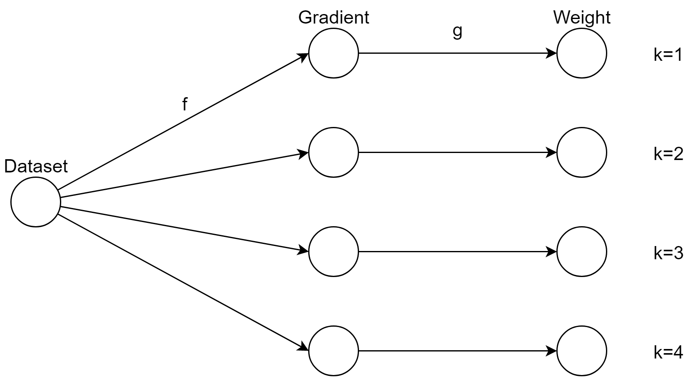 
  &nbsp;&nbsp;&nbsp;&nbsp;Graph中的顶点代表数据，边代表function，其中k代表迭代次数，那么reused指的是Dataset在每次迭代时不发生改变；stateless指的是k次迭代中的function f和g不需要k-1次迭代中的结果。其中g代表更新Weight过程，显然是需要k-1次迭代中的Weight的，但是Weight个数远远小于Dataset个数，故在简单的迭代式机器学习中，我们认为f和g依然是stateless的，即Weight作为function参数传递。
  

  &nbsp;&nbsp;&nbsp;&nbsp;data reused和stateless function是构建Spark的重要基础。首先，data本身就分布在各个节点中，reused意味着两次迭代计算之间，workers仅需要更新参数，而不需要shuffle数据；其次，stateless function使得function可以在任意worker上执行。二者结合我们可以发现，将function的执行位置和其输入数据位置绑定，便可以最大化的减少数据拷贝带来的开销，同时function也可以高效的被执行。 
  

  &nbsp;&nbsp;&nbsp;&nbsp;Spark便是希望使用该思想，将dataflow graph扩充为RDD关系图，RDD被reuse的次数越多，其效率则越高。当然，作为分布式系统，Spark还提供了容错管理。当计算场景改变了reused和stateless特性时，以Spark为代表的batch-processing system显然会收到新的挑战，这点将在后续系统论文选读中给出。

