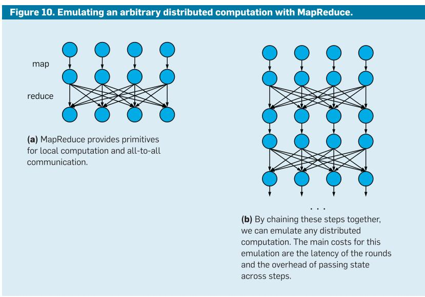

更新时间：2021/03/19

参考资料：论文 - Apache Spark: Engine for Big Data Processing

# 1 Introduction
spark是什么？
当今大数据应用中，MapReduce提供了batch processing的分布式编程框架，Dremel提供了交互式SQL queries编程框架，Pregel提供了graph algorithm编程框架等等。但是我们依然期望一个统一的编程框架和系统，用于承载分布式的大数据处理，这就是Spark的目标。
Spark提出Resilient Distributed Datasets，称为RDDs，作为programming model，用于承载不同的工作负载。

谈Spark还需从MapReduce谈起，MapReduce为分布式并行操作提供了框架，并将整个并行过程抽象成了两个函数：map和reduce。但显然，这只能支持基于batch的数据处理，在处理类似SQL queries时是十分不变的。于是我们由此思考，能不能推出一种程序框架，提供更灵活的函数接口，以支持更多类型的并行大数据处理呢？
Spark便是着重解决这一点，它推出了RDD模型，提供更加丰富的函数接口。编程者只需要使用函数接口即可完成大部分的分布式程序，而不需要考虑程序的分布式容错性、一致性等问题，这和MapReduce的初衷是一样的，使用Spark就可以将分布式系统对编程者隐藏。

# 2 Programming Model
Spark中的关键编程抽象是RDD，它们是在群集中分区的对象的容错集合，可以并行操作。换句话说，spark将RDD作为数据的格式，并对此进行操作。
对RDD的操作分为两种，transformation（将一种RDD转换为另一个RDD）和action（对RDD进行操作，比如查找、更改等）。编程者使用Spark就像在python离import一个库一样，不需要了解底层分布式是如何运行的即可完成spark编程。

那么RDD到底是以什么样的形式实现的，是如何隐藏分布式系统的，又是如何容错的呢?

## 2.1 Fault Tolerance
传统的分布式系统通过data replication和checkpointing来实现容错。但Spark使用一种称为"lineage"（血统）的方式来实现容错。每个RDD追踪用于建立它的transformation图，当有部分信息丢失，RDD会重现transformation，重新创建这一部分的数据，类似每个RDD都有一个log，若出现问题导致数据丢失，就通过这个log重现它。

这种基于lineage的容错方式要比基于replication的方式更有效，实际上spark重现数据的过程是在RAM的，因为相当于重新运行了部分transformation命令，这些操作都是在内存中完成的；反之replication重现过程即重新拷贝数据，是在存储器，甚至是remote存储器上完成的，速度肯定要慢很多。

## 2.2 RDD是如何支持分布式计算的
首先，RDD实际上是一种类MapReduce的操作，我们先来谈MapReduce。在这里给出一个观点，MapReduce是可以消化掉任意的分布式计算的。
一个分布式计算包含两个部分，一是本地计算，二是将计算结果交付给其他节点，也即与其他节点exchange信息。MapReduce提供了Map操作，这即是本地计算；提供了Reduce操作，这允许了all to all的communication。所以实际上MapReduce是可以消化任意分布式计算的，只是有些情况实现效率很低。

所以我们可以对MapReduce进行改进，将其break down成timesteps，每个timestep中包含local computation和exchange messages，那么单一的map reduce过程转变为了连续的timestep，如下图：

如果是按照如上所示，以timestep的方式实现spark，从而消化任意的分布式运算，我们必须要面对两个问题。第一点，MapReduce的sharing data过程是低效的，因为其交换信息的过程依靠背后的数据库（GFS或者HDFS），这种较慢的数据交互过程会拖垮spark。第二，MapReduce steps的延迟决定了我们仿真与实际网络的匹配程度，并且大多数Map-Reduce应用是基于分钟甚至hours级别延迟的batch环境。

RDDs和Spark定位到了这两个问题。针对data sharing，RDDs避免对中间数据进行复制；针对latency问题，Spark可以在100ms时延内完成一个类Map-Reduce任务。