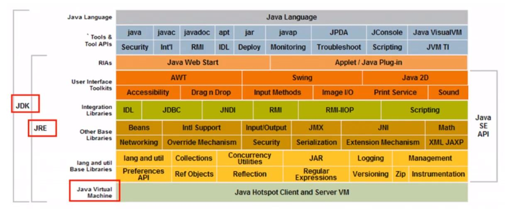

更新时间：2021/03/21

参考资料：
1. [bilibiliJAVA教程](https://www.bilibili.com/video/BV12J41137hu?p=17&spm_id_from=pageDriver)

# 1 Introduction
JAVA和C/C++：
C/C++有个很关键的问题，即所有的内存管理由用户程序控制，这在编写较大工程时是十分麻烦的，故JAVA诞生了。JAVA是基于C/C++编写的，它隐藏了内存管理，用户只需要在机器上安装JVM(java所运行的虚拟机)，即可运行任意的java程序，这是非常方便的。

JAVA组件，由上层至下层顺序：
- JDK: JAVA开发者工具，即用户使用其来进行编程
- JRE: JAVA运行环境，可以理解为代码库，以支持JAVA可以正常运行
- JVM: JAVA虚拟机，JAVA程序真正的载体，可以移植


# 2 Hello World
code:
```java
public class hello_world{
	public static void main(String[] args){
		System.out.print("Hello World!");
	}
}
```
Tips1: java是面向对象编程，所以是基于类的编程，java文件名需要和内部public类名字一样，否则会报错。
Tips2: 与C/C++一样，java是需要编译的，这和解释型语言python是不一样的，编译命令为javac，运行命令为java
cmd运行结果如下：

