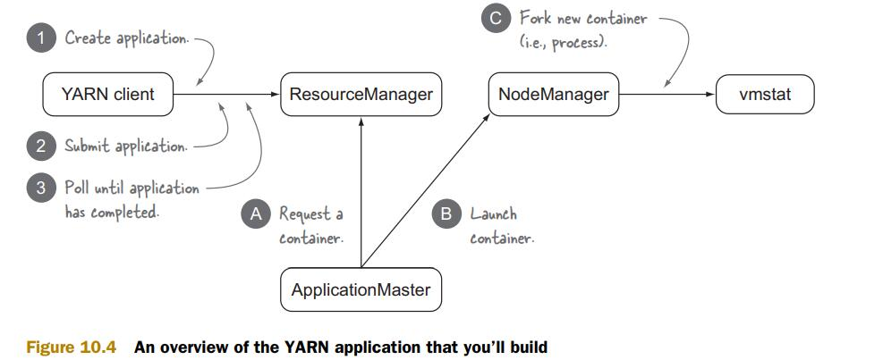

更新时间：2021/04/28

参考资料：
1. [书籍：Hadoop in Practice](https://livebook.manning.com/book/hadoop-in-practice-second-edition)

前置内容：
1. [Summary of Apache Hadoop YARN](https://neth-lab.netlify.app/publication/21-3-19-summary-of-apache-hadoop-yarn/)
# 1 Overview
YARN与其他Hadoop组件的关系图，也为Hadoop 2结构框图：

YARN内部结构图：

YARN application与YARN的关系：

可以看到，YARN app需要三个组件，YARN client，ApplicationMaster，Container
YARN client：与RM交互，创建AM
AM：YARN app的master process，并且还需要管理运行app的containers，向RM请求containers，在NM上真正部署containers

# 2 YARN Configuration
参考资料：[https://hadoop.apache.org/docs/stable/hadoop-yarn/hadoop-yarn-common/yarn-default.xml](https://hadoop.apache.org/docs/stable/hadoop-yarn/hadoop-yarn-common/yarn-default.xml)
如何配置？
通过.xml文件配置YARN，编写property，具体参考官方文档
如何查看？
在Hadoop页面的Configuration中可以查看

如果您不明白配置文件中的值，您可以：
1. 测试yarn-site.xml中的property values，如果某个entry没有配置，则运行默认配置
2. 在RM UI中的Configuration里观察正在运行的配置，对比官方文档的介绍来查明其意义

# 3 Distributed Shell
官方的YARN已经绑定了两个应用程序，分别是MapReduce 2和DistributedShell，现在我们尝试运行起DistributedShell。
在命令行中输入：
```bash
hadoop org.apache.hadoop.yarn.applications.distributedshell.Client \
-debug \
-shell_command find \
-shell_args '`pwd`' \
-jar ${HADOOP_HOME}/share/hadoop/yarn/*-distributedshell-*.jar \
-container_memory 350 \
-master_memory 350
```
如果在最后出现
INFO distributedshell.Client: Application completed successfully
代表运行成功。
这一串代码的意义是，使用DistributedShell运行一个find命令，但显然在输出中，我们并没有看到任何携带'Find'的语句。这是因为AM将find命令实际运行在分里的containers中，标准输出被重定向到container的log output目录下。所以如果想看到find命令的output，我们需要访问那个directory。

## 3.1 访问container logs
方法：使用CLI和UI访问
首先我们需要知道app ID，在命令行输出中查找：
  
在YARN中，可以使用CLI或者UI获知logs，其中，使用CLI需在yarn-site.xml中配置yarn.log-aggregation-enable，而后通过：
yarn logs -applicationId application_1400286711208_0001
访问Logs

UI方式，直接在浏览器中输入http://192.168.137.101:8088/cluster，进入UI界面


# 4 在YARN上运行MapReduce

## 4.1 剖析YARN MapReduce

### 4.1.1 MapReduce流程

- step 1: clients将input分离开并写入HDFS
- step 2: RM create AM for MapReduce job
- step 3, 4: RM为AM分配container，并通知NM创建AM container。注意，AM也是一个container，所以是需要被创建的。
- step 5: MapReduce AM(MRAM)从HDFS上获取input文件
- step 6: MRAM向RM请求map containers，并要求containers的位置靠近input files存储空间
- step 7, 8: RM向MARM分配containers，map和reduce分别开始工作

### 4.1.2 编写MapReduce程序（基于Hadoop库）
[示例代码：https://github.com/Huangxy-Minel/galaxy/tree/main/dataprocess/mapreduce](https://github.com/Huangxy-Minel/galaxy/tree/main/dataprocess/mapreduce)

首先介绍Hadoop库中几个关键的类

#### 4.1.2.1 Class Mapper<KEYIN,VALUEIN,KEYOUT,VALUEOUT>
参考链接：[Package org.apache.hadoop.mapreduce](https://hadoop.apache.org/docs/stable/api/org/apache/hadoop/mapreduce/package-summary.html)
Function: 输入key/value对，输出中间值key/value对
Hadoop MapReduce框架中，job最初为InputFormat，通过spllit函数将其分割哼InputSplit类，而后每个map函数处理一个InputSplit
其中，InputFormat<K, V>, 通过方法List<InputSplit>在逻辑上把InputFormat分为InputSplit
MapReduce框架中，将首先调用setup(org.apache.hadoop.mapreduce.Mapper.Context), 再对每个InputSplit调用map函数，最终调用cleanup函数
该类包含四个方法，cleanup（任务结束后使用），map，run，setup（任务开始前使用）
例程：
```java
  public static class TokenizerMapper
       extends Mapper<Object, Text, Text, IntWritable>{

    private final static IntWritable one = new IntWritable(1);
    private Text word = new Text();

    public void map(Object key, Text value, Context context
                    ) throws IOException, InterruptedException {
      StringTokenizer itr = new StringTokenizer(value.toString());
      while (itr.hasMoreTokens()) {
        word.set(itr.nextToken());
        context.write(word, one);
      }
    }
  }
```
该例子中，定义类内全局变量one，word，分别代表1和Text类，context.write(word, one)的意义为在context中写入(word, one)这样一个key/value对
对于map函数的含义也很简单，即遍历Text value，读取其中的每个单词，并转换为(word, one)输出

#### 4.1.2.2 Reducer
参考资料：[Class Reducer<KEYIN,VALUEIN,KEYOUT,VALUEOUT>](https://hadoop.apache.org/docs/stable/api/org/apache/hadoop/mapreduce/Reducer.html)
Reducer包含3个阶段：
1. Shuffle：通过HTTP将Mapper的已经排序好的输出拷贝到本地
2. Sort：不同的Mapper输出的key/value对中，key是相同的，故使用key对所有copy过来的中间key/value进行重排序
3. Reduce：
```java
public void reduce(Text key, Iterable<IntWritable> values,
                    Context context
                    ) throws IOException, InterruptedException {
    int sum = 0;
    for (IntWritable val : values) {
    sum += val.get();
    }
    result.set(sum);
    context.write(key, result);
}
```
作用为对每个key（在wordcount中是指word），将value相加，统计sum即代表word出现的总次数。

#### 4.1.2.3 Job类
参考链接：[Class Job](https://hadoop.apache.org/docs/stable/api/org/apache/hadoop/mapreduce/Job.html)
该类为用户提供配置、提交、控制、查询状态的接口

#### 4.1.2.4 例程：WordCount类 v1.0
详情请查阅官方文档：[Example: WordCount v1.0](https://hadoop.apache.org/docs/stable/hadoop-mapreduce-client/hadoop-mapreduce-client-core/MapReduceTutorial.html)

## 4.2 API Backword Compatibility
本章节主要描述向后兼容问题。
- Code compatibility: 指任何MapReduce code都可以在YARN上运行。这意味着我们不需要修改以前编写好的code
- Binary compatibility: 指MapReduce bytecode不需要更改就可以在YARN上运行，这意味着不需要对Hadoop 1的代码重编译。
## 4.3 编写YARN Application
### 4.3.1 Fundamentals of building a YARN application

YARN application包含5个组件：
- YARN client: 负责launching YARN application。向RM发送creatApplication和submitApplication请求
- ResourceManager: 负责接受container allocation requests，异步通知clients什么时候有资源空闲
- ApplicationMaster: 应用的main coordinator，发起container request请求，并launch到node上
- NodeManager: launch或kill containers
- Container: application-specific process，可以实Linux进程，也可以是map or reduce tasks

YARN application中的interactions

Resource allocation:
当AM向RM请求新的container时，实际上是请求一个Resource object，这一过程AM向RM发送一个ResourceRequest，如下图：

resourceName代表对container的地理位置要求，即指明host和rack的具体名称。RM使用Container Object作为回复。当AM接受到该object，它可以与NM通信，以launch container

Launching a Container
与NM通信使用下图格式;

NM根据localResources，将数据从HDFS下载到本地，而后开始launch container

### 4.3.2 编写一个收集cluster statistics的YARN application
[示例代码：https://github.com/Huangxy-Minel/galaxy/tree/main/yarnapp/dstat](https://github.com/Huangxy-Minel/galaxy/tree/main/yarnapp/dstat)

下图显示了我们需要编写哪些程序：

Step 1: YARN client
YARN client有两个功能，1是告知RM AM的系统资源需求，2是监控app的状态
建立Client.class
Step 1.1: Create application
```java
YarnConfiguration conf = new YarnConfiguration();
YarnClient yarnClient = YarnClient.createYarnClient();
yarnClient.init(conf);
yarnClient.start();
YarnClientApplication app = yarnClient.createApplication();
```
其中YarnConfiguration conf指为conf变量分配YarnConfiguration类大小的内存
new YarnConfiguration()代表新建一个YarnConfiguration实例，并赋值给conf
YarnConfiguration是YARN提供的一个配置模板
所以这段代码的含义便是，我们使用一个YARN的配置模板创建了YarnClient类，而后创建了YarnClientApplication类

Step 1.2: Submitting a YARN application
在launch app之前，需要配置一下几样条目：
- app name
- launch AM的命令以及classpath和environment settings
- JARs, configuration files, and other files that app needs
- resource requirements(memory and CPU)
- scheduler queue and priority
- security tokens

上一节我们有谈到，AM需要分别和RM、NM交互，与NM交互所用的格式为Conatiner Launch Context，来指明JARS，环境，文件等等，我们先讲这一部分的配置方法。
```java
//初始化Container Launch Context类
ContainerLaunchContext container =
Records.newRecord(ContainerLaunchContext.class);
//配置stdout和stderr
String amLaunchCmd =
String.format(
"$JAVA_HOME/bin/java -Xmx256M %s 1>%s/stdout 2>%s/stderr",
ApplicationMaster.class.getName(),
ApplicationConstants.LOG_DIR_EXPANSION_VAR,
ApplicationConstants.LOG_DIR_EXPANSION_VAR);

container.setCommands(Lists.newArrayList(amLaunchCmd));
//寻找包含Client.class的JAR路径
String jar = ClassUtil.findContainingJar(Client.class);
FileSystem fs = FileSystem.get(conf);
Path src = new Path(jar);
Path dest = new Path(fs.getHomeDirectory(), src.getName());
//copy到HDFS
fs.copyFromLocalFile(src, dest);

FileStatus jarStat = FileSystem.get(conf).getFileStatus(dest);
//为JAR创建LocalResource
LocalResource appMasterJar = Records.newRecord(LocalResource.class);
appMasterJar.setResource(ConverterUtils.getYarnUrlFromPath(dest));
appMasterJar.setSize(jarStat.getLen());
appMasterJar.setTimestamp(jarStat.getModificationTime());
appMasterJar.setType(LocalResourceType.FILE);
appMasterJar.setVisibility(LocalResourceVisibility.APPLICATION);
//将JAR作为container的local resource
container.setLocalResources(
ImmutableMap.of("AppMaster.jar", appMasterJar));
//将YARN JARs添加值AM的classpath
Map<String, String> appMasterEnv = Maps.newHashMap();
for (String c : conf.getStrings(
YarnConfiguration.YARN_APPLICATION_CLASSPATH,
YarnConfiguration.DEFAULT_YARN_APPLICATION_CLASSPATH)) {
Apps.addToEnvironment(appMasterEnv, Environment.CLASSPATH.name(),
c.trim());
}
//将classpath添加至container的环境中
Apps.addToEnvironment(appMasterEnv,
Environment.CLASSPATH.name(),
Environment.PWD.$() + File.separator + "*");
container.setEnvironment(appMasterEnv);
```

指明对memory和CPU的要求
```java
Resource capability = Records.newRecord(Resource.class);
capability.setMemory(256);
capability.setVirtualCores(1);
```
提交APP至RM，使用SubmissionContext
```java
ApplicationSubmissionContext appContext =
app.getApplicationSubmissionContext();
//配置App名字
appContext.setApplicationName("basic-dshell");
appContext.setAMContainerSpec(container);
appContext.setResource(capability);
appContext.setQueue("default");

ApplicationId appId = appContext.getApplicationId();
yarnClient.submitApplication(appContext);
```

Step 1.3: Waiting for the YARN application to complete
Client需要监控App的状态，并作出相应的调整，App状态如下图

我们可以监控这几种状态值，代码如下
```java
//获取当前状态值
ApplicationReport report = yarnClient.getApplicationReport(appId);
//定义AM终止状态
YarnApplicationState state = report.getYarnApplicationState();
EnumSet<YarnApplicationState> terminalStates =
EnumSet.of(YarnApplicationState.FINISHED,
YarnApplicationState.KILLED,
YarnApplicationState.FAILED);
//循环，直至AM处于终止状态
while (!terminalStates.contains(state)) {
TimeUnit.SECONDS.sleep(1);
report = yarnClient.getApplicationReport(appId);
state = report.getYarnApplicationState();
}
```

Step 2: 编写AM
AM主要需要编写3个模块，如下图

Step 2.1: 在RM上登记AM
由于AM也存在于一个container中，所以要现为自己申请一个container
```java
Configuration conf = new YarnConfiguration();
AMRMClient<ContainerRequest> client = AMRMClient.createAMRMClient();
client.init(conf);
client.start();
client.registerApplicationMaster("", 0, "");
```
Step 2.2: 提交container request并当可用时launch到NM上
```java
//建立于NM通信的client
NMClient nmClient = NMClient.createNMClient();
nmClient.init(conf);
nmClient.start();

//指明优先级
Priority priority = Records.newRecord(Priority.class);
priority.setPriority(0);
//编写需求
Resource capability = Records.newRecord(Resource.class);
capability.setMemory(128);
capability.setVirtualCores(1);
//建立request object以发送给RM
ContainerRequest containerAsk =new ContainerRequest(capability, null, null, priority);
rmClient.addContainerRequest(containerAsk);

//等待收到container
boolean allocatedContainer = false;
while (!allocatedContainer) {
AllocateResponse response = rmClient.allocate(0);
for (Container container : response.getAllocatedContainers()) {
allocatedContainer = true;

//接受到container后，将其launch
ContainerLaunchContext ctx =
Records.newRecord(ContainerLaunchContext.class);
ctx.setCommands(
Collections.singletonList(
String.format("%s 1>%s/stdout 2>%s/stderr",
"/usr/bin/vmstat",
ApplicationConstants.LOG_DIR_EXPANSION_VAR,
ApplicationConstants.LOG_DIR_EXPANSION_VAR)
));
nmClient.startContainer(container, ctx);
}
TimeUnit.SECONDS.sleep(1);
}
```
这里，在接受到container后，AM在container上运行了/usr/bin/vmstat命令，当然我们也可以将其改变为其他任何命令，比如运行jar中的app

Step 2.3: 等待container完成
```java
boolean completedContainer = false;
while (!completedContainer) {
AllocateResponse response = rmClient.allocate(0);
for (ContainerStatus s : response.getCompletedContainersStatuses()) {
    completedContainer = true;
}
TimeUnit.SECONDS.sleep(1);
}
rmClient.unregisterApplicationMaster(
FinalApplicationStatus.SUCCEEDED, "", "");
```

### 4.3.3 总结
根据之前的代码例程，总结一下编写Client和AM步骤
#### 4.3.3.1 Client
Client的作用很简单，即向RM申请一个container并运行AM。该过程可以被细化为以下几点：
1. 创建Client实体
2. 配置container参数
3. 配置AM参数
4. 提交请求，并监控App运行状态

具体来说如下：
Step 0: 生成配置模板YarnConfiguration类

Step 1: 创建Client实体
参考YarnClient类

Step 2: 配置container参数
参考ContainerLaunchContext类，该类的创建方法为Records.newRecord(ContainerLaunchContext.class)
container中比较关键的参数是launch命令、localresource、environment

Step 3: 配置AM参数
参考YarnClientApplication类
其中需要生成ApplicationSubmissionContext，该context是Client向RM提交的报文

Step 4: 提交请求，监控App
使用YarnClient中submitApplication方法
使用ApplicationReport类以获取App运行状态

#### 4.3.3.2 ApplicationMaster
AM的功能是向RM请求container，请求成功后告知NM launch container，这两步通过AMRMClient，NMClient两个实体完成
大体过程与Client相同，向RM提交container请求报文，向NM提交ContainerLaunchContext以运行container
具体过程如下：

Step 0: 创建通信实体
AMRMClient.createAMRMClient();
NMClient.createNMClient();

Step 1: 请求container
配置ContainerRequest类
通过AMRMClient方法提交请求

Step 2: 得到container后，launch container
配置ContainerLaunchContext类
通过NMClient方法提交launch命令


### 4.3.4 编写一个YARN app，打出Hello World
完整代码请参考：[https://github.com/Huangxy-Minel/galaxy/tree/main/yarnapp/hello](https://github.com/Huangxy-Minel/galaxy/tree/main/yarnapp/hello)

在上一节，我们实现了使用Client完成任务提交，部署AM后申请container，最终在container中运行一条cmd命令。
本节中，笔者将对上一节Client与AM代码进行更改，将申请多个container，并执行Hello.java，将生成的文件上传至HDFS中。

Client并不需要更改，它的作用依然是申请一个container以运行AM。

AM中添加两个containerAsk，即
```java
// ----------------Ask for container----------------
// Config requirements of containers
Priority priority = Records.newRecord(Priority.class);
priority.setPriority(0);
Resource capability = Records.newRecord(Resource.class);
capability.setMemory(64);
capability.setVirtualCores(1);
// Make container requests to ResourceManager
ContainerRequest containerAsk = new ContainerRequest(capability, null, null, priority);
System.out.println("adding two container asks:" + containerAsk);
rmClient.addContainerRequest(containerAsk);
rmClient.addContainerRequest(containerAsk);
```
接着提交containerRequest，如下
```java
// ----------------Wait and launch containers----------------
int allocatedContainer = 0;
while (allocatedContainer < 2) {
    System.out.println("Waiting for containers......");
    AllocateResponse response = rmClient.allocate(0);
    for (Container container : response.getAllocatedContainers()) {
        ContainerId containerID = container.getId();
        System.out.println("Get a container! ID: " + containerID.toString());
        allocatedContainer++;
        ContainerLaunchContext ctx = createContainerLaunchContext(conf);
        System.out.println("Launching container " + container);
        nmClient.startContainer(container, ctx);
    }
    TimeUnit.SECONDS.sleep(1);
}
```
Logs输出为：
```
registerApplicationMaster: pending
registerApplicationMaster: complete
adding two container asks:Capability[<memory:64, vCores:1>]Priority[0]AllocationRequestId[0]ExecutionTypeRequest[{Execution Type: GUARANTEED, Enforce Execution Type: false}]Resource Profile[null]
Waiting for containers......
Waiting for containers......
Get a container! ID: container_1619516610899_0001_01_000002
Launching container Container: [ContainerId: container_1619516610899_0001_01_000002, AllocationRequestId: 0, Version: 0, NodeId: raspberrypi03:38607, NodeHttpAddress: raspberrypi03:8042, Resource: <memory:64, vCores:1>, Priority: 0, Token: Token { kind: ContainerToken, service: 192.168.137.103:38607 }, ExecutionType: GUARANTEED, ]
Get a container! ID: container_1619516610899_0001_01_000003
Launching container Container: [ContainerId: container_1619516610899_0001_01_000003, AllocationRequestId: 0, Version: 0, NodeId: raspberrypi02:39481, NodeHttpAddress: raspberrypi02:8042, Resource: <memory:64, vCores:1>, Priority: 0, Token: Token { kind: ContainerToken, service: 192.168.137.102:39481 }, ExecutionType: GUARANTEED, ]
allocate (wait)
Completed container ContainerStatus: [ContainerId: container_1619516610899_0001_01_000003, ExecutionType: GUARANTEED, State: COMPLETE, Capability: <memory:64, vCores:1>, Diagnostics: , ExitStatus: 0, IP: null, Host: null, ContainerSubState: DONE]
unregister
exiting
```

可见对于多个container申请，仅需要在rmClient中添加contaienrRequest，在RM中将存放一个申请队列。response.getAllocatedContainers()会返回所有最近申请的container列表，使用for循环遍历即可简单的对所有container操作。当一个container被分配给AM后，其申请队列将减少一个container。

接下来我们尝试在container中进行文件的下载与上传，首先修改AM，使之仅申请一个container，修改Hello代码如下：
```java
public class Hello{
    public static void main(String[] args) throws Exception {
        System.out.println("Hello World!");

        // ----------------Init instance of fs----------------
        YarnConfiguration conf = new YarnConfiguration();
        FileSystem fs = FileSystem.get(conf);
        Path helloPath = new Path(fs.getHomeDirectory(), "hello");
        // ----------------Create Hello----------------
        FSDataOutputStream helloFile = fs.create(helloPath);
        helloFile.writeBytes("Hello World!\n");
    }
}
```
这里我们在HDFS上创建了一个hello文件，并在其中写入"Hello World!"。注意，这段程序是运行在container中的，并在其中使用了hadoop接口，如果不更改AM种的launch cmd，会报错NoClassDefFoundError: org/apache/hadoop/conf/Configuration
所以我们需要使用hadoop命令来运行该函数，修改AM如下：
```java
final String cmd = "/home/galaxy/hadoop-3.2.2/bin/hadoop jar Container.jar galaxy.testfile.Hello";
String ctnLaunchCmd =
    String.format(
        "%s 1>%s/stdout 2>%s/stderr",
        cmd, 
        ApplicationConstants.LOG_DIR_EXPANSION_VAR,
        ApplicationConstants.LOG_DIR_EXPANSION_VAR);
```
运行Client，可以在HDFS中观察结果如下：

以上，完成了container中的基本操作

## 4.4 编写YarnApp: MapReduce
本节笔者尝试不适用Hadoop MapReduce接口，以编写一个WordCount程序。
### 4.4.1 WordCount.Map
