更新时间：2021/04/13

参考资料：
1. [论文：Private federated learning on vertically partitioned data via entity resolution and additively homomorphic encryption](https://arxiv.org/abs/1711.10677)

# 1 Overview
算法框图如下：
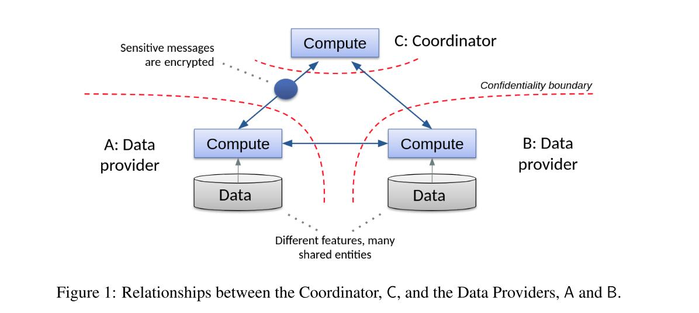
其中A和B为data provider，联合完成一个联邦学习任务；C为一个绝对安全体，提供同态加密方法和密钥分配。

# 2 同态加密算法Pailliar
假设有明文u, v, 加密后表示为[u], [v], 则：
$$[u] + [v] = [u + v]$$

$$v·[u] = [vu]$$

上述过程同样适用于向量vector与矩阵matrix，具体见论文Appendix Ⅰ章节。
然而，密态运算是及其耗费时间的，例如，在Paillier中，一个浮点数加密后为2m bits，其中m为一个至少为1024bits的一个大数。一个二数的密态加法要比非密态加法慢2到3倍。在后文中将描述如何在现实世界中应用此方法。

# 3 Privacy-preserving实体解析
A和B持有不同的数据集，那么如何得知A和B重复的那一部分数据集以进行模型训练呢?理想方法是为每一条数据标明ID，但显然是不可行的（各家公司的ID标记不同，同时ID会暴露信息）。
在这里采用entity resolution方法，例子如下图：
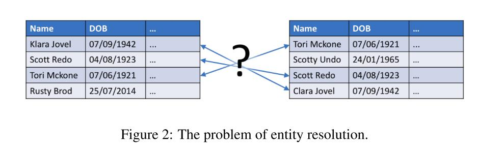
匹配过程可以使用weak IDs，例如Name，Address，Gender等，此过程需要保证是密态过程，具体算法如下：
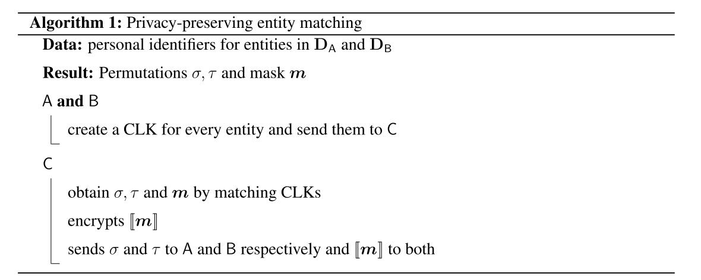
其中，CLK为cryptographic longterm key，是一个Bloom filter用于编码个人表示符。
算法流程：A和B分别生成CLK，发送至C；C计算所有CLK对的Dice系数以匹配接受到的CLK，从而得到datasets sizes的乘积的值。根据贪心思想，最similar的CLK对被选。
entity matching的输出为$\sigma,\tau$，用于告知A和B如何对他们的数据集重排布；同时输出一个掩码$m$，用于指定一行数据是否要用于机器学习

# 4 逻辑回归
average logistic loss：
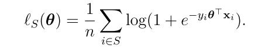
计算目标函数梯度采用随机梯度下降法，其中$S'$代表mini-batch：
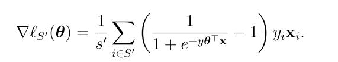
更新模型时仅需要梯度gradient，而不需要loss，故需要对gradient使用同态加密，在更新模型时需要同态加法运算。但当前梯度运算中包含指数，乘法等，显然在计算梯度时很难使用同态运算，故将loss函数做二阶泰勒展开，得到梯度近似解为：
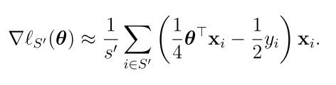
下面引入mask，进行同态运算可得：
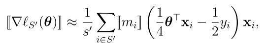

# 5 安全的联邦逻辑回归
这里假设Privacy-preserving实体解析已经完成，则A和B持有的数据集为矩阵$X_{AS}, X_{BS}$：
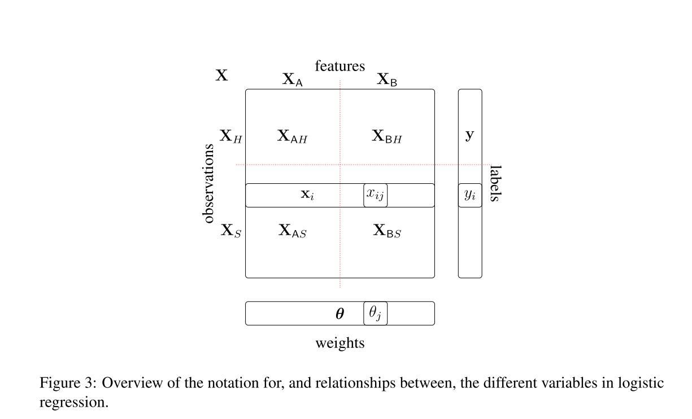
假设label由A持有，设x为X中的一行，则
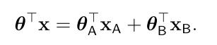
显然需要A和B分别计算$\theta^\top_Ax_A, \theta^\top_Bx_B$，再由C完成$\theta^\top x$，algorithm 2描述了该过程：
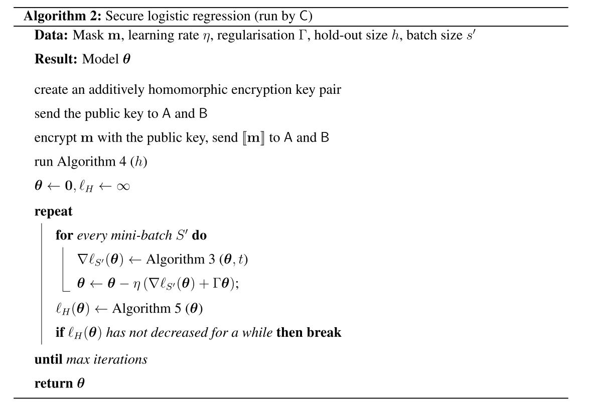
初始化：
首先向A和B发送掩码[m]，而后通过Algorithm 4确定初始$\theta$和损失函数$l_H$
而后开始训练模型
其中Algorithm 3用于计算梯度，Algorithm 5用于更新损失函数，直到满足收敛条件，或达到最大迭代次数
Algorithm 3：
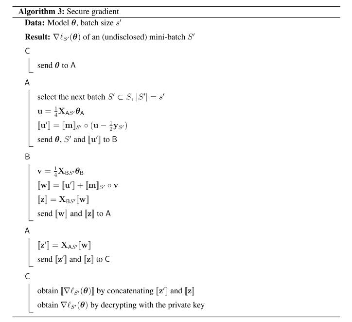

# 6 FATE中Hetero-LR架构
参考资料：
- [FATE - Federated Logistic Regression](https://fate.readthedocs.io/en/latest/_build_temp/python/federatedml/linear_model/logistic_regression/README.html)

在FATE下的联邦逻辑回归算法中，实体被简化为3个，party A为Guest，party B为Host，party C为"Arbiter"，用于维护私钥并负责调度工作
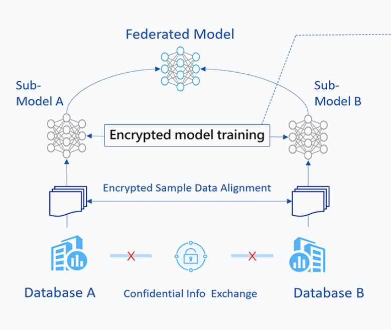
框图如上，异构LR中，party A和party B所持数据的feature space是不同的，但sample ID space重叠较多，属纵向联邦学习。在FATE中，需要包含一个sammple data alignment过程，即提取出数据的重叠部分（sample ID space），并加密交互，使双方并不知道哪些data是重叠的。而后使用overlap data进行FL