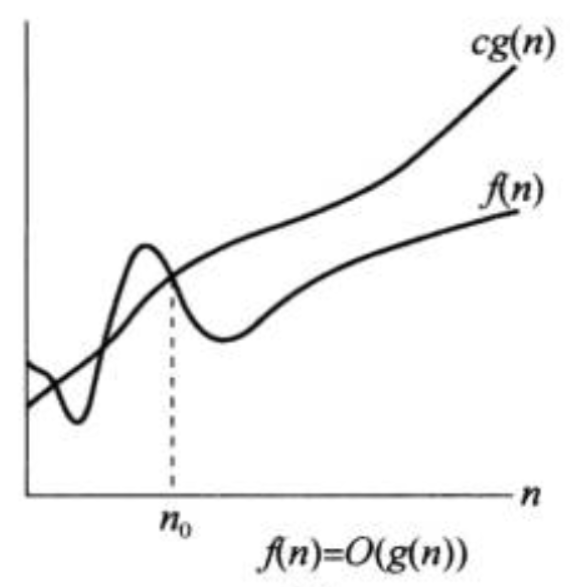
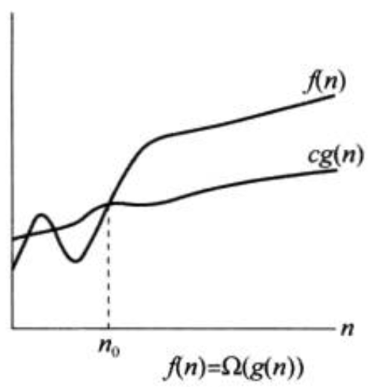
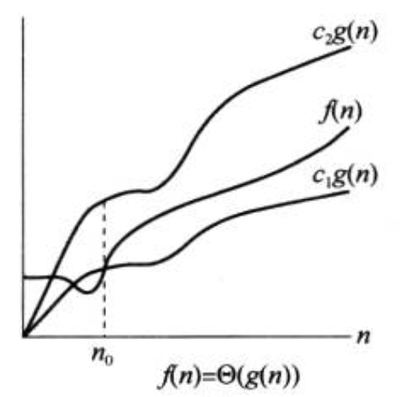
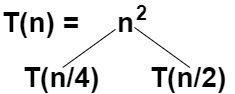
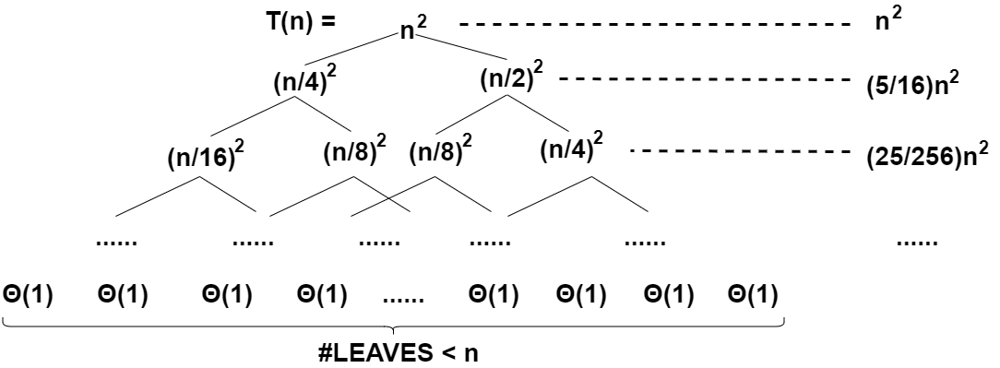
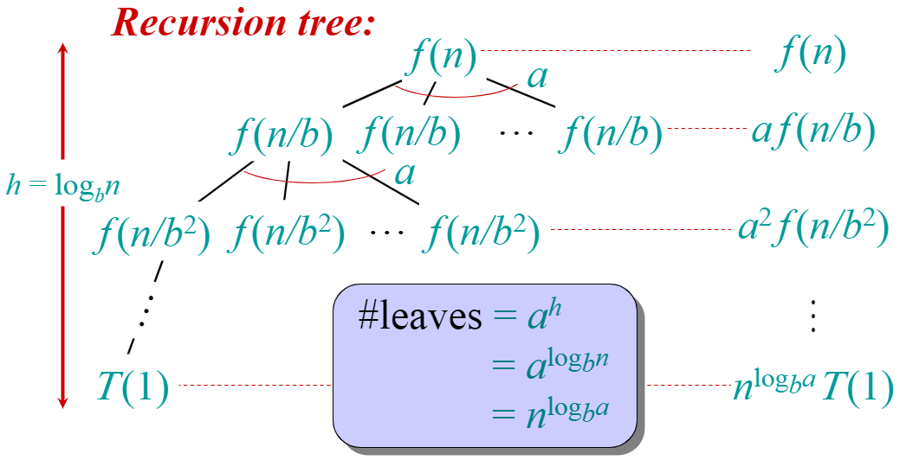

<head>

<!--支持网页公式显示-->    

</head>

<body>

  <h4>⚠ 转载请注明出处：<i>作者：ZobinHuang，更新日期：Mar.3 2021</i></h4>

<!--表格-->
<!--
<table border="1" align="center">
  <caption>表格</caption>
  <tr>
    <th>A</th>
    <th>B</th>
    <th>C</th>
  </tr>
  <tr>
    <td>xxx</td>
    <td>xxx</td>
    <td>xxx</td>
  </tr>
</table>
-->

<!--图片-->
<!--

  

-->

<!--正文-->
<!--

&nbsp;&nbsp;&nbsp;&nbsp;公式：`\overline{A}\overline{B}`

-->

&nbsp;&nbsp;&nbsp;&nbsp;注：在本节中我们将花比较多的篇幅来讨论分析算法所使用的数学工具。

<!--标题-->
<h2>1. 渐近符号</h2>

<h4>(1) 近似符号 `O`：近似上界</h4>

  

&nbsp;&nbsp;&nbsp;&nbsp;<b>数学定义</b>：`O(g(n))` 表示了一个函数集合，这些函数 `f(n)` 满足：`\exists c>0, n_0>0`，使得 `0 \leq f(n) \leq cg(n)` 对于所有 `n \geq n_0` 成立，即 `O(g(n)) = {f(n): 存在c>0, n_0>0, 使得 0 \leq f(n) \leq cg(n) 对于 n \geq n_0 成立}`。当我们写出 `f(n) = O(g(n))` 的时候，`=` 在这里的含义应该理解为 `\in`， 即等号左边是等号右边的一个子集。在含有渐近符号的等式中，应该意识到等号两边是 <b>不等价</b> 的。有些教材/论文中会写成 `\in`， 后面会介绍写成 `=` 的一些好处。
 &nbsp;&nbsp;&nbsp;&nbsp;<b>加深理解</b>：现在我们知道了，当等式中出现 `O(g(n))` 这样的渐近符号时，应该把它理解为一个集合，而 `=` 应该理解为 `\in`。这里更准确的说法是 <b>宏替换(Macro Substitution)</b>，即等式中的集合代表了一个在这个集合中的匿名函数(anonymous function)，我们在对带有集合的等式做分析时，我们需要将等式中的集合符号替换为匿名函数，从而对等式的含义做出解释。下面我们通过一些等式的例子加深对于 符号 `O` 的理解。
 &nbsp;&nbsp;&nbsp;&nbsp;&nbsp;&nbsp;&nbsp;&nbsp;(a) `\underline{2n^2 = O(n^3)}`：
 &nbsp;&nbsp;&nbsp;&nbsp;&nbsp;&nbsp;&nbsp;&nbsp;`2n^2` 属于 `O(n^3)`，用宏替换来说就是在集合 `O(n^3)` 中存在一个函数 `h(n)`，使得 `2n^2 = h(n)` 成立，注意此处的 `=` 是真正的相等关系。因此，当集合符号出现在等式右边时，它应该被解释为 “在集合中存在一个函数，使得等号条件成立”。
 &nbsp;&nbsp;&nbsp;&nbsp;&nbsp;&nbsp;&nbsp;&nbsp;(b) `\underline{f(n) = n^3 + O(n^2)}`：
 &nbsp;&nbsp;&nbsp;&nbsp;&nbsp;&nbsp;&nbsp;&nbsp;在集合 `O(n^2)` 中存在一个函数 `h(n)`，使得 `f(n) = n^3 + h(n)` 等号条件成立。这个式子的意义在于，它对 `f(n)` 做出了更加精确的定义，我们当然可以简单地说 `f(n)` 是一个以 `n^3` 为上界的一个函数，但是这样定义是模糊的，`O(n^2)` 的加入说明 `f(n)` 除了一个 `n^3` 的主项之外，还存在一个上界为 `n^2` 的误差项。
 &nbsp;&nbsp;&nbsp;&nbsp;&nbsp;&nbsp;&nbsp;&nbsp;(c) `\underline{n^2 + O(n) = O(n^2)}`：
 &nbsp;&nbsp;&nbsp;&nbsp;&nbsp;&nbsp;&nbsp;&nbsp;这个等式在等号左边出现了集合，基于我们把 `=` 当作 `\in` 的理解方式，运用宏替换，其解释方法为：对于任何的 `h_1(n) \in O(n)`，在集合 `O(n^2)` 中一定存在一个函数 `h_2(n)`，使得 `n^2 + h_1(n) = h_2(n)` 等号条件成立。因此，当集合符号出现在等式左边时，它应该被解释为 “任何在集合中的函数都能使得等号条件成立”。在 (c) 例子中在等号两侧都出现了集合符号，所以综合 (a) 例子的解释，我们可以得到，当等号两边都存在集合符号时，应该被解释为 “任何在等号左边集合中的函数，都一定存在一个属于等号右边集合的函数，使得等号条件成立”。

<h4>(2) 近似符号 `\Omega`：近似下界</h4>

  

&nbsp;&nbsp;&nbsp;&nbsp;<b>数学定义</b>：我们有了 `O` 来表示上界，同样地，我们也需要能表示下界的数学定义。这里我们给出数学符号  `\Omega` 的数学定义：`\Omega(g(n))` 表示了一个函数集合，这些函数 `f(n)` 满足：`\exists c>0, n_0>0`，使得 `0 \leq cg(n) \leq f(n)` 对于所有 `n \geq n_0` 成立，即 `\Omega(g(n)) = {f(n): 存在c>0, n_0>0, 使得 0 \leq cg(n) \leq f(n)  对于 n \geq n_0 成立}`。
 &nbsp;&nbsp;&nbsp;&nbsp;<b>加深理解</b>：下面我们分析一个例子。
 &nbsp;&nbsp;&nbsp;&nbsp;&nbsp;&nbsp;&nbsp;&nbsp;(a) `\underline{\sqrt{n} = \Omega(\lgn)}`：
 &nbsp;&nbsp;&nbsp;&nbsp;&nbsp;&nbsp;&nbsp;&nbsp;运用基本的逻辑理解，可以把这个等式解释为：只要 `n` 足够大，`\sqrt{n}` 至少会是 `\Omega(\lgn)` 的常数倍。当然我们在真正解释这个式子的数学含义的时候还是得套用上面所用的宏替换的解释，即：在集合 `\Omega(\lgn)` 中存在一个函数，使得 `\sqrt{n} = \Omega(\lgn)` 等号条件成立。

<h4>(3) 近似符号 `\Theta`：近似相等</h4>

  

&nbsp;&nbsp;&nbsp;&nbsp;当我们有了可以类比于 `\leq` 的 `\O` 和可以类比于 `\geq` 的 `\Omega` 后，我们希望也有可以类比于 `=` 的数学定义，这里我们给出数学符号  `\Theta` 的数学定义：`\Theta(g(n)) = O(g(n)) \cap \Omega(g(n))`。简单地理解就像是我们在 Lecture 1 中提出来的那样，对于 `f(n) = \Theta(g(n))`，`g(n) = ` “把 `f(n)` 的低阶项和高阶项常数忽略的部分”，即系数为1的高阶项。例如：`1/2n^2 - 2n = \Theta(n^2)`。

<h4>(4) 严格符号 `\o`：严格上界</h4>

&nbsp;&nbsp;&nbsp;&nbsp;相比于近似符号 `\O(g(n))` 要求集合中的函数 `f(n)` 满足： “<b>存在</b>” `c>0` 和 `n_0>0` 使得 `0 \leq f(n) \leq cg(n)` 对于所有 `n>n_0` 成立，严格上界符号 `\o(g(n))` 要求集合中的函数 `f(n)` 满足： 对于 “<b>任意</b>” `c>0`，一定存在 `n_0>0` 使得 `0 \leq f(n) \leq cg(n)` 对于所有 `n>n_0` 成立。可以发现这里对系数 `c` 有 <b>存在</b> 和 <b>任意</b> 的区别，对于 `f(n) = O(g(n))`，`\O(g(n))` 要求你只要存在 `c` 使得在`n` 足够大之后 `cg(n)` 是 `f(n)` 的上界就可以了，而对于 `f(n) = o(g(n))`， `\o(g(n))` 则要求不管你在 `g(n)` 前面加多小的系数，`cg(n)` 一定得在 `n` 足够大之后继续超过 `f(n)`，即要求 `g(n)` 是 `f(n)` 的严格上界。例如我们分析 `2n^2 = o(n^3) `(*) 这个式子，我们可以得到 `cn^3 >= 2n^2`，故 `n_0 = 2/c`，即对于所有的 `c`，都一定有：对于所有  `n >= n_0`，`cn^3 >= 2n^2`，因此 (*) 式是成立的，证毕。

<h4>(5) 严格符号 `\omega`：严格下界</h4>

&nbsp;&nbsp;&nbsp;&nbsp;同样地，我们定义严格下界符号 `\omega`。严格下界符号 `\omega(g(n))` 要求集合中的函数 `f(n)` 满足： 对于 “<b>任意</b>” `c>0`，一定存在 `n_0>0` 使得 `0 \leq cg(n) \leq f(n)` 对于所有 `n>n_0` 成立。即不管你在 `g(n)` 前面加多大的系数，`f(n)` 一定得在 `n` 足够大之后继续超过 `cg(n)`，即要求 `g(n)` 是 `f(n)` 的严格下界。例如我们分析 `\sqrt{n} = \omega(\lgn)`(*)，我们可以得到 `\sqrt{n} \geq c\lgn`，这个式子的答案会是 `n_0 = 1+1/c` （怎么求的？），即对于所有的 `c`，都一定有：对于所有 `n >= 1+1/c`，`\sqrt{n} \geq c\lgn`，因此 (*) 式是成立的，证毕。

<h2>2. 解递归式</h2>

&nbsp;&nbsp;&nbsp;&nbsp;目前我们没有一种通用的方法用于解出递归式，我们只能运用各种各样的技巧来解递归式，就像求解积分那样。但是检查我们是否正确地解出递归式是简单的。下面我们介绍三种解递归式的技巧。

<h4>(1) 代换法（数学归纳法）</h4>

&nbsp;&nbsp;&nbsp;&nbsp;我们看这样一个例子：`T(n)=4T(n/2)+n`，求解这个递归式，即求出 `T(n)`。
 &nbsp;&nbsp;&nbsp;&nbsp;我们计划使用数学归纳法的方式把 `T(n)` 求出来。我们初步猜测： 

  `T(n)=\O(n^3)` ...... ①

 

<h4>&nbsp;&nbsp;&nbsp;&nbsp;插曲：</h4>

&nbsp;&nbsp;&nbsp;&nbsp;注意在数学归纳法的使用过程中，我们不能让我们的式子带有集合符号(e.g. `\O`, `\Omega`, etc)。比如：`n = \O(1)` (即函数 `f(n) = n` 的渐近上界是 `\O(1)`)，这是一个伪命题（如果这是真的，那么所有算法的复杂度都将是 `\O(1)`），但是如果我们使用数学归纳法强加证明，我们会看到：

已知基本情况： `1 = \O(1)`，这是一个真命题
 如果假设 `n-1 = \O(1)`
 那么我们可以得到 `n = \underbrace{(n-1)}_{\O(1)}+\underbrace{(1)}_{\O(1)} = \O(1)`

&nbsp;&nbsp;&nbsp;&nbsp;但是很明显上面的出来的结论是错误的。证明过程中的错误就在于我们保留了 `\O(1)`，`\O(1)`实际上就是一堆常数的集合。如果我们只是对常数做有限次叠加，那问题不大，它依然是常数。但是在我们的证明过程中我们将其进行了n次叠加，这时这个常数就是依赖于n变化的了。也就是说，对于一条有限长度的 `\O` 关系链，首尾的包含关系是可以成立的，例如 `n^2 = \O(n^2) = \O(n^3) = \O(n^4)` 从而推出 `n^2 = \O(n^4)` 是允许的。但是一条无限长度的 `\O` 关系链就没有上面这样的链式法则。

  

&nbsp;&nbsp;&nbsp;&nbsp;因此，为了防止使用 `\O` 符号导致的常数被忽略的易犯错误，我们在数学归纳法中必须使用常数把 ① 式展开。下面我们开始进行数学归纳法的证明。
 &nbsp;&nbsp;&nbsp;&nbsp;首先我们分析基本情况：

  `T(1) = \Theta(1) \leq cn^3 = c` ...... ②

&nbsp;&nbsp;&nbsp;&nbsp;只要 `c` 足够大，② 式是一定成立的。然后我们假设当 `k < n` 时，有：

  `T(k) \leq ck^3` (`k < n`) ...... ③

&nbsp;&nbsp;&nbsp;&nbsp;然后我们证明 `k = n` 时的情况，有：

  `T(n) = 4T(n/2) + n \leq 4c(n/2)^3 + n = c/2n^3 + n` ...... ④

&nbsp;&nbsp;&nbsp;&nbsp;我们最终的证明目标是 `T(n) \leq cn^3`，因此我们进行构造：

  `T(n) = c/2n^3 + n = cn^3 - (1/2cn^3-n) \leq cn^3`，当且仅当 `1/2cn^3-n \geq 0` ...... ⑤

&nbsp;&nbsp;&nbsp;&nbsp;易证 ⑤ 式的这个条件是很容易达成的，因为这个 `c` 是可以由我们控制的。我们只要控制 `c` 足够大，使得 ② 式和 ⑤ 式的条件都成立，这个命题就是成立的。但是一般来说，算法的基本情况(i.e. `n=1`时的情况) 对后续并没有太大的影响，所以我们常常会忽略对基本情况的讨论。
 &nbsp;&nbsp;&nbsp;&nbsp;至此，我们根据这个递推式，证明了 `T(n)` 的上界就是 `n^3`，但注意 `n^3` 并不就一定是严格的上界，我们只是在一开始猜测 `n^3` 是 `T(n)` 的上界，然后将我们的猜测是用数学归纳法进行证明而已。
  &nbsp;&nbsp;&nbsp;&nbsp;下面，还是上述的递推式 `T(n)=4T(n/2)+n`，我们尝试继续将上界压缩，证明 `T(n)=\O(n^2)`，即证：`T(n) \leq cn^2` ...... ①。
 &nbsp;&nbsp;&nbsp;&nbsp;首先我们假设当 `k < n` 时，有：

  `T(k) \leq ck^2` (`k < n`) ...... ②

&nbsp;&nbsp;&nbsp;&nbsp;然后我们得到：

  `T(n) = 4T(n/2)+n = 4c(n/2)^2+n = cn^2 + n`  ...... ③

&nbsp;&nbsp;&nbsp;&nbsp;我们发现通过 ③ 式我们无法证明 `T(n) \leq cn^2`，因此无法完成归纳。此时回顾 ① 式，我们发现我们限制得太死，我们仅尝试用二次项 `n^2` 去约束 `T(n)`，但是实际上一次项也是允许出现在上界条件中的。我们可以稍微将条件放宽，将证明目标变成：

  `T(n) \leq c_1n^2 - c_2n` ...... ①'

&nbsp;&nbsp;&nbsp;&nbsp;然后我们假设当 `k < n` 时，有：

  `T(k) \leq c_1k^2 - c_2k` (`k < n`) ...... ②'

&nbsp;&nbsp;&nbsp;&nbsp;然后我们得到：

  `T(n) = 4T(n/2) + n = 4(c_1(n/2)^2 - c_2(n/2)) + n = c_1n^2 - 2c_2n + n` ...... ③'

&nbsp;&nbsp;&nbsp;&nbsp;结合我们的证明目标 ①'，我们构造：

  `T(n) = c_1n^2 - 2c_2n + n = c_1n^2 - c_2n - (-1+c_2)n \leq c_1n^2 - c_2n`， 当且仅当 `(-1+c_2)n \geq 0` ...... ④'

&nbsp;&nbsp;&nbsp;&nbsp;综上，我们证明了对于 `\forall c_1>0` 和 `c_2>1`，`T(n) = \O(n^2)`。特别注意 `c_1` 必须要足够大才能满足基本情况 (n=1的情况)，这里不再证明。

<h4>(2) 递归树法 (Recursion-tree)</h4>

&nbsp;&nbsp;&nbsp;&nbsp;我们看一个更复杂的例子：`T(n)=T(n/4)+T(n/2)+n^2`，求解这个递归式。 

  

&nbsp;&nbsp;&nbsp;&nbsp;首先我们将递推式子写成如上所示的奇怪的树状形式，我们把递推项放到叶子节点上，然后继续将这些递推项递归地拆成这样的树状结构，我们可以得到：

  

&nbsp;&nbsp;&nbsp;&nbsp;于是我们得到了最终会为分解一颗叶子节点为 `\Theta(1)` 的树。注意上图有可能产生误解，这是棵树应该是一颗半满二叉树，即叶子节点是不在同一行上的，明显的树的左边被递归分解得比较快，值得注意。
 &nbsp;&nbsp;&nbsp;&nbsp;现在我们把重点放在如何计算出这棵树的和上面来。我们按行来看，如上图所示，我们将每一行的所有数相加完写在右边。仔细观察我们会发现这是一个几何级数（等比数列）的形式，因此我们可以得到：

  `T(n) = n^2\underbrace{(1+5/16+25/256+......)}_{递归数的各项展开项有限相加} \leq n^2\underbrace{((5/16)^0+(5/16)^1+(5/16)^2+......)}_{这里变为无穷的情况，所以左边符号变为 \leq}` ........ ①

&nbsp;&nbsp;&nbsp;&nbsp;对于几何级数，有这样一个性质：

  `1+1/2+1/4+1/8... = 2`

&nbsp;&nbsp;&nbsp;&nbsp;实际上上式代表的就是二进制数 `1.111111......`，当小数点后为无穷位时，这个数就等于2了。
 &nbsp;&nbsp;&nbsp;&nbsp;运用这个性质，我们继续处理我们的 ① 式，有：

  `T(n) \leq n^2((5/16)^0+(5/16)^1+(5/16)^2+......) < 2n^2` ........ ②

&nbsp;&nbsp;&nbsp;&nbsp;至此，我们证出了 `T(n) = O(n^2)`，同时从 `T(n) = T(n/4) + T(n/2) + n^2` 也可以得到 `T(n) = \Omega(n^2)` 的结论。

<h4>(3) 主方法 (Master method)</h4>

&nbsp;&nbsp;&nbsp;&nbsp;首先我们给出主方法的使用条件：主方法适用于形如：`T(n) = aT(n/b) + f(n), a\geq 1, b > 1, \underbrace{f(n)渐近趋正}_{含义：存在某特定n_0，当n>n_0时，f(n) > 0}` 的递归式子。观察这个递归式子，其规律就在于 `T(n)` 包含的是 `a` 个相同的子问题，且这些子问题的输入规模都是 `n/b`，即 `T(n/b)`，外加一个非递归项 `f(n)`。`a \geq 1` 的条件保证了至少会递归一次，`b > 1` 的条件保证了子问题的规模会比当前的问题小。
 &nbsp;&nbsp;&nbsp;&nbsp;只要满足主方法的使用条件，主方法就能够帮助我们求解递归式。下面我们首先给出主方法给出的solution，然后我们使用递归数直观但不严谨地证明为什么主方法是正确的，以便于我们理解主方法。
 &nbsp;&nbsp;&nbsp;&nbsp;主方法以非递归项 `f(n)` 作为分类依据，给出了三种情况下的solution：
 &nbsp;&nbsp;&nbsp;&nbsp;<b>CASE 1</b>. 当 `\exists \epsilon > 0` 使得 `f(n) = O(n^(log_ba-\epsilon))`，也即 `f(n)` 的增长速度以多项式级别地缓慢于 `n^(log_ba)` 时（受 `n^(-\epsilon)` 的控制），`T(n) = \Theta(n^(log_ba))`。
 &nbsp;&nbsp;&nbsp;&nbsp;<b>CASE 2</b>. 当 `\exists k \geq 0` 使得 `f(n) = O(n^(log_ba)\lg^kn)`，也即 `f(n)` 的增长速度接近于 `n^(log_ba)` 时，`T(n) = \Theta(n^(log_ba)\lg^(k+1)n)`
 &nbsp;&nbsp;&nbsp;&nbsp;<b>CASE 3</b>. 当  ① `\exists \epsilon > 0` 使得 `f(n) = O(n^(log_ba+\epsilon))`，也即 `f(n)` 的增长速度以多项式级别地快于 `n^(log_ba)` 时（受 `n^(\epsilon)` 的控制），同时  ② `\exists c < 1` 使得 `af(n/b) \leq cf(n)`，也即保证每次递归时分解出来的 `a` 个子问题 `f(n/b)` 的规模一定比 `f(n)` 要小时，`T(n) = \Theta(f(n))`。

&nbsp;&nbsp;&nbsp;&nbsp;下面我们使用递归树对主方法做一个直观的观察。

  

&nbsp;&nbsp;&nbsp;&nbsp;首先我们可以得到递归树的高度为 `h = \log_bn`，因此可得叶子节点的个数为 `#LEAVES = a^h = a^(\log_bn) = n^(log_ba)` （怎么转化的？）
 &nbsp;&nbsp;&nbsp;&nbsp;我们首先分析 <b>CASE 3</b> 的情况。在 <b>CASE 3</b> 中，我们发现的是 `f(n)` 的增长速度以多项式级别地快于 `n^(log_ba)`，也即递归树的总和受第一层 `f(n)` 项的主导，因此我们有 `T(n) = \Theta(f(n))`。
 &nbsp;&nbsp;&nbsp;&nbsp;对于 <b>CASE 1</b> 的情况，我们发现的是 `f(n)` 的增长速度以多项式级别地缓慢于 `n^(log_ba)`，因此递归树的总和受最后一层叶子节点 `n^(log_ba)T(1)` 的主导，因此我们有`T(n) = \Theta(n^(log_ba))`。
 &nbsp;&nbsp;&nbsp;&nbsp;对于 <b>CASE 2</b> 的情况，我们发现的是 `f(n)` 的增长速度接近于 `n^(log_ba)`，我们假设 `f(n) = n^(log_ba)*\lg^kn`，因此我们有 `T(n) = f(n) * h = n^(log_ba)*\lg^kn * \log_bn = \Theta(n^(log_ba)\lg^(k+1)n)`。

<!--ref-->
<!--
<h2>附录：参考源</h2>

1. David Money Harris, Sarah L, Harris, 机械工业出版社, <b>数字设计和计算机体系结构</b>

-->

</body>