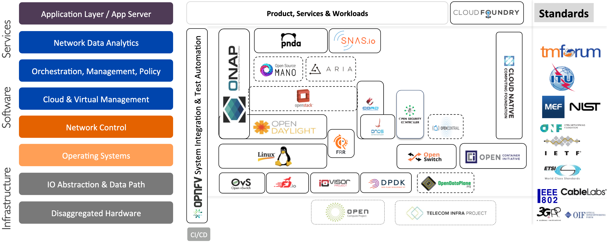

<head>

<!--支持网页公式显示-->    

</head>

<body>

<h4>⚠ 转载请注明出处：<i>作者：ZobinHuang，更新日期：Apr.12 2021</i></h4>

<!--表格-->
<!--
<table border="1" align="center">
  <caption>表格</caption>
  <tr>
    <th>A</th>
    <th>B</th>
    <th>C</th>
  </tr>
  <tr>
    <td>xxx</td>
    <td>xxx</td>
    <td>xxx</td>
  </tr>
</table>
-->

<!--图片-->
<!--

  

-->

<!--正文-->
<!--

&nbsp;&nbsp;&nbsp;&nbsp;公式：`\overline{A}\overline{B}`

-->

<h2>1. 三大基金会与云计算</h2>

  <table border="1" align="center">
  <caption>三大基金会云计算方面涉猎</caption>
  <tr>
    <th rowspan="2">Foudation</th>
    <th rowspan="2">硬件</th>
    <th colspan="3">容器/虚拟化与虚拟化虚拟化管理</th>
    <th rowspan="2">跨容器和资源调度的管理和应用</th>
  </tr>
  <tr>
    <th>容器</th>
    <th>虚拟化</th>
    <th>虚拟化管理</th>
  </tr>
  <tr>
    <td><b>Linux 基金会</b</td>
    <td>√</td>
    <td><b>Open Container Initiative (OCI)</b> with Docker</td>
    <td><b>KVM</b>, <b>Xen</b></td>
    <td>×</td>
    <td>Container Native Computing Foundation (CNCF) with Kubernetes</td>
  </tr>
  <tr>
    <td><b>OpenStack 基金会</b</td>
    <td></td>
    <td></td>
    <td></td>
    <td>√</td>
    <td></td>
  </tr>
  <tr>
    <td><b>Apache 基金会</b</td>
    <td></td>
    <td></td>
    <td></td>
    <td></td>
    <td></td>
  </tr>
</table>

<h2>2. 开源网络生态 (Landscape)</h2>

  

    
  

  

    &nbsp;&nbsp;&nbsp;&nbsp;基于上面这张大地图[1]，我们将我们在这一个系列中要讲述的网络自底向上分为三个部分：<b>基础设施 (Infrastructure)</b>，<b>管理和控制 (Management & Control)</b> 和 <b>上层服务 (Service)</b>，以下我们就分成这三点，对整个Linux开源网络的生态作大致介绍。
  

  <!--第一部分：基础设施-->
  

    

      <h3>(A) 基础设施</h3>
    

    

      <h4>&nbsp;&nbsp;&nbsp;&nbsp;(1) 开源硬件 [Disaggregated Hardware]</h4>
      

        &nbsp;&nbsp;&nbsp;&nbsp;对于传统的交换机，供应商提供的软件和硬件是绑定的，也就是说交换机用户 (即各个云服务提供企业) 无法为自己购置的交换机选择操作系统，造成了很大的限制。因此在多方面的推动下，网络硬件的设计逐渐朝着 <b>模块化</b> 和 <b>开放标准化</b> 的方向逐渐发展。具有代表性的有：Facebook推动的致力于打破 IT infrastructure black box 的 <b>Open Compute Project (OCP)</b>[2]，其在2013年成立了针对网络的工作组，联合硬件厂商聚焦 TOR 的开放硬件标准，Facebook在2016年又成立了 <b>Telecom Infra Project (TIP)</b>[3]，研究构建部署电信网络基础设施的方法。
      

    

     
    

      <h4>&nbsp;&nbsp;&nbsp;&nbsp;(2) 数据通路和虚拟交换 [IO Abstraction & Data Path]</h4>
      <h4>&nbsp;&nbsp;&nbsp;&nbsp;&nbsp;&nbsp;&nbsp;&nbsp;(a) DPDK (Data Plane Development Kit, 数据平面开发套件)</h4>
      

        
      

      

        &nbsp;&nbsp;&nbsp;&nbsp;DPDK[4] 是一个由 Linux基金会管理的开源项目，DPDK 技术通过绕过内核的方式，提供了高性能的数据包处理流程。可以很容易看出，与传统 Linux 协议栈所关注的通用性不同，DPDK 的关注点在于数据包高性能处理。
      

      <h4>&nbsp;&nbsp;&nbsp;&nbsp;&nbsp;&nbsp;&nbsp;&nbsp;(b) OVS (Open vSwitch) 和 OVS-DPDK</h4>
      

        &nbsp;&nbsp;&nbsp;&nbsp;OVS[5] 也是一个由 Linux基金会管理的开源项目，其为构建交换机虚拟网络提供了基于 SDN 的工业级的虚拟交换机，其支持 OpenFlow 协议和 OVSDB 协议。最初版本的 OVS 把数据通路放在了 Linux 内核中实现，因此其性能也就受限于 Linux内核协议栈的性能。OVS-DPDK 使用了 DPDK 对 OVS 进行优化，它是用户态的 vSwitch，数据包在用户态进行处理，提高了虚拟交换的性能。
      

      <h4>&nbsp;&nbsp;&nbsp;&nbsp;&nbsp;&nbsp;&nbsp;&nbsp;(c) FD.IO (Fast Data Input/Output)  [?]  </h4>
      

        &nbsp;&nbsp;&nbsp;&nbsp;FD.IO[6] 也是一个由 Linux基金会管理的开源项目，在通用的硬件平台上提供了灵活的，组件化的和可扩展的高性能 I/O 服务框架，具体细节待理解了具体工作流程再进行补充。
      

    

     
    

      <h4>&nbsp;&nbsp;&nbsp;&nbsp;(3) 操作系统 [Operatiing System]</h4>
      <h4>&nbsp;&nbsp;&nbsp;&nbsp;&nbsp;&nbsp;&nbsp;&nbsp;(a) Linux</h4>
      

        &nbsp;&nbsp;&nbsp;&nbsp;Linux操作系统中，网络分为：<b>协议栈</b> 和 <b>驱动程序</b> 两个层次，前者主要实现 TCP/IP 协议的逻辑，后者主要负责连接网络协议栈和网络硬件设备。再进行细分，又可以分为一下几个部分：
         &nbsp;&nbsp;&nbsp;&nbsp;&nbsp;&nbsp;&nbsp;&nbsp;(1) 网络驱动程序
         &nbsp;&nbsp;&nbsp;&nbsp;&nbsp;&nbsp;&nbsp;&nbsp;(2) Linux 网络接口：逻辑上的网络设备，必须与真实网卡绑定才能够实现实际的对外的数据的收发。
         &nbsp;&nbsp;&nbsp;&nbsp;&nbsp;&nbsp;&nbsp;&nbsp;(3) Linux Bridge (网桥)：工作于二层的虚拟网络设备，Linux 网络接口可以绑定到网桥上面。
         &nbsp;&nbsp;&nbsp;&nbsp;&nbsp;&nbsp;&nbsp;&nbsp;(4) Linux TCP/IP协议栈：处理IP, ICMP, ARP, TCP/UDP/SCTP等协议。
         &nbsp;&nbsp;&nbsp;&nbsp;&nbsp;&nbsp;&nbsp;&nbsp;(5) Linux Socket 函数库：暴露给用户空间程序的函数库，封装了系统调用以使用内核的网络功能。
         &nbsp;&nbsp;&nbsp;&nbsp;&nbsp;&nbsp;&nbsp;&nbsp;(6) Linux 应用层协议：处理更高层的协议，比如 DNS, HTTP, SSH, Telnet等。
      

    

     
  

   

  <!--第二部分：管理和控制-->
  

    

      <h3>(B) 管理和控制</h3>
    

    

      <h4>&nbsp;&nbsp;&nbsp;&nbsp;(1) 网络控制 [Network Control]</h4>
      

        &nbsp;&nbsp;&nbsp;&nbsp;SDN的出现，网络的控制平面从网络设备中被解耦出来，放到了控制器 (SDNC, SDN Control) 中，以统一控制、管理网络中设备。类比计算机操作系统的概念，我们也在这抽象出了网络操作系统的概念。在这一小节，我们关注一下业界在网络控制的相关工作。
      

      <h4>&nbsp;&nbsp;&nbsp;&nbsp;&nbsp;&nbsp;&nbsp;&nbsp;(a) OpenDaylight (ODL)</h4>
      

        &nbsp;&nbsp;&nbsp;&nbsp;ODL[7] 是 Linux 基金会和 Cisco、Juniper 和 Broadcom 等公司一起创立的开源项目，致力于推出一个通用的 SDN 控制平台。其支持 OpenFlow、Netconf 和 OVSDB 等多种南向接口、支持分布式集群 以及 支持动态地组合不同的功能模块。
      

      <h4>&nbsp;&nbsp;&nbsp;&nbsp;&nbsp;&nbsp;&nbsp;&nbsp;(b) Open Network Operating System (ONOS)</h4>
      

        &nbsp;&nbsp;&nbsp;&nbsp;ONOS[8] 是 Open Networking 基金会和 AT&T、爱立信、华为和因特尔等一起推出的同样是SDN控制器平台，被包装成了一个 “开放的网络操作系统”，其目的是为了对抗 ODL。ONOS 的目标在于为服务提供商级别的客户提供即 高性能 又 可编程 的运营商网络。
      

      <h4>&nbsp;&nbsp;&nbsp;&nbsp;&nbsp;&nbsp;&nbsp;&nbsp;(c) Tungsten Fabric</h4>
      

        &nbsp;&nbsp;&nbsp;&nbsp;Tungsten Fabric [9] 是 Juniper 的开源 SDN 控制器 OpenContrail 向 Linux 基金会迁移并更名得来的。
      

    

     
    

      <h4>&nbsp;&nbsp;&nbsp;&nbsp;(2) 云平台 [Cloud & Virtual Management]</h4>
      <h4>&nbsp;&nbsp;&nbsp;&nbsp;&nbsp;&nbsp;&nbsp;&nbsp;(a) Open Stack</h4>
      

        &nbsp;&nbsp;&nbsp;&nbsp;Open Stack[10] 是 OpenStack 基金会下的开源云平台项目，目的是为 IaaS (基础设施即服务) 提供一套解决方案，其管理的对象是 VM。OpenStack 是由很多的组件 (component) 组成的[11]，有些组件是部署云必须的，有些是可选的。这些组件都向上提供 API 来 enable 对底层资源的使用。
         &nbsp;&nbsp;&nbsp;&nbsp;<b>Neutron</b>[12] 是 OpenStack 中与网络有关的组件，部署后，用户可以通过调用 API 的方式，自定义云上虚拟机间的网络连接，构建二层隔离网段，为虚拟机进行网络编址等，以上说的这些都是 Neutron 的原生插件，即 Core Plugin，除此之外 Neutron 还支持其他功能，如 L3 Router, Firewall, Loadbalancer, VPN等，这些则属于 Service Plugin，这些插件则需要厂家自行扩展。
      

      <h4>&nbsp;&nbsp;&nbsp;&nbsp;&nbsp;&nbsp;&nbsp;&nbsp;(b) Kubernetes</h4>
      

        &nbsp;&nbsp;&nbsp;&nbsp;将云上的应用以虚拟机的形式部署时，会出现以下问题：
         &nbsp;&nbsp;&nbsp;&nbsp;&nbsp;&nbsp;&nbsp;&nbsp;(1) 每一个虚拟机都会产生自身运行的操作系统的开销，因此资源的有效利用率会较低
         &nbsp;&nbsp;&nbsp;&nbsp;&nbsp;&nbsp;&nbsp;&nbsp;(2) <b>开发</b> 和 <b>运维</b> 的环境都很复杂，势必会存在差异，这种差异导致了在部署上线应用时，需要处理环境差异导致的问题。
         &nbsp;&nbsp;&nbsp;&nbsp;容器技术的出现解决了上述的两个问题，容器允许开发者把开发环境和应用打包带走，并且可以在任意的环境下运行。所以我们除了有对 <b>虚拟机</b> 进行管理的 OpenStack，业界里还有对 <b>容器</b> 进行管理的开源项目 Kubernetes (aka k8s)[13]，这是一个由谷歌开创，后来挂在 Linux 基金会下的开源项目。
      

    

     
    

      <h4>&nbsp;&nbsp;&nbsp;&nbsp;(3) 网络编排 [Orchestration, Management, Policy]</h4>
      

        &nbsp;&nbsp;&nbsp;&nbsp;我们都有网络功能虚拟化的概念，那么我们对于如何部署、编排虚拟网络功能也需要有一个系统予以实现。因此在 NFV 体系中，我们有 NFV MANO (NFV Manegement and Orchestration) 系统的概念，在开源生态中，我们可以看见 Open Source MANO 项目[14]。
      

    

     
  

   

  <!--第三部分：上层服务-->
  

    

      <h3>(C) 上层服务</h3>
    

    

      <h4>&nbsp;&nbsp;&nbsp;&nbsp;(1) 网络数据分析 [Network Data Analysis]</h4>
      

        &nbsp;&nbsp;&nbsp;&nbsp;例子：Linux基金会下的 PNDA[15]
      

    

     
  

<!--ref-->

<h2>附录：参考源</h2>

  

  1. The Linux Foundation, <b><a href="http://events17.linuxfoundation.org/sites/events/files/slides/Keynote%20Presentation_Joshipura.pdf">Open Source Networking</a></b>
  2. Facebook, <b><a href="https://www.opencompute.org/">Open Compute Project</a></b>
  3. Facebook, <b><a href="https://telecominfraproject.com/">Telecom Infra Project</a></b>
  4. The Linux Foundation, <b><a href="https://www.dpdk.org/">DPDK</a></b>
  5. The Linux Foundation, <b><a href="https://www.openvswitch.org/">OVS</a></b>
  6. The Linux Foundation, <b><a href="https://fd.io/">FD.IO</a></b>
  7. The Linux Foundation, <b><a href="https://www.opendaylight.org/">OpenDaylight</a></b>
  8. The Open Networking Foundation, <b><a href="https://opennetworking.org/onos/">Open Network Operating System</a></b>
  9. The Linux Foundation, <b><a href="https://tungsten.io/">Tungsten Fabric</a></b>
  10. The OpenStack Foundation, <b><a href="https://www.openstack.org/">OpenStack</a></b>
  11. The OpenStack Foundation, <b><a href="https://www.openstack.org/software/project-navigator/openstack-components#openstack-services">OpenStack Components</a></b>
  12. The OpenStack Foundation, <b><a href="https://www.openstack.org/software/releases/victoria/components/neutron">OpenStack Neutron</a></b>
  13. The Linux Foundation, <b><a href="https://kubernetes.io/">Kubernetes</a></b>
  14. <b><a href="https://osm.etsi.org/">Open Source MANO</a></b>
  15. The Linux Foundation, <b><a href="http://pnda.io/">PNDA</a></b>
  

</body>