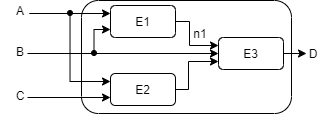
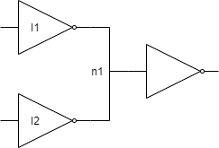
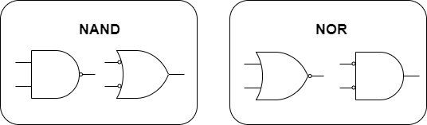
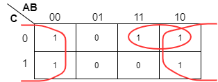
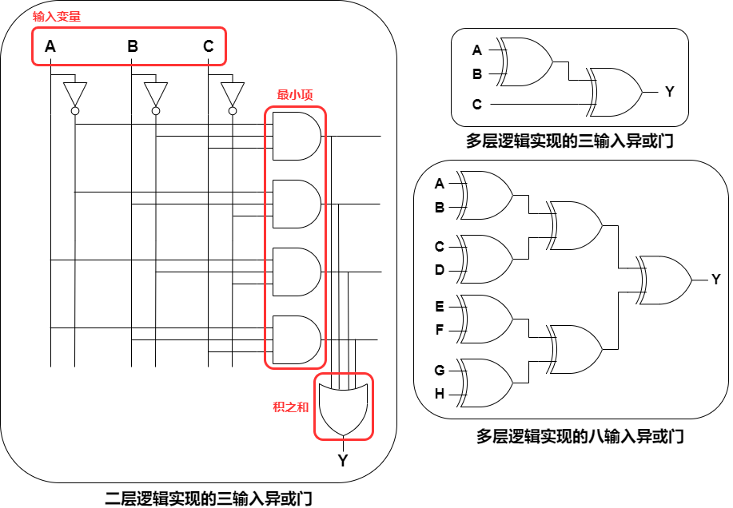
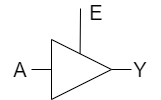
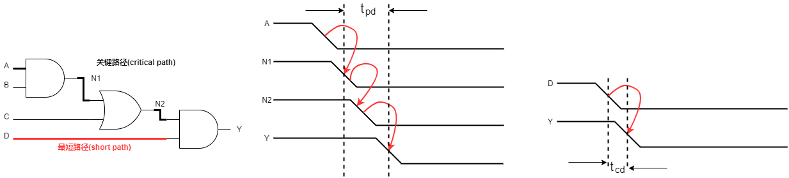
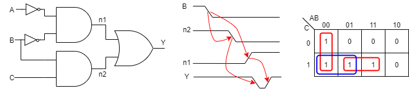

<head>

<!--支持网页公式显示-->    

</head>

<body>

<h3>更新时间：Jan.24 2021</h3>

<!--

  <h4>⚠ 转载请注明出处：<i>作者：ZobinHuang，更新日期：Jan.24 2021</i></h4>

-->

<h2>1. 节点(node)和元件(element)的概念</h2>

  

    
  

  

    &nbsp;&nbsp;&nbsp;&nbsp;电路由<b>节点</b>和<b>元件</b>组成。元件本身又是一个带有输入、输出、功能规范和时序规范的电路，如上图E1，E2，E3所示。节点的本质就是一段导线，<b>输入节点</b>接收外部世界的值，如上图A，B，C所示；<b>输出节点</b>输出值到外部世界，如上图D所示；既不是输入节点也不是输出节点的节点是<b>内部节点</b>，如上图n1所示。
  

<h2>2. 组合电路(combinational circuit)的概念</h2>

  |组合电路功能规范|组合电路时序规范|
  |:-:|:-:|
  |当前各种输入值所对应的输出值|从输入到输出延迟的最大值和最小值|

  

    
  

  

  &nbsp;&nbsp;&nbsp;&nbsp;组合电路的输出仅仅取决于输入值，是没有记忆的电路。只有当满足以下所有条件时，才能认为一个电路是组合电路：
   &nbsp;&nbsp;&nbsp;&nbsp;1. 每一个电路元件本身都是组合电路。
   &nbsp;&nbsp;&nbsp;&nbsp;2. 每一个电路节点，或者是<b>一个</b>电路的输入，或者是连接到外部电路的<b>一个</b>输出。因此注意上图所示的电路并<b>不是</b>组合逻辑电路，因为内部节点n1同时连接了I1和I2的输出。
   &nbsp;&nbsp;&nbsp;&nbsp;3. 电路不包含回路，经过电路的每条路径最多只能经过每个电路节点一次。
  

<h2>3. 组合电路的功能规范</h2>

  

  &nbsp;&nbsp;&nbsp;&nbsp;组合电路的功能规范常用<b>真值表</b>或者<b>布尔表达式</b>来表示。以下将分别对其进行解释，然后会具体阐述以下几个问题：
   &nbsp;&nbsp;&nbsp;&nbsp;(1) 如何通过真值表得到布尔表达式？
   &nbsp;&nbsp;&nbsp;&nbsp;(2) 如何使用布尔代数和卡诺图来化简表达式？
   &nbsp;&nbsp;&nbsp;&nbsp;(3) 如何通过逻辑门来实现这些表达式并分析这些电路的速度？
  

  <h3>3.1 布尔表达式</h3>

  <h4>3.1.1 与布尔表达式相关的术语</h4>
  

      &nbsp;&nbsp;&nbsp;&nbsp;(1) <b>项(literal)</b>：一个变量 `A` 以及它的非(complement) `\overline{A}` 都是项。
   &nbsp;&nbsp;&nbsp;&nbsp;(2) <b>乘积项(product)</b> & <b>蕴含项(implicant)</b>：一项或多项的AND，如`A\overline{B}C`等。
   &nbsp;&nbsp;&nbsp;&nbsp;(3) <b>最小项(minterm)</b>：包含全部输入变量的乘积项，如有输入变量`A`，`B`，`C`，
                                                      `A\overline{B}\overline{C}`就是一个最小项，而`A\overline{B}`不是。
   &nbsp;&nbsp;&nbsp;&nbsp;(4) <b>求和项(sum)</b>：一项或多项的OR，如`A + \overline{B}`等。
   &nbsp;&nbsp;&nbsp;&nbsp;(5) <b>最大项(maxterm)</b>：包含全部输入变量的求和项，如有输入变量`A`，`B`，`C`，
                                                      `A + \overline{B} + \overline{C}`就是一个最大项。
  

  <h4>3.1.2 与或式(sum-of-product，积之和)</h4>
  

  &nbsp;&nbsp;&nbsp;&nbsp;布尔代数的第一种表示方式是与或式。其原理是真值表中的每一行都可以与<b>一个为TRUE的最小项</b>关联，把真值表中所有输出为TURE的这些最小项相加，就可以满足使系统输出为TRUE的所有输入条件<b>（只要系统输入满足其中任何一个这样的最小项，系统输出就为TRUE。一个为TURE就行，因此是最小项相OR的逻辑）</b>，所以可以使用与或式来描述真值表，具体例子如下所示：
  

  

    <table align="center">
      <caption>包含多个TRUE最小项的真值表</caption>
      <tr>
        <th>A</th>
        <th>B</th>
        <th>Y</th>
        <th>最小项</th>
        <th>最小项名称</th>
      </tr>
      <tr>
        <td>0</td>
        <td>0</td>
        <td>0</td>
        <td>`\overline{A}\overline{B}`</td>
        <td>`m_0`</td>
      </tr>
      <tr>
        <td><b>0</b></td>
        <td><b>1</b></td>
        <td><b>1</b></td>
        <td><b>`\overline{A}B`</b></td>
        <td><b>`m_1`</b></td>
      </tr>
      <tr>
        <td>1</td>
        <td>0</td>
        <td>0</td>
        <td>`A\overline{B}`</td>
        <td>`m_2`</td>
      </tr>
      <tr>
        <td><b>1</b></td>
        <td><b>1</b></td>
        <td><b>1</b></td>
        <td><b>`AB`</b></td>
        <td><b>`m_3`</b></td>
      </tr>
    </table>
  

  

  &nbsp;&nbsp;&nbsp;&nbsp;分析上面真值表，将所有输出为TRUE的最小项相加，可得所对应的布尔表达式为：`Y = \overline{A}B  + AB`，
   有时也将与或式记为 `F(A,B) = \sum(m_1, m_3)`。
  

  <h4>3.1.3 或与式(product-of-sums，和之积)</h4>
  

  &nbsp;&nbsp;&nbsp;&nbsp;布尔表达式的另一种表达式是或与式。其原理是真值表中的每一行都可以与<b>一个为FALSE的最大项</b>关联，把真值表中所有输出为FALSE的这些最大项相乘，就可以满足使系统输出为FALSE的所有输入条件<b>（只要系统输入满足其中任何一个这样的最大项，系统输出就为FALSE，一个为FALSE就行，因此是最大项相AND的逻辑）</b>，所以可以使用或与式来描述真值表，具体例子如下所示：
  

  <table align="center">
    <caption>包含多个FALSE最大项的真值表</caption>
    <tr>
      <th>A</th>
      <th>B</th>
      <th>Y</th>
      <th>最大项</th>
      <th>最大项名称</th>
    </tr>
    <tr>
      <td><b>0</td>
      <td><b>0</td>
      <td><b>0</td>
      <td><b>`A + B`</td>
      <td><b>`M_0`</td>
    </tr>
    <tr>
      <td>0</td>
      <td>1</td>
      <td>1</td>
      <td>`A + \overline{B}`</td>
      <td>`M_1`</td>
    </tr>
    <tr>
      <td><b>1</b></td>
      <td><b>0</b></td>
      <td><b>0</b></td>
      <td><b>`\overline{A} + B`</b></td>
      <td><b>`M_2`</b></td>
    </tr>
    <tr>
      <td>1</td>
      <td>1</td>
      <td>1</td>
      <td>`\overline{A} + \overline{B}`</td>
      <td>`M_3`</td>
    </tr>
  </table>
  

  &nbsp;&nbsp;&nbsp;&nbsp;分析上面真值表，将所有输出为FALSE的最大项相乘，可得所对应的布尔表达式为：`Y = (A + B)(\overline{A} + B)`，
   有时也将与或式记为 `F(A,B) = \prod(M_1, M_3)`。
  

  <h3>3.2 化简布尔表达式</h3>
  

  &nbsp;&nbsp;&nbsp;&nbsp;基于上面的阐述，我们可以从真值表中获取布尔表达式，但是这样得到的布尔表达式并不一定是最简单的形式。我们的目标是尽可能的用更少的逻辑门完成我们所要的电路功能，因此我们必须尝试化简布尔表达式。化简的工具之一是<b>布尔代数</b>。布尔代数以一组事先假定正确的公理为基础，这组公理无需证明，使用这组公理可以推出布尔代数的所有定理。本文不在公理和定理处花过多的解释文笔，仅罗列出所有的公理和定理，供随时参考，读者阅读时可以在心中把公理和定理都过一遍。
  

  <h4>3.2.1 布尔代数的公理和定理</h4>
  
备注：对偶的含义是：如果符号0和1互换，操作符`\cdot`(AND)和`+`(OR)互换，表达式依然正确。

  <table align="center">
    <caption>布尔代数的公理</caption>
    <tr>
      <th> </th>
      <th>公理</th>
      <th> </th>
      <th>对偶公理</th>
      <th>名称</th>
    </tr>
    <tr>
      <td>`A_1`</td>
      <td>`B=0`&nbsp;如果&nbsp;`B\ne1`</td>
      <td>`A_1'`</td>
      <td>`B=1`&nbsp;如果&nbsp;`B\ne0`</td>
      <td>二进制量</td>
    </tr>
    <tr>
      <td>`A_2`</td>
      <td>`\overline{0}=1`</td>
      <td>`A_2'`</td>
      <td>`\overline{1}=0`</td>
      <td>NOT</td>
    </tr>
    <tr>
      <td>`A_3`</td>
      <td>`0\cdot0=0`</td>
      <td>`A_3'`</td>
      <td>`1+1=1`</td>
      <td>AND/OR</td>
    </tr>
    <tr>
      <td>`A_4`</td>
      <td>`1\cdot1=1`</td>
      <td>`A_4'`</td>
      <td>`0+0=0`</td>
      <td>AND/OR</td>
    </tr>
    <tr>
      <td>`A_5`</td>
      <td>`1\cdot0=0\cdot1=0`</td>
      <td>`A_5'`</td>
      <td>`1+0=0+1=1`</td>
      <td>AND/OR</td>
    </tr>
  </table>
  <table align="center">
    <caption>单变量的布尔代数定理</caption>
    <tr>
      <th> </th>
      <th>定理</th>
      <th> </th>
      <th>对偶定理</th>
      <th>名称</th>
    </tr>
    <tr>
      <td>`T_1`</td>
      <td>`B\cdot1=B`</td>
      <td>`T_1'`</td>
      <td>`B+0=B`</td>
      <td>同一性定理</td>
    </tr>
    <tr>
      <td>`T_2`</td>
      <td>`B\cdot0=0`</td>
      <td>`T_2'`</td>
      <td>`B+1=1`</td>
      <td>零元定理</td>
    </tr>
    <tr>
      <td>`T_3`</td>
      <td>`B\cdotB=B`</td>
      <td>`T_3'`</td>
      <td>`B+B=B`</td>
      <td>重叠定理</td>
    </tr>
    <tr>
      <td>`T_4`</td>
      <td colspan = "3">`\overline{\overline{B}}=B`</td>
      <td>回旋定理</td>
    </tr>
    <tr>
      <td>`T_5`</td>
      <td>`B\cdot\overline{B}=0`</td>
      <td>`T_5'`</td>
      <td>`B+\overline{B}=1`</td>
      <td>互补定理</td>
    </tr>
  </table>
  <table align="center">
    <caption>多变量的布尔代数定理</caption>
    <tr>
      <th> </th>
      <th>定理</th>
      <th> </th>
      <th>对偶定理</th>
      <th>名称</th>
    </tr>
    <tr>
      <td>`T_6`</td>
      <td>`B\cdotC=C\cdotB`</td>
      <td>`T_6'`</td>
      <td>`B+C=C+B`</td>
      <td>交换律</td>
    </tr>
    <tr>
      <td>`T_7`</td>
      <td>`(B\cdotC)\cdotD=B\cdot(C\cdotD)`</td>
      <td>`T_7'`</td>
      <td>`(B+C)+D=B+(C+D)`</td>
      <td>结合律</td>
    </tr>
    <tr>
      <td><b>`T_8`</b></td>
      <td><b>`(B\cdotC)+(B\cdotD)=B\cdot(C+D)`</td>
      <td><b>`T_8'`</b></td>
      <td><b>
      `(B+C)\cdot(B+D)`
      `=\underbrace{[B+B\cdotC+B\cdotD]}_{吸收律}+C\cdotD`
      `=B+(C\cdotD)`
      </b></td>
      <td><b>分配律</b></td>
    </tr>
    <tr>
      <td><b>`T_9`</b></td>
      <td><b>`B\cdot(B+C)=B`</b></td>
      <td><b>`T_9'`</b></td>
      <td><b>`B+(B\cdotC)=B`</b></td>
      <td><b>吸收律</b></td>
    </tr>
    <tr>
      <td><b>`T_10`</b></td>
      <td><b>`(B\cdotC)+(B\cdot\overline{C})=B`</b></td>
      <td><b>`T_10'`</b></td>
      <td><b>`(B+C)\cdot(B+\overline{C})=B`</b></td>
      <td><b>合并律</b></td>
    </tr>
    <tr>
      <td><b>`T_11`</b></td>
      <td><b>`(B\cdotC)+(\overline{B}\cdotD)+(C\cdotD)=B\cdotC+\overline{B}\cdotD`</b></td>
      <td><b>`T_11'`</b></td>
      <td><b>`(B+C)\cdot(\overline{B}+D)\cdot(C+D)=(B+C)\cdot(\overline{B}+D)`</b></td>
      <td><b>一致律</b></td>
    </tr>
    <tr>
      <td><b>`T_12`</b></td>
      <td><b>`\overline{B_0\cdotB_1\cdotB_2\cdot...}=(\overline{B_0}+\overline{B_1}+\overline{B_2}+...)`</b></td>
      <td><b>`T_12'`</b></td>
      <td><b>`\overline{B_0+B_1+B_2+...}=(\overline{B_0}\cdot\overline{B_1}\cdot\overline{B_2}\cdot...)`</b></td>
      <td><b>德·摩根定理</b></td>
    </tr>
  </table>
  

  &nbsp;&nbsp;&nbsp;&nbsp;使用布尔代数化简布尔表达式的精髓：`P\overline{A}+PA=P`，其中P可以是任何最小项。举个例子
   &nbsp;&nbsp;&nbsp;&nbsp;`\overline{A}\overline{B}\overline{C}+A\overline{B}\overline{C}+A\overline{B}C`
   `=\underbrace{\overline{A}\overline{B}\overline{C}+A\overline{B}\overline{C}}_{合并}+\underbrace{A\overline{B}\overline{C}+A\overline{B}C}_{合并}`
   `=\overline{B}\overline{C}+A\overline{B}`
  

  <h4>3.2.2 德摩根定律和推气泡</h4>
  

    
  

  

  &nbsp;&nbsp;&nbsp;&nbsp;德摩根定律用文字概括即是：所有项的乘积的补等于每个项各自取补后相加，对偶形式亦然。该定律是数字设计中十分有用的定律，在CMOS电路中，工程师更偏爱使用NAND和NOR Gate而不是AND和OR Gate。但是从带有很多NAND和NOR Gate的电路中读出电路的布尔表达式是十分难受的，因此可以使用德摩根定律来化简电路，将NAND和NOR化简为带逆变器输入的AND和OR，俗称推气泡(bubble)。如上图所示，<b>一个与非门等效于一个带逆变器输入的或门，一个或非门等效于一个带逆变器输入的与门。</b>推气泡的原则如下：
   &nbsp;&nbsp;&nbsp;&nbsp;1. 从电路的输出端开始向输入方向推，从最后一级开始，根据德摩根定律，将NAND和NOR Gate替换为带逆变器的AND和OR Gate。
   &nbsp;&nbsp;&nbsp;&nbsp;2. 替换后，若输入端存在逆变器，则把该逆变器踢到前一级的输出端去，使前一级变为NAND或者NOR Gate（如果前一级输出已经有逆变器则直接抵消），然后继续化简。
  

  <h4>3.2.3 卡诺图 (Karnaugh Map)</h4>
  

    
  

  

  &nbsp;&nbsp;&nbsp;&nbsp;上文说到，使用布尔代数化简布尔表达式的精髓是`P\overline{A}+PA=P`，其中P可以是任何最小项。除了使用布尔代数来化简布尔表达式，为了更加直观地进行化简，由贝尔实验室的电信工程师Maurice Karnaugh在1953年发明的卡诺图实现了对布尔表达式的可视化化简，保证化简后的布尔表达式会是最简的形式。下面简要阐述卡诺图的运作原理。
  

  

  &nbsp;&nbsp;&nbsp;&nbsp;如上图所示,卡诺图方格中的1和0代表了对应输入的输出值。其实每一个方格就对应了一个为TURE的最小项，注意到每一个方格与相邻方格只有一个输入变量的值不同，也即是说在绘制卡诺图时，输入变量的排布是以格雷码的顺序排布的，这种排序方式的用意就是当相邻的方格中的数字都为1时，这些方格所代表的最小项就可以被合并，合并方格的原则如下所示：
   &nbsp;&nbsp;&nbsp;&nbsp;1. 用最少的圈来圈住全部所有的1。
   &nbsp;&nbsp;&nbsp;&nbsp;2. 每个圈中的所有方格必须都包含1。
   &nbsp;&nbsp;&nbsp;&nbsp;3. 每个圈的边长都必须是2的整数次幂。
   &nbsp;&nbsp;&nbsp;&nbsp;4. 每个圈必须尽可能的大。
   &nbsp;&nbsp;&nbsp;&nbsp;5. 圈可以跨越卡诺图的边界，如上图中的大圈。
   &nbsp;&nbsp;&nbsp;&nbsp;6. 卡诺图中同一个方格可以被多个圈包含。
  

  <h4>3.4 总结</h4>
  

  综上所述，<b>布尔代数</b>，<b>卡诺图</b>是两种逻辑化简方法，其目的都是为了找出开销最低的特定逻辑函数的电路实现方法。在实践中，常借助数字逻辑设计软件(e.g. Vivado, Quartus等)的<b>逻辑综合(logic systhesizer)</b>功能来化简电路。
  

<h2>4. 实际组合逻辑电路</h2>

  <h3>4.1 将布尔表达式映射至电路：二层逻辑和多层逻辑</h3>
  

  &nbsp;&nbsp;&nbsp;&nbsp;这本节我们将会把上文所描述的布尔表达式映射至真正的数字电路上。在上文的描述中，我们可以注意到与或式其实就是把最小项相加起来，因此我们称与或式为<b>两级逻辑</b>：第一级逻辑是在与门中连接相应的输入信号，第二级逻辑是在或门中连接与门的输出信号。而在实践中，常使用<b>多级逻辑</b>而非两级逻辑，因为多级组合电路使用的硬件比两级组合电路更少，下面是一个N输入异或门的例子（异或门原理：奇数个输入为TRUE时输出为TRUE），可以感受一下硬件的减少。
  

  

    
  

  

  &nbsp;&nbsp;&nbsp;&nbsp;如上左图所示，这是一个使用两级逻辑实现的三输入异或门(`Y=\overline{A}\overline{B}C+\overline{A}B\overline{C}+A\overline{B}\overline{C}+ABC`)，一共使用了3个非门，4个三输入与门和1个四输入或门。注意到其实异或运算是符合结合律的(i.e. `A\oplusB\oplusC=(A\oplusB)\oplusC`)，因此若采用多级逻辑来实现这个三输入异或门，可以使用2个二输入异或门来实现，如右上图所示。1个二输入异或门使用了2个非门，2个二输入与门和1个二输入或门，则使用2个二输入异或门总共消耗了4个非门，4个二输入与门和2个二输入或门，资源消耗相对二层逻辑实现减少。这种减少的程度随着异或门输入变量的增多而变得更加明显，比如1个八输入异或门，若采用两级逻辑实现，则需要`(2^8)\div2=128`个八输入与门，8个非门和一个一百二十八输入的或门，采用多层逻辑设计则可以节省很多硬件资源，如右下图所示。直观的硬件资源比较可以查看下表。
  

  

    <table>
    <tr>
      <th rowspan = "2">逻辑电路</th>
      <th colspan = "3">二级逻辑</th>
      <th colspan = "3">多级逻辑</th>
    </tr>
    <tr>
      <td>非门</td>
      <td>与门</td>
      <td>或门</td>
      <td>非门</td>
      <td>与门</td>
      <td>或门</td>
    </tr>
    <tr>
      <td>二输入异或门</td>
      <td>2个</td>
      <td>2个二输入</td>
      <td>1个二输入</td>
      <td>N/A</td>
      <td>N/A</td>
      <td>N/A</td>
    </tr>
    <tr>
      <td>三输入异或门</td>
      <td>3个</td>
      <td>4个三输入</td>
      <td>1个四输入</td>
      <td>4个</td>
      <td>4个二输入</td>
      <td>2个二输入</td>
    </tr>
    <tr>
      <td>八输入异或门</td>
      <td>8个</td>
      <td>128个八输入</td>
      <td>1个一百二十八输入</td>
      <td>14个</td>
      <td>14个二输入</td>
      <td>7个二输入</td>
    </tr>
    </table>
  

  <h3>4.2 符号X和符号Z</h3>
  <h4>4.2.1 符号X：非法值&未初始化值</h4>
  

  &nbsp;&nbsp;&nbsp;&nbsp;在真实电路中，若电路节点同时被0和1驱动，则称这种情况为<b>竞争(contention)</b>，使用符号<b>X</b>来表示该电路节点有未知或非法值。
   &nbsp;&nbsp;&nbsp;&nbsp;在电路仿真器中，符号<b>X</b>也被用于表示一个没有初始化的值。
  

  <h4>4.2.2 符号Z：浮空值</h4>
  

    
  

  

  &nbsp;&nbsp;&nbsp;&nbsp;符号<b>Z</b>表示电路节点既没有被高电平驱动也没有被低电平驱动，即<b>浮空(floating)</b>或<b>高阻态(high impedance)</b>。如左图所示是一个三态缓冲器(tristate buffer)。使能端E为1时，则其为一个普通的缓冲器，将输入值输出到输出值。当使能端E为0时，则输出被设置为浮空。三态缓冲器经常在连接多个芯片的总线上使用。
  

<h2>5. 组合电路的时序规范</h2>

  <h3>5.1 传播延迟和最小延迟</h3>
  

    
  

  

  &nbsp;&nbsp;&nbsp;&nbsp;组合逻辑电路的时序特征包括<b>传播延迟(propagation)</b>和<b>最小延迟(contamination delay)</b>。传播延迟`t_(pd)`是从输入改变直到<b>所有输出</b>达到它们的最终值所经历的时间，最小延迟`t_(cd)`是从输入改变到<b>任何一个输出</b>发生改变的最短时间。在一个电路中，传播延迟是关键路径上每一个元件的传播延迟之和，最小延迟是最短路径上每个元件的最小延迟之和。
  

  <h3>5.2 毛刺与冒险</h3>
  

    
  

  

  &nbsp;&nbsp;&nbsp;&nbsp;在上一节中，我们知道电路从输入到输出稳定是有时间延迟的，既然有延迟，那么电路输出在稳定之前就处于一个不确定的状态。以下面的例子`Y=\overline{A}\overline{B}+BC`为例，当A=0，C=1，B从1变成0时，我们可以看见由于n2和n1节点的变化存在先后顺序——n2先于n1发生变化，因此Y输出在<b>n2变化后n1变化前</b>会有一个短暂的低电平毛刺(glitch)出现，或称之为冒险(hazard)。其实从卡诺图中就可以看出来电路是否存在毛刺：如上图卡诺图红圈所示，上述的输入变化实际上在卡诺图中跨越了主蕴含项的两个圈。因此在一个主蕴含项关闭，另一个主蕴含项开启之前，电路就会出现毛刺。为了消除毛刺，可以增加一个新的主蕴含项来覆盖先前两个主蕴含项的边缘，如上图蓝圈所示。毛刺通常不会导致什么问题，但是了解它们和意识到它们的存在是重要的。
  

<h2>附录：参考书籍</h2>

  
1. David Money Harris, Sarah L Harris, 机械工业出版社, <b>数字设计和计算机体系结构</b>

</body>