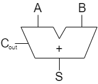
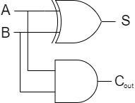
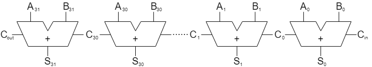
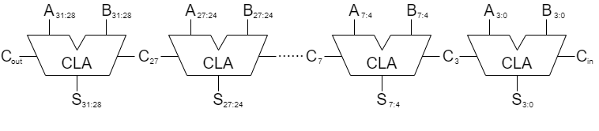
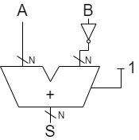
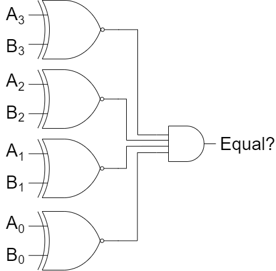
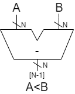
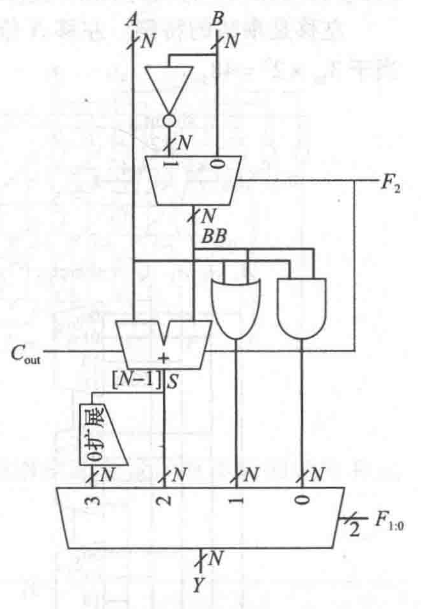

<head>

<!--支持网页公式显示-->    

</head>

<body>

<h3>更新时间：Feb.11 2021</h3>

<!--

  <h4>⚠ 转载请注明出处：<i>作者：ZobinHuang，更新日期：Feb.11 2021</i></h4>

-->

<!--表格-->
<!--
<table border="1" align="center">
  <caption>表格</caption>
  <tr>
    <th>A</th>
    <th>B</th>
    <th>C</th>
  </tr>
  <tr>
    <td>xxx</td>
    <td>xxx</td>
    <td>xxx</td>
  </tr>
</table>
-->
<!--图片-->
<!---->
<!--正文-->
<!--

&nbsp;&nbsp;&nbsp;&nbsp;公式：`\overline{A}\overline{B}`

-->

&nbsp;&nbsp;&nbsp;&nbsp;本文将基于前几篇文章关于组合逻辑电路和时序逻辑电路的描述，以及前文介绍的计算机数值系统，介绍常见的组合电路和时序电路模块，包括算术电路、计数器、移位寄存器、存储器阵列等，探究电路是如何处理计算机数据的。

<h2>1. 算术电路</h2>

  <h3>1.1 加法器</h3>
  <h4>1.1.1 半加器（half adder）</h4>
  

    
  

  

  &nbsp;&nbsp;&nbsp;&nbsp;半加器接受两个1 bit的输入值`A`和`B`，输出1 bit它们相加的和`S`和1 bit进位值`C_(out)`。半加器可以由一个异或门(XOR)和一个与门实现，具体实现和真值表如下所示。（备注：异或门布尔表达式为 `F=A\oplusB=A'B+AB'`，对于n个异或操作 `F=A_1\oplusA_2\oplus...\oplusA_n`，当输入1的个数为奇数个时，输出才为TRUE。）
  

  

    
     `S=A\oplusB`
     `C_(out)=AB`
  

  

    <table align="center">
      <caption>半加器真值表</caption>
      <tr>
        <th>`A`</th>
        <th>`B`</th>
        <th>`C_(out)`</th>
        <th>`S`</th>
      </tr>
      <tr>
        <td>0</td>
        <td>0</td>
        <td>0</td>
        <td>0</td>
      </tr>
      <tr>
        <td>0</td>
        <td>1</td>
        <td>0</td>
        <td>1</td>
      </tr>
      <tr>
        <td>1</td>
        <td>0</td>
        <td>0</td>
        <td>1</td>
      </tr>
      <tr>
        <td>1</td>
        <td>1</td>
        <td>1</td>
        <td>1</td>
      </tr>
    </table>
  

  
  <h4>1.1.2 全加器（full adder）</h4>
  

    
  

  

  &nbsp;&nbsp;&nbsp;&nbsp;相比于半加器，全加器多了一个进位输入`C_(i n)`，以便于构建多位加法器，如上图所示。其真值表和相应布尔表达式如下所示。
  

  

     `S=A\oplusB\oplusC_(i n)`
     `C_(out)=AB+AC_(i n)+BC_(i n)`
  

  

    <table align="center">
      <caption>全加器真值表</caption>
      <tr>
        <th>`C_(i n)`</th>
        <th>`A`</th>
        <th>`B`</th>
        <th>`C_(out)`</th>
        <th>`S`</th>
      </tr>
      <tr>
        <td>0</td>
        <td>0</td>
        <td>0</td>
        <td>0</td>
        <td>0</td>
      </tr>
      <tr>
        <td>0</td>
        <td>0</td>
        <td>1</td>
        <td>0</td>
        <td>1</td>
      </tr>
      <tr>
        <td>0</td>
        <td>1</td>
        <td>0</td>
        <td>0</td>
        <td>1</td>
      </tr>
      <tr>
        <td>0</td>
        <td>1</td>
        <td>1</td>
        <td>1</td>
        <td>0</td>
      </tr>
      <tr>
        <td>1</td>
        <td>0</td>
        <td>0</td>
        <td>0</td>
        <td>1</td>
      </tr>
      <tr>
        <td>1</td>
        <td>0</td>
        <td>1</td>
        <td>1</td>
        <td>0</td>
      </tr>
      <tr>
        <td>1</td>
        <td>1</td>
        <td>0</td>
        <td>1</td>
        <td>0</td>
      </tr>
      <tr>
        <td>1</td>
        <td>1</td>
        <td>1</td>
        <td>1</td>
        <td>1</td>
      </tr>
    </table>
  

  <h4>1.1.3 进位传播加法器(Carry Propagate Adder, CPA)</h4>
  

  &nbsp;&nbsp;&nbsp;&nbsp;N位加法器接收两个N位的输入`A`和`B`，和一个进位值`C_(i n)`，产生一个N位的结果`S`和一个输出进位`C_(out)`，由于1位进位要传播到下一位中，因此这种加法器也被称为<b>进位传播加法器(Carry Propagate Adder, CPA)</b>。
  

  <h5>(1) 行波进位加法器</h5>
  

    
  

  

  &nbsp;&nbsp;&nbsp;&nbsp;构建N位进位传播加法器最简单的办法就是串联N个全加器，如上图所示，这被称为<b>行波进位加法器 (Ripple-carry Adder)</b>。行波进位加法器的缺点是当N比较大时，电路计算的延迟也会变大。设`t_(FA)`是单级全加器的延迟，则含有N级全加器的行波进位加法器的延迟为`t_(r i p p l e)=Nt_(FA)`。
  

  <h5>(2) 先行进位加法器</h5>
  

    
  

  

  &nbsp;&nbsp;&nbsp;&nbsp;造成行波进位加法器计算延迟过高的原因是进位信号必须逐位计算推进。因此工程师们开始考虑在行波进位加法器的基础上添加独立电路，以加快进位信号的计算，这就有了<b>先行进位加法器(Carry-Lookahead Adder)</b>。要构造产生进位信号的独立电路，首先我们必须推导出单独一列的进位信号输出的布尔表达式。在第i位，进位信号 `C_i` 当且仅当在以下两种情况为1：
   &nbsp;&nbsp;&nbsp;&nbsp;1. 当输入 `A_i` 和输入 `B_i` 都为1时；
   &nbsp;&nbsp;&nbsp;&nbsp;2. 当前一位的进位 `C_(i-1)` 为1，且输入 `A_i` 或输入 `B_i` 为1时。
   &nbsp;&nbsp;&nbsp;&nbsp;因此我们可以得到：`C_i=A_i\cdotB_i+C_(i-1)\cdot(A_i+B_i)`。当属于上述第一种情况时，我们说第i位<b>产生</b>了进位，并用 `P_i` 代替表示 `A_i\cdotB_i`，即`P_i=A_i\cdotB_i`；当属于上述第二种情况时，我们说第i位<b>传播</b>了进位，并用 `G_i` 代替表示 `A_i+B_i`，即`G_i=A_i+B_i`。因此进位信号 `C_i` 的布尔表达式可以化简为：`C_i=G_i+C_(i-1)\cdotP_i`。
   &nbsp;&nbsp;&nbsp;&nbsp;分析完单独一列的进位信号布尔表达式，下面我们基于此开始分析连续几列的进位信号输出的布尔表达式，注意下面我们称一个能计算连续几列的加法器为一个<b>CLA块</b>。与上面道理类似，以第3列到第0列的CLA块为例，其进位信号 `C_(3:0)` 当且仅当在以下两种情况为1：
   &nbsp;&nbsp;&nbsp;&nbsp;1. <b>CLA块产生进位</b>：最高有效列产生了一个进位，或者最高有效列传播了前面的列产生的进位，即：
   &nbsp;&nbsp;&nbsp;&nbsp;&nbsp;&nbsp;&nbsp;&nbsp;`G_(3:0)=\underbrace{G_3}_{最高有效列产生进位}+P_3\underbrace{(G_2+P_2(G_1+P_1G_0))}_{前面几列产生进位}`
   &nbsp;&nbsp;&nbsp;&nbsp;2. <b>CLA块传播进位</b>：CLA块中的所有列都能传输输入进位信号，即：
   &nbsp;&nbsp;&nbsp;&nbsp;&nbsp;&nbsp;&nbsp;&nbsp;`P_(3:0)=P_3P_2P_1P_0`
   &nbsp;&nbsp;&nbsp;&nbsp;因此，我们可以得到，第3列到第0列的四位CLA块的进位信号输出布尔表达式为：
   &nbsp;&nbsp;&nbsp;&nbsp;&nbsp;&nbsp;&nbsp;&nbsp;`C_(3:0)=G_(3:0)+C_(0)\cdotP_(3:0)`
   &nbsp;&nbsp;&nbsp;&nbsp;扩展到一般情况，即：
   &nbsp;&nbsp;&nbsp;&nbsp;&nbsp;&nbsp;&nbsp;&nbsp;`C_(i:j)=G_(i:j)+C_(j)\cdotP_(i:j)`
   &nbsp;&nbsp;&nbsp;&nbsp;综上，我们得到了一个四位CLA块的进位信号输出的布尔表达式。注意CLA块同时计算加法和进位信号，进位信号的加速计算，使得下一个CLA块能够更快地进行计算，下面给出一个32位先行进位加法器的例子，注意最后一个CLA块可以只是一个短的4位行波进位加法器。
  

  

    
  

  <h3>1.2 减法器</h3>
  

  &nbsp;&nbsp;&nbsp;&nbsp;在 [数值系统](https://neth-lab.netlify.app/publication/21-4-18-Nubmer_System/) 一节中，我们知道了计算机实现二进制减法的原理是采用补码的形式利用加法器实现的，即:
  

  
  

  &nbsp;&nbsp;&nbsp;&nbsp;&nbsp;&nbsp;&nbsp;&nbsp;`A-B=A+f_(补码)(B)`
  

  

  &nbsp;&nbsp;&nbsp;&nbsp;因此，当我们使用电路来处理减法时，可以通过先使用电路将减数转化为补码形式，然后再与被减数相加的形式来实现，具体的实现形式如下所示。注意到将减数`B`转化为补码的方式采用的是先转化为反码再加1的方法实现的，“反转”操作使用非门实现，“加1”操作通过在加法器的进位输入 `C_(i n)` 上输入1实现。
  

  

    
  

  
  <h3>1.3 比较器</h3>
  <h4>(1) 相等比较器(equality comparator)</h4>
  
  

    
  

  

  &nbsp;&nbsp;&nbsp;&nbsp;相等比较器用于比较两个二进制数是否相等，如上图所示，其原理是使用同或门(XNOR)和与门判断两个二进制数每一位是否相等。
  

  <h4>(2) 量值比较器(magnitude comparator)</h4>
  

    
  

  

  &nbsp;&nbsp;&nbsp;&nbsp;量值比较器用于比较两个数的大小，如上图所示，其原理是使用减法电路得到差值后，判断最高位符号位，若为1则`A < B`，否则`A \geq B`。
  

  <h3>1.4 算术逻辑单元 (Arithmetic/Logic Unit, ALU)</h3>
  

    
  

  

    <table align="center">
      <caption>ALU运算</caption>
      <tr>
        <th>`F_(2:0)`</th>
        <th>功能</th>
        <th>`F_(2:0)`</th>
        <th>功能</th>
      </tr>
      <tr>
        <td>`000`</td>
        <td>`A` AND `B`</td>
        <td>`100`</td>
        <td>`A` AND `B`</td>
      </tr>
    </table>
  

<!--ref-->
<h2>附录：参考源</h2>

1. David Money Harris, Sarah L, Harris, 机械工业出版社, <b>数字设计和计算机体系结构</b>

</body>