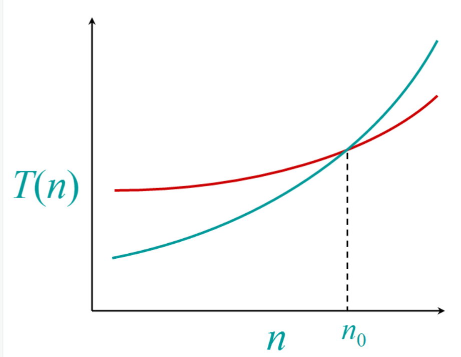
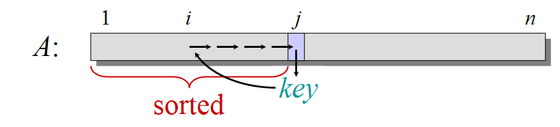
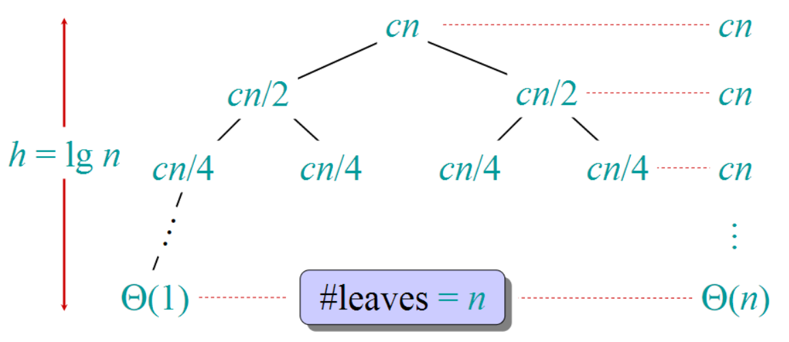

<head>
<style>
    img{margin-left: 20px; margin-right: 20px;}
    p{margin-left: 15px; margin-right: 15px;}
    #table th{text-align:center;}
    #table td{text-align:center;}
    .div_learning_post{font-size: 16px; word-spacing:0px;}
    .div_indicate_source{font-size: 18px; word-spacing:0px; background-color: #E0E0E0;}
</style>
<!--支持网页公式显示-->    
<script type="text/javascript" src="https://cdn.mathjax.org/mathjax/latest/MathJax.js?config=AM_HTMLorMML-full"></script>
</head>

<body>

<div align="center" class="div_indicate_source">
<h4>⚠ 转载请注明出处：<font color="red"><i>作者：ZobinHuang，更新日期：Feb.22 2021</i></font></h4>
</div>

<!--表格-->
<!--
<table border="1" align="center">
  <caption>表格</caption>
  <tr>
    <th>A</th>
    <th>B</th>
    <th>C</th>
  </tr>
  <tr>
    <td>xxx</td>
    <td>xxx</td>
    <td>xxx</td>
  </tr>
</table>
-->

<!--图片-->
<!---->

<!--正文-->
<!--
<p>
&nbsp;&nbsp;&nbsp;&nbsp;公式：<span>`\overline{A}\overline{B}`</span>
</p>
-->

<!--标题-->
<h2>1. 学习算法前的基本问题</h2>
<div class="div_learning_post">
<h3>1.1 什么是算法？</h3>
<p>
&nbsp;&nbsp;&nbsp;&nbsp;算法是一门关于<b>性能(performance)</b>和<b>资源消耗(resource usage)</b>的科学。其中我们主要关注的是性能，改善算法设计有助于提高程序运行性能。
</p>

<h3>1.2 为什么学习算法和性能？</h3>

1. 性能的价值就像是货币，货币是购买其它生活必需品的前提，而性能就是变现为计算机系统用户友好性，安全性，可靠性等的前提。

2. 性能是导致一份代码是否具有可行性的原因，如果我们沉迷于不停地重新实现十年前别人已经实现过的东西，那么工作将是机械性的。如果我们专注于改进算法以提供更好的性能，那么工作将是具有突破性的。

3. 算法数学提供了描述程序行为的统一的简单的方法。

4. 算法充满了乐趣！:) (fast) 
</div>

<h2>2. 算法的分析工具：运行时间 (Running Time)</h2>
<div class="div_learning_post">
  <h3>2.1 算法运行时间的概念</h3>
  <p>
  &nbsp;&nbsp;&nbsp;&nbsp;衡量一个算法好坏的方法是计算 <b>算法运行时间</b>，以下先明确几个点：

  1. 一个算法的运行时间取决于：<b>输入</b>。

  2. 参数化算法运行时间的方法是：<b>输入的大小</b>，即T(n)。

  3. 通常我们会寻找：<b>算法运行时间的上界</b>，作为一种对算法效率的保障。
  </p>


  <h3>2.2 不同的算法运行时间分析</h3>
  <p>
  &nbsp;&nbsp;&nbsp;&nbsp;上面说到，我们通常会寻找算法运行时间的上界来作为对算法效率的衡量，这里我们系统给出对算法效率进行衡量的方法。
  </p>
  
  <h4>&nbsp;&nbsp;&nbsp;&nbsp;(1) 最差情况 (Worst-case)</h4>
  <p>
  &nbsp;&nbsp;&nbsp;&nbsp;&nbsp;&nbsp;&nbsp;&nbsp;<span>`T(n) = `</span> 对于任何输入大小 <span>`n`</span> 的算法的<b>最长运行时间</b>。
  </p>

  <h4>&nbsp;&nbsp;&nbsp;&nbsp;(2) 平均情况 (Average-case)</h4>
  <p>
  &nbsp;&nbsp;&nbsp;&nbsp;&nbsp;&nbsp;&nbsp;&nbsp;在对输入大小 <span>`n`</span> 的概率分布有做假设的前提下，<span>`T(n) = `</span> 对于所有输入大小 <span>`n`</span> 的算法的<b>期望运行时间</b>。
  </p>

  <h4>&nbsp;&nbsp;&nbsp;&nbsp;(3) 最好情况 (Best-case)</h4>
  <p>
  &nbsp;&nbsp;&nbsp;&nbsp;&nbsp;&nbsp;&nbsp;&nbsp;最好情况通常用于说明一个慢的算法在某些特定的输入条件下比其它算法运行得更快。
  </p>

  <p>
  &nbsp;&nbsp;&nbsp;&nbsp;通常，当我们讨论一个算法的运行时间时，我们总是在讨论<b>最长运行时间</b>。
  </p>

  <h3>2.3 排除机器性能的因素</h3>
  <p>&nbsp;&nbsp;&nbsp;&nbsp;当我们在单纯讨论一种算法的效率的时候，我们必须抛除不同机器配置所造成的影响，因此我们必须明确我们所重点关注的是 <b>Machine-independent Time</b>。基本思想就是忽视一切和机器有关的常量，在评估一个算法的时候，我们通过关注 <span>`T(n)`</span> 在 <span>`n \to \infty`</span> 时的增长情况，来横向比较不同算法的效率，这种方法称为 <b>渐近分析 (Asymptotic Analysis)</b>。
  </p>

  <p>&nbsp;&nbsp;&nbsp;&nbsp;在关于算法的渐进分析分析中，为了满足我们只关注 <span>`T(n)`</span> 增长的需求，我们经常使用数学符号 <span>`\Theta`</span> (theta) （我们在下一节将会对其详细展开讨论）。在工程的定义上，对于一个关于 <span>`n`</span> 的多项式，<span>`\Theta`</span> 的意义是弃去所有低阶项且忽略所有常数因子，如 <span>`3n^3 + 90n^2 - 5n + 6046 = \Theta(n^3)`</span>。
  </p>
  
  <div align="center">
    
  </div>

  <p>&nbsp;&nbsp;&nbsp;&nbsp;我们以上图为例，我们可以知道一个时间复杂度为 <span>`\Theta(n^2)`</span> 的算法一定会在 <span>`n`</span> 大于某个值 <span>`n_0`</span> 后优于时间复杂度为 <span>`\Theta(n^3)`</span> 的算法。但是在实际工程里，我们通常还需要观察这个 <span>`n_0`</span> 值是不是在可接受范围内的值，如果它是一个过于庞大的数，那么明显地我们可能还是得选择 <span>`\Theta(n^3)`</span> 的算法，因此不能忽视时间复杂度在数学上体现相对较高的算法。
  </p>
</div>

<h2>3. 开始分析算法：从排序问题切入</h2>
<div class="div_learning_post">
  <h3>3.1 插入排序 (Insertion Sort)</h3>
  <h4> (1) 基本思想</h4>
  <p>
  &nbsp;&nbsp;&nbsp;&nbsp;从数组的第一个元素开始，提取出每一个元素，基于前面已排序的部分，找到合适的位置将其插入进去。
  </p>
  <div align="center">
    
  </div>

  <h4>(2) 伪代码(pseudocode)实现</h4>
</div>

<!--用shell才不会有奇怪的关键字被颜色化-->
```shell
INSERTION-SORT (A, n) ⊳A[1 . . n]
for j ← 2 to n
  do key ← A[j]
    i ← j–1
    while i > 0 and A[i] > key 
      do A[i+1] ← A[i]
        i ← i–1
    A[i+1] = key
```

<div class="div_learning_post">
  <h4>(3) python代码实现</h4>
</div>

```python
def insert_sort(array: list) -> list:
  for j in range(1, len(array)):
    key = array[j]
    i = j - 1
    while i >= 0 and array[i] > key:
        array[i+1] = array[i]
        array[i] = key
        i -= 1
    array[i+1] = key
  return array
```

<div class="div_learning_post">
  <h4>(4) 时间复杂度渐近分析</h4>
  <p>
  &nbsp;&nbsp;&nbsp;&nbsp;(a) <b>最差情况：输入的所有元素是倒序的</b>，那么由于外层循环了 <span>`2 \to n`</span> 次，每个循环里又做了 <span>`\Theta(j)`</span> 次循环，因此我们可以得到：<span>`T(n) = \sum_{j=2}^{n}\Theta(j) = \Theta(n^2)`</span> （算术级数求和）
  <br>&nbsp;&nbsp;&nbsp;&nbsp;(b) <b>平均情况：输入的组合的各种可能性是相等的（平均分布）</b>，那么由于由于外层循环了 <span>`2 \to n`</span> 次，每个循环里平均做了 <span>`\Theta((1+(j-1))/2) = \Theta(j/2)`</span> 次循环，因此我们可以得到：<span>`T(n) = \sum_{j=2}^{n}\Theta(j/2) = \Theta(n^2)`</span>
  </p>

  <h3>3.2 归并排序 (Merge Sort)</h3>
  <h4> (1) 基本思想</h4>
  <div align="center">
    
  </div>
  <p>
  &nbsp;&nbsp;&nbsp;&nbsp;获取一个输入数组，将其等分为两个子数组进行排序，然后对这两个sorted的子数组进行排序合并，并且如此递归。如上图所示，按序合并两个sorted的子数组是很简单的一件事情，只需要按序比较两个子数组还未被合并部分的第一个元素即可，即每个元素的排序都只涉及一次比较，因此效率会很高。
  </p>

  <h4> (2) 基本步骤</h4>
  <p><span>`MERGE-SORT \quad A[1 . . n]`</span>
  <br> &nbsp;&nbsp;&nbsp;&nbsp;<b>STEP 1</b>. 如果 <span>`n = 1`</span>, 那么直接返回 <span>`A[1 . . n]`</span>。
  <br> &nbsp;&nbsp;&nbsp;&nbsp;<b>STEP 2</b>. 提取出 <span>`A[1 ... n/2]`</span> 和 <span>`A[n/2+1 ... n]`</span> 前后两个子列表，递归地将这两个子列表进行排序（调用自身函数对这两个子列表继续进行排序），即<span>`MERGE-SORT \quad A[1 ... n/2]`</span> 和 <span>`MERGE-SORT \quad A[n/2+1 ... n]`</span>。
  <br> &nbsp;&nbsp;&nbsp;&nbsp;<b>STEP 3</b>. “Merge” 两个sorted的子列表。此部分即按序比较两个子数组还未被合并部分的第一个元素即可，所以每个元素的排序都只涉及一次比较。
  </p>
  
  <h4> (3) python代码实现</h4>
</div>

```python
def merge_sort(array: list) -> list:
    # 如果长度为1，直接返回
    if len(array) == 1:
        return array

    # 提取出数组的前半部分和后半部分
    first_half_array = array[0:int(len(array)/2)]
    second_half_array = array[int(len(array)/2):len(array)]

    # 递归调用归并排序代码，获得排序好的前半部分和后半部分
    sorted_first_half_array = merge_sort(first_half_array)
    sorted_second_half_array = merge_sort(second_half_array)

    # 合并sorted的前半部分和后半部分
    i = 0
    j = 0
    new_array = []
    while i < len(sorted_first_half_array) or j < len(sorted_second_half_array):
        if i < len(sorted_first_half_array) and j < len(sorted_second_half_array):
            if sorted_first_half_array[i] < sorted_second_half_array[j]:
                new_array.append(sorted_first_half_array[i])
                i += 1
            else:
                new_array.append(sorted_second_half_array[j])
                j += 1
            continue

        if i < len(sorted_first_half_array):
            new_array.append(sorted_first_half_array[i])
            i += 1

        if j < len(sorted_second_half_array):
            new_array.append(sorted_second_half_array[j])
            j += 1

    return new_array
```

<div class="div_learning_post">
  <h4>(4) 时间复杂度渐近分析</h4>
  <h5>&nbsp;&nbsp;&nbsp;&nbsp;(a) 分析时间复杂度</h5>
  <p>
  &nbsp;&nbsp;&nbsp;&nbsp;设 <span>`MERGE-SORT \quad A[1 . . n]`</span> 的时间复杂度为 <span>`T(n)`</span>，然后我们分别对 <b>(2) 基本步骤</b> 中提到的每一步进行复杂度分析。
  <br>&nbsp;&nbsp;&nbsp;&nbsp;<b>STEP 1</b>: 在这一步中只做了若干次比较操作，因此 <span>`T_1(n) = \Theta(1)`</span>；
  <br>&nbsp;&nbsp;&nbsp;&nbsp;<b>STEP 2</b>: 在这一步中，我们分别对两个子列表递归进行了递归排序，因此我们可以得到 <span>`T_2(n) = T(\ceil(n/2)) + T(\floor(n/2))`</span>，其中<span>`\ceil`</span> 和 <span>`\floor`</span> 分别代表向上取整和向下取整，但是由于在渐进分析中影响不大，所以可以简单写为<span>`T_2(n) = 2 T(n/2)`</span>；
  <br>&nbsp;&nbsp;&nbsp;&nbsp;<b>STEP 3</b>: 在这一步中，我们合并了两个排序好的子列表，循环次数的规模是n，因此可以得到 <span>`T_3(n) = \Theta(n)`</span>；
  <br>&nbsp;&nbsp;&nbsp;&nbsp;综上，我们可以得到，
  <br>&nbsp;&nbsp;&nbsp;&nbsp;① <span>`T(n)=\Theta(1), if n = 1`</span>
  <br>&nbsp;&nbsp;&nbsp;&nbsp;② <span>`T(n)=2T(n/2) + \Theta(n) if n > 1`</span>
  <br>&nbsp;&nbsp;&nbsp;&nbsp;在算法的讨论中，我们通常会忽略如①所示的常数解，因为对于一个常数规模的输入，算法通常只需要常数规模的运行时间，因此①所示的常数输入情况通常对递归解不产生影响。接下来我们将重点关注②式，它是一个递归式，我们在本节将使用递归树的方法来解出这个递归式，下面对其进行讨论。
  <h5>&nbsp;&nbsp;&nbsp;&nbsp;(b) 解出递归式</h5>
  &nbsp;&nbsp;&nbsp;&nbsp;首先我们将式②改写成：<span>`T(n)=2T(n/2) + cn`</span>，然后我们可以得到：
  <br>&nbsp;&nbsp;&nbsp;&nbsp;<span>`T(n) = 2T(n/2) + cn`</span>
  <br>&nbsp;&nbsp;&nbsp;&nbsp;<span>`= 2(2T(n/4) + (cn)/2) + cn `</span>
  <br>&nbsp;&nbsp;&nbsp;&nbsp;<span>`= 2(2(2T(n/8) + (cn)/4)) + (cn)/2) + cn`</span>
  <br>&nbsp;&nbsp;&nbsp;&nbsp;<span>`= ......`</span>
  <br>&nbsp;&nbsp;&nbsp;&nbsp;<span>`= 2(2(...(2T(n/(2^(\log_2n))) + (cn)/(2^((\log_2n)-1)))...)) + (cn)/2) + cn`</span>
  <br>&nbsp;&nbsp;&nbsp;&nbsp;<span>`= 2(2(...(2T(1) + 2c)...)) + (cn)/2) + cn`</span>
  <br>&nbsp;&nbsp;&nbsp;&nbsp;<span>`= 2(2(...(2\Theta(1))...)) + (cn)/2) + cn`</span>
  <br>&nbsp;&nbsp;&nbsp;&nbsp;为了更直观地呈现出递归式的计算，我们将其写成递归树的形式，即：
  <div align="center">
    
  </div>
  &nbsp;&nbsp;&nbsp;&nbsp;注意到分割到最后的叶子节点上，一共是有 <span>`2^(\log_2n) = n`</span> 个时间为 <span>` \Theta(1) `</span>的操作。
  <br>&nbsp;&nbsp;&nbsp;&nbsp;最终我们可以得到：<span>`T(n) = cn*\lgn + \Theta(n) = \Theta(n\lgn)`</span>。自此，我们得到了归并排序的时间复杂度渐近值。相对于插入排序的 <span>` \Theta(n^2) `</span>，很明显归并排序的 <span>` \Theta(n\lgn) `</span> 的时间复杂度将更小。在实践中，当 <span>`n>30`</span>的时候，归并排序的效率就要优于插入排序了。因此归并排序在数学上和在工程上都要优于插入排序。
</p>
</div>

<!--ref-->

<h2>附录：参考源</h2>
<div class="div_learning_post">
<p>

1. [https://en.wikipedia.org/wiki/Merge_sort](https://en.wikipedia.org/wiki/Merge_sort)
</p>
</div>


</body>