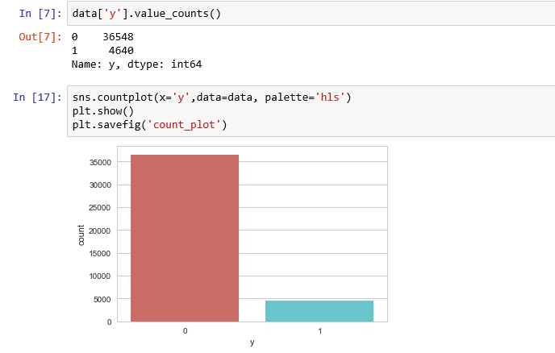
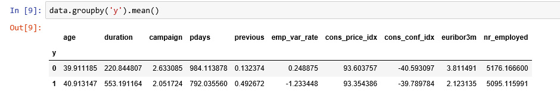
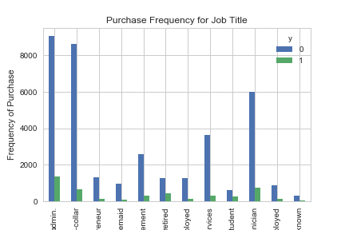
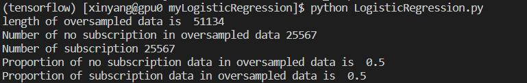
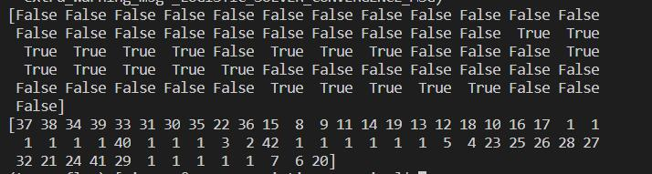
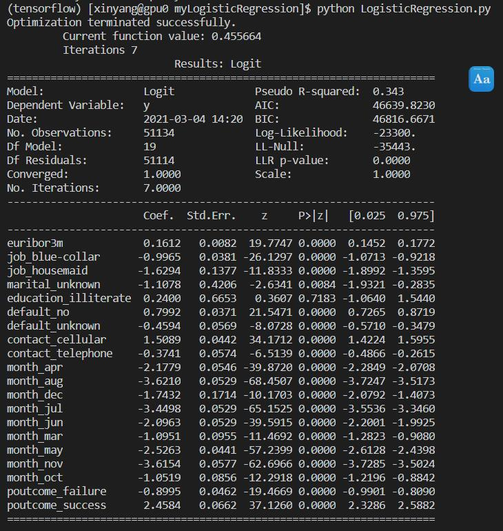
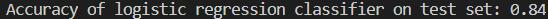

更新时间：2021-04-18
# 1 Logistic Regression算法解读与理论分析
参考资料：
- [Wiki - Logistic Regression](https://en.wikipedia.org/wiki/Logistic_regression)
- [Zhihu - 【机器学习】逻辑回归（非常详细）](https://zhuanlan.zhihu.com/p/74874291)

# 2 python实现

参考资料：[Building A Logistic Regression in Python, Step by Step](https://towardsdatascience.com/building-a-logistic-regression-in-python-step-by-step-becd4d56c9c8)

## 2.1 数据集整理

现在我们尝试使用LR算法解决一个实际问题。

目前我们拥有一个数据集[UCI Machine Learning repository](http://archive.ics.uci.edu/ml/index.php)，该数据集描述的是Portuguese banking institution获取到的用户信息，现在我们想通过这些信息来判断哪些用户会订阅一个term账户，数据集下载地址：[banking.csv](https://raw.githubusercontent.com/madmashup/targeted-marketing-predictive-engine/master/banking.csv)

首先列出本工程需要的库，如下：

```python
import pandas as pd
import numpy as np
from sklearn import preprocessing
import matplotlib.pyplot as plt 
plt.rc("font", size=14)
from sklearn.linear_model import LogisticRegression
from sklearn.model_selection import train_test_split
import seaborn as sns
sns.set(style="white")
sns.set(style="whitegrid", color_codes=True)
```

我们来看一下数据集中包含哪些信息：

```python
data = pd.read_csv('./banking.csv', header = 0)
data.head()
data = data.dropna()
print(data.shape)
print(list(data.columns)) 

输出如下：
(41188, 21)
['age', 'job', 'marital', 'education', 'default', 'housing', 'loan', 'contact', 'month', 'day_of_week', 'duration', 'campaign', 'pdays', 'previous', 'poutcome', 'emp_var_rate', 'cons_price_idx', 'cons_conf_idx', 'euribor3m', 'nr_employed', 'y']
```

总结可得数据集中的信息有：

```
1. age (numeric)
2. job : type of job (categorical: “admin”, “blue-collar”, “entrepreneur”, “housemaid”, “management”, “retired”, “self-employed”, “services”, “student”, “technician”, “unemployed”, “unknown”)
3. marital : marital status (categorical: “divorced”, “married”, “single”, “unknown”)
4. education (categorical: “basic.4y”, “basic.6y”, “basic.9y”, “high.school”, “illiterate”, “professional.course”, “university.degree”, “unknown”)
5. default: has credit in default? (categorical: “no”, “yes”, “unknown”)
6. housing: has housing loan? (categorical: “no”, “yes”, “unknown”)
7. loan: has personal loan? (categorical: “no”, “yes”, “unknown”)
8. contact: contact communication type (categorical: “cellular”, “telephone”)
9. month: last contact month of year (categorical: “jan”, “feb”, “mar”, …, “nov”, “dec”)
10. day_of_week: last contact day of the week (categorical: “mon”, “tue”, “wed”, “thu”, “fri”)
11. duration: last contact duration, in seconds (numeric). Important note: this attribute highly affects the output target (e.g., if duration=0 then y=’no’). The duration is not known before a call is performed, also, after the end of the call, y is obviously known. Thus, this input should only be included for benchmark purposes and should be discarded if the intention is to have a realistic predictive model
12. campaign: number of contacts performed during this campaign and for this client (numeric, includes last contact)
13. pdays: number of days that passed by after the client was last contacted from a previous campaign (numeric; 999 means client was not previously contacted)
14. previous: number of contacts performed before this campaign and for this client (numeric)
15. poutcome: outcome of the previous marketing campaign (categorical: “failure”, “nonexistent”, “success”)
16. emp.var.rate: employment variation rate — (numeric)
17. cons.price.idx: consumer price index — (numeric)
18. cons.conf.idx: consumer confidence index — (numeric)
19. euribor3m: euribor 3 month rate — (numeric)
20. nr.employed: number of employees — (numeric)
```

最后一列 **y** 代表这个用户是否已经订阅了一个deposit（1代表是，0代表否）

下一步，对数据集中的分类进行整理。

首先是education，分类过于复杂，我们将basic.4y, basic.9y, basic.6y统称为basic

```python
data['education']=np.where(data['education'] =='basic.9y', 'Basic', data['education'])
data['education']=np.where(data['education'] =='basic.6y', 'Basic', data['education'])
data['education']=np.where(data['education'] =='basic.4y', 'Basic', data['education'])
```

在对订阅信息y的观察如下：



可以发现该数据集中的分类是不均匀的，未订阅的人数大大多于订阅的人数，再对整个群体按是否订阅分类后做平均可得：



可以观察到：

- 购买deposit的人的平均年龄更高
- 最近一次购买日期的平均值(pdays)，购买deposit的人更低
- 购买deposit的人中，campaigns更低

再来看看其他column：



最终我们发现，购买deposit这一行为，与job关系最为密切，故job可作为good predictor of outcome variable，同理Education、Day of week、Month、Poutcome也是good predictor

至此，我们可以对数据集dataset做以下整理：

```python
cat_vars=['job','marital','education','default','housing','loan','contact','month','day_of_week','poutcome']
for var in cat_vars:
    cat_list='var'+'_'+var
    cat_list = pd.get_dummies(data[var], prefix=var)
    data1=data.join(cat_list)
    data=data1
cat_vars=['job','marital','education','default','housing','loan','contact','month','day_of_week','poutcome']
data_vars=data.columns.values.tolist()
to_keep=[i for i in data_vars if i not in cat_vars]

data_final=data[to_keep]
```

## 2.2 使用SMOTE进行过采样

上一节我们发现，已订阅人数和未订阅人数差距过大，所以我们还需要对数据进行下一步处理，减小二者差距，也即对未订阅人群进行上采样。

SMOTE步骤如下：

- 通过从次要类（无订阅）创建合成样本来工作，而不是创建副本。
- 随机选择k个近邻之一，并使用它创建相似但随机调整的新观测值。

```python
X = data_final.loc[:, data_final.columns != 'y']
y = data_final.loc[:, data_final.columns == 'y']
from imblearn.over_sampling import SMOTE
os = SMOTE(random_state=0)
X_train, X_test, y_train, y_test = train_test_split(X, y, test_size=0.3, random_state=0)
columns = X_train.columns
os_data_X,os_data_y=os.fit_resample(X_train, y_train)
os_data_X = pd.DataFrame(data=os_data_X,columns=columns )
os_data_y= pd.DataFrame(data=os_data_y,columns=['y'])
# we can Check the numbers of our data
print("length of oversampled data is ",len(os_data_X))
print("Number of no subscription in oversampled data",len(os_data_y[os_data_y['y']==0]))
print("Number of subscription",len(os_data_y[os_data_y['y']==1]))
print("Proportion of no subscription data in oversampled data is ",len(os_data_y[os_data_y['y']==0])/len(os_data_X))
print("Proportion of subscription data in oversampled data is ",len(os_data_y[os_data_y['y']==1])/len(os_data_X))
```

运行后我们可以得到：



可以看到，已订阅和未订阅人数比例已持平

## 2.3 **Recursive Feature Elimination**（递归特征消除）

该步骤中，RFE将重复建立model，并选用最好以及最坏的feature，隔离这个feature后再重复建立model。此步骤是用于选择较号的feature，以缩小模型的规模。

```python
data_final_vars=data_final.columns.values.tolist()
y=['y']
X=[i for i in data_final_vars if i not in y]
from sklearn.feature_selection import RFE
from sklearn.linear_model import LogisticRegression
logreg = LogisticRegression()
rfe = RFE(logreg, 20)
rfe = rfe.fit(os_data_X, os_data_y.values.ravel())
print(rfe.support_)
print(rfe.ranking_)
```

输出如下：



标记未True的即为被选择出的feature，故我们可以再次处理数据集如下：

```python
cols=['euribor3m', 'job_blue-collar', 'job_housemaid', 'marital_unknown', 'education_illiterate', 'default_no', 'default_unknown', 
      'contact_cellular', 'contact_telephone', 'month_apr', 'month_aug', 'month_dec', 'month_jul', 'month_jun', 'month_mar', 
      'month_may', 'month_nov', 'month_oct', "poutcome_failure", "poutcome_success"] 
X=os_data_X[cols]
y=os_data_y['y']
```

## 2.4 实施LR模型

数据集已经处理，故现在我们可以开始正式的LR模型训练过程。

```python
import statsmodels.api as sm
logit_model=sm.Logit(y,X)
result=logit_model.fit()
print(result.summary2())
```

得到结果如下：



根据p_value，我们将小于0.05的column删除

```python
cols=['euribor3m', 'job_blue-collar', 'job_housemaid', 'marital_unknown', 'education_illiterate', 
      'month_apr', 'month_aug', 'month_dec', 'month_jul', 'month_jun', 'month_mar', 
      'month_may', 'month_nov', 'month_oct', "poutcome_failure", "poutcome_success"] 
X=os_data_X[cols]
y=os_data_y['y']
logit_model=sm.Logit(y,X)
result=logit_model.fit()
print(result.summary2())
```

## 2.5 Logistic Regression Model Fitting

```python
from sklearn.linear_model import LogisticRegression
from sklearn import metrics

X_train, X_test, y_train, y_test = train_test_split(X, y, test_size=0.3, random_state=0)
logreg = LogisticRegression()
logreg.fit(X_train, y_train)
```

计算准确性：

```python
y_pred = logreg.predict(X_test)
print('Accuracy of logistic regression classifier on test set: {:.2f}'.format(logreg.score(X_test, y_test)))
```

输出模型最终准确性如下：



训练结束！

完整代码见github（未上传）
