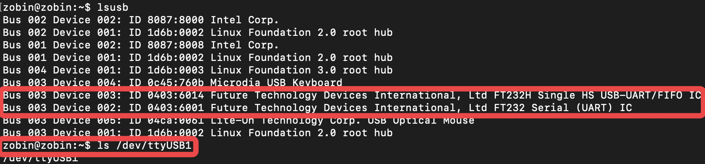
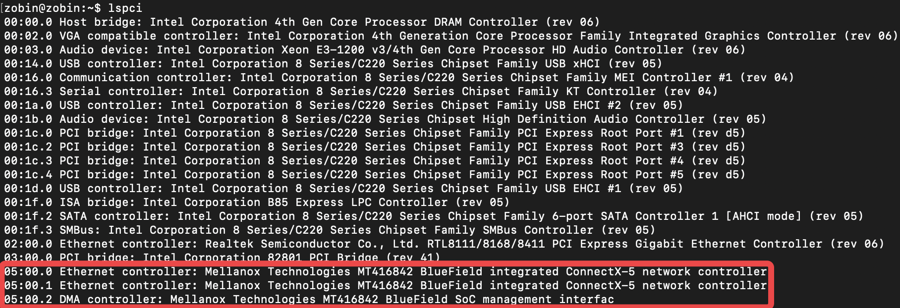
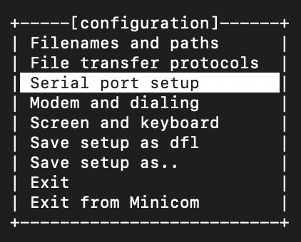
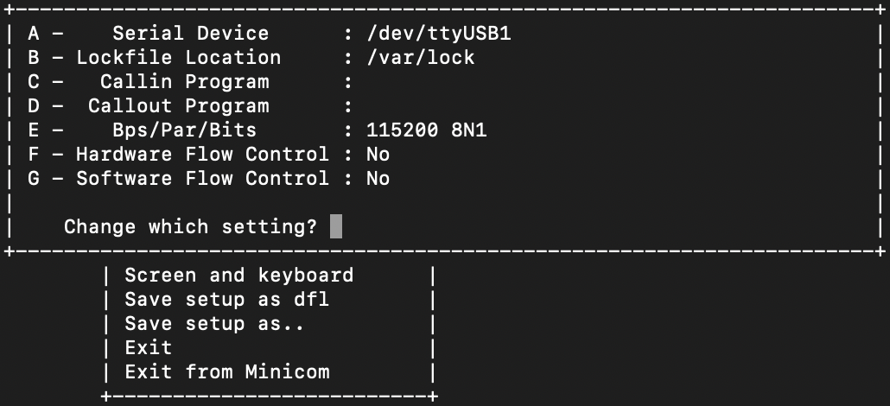

<head>
<style>
    img{margin-left: 20px; margin-right: 20px;}
    table th{text-align:center;}
    table td{text-align:center;}
    p{margin-left: 15px; margin-right: 15px;}
    .div_learning_post{font-size: 16px; word-spacing:0px;}
    .div_indicate_source{font-size: 18px; word-spacing:0px; background-color: #E0E0E0;}
</style>
<!--支持网页公式显示-->    
<script type="text/javascript" src="https://cdn.mathjax.org/mathjax/latest/MathJax.js?config=AM_HTMLorMML-full"></script>
</head>

<body>

<div align="center" class="div_indicate_source">
<h4>⚠ 转载请注明出处：<font color="red"><i>作者：ZobinHuang，更新日期：Mar.30 2021</i></font></h4>
</div>

<!--表格-->
<!--
<table border="1" align="center">
  <caption>表格</caption>
  <tr>
    <th>A</th>
    <th>B</th>
    <th>C</th>
  </tr>
  <tr>
    <td>xxx</td>
    <td>xxx</td>
    <td>xxx</td>
  </tr>
</table>
-->

<!--图片-->
<!--
<div align="center">
  
</div>
-->

<!--正文-->
<!--
<p>
&nbsp;&nbsp;&nbsp;&nbsp;公式：<span>`\overline{A}\overline{B}`</span>
</p>
-->

<!--标题-->
<h2>1. 硬件安装</h2>
<div class="div_learning_post">
<div align="center">
  
</div>
<p>
&nbsp;&nbsp;&nbsp;&nbsp;如上图所示为 BlueField SmartNIC 的 25GB版本，具体的硬件参数可以查阅其 Product Brief (附录中可供下载)。在硬件的安装上也很简单：
<br>&nbsp;&nbsp;&nbsp;&nbsp;(1) PCIe Plug in！
<br>&nbsp;&nbsp;&nbsp;&nbsp;(2) 注意到上图左上角处有一个接口，把配送的串口线将其与 Host 的 USB 接口连接，Host 端就可以使用串口接入。
<br>&nbsp;&nbsp;&nbsp;&nbsp;(3) 使用 SFP 光纤网线将网卡接入光交换机即可。
</p>
</div>

<h2>2. Host 端配置</h2>
<div class="div_learning_post">
<h3>(1) 接入检查</h3>
<div align="center">
  
</div>
<p>
&nbsp;&nbsp;&nbsp;&nbsp;一切正常时，我们在 Host 端使用 <b>lsusb</b> 就可以看见我们的 usb 接口，也可以看见在 "/dev" 下存在设备 "/dev/ttyUSB1"，如上图所示。
</p>
<div align="center">
  
</div>
<p>
&nbsp;&nbsp;&nbsp;&nbsp;使用 "lspci" 命令可以看见我们的 BlueField 设备，如上图所示。
</p>

<h3>(2) 串口工具安装</h3>
<p>
&nbsp;&nbsp;&nbsp;&nbsp;我们将使用 minicom 作为串口工具，以实现 Host 端和网卡的串口通信。
</p>

```shell
sudo apt-get install minicom
```

<p>
&nbsp;&nbsp;&nbsp;&nbsp;安装完成后，键入以下命令进入 minicom 配置界面
</p>

```shell
sudo minicom -s
```

<div align="center">
  
</div>

<p>
&nbsp;&nbsp;&nbsp;&nbsp;选择 "Serial port setup" 进入串口的设置，确认串口设备选择正确，关闭硬件流控，波特率为115200，如下图所示。
</p> 

<div align="center">
  
</div>

<p>
&nbsp;&nbsp;&nbsp;&nbsp;
</p> 

</div>
<!--ref-->
<h2>附录：参考源</h2>
<div class="div_learning_post">
<p>

1. https://www.youtube.com/watch?v=XTSEcsvN65E&t=253s, <b>BlueField SmartNIC bring up</b>
2. [SMART ADAPTER CARDS PRODUCT BRIEF](/sec_learning/Networking_Tech/Mellanox_SmartNIC/Config_SmartNIC/file/PB_BlueField_Smart_NIC.pdf)
</p>
</div>

</body>