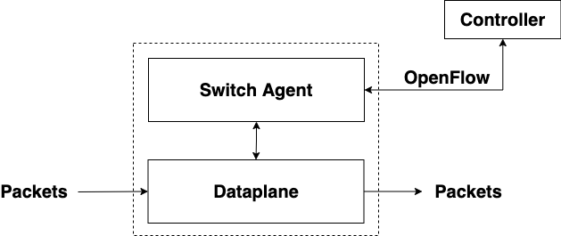

<head>

<!--支持网页公式显示-->    

</head>

<body>

<h4>⚠ 转载请注明出处：<i>作者：ZobinHuang，更新日期：Mar.26 2021</i></h4>

<!--表格-->
<!--
<table border="1" align="center">
  <caption>表格</caption>
  <tr>
    <th>A</th>
    <th>B</th>
    <th>C</th>
  </tr>
  <tr>
    <td>xxx</td>
    <td>xxx</td>
    <td>xxx</td>
  </tr>
</table>
-->

<!--图片-->
<!--

  

-->

<!--正文-->
<!--

&nbsp;&nbsp;&nbsp;&nbsp;公式：`\overline{A}\overline{B}`

-->

<!--标题-->
<h2>1. Overview</h2>

  

&nbsp;&nbsp;&nbsp;&nbsp;OpenFlow协议是对 SDN 架构的一种实现，是由 Open Networking Forum 维护的一套规范。如上图所示，我们都知道 SDN 中将控制面与数据面进行分离，分为 <b>SDN控制器</b> 和 <b>SDN交换机</b> 两个东西，而 OpenFlow 协议就是这两者之间通信所使用的协议，使能了控制器能够将控制信息以流表 (Flow Table) 的形式下发给交换机，也使得交换机能将底层的一些情况上报给控制器。下面的文字将以交换机为重点，阐述 openflow 是如何工作的。

<h2>2. OpenFlow Switch</h2>

  

&nbsp;&nbsp;&nbsp;&nbsp;在 OpenFlow Switch 的内部，我们可以将其分解为两部分：Switch Agent 和 Dataplane，如上图所示。前者负责基于 OpenFlow 协议和上层控制器交互，一方面将控制器的 Command 转化为底层的指令集并且发送给 Dataplane，另一方面又将来自 Dataplane 的 notification 转化为相应的 Openflow message 并转发给上层控制器；后者负责对数据包进行转发和修改等数据平面的操作，有时候它也会把数据包发送给 Switch Agent以做其他控制面的处理。下面我们对这两者进行详细的阐述。

<h3>(1) Switch Agent</h3>

  

&nbsp;&nbsp;&nbsp;&nbsp; Switch Agent 可以分为下面这四个部分：

<table border="1" align="center">
  <tr>
    <th>模块</th>
    <th>描述</th>
  </tr>
  <tr>
    <td>OpenFlow Protocol</td>
    <td>负责和上层控制器交互，OpenFlow 协议在 Switch 侧的实现</td>
  </tr>
  <tr>
    <td>Core Logic</td>
    <td>管理整个 Switch：根据需要对 Dataplane 执行命令，管理 Dataplane Offload</td>
  </tr>
  <tr>
    <td>Dataplane Offload</td>
    <td>通常 Controlplane 将卸载 OpenFlow 中存在的但现有 Dataplane 实现未提供的某些功能</td>
  </tr>
  <tr>
    <td>Dataplane Protocol</td>
    <td>用于配置数据平面状态的内部协议</td>
  </tr>
</table>

<h3>(2) Dataplane</h3>

  

&nbsp;&nbsp;&nbsp;&nbsp;如上图所示，对于 Dataplane，它由：<b>端口 (Tx/Rx Port)</b>，<b>流表 (Flow Table)</b>组成，在数据面存在若干 <b>Flow Table</b>，<b>Flow Table</b> 中又存在若干流表项。流表用于匹配各个数据包以决定最后的转发/修改等操作，有的文档会把流表项描述为 <b>分类器 (Classifier)</b> + <b>指令 (Instruction/Action)</b>，其实表达的意思就是根据数据包包头中的某些信息匹配到对应的流表项的意思。实际上，对于每一条流表项，它都由几个部分组成，下面进行阐述。

<table border="1" align="center">
  <tr>
    <th>流表项</th>
    <th>描述</th>
  </tr>
  <tr>
    <td>匹配域</td>
    <td>一组网络数据包协议域的组合，用来识别该条表项对应的 flow</td>
  </tr>
  <tr>
    <td>优先级</td>
    <td>定义流表项的优先顺序，当同时匹配到多条流表项时，选择优先级别高的流表项进行 Action</td>
  </tr>
  <tr>
    <td>计数器</td>
    <td>用于保存与条目相关统计信息</td>
  </tr>
  <tr>
    <td>指令</td>
    <td>匹配表项后需要对数据分组执行的动作</td>
  </tr>
  <tr>
    <td>超时时间</td>
    <td>流表项超时时间</td>
  </tr>
  <tr>
    <td>...</td>
    <td>...</td>
  </tr>
</table>

&nbsp;&nbsp;&nbsp;&nbsp;对于每个数据包来说，它经过流表的流程是这样的：

  

&nbsp;&nbsp;&nbsp;&nbsp;当一个数据包到达 Switch 时，Switch 会从数据包中提取匹配字段，并从第一个流表开始查找匹配。具体匹配字段取决于数据包的类型，通常包括各种数据包的头字段，例如以太网源地址或 IPv4 目的地址等，此外，还可以对数据包 关联的字段（e.g. 交换机的入端口等）进行匹配。如果数据包和流表项匹配成功，则更新计数器并执行流表项中的指令。如果该流表项的指令使用了 <b>GOTO</b> 指令指向了某一其他流表，则执行完本次指令的数据包以及动作集、元数据等信息将会转到 <b>GOTO</b> 指令指向的流表进行下一步的匹配；若未指向另一流表则执行动作集，此时流水线处理成功。如果在某个流表中并未匹配成功，则查找该流表中是否存在 <b>table-miss</b> 流表项（流表中的 <b>table-miss</b> 流表项指定如何处理未匹配成功的数据包），如果存在 <b>table-miss</b> 流表项，则按该流表项中的指令执行，如丢弃数据包、将数据包转到另外一个流表或者发送给控制器（即通过 <b>Packet_In</b> 消息传递给控制器，由控制器制定数据包的转发策略而后通过 <b>Packet_Out</b> 消息下发流表给交换机）等；如果在流表中并未匹配成功并且该流表项中不存在 <b>table-miss</b> 流表项，那么交换机将会丢弃该数据包。

  

&nbsp;&nbsp;&nbsp;&nbsp;另外，将多张流表串接起来形成流水线 (pipeline)的过程被称为 <b>多级流表技术</b>，这样的 pipeline 设计将对数据包的处理过程变得模块化。举个例子，在 Ingress 方向上，Table 0 可以被用来做 physical-logical 转换，将物理网络的数据包映射到逻辑网络中，具体可能是对数据包中某些字段的识别和转换，接下来 Table 1 就可以被用于做逻辑网络的数据链路层的 lookup，... ，在 Egress 方向上的逻辑就可以反过来，比如最后的 Table n 就可以用来做 logical-physical 的转换。

<!--ref-->

<h2>附录：参考源</h2>

1. http://flowgrammable.org/sdn/openflow/#tab_protocol, Flowgrammable, <b>OpenFlow</b>
2. https://blog.csdn.net/dwj_daiwenjie/article/details/89788222, <b>OpenFlow 协议详解（干货）</b>

</body>