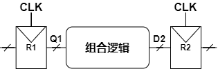

<head>

<!--支持网页公式显示-->    

</head>

<body>

  <h4>⚠ 转载请注明出处：<i>作者：ZobinHuang，更新日期：Jan.30 2021</i></h4>

<!--标题-->
<!--
<h2>title</h2>

-->

<!--表格-->
<!--
<table border="1" align="center">
  <caption>表格</caption>
  <tr>
    <th>A</th>
    <th>B</th>
    <th>C</th>
  </tr>
  <tr>
    <td>xxx</td>
    <td>xxx</td>
    <td>xxx</td>
  </tr>
</table>
-->

<!--图片-->
<!--

-->

<!--正文-->
<!--

&nbsp;&nbsp;&nbsp;&nbsp;公式：`\overline{A}\overline{B}`

-->

<!--ref-->
<!--
<h2>附录：参考书籍</h2>

1. David Money Harris, Sarah L Harris, 机械工业出版社, <b>数字设计和计算机体系结构</b>

-->

<h2>1. 各类锁存器与触发器</h2>

  

  &nbsp;&nbsp;&nbsp;&nbsp;与组合逻辑不同，时序逻辑电路的输出取决于当前的输入值和先前的输入值，即是“有记忆”的电路。时序逻辑可能明确地记住某些先前的输入，也可能从先前的输入中提取更少量信息，这些信息称作系统的<b>状态(state)</b>。我们在本小节会回顾<b>锁存器(latch)</b>和<b>触发器(flip flop)</b>这两种存储1位状态的简单时序逻辑电路。
  

  <h3>1.1 SR锁存器(SR latch)</h3>
  

    
  

  <table align="center">
    <!--<caption>SR锁存器真值表</caption>-->
    <tr>
      <th>`S`</th>
      <th>`R`</th>
      <th>`Q`</th>
      <th>`\overline{Q}`</th>
    </tr>
    <tr>
      <td>0</td>
      <td>0</td>
      <td>`Q_(prev)`</td>
      <td>`\overline{Q}_(prev)`</td>
    </tr>
    <tr>
      <td>0</td>
      <td>1</td>
      <td>0</td>
      <td>1</td>
    </tr>
    <tr>
      <td>1</td>
      <td>0</td>
      <td>1</td>
      <td>0</td>
    </tr>
    <tr>
      <td>1</td>
      <td>1</td>
      <td>0</td>
      <td>0</td>
    </tr>
  </table>
  

  &nbsp;&nbsp;&nbsp;&nbsp;SR锁存器的原理是：R有效时，状态复位为0；S有效时，状态复位为1；S和R都无效时，状态保持旧值不变。
  

  <h3>1.2 D锁存器(D latch)</h3>
  

    
  

  <table align="center">
    <!--<caption>D锁存器真值表</caption>-->
    <tr>
      <th>`CLK`</th>
      <th>`D`</th>
      <th>`\overline{D}`</th>
      <th>`S`</th>
      <th>`R`</th>
      <th>`Q`</th>
      <th>`\overline{Q}`</th>
    </tr>
    <tr>
      <td>0</td>
      <td>`X`</td>
      <td>`\overline{X}`</td>
      <td>0</td>
      <td>0</td>
      <td>`Q_(prev)`</td>
      <td>`\overline{Q}_(prev)`</td>
    </tr>
    <tr>
      <td>1</td>
      <td>0</td>
      <td>1</td>
      <td>0</td>
      <td>1</td>
      <td>0</td>
      <td>1</td>
    </tr>
    <tr>
      <td>1</td>
      <td>1</td>
      <td>0</td>
      <td>1</td>
      <td>0</td>
      <td>1</td>
      <td>0</td>
    </tr>
  </table>
  

  &nbsp;&nbsp;&nbsp;&nbsp;在设计电路时，我们希望将电路的内容和时间分开，即我们分开可以控制<b>电路节点电压值</b>和<b>电路节点电压改变的时间</b>，这将会使电路设计变得更加方便，但是SR锁存器混淆了电路的时间和内容。同时SR锁存器还存在另一个问题：当S和R都有效时，`Q`和`\overline{Q}`的输出都是0，这并不符合两个输出相反的定义。因此通过将SR锁存器进行改造，如上左图所示，我们得到了D锁存器：数据输入D用于控制下一个状态的值，时钟输入CLK用于控制状态发生变化的时间，时钟可以控制何时将数据通过锁存器。同时D锁存器避免了S和R两个节点同时有效造成的输出意义不符的情况。
  

  <h3>1.3 D触发器(D flip-flop)</h3>
  

    
  

  

  &nbsp;&nbsp;&nbsp;&nbsp;如左图所示，D触发器由两个被反相时钟控制的D锁存器构成，第一个锁存器被称为主锁存器，第二个锁存器被称为从锁存器。D触发器的原理是：当时钟为0时，主锁存器是透明的，D的值被传输到N1，而从锁存器是不透明的；当时钟为1时，情况则相反，N1的值被传输到Q上输出，但是N1和D之间被切断。因此，<b>D触发器在时钟上升沿将D复制到Q，在其他时间D触发器保持原来的状态。</b>
  

  <h3>1.4 寄存器(register)</h3>
  

    
  

  

  &nbsp;&nbsp;&nbsp;&nbsp;如上图所示，一个N位的寄存器由共享一个公共CLK输入的一排N个D触发器组成。寄存器是多数时序电路的关键组件。
  

<h2>2. 同步逻辑设计</h2>

  

  
  &nbsp;&nbsp;&nbsp;&nbsp;所有不符合 [组合逻辑电路](/sec_learning/FPGA_RTL/combinational/index.html) 条件的电路都是时序电路，也即这些电路的输出不能仅仅通过观察当前电路输入来确定。我们在下面首先分析两个古怪的时序逻辑电路，以引出<b>同步时序电路</b>的概念，同步时序将是一种简单、系统的设计和分析时序电路系统的方法。
  

  
  <h3>2.1 电路环路导致的问题</h3>
  

    
  

  

  &nbsp;&nbsp;&nbsp;&nbsp;如上图所示是三个头尾相连的反相器，可以看到电路的状态是十分不稳定的，三个电路节点都在不断地发生震荡。
  

  <h3>2.2 电路竞争导致的问题</h3>
  

    
  

  

  &nbsp;&nbsp;&nbsp;&nbsp;如上图所示是所谓D锁存器的另一种实现方案，根据D锁存器的布尔表达式(可以通过卡诺图获得)：`Q=CLK\cdotD+\overline{CLK}\cdotQ_(prev)`可以设计出来。考虑这样一种情况，当D=1，CLK从1变为0时，若不考虑任何门电路的延迟，则理论上输出Q应该保持1不变。但是若假设反相器的延迟较大，导致存在这样的情况：CLK从1变为0时，N1节点的值变为0而N2节点的值仍未发生改变，此时输出Q则会为0并且反馈回输入端`Q_(prev)`，则此时当反相器输出正确后，输出Q也仍然为0，与理论值不符。这是一个输出直接反馈到输入的异步电路设计的例子，异步电路经常会出现<b>竞争条件(race condition)</b>而难以掌握。之所以出现竞争条件，是因为其电路的行为取决于两条通过逻辑门的路径中哪条最快（如上图与N2节点连接的与门）。也就是说，<b>异步电路中存在一些电路节点，其电压值并不受时钟信号的控制，因此是不同步的，无法预测的</b>。

   &nbsp;&nbsp;&nbsp;&nbsp;注意将本节所讨论的竞争条件与在 [组合逻辑电路](/sec_learning/FPGA_RTL/combinational/index.html) 中讨论的毛刺（或称冒险）区分开，毛刺是针对组合逻辑电路而言的，毛刺只是电路稳定之前出现的现象，由于组合逻辑电路没有环路，因此电路最终会稳定在一个正确值。而竞争条件是针对时序逻辑电路而言的，其导致的结果可能是错误的，因为时序逻辑电路允许环路的存在，因此输出的错误可能会导致输入的错误。
  

  <h3>2.3 同步时序电路</h3>
  

    
  

  

  &nbsp;&nbsp;&nbsp;&nbsp;通过分析上面两个古怪的有问题的电路，我们不难看出来它们的特征都是直接将输出反馈到输入，因此当输出发生改变时，输入也会立即发生改变，从而导致了各种无法预测的古怪的电路行为。为了允许电路环路的存在同时解决这些古怪的行为，<b>解决方法就是在路径中插入寄存器来断开环路，将电路转化为组合逻辑电路和寄存器的集合</b>，寄存器存储各个电路节点的状态，这些状态仅仅在时钟沿到达时发生改变，所以整个电路的行为是可以预测的，因为每个时钟沿触发后电路节点的逻辑电平值是确定的。并且如果时钟足够慢，足以让每个电路节点的状态在下一个时钟沿到来之前稳定下来（即等待每段组合逻辑电路的毛刺褪去），则所有的竞争都将被消除。在下面的论述中，我们将称<b>某个特定时间点下各个电路节点的状态的集合</b>为<b>某个时间点下的电路的状态</b>，这从下面将会提及的有限状态机（同步时序电路的一种）的状态转移表的内容中可以直观地体会出来。
   &nbsp;&nbsp;&nbsp;&nbsp;上面的Venn图很好地说明了各种电路的关系，总结来说，同步时序电路需要满足以下四个条件：
   &nbsp;&nbsp;&nbsp;&nbsp;&nbsp;&nbsp;&nbsp;&nbsp;(1) 每一个电路元件或者是寄存器，或者是组合电路，（注意锁存器不属于这两者，因此如果锁存器独立存在则该电路不是同步电路）
   &nbsp;&nbsp;&nbsp;&nbsp;&nbsp;&nbsp;&nbsp;&nbsp;(2) 至少有一个电路元件是寄存器
   &nbsp;&nbsp;&nbsp;&nbsp;&nbsp;&nbsp;&nbsp;&nbsp;(3) 所有寄存器都接收同一个时钟信号
   &nbsp;&nbsp;&nbsp;&nbsp;&nbsp;&nbsp;&nbsp;&nbsp;(4) 每个环路至少包含一个寄存器
   &nbsp;&nbsp;&nbsp;&nbsp;<b>有限状态机</b>和<b>流水线</b>是常见的同步时序逻辑电路，下面将具体对其展开分析。
  

  <h3>2.4 有限状态机</h3>
  

    
  

  

  &nbsp;&nbsp;&nbsp;&nbsp;如上两幅图所示，同步逻辑电路可以由这样的形式来构建：用一个k位的寄存器来存储整个系统的状态，因此整个系统有`2^k`种状态。在寄存器前面有一个M位输入k位输出的组合逻辑电路用于根据M位输入决定下一个状态，并且将状态传送至k位寄存器，我们称其为<b>下一个状态逻辑</b>。寄存器后面有一个k输入N输出的组合逻辑电路用于根据当前系统所处的状态决定相应的输出值，我们称其为<b>输出逻辑</b>。系统时钟沿到来时，系统就进入下一个状态。综上，我们称这样的同步时序逻辑电路设计为<b>有限状态机</b>。
   &nbsp;&nbsp;&nbsp;&nbsp;有限状态机的设计也有两种形式，上图的第一幅图描述了<b>Moore状态机</b>的设计：<b>系统的输出仅取决于当前系统的状态，系统的输入决定状态的转移</b>。第二幅图描述了<b>Mealy状态机</b>的设计：<b>系统的输出取决于系统的状态和系统当前的输入，系统的输入同时还决定了状态的转移</b>。
   &nbsp;&nbsp;&nbsp;&nbsp;以下我们对基于有限状态机的问题建模方法进行举例分析。
  

  <h4>2.4.1 有限状态机问题建模</h4>
  

  &nbsp;&nbsp;&nbsp;&nbsp;问题：设计一个同步时序逻辑数字电路，当输入序列出现01时，输出为TRUE，否则为FALSE。
  

  
  <h5>STEP1：画出状态转移图</h5>
  

    
  

  

  &nbsp;&nbsp;&nbsp;&nbsp;在状态转移图中，我们使用圆圈代表状态，圆弧代表两个状态之间的转换，而且对于同步时序逻辑电路来说，转换发生在时钟上升沿。如上图所示，我们分别画出了使用两种状态机设计的状态转移模型。对于Moore型状态机，由于系统的输出仅取决于系统状态，因此我们将系统的输出值也在了圆圈中，并且在圆弧上写上了对应输入造成的系统状态转移。而对于Mealy型状态机，由于是系统输入和系统状态同时决定系统输出，因此我们将系统的输入和输出以<b>输入/输出</b>的方式写在了各条圆弧上。
  

  <h5>STEP2：根据状态转移图，画出状态转移表和输出表</h5>
  <table align="center">
    <caption>Moore型有限状态机的状态转换表</caption>
    <tr>
      <th>当前状态`S`</th>
      <th>输入`A`</th>
      <th>下一个状态`S'`</th>
    </tr>
    <tr>
      <td>`S_0`</td>
      <td>`0`</td>
      <td>`S_1`</td>
    </tr>
    <tr>
      <td>`S_0`</td>
      <td>`1`</td>
      <td>`S_0`</td>
    </tr>
    <tr>
      <td>`S_1`</td>
      <td>`0`</td>
      <td>`S_1`</td>
    </tr>
    <tr>
      <td>`S_1`</td>
      <td>`1`</td>
      <td>`S_2`</td>
    </tr>
    <tr>
      <td>`S_2`</td>
      <td>`0`</td>
      <td>`S_1`</td>
    </tr>
    <tr>
      <td>`S_2`</td>
      <td>`1`</td>
      <td>`S_0`</td>
    </tr>
  </table>

  <table align="center">
    <caption>Moore型有限状态机的输出表</caption>
    <tr>
      <th>当前状态`S`</th>
      <th>输出`Y`</th>
    </tr>
    <tr>
      <td>`S_0`</td>
      <td>`0`</td>
    </tr>
    <tr>
      <td>`S_1`</td>
      <td>`0`</td>
    </tr>
    <tr>
      <td>`S_2`</td>
      <td>`1`</td>
    </tr>
  </table>

  <table align="center">
    <caption>Mealy型有限状态机的状态转换表和输出表</caption>
    <tr>
      <th>当前状态`S`</th>
      <th>输入`A`</th>
      <th>下一个状态`S'`</th>
      <th>输出`Y`</th>
    </tr>
    <tr>
      <td>`S_0`</td>
      <td>`0`</td>
      <td>`S_1`</td>
      <td>`0`</td>
    </tr>
    <tr>
      <td>`S_0`</td>
      <td>`1`</td>
      <td>`S_0`</td>
      <td>`0`</td>
    </tr>
    <tr>
      <td>`S_1`</td>
      <td>`0`</td>
      <td>`S_1`</td>
      <td>`0`</td>
    </tr>
    <tr>
      <td>`S_1`</td>
      <td>`1`</td>
      <td>`S_0`</td>
      <td>`1`</td>
    </tr>
  </table>
  

  &nbsp;&nbsp;&nbsp;&nbsp;对于Moore型状态机，我们把状态转移表和输出表分开画，体现出 <b>I. 系统输入决定状态转移</b> 和 <b>II. 状态决定系统输出</b> 的原则。而对于Mealy型状态机，我们可以把这两个表合二为一，体现出 <b>I. 系统输入决定状态转移</b> 和 <b>II. 系统状态和系统输入同时决定系统输出</b> 的原则。
  

  <h5>STEP3：对状态进行编码</h5>
  

  &nbsp;&nbsp;&nbsp;&nbsp;在上述的建模过程中，我们使用了抽象的`S_0`, `S_1`, `S_2`来表示系统状态。为了映射到真实的电路（使用寄存器来存储系统状态），我们必须把状态使用数值来表示，下面介绍两种状态编码方案：<b>二进制编码(binary encoding)</b>和<b>独热编码(one-hot encoding)</b>。
   &nbsp;&nbsp;&nbsp;&nbsp;&nbsp;&nbsp;&nbsp;&nbsp;<b>二进制编码</b>：一个二进制数表示一种状态，因此`\log_2K`位就可以表示K个二进制数，即K种系统状态。
   &nbsp;&nbsp;&nbsp;&nbsp;&nbsp;&nbsp;&nbsp;&nbsp;<b>独热编码</b>：一传0/1序列中任何时候只有一位是热的，例如3个状态的有限状态机的独热编码为001, 010, 100。
   &nbsp;&nbsp;&nbsp;&nbsp;可以看出，独热编码比二进制编码需要更多的触发器来存储系统状态，但是独热编码也会使系统下一状态逻辑和输出逻辑的设计变得更加简单，因此使用哪种编码，还是取决于具体的情况。下面我们使用二进制编码对上面问题继续进行建模。
  

  <table align="center">
    <caption>使用二进制编码的Moore型有限状态机的状态转换表</caption>
    <tr>
      <th colspan = "2">当前状态</th>
      <th>输入</th>
      <th colspan = "2">下一个状态</th>
    </tr>
    <tr>
      <th>`S_1`</th>
      <th>`S_0`</th>
      <th>`A`</th>
      <th>`S'_1`</th>
      <th>`S'_0`</th>
    </tr>
    <tr>
      <td>`0`</td>
      <td>`0`</td>
      <td>`0`</td>
      <td>`0`</td>
      <td>`1`</td>
    </tr>
    <tr>
      <td>`0`</td>
      <td>`0`</td>
      <td>`1`</td>
      <td>`0`</td>
      <td>`0`</td>
    </tr>
    <tr>
      <td>`0`</td>
      <td>`1`</td>
      <td>`0`</td>
      <td>`0`</td>
      <td>`1`</td>
    </tr>
    <tr>
      <td>`0`</td>
      <td>`1`</td>
      <td>`1`</td>
      <td>`1`</td>
      <td>`0`</td>
    </tr>
    <tr>
      <td>`1`</td>
      <td>`0`</td>
      <td>`0`</td>
      <td>`0`</td>
      <td>`1`</td>
    </tr>
    <tr>
      <td>`1`</td>
      <td>`0`</td>
      <td>`1`</td>
      <td>`0`</td>
      <td>`0`</td>
    </tr>
  </table>

  <table align="center">
    <caption>使用二进制编码的Moore型有限状态机的输出表</caption>
    <tr>
      <th colspan = "2">当前状态</th>
      <th>输出</th>
    </tr>
    <tr>
      <th>`S_1`</th>
      <th>`S_0`</th>
      <th>`Y`</th>
    </tr>
    <tr>
      <td>`0`</td>
      <td>`0`</td>
      <td>`0`</td>
    </tr>
    <tr>
      <td>`0`</td>
      <td>`1`</td>
      <td>`0`</td>
    </tr>
    <tr>
      <td>`1`</td>
      <td>`0`</td>
      <td>`1`</td>
    </tr>
  </table>

  <table align="center">
    <caption>使用二进制编码的Moore型有限状态机的输出表</caption>
    <tr>
      <th colspan = "2">当前状态</th>
      <th>输出</th>
    </tr>
    <tr>
      <th>`S_1`</th>
      <th>`S_0`</th>
      <th>`Y`</th>
    </tr>
    <tr>
      <td>`0`</td>
      <td>`0`</td>
      <td>`0`</td>
    </tr>
    <tr>
      <td>`0`</td>
      <td>`1`</td>
      <td>`0`</td>
    </tr>
    <tr>
      <td>`1`</td>
      <td>`0`</td>
      <td>`1`</td>
    </tr>
  </table>  

  <table align="center">
    <caption>使用二进制编码的Mealy型有限状态机的状态转移表和输出表</caption>
    <tr>
      <th>当前状态`S_0`</th>
      <th>输入</th>
      <th>下一个状态`S'_0`</th>
      <th>输出</th>
    </tr>
    <tr>
      <td>`0`</td>
      <td>`0`</td>
      <td>`1`</td>
      <td>`0`</td>
    </tr>
    <tr>
      <td>`0`</td>
      <td>`1`</td>
      <td>`0`</td>
      <td>`0`</td>
    </tr>
    <tr>
      <td>`1`</td>
      <td>`0`</td>
      <td>`1`</td>
      <td>`0`</td>
    </tr>
    <tr>
      <td>`1`</td>
      <td>`1`</td>
      <td>`0`</td>
      <td>`1`</td>
    </tr>
  </table>

  <h5>STEP4：根据编码后的状态转移表和输出表，写出布尔表达式并化简</h5>
  

  &nbsp;&nbsp;&nbsp;&nbsp;基于上一个步骤，我们可以分别从Moore和Mealy型的使用二进制编码的状态转移表和输出表中提取出<b>下一个状态位</b>和<b>输出</b>的布尔表达式，如下：
   &nbsp;&nbsp;&nbsp;&nbsp;Moore状态机：
   &nbsp;&nbsp;&nbsp;&nbsp;&nbsp;&nbsp;&nbsp;&nbsp;`S'_1=S_0A` (下一个状态位`S'_1`)，`S'_0=\overline{A}` (下一个状态位`S'_0`)，`Y=S_1` (输出`Y`)
   &nbsp;&nbsp;&nbsp;&nbsp;Mealy状态机：
   &nbsp;&nbsp;&nbsp;&nbsp;&nbsp;&nbsp;&nbsp;&nbsp;`S'_0=\overline{A}` (下一个状态位`S'_0`)，`Y=S_0A` (输出`Y`)
  

  <h5>STEP5：得出电路</h5>
  

    
  

  

  &nbsp;&nbsp;&nbsp;&nbsp;基于上一个步骤得到的布尔表达式，我们可以很轻松的得出如上图所示的电路，分别对应两种有限状态机模型。值得一提的是，如果给出了电路要求反推出状态机功能，把上述的步骤倒过来推一遍即可。
  

  <h3>2.5 同步时序逻辑电路的时序</h3>
  

    
  

  

  &nbsp;&nbsp;&nbsp;&nbsp;就像照相机在拍照时要求物体在一个孔径时间(aperture time)内保持不动一样，在同步时序电路中，当时钟上升沿来到时，也要求触发器的输入必须在一定时间内保持不变，分别使用时钟沿前的<b>建立时间(setup time)</b>和时钟沿后的<b>保持时间(hold time)</b>来定义。如上图所示，输入必须在建立时间 `t_(setup)` 内保持稳定，在时钟上升沿后，输入必须保持至少保持时间 `t_(hold)` 内保持稳定。值得说明的是图中的 `t_(pcq)` 代表触发器时钟到所有触发器输出达到预期值的延迟，`t_(c cq)` 代表触发器时钟到任意一个触发器输出发生改变的延迟。建立时间和保持时间统称为电路的孔径时间，这种时间上的约束称为同步时序电路的<b>动态约束(dynamic discipline)</b>。
  

  <h4>2.5.1 动态约束实例分析</h4>
  

    
  

  

  &nbsp;&nbsp;&nbsp;&nbsp;我们将以上面这个电路的R2触发器为例对时序要求展开分析。
  

  <h5>2.5.1.1 建立时间约束</h5>
  

    
  

  

  &nbsp;&nbsp;&nbsp;&nbsp;对于寄存器R2来说，D2是它的输入，所以就会有建立时间的要求。根据上图，其中`t_(pcq)`是第一个时钟上升沿到所有输出达到预期值的延迟，`t_(pd)`是组合逻辑电路的所有输出值达到预期值的延迟，`t_(setup)`是第二个时钟上升沿的建立时间，`T_c` 是时钟周期，因此我们可以得到约束：`T_c>=t_(pcq)+t_(pd)+t_(setup)` 。其中，`t_(pcq)` 和 `t_(setup)` 通常是由触发器制造商确定的，因此身为数字设计师，在给定时钟周期的情况下，能够控制的唯一变量便是 `t_(pd)` ，因此我们改写式子为：`t_(pd)<=T_c-(t_(pcq)+t_(setup))` ，这被称为<b>建立时间约束(setup time constrain)</b>或<b>最大延迟约束(max-delay constrain)</b>（指中间组合逻辑电路的最大延迟）。如果组合逻辑电路的传播延迟过大，则会导致R2在采样时D2处于一个不稳定状态（非法电平），此时解决方案有两个：一个是降低时钟速率，另一个就是降低组合逻辑电路的传播延迟。
  

  <h5>2.5.1.2 保持时间约束</h5>
  

    
  

  

  &nbsp;&nbsp;&nbsp;&nbsp;同样道理，对于寄存器R2来说，D2是它的输入，所以就也会有保持时间的要求。根据上图，其中 `t_(c cq)` 是第一个时钟上升沿到任一触发器输出发生改变的延迟，`t_(cd)` 是组合逻辑电路从输入发生改变到任意输出到达预期值的延迟，`t_(hold)` 是触发器的保持时间，`T_c` 是时钟周期。只要输入D2保持不变到时钟上升沿后 `t_(hold)` 长的时间，电路就满足保持时间的要求，因此我们可以得到约束：`t_(c cq)+t_(cd)>=t_(hold)` 。同样道理，由于 `t_(hold)` 和 `t_(c cq)` 通常由触发器制造商决定，因此工程师唯一能控制的变量是 `t_(cd)` ，故改写约束式得：`t_(cd)>=t_(hold)-t_(c cq)` ，这被称为<b>保持时间约束(hold rune constrain)</b>或<b>最小延迟约束(min-delay constrain)</b>（指中间组合逻辑电路的最小延迟）。如果组合逻辑电路的最小延迟不够小，则D2就无法满足保持时间约束的要求。
  

  <h3>2.6 并行</h3>
  <h4>2.6.1 定义</h4>
  

  &nbsp;&nbsp;&nbsp;&nbsp;首先我们搬出几个定义：
   &nbsp;&nbsp;&nbsp;&nbsp;&nbsp;&nbsp;&nbsp;&nbsp;<b>任务(token)</b>：经过处理后能产生一组输出的一组输入
   &nbsp;&nbsp;&nbsp;&nbsp;&nbsp;&nbsp;&nbsp;&nbsp;<b>延迟(latency)</b>：从开始到结束的时间
   &nbsp;&nbsp;&nbsp;&nbsp;&nbsp;&nbsp;&nbsp;&nbsp;<b>吞吐量(throughput)</b>：系统单位时间内产生任务的数量
   &nbsp;&nbsp;&nbsp;&nbsp;在同一时间内处理多个任务可以提高吞吐量，这称为并行(parallelism)。其中，<b>空间并行</b>指的是使用多个相同的硬件。而对于<b>时间并行</b>，指的是将一个任务分为多个阶段，相应的将运行任务的系统也分为多个阶段。在系统运行的过程中，多个任务可以分布到系统的各个阶段去运行，在给定的时间段内系统的每段都有一个不同的任务在运行，因此多个任务可以重叠起来运行，这种时间上的并行被称为<b>流水线</b>。
  

  <h4>2.6.2 流水线</h4>
  

  &nbsp;&nbsp;&nbsp;&nbsp;考虑一个延迟为`L`的任务，在没有并行的系统中，吞吐量为`1/L`。在空间并行系统中，若有N个相同的硬件，则吞吐量为`N/L`。在时间并行系统中，可以将任务理想地分成等长的N个步骤，则吞吐量也是`N/L`，且只用一套硬件。但是实际情况中很难做到将任务分为等长的阶段，因此假设各个阶段中最长的一个阶段延迟为`L_1`，则系统的吞吐量为`1/L_1`。
  

  

  &nbsp;&nbsp;&nbsp;&nbsp;考虑下面这样一个没有使用流水线设计的电路，其中各部分组合逻辑电路的时延在表中给出。假设触发器的时钟到Q的传播延迟为0.3ns，触发器建立时间为0.2ns，那么可以得到周期：`T_C=0.3+2.4+3+2+4+0.2=9.5ns`，故吞吐量为`1/9.5ns=105MHz`。
  

  

    
  

  <table align="center">
    <tr>
      <th>组合电路逻辑  1</th>
      <th>组合电路逻辑  2</th>
      <th>组合电路逻辑  3</th>
      <th>组合电路逻辑  4</th>
    </tr>
    <tr>
      <td>2.4ns</td>
      <td>3ns</td>
      <td>2ns</td>
      <td>4ns</td>
    </tr>
    <tr>
      <td colspan = "4">时钟周期`T_c`: 9.5ns</td>
    </tr>
    <tr>
      <td colspan = "4">系统时延: 9.5ns</td>
    </tr>
  </table>
  

  &nbsp;&nbsp;&nbsp;&nbsp;此时考虑往其中增加一个寄存器，将组合逻辑电路分为两个阶段，如下图所示，各部分电路时延如下表所示。阶段1的周期是`0.3+3+2+0.2=5.5ns`，阶段2的周期是`0.3+4+0.2=4.5ns`，系统时钟周期必须得满足所有阶段（足够每个阶段在一个时钟周期内完成电路输出），因此取最大值5.5ns。此时，电路每5.5ns就能在输出端产生一个任务的输出，系统的吞吐量为`1/5.5ns=182MHz`，相比于无流水线设计大幅上升，但是系统对一个任务的处理时延变成了时钟周期的两倍，即`11ns`，相比于无流水线设计有小幅度上升。

  

  

    
  

  <table align="center">
    <tr>
      <th>组合电路逻辑  1</th>
      <th>组合电路逻辑  2</th>
      <th>组合电路逻辑  3</th>
      <th>组合电路逻辑  4</th>
    </tr>
    <tr>
      <td>2.4ns</td>
      <td>3ns</td>
      <td>2ns</td>
      <td>4ns</td>
    </tr>
    <tr>
      <td colspan = "3">阶段1时延: 5.5ns</td>
      <td>阶段2时延: 4.5ns</td>
    </tr>
    <tr>
      <td colspan = "4">时钟周期`T_c`: 5.5ns</td>
    </tr>
    <tr>
      <td colspan = "4">系统时延: 11ns</td>
    </tr>
  </table>
  

  &nbsp;&nbsp;&nbsp;&nbsp;若我们再加一级流水线，如下图和下表所示。此时阶段1周期为`0.3+3+0.2=3.5ns`，阶段2周期为`0.3+2+0.2=2.5ns`，阶段3周期为`0.3+4+0.2=4.5ns`。同理，时钟周期应取4.5ns，故系统吞吐量为`1/4.5=222MHz`，系统时延变为3倍时钟周期，也即13.5ns。
  

  

    
  

  <table align="center">
    <tr>
      <th>组合电路逻辑  1</th>
      <th>组合电路逻辑  2</th>
      <th>组合电路逻辑  3</th>
      <th>组合电路逻辑  4</th>
    </tr>
    <tr>
      <td>2.4ns</td>
      <td>3ns</td>
      <td>2ns</td>
      <td>4ns</td>
    </tr>
    <tr>
      <td colspan = "2">阶段1时延: 3.5ns</td>
      <td>阶段2时延: 2.5ns</td>
      <td>阶段3时延: 4.5ns</td>
    </tr>
    <tr>
      <td colspan = "4">时钟周期`T_c`: 4.5ns</td>
    </tr>
    <tr>
      <td colspan = "4">系统时延: 13.5ns</td>
    </tr>
  </table>
  

  &nbsp;&nbsp;&nbsp;&nbsp;可以看出，通过增加流水线级数提高系统吞吐量的原理是将电路切分，并且使用触发器隔开，使得已经处理完任务的电路可以被投入下一个任务的处理中，而无需等待整个任务完成。但是同时由于触发器的引入，系统处理一个任务的时延有所上升，但是和大幅提升的吞吐量比起来，系统还是得到了正优化。值得一提的是，流水线并不适用于所有的情况。当当前的任务依赖于上一个任务的结果时，流水线设计就行不通了，这种情况被称作<b>依存关系</b>。
  

<h2>附录：参考书籍</h2>

  
1. David Money Harris, Sarah L Harris, 机械工业出版社, <b>数字设计和计算机体系结构</b>

</body>