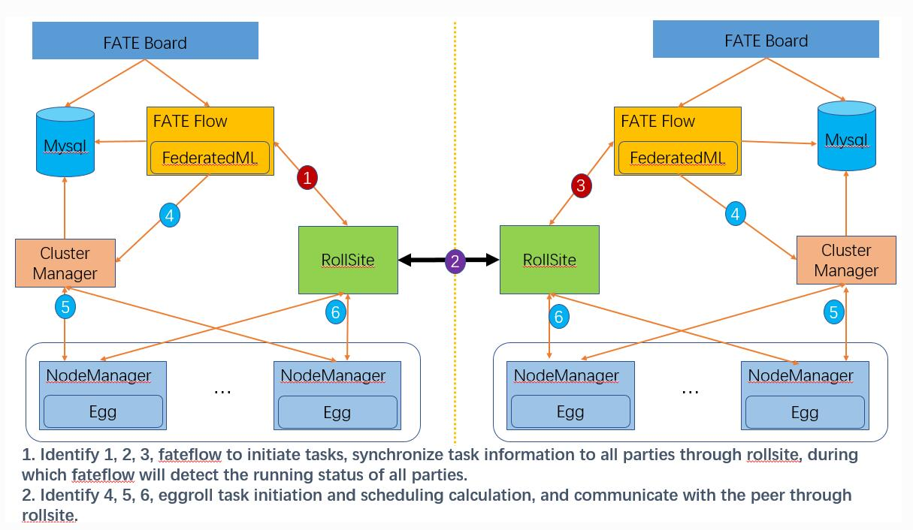

更新时间：2021/04/19

参考资料：
1. [FATE官方文档](https://github.com/FederatedAI/KubeFATE/tree/master/docker-deploy)
2. [docker使用方法]()

# 1 FATE Cluster包含组件
## 1.1 volumes
- fate_flow_logs: flow_logs存放处
- download_dir
- shared_dir_federatedml: 联邦学习算法
- shared_dir_examples: 例程
- shared_dir_data: 其他数据
这里shared的含义为，多个containers共享的数据
## 1.2 services
所有组件如下图：

基础为集群services，包括：
- mysql: 底层数据库
- clustermanager & nodemanager: eggroll集群配置

FATE services包括：
rollsite: 负责不同FATE Party之间的报文转发
fateboard: 网页可视化
python: fate-flow本体，用于启动fate-server
client: fate-client

# 2 使用docker部署fate-cluster版本
fate使用party来区分不同的fate，在这里container之间需要相互通信，并且有可能是在不同的host上，故需要考虑以下配置：
- fate配置文件：更改party号，路由表等
- 配置docker network间可以通信
- 配置docker container之间可以通信
- 与host间映射的端口不能冲突

参考[KubeFATE docker-deploy](https://github.com/FederatedAI/KubeFATE/tree/master/docker-deploy)，不使用docker-compose部署，更改为docker run部署container
# Step 0：初始化变量与fate配置文件

```shell
USER=user
BASE_DIR=/home/user/fate_cluster_1.5.1
PARTY='10000'
NETWORK='192.168.136.0/24'
FLOW_IP='192.168.136.100'
TAG='1.5.1-release'
PORT_ROLLSITE='10080'
PORT_FATEBOARD='10081'
PORT_GRPC='10082'
PORT_HTTP='10083'
PORT_CLIENT='10084'
```
confs/eggroll/conf/eggroll.properties中eggroll.rollsite.party.id
confs/eggroll/conf/route_table.josn中添加其他party的路由
confs/fate_flow/conf/service_conf.yaml中更改fateflow:host项IP地址
confs/fate_flow/conf/service_conf.yaml中更改serving: hosts项IP地址

## Step 1：创建docker network
```shell
docker network create \
--driver=bridge \
--subnet=$NETWORK \
--attachable=true \
${USER}_confs${PARTY}_fate-network
```
其中，attachable使docker network间可以通信
## Step 2: 创建volume
```shell
# fate flow logs
docker volume create --driver local \
--opt type=none \
--opt o=bind \
--opt device=${BASE_DIR}/confs-${PARTY}/shared_dir/fate_flow_logs \
${USER}_confs${PARTY}_fate_flow_logs

# download_dir
docker volume create --driver local \
--opt type=none \
--opt o=bind \
--opt device=${BASE_DIR}/confs-${PARTY}/shared_dir/download_dir \
${USER}_confs${PARTY}_download_dir

# shared_dir_examples
docker volume create --driver local \
--opt type=none \
--opt o=bind \
--opt device=${BASE_DIR}/confs-${PARTY}/shared_dir/examples \
${USER}_confs${PARTY}_shared_dir_examples

# shared_dir_federatedml
docker volume create --driver local \
--opt type=none \
--opt o=bind \
--opt device=${BASE_DIR}/confs-${PARTY}/shared_dir/federatedml \
${USER}_confs${PARTY}_shared_dir_federatedml

# shared_dir_data
docker volume create --driver local \
--opt type=none \
--opt o=bind \
--opt device=${BASE_DIR}/confs-${PARTY}/shared_dir/data \
${USER}_confs${PARTY}_shared_dir_data
```

## Step 3 创建docker containers
```shell
# create sql
docker run -d \
--name ${USER}_confs${PARTY}_sql \
--expose=3306 \
-v ${BASE_DIR}/confs-${PARTY}/confs/mysql/init:/docker-entrypoint-initdb.d/ \
-v ${BASE_DIR}/confs-${PARTY}/shared_dir/data/mysql:/var/lib/mysql \
--ipc=shareable \
--network-alias=mysql \
-e "MYSQL_ALLOW_EMPTY_PASSWORD=yes" \
--restart=always \
--network=${USER}_confs${PARTY}_fate-network \
mysql:8

# create clustermanager
docker run -d \
--name ${USER}_confs${PARTY}_clustermanager \
--expose=4670 \
-v ${BASE_DIR}/confs-${PARTY}/confs/eggroll/conf:/data/projects/fate/eggroll/conf \
--ipc=shareable \
-e "PROTOCOL_BUFFERS_PYTHON_IMPLEMENTATION=python" \
--network=${USER}_confs${PARTY}_fate-network \
--network-alias=clustermanager \
federatedai/eggroll:${TAG} \
"bash" "-c" "java -Dlog4j.configurationFile=\${EGGROLL_HOME}/conf/log4j2.properties -cp \${EGGROLL_HOME}/lib/*: com.webank.eggroll.core.Bootstrap --bootstraps com.webank.eggroll.core.resourcemanager.ClusterManagerBootstrap -c \${EGGROLL_HOME}/conf/eggroll.properties -p 4670 -s 'EGGROLL_DEAMON'"

# create nodemanager
docker run -d \
--name ${USER}_confs${PARTY}_nodemanager \
--expose=4671 \
-v ${BASE_DIR}/confs-${PARTY}/confs/eggroll/conf:/data/projects/fate/eggroll/conf \
-v ${BASE_DIR}/confs-${PARTY}/confs/fate_flow/conf/service_conf.yaml:/data/projects/fate/conf/service_conf.yaml \
-v ${BASE_DIR}/confs-${PARTY}/shared_dir/data/nodemanager:/data/projects/fate/eggroll/data \
--ipc=shareable \
--network=${USER}_confs${PARTY}_fate-network \
--network-alias=nodemanager \
federatedai/eggroll:${TAG} \
"bash" "-c" "java -Dlog4j.configurationFile=\${EGGROLL_HOME}/conf/log4j2.properties -cp \${EGGROLL_HOME}/lib/*: com.webank.eggroll.core.Bootstrap --bootstraps com.webank.eggroll.core.resourcemanager.NodeManagerBootstrap -c \${EGGROLL_HOME}/conf/eggroll.properties -p 4671 -s 'EGGROLL_DEAMON'"

# create rollsite
docker run -d \
--name ${USER}_confs${PARTY}_rollsite \
-p ${PORT_ROLLSITE}:9370/tcp \
-e "PROTOCOL_BUFFERS_PYTHON_IMPLEMENTATION=python" \
-v ${BASE_DIR}/confs-${PARTY}/confs/eggroll/conf:/data/projects/fate/eggroll/conf \
--ipc=shareable \
--network=${USER}_confs${PARTY}_fate-network \
--network-alias=rollsite \
federatedai/eggroll:${TAG} \
"bash" "-c" "java -Dlog4j.configurationFile=\${EGGROLL_HOME}/conf/log4j2.properties -cp \${EGGROLL_HOME}/lib/*:\${EGGROLL_HOME}/conf/ com.webank.eggroll.rollsite.EggSiteBootstrap -c \${EGGROLL_HOME}/conf/eggroll.properties"

# create python
docker run -d \
--name ${USER}_confs${PARTY}_python \
-p ${PORT_GRPC}:9360/tcp \
-p ${PORT_HTTP}:9380/tcp \
--restart=always \
-v ${USER}_confs${PARTY}_shared_dir_federatedml:/data/projects/fate/python/federatedml \
-v ${USER}_confs${PARTY}_shared_dir_examples:/data/projects/fate/examples \
-v ${USER}_confs${PARTY}_download_dir:/data/projects/fate/python/download_dir \
-v ${USER}_confs${PARTY}_fate_flow_logs:/data/projects/fate/logs \
-v ${BASE_DIR}/confs-${PARTY}/confs/fate_flow/conf:/data/projects/fate/conf \
-v ${BASE_DIR}/confs-${PARTY}/confs/eggroll/conf:/data/projects/fate/eggroll/conf \
--ipc=shareable \
--network=${USER}_confs${PARTY}_fate-network \
--network-alias=python \
--ip=${FLOW_IP} \
federatedai/python:${TAG} \
"/bin/bash" "-c" "sleep 5 && python /data/projects/fate/python/fate_flow/fate_flow_server.py"

# create fateboard (depends on python)
docker run -d \
--name ${USER}_confs${PARTY}_fateboard \
-p ${PORT_FATEBOARD}:8080/tcp \
-v ${BASE_DIR}/confs-${PARTY}/confs/fateboard/conf:/data/projects/fate/fateboard/conf \
-v ${USER}_confs${PARTY}_fate_flow_logs:/data/projects/fate/logs \
--ipc=shareable \
--network=${USER}_confs${PARTY}_fate-network \
--network-alias=fateboard \
federatedai/fateboard:${TAG}

# create client (depends on python)
docker run -d \
--name ${USER}_confs${PARTY}_client \
-p ${PORT_CLIENT}:15000/tcp \
--restart=always \
-e "FATE_FLOW_HOST=python:9380" \
-e "FATE_SERVING_HOST=172.16.0.160:8059" \
-v ${USER}_confs${PARTY}_download_dir:/fml_manager/Examples/download_dir \
-v ${USER}_confs${PARTY}_shared_dir_examples:/data/projects/fate/examples \
-v ${BASE_DIR}/confs-${PARTY}/confs/fate_flow/conf:/data/projects/fate/conf \
-v ${BASE_DIR}/confs-${PARTY}/confs/client/pipeline_conf.yaml:/data/projects/fate/conf/pipeline_conf.yaml \
--ipc=shareable \
--network=${USER}_confs${PARTY}_fate-network \
--network-alias=client \
federatedai/client:${TAG}
```
ipc使container间可以通信
network-alias使container名可以被dns解析

通过以上命令，我们成功启动了fate-cluster版本。

# 3 在docker container中添加GPU
