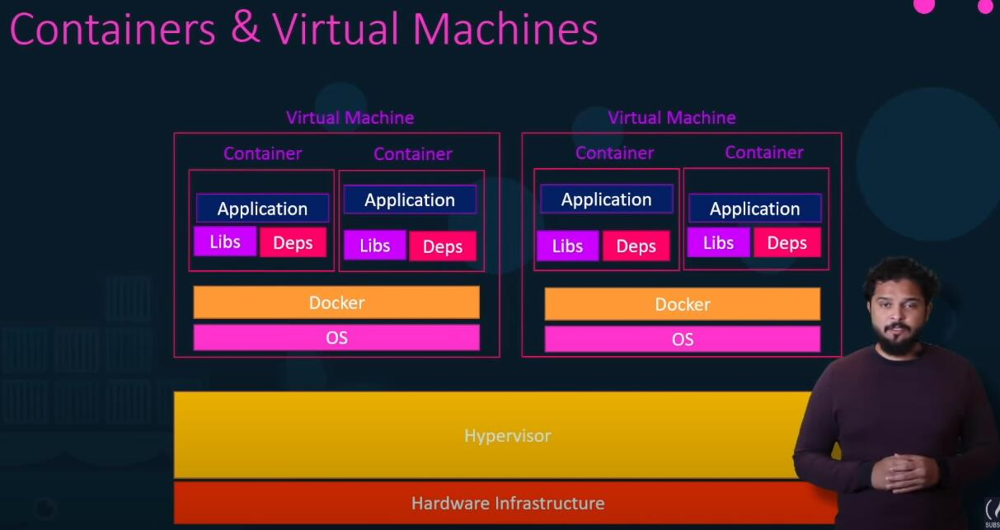

更新时间：2021/04/09

参考资料：
1. [Youtube教学视频](https://www.youtube.com/watch?v=fqMOX6JJhGo)

# 1 VM和Container

当一台计算机运行多个VM时，各VM共享同一个硬件设备，但在每个VM中使用完全独立的OS，来达到各个VM完全隔离的目的。而在docker中，核心组件为container，各个container共享同一个OS，而Container中的App可以相互隔离。所以Container要比VM更轻量级，部署、转移、销毁也更加迅速。

# 2 Container和Image
Image是一个package，这个包可以移植到任何docker平台中运行，其概念更偏向于环境包。
Container是Image中的实例，每个container中运行不同的app

举个例子：
传统的软件编程做法是：
Developer编写了一个App，同时还需将该App运行的环境需求打包；Operator常常面对配置环境的问题，毕竟App并不是他们实际编写的。
Docker所做的是，Developer将其环境需求打包乘一个docker file，docker通过该file创建image，那么所有的Operators只要安装了docker，并且拥有docker image，developer所编写的app便可以运行。

# 3 basic docker commands
1. docker run
运行container from image，如果image未在本地查询到，则docker会在docker hub中将image拉取到本地。
2. docker ps
显示当前正在运行的container，docker ps -a会显示所有的container，无论是否正在运行
3. docker stop
停止某个container
4. docker rm
将container永久删除
5. docker images
显示所有images
6. docker rmi
删除image，在删除之前需要停止该image的所有container
7. docker pull
下载image
8. docker exec
在container中运行命令