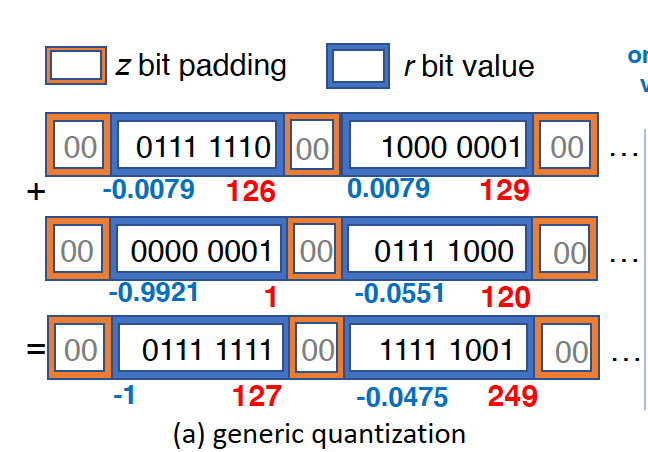
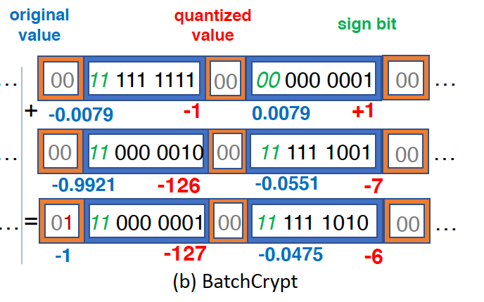

<head>

<!--支持网页公式显示-->    

</head>

<body>

  <h4>⚠ 转载请注明出处：<i>Maintainer: MinelHuang，更新日期：Jan.15 2022</i></h4>
  

  
  
  

   
  

      
  

  

  &nbsp;&nbsp;&nbsp;&nbsp;本作品由 <b>MinelHuang</b> 采用 <a rel="license" href="http://creativecommons.org/licenses/by-nc-nd/4.0/">知识共享署名-非商业性使用-禁止演绎 4.0 国际许可协议</a> 进行许可，在进行使用或分享前请查看权限要求。若发现侵权行为，会采取法律手段维护作者正当合法权益，谢谢配合。
  

 

  

    <h2> 目录 </h2>
    

  

  

    

    &nbsp;&nbsp;&nbsp;&nbsp;Section 1. <a href="#section1"><b>前言</b></a>：介绍BatchCrypt的应用场景和Problems。
    

    &nbsp;&nbsp;&nbsp;&nbsp;Section 2. <a href="#section2"><b>Background Knowledge</b></a>：介绍同态加密、量化压缩等背景知识。
    &nbsp;&nbsp;&nbsp;&nbsp;Section 3. <a href="#section3"><b>BatchCrypt</b></a>：论文正文解读。
  

<h2><a name="section1">1. 前言</a></h2>

  

  &nbsp;&nbsp;&nbsp;&nbsp;参考文献：<a href = "https://www.usenix.org/conference/atc20/presentation/zhang-chengliang">BatchCrypt: Efficient Homomorphic Encryption for Cross-Silo Federated Learning</a>. 2020. ATC
  <h2>场景和Problem</h2>
  

  &nbsp;&nbsp;&nbsp;&nbsp;本文描述的场景为纵向联邦学习（Cross-Silo / Vertical / Heterogenous Federated Learning），即参与方持有相同id的数据，但每条数据的Feature不一定相同。通常，各参与方需要计算出local gradient updates，在加密后上传到一个center server，在该server中进行密态的aggregation，再返回给各参与方。最后参与方在本地解密，并更新本地模型，完成一次迭代。 
  

  &nbsp;&nbsp;&nbsp;&nbsp;显然，在纵向联邦学习中，非常重要的一步是加密。目前state-of-art的加密方式为同态加密（additively homomorphic encryption, HE）。在同态加密后（通常使用Paillier加密技术），每一条数据变成了HE key-pair，其外在表现为数据量膨胀（每个值都会被扩展到至少2048bits）。这样的加密方法显然增加data transfer的开销，与明文相比，数据传递的开销增加了至少150x。故BatchCrypt希望解决的问题是，降低同态加密带来的计算和数据传递开销。 

  <h2>Solution</h2>
  

  &nbsp;&nbsp;&nbsp;&nbsp; 在传统的方法中，每条数据的每个值都需要进行一次同态加密，那么可不可以使用batch encryption技术来对一个batch的数据进行一次加密呢？那么，原先是一个value对应一个密态数，使用batch encryption后，是一个batch的values对应一个密态数，这显然降低了加密和数据传递的开销（数据量被大大降低了）。故在BatchCrypt中，一个参与方首先quantizes its gradient values into low-bit integer representation，而后encodes a batch of quantized values to a long interger and encrypt it in one go。中文简单来说，是先组装成一组数据，而后编码，最后一同加密。 
  

  &nbsp;&nbsp;&nbsp;&nbsp; 这一部分的难点分为两种，其一是，如何让两个batch密态数完成密态下的加法运算？这样的运算是aggregation步骤中必须要实现的。BatchCrypt为此设计了一个quantization scheme，使梯度数据被quantized to signed integers uniformly distributed in a symmetric range。并且为了能支持简单的加法格式，BatchCrypt还开发了一个新的batch编码技术，其采用了two's compliment representation with two sign bits。
  

  &nbsp;&nbsp;&nbsp;&nbsp; 其二是在quantization前，需要先对gradients values进行clipped。文章提供了一个分析模型，称为dACIQ，用于分析最佳的clipping thresholds with the minimum cumulative error。 

  <h2>Contribution</h2>
  &nbsp;&nbsp;&nbsp;&nbsp;与传统的同态加密相比，BatchCrypt在3-layer全连接神经网络、AlexNet、LSTM model三个模型中分别达到了23x、71x和93x的加速，并分别降低了66x、71x和101x的通信负载。

<h2><a name="section2">2. Background Knowledge</a></h2>

  <h3>Paillier半同态加密</h3>
  

  &nbsp;&nbsp;&nbsp;&nbsp;参考资料：<a href="https://zhuanlan.zhihu.com/p/420417626">Paillier半同态加密：原理、高效实现方法和应用</a>
  

  &nbsp;&nbsp;&nbsp;&nbsp;Paillier中的半同态加密指的是，支持密态下的加法，以及密文加明文两种计算，不支持密文乘密文。计算推导过程见上述链接。在本节中，将给出实际paillier实现中要注意的问题。 
  

  &nbsp;&nbsp;&nbsp;&nbsp;现假设我们使用的p和q为512bit，则n为1024bit，所以对于任意一个明文<b>整数</b>m，其范围都不能超过<b>1024bit</b>。 
  

  &nbsp;&nbsp;&nbsp;&nbsp;问题一，通常明文是64bit的浮点数，那么如何将其转换成整数以满足Paillier的输入条件呢？常规的做法是转移小数点的位置，将浮点数转换为：<b>base * exponent</b>的形式，例如：输入一个浮点数0.1，将其先转换为`1 * 10^{-1}`。 
  

  &nbsp;&nbsp;&nbsp;&nbsp;现在我们把上述过程用更加标准的语言叙述一遍。设base的位宽必须小于1024bit，输入浮点数位宽无限，第一步是将浮点数编码成base * exponent的形式。其中，base < `2^{10}`。为达到此要求，首先用户要给出对浮点数的精度要求precision，例如`2^{-5}`(32 bit)，而后计算exponent = `log 2^{-5}`。则输入x将转换为：fixpoint = int(round(x * 2^{exponent}))。于是，我们成功将一个浮点数转换成了定点数形式，注意fixpoint需小于1024bit。 
  

  &nbsp;&nbsp;&nbsp;&nbsp;最后我们来说下密态加法，c1 + c2。当明文m1和m2都使用base * exponent表示法后，我们只对base进行加密，即： 
  

  &nbsp;&nbsp;&nbsp;&nbsp;c1 = [base1] * exp1 
  &nbsp;&nbsp;&nbsp;&nbsp;c2 = [base2] * exp2 
  

  &nbsp;&nbsp;&nbsp;&nbsp;设exp1 > exp2，则c1 + c2 = （[base1] * (exp1 / exp2) + [base2]） * exp2 
  

  &nbsp;&nbsp;&nbsp;&nbsp;至此，我们完成了密态下的加法。 
  

  &nbsp;&nbsp;&nbsp;&nbsp;问题二，我们看到两个密态数相加，假设exp相差100倍，那么较大的数的base会扩大100倍，base是要小于1024bit的，则连续的加法，也即乘明文的操作有可能造成base溢出。所以在每一次密态运算后，需要进行解密，而后检查base是否溢出。当然，连续的多次密态运算依然是可能造成溢出的，只有在解密后才能检查是否溢出。 
  

  &nbsp;&nbsp;&nbsp;&nbsp;问题三，负数如何表示？我们可以把1024bit编码空间分成3份，高位用于表示负数，低位用于表示整数，中间位用于保留防止溢出。 
  

  &nbsp;&nbsp;&nbsp;&nbsp;以上的实现方式均为FATE开源项目中的encode函数的实现方式，更加详细的代码请参考<a href="https://github.com/FederatedAI/FATE">Federated AI Technology Enabler</a>，具体位置为：python/federatedml/secureprotol/encode.py 

  <h3>量化与压缩</h3>
  

  &nbsp;&nbsp;&nbsp;&nbsp;参考资料：<a href="https://blog.csdn.net/jinzhuojun/article/details/106955059">闲话模型压缩之量化（Quantization）篇</a>

<h2><a name="section3">3. BatchCrypt</a></h2>

  <h4>传统基于batch的量化</h4>
  

  &nbsp;&nbsp;&nbsp;&nbsp;假设所有的gradients都属于[-1, 1]区间，而我们仅有8bit的编码空间，即[0, 255]。故，我们需要给出[-1, 1]至[0, 255]的映射关系。可以看到[0, 255]共255个小区间，假设gradient "-1"对应"0"，那么gradient落在[-1, -1 + 2/255]都应使用"1"表示，如此过程可以使用下列公式表示： 
  

  &nbsp;&nbsp;&nbsp;&nbsp;`Q(g) = [255 * (g - min) / (max - min)]` 
  &nbsp;&nbsp;&nbsp;&nbsp;其中，max, min分别表示1和-1。逆过程则为： 
  &nbsp;&nbsp;&nbsp;&nbsp;`Q^{-1}(q_n) = q_n * (max - min) / 255 + n * min` 
  &nbsp;&nbsp;&nbsp;&nbsp;其中，`q_n`代表n个量化后的gradients求和后的结果。 
  

  &nbsp;&nbsp;&nbsp;&nbsp;上述过程可以使用下图表示，蓝色数字代表原始数字，红色数字为量化后的gradietn： 
   
  

  &nbsp;&nbsp;&nbsp;&nbsp;这样一来，多个蓝色方框可以组成一个batch，两个batch相加即对应的bit位相加，再依次去量化便可得到最终结果。当然，我们现在讨论的是均匀量化，对于非均匀量化，则可以理解为每个小格子，小区间所对应的实际数字是不同的。 
  

  &nbsp;&nbsp;&nbsp;&nbsp;传统方法在运用至同态加密下的FL中会遇到许多问题。其一，该方法局限于，在运算前需要知道有多少values需要被aggregate，这样对于同步有了新的要求。但是在FL中，updates的数量是变化的，甚至是unavailable。其二，在aggregation过程中，很容易溢出，但是在加密状态下是无法检测出溢出的，故需要频繁的加密解密过程来防止因溢出导致的错误结果。其三，无法区分是正数溢出还是负数溢出。 

  <h4>BatchCrypt</h4>
  

  &nbsp;&nbsp;&nbsp;&nbsp;首先，BatchCrypt需要满足的三个需求是：1. 带符号整数：如此在aggregate时正数和负数相加后可以被抵消，从而降低overflow的概率。2. 对称量化区间：这事为了保证在量化前的-1 + 1 = 0，在量化后相加依旧为0，对称量化可以使"0"的值保持不变。3. 均匀量化：无法证明FL算法中的gradients是非均匀分布的，故本文章仅考虑均匀量化的场景。 
  

  &nbsp;&nbsp;&nbsp;&nbsp;在BatchCrypt中，将属于`[-\alpha, \alpha]`的值映射到`r`-bit整数域上，具体为将`[-\alpha, 0]`映射到`[-(2^r - 1), 0]`；将`[0, \alpha]`映射到`[0, 2^r - 1]`上。此时，"0"在量化后可能有两个值，文章中提到使用16-bit量化足够达到近乎无损的梯度量化。 
  

  &nbsp;&nbsp;&nbsp;&nbsp;确定量化映射区间后，下一个问题是如何表示有符号数。当一个batch被加密后，我们无法在密态下区分其符号位。受现代CPU处理有符号数的计算过程的启发，BatchCrypt使用two's complement representation。如此，sign bits可以参与到加法运算中，如value的运算无区别。而后，BatchCrypt进一步使用two sign bits来区分postive and negative overflows。具体的例子如下图： 
  

   
  

  &nbsp;&nbsp;&nbsp;&nbsp;BatchCrypt还提供了dACIQ来确定clipping range，以减少quanization noise和clipping noise，在这里笔者并未仔细阅读。 

  <h4>小结</h4>
  

  &nbsp;&nbsp;&nbsp;&nbsp;BatchCrypt通过将多个plaintext合并成一个batch再进行加密，实现了对密态信息的压缩，该工作的主要贡献在于如何修改传统batch编码方法，以实现密态batch下的加法，从而完成gradient aggregation。我们发现BatchCrypt很适用于横向FL场景，即Center Server对所有的密态gradients batches进行相加即可；但同时其还不适用于纵向FL算法，这是由于纵向FL算法中常常存在矩阵乘（明文矩阵乘密文gradients矩阵）的操作，而并非简单的gradients相加，也即一个batch中的gradients也会相互运算，但显然BatchCrypt是不支持的。故在此文中，场景确切的来说是，cross-silo + horizontal fl algorithm + 加性半同态加密。 
  

  &nbsp;&nbsp;&nbsp;&nbsp;END

