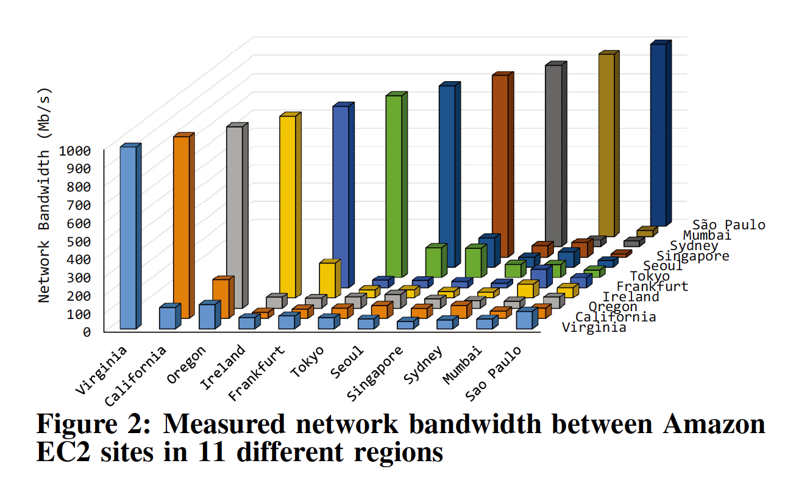
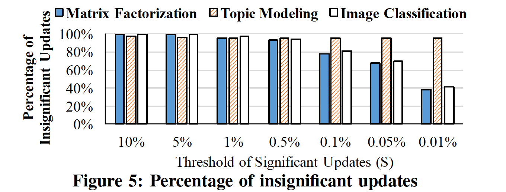
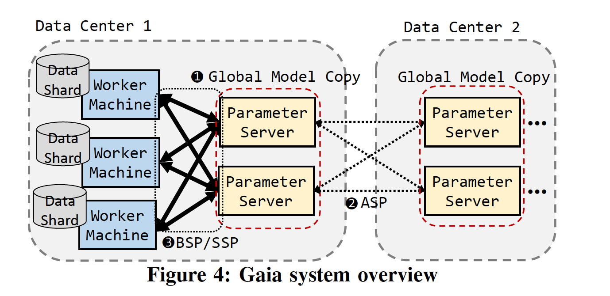

<head>

<!--支持网页公式显示-->    

</head>

<body>

  <h4>⚠ 转载请注明出处：<i>Maintainer: MinelHuang，更新日期：Jan.16 2022</i></h4>
  

  
  
  

   
  

      
  

  

  &nbsp;&nbsp;&nbsp;&nbsp;本作品由 <b>MinelHuang</b> 采用 <a rel="license" href="http://creativecommons.org/licenses/by-nc-nd/4.0/">知识共享署名-非商业性使用-禁止演绎 4.0 国际许可协议</a> 进行许可，在进行使用或分享前请查看权限要求。若发现侵权行为，会采取法律手段维护作者正当合法权益，谢谢配合。
  

 

  

    <h2> 目录 </h2>
    

  

  

    

    &nbsp;&nbsp;&nbsp;&nbsp;Section 1. <a href="#section1"><b>前言</b></a>：介绍Gaia的应用场景和Problems。
    

    &nbsp;&nbsp;&nbsp;&nbsp;Section 2. <a href="#section1"><b>Architecture</b></a>：介绍Gaia中的组件。
  

<h2><a name="section1">1. 前言</a></h2>

  <h4>场景和Problem</h4>
  

  &nbsp;&nbsp;&nbsp;&nbsp;Gaia所对应的使用场景为geo-distributed machine learning，指有多个data centers同时参加一次model training。这是因为由于成本或隐私等原因，将全世界的数据集中到一个DC中是不现实的，故数据依旧仅存放于各个local datacenter中。各数据中心通过WAN进行通信，交换updates。于是，和在LAN中训练最为不同的一点是，WAN的带宽是珍贵的，跨WAN进行通信的成本非常高，于是成为训练瓶颈。 
  

  &nbsp;&nbsp;&nbsp;&nbsp;为证明其motivation，Gaia提供了跨DC模型训练中，communication的时延测试，如下图：
   
  

  &nbsp;&nbsp;&nbsp;&nbsp;可以看到WAN的带宽要比LAN的带宽小15X（平均），在最坏的情况下甚至小于60X。故传统的distributed framework如MapReduce、Tensorflow等并不能适用于此场景。 

  <h4>Solutions and Contributions</h4>
  

  &nbsp;&nbsp;&nbsp;&nbsp;Gaia的目标是，尽可能的缩小跨WAN的数据传输，即reduct communication size。Gaia发现，并不是所有的updates都会对parameters的变化有巨大的影响，如下图： 
   
  

  &nbsp;&nbsp;&nbsp;&nbsp;可以看到，甚至有60%以上的updates对parameters的影响在0.05%以下，这给了我们解决通信量大的启发，即只传那些会大幅影响parameters的updates，称为significant updates。 
  

  &nbsp;&nbsp;&nbsp;&nbsp;Gaia的主要贡献可以总结为：解耦合了于DC内部的updates同步，和DC间的updates同步，这里的同步是指相较于BSP、SSP等并行方法中的同步，在Gaia中使用的并行方法为<b>ASP (Approximate Synchronous Parallel)</b>。基于这种新的并行方法，Gaia不需要在每次迭代中都使用全部的updates，论文中给出了该并行方法同样可以使模型达到收敛的证明。 
  

  &nbsp;&nbsp;&nbsp;&nbsp;此外，Gaia具有泛用性，其适用于大多数machine learning算法，并可以与Parameter Sever架构的系统一同使用。 
  

  &nbsp;&nbsp;&nbsp;&nbsp;关于Parameter Server架构的分布式机器学习框架，可以参考<a href="https://neth-lab.netlify.app/publication/21-10-04-summary-of-parameter-server/">Summary of Parameter Server</a>

<h2><a name="section2">2. Architecture</a></h2>

  

  &nbsp;&nbsp;&nbsp;&nbsp;Parameter Server系统框图如下： 
   
   
  &nbsp;&nbsp;&nbsp;&nbsp;Gaia运行在Parameter Servers中间，在本节笔者将对其组件进行分别介绍。 

  <h4>The significance filter</h4>
  

  &nbsp;&nbsp;&nbsp;&nbsp;该组件用来评估每个update的重要性，故需要一个significance function和initial significance threshold，只有大于阈值的updates才会在DC间share。

