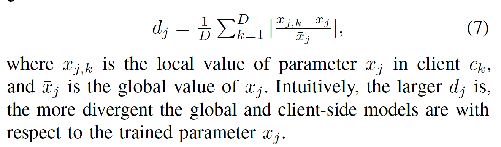
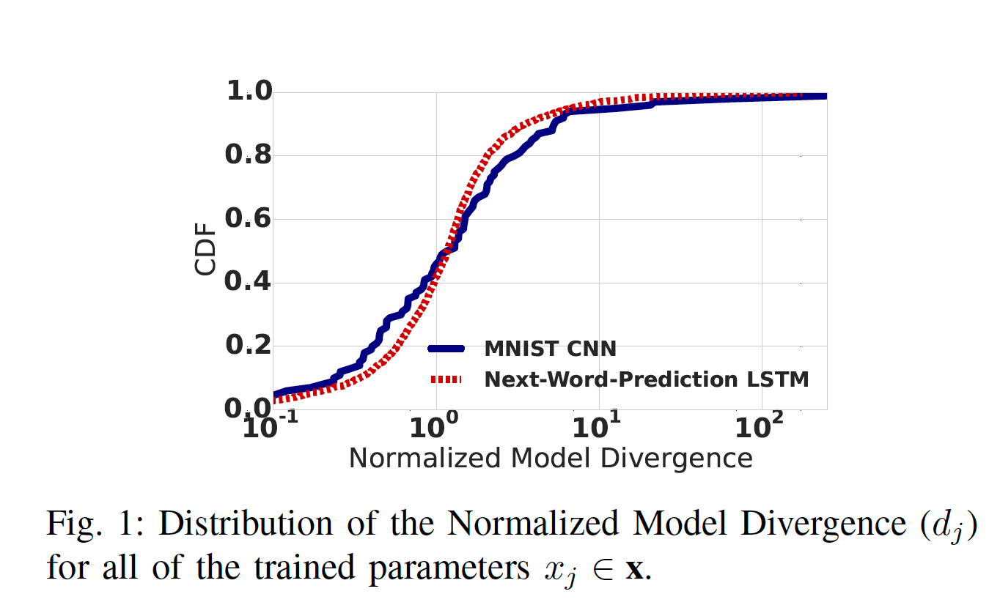
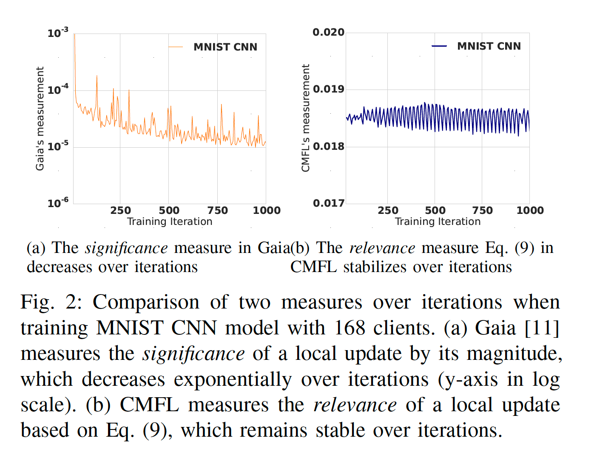
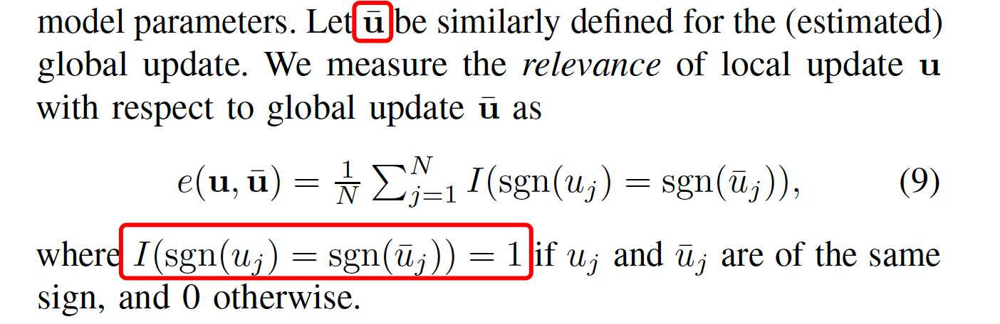

<head>

<!--支持网页公式显示-->    

</head>

<body>

  <h4>⚠ 转载请注明出处：<i>Maintainer: MinelHuang，更新日期：Jan.16 2022</i></h4>
  

  
  
  

   
  

      
  

  

  &nbsp;&nbsp;&nbsp;&nbsp;本作品由 <b>MinelHuang</b> 采用 <a rel="license" href="http://creativecommons.org/licenses/by-nc-nd/4.0/">知识共享署名-非商业性使用-禁止演绎 4.0 国际许可协议</a> 进行许可，在进行使用或分享前请查看权限要求。若发现侵权行为，会采取法律手段维护作者正当合法权益，谢谢配合。
  

 

  

    <h2> 目录 </h2>
    

  

  

    

    &nbsp;&nbsp;&nbsp;&nbsp;Section 1. <a href="#section1"><b>前言</b></a>：介绍CMFL的应用场景和Problems。
    

    &nbsp;&nbsp;&nbsp;&nbsp;Section 2. <a href="#section2"><b>CMFL</b></a>：CMFL的intuition和solutions。
  

<h2><a name="section1">1. 前言</a></h2>

  

  &nbsp;&nbsp;&nbsp;&nbsp;参考文献：<a href="https://ieeexplore.ieee.org/abstract/document/8885054">CMFL: Mitigating Communication Overhead for Federated Learning</a>. 2019. ICDCS  
  <h2>场景和Problem</h2>
  

  &nbsp;&nbsp;&nbsp;&nbsp;在横向联邦学习中，training通常是放在边缘设备上的，如个人手机或计算机。其过程通常是，中央服务器维护一个全局模型（global model），在一次迭代中，边缘设备上传其updates，而后中央服务器更新全局模型并下发至各边缘设备，一次迭代结束。在这里我们关注这一过程中的通信瓶颈，其分为两个方面：一是对于通信链路而言，部分边缘设备的network是很昂贵的，且不可靠的，比如使用4G的手机；而是对于数据量而言，在例如DNN训练中，updates的量非常庞大，通常由一个很大的gradient vector组成。这两方面原因使得在横向联邦学习中出现通信瓶颈。 
  

  &nbsp;&nbsp;&nbsp;&nbsp;下一个问题是，这种通信瓶颈会对系统造成哪方面的影响，即其系统metric是什么，如何量化？在一次迭代中，显然center server需要收集到足够多的updates后才能更新global model，所以当edge device和center server的通信开销无法被computation overlap，或与training time处于同一数量级时，通信开销便可能成为整个系统的瓶颈，其结果为可能大大增加了训练时间。于是其外在的metric可以是迭代时间，内在metric可以是data transfer的时间于迭代时间中的占比，或者是data transfer的次数。

  <h2>Solution</h2>
  

  &nbsp;&nbsp;&nbsp;&nbsp;通常有两类降低通信开销的方法，第一类为减少单次通信中的bit数，比如使用一些紧凑的数据结构来压缩updates；第二类为减少通信的次数，在本文中采用的是第二类方法。 
  

  &nbsp;&nbsp;&nbsp;&nbsp;简单来说，该问题可以转换为，edge device如何判断哪些updates需要上传，哪些不需要上传即可。此文章中定义了<b>irrelevant updates</b>，代表该update对于global model而言是divergent的（分歧的，分离的），那么便可以不传这些updates。具体而言，一次迭代中，client或称为edge device先收到一个feedback information（global update）；而后client进行本地的training过程并铲除local update；通过feedback information检测此次local update和global update的差异性，若差异性过大，则认为此次local update时irrelevant的，于是不上传。通过此方法，该算法（成为CMFL）成功的提高了FL速率，与state-of-art的工作相比，分别提高了13.97x（vanilla FL），1.97x（Gaia）。

  <h2>Related work</h2>
  

  &nbsp;&nbsp;&nbsp;&nbsp;CMFL主要对比的工作为Gaia，Gaia是一种为geo-distributed machine learning设计的communication优化器。其工作原理主要是，在训练开始前设置一个predefined threshold，定义significance来表示一个local update的重要程度，若小于阈值，则不进行传输。在定义significance时，Gaia关注的是模型训练的speed，而忽略了optimization direction。这里笔者仅是总结CMFL文章中的观点，具体Gaia是如何优化的可以参考<a href="https://neth-lab.netlify.app/publication/22-01-16-summary-of-gaia/">Summary of Gaia</a>。可以看到，横向联邦学习对比的应用场景是geo-distributed learning。

<h2><a name="section2">2. CMFL</a></h2>

  <h4>Intuition</h4>
  

  &nbsp;&nbsp;&nbsp;&nbsp;与Gaia的想法相同，我们希望可以减少跨WAN的传输，也即减少updates的规模。那么第一个问题，是否有一些updates是对模型收敛无用的，或者是用处较小的？ 
  

  &nbsp;&nbsp;&nbsp;&nbsp;在FL中，global model是通过对updates进行aggregation（例如求平均）后进行更新的，CMFL中提出了<b>Normalized Model Divergence</b>，指的是通过本地gradients更新得出的local parameters和通过平均后的gradients更新得到的global parameters之间的差异性，用如下式子定义： 

   
  

  &nbsp;&nbsp;&nbsp;&nbsp;CMFL测量了在MNIST CNN和LSTM两个算法中的差异性，如下图 
   
  

  &nbsp;&nbsp;&nbsp;&nbsp;可以看到超过50%的parameters存在高于100%的差异性，这代表着大部分本地updates对全局模型收敛的作用较小，甚至起到反作用。所以intuition是可以减少这一部分updates的传输.

  <h4>Challenges</h4>
  

  &nbsp;&nbsp;&nbsp;&nbsp;为达到上述目标，需要解决两个问题：1. 减少传输后还能否满足模型收敛？2. 如何measure the relevance of an update？ 
  

  &nbsp;&nbsp;&nbsp;&nbsp;在Gaia中，使用`||{Update}/{MODEL}|| < Threshold`的方式来表示insignificant，但是这样的significant function在FL中性能较差，原因如下： 
  

  &nbsp;&nbsp;&nbsp;&nbsp;1. FL中的训练数据是non-iid的，一些clients会有更重的training workload且优化更多的parameters，这些clients可能会因为significant function而终止上传updates，造成FL model性能下降。此外，update's magnitude同样依赖于learning rate。所以，很难选择一个全局的threshold来定义helpless updates。 
  

  &nbsp;&nbsp;&nbsp;&nbsp;2. Global model是许多clients的集合，故一个local update是否对模型优化有贡献，不能简单的在本地判断。 
  

  &nbsp;&nbsp;&nbsp;&nbsp;3. updates magnitude成指数下降，使得调整threshold很困难。CMFL做MNIST CNN做了一次threshold实验，当阈值为`5*10^{-5}`，在300轮以后几乎所有的updates都被认为是insignificant；当阈值设为`1*10^{-5}`，几乎所有的updates都认为是significant，如下： 
   

  <h4>Solution</h4>
  

  &nbsp;&nbsp;&nbsp;&nbsp;CMFL通过使用global update（即aggregate后的gradients）来判断local update是否是相关的。虽然此次迭代的global update不能预知，但可以使用上一次迭代的global update（论文中证明了两次迭代的global update差距很小）来估计。 
  

  &nbsp;&nbsp;&nbsp;&nbsp;使用下式来表示local update relevance： 
   
  

  &nbsp;&nbsp;&nbsp;&nbsp;通过该式，CMFL实现了动态判断updates的相关性，以决定是否传输。 
  

  &nbsp;&nbsp;&nbsp;&nbsp;本文还有一个关键部分为，对模型收敛性的证明，由于笔者自身工作不涉及此处，故不总结。证明部分位于论文Section 4-C处。

