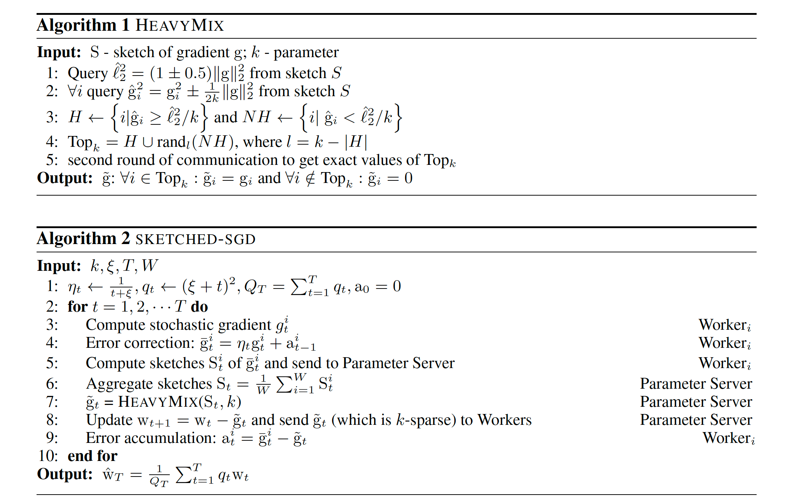
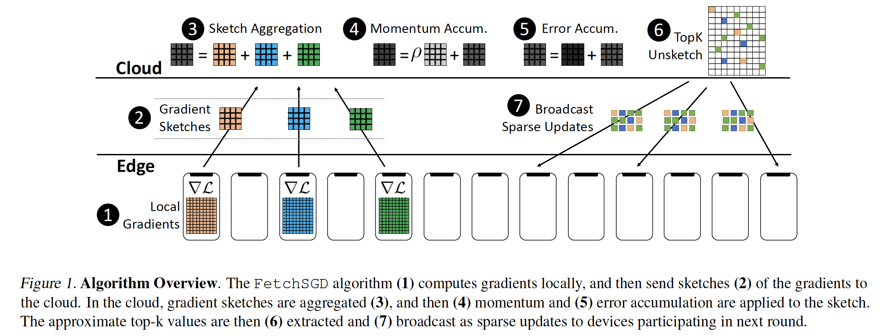
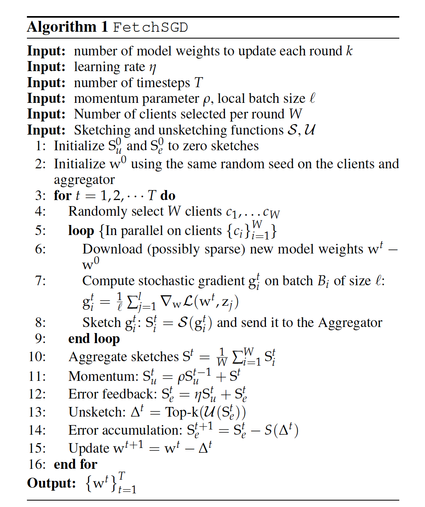
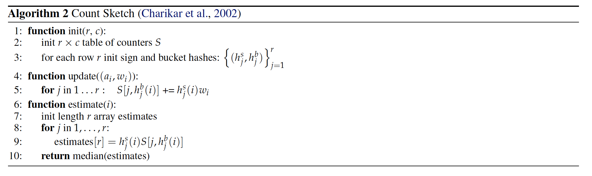

<head>

<!--支持网页公式显示-->    

</head>

<body>

  <h4>⚠ 转载请注明出处：<i>Maintainer: MinelHuang，更新日期：Jan.25 2022</i></h4>
  

  
  
  

   
  

      
  

  

  &nbsp;&nbsp;&nbsp;&nbsp;本作品由 <b>MinelHuang</b> 采用 <a rel="license" href="http://creativecommons.org/licenses/by-nc-nd/4.0/">知识共享署名-非商业性使用-禁止演绎 4.0 国际许可协议</a> 进行许可，在进行使用或分享前请查看权限要求。若发现侵权行为，会采取法律手段维护作者正当合法权益，谢谢配合。
  

 

  

    <h2> 目录 </h2>
    

  

  

    

    &nbsp;&nbsp;&nbsp;&nbsp;Section 1. <a href="#section1"><b>前言</b></a>：Sketching overview。
    

    &nbsp;&nbsp;&nbsp;&nbsp;Section 2. <a href="#section2"><b>Sketched SGD</b></a>
    

    &nbsp;&nbsp;&nbsp;&nbsp;Section 3. <a href="#section3"><b>FetchSGD</b></a>
  

<h2><a name="section1">1. 前言</a></h2>

<h2><a name="section2">2. Sketched SGD</a></h2>

  

  &nbsp;&nbsp;&nbsp;&nbsp;参考资料：<a href="https://arxiv.org/abs/1903.04488">Communication-efficient distributed sgd with sketching</a>. 2019. NIPS

  <h4>Intro & Related Work</h4>
  

  &nbsp;&nbsp;&nbsp;&nbsp;在分布式机器学习中，每个worker的计算时间和它身上的数据量正相关（data parallelism），但是通信时间于workers的数量无关。即使使用最佳的通信和计算交叉优化方法，总训练时间依旧依赖于最大的per-worker communication and computation time。所以，增加worker的数量到一定程度后，其对降低training time的作用将越来越少。 
  

  &nbsp;&nbsp;&nbsp;&nbsp;本文章中着重于降低每个worker的通信时间。对于SGD阶段，使用一种称为sketching的流算法，在保证收敛的条件下，每个worker只需发送O(log d)的gradient sketch，从而达到降低通信量的目标。

  <h4>Related Work</h4>
  

  &nbsp;&nbsp;&nbsp;&nbsp;在同步数据并行distributed SGD的情景下，一些研究专注于使用量化或稀疏化梯度来降低通信量。这类方法在降低通信量的同时，也增加了迭代次数。另一类稀疏化方法列入local worker只发送top-k coordinates的梯度，并对其做平均以获得一个近似的mini-batch gradient。这类方法在实践中很有效，但是目前依旧没有收敛性证明，因为近似的mini-batch gradient可能与真实的mini-batch gradient差距很大。第二个缺点是，即使使用一个很高的压缩率，其在传递parameters所需的通信量依旧是成O(W)增长的（W为worker数目）。 
  

  &nbsp;&nbsp;&nbsp;&nbsp;另一方面，所有的梯度压缩方法都受限于biased or unbiased gradient estimates。对于biased压缩，最近的一些研究表明worker本地的累积压缩误差可以克服weight updates重的bias，只要压缩算法满足一些特性。本文中的方法将尊从这一点，并可以证明用sketches压缩梯度可以满足收敛性。

  <h4>Background - Count Sketch</h4>
  

  &nbsp;&nbsp;&nbsp;&nbsp;参考资料：<a href="https://zhuanlan.zhihu.com/p/369981005">Count-min Sketch 算法</a>  
  

  &nbsp;&nbsp;&nbsp;&nbsp;该算法是一个用于寻找一个巨大vector中，元素出现次数的算法。一个intuitive的方法是，每进来一个元素x，如果则在hash(x)处增1。这样做的问题是，需要大量的存储空间，那有没有什么办法能只记录top-k个元素的计数呢？Count-min算法是其中一种，类似的算法还有Bloom filter等。下面我们简单叙述下count-min sketch的流程。 
  

  &nbsp;&nbsp;&nbsp;&nbsp;假设我们希望只记录出现次数第一至第m的一组元素，即top-m，那我们需要准备k个hash函数，以及k*m的矩阵。 
  

  &nbsp;&nbsp;&nbsp;&nbsp;对于任意元素x，计算`h_1(x), h_2(x), ..., h_k(x)`，在`k*m`中`(1, h_1(x)), (2, h_2(x)), ..., (k, h_k(x))`处自增1，此为插入过程。当所有的元素都插入完毕后，我们假设需要查询任意元素`y`出现了多少次，则需计算`h_1(y), h_2(y), ..., h_k(y)`，其中最大的值代表元素y的最多出现次数。 
  

  &nbsp;&nbsp;&nbsp;&nbsp;很明显，查询y的结果不一定是正确的，count sketch实际上是一个概率模型，即查询结果正确的概率为`Pr(success) > 1 - \delta`，我们可以根据数据流大小、精度和合理的概率值计算出一个能容忍的m和k，从而达到缩小sketch的目的。 
  

  &nbsp;&nbsp;&nbsp;&nbsp;总结来说，想要的错误范围越小，就要更大的m；想要更高的正确概率，就要更大的k，k*m即最后的矩阵大小。

  <h4>Sketched SGD</h4>
  

  &nbsp;&nbsp;&nbsp;&nbsp;该算法用于Parameter Server架构，过程为：PS将所有的workers上传的sketches进行求和，而后通过summed sketch中恢复最大的（top-k）梯度元素的大小。为了提高sketching的压缩特性，我们还将进行第二轮通信，即parameter server请求前top-k的gradients的准确值，而后使用这些进行模型更新。该过程为Algorithm 1。 
  

  &nbsp;&nbsp;&nbsp;&nbsp;这样一来，每一轮worker只需传输k个values，而不是整个gradient vector。其余的d-k个梯度在理论上和实践上都是十分重要的。我们可以在local error accumulation vectors中将这些元素加起来，并加入下一轮的gradient中。该过程为Algorithm 2。 

   

  

  &nbsp;&nbsp;&nbsp;&nbsp;现在笔者来解释上述algorithm。首先每个worker根据本地data计算出梯度`g_t^i`，假设这个梯度是F维的，也即一个包含F个元素的list。当F非常大时，显然通信开销会变得无法忽略。我们可以用Count Sketch算法来计算这个list中元素的出现权重（即count sketch中每一个bin加上的是gradient vector元素的值，而非计数），并将sketch发送给server。我们的目的是算出，在gradinet list中前k个元素（按大小排序）是什么，但是由于在分布式的场景下，各个worker计算出的sketch是不同的。可能worker a的元素i大，但元素j小；而worker b中i小，j大。所以必须在server处对sketches做聚合，而count sketch的线性性质很完美的解决了此问题。所以server简单的对所有sketches做平均，再去取其中k个最重要的元素即可。 
  

  &nbsp;&nbsp;&nbsp;&nbsp;从sketch中取k个元素的操作对应algorithm 1，首先我们对Sketch做query，提取出sketch中的元素。大于阈值的组成H矩阵，小于的组成NH矩阵，我们认为H矩阵中的元素是重要的，也即top-k。于是我们选出了k个元素，为了提高准确性，故进行second communication来获取gradient元素的实际值。 
  

  &nbsp;&nbsp;&nbsp;&nbsp;Sketch压缩是有偏的，假设所有的gradients满足正态分布，那么我们所选的top-k元素的均值可能会偏离正态分布的均值，所以是有偏的。

<h2><a name="section3">3. FetchSGD</a></h2>

  

  &nbsp;&nbsp;&nbsp;&nbsp;参考资料：<a href="https://arxiv.org/abs/2007.07682">FetchSGD: Communication-Efficient Federated Learning with Sketching</a>. 2020. ICML

  <h4>场景和Problems</h4>
  

  &nbsp;&nbsp;&nbsp;&nbsp;与Geo-distributed ML和FL的问题一致，跨Internet的网络带宽太小，使得传递中间变量（如gradients）所耗时间较多，成为瓶颈。在本文中提到了3个constrains，包括1. communication-efficiency，2. clients must be stateless，3. non-iid data distributed。

  <h4>Solution</h4>
  

  &nbsp;&nbsp;&nbsp;&nbsp;本文提出FetchSGD算法，其基本过程为：首先clients计算gradient；而后使用Count Sketch数据结构压缩gradients，并传递给central aggregator；Aggregator对Count Sketches进行aggregation；提取sketch中的top-k gradients，广播至clients。 
   

  <h4>Related Work</h4>
  

  &nbsp;&nbsp;&nbsp;&nbsp;<b>FedAvg</b> 
  

  &nbsp;&nbsp;&nbsp;&nbsp;FedAvg通过使用local/parallel SGD方法使得降低clients和server之间的通信开销，因为clients仅需要上传initial and final model之间不同的部分即可。FedAvg的优势在于算法不需要client states，但缺陷在于，假设clients仅参与一次训练过程，FedAvg并不能节省通信开销，并且FedAvg的精确度依赖于模型大小，即需要很大的模型，但在FL中很难在一次传输完如此庞大的模型。 
  

  &nbsp;&nbsp;&nbsp;&nbsp;<b>Gradient Compression</b>
  

  &nbsp;&nbsp;&nbsp;&nbsp;梯度压缩一半分为unbiased压缩和biased压缩两种。Unbiased方法包括量化和稀疏化，其主要需要解决的问题是对于压缩率和随机梯度方差之间的权衡。Biased梯度压缩方法包括top-k sparsification和signSGD。在这类方法中，通常也需要accumulate error，一般会在下一次迭代进行。但在FL中，accumulate error需要local client state，并不可行。 
  &nbsp;&nbsp;&nbsp;&nbsp;<b>Optimization with Sketching</b>
  

  &nbsp;&nbsp;&nbsp;&nbsp;最后一类方法称为sketching，即从所有的gradients中仅提取一个sketch进行传输。Sketch SGD算法需要second communication，这在FL实践中比较困难，因为clients随时可能离线。所以Fetch SGD依旧是通过skech寻找top-k个元素进行传输，那么有没有可能只需要一次通信呢？ 

  <h4>FetchSGD</h4>
  

  &nbsp;&nbsp;&nbsp;&nbsp;算法如下图： 
   
   
  

  &nbsp;&nbsp;&nbsp;&nbsp;Algorithm 1是Fetch SGD算法，Algorithm 2是其中Count Sketch部分算法。首先每个Client使用本地数据计算gradient vector，并使用count sketch对其进行压缩。与Sketch SGD相同，server对sketches做聚合，得到完整的sketch。Sketch SGD提出，使用count sketch中对mini-batch gradient的近似值并没有收敛性证明，并且可能和真实的mini-batch gradient差距很大。故在此文中引入momentum对sketch进行调整，使得还原后的今昔mini-batch gradient的无偏的。由于我们依旧使用了top-k方法，且top-k方法是有偏的，故引入error accumulation来保持收敛。于是，我们不需要引入second communication来消除近似mini-batch gradient带来的影响，也即仅需要一次通信。

