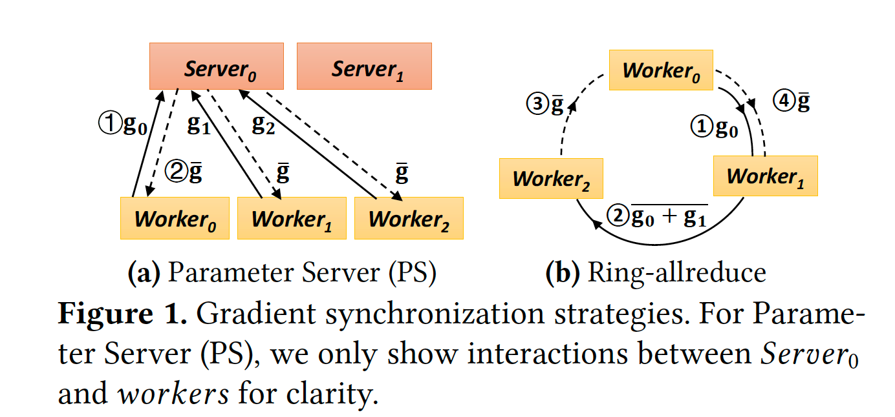
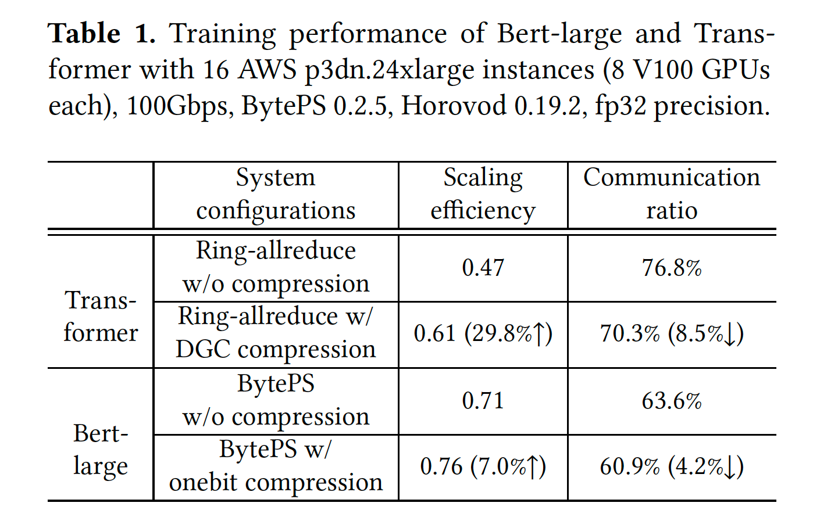
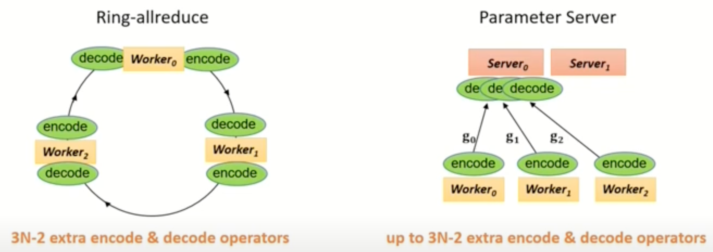

<head>

<!--支持网页公式显示-->    

</head>

<body>

  <h4>⚠ 转载请注明出处：<i>Maintainer: MinelHuang，更新日期：Feb.06 2022</i></h4>
  

  
  
  

   
  

      
  

  

  &nbsp;&nbsp;&nbsp;&nbsp;本作品由 <b>MinelHuang</b> 采用 <a rel="license" href="http://creativecommons.org/licenses/by-nc-nd/4.0/">知识共享署名-非商业性使用-禁止演绎 4.0 国际许可协议</a> 进行许可，在进行使用或分享前请查看权限要求。若发现侵权行为，会采取法律手段维护作者正当合法权益，谢谢配合。
  

 

  

    <h2> 目录 </h2>
    

  

  

    

    &nbsp;&nbsp;&nbsp;&nbsp;Section 1. <a href="#section1"><b>前言</b></a>：介绍场景和Problems。
    

    &nbsp;&nbsp;&nbsp;&nbsp;Section 2. <a href="#section2"><b>Background</b></a>：介绍背景知识和motivation。
  

<h2><a name="section1">1. 前言</a></h2>

  <h4>Scenario and Problems</h4>
  

  &nbsp;&nbsp;&nbsp;&nbsp;当前state-of-art的scaling DNN场景为，使用数据并行 + PS或Ring-AllReduce架构完成training的一次迭代，为了减少其中gradients的通信开销，通常引入gradient compression方法。其中，PS，AllReduce也代表了parameters的同步方式。文章的作者发现，gradient synchronizaiton和gradient compression之间的协调是低效的，也即communication和computation（后文简称Comm. and Comp.）之间的协同低效。 
  

  &nbsp;&nbsp;&nbsp;&nbsp;State-of-art的梯度同步策略为BytePS，在BytePS中，gradient synchronization所占的时间高达63.6%和76.8%（训练Bert-large和Transformer model）。我们可以引入gradient compression来降低通信开销，然而在实验中表明，training时间仅提高了1.3X，38.1% lower than expected performance。 
  

  &nbsp;&nbsp;&nbsp;&nbsp;那么为什么Comp. and Comm.之间的协调效率过低呢？这是因为压缩后的gradients并不能直接进行聚合 - 因为其和主流的optimization（例如gradient partitioning和batching）不匹配。那么将这种compression之间应用在DNN框架内后，其带来的额外computational overhead被忽视了，并且gradient synchronazation path被放大（笔者认为这句话的意思是，gradient compression带来的计算开销并没有均匀的分布式化，故体现在部分path过长，导致整个集群的等待）。因此，第一个challenge为如何在gradient sychronization过程中分摊Comm中额外的计算开销（例如encode和decode），那么我们需要首先identify合适的调度颗粒度。 
  

  &nbsp;&nbsp;&nbsp;&nbsp;第二个challenge是缺少一个compression-awareness的系统支持。没有这样的支持，DNN开发人员的开发过程将十分复杂，这些人员必须要精通底层架构（例如通信框架和接口）和压缩算法才能将其运用。 

  <h4>Contributions</h4>
  

  &nbsp;&nbsp;&nbsp;&nbsp;在本节我们概括性的总结文章的贡献。本文提出一个可组合的梯度同步架构，称为CaSync，其包含一个copression-awareness的同步系统，由解耦合的communication，aggregation和compression原语组成。这种细颗粒度的组成成分使得我们可以在高效的pipelining between Comm. and Comp.和高效的bulky execution of smaller tasks之间保持平衡。并且，CaSync提供了可选择的compresion and partitioning mechanism来决定是否compress每一个gradient，以及如何partition large gradients（在压缩前）以最佳优化pipeline和parallel processing。 
  

  &nbsp;&nbsp;&nbsp;&nbsp;其次，文章提出了on-GPU gradient compression toolkit，称为CompLL，其提供on-GPU梯度压缩API。 
  

  &nbsp;&nbsp;&nbsp;&nbsp;最后，文章建立了一个compression-aware data parallel DNN training framework，称为HiPress，由CaSync和CompLL组成。HiPress是和主流的DNN系统例如MXNet，TensorFlow和PyTorch兼容的。

<h2><a name="section2">2. Background</a></h2>

  

  &nbsp;&nbsp;&nbsp;&nbsp;由于本文章涉及内容较多，包括gradient compression，distributed DNN framework，pipeline等，故在此章节中对其分别概括叙述。同时，第一章并不能彻底讲明白为什么Comm.和Comp.协调低效，故在此章带着这个问题去讲解背景知识，以充分叙述motivation。

  <h4>Data Parallel DNN Training</h4>
  

  &nbsp;&nbsp;&nbsp;&nbsp;Data parallelism指的是，在各workers上保存一部分data partition，worker根据自身的partition去计算gradients，而后通过gradient sychronization完成aggregation。那么synchronization部分的实现通常为PS架构或AllReduce架构，如下图： 
   

  <h4>Computation and Communication Tension</h4>
  

  &nbsp;&nbsp;&nbsp;&nbsp;在确定了data parallelism和synchronization方式后，一次迭代便分为了Comp. 和Comm. 两个过程。现代DNN系统会在这两个过程中间加入pipeline以提高性能，例如同时运行两个DNN layer间的gradient communication和反向传播计算，这样可以隐藏掉上一次的overhead。然而，Comp. 和Comm. 间依旧存在tension关系。 
  

  &nbsp;&nbsp;&nbsp;&nbsp;近年，DNN加速器在单点计算能力上有了显著的提高，然而网络上行带宽并不能跟上computation的发展速度，这导致了Comp. 和Comm. 间的不平衡，所以在计算和通信之间建立pipeline的机会降低了（计算过程太快，通信太慢，故建立pipeline后可能并不会对性能有很大提升）。 
  

  &nbsp;&nbsp;&nbsp;&nbsp;一些state-of-art的工作对此做了优化，例如BytePS和Ring-allreduce，然而其scaling efficiencies（实际的performance/GPU个数/单块GPU performance）仅有0.71和0.47。通信时间占总训练时间的76.8%，且大部分是没有被hidden的，这意味着在state-of-art的系统中计算和通信中依旧有基本的tension关系。

  <h4>Gradient Compression</h4>
  

  &nbsp;&nbsp;&nbsp;&nbsp;为了削减通信压力，我们可以采用gradient compression来减少通信量，常见的有sparsification和quantization两类方法。稀疏化指的是传递那些重要的gradients，而量化通过降低gradients精度的方法来压缩。

  <h4>System Challenges and Opportunities</h4>
  

  &nbsp;&nbsp;&nbsp;&nbsp;在明确了以上background后，我们来叙述motivation。 
  

  &nbsp;&nbsp;&nbsp;&nbsp;在引入compression后，例如BytePS-onebit和DGC compression，其并没有明显的降低communication ratio，如下表： 
   
  

  &nbsp;&nbsp;&nbsp;&nbsp;这是因为co-design of BytePS and Ring-allreduce with the compression algorithms，也即sychronization和compression协调性差。这种协调性差体现在何处呢？通常，compression过程也是需要computation的，例如要增加encode和decode operator，并且我们没法直接在压缩后的gradient上直接做聚合。但显然synchronization过程并不能感知到压缩，所以compression带来的计算开销并没有完美的被执行，在co-design中可能某些worker承担了更多的计算过程（path过长），而整个集群都要等待这个worker计算结束，这种累积的计算开销明显的稀释了compression的性能。此外，co-design会使检验正确性过程和通用化梯度压缩方法变得复杂，所以第一件事我们想做的是，将sychronization和compression分离，以便后续的问题分析和系统设计。 
  

  &nbsp;&nbsp;&nbsp;&nbsp;第一个challenge是设计一种general的方法，来均摊梯度压缩带来的额外计算开销，在梯度sychronization的通信阶段时。实际上这是很苦难的，因为计算过程中包含了许多重要的factors，例如通信和计算间的依赖关系，通信拓扑，压缩速度和压缩率等。如果我们想要定位到这一个challenge，关键的是设计一个合理的scheduling颗粒度，即我们要在哪个layer来combining and coordinating various gradient compression and communication operators。 
  

  &nbsp;&nbsp;&nbsp;&nbsp;在Ring-allreduce中，对于一个batch的graident的同步过程采用一个全局的，原子的bulk synchronization operation来完成`2(N-1)`次点对点通信，也即其调度的颗粒度是bulk synchronization operation，掩盖了其中的点对点通信步骤，我们将其称为粗颗粒度。当加入compression后，显然compression影响的是其中的点对点通信过程，故all-reduce中bandwidth-optimal优化方法显然失效了。 
  

  &nbsp;&nbsp;&nbsp;&nbsp;而在PS中，同步过程为worker和server间独自交换gradients，即细颗粒度，其好处是便于做通信和计算间的pipeline来隐藏compression-related computational overhead，但同时其也带来了更多的communication steps，反之，也会产生更多的计算开销。 
  

  &nbsp;&nbsp;&nbsp;&nbsp;第二个challenge是提供系统支持 for developing, optimizing and integrating gradient compression algorithms into DNN。这里主要是讲述如何设计合理的原语以帮助开发人员快速开发。 
  

  &nbsp;&nbsp;&nbsp;&nbsp;总而言之，该文章想在framework层面解决通信和计算协调性差的问题。其方法是，将传统synchronization过程中的通信和计算解耦合，那么涉及的challenge为，解耦合后的组件颗粒度需要适宜，需要设计对外的general接口，能适应主流的sychronization和compression方法。

  <h4>Motivation in Presentation</h4>
  

  &nbsp;&nbsp;&nbsp;&nbsp;这里参考SOSP '21会议录屏：<a href="https://www.youtube.com/watch?v=xFSeIdO_gYg">SOSP 2021: Gradient Compression Supercharged High-Performance Data Parallel DNN Training</a>
  

  &nbsp;&nbsp;&nbsp;&nbsp;首先，在state-of-art的DNN训练框架下，communication overhead依旧限制了scaling eficiency，也即扩大cluster规模收益受限。作者通过在BytePS和Horovod两个框架下的实验得以论证。作者提出了cmmunication-computation tension，指的是越发提高cluster规模（即computation），则会导致更大的communication overhead。但是现阶段的computation发展速度大于communication，故模型更新的更快，communication的频率变快，故这种tension可能会变得更差。 
  

  &nbsp;&nbsp;&nbsp;&nbsp;于是我们可以用gradient compression去优化communication，作者使用state-of-art的compression去优化诸如Bert等模型，但依旧无法达到理论上的优化。这是因为compression同样是有计算开销的，并且在传统的sychronization过程中没有被隐藏，例如PS和Allreduce，如下图。 
   
  

  &nbsp;&nbsp;&nbsp;&nbsp;所以作者想要做的是，将诸如encode和decode过程在sychronization过程中隐藏，也即compression-aware synchronization strategy。当然，在implementation阶段，场景通常是GPU集群，故还需要设计一个easy-of-use的开发工具，或者说是好用的原语，向上兼容tensorflow等框架，向下兼容各类压缩算法。

