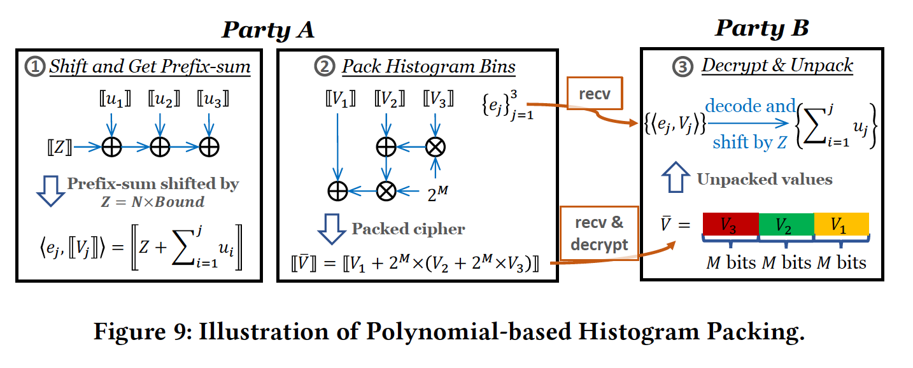

<head>

<!--支持网页公式显示-->    

</head>

<body>

  <h4>⚠ 转载请注明出处：<i>Maintainer: MinelHuang，更新日期：Feb.13 2022</i></h4>
  

  
  
  

   
  

      
  

  

  &nbsp;&nbsp;&nbsp;&nbsp;本作品由 <b>MinelHuang</b> 采用 <a rel="license" href="http://creativecommons.org/licenses/by-nc-nd/4.0/">知识共享署名-非商业性使用-禁止演绎 4.0 国际许可协议</a> 进行许可，在进行使用或分享前请查看权限要求。若发现侵权行为，会采取法律手段维护作者正当合法权益，谢谢配合。
  

 

  

    <h2> 目录 </h2>
    

  

  

    

    &nbsp;&nbsp;&nbsp;&nbsp;Section 1. <a href="#section1"><b>前言</b></a>：介绍场景和Problems。
    

    &nbsp;&nbsp;&nbsp;&nbsp;Section 2. <a href="#section2"><b>Architecture and details</b></a>：介绍VF2Boost的具体优化方案。
  

<h2><a name="section1">1. 前言</a></h2>

  

  &nbsp;&nbsp;&nbsp;&nbsp;参考资料：<a href="https://dl.acm.org/doi/abs/10.1145/3448016.3457241">VF2Boost: Very Fast Vertical Federated Gradient Boosting for Cross-Enterprise Learning</a>. 2021. SIGMOD  

  <h2>场景和Problems</h2>
  

  &nbsp;&nbsp;&nbsp;&nbsp;该文章针对的场景为Cross-Enterprise纵向联邦树模型（联邦GBDT或SecureBoost），对于联邦树模型的介绍可以参考<a href="https://neth-lab.netlify.app/publication/21-09-01-machine-learning-and-federated-learning/#section6">Machine Learning & Federated Learning. Secureboost</a>。本文中，假设参与方为两个，Party A不持有标签，Party B持有标签，两方各自持有一个数据中心用于训练，故Cross-Enterprise或Cross-Silo场景下，party内部运行的为分布式ML。通常，SBT的流程如下： 
   
  

  &nbsp;&nbsp;&nbsp;&nbsp;SBT通常包含三步，第一步为Party B计算Gradients and Hesses并使用同态加密算法进行加密，而后通过Internet传递给Party A；第二步为Party A和B构造构造histograms，各party根据自身instances的feature取值，在histogram矩阵的对应位置将gradient和hess加上，即表现为累加的过程；第三步为find best split，该步则是更新global tree至下一个深度。 
  

  &nbsp;&nbsp;&nbsp;&nbsp;当前的implementation为串行实现，即在执行步骤1时，Party A idle；计算histograms时，先是Party A计算，后是Party B计算。所以在大部分时间中，总有一个Party陷入完全的idle状态。再带入同态加密和数据特征，我们可以归纳出一下两个bottleneck： 
  

  &nbsp;&nbsp;&nbsp;&nbsp;1. Party A等待Party B进行加密/解密操作；由于同态下的计算（于Party A）时间远大于明文计算（于Party B），在构造histogram时Party B往往陷入长时间的等待。 
  &nbsp;&nbsp;&nbsp;&nbsp;2. Party A构造histogram时为同态密文加法，在encode时我们使用base+exponent的表示方法，所以两个exponent不同的数相加，实际上表现为scaling operations，有很大的时间开销。此外，树节点数量随树的深度而指数增长，故histogram的规模也在指数增长，增加了通信和解密的时间。 

  

  &nbsp;&nbsp;&nbsp;&nbsp;根据以上分析，作者进行了motivation实验，结果如下图： 
   

  <h2>Solution Overview</h2>
  

  &nbsp;&nbsp;&nbsp;&nbsp;文章的核心idea是，能否使用computation & communication overlap以节省一部分时间，故最开始我们会根据加密和histogram的计算时序图来分析，于哪一步可以overlap；针对bottleneck 2，需要重新思考对histogram accumulation顺序，来减少scaling带来的额外开销。 

<h2><a name="section2">2. Architecture and Details</a></h2>

  <h2>System overview</h2>
  

  &nbsp;&nbsp;&nbsp;&nbsp;系统框图如下： 
   
  

  &nbsp;&nbsp;&nbsp;&nbsp;SBT的workflow分为四步：第一步为Gradient statistics encryption，该步的优化为<b>blaster-style encryption</b>；第二步为Histogram construction，该步的优化为<b>re-ordered accumulation technique</b>；第三步为Split finding，该步的优化为<b>polynomial-based histogram packing technique</b>；第四步为Node splitting，该步引入了optimistic node-splitting strategy。在下一章笔者将给出每一步的具体实施细节以及具体优化了哪些步骤。 

  <h2>Blaster-Style Encryption</h2>
  

  &nbsp;&nbsp;&nbsp;&nbsp;为了判断哪些计算或通信pattern可以overlap，文章中绘制了encryption的Gantt chart，如下： 
   
  

  &nbsp;&nbsp;&nbsp;&nbsp;可以看到，由于party间是通过Internet通信，故其带宽是受限的，无可避免的引入了相当大的一部分communication时间（加密后，每个64bit数都会被扩展到2048bits）。我们发现，对于Comm后一步的BuildHistA来说，并不是需要所有的G和H（即需要被传输的量）才可以开始。所以我们可以将Gradients and Hesses分成一个个小batch，依次加密-传输-计算histogram，即blaster-style encryption。 

  <h2>Optimistic Node-Splitting</h2>
  

  &nbsp;&nbsp;&nbsp;&nbsp;在上一步我们成功的将构造histogram过程中的Comp. 和Comm. overlap，那么在histogram之后为node-splitting过程，该过程中是否有可以overlap的子计算呢？首先简述下Split过程，该过程是针对每一个feature分割点计算scores，score最高的点则为最佳分割点。在FL场景下，feature一部分在Party B，一部分在Party A，所以计算score可以分为FindSplitB和FindSplitB，该步骤的workflow如下图： 
   
  

  &nbsp;&nbsp;&nbsp;&nbsp;可以看到，FindSplitB需要在Party B计算出G和H后才能进行，FindSplitA必须在Party B收到histogram并解密完才能进行故在这里无法overlap。但是在SplitNode阶段，包含了一个同步过程，即Party A和B要保证都知晓树的这一层的分割情况并更新树和instance placement。然而，当Party B有更好的split点时，这种同步实际上是浪费时间的，故在此作者引入了optimistic locks（数据库技术）来设计一个optimistic node-splitting strategy。 
  

  &nbsp;&nbsp;&nbsp;&nbsp;这里通过一个理想下的例子来说明。假设最佳分割点永远位于Party B，也即instance placement的计算永远由B计算。 
  

  &nbsp;&nbsp;&nbsp;&nbsp;本文提出的strategy的workflow如上图下半部分：Party B在加密完后，直接进行FindSplitB，并假定最佳分割点位于B处，紧接着进行SplitNode和下一层的FindSplitB，不必等待A的BuildHistA过程。当计算完下一层B处各个feature分割点的score后，Party B开始等待。而后，Party A完成了histogram的构造并将结果发送给B，此时B直接将node split结果发送回A，A在接受完后立刻开始下一层的histogram构建。注意，此时的node split结果不一定是准确的，但是当我们假设split点永远在B时，如此运行依然可以得到正确的结果。此时我们可以注意到，FindSplitA和BuildHistA overlap起来了。 
  

  &nbsp;&nbsp;&nbsp;&nbsp;那么假如最佳分割点不在B处呢？此时的场景为，FindSplitA给出了更好的结果，这意味着与其overlap的BuildHistA是无效的，故需要重新进行node split和构建histogram过程。但是这样和原版的implementation实际上是一致的，并没有引入额外的时间开销。所以，当split分割点于B处，则节省了时间，在A处，则按照原版的方式执行，不引入额外的时间开销，通过这样一种贪心的思想，成功的overlap了histogram构建和findsplitA。

  <h2>Re-ordered Histogram Accumulation</h2>
  

   
  

  &nbsp;&nbsp;&nbsp;&nbsp;可以看到，在naive的做法中，由于各个密态数的指数部分不同，例如0.1和0.01，相加时需要额外的做一次scaling的操作，图中表现为红色箭头部分。但实际上可以通过调换加法顺序来避免额外的scaling，如上图下半部分，也即re-ordered。所以这里的做法为，在执行加法操作前，先根据各密态数的指数部分（指数部分是明文）进行排序，再相加。

  <h2>Histogram Packing</h2>
  

   
  

  &nbsp;&nbsp;&nbsp;&nbsp;该部分实际上思想与BatchCrypt相同，histogram很大，那为什么不使用batch压缩一下呢？具体做法为，step 1将histogram构造，step 2将所有的bin使用batch+量化压缩进一个2048bits数中，具体表现为密态下的移位相加，在接收方进行解密和解码即可。

