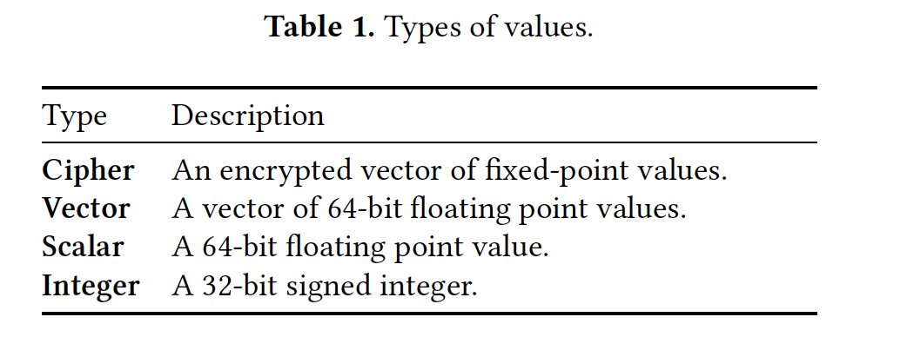

<head>

<!--支持网页公式显示-->    

</head>

<body>

  <h4>⚠ 转载请注明出处：<i>Maintainer: MinelHuang，更新日期：Apr.12 2022</i></h4>
  

  
  
  

   
  

      
  

  

  &nbsp;&nbsp;&nbsp;&nbsp;本作品由 <b>MinelHuang</b> 采用 <a rel="license" href="http://creativecommons.org/licenses/by-nc-nd/4.0/">知识共享署名-非商业性使用-禁止演绎 4.0 国际许可协议</a> 进行许可，在进行使用或分享前请查看权限要求。若发现侵权行为，会采取法律手段维护作者正当合法权益，谢谢配合。
  

 

  

    <h2> 目录 </h2>
    

  

  

    

    &nbsp;&nbsp;&nbsp;&nbsp;Section 1. <a href="#section1"><b>前言</b></a>：介绍全同态算法和Problems。
    

    &nbsp;&nbsp;&nbsp;&nbsp;Section 2. <a href="#section2"><b>EVA language</b></a>：从EVA提供的接口开始。
  

<h2><a name="section1">1. 前言</a></h2>

  

  &nbsp;&nbsp;&nbsp;&nbsp;本文探讨的场景为全同态加密（FHE），以state-of-art的CKKS为主要讨论对象。在本节中，我们先从介绍CKKS算法开始。 

  <h4>CKKS算法流程</h4>
  

  &nbsp;&nbsp;&nbsp;&nbsp;CKKS算法的安全性基于RLWE问题，全称为Ring Learning With Error。本文希望通过容易理解的话，来阐述CKKS算法，具体的数学定义请参考其他文章。首先，RLWE问题需要构造`(-a·s+e, a)`对，其中`a`, `s`, `e`均为一个最高项次数不超过`N-1`的多项式。但显然，输入的明文数据`m`显然不是一个多项式，那么第一个问题是，如何将明文变成一个符合RLWE条件的多项式？ 
  

  &nbsp;&nbsp;&nbsp;&nbsp;下面我们来描述CKKS是怎么做的。首先，定义明文m是一个复数向量，即该向量中的每一个元素都是一个复数。定义`\pi^{-1}`变换和`\sigma^{-1}`变换，其中`\sigma^{-1}`变换将一个复向量映射到了一个复数多项式上，但是我们在实际应用中很难实现复数，故在`\sigma^{-1}`变换前引入`\pi^{-1}`变换，使得最终可以得到一个正整数多项式，即多项式中的每一项系数都为正整数。该多项式记为`m(X)`。于是，我们可以通过两个变化将明文`m`转换为一个符合RLEW问题的多项式`m(X)`，这一过程我们统称为encode。 
  

  &nbsp;&nbsp;&nbsp;&nbsp;在了解了CKKS encode过程后，我们还需要了解一些细节。首先，CKKS中是有损的，这指的是有时我们不能找到完美的`\pi^{-1}`变换使得 

  

  &nbsp;&nbsp;&nbsp;&nbsp;<b>未完成</b>

  <h4>FHE带来的challenges以及contributions of EVA</h4>
  

  &nbsp;&nbsp;&nbsp;&nbsp;评定FHE操作优劣的指标可以被分为correctness, performance and security。其中，correctness是指的，两个密态数需要在同一个层级才能evaluate，在进行了一系列evaluations后，FHE自带的error不可以过大从而影响解密结果的正确性，在这里我们引入重缩放来降低密态数的层级以及error。performance指的是，重缩放rescaling、重线性modules switching等操作是time-consuming的。故一个不好的execution会影响FHE的correctness和performance，所以我们要求应用FHE的开发人员要熟练掌握FHE技术，这是对开发不友好的。 
  

  &nbsp;&nbsp;&nbsp;&nbsp;EVA的目的便是封装FHE操作，使上层开发人员不需要设计FHE密态数的执行方案，也即hides all the complexities，同时保证encryption evaluation是correct, performant and secure。 
  

  &nbsp;&nbsp;&nbsp;&nbsp;下面，我们来尝试总结使用FHE带来的挑战： 
  &nbsp;&nbsp;&nbsp;&nbsp;1. Depth of Computation: 首先，FHE中的加密数是携带error的，在进行密态运算后，error会指数倍的增加。对于一个evaluation电路而言，必须要优化circuit for low depth。 
  &nbsp;&nbsp;&nbsp;&nbsp;2. Relinearization: 重线性化。在CKKS加密后，一个明文向量会被转换层`(c_0, c_1)`的多项式对，如果两个密文多项式相乘，且分别包含k和l个多项式，那么最终的结果会包含`k+l+1`个多项式。故为了保证乘后的密文多项式与evaluate之前保持一致，FHE引入重线性化来将`k+l+1`个多项式的表示重新转换为2个。 
  &nbsp;&nbsp;&nbsp;&nbsp;3. CKKS and Approximate Fixed-Point: CKKS算法对FHE evaluation又提出了新的要求，称为approximate results。在CKKS中有两类errors，其一是encoding过程中多项式系数是有损的，其二是所有的同态operation会向密文中引入噪声。为了解决这一问题，CKKS引入了scaling操作，即每一个原始数据都被assign了一个较大的缩放因子`\Delta`，用于掩盖error项。这个缩放因子很容易导致密态数溢出，例如，两个缩放因子同为`\Delta`的密态数相乘，结果的缩放因子上升到`\Delta^2`。故，CKKS中引入了重缩放（rescaling）操作来降低缩放因子，以阻止溢出。重缩放的另一个好处是可以降低error的影响以及降低密态数的level。 
  

  &nbsp;&nbsp;&nbsp;&nbsp;由此，我们可以发现，一个FHE计算系统需要tradeoff何时进行重线性化和重缩放，一个不好的执行方案会导致overflow，error过大或多次scaling和rescaling，导致correctness被破坏或者performance下降。EVA希望能够封装该问题，使得developer不再需要关注这些问题，高效的完成FHE evaluation。

<h2><a name="section2">2. EVA language</a></h2>

  

   
  

  &nbsp;&nbsp;&nbsp;&nbsp;上表为EVA中的数据类型。在EVA中，计算拓扑为DAGs图，其中node的类型为上表中的一种，DAGs图如下图所示。 
   
  

  &nbsp;&nbsp;&nbsp;&nbsp;在该计算拓扑中，当一个顶点包含两条以上的入边，则称为instructions。一个instruction中包含function以及function需要的parameter，代表在执行过程中，会使用该function和输入node数据计算新的result。详细点说，parameters写作n.parm，function写作n.op。Table 2中给出了所有的operation，如下： 
   
  

  &nbsp;&nbsp;&nbsp;&nbsp;其中，group one中的instructions根据program中生成，group two中的instructions由complier插入。对于没有incoming edges的节点称为constant，代表在compile time is available；将node称为input，代表其在run time is available。

