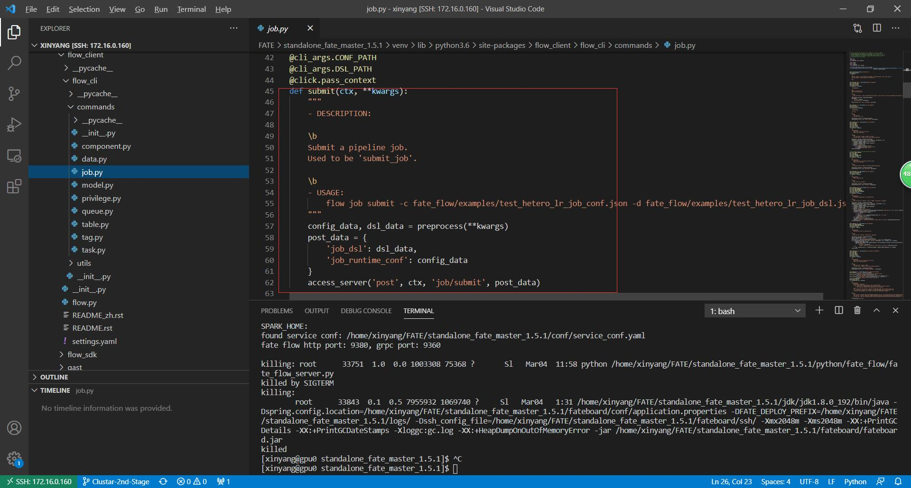

更新时间：2021-03-05

参考资料：

- [FATE documents](https://fate.readthedocs.io/en/latest/index.html)
- [FATE Github](https://github.com/FederatedAI/FATE)

# 1 FATE文件框架

## 1.1 根目录框架

以单机部署为例：


概述如下，加粗为重要文件：

- **bin**：主要为init_env.sh，用于配置路径
- **conf**：系统配置文件，系统的初始化是由.yaml文件配置的，这里预放置一些配置文件供用户修改
- data：未知
- **examples**：提供的例程
- fateboard：可视化界面
- jdk：java本体
- jobs：用户通过client接口提交的jobs
- logs：jobs的处理日志
- miniconda3-fate：miniconda本体
- model_local_cache：未知
- **python**：系统代码本体
- system-package：一些包
- **venv**：用户配置的python虚拟环境

## 1.2 python目录下框架


概况为下：

- fate_arch：未知
- fate_client：为用户提供的操作接口，包括数据上传，开始训练模型等命令
- fate_flow：fate系统的任务提交系统，即用户通过fate_client上交一个任务（job）后，fate系统是以什么样的流程处理它的。
- fate_test：为用户提供的调试接口口
- federatedml：联邦学习算法库

由此我们可以很清晰的发现，fate的系统大致可以概括为，用户通过fate_client系统（很多api）将job提交至fate_server，server接受到job后通过fate_flow进行任务调度，最终调用federatedml完成联邦学习任务。

# 2 FATE_FLOW

本章通过研究FATE主体部分，以得出系统运行和系统框架细节

参考资料：[FATE Offical Documents](https://fate.readthedocs.io/en/latest/_build_temp/python/fate_flow/README.html)

## 2.1 Introduction

FATE-Flow是一个job scheduling系统，完成FL任务的管理任务，包括data input，training job scheduling，indicator tracking，model center和其他功能


## 2.2 Architecture


## 2.3 通过./examples追溯FATE-Flow

参考资料：

- [example使用方法](https://github.com/FederatedAI/FATE/tree/master/examples/dsl/v1)
- [FATE-Flow使用方法](https://github.com/FederatedAI/FATE/blob/master/python/fate_client/flow_client/README_zh.rst)

example选择./examples/dsl/v1/hetero_logistic_regression

刚刚上面有说过，用户是通过fate-client命令接口将任务提交给fate server的，在这里，dsl即是一种fate-client，pipeline是另一种fate-client，都是为用户提供的简易提交任务接口而已。那么在运行dsl前，很显然我们需要告诉fate-client谁是fate server（可能是本机，也可能是集群里的另一台计算机）。

那么下面则是使用dsl，分步骤运行该example，注意所有路径的根目录味./examples/dsl/v1

注：该部分仅是用于一份例程追溯FATE系统架构，而非FATE例程使用教学。这里笔者想搞清楚的问题是，fate-client和fate-server都是以何种方式运行的，fate-server中各组件的运行代码在何处，为后面阅读系统源码做铺垫。

### 2.3.1 运行例程

#### 2.3.1.0 Step 0：初始化fate flow

该步骤只需做一次，我们是通过client将job提交至fate server，那么若是fate server在本机，我们需要初始化fate server中运行的fate flow，系统配置文件位于：./conf/service_conf.yaml

通过：

```
flow init -c ./conf/service_conf.yaml
```

初始化fate-flow，默认配置文件为standalone模式，即将本机配置为server

#### 2.3.1.1 Step 1：Define upload data config file

该步骤的目的是，将待处理数据传递至server，dsl通过上传./upload_data.json实现该功能


该文件的各条目意义为：

| file:                   | file path                                                    |
| ----------------------- | ------------------------------------------------------------ |
| head:                   | Specify whether your data file include a header or not       |
| partition:              | Specify how many partitions used to store the data           |
| table_name & namespace: | Indicators for stored data table.                            |
| work_mode:              | Indicate if using standalone version or cluster version. 0 represent for standalone version and 1 stand for cluster version. |

#### 2.3.1.2 Step2: Define your modeling task structure

该步骤主要是定义modeling task中包含哪些组件（视算法而定），比如data_io, feature_engineering, algorithm_model, evaluation等等。在dsl中，用户通过提交dsl conf文件来简易定义上述structure，examples中每个算法，官方都提供了相应的.json文件供用户参考。一个dsl conf文件例子路径为：./hetero_logistic_regression/test_hetero_lr_train_job_dsl.json

#### Field Specification

| component_name: | key of a component. This name should end with a "_num" such as "_0", "_1" etc. And the number should start with 0. This is used to distinguish multiple same kind of components that may exist. |
| --------------- | ------------------------------------------------------------ |
| module:         | ***Specify which component use. This field should be one of the algorithm modules FATE supported.***<br />The supported algorithms can be referred to [here](https://github.com/FederatedAI/FATE/blob/master/examples/python/federatedml/README.rst)<br /><br />input: 两类input - data和model<br />output:两类output - data和model |
| need_deploy:    | true or false. This field is used to specify whether the component need to deploy for online inference or not. This field just use for online-inference dsl deduction. |

#### 2.3.1.3 Step3: Define Submit Runtime Configuration for Each Specific Component.

样例路径./hetero_logistic_regression/test_hetero_lr_train_job_dsl.json

该步骤用于配置每个party的组件参数：

1. initiator：指明initiator的身份（guest还是host），以及party id
2. job_parameters：runtime配置
3. role：为所有roles指明对应的party ids
4. role_parameters：指明好每个party所相应的parameters
5. algorithm_parameters：所有parties在此都相同

#### 2.3.1.4 Step4: Start Modeling Task

将上述三步使用flow命令上传至服务器

例如：

```sh
python ${your_install_path}/python/fate_flow/fate_flow_client.py -f upload -c upload_data.json

python ${your_install_path}/python/fate_flow/fate_flow_client.py -f submit_job -d hetero_logistic_regression/test_hetero_lr_train_job_dsl.json -c hetero_logistic_regression/test_hetero_lr_train_job_conf.json
```

#### 2.3.1.5 Step5: Check out Results

#### 2.3.1.6 Step6: Check out Logs

#### 2.3.1.7 运行./examples/dsl/v1/hetero_logistic_regression

step 1：上传guest、host数据

```
flow data upload -c ./examples/dsl/v1/upload_data_guest.json 
flow data upload -c ./examples/dsl/v1/upload_data_host.json 
```

step 2：上传model structure conf和runtime conf

```
flow job submit -c ./examples/dsl/v1/hetero_logistic_regression/test_hetero_lr_train_job_conf.json -d ./examples/dsl/v1/hetero_logistic_regression/test_hetero_lr_train_job_dsl.json
```

开始运行

### 2.3.2 溯源flow

很明显，上述操作我们都是作为client操作的，最终可以溯源的仅为flow命令。大致也明白是通过flow命令，将配置文件上传至server，但是这具体细节是什么？

故我们可以查看flow命令的源代码，首先明确，我们的指令实在venv环境下运行的，并且flow-client是通过pip安装的，故指令位于venv/bin中：


继续寻找flow.cli


很明显，我们找到了flow所有命令的源代码

上传任务所用的是flow job，故我们可以继续溯源：



显然，submit之后实际上运行了一个叫做acess_server的函数，显然这个函数是用于连接fate server的，接着寻找该函数，发现是


继续寻找。。。


终于找到了，原来是通过https向fate server传递的文件，所以fate server一定是一直运行在一个进程中，我们不知是什么时候开启了fate server，但是我们可以预判，这一开启操作并不是在venv中完成的，因为fate flow本体位于standalone文件中，故在standalone中寻找开启server的命令。

查看以前的log，发现在部署standalone时我们有运行几个文件来初始化以及测试fate


查看该文件


终于，我们找到了fate server的入口：fate_flow_server.py

### 2.3.3 fate server解读

