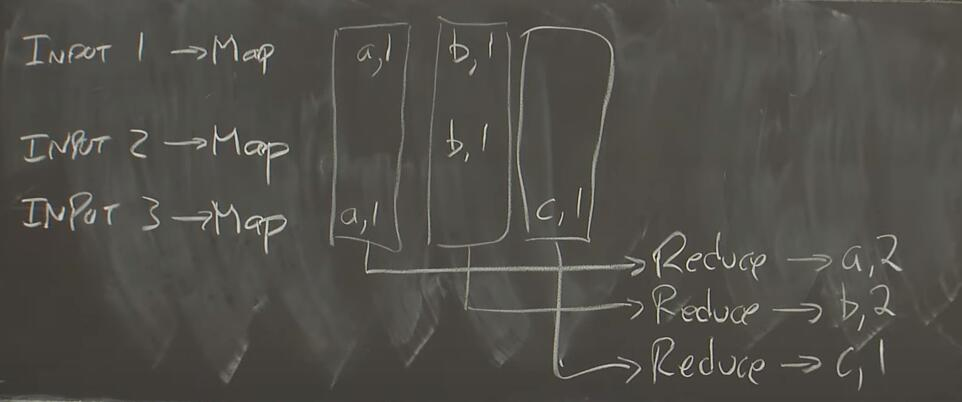

更新时间：2021/06/04

# 01 Introduction

参考资料：[MIT lecture 01](https://www.youtube.com/watch?v=cQP8WApzIQQ&t); [Paper: MapReduce]()

分布式系统：a set of cooperating computers communicated with each other over networked to get some coherent task done.

系统需要考虑的问题：parallelism, fault toleration, physical, security / isolated

为什么设计分布式系统很难：许多东西会execute concurrently，从而带来了复杂的interactions；unexpected failure patterns（partial failure）；performance 

paper中描述的东西：

- Infrastructure：包括storage，communication，compution 分布式系统设计的终极目标是，设计出一种抽象层（abstraction），让使用者感受不到这个系统是分布式的。
- Implication：RPC, threads等
- Performance：寻求scalability（2x computers意味着2x throughput）
- Fault-Tolerance：指在出现一定错误下，系统依然availability。这里的availability包括recoverability
- consistency（一致性）：包括强一致性和弱一致性

## MapReduce

为什么要设计MapReduce？Google需要处理海量的文件（由Web服务产生），为了降低延迟，需要使用一个分布式系统（几千台计算机）来处理。那么每个处理任务是使用不同的程序的，难道需要针对一个任务写一个独立的分布式应用程序吗？这太expensive。所以MapReduce出现了，搭建出一个分布式框架，使应用开发者不需要考虑如何将程序扩展到几千台计算机上，仅仅需要编写Map函数和Reduce函数，就可以完成大部分功能。

举个例子，假如Google需要统计所有文件中的词汇的个数，那么系统可以抽象成下图：

我们打算使用3台机器分别处理1，2，3号文件，那么首先文件会进入Map函数，将**一个文件中的数据（一个k-v pair）处理成一组k-v pairs**，(a, 1)代表词汇a出现了1次，（b, 1）代表词汇b出现了1次；而后，将所有的k=a的(k, v)输入进Reduce函数，b和c同理，在Reduce函数里做**多个(k, v)的运算，使之输出1个(k,v)**。最终，我们实现了统计词汇的功能。

在MapReduce中，Map负责将一个文件分解为多个(k, v)组合，Reduce负责将多个(k, v)合并成1个v，我们发现在编写Map函数或Reduce函数时，不会意识到这些函数是运行在分布式系统中的，也即，MapReduce实现了abstraction的目标。

我们会发现，MapReduce非常简单，这意味着它只能处理部分计算任务，但它是很有效的，因为大量的计算任务可以被分解成Map和Reduce，并具有大量的迭代次数，所以MapReduce到目前为止依然是使用最广泛的分布式计算系统。

下面我们要着重思考的是，MapReduce framework如何处理上一小节所提出的问题，比如Fault-tolerance等。

课程到此已经结束，若对MapReduce有兴趣请参考[Summary of MapReduce]()

# 02 RPC and Threads

参考资料：[MIT lecture 02](https://www.youtube.com/watch?v=gA4YXUJX7t8)

Go语言：good support for threads and locking and synchronization, 它的优势是type safe and memory safe，所以go program很难出现由于内存而导致的bug

Threads：main tool to manage concurrency in programs 

为什么使用线程：1. I/O concurrency：指在多个activities中，每个activity都可以有它自己的point来标明自己运行在哪里，故可以保证不会出错。那么一台机子上就可以通过线程管理，来运行多个activities。  2. parallelism：一个CPU可以同时运行多个threads，从而加速。  3. Convenience：运行一些周期性函数

thread challenges：share memory导致be easy to get bug，两个线程同时对一个内存进行操作而产生的问题，成为RACE。解决办法可以使用locks。第二个问题是coordination，即两个线程需要进行协作，比如为交互一些信息而带来的等待，解决的办法有channels, condition variables, wait group。最后一个问题是Deadlock

# 03 GFS

参考资料：[MIT lecture 03](https://www.youtube.com/watch?v=EpIgvowZr00)

GFS: Google File System
目标：big storage systems

为什么hard：
1. 性能和分区：为了支持成百上千台机器使用
2. 容错：自动修复错误和容错措施，方法可以是replication
3. replication带来一致性问题
4. 一致性带来low performance

GFS的特点：
1. 适用于单一的datacenter
2. 提供间接服务
3. 为big sequential access设计（非 random access）
4. 优化目标主要为提高吞吐量，而非时延

# 04 Primary-Backup Replication
参考资料：[MIT lecture 04](https://www.youtube.com/watch?v=M_teob23ZzY)

Replication可以解决何种failures？
Covered： 由错误导致的stop：某些错误使计算机停止工作（停电、网络通信错误等）
Not Covered：程序bug、系统设计错误等

该paper提出两个主要技术点：state transfer和replicated state machine
1. state transfer：这是一种，直接拷贝primary的状态（可能使memory/RAM等）的复制方法
2. replicated state machine：大部分应用中，计算机处理一个event包含了很多的内部过程，该方法仅拷贝primary所经历的外部events（例如从外部输入的某些参数），backup计算机便可恢复primary所经历的所有过程。

随着多核/并行架构的出现，复制状态机的方法并不能很好的满足需求（不够robust），故在该情况，常考虑直接复制state

业界在设计backup系统时所常考虑的因素：
1. 复制何种状态
2. 如何使primary和backup更接近同步状态
3. 如何设计一个cut-over系统（切换系统），使Client从old primary切换至backup
4. 现实世界中一定会发生异常，如何针对这些异常状况（即使异常是不可见的）
5. 如何快速生成一个新的backup server/computer