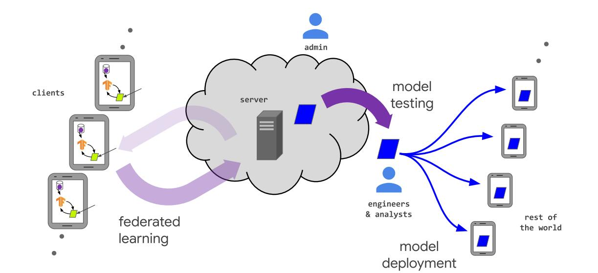

更新时间：2021/03/01

参考资料：github论文库[Awesome-Federated-Learning](https://github.com/chaoyanghe/Awesome-Federated-Learning)

## 0 wiki/blog上的联邦学习

参考资料：[wiki](https://en.wikipedia.org/wiki/Federated_learning)

下面是FL概述框图：

联邦学习指的是，在数据是分布式的情况下，各个服务器（或用户终端）不需要相互交换信息也可以完成模型训练的一种学习方式。注意，FL需要和分布式机器学习区别开，这两种学习方式的区别在于本地数据和最初的目标，分布式学习旨在并行运行算法以提升学习速度，其数据在各个计算机之间是共享的；而FL旨在用户之间不需要交互数据，或者用户之间的数据是异构的，并且FL中的终端是不可靠的，它可能是一部手机，一个IoT设备，而不是分布式学习中的数据中心。

FL分类：

- 集中式FL（Centralized federated learning）：使用一台中心服务器控制所有节点，并负责训练和融合接受到的模型更新请求
- 去中心式FL（Decentralized federated learning）：各节点自己获取全局模型，e.g. blockchain-based federated learning
- 异构FL（Heterogeneous federated learning）：指的是用户的数据是异构的，e.g. HeteroFL

### 0.1 FL round

FL学习是一种迭代学习，一次迭代可以被分解为一组client-server交互（原子操作），这被称为federated learning round

假设一次FL round仅由1次learning process组成，则该learning procedure可以由以下几步组成：

- initialization：选择ML模型，本地节点初始化
- client selection：部分本地节点（被选择）使用本地数据训练模型，获取当前统计模型，其余节点等待下次FL round
- configuration：中心服务器要求selected nodes使用预指定的方式开始训练。
- reporting：每个selected node发送本地模型以供服务器聚合，中心服务器聚合后，返回更新好的全局模型
- termination：当终止条件被满足，停止FL，中心服务器输出全局模型

### 0.2 算法参数

**Federated learning parameters**:

- Number of federated learning rounds: T
- Total number of nodes used in the process: K
- Fraction of nodes used at each iteration for each nodes: C
- Local batch size used at each learning iteration: B
- Number of iterations of local training before pooling: N
- Local learning rate: η

### 0.3 FL的性质（为什么需要FL）

**隐私**

在FL中，仅machine learning parameters会被交互，其余的数据仍存于本地，这使得数据泄露的风险大大降低，保护了数据隐私。并且，使用[homomorphic encryption](https://en.wikipedia.org/wiki/Homomorphic_encryption)方法可以在未解密的状态下进行运算，再次增加安全性。

**个性化**

**符合法律**

## 1 FL综述

参考资料：论文 Federated Machine Learning: Concept and Applications

